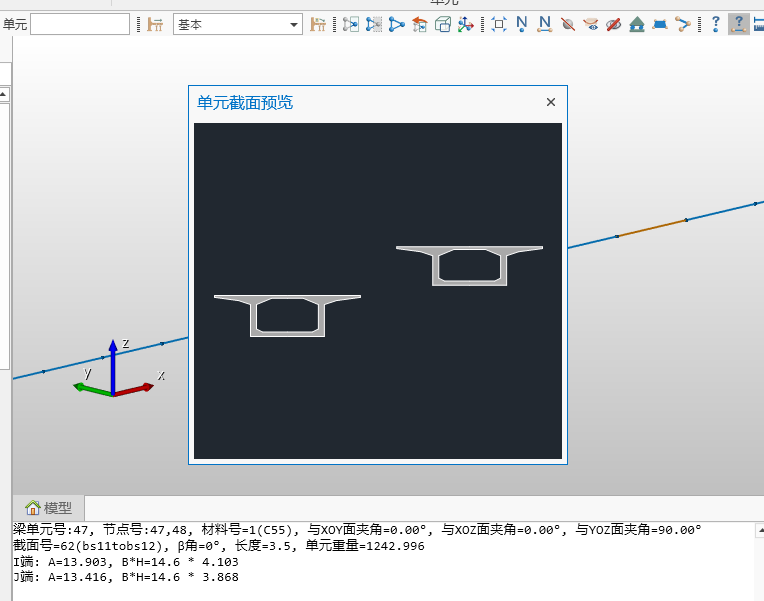
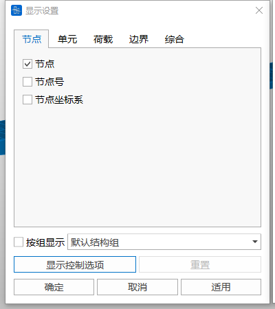
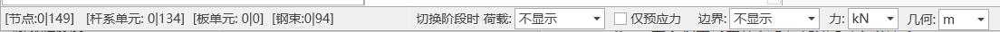

## 4.1选择

### 4.1.1单选

在模型窗口中，将鼠标光标移动到目标节点或单元附近，单击左键逐个选择节点或单元。再次点击已选中的节点或单元可取消选择。

### 4.1.2框选

在模型窗口中按住鼠标左键拖动形成选择框，框内的节点或单元将被选中。

### 4.1.3窗口解除选择

在模型窗口中拖动形成选择框，取消框内已选中的节点或单元。

### 4.1.4全选

选中模型中的所有节点和单元。

### 4.1.5取消全选

清除所有已选中的节点和单元。

### 4.1.6恢复前次选择

恢复最近一次的选择集状态。

## 4.2激活/钝化

通过激活或钝化功能，可在模型窗口中仅显示指定部分的模型，提高模型操作的聚焦性。

### 4.2.1激活

选择目标节点或单元，点击“激活”按钮后，仅显示被选中的部分。

### 4.2.2钝化

选择目标节点或单元，点击“钝化”按钮后，将隐藏被选中的部分。

### 4.2.3全部激活

恢复显示模型中所有被钝化的节点和单元。

### 4.2.4前次激活

回到最近一次激活/钝化操作的状态。

## 4.3消隐

隐藏模型结构的单元线，显示单元厚度和截面形状，以便更清晰地观察模型的实际几何效果。

## 4.4单元坐标系

显示每个单元的局部坐标系，使用 X、Y、Z 表示各坐标轴方向。

## 4.5观察缩小单元后的形状

仅在消隐状态下可用，用于观察缩小单元后的形状，便于更清晰地查看节点与单元的空间关系。

## 4.6显示ID

### 4.6.1显示节点ID

在模型窗口中显示每个节点的编号。

### 4.6.2显示单元ID

在模型窗口中显示每个单元的编号。

## 4.7隐藏节点

隐藏模型窗口中节点的显示，使模型观察更加直观、聚焦于其他要素。

## 4.8显示所有钢束

在模型窗口中显示定义的所有钢束形状，便于整体检查钢束布置情况。

## 4.9隐藏钢束名称

隐藏模型窗口中显示的钢束名称，简化模型视图。

## 4.10 显示所有**边界**

在模型窗口中显示模型中定义的所有边界条件。

## 4.11 **激活所有板单元**

激活模型中的所有板单元并使其可见。

## 4.12 **激活所有线单元**

激活模型中的所有线单元并使其可见。

## 4.13查询

### 4.13.1查询节点

点击“查询节点”后，选取模型中的任意节点，信息窗口将显示该节点的编号以及其在 X、Y、Z 三轴上的坐标值。

### 4.13.2查询单元

点击“查询单元”后，选取模型中的任意单元，信息窗口将显示该单元的详细信息，包括 I、J 端节点号、截面号等，同时支持单元截面预览。

### 4.13.3查询距离

在模型窗口中依次点击两个节点，信息窗口将显示两节点之间的直线距离以及沿 X、Y、Z 三方向的相对距离。

## 4.14树形菜单

### 4.14.1工作

列出从建模到分析、设计的一系列工作流程。右键点击每个步骤，可选择对应的功能操作。

### 4.14.2组

展示模型中设置的结构组、荷载组、边界组和钢束组等信息，便于查看和管理。

### 4.14.3表格

列出与结构相关的多项表格信息，例如节点表格、单元表格和特性值表格，供快速查询和编辑。

### 4.14.4树形菜单二

在屏幕右侧可展开第二个树形菜单，用于显示额外的功能或信息。

## 4.15分析

### 4.15.1运行分析

启动计算，进行模型的分析运算。

### 4.15.2前处理

切换到前处理环境，可进行模型创建、参数设置、荷载施加等操作。

### 4.15.3后处理

切换到后处理环境，用于查看分析结果，例如应力分布、位移情况等，进行结构检算、生成计算书，并支持数据可视化功能。

## 4.16窗口显示

### 4.16.1自动缩放

将当前激活的模型自动调整为适合窗口大小的比例，确保模型完整显示。

### 4.16.2窗口缩放

在窗口中点击形成矩形区域，放大该区域以查看细节。

### 4.16.3动态平移

通过鼠标拖拽，将模型向拖拽方向移动。

### 4.16.4动态旋转

通过鼠标拖拽旋转模型，使其按照拖拽方向动态旋转，调整视角。

### 4.16.5动态缩放

通过鼠标拖拽上下移动进行缩放，向上拖拽放大，向下拖拽缩小。

### 4.16.6顶面视图

切换为从+Z方向俯视模型的视图。

### 4.16.7右视图

切换为从+X方向观察模型的视图。

### 4.16.8前视图

切换为从-Y方向观察模型的视图。

### 4.16.9空间视图

切换为模型的等轴视图，提供三维立体观察效果。

## 4.17快速选择

根据单元类型、材料属性、截面特性或厚度等条件快速选择模型中的节点或单元，提高选择效率。

## 4.18施工阶段全部显示

选择某一施工阶段，点击“施工阶段全部显示”后，模型窗口将显示所有施工阶段的模型（灰色：尚未激活的部分，绿色：当前施工阶段激活的部分，蓝色：已完成激活的部分）。

## 4.19施工阶段缩放固定

开启该功能后，切换施工阶段时，模型显示比例保持不变。若未启用该功能，切换施工荷载时，模型将自动根据当前施工阶段激活结构调整显示比例，使当前激活结构充满工作窗口。

## 4.20单位制设置

可更改软件的显示单位制，例如长度、力或其他物理量的单位，以满足不同需求。

## 4.21显示

### 4.21.1显示设置

提供界面显示的整体设置。

按组显示：可预先定义结构组（例如荷载组、边界组）。勾选后，仅显示所选组的结果，包括单元编号、荷载或分析结果等。

### 4.21.2显示选项

可调整界面的显示参数。例如界面配色方案、节点拾取精度、单元坐标轴显示设置等。

## 4.22信息窗口

显示建模与分析过程中的操作信息，包括操作日志、警告提示和错误信息，便于追踪和检查模型状态。

## 4.23信息条

显示模型的整体状态信息，比如总节点数、单元数等，此外，信息条提供了选择切换阶段时荷载是否显示、边界是否显示、单位制快速切换等功能，提高操作效率。

