## 5.1 **项目信息**

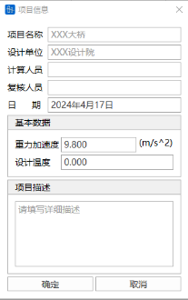

详见3.3  项目信息

## 5.2 **检查结构**

### 5.2.1 **显示重复单元**

- 功能：显示模型重复的单元。
- 命令：从主菜单中选择“结构” > “显示重复单元”。

### 5.2.2 **删除重复单元**

- 功能：删除模型重复的单元。
- 命令：从主菜单中选择“结构” > “删除重复单元”。

## 5.3 **悬索桥助手**

### 5.3.1 **空间缆找形**

详见`18. 空间缆索找形`

## 5.4 **建模助手** **横向分析**

- 功能：可通过选择具有参数化混凝土箱梁截面的单元，快速将单元截面划分成横向有限元模型。
- 命令：从主菜单中选择“结构”>“横向分析建模助手”;

- 输入
  - **通过截面选择**

    软件将在截面下拉框列出截面库中所有参数法混凝土箱梁截面，在右侧窗口显示箱梁截面的轮廓图。选择单元截面的I端或J端，选择单元材料，单击添加，软件自动生成对应混凝土箱梁截面的有限元模型，并在右侧窗口显示。可显示节点号、单元号及渲染图。

    
  - **通过单元选择**

    可手动输入一个单元号，选择单元截面的I端或J端，及单元材料，单击添加，软件自动生成对应单元位置截面的有限元模型，并显示在右侧窗口。可显示节点号、单元号及渲染图。也可通过

    

    按钮，在桥通主界面中选择一个单元，软件将自动添加有限元模型。添加后的单元将列在左下方的列表中。
  - **位置**

    当“通过截面选择”时，对于变截面，可选择需要生成变截面I端或者J端的截面有限元模型。当“通过单元选择”时，可选择单元的I端或J端截面生成有限元模型。
  - **材料**

    当“通过截面选择”时，需在“材料”下拉框中选择截面有限元模型的材料类型。当“通过单元选择”时，单元的材料即截面有限元模型的材料类型，无需再进行选择。
  - **纵向长度**

    该值用于确定生成的横向有限元模型的纵向长度，默认值为1m。用户可根据需要调整。
  - **最大网格**

    该值用于确定生成的横向有限元模型的单元长度，默认值为0.5m。用户可根据需要调整。
  - **导出横向分析模型**

    该功能用于将表格中当前所选的单元位置对应的截面导出为桥通有限元模型。用户需选择保存目录。当选择了“自动打开导出模型”选项，软件将在保存数据后自动打开桥通有限元模型。

    

## 5.5建模助手 悬浇法 连续梁/刚构

### 5.5.1功能

&#x20;  参数化生成 悬臂浇筑法**变截面连续梁桥**、**变截面连续刚构桥** 有限元模型。包含节点、单元、截面、钢束、荷载、沉降、施工阶段等，完整模型信息。

### 5.5.2命令

从主菜单中选择“结构”>“建模助手”>“悬浇/刚构”，打开建模助手。

### 5.5.3快速定义

快速定义全桥模型所需的主要信息，包含“总体”“构造”两部分。

#### 5.5.3.1总体

定义桥梁的总体相关参数

- **跨径组合：** 与全桥布跨相关参数（例：42.0+70.0+42.0；与“区段长度”关联；支持多跨）。
- **区段长度：** 现浇段/悬臂段设置（例：7.0,70.0,70.0,7.0；与“跨径组合”关联；支持多跨）。
- **节段长度：** 单元划分基准长度（例：2.0,3.5,3.5,2.0，表示现浇段/悬臂段分别以2.0/3.5m为基准进行节段自动划分，与“区段长度”中的数值对应；如需更详细的节段划分，在“基本信息 > 节段”中定义）。
- **梁端距离：** 主梁端部与墩中心线（或台背前缘线）的距离。
- **支座位置：** 支座与主梁端部的距离。
- **零号块：** 零号块主要尺寸（顶、底全长）。
- **悬浇方式：** 选择当前桥梁形式（连续梁/连续刚构）。
- **工程样例**\*

  快速定义 > 总体 > 工程样例

  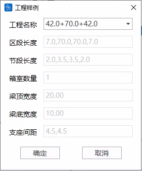

#### 5.5.3.2构造

定义全桥参考截面构造相关参数

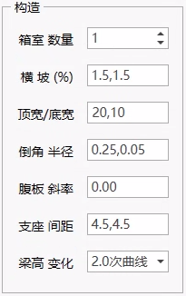

- **箱室数量：** 箱室数量（当前版本支持单室、双室）；
- **横坡：** 顶板横坡（例：1.5,1.5，表示左、右半侧均为1.5%）；
- **顶宽/底宽：** 顶、底宽度；

\*注：当为斜腹板变高梁时，各截面底宽为变化值，此处输入值表示全桥起始端底宽，其余位置将自动计算

- **倒角半径：** 倒角半径（例：0.25,0.05，分别表示悬臂根部/腹板底部倒角半径为0.25/0.05m）；
- **腹板斜率：** 腹板斜率（H/X；其中，可输入\[0.0]，表示直腹板）；
- **支座间距：** 支座分布（例：4.5,4.5，表示间距为4.5m的三支座；可为空，表示单支座）；
- **梁高变化：** 梁高变化形式（可选：线性、圆弧、1.8次曲线、2.0次曲线）。

#### 5.5.3.3示意图

实时显示“总体”“构造”相关参数相关含义

 示意图 > 总体 > 跨径组合(X) ")

 示意图 > 总体 > 区段长度(L) ")

 示意图 > 总体 > 节段长度(S) ")

### 5.5.4基本信息

本页包含“节段”与“截面”相关计算结果，并在相应**预览区域**中展示，使用者可快速浏览相关数据，也可根据需要进行更详细的修改或设置。

#### 5.5.4.1节段

快速浏览悬浇梁各部位“节段”计算结果。（单击任意条目，对应示意图也会同步显示）

双击列表中任意条目，可进行详细修改。其中，截面变化段（或腹板变厚段），可在对应的列中指定。

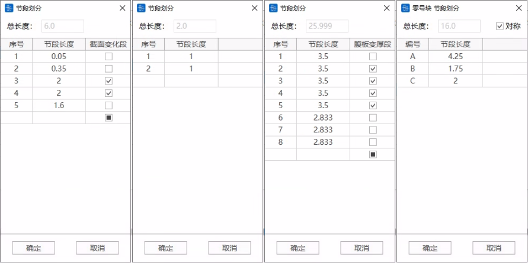

#### 5.5.4.2截面

快速浏览悬浇梁各部位的“截面”计算结果。s

- 单击任意条目，对应示意图也会同步显示

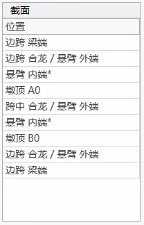

- 双击列表中的对应条目，可进行详细修改。

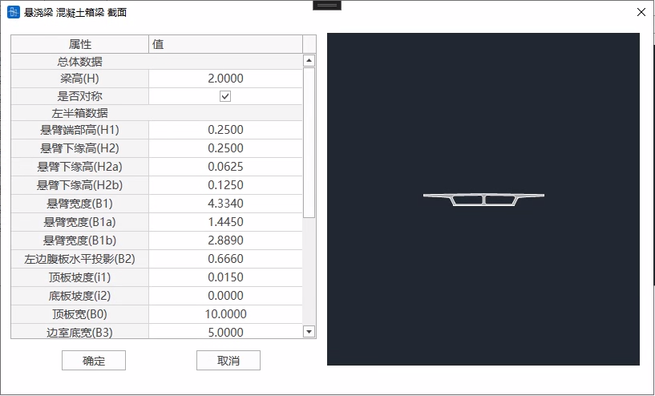

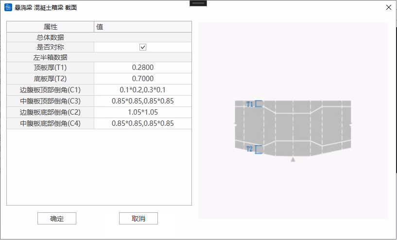

### 5.5.5钢束钢筋

本页包含“钢束”相关计算结果，并在相应**预览区域**中展示，使用者可快速浏览相关数据，也可根据需要进行更详细的修改或设置。

#### 5.5.5.1预应力钢束

- 墩顶钢束

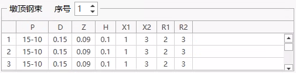

- 腹板钢束

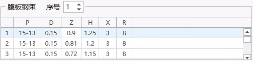

- 跨中钢束

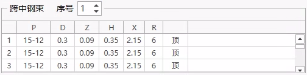

- 边跨钢束

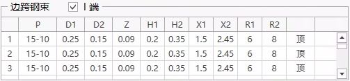

#### 5.5.5.2普通钢筋\*

（注：当前版本暂不支持“钢筋”信息，使用者如有需要，可在“检算”>“配筋”功能中设置）

#### 5.5.5.3示意图

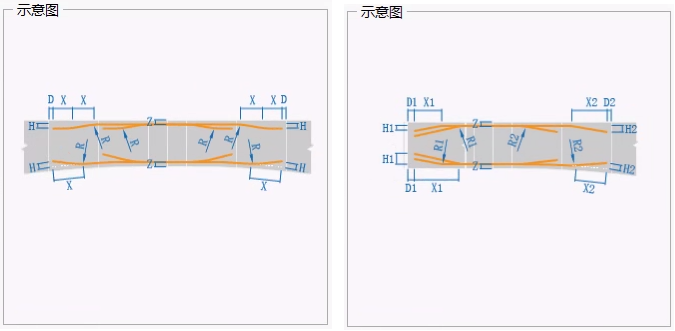

### 5.5.6其他信息

本页面中，定义模型中与荷载相关信息，以及生成模型内容的相关设置。

#### 5.5.6.1荷载

- **自重：** 定义自重相关荷载；
- **铺装：** 定义铺装相关荷载；
- **附属：** 定义附属荷载（包含：护栏、人行道）；
- **特殊：** 定义特殊荷载（例：线缆、管道等外挂荷载，其中，“边距”表示与梁边缘距离）；
- **温度：** 定义温度荷载（整体升温、降温；梁截面温度将根据规范自动计算）；
- **沉降：** 定义沉降量（边支点、中支点）（单位：mm）；
- **其他：** 定义悬浇梁相关荷载信息（包括：挂篮、吊架、合龙顶推力、合龙段配重、预应力等）；
- **移动：** 定义移动荷载相关信息。

#### 5.5.6.2结构

- **支座厚度：** 定义全桥支座厚度（单位：mm）；
- **支座刚度：** 定义全桥支座刚度（局部坐标系Dx/Dy/Dz/Rx/Ry/Rz）（单位：kN/m）；
- **支架刚度：** 定义现浇段支架刚度（局部坐标系Dx/Dy/Dz/Rx/Ry/Rz）（单位：kN/m）。

#### 5.5.6.3模型

控制模型所包含信息及生成模型。

注：导入截面特性相关信息时需要一定时间，快速浏览或查看模型时，可先不选择“截面特性”。

## 5.6建模助手 梁格法 混凝土箱梁

### 5.6.1功能

&#x20;  参数化生成 **梁格法** **混凝土箱梁桥** 有限元模型。可根据输入跨径等基本信息，帮助用户自动完成初步截面参数、梁段参数、截面划分、钢束特性及形状等内容的定义。可快速生成有限元模型，包含节点、单元、截面、钢束、荷载、沉降、施工阶段等，完整模型信息。

### 5.6.2命令

从主菜单中选择“结构”>“建模助手”>“梁格混凝土箱梁”，打开建模助手。

### 5.6.3快速定义

快速定义全桥模型所需的主要信息，包含“总体”“截面”“梁段”等部分。

#### 5.6.3.1总体

定义桥梁的总体相关参数

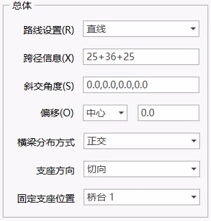

- **路线设置：** 定义全桥平曲线（可选直线、自定义、用户导入）。

  
  - **LX：** 任意段曲线弧长；
  - **Ri/Rj：** 任意段曲线两端半径（直线端可定义R=\[0.0]）。
- **跨径信息：** 定义全桥跨径布置（例：25.0+36.0+25.0；支持单跨/多跨）。
- **斜交角度：** 定义各支点位置斜交角度（例：0.0,0.0,0.0,0.0）。
- **偏      移：** 定义*设计中心线*与*参考中心线*偏移方式及偏移量。
- **横梁分布方式：** 选择虚拟横梁分布形式（正交、斜交）。
- **支座方向：** 选择支座方向（切向、固定支座连线方向）。
- **固定支座位置：** 选择固定支座位置（桥台1、桥墩1-N、桥台2）。

#### 5.6.3.2截面

定义全桥控制截面相关参数

在当前表格中，快速定义截面相关基本参数。还可以双击行末 **\[...]** 按钮，进行详细的定义或修改。

- **参数含义**
  - **H：** 梁高；
  - **Wt/Wb：** 宽度（顶板、底板）；
  - **Tt/Tb/Tw：** 板厚（顶板、底板、腹板）；
  - **R1/R2：** 倒角半径（顶板加掖、底板倒角）；
- **批量定义**

  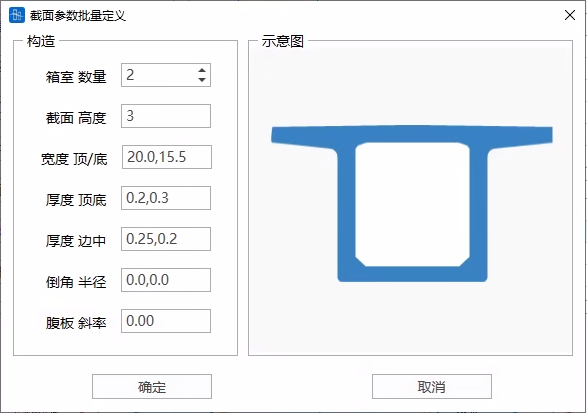
  - **箱室数量：** 箱室数量（当前版本支持箱室数量：1-5）；
  - **横坡：** 顶板横坡（例：1.5,1.5，表示左、右半侧均为1.5%）；
  - **宽度 顶/底：** 顶、底板宽度；
  > 📌\*注：当为斜腹板变高梁时，各截面底宽为变化值，此处输入值表示全桥起始端底宽，其余位置将自动计算
  - **厚度 顶/底：** 顶、底板厚度；
  - **厚度 边/中：** 腹板厚度（边腹板、中腹板）；
  - **倒角半径：** 倒角半径（例：0.25,0.05，分别表示悬臂根部/腹板底部倒角半径为0.25/0.05m）；
  - **腹板斜率：** 腹板斜率（H/X；其中，可输入\[0.0]，表示直腹板）。

#### 5.6.3.3梁段

定义全桥各跨梁段相关参数

- **参数含义**
  - **跨序：** 对应桥跨序号；
  - **参数：** 定义梁段参数及虚拟横梁分布
  - **E：** 支座与墩中心线距离（中支点位置等于\[0.0]）；
  - **S：** 支座与截面变化段起始位置之间的距离；
  - **C：** 截面变化段长度；
  - **横梁分布：** 设计中心线上横梁分布间距（跨中等截面范围内分布）；
  - **全长：** 当前跨全长。
- **示意图**

  

  

  

### 5.6.4截面划分

本页面中，可调整截面划分相关内容。主要包括 **划分设置** 与 **划分结果** 等内容。

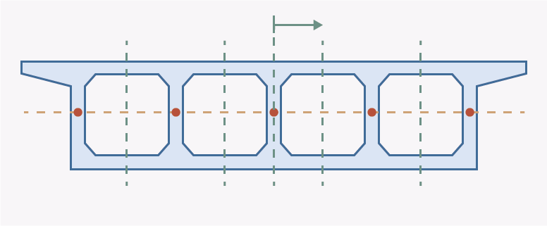

#### 5.6.4.1设置

- **当前截面：** 选择当前截面（已在“快速定义”页面中定义，当前页面可修改）；
- **划分选项：** 选择期望的截面划分方式（基于腹板、基于顶底板）；
- **形心轴一致：**选择是否需要将**划分截面**与**全截面**形心轴保持一致；
- **显示刚度：** 显示当前截面对应各部分划分截面截面几何特性结果。

#### 5.6.4.2结果

- **其它截面对齐：** 使其它截面与当前截面划分位置保持一致。
- **位置：** 截面划分位置；
- **顶部：** 截面划分位置顶部（与截面顶面变坡点水平距离，左负右正）；
- **底部：** 截面划分位置底部（与截面顶面变坡点水平距离，左负右正）。

### 5.6.5桥台桥墩

本页面中，可调整桥台、桥墩相关内容。主要包括 **桥台/桥墩支座布置**、**固定支座位置** 等内容。

#### 5.6.5.1支座布置

- **位置：** 参数位置描述（桥台1-2、桥墩1-N）；
- **间距：** 支座间距（与“偏心”参数协同）；
- **偏心：** 支座偏心（与“间距”参数协同）；
- **合计：** 当前位置支座范围距离；
- **横梁W/H：** 当前位置横梁宽度/高度（定义墩台位置矩形截面）；
- **固定支座位置：** 选择固定支座位置。

#### 5.6.5.2示意图

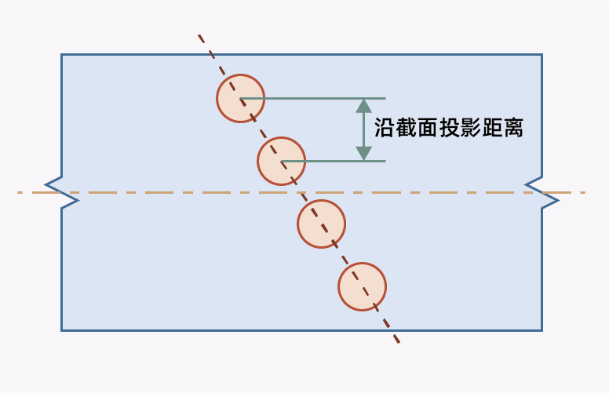

### 5.6.6钢束钢筋

本页面中，可调整预应力钢束及普通钢筋相关内容。

#### 5.6.6.1预应力钢束

- 顶板钢束

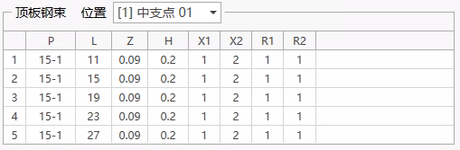

- 腹板钢束

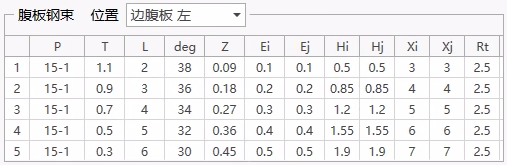

- 底板钢束

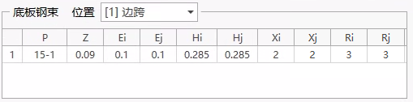

#### 5.6.6.2普通钢筋\*

（注：当前版本暂不支持“钢筋”信息，使用者如有需要，可在“检算”>“配筋”功能中设置）

### 5.6.7其他信息

本页面中，可定义模型中需要设置的荷载相关信息，以及生成模型的控制信息。

#### 5.6.7.1荷载

- **自重：** 定义自重相关荷载；
- **铺装：** 定义铺装相关荷载；
- **附属：** 定义附属荷载（包含：护栏、人行道）；
- **特殊：** 定义特殊荷载（例：线缆、管道等外挂荷载，其中，“边距”表示与梁边缘距离）；
- **温度：** 定义温度荷载（整体升温、降温；梁截面温度将根据规范自动计算）；
- **沉降：** 定义沉降量（边支点、中支点）（单位：mm）；
- **其他：** 定义桥梁相关荷载信息（包括：预应力等）；
- **移动：** 定义移动荷载相关信息。

#### 5.6.7.2结构

- **支座厚度：** 定义全桥支座厚度（单位：mm）；
- **支座刚度：** 定义全桥支座刚度（局部坐标系Dx/Dy/Dz/Rx/Ry/Rz）（单位：kN/m）。

#### 5.6.7.3模型

控制模型所包含信息及生成模型。

注：导入截面特性相关信息时需要一定时间，快速浏览或查看模型时，可先不选择“截面特性”。

## 5.7 **有效宽度**

**功能：** 可对跨度信息中定义的结构主梁单元自动进行有效宽度的计算，得到单元截面竖向抗弯惯性矩及形心位置的修正系数，用于考虑截面有效宽度。**对于混凝土箱梁、组合梁、钢梁参数截面，软件自动计算有效宽度。** 对于自定义截面，可通过自行定义翼缘线，腹板线确定截面的翼缘位置及翼缘宽度后，软件自动计算有效宽度。

### 5.7.1 **跨度信息**

- **功能：** 定义结构的跨度信息，用于计算有效宽度。
- **命令：** 从主菜单中选择“结构”>“跨度信息”;

- **输入**
  - **名称**

    输入当前跨度信息的名称。
  - **确定梁单元号**

    选择：光标定位到“主梁单元号”文本框后，在图上选中需定义跨度信息的梁单元起点和终止节点，软件自动将对应的单元号填充到文本框中。

    
    - 结构组：

      选择组成需定义跨度信息的梁单元结构组，软件自动将对应的单元号填充到文本框中。

      
    - 主梁单元号：

      可通过“选择”或“结构组”自动填充，可以手动输入单元号。
    - 支承节点号：

      用户手动输入支承节点号，以确定跨度信息定义对应的梁单元结构的边界条件。
  - **计算跨度**

    软件将根据以上输入的主梁单元号及支承节点号，自动计算出计算跨度值，用于计算有效宽度值。用户不能进行修改。若需修改，则需对支撑节点号进行修改。

    
  - **跨度信息列表**

    软件可根据需要定义多组跨度信息。列于表中。

### 5.7.2 混凝土梁

#### 5.7.2.1 **自定义截面翼缘宽度**

- **功能：** 对于自定义线圈截面类型，可采用该功能通过自行定义翼缘线，腹板线的方式，确定截面的翼缘位置及翼缘宽度，用于软件后续自动计算有效宽度。
- **命令：** 从主菜单中选择“结构”>“混凝土梁”>“自定义截面翼缘宽度”;

- **输入**
  - **截面列表**

    自动列出截面表格中所有自定义线圈截面，包括自定义线圈类型的变截面。
  - **批量定义**

    选择批量定义后，在左侧截面列表中选择多个截面，可进行批量定义。但需保证截面对应的线号一致。否则可能出错。

    
  - **定义上下翼缘和腹板**

    翼缘：通过输入线号或图中选择线条的方式，分别定义截面翼缘的顶面线，底面线。

    

    腹板：通过输入线号或图中选择线条的方式，分别定义每道腹板的左腹板线，右腹板线，及腹板与翼缘交叉的方向。

    

    添加：将已定义的翼缘，腹板添加到列表中。

    修改：修改已定义好的翼缘，腹板。

    删除：删除已定义好的翼缘，腹板。
  - **生成翼缘宽度**

    软件自动生成上下翼缘的翼缘宽度，以供检查确认。对于变截面，可分别查看I,J端的翼缘宽度。

    

#### 5.7.2.2 **计算有效宽度**

- **输入**
  - **跨度信息：** 选择需计算有效宽度的单元对应的跨度信息。
  - **设计规范：** 软件提供《公路钢筋混凝土及预应力混凝土桥涵设计规范》（JTG 3362－2018）和《铁路桥涵混凝土结构设计规范》（J 462－2017）两种有效宽度计算方法。
  - **计算：** 计算得到每个单元I端，J端的上下翼缘计算宽度，以及上下翼缘每一组成部分的有效宽度。同时绘制出有效宽度值沿跨度的变化图。

    

### 5.7.3 组合梁

#### 5.7.3.1 自定义截面翼缘宽度

- **功能：** 对于自定义组合梁截面类型，可采用该功能通过自行定义顶板翼缘线，腹板线的方式，确定截面的翼缘位置及翼缘宽度，用于软件后续自动计算有效宽度。
- **命令：** 从主菜单中选择“结构”>“组合梁”>“自定义截面翼缘宽度”;

- **输入**
  - **截面列表**

    自动列出截面表格中所有自定义组合截面，包括自定义组合梁的变截面。
  - **批量定义**

    选择批量定义后，在左侧截面列表中选择多个截面，可进行批量定义。但需保证截面对应的线号一致。否则可能出错。
  - **定义顶板翼缘和腹板**

    顶板翼缘：通过输入线号或图中选择线条的方式，定义截面顶板翼缘线，仅需要选择顶板最上缘线即可。

    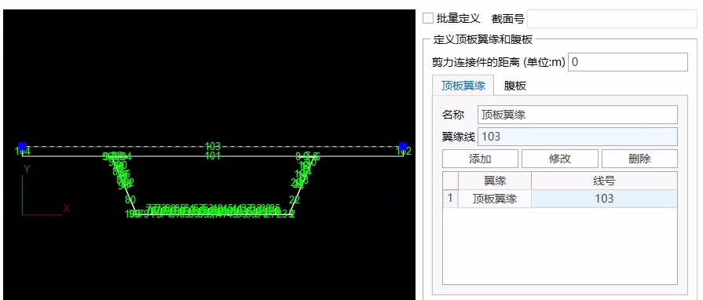

    腹板：通过输入线号或图中选择线条的方式，分别定义每道腹板的左腹板线，右腹板线。

    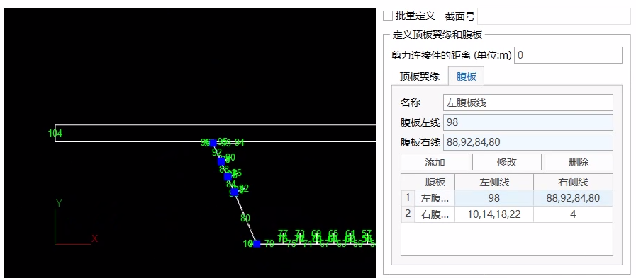

    添加：将已定义的翼缘，腹板添加到列表中。

    修改：修改已定义好的翼缘，腹板。

    删除：删除已定义好的翼缘，腹板。
  - **生成翼缘宽度**

    软件自动生成上下翼缘的翼缘宽度，以供检查确认。对于变截面，可分别查看I,J端的翼缘宽度。

#### 5.7.3.2 **计算有效宽度**

- **输入**
  - **跨度信息：** 选择需计算有效宽度的单元对应的跨度信息。
  - **设计规范：** 软件提供《公路钢混组合梁设计与施工规范》（JTG/T D64-01—2015）。
  - **剪力连接件的距离：** 剪力连接件中心间的距离。
  - **计算：** 计算得到每个单元I端，J端的上翼缘计算宽度，以及上下翼缘每一组成部分的有效宽度。同时绘制出有效宽度值沿跨度的变化图。

### 5.7.4 钢梁

#### 5.7.4.1 自定义截面翼缘宽度

- **功能：** 对于自定义线宽截面类型，可采用该功能通过自行定义顶、底板翼缘线，腹板线和加劲肋的方式，确定截面的翼缘位置及翼缘宽度，用于软件后续自动计算有效宽度。
- **命令：** 从主菜单中选择“结构”>“钢梁”>“自定义截面翼缘宽度”;

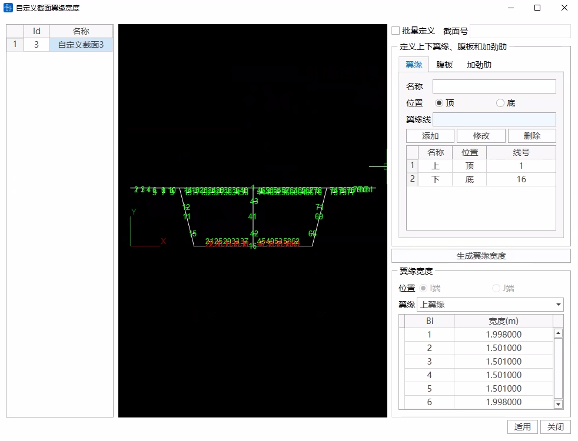

- **输入**
  - **截面列表**

    自动列出截面表格中所有自定义线宽截面，包括自定义线宽类型的变截面。
  - **批量定义**

    选择批量定义后，在左侧截面列表中选择多个截面，可进行批量定义。但需保证截面对应的线号一致。否则可能出错。
  - **定义顶板翼缘和腹板**
    - 翼缘：通过输入线号或图中选择线条的方式，定义截面顶、底板翼缘线。
      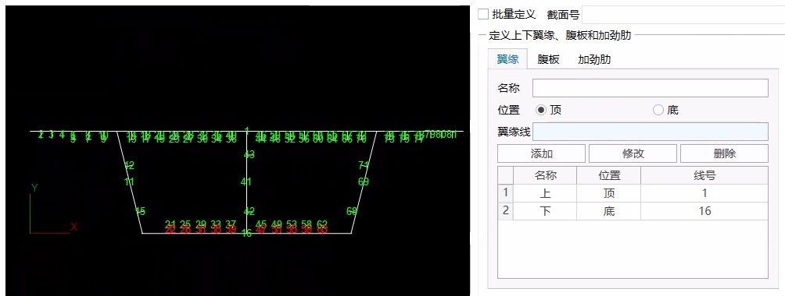
    - 腹板：通过输入线号或图中选择线条的方式，定义腹板线。
    > 如果腹板均为一条线，可以采用批量生成，如果一个腹板由多条线组成，则不能采用批量生成。
    > 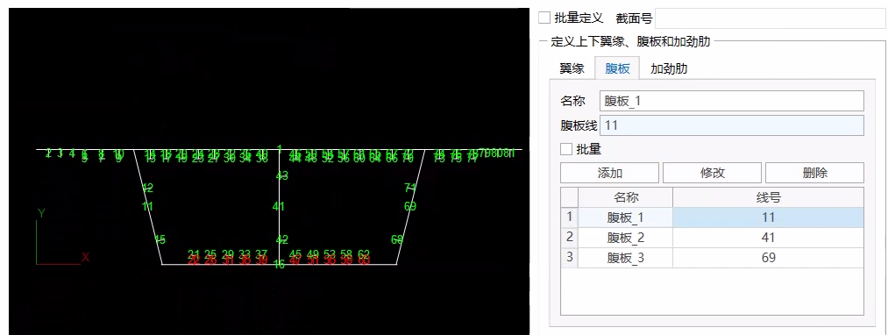
    - 加劲肋：通过输入线号或图中选择线条的方式，分别定义上翼缘、下翼缘的加劲肋。
      
    > 加劲肋线仅需要定义腹板线即可，如下图所示，仅需定义标红的线。
    > 
    添加：将已定义的翼缘，腹板添加到列表中。

    修改：修改已定义好的翼缘，腹板和加劲肋。

    删除：删除已定义好的翼缘，腹板和加劲肋。
  - **生成翼缘宽度**

    软件自动生成上下翼缘的翼缘宽度，以供检查确认。对于变截面，可分别查看I,J端的翼缘宽度。

#### 5.7.4.2 **计算有效宽度**

- **输入**
  - **跨度信息：** 选择需计算有效宽度的单元对应的跨度信息。
  - **设计规范：** 软件提供《公路钢结构设计规范》（JTG D64—2015）。
  - **加劲肋类型：** 刚性和柔性。
  - **弹性屈曲系数：** 根据规范取值。
  - **计算：** 计算得到每个单元I端，J端的上翼缘计算宽度，以及上下翼缘每一组成部分的有效宽度。同时绘制出有效宽度值沿跨度的变化图。

> 🧐**注意事项**
>
> 1. 加劲肋类型选择：加劲肋类型影响局部稳定计算折减系数计算。对于刚性加劲肋，加劲肋局部稳定计算宽度取加劲肋的间距；对于柔性加劲肋，按腹板间距或者腹板至悬臂端的宽度计算。
> 2. 钢梁有效宽度计算会给出三种结果，分别为，
>
>    （1）上翼缘考虑局部稳定折减系数，下翼缘考虑局部稳定折减系数；
>
>    （2）上翼缘考虑局部稳定折减系数和剪力滞，下翼缘考虑剪力滞；
>
>    （3）上翼缘考虑剪力滞，下翼缘考虑局部稳定折减系数和剪力滞。
>
>    对应生成的有效宽度系数边界组分别为`{跨度信息名称}_EW边界组1、{跨度信息名称}_EW边界组2、{跨度信息名称}_EW边界组3`。

### 5.7.5 **有效宽度系数表**

在计算得到有效宽度时，软件同时计算得到单元I端，J端竖向抗弯惯性矩的修正系数“Iy系数”及形心变化的修正系数“Δz”，列于表中。

同时自动生成“EW边界组”。在施工阶段激活该边界组，则软件将考虑该阶段的截面有效宽度。

施工阶段应力计算时，以当前施工阶段的截面特性为基准，竖向弯矩My产生的应力考虑竖向抗弯惯性矩及形心修正系数的影响，其它内力产生的应力及温度自应力不考虑修正系数的影响。运营阶段应力计算时，以最后一个施工阶段的截面特性为基准，同样采用上述原则计算。

> 如果在同一个施工阶段，相同单元激活多个有效宽度系数，则取最不利有效宽度系数计算应力值
