## 7.1 材料

### 7.1.1材料总表

桥通软件的材料创建工作采用停靠式总表集中管理，总表中提供添加、修改、删除、紧凑编号、全部删除、复制等常用操作。

- 命令：

  “主菜单”>“特性”>“材料”。

  从树形菜单中选择“工作”> “特性”>“材料”。

- 操作

  添加：添加新的材料。

  修改：在列表中选择相应材料，编辑或显示该材料。

  删除：在列表中选择相应材料，删除该材料。

  全部删除：删除列表中全部材料。

  紧凑编号：材料号重新从1开始编号。

  复制：在列表中选择要复制的材料，点击复制进行拷贝。

- 表格内容

  材料号：材料的序号。

  材料名称：用户定义材料名称。

  数值：弹性模量、泊松比、线膨胀系数等。

  数据库：包括混凝土、钢材、预应力、钢筋四种材料的基本数据。

### 7.1.2新建材料

- 功能：增加材料特性。
- &#x20;命令：

  “主菜单”>“特性”>“材料”>“添加”。

  从树形菜单中选择“工作”> “特性”>“材料”>“添加材料”。

- 输入

  **在材料和截面对话框，输入下列数据：**

  材料号: 定义材料编号

  名称: 定义材料名称

  材料类型: 选择材料类型：混凝土、钢材、预应力、钢筋或用户自定义类型。

  规范: 选择规范。

  构造系数：计算时，将按照原材料容重乘以构造系数考虑。

  数据库：选择材料数据库。

  数值：弹性模量、泊松比、线膨胀系数等。

### 7.1.3收缩徐变

- 功能：定义收缩徐变。
- 命令：“主菜单”>“特性”>“材料”>“收缩徐变”。

- 输入

  **在定义收缩徐变对话框，输入下列数据：**
  - 名称：收缩徐变名称
  - 规范：收缩徐变规范
  - 基本参数：

    《铁规 TB 10092-2017》中的徐变基本系数$\varphi_{f1}$、徐变系数计算参数λ，取值参见《公规 JTJ 023-85》附录四（见下图）。

    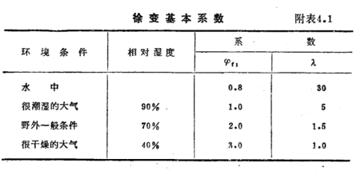
  - 收缩应变终极值:
    - 默认为0.00015, 可手动修改, 或者填0让桥通软件根据结构理论厚度自动计算收缩应变终极值

### 7.1.4 材料说明

#### 7.1.4.1 混凝土材料

- 规范 ASTM
  - 美国材料和试验协会国际组织（American Society for Testing and Materials ，ASTM）
  - 包含标号 Grade2500-Grade15000 的混凝土, 标号对应设计标准强度 $f'c$ = 2500lbf \~ 15000lbf , 即 $f'c$ = 2.5ksi \~ 15ksi的混凝土.
  - 混凝土的容重按照 表7.1 进行计算.
  - 混凝土的弹性模量计算方式如下:
    - 对于单位重 $w_{c}=0.145$ kcf 且设计抗压强度不超过10.0 ksi的普通混凝土，$E_{c}$ 按 公式7.1 计算：
      $$
      E_{c}=33,000 K_{1} {w_{c}}^{1.5} \sqrt{f_{c}^{\prime}\,} \tag{7.1}
      $$
    - 对于设计抗压强度超过10.0ksi, 但不大于15.0 ksi的普通混凝土，$E_{c}$ 按 公式7.2 计算：
      $$
      E_{c}=120,000 K_{1} {w_{c}}^{2.0} {f_{c}^{\prime}}^{0.33} \tag{7.2}
      $$
- 规范 AASHTO 17/20/24
  - AASHTO LRFD Bridge Design 2017/2020/2024版本(The American Association of State Highway and Transportation Officials)
  - 包含标号 Grade2500-Grade15000 的混凝土, 标号对应设计标准强度 $f'c$ = 2500lbf \~ 15000lbf , 即 $f'c$ = 2.5ksi \~ 15ksi的混凝土.
  - 混凝土的容重按照 表7.1 进行计算.
  - 混凝土的弹性模量计算方式如下
    - 对于设计抗压强度不大于15.0 ksi的普通混凝土，$E_{c}$ 按 公式7.3 计算：
      $$
      E_{c}=120,000 K_{1} {w_{c}}^{2.0} {f_{c}^{\prime}}^{0.33} \tag{7.3}
      $$

表 7.1 容重

| 材料                            | 单位重（kcf）/单位长度重量（klf） |
| ----------------------------- | -------------------- |
| 混凝土                           |                      |
| 轻质混凝土                         | 0.110\\\~0.135       |
| 普通混凝土（ \$f'c\$ ≤5.0 ksi）      | 0.145                |
| 普通混凝土（5.0< \$f'c\$ ≤15.0 ksi） | 0.140+0.001 \$f'c\$  |

# 7.2 截面

## **7.2.1截面总表**

- 命令：

“主菜单”>“特性”>“截面”。

从树形菜单中选择“工作”> “特性”>“截面”。

- 操作

  添加：添加新的截面。

  修改：在列表中选择相应截面，编辑或显示该截面。

  删除：在列表中选择相应截面，删除该截面。

  全部删除：删除列表中全部截面。

  紧凑编号：截面号重新从1开始编号。

  复制：在列表中选择要复制的截面，点击复制进行拷贝。

  导出Dxf：将截面导出为Dxf文件。

- 表格
  - **截面表格中的属性定义如下：**
    | 列标题   | 属性            |
    | ----- | ------------- |
    | 截面号   | 截面编号          |
    | 名称    | 截面名称          |
    | 面积    | 截面面积          |
    | Ix    | 绕单元坐标系x轴扭转惯性矩 |
    | Iy    | 绕单元坐标系y轴惯性矩   |
    | Iz    | 绕单元坐标系z轴惯性矩   |
    | z1、y1 | 角点1的z、y坐标。    |
    | z2、y2 | 角点2的z、y坐标。    |
    | Z3、y3 | 角点3的z、y坐标。    |
    | Z4、y4 | 角点4的z、y坐标。    |
  - **截面类型分为：**

    参数截面

    自定义截面

    特性截面

    组合截面

    组合梁截面

    变截面

## **7.2.2**参数截面

- 功能：定义参数截面。
- 命令：

  从主菜单中选择“特性” >“截面” >“添加截面”> “一般截面”>“参数截面”。

  从树形菜单中选择“工作”>“截面”>“添加截面”> “一般截面”>“参数截面”。

- 输入
  - **截面类型**

    选择所需的截面类型。参数截面包含16种类型。

    

    详见4.6.2.1 基本截面类型、4.6.2.2 混凝土截面类型、4.6.2.3 钢梁截面类型。
  - **截面号**

    新建截面的编号自动设置为当前最大截面号+1。
  - **名称**

    输入截面名称。
  - **几何信息**

    输入截面几何信息。
  - **偏心**

    显示当前的截面偏心。对齐点共10种方式：中心、中上、中下、左中、右中、左上、右上、左下、右下，以及用户自定义。如果选择自定义，则需要输入自定义偏心坐标。
  - **考虑剪切变形**

    选择是否考虑剪切变形。
  - **网格密度**

    输入网格密度
  - **查看截面特性**

    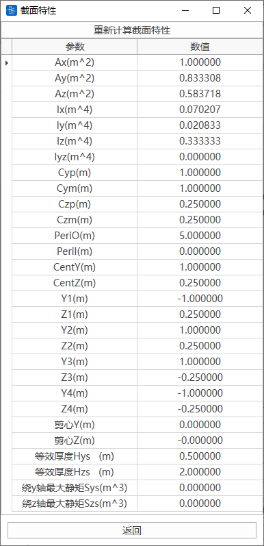

    
    - A: 横截面面积。
      - 基本几何与位置特性
        - Ax: 横截面面积 (A)。
        - Ay: 单元局部坐标系y轴方向的有效剪切面积。
          - 当不计剪切变形时，该特性值不起作用。
        - Az: 单元局部坐标系z轴方向的有效剪切面积。
          - 当不计剪切变形时，该特性值不起作用。
        - Peri:O: 截面外轮廓周长。
        - Peri:I:箱型或管型截面的内轮廓周长。
      - 抗弯与抗扭特性
        - Ix: 绕单元局部坐标轴x的扭转惯性矩。
        - Iy: 对单元局部坐标轴y的抗弯惯性矩。
        - Iz: 对单元局部坐标轴z的抗弯惯性矩。
        - Iyz: 对单元局部坐标系yz面内的惯性积。
        - Iw: 翘曲常数
        - Thw: 腹板厚度。（腹板厚度用于计算斜截面抗剪承载力、剪应力、主应力，不检算这些项目时可填0）
        - Tt: 顶板厚度。(影响铁路顶板温度模式下的计算，不考虑时可填0)
        - Cyp: 沿单元局部坐标系+y轴方向，单元截面中和轴到边缘纤维的距离。
        - Cym: 沿单元局部坐标系-y轴方向，单元截面中和轴到边缘纤维的距离。
        - Czp: 沿单元局部坐标系+z轴方向，单元截面中和轴到边缘纤维的距离。
        - Czm: 沿单元局部坐标系-z轴方向，单元截面中和轴到边缘纤维的距离。
        - Qyb: 沿单元局部坐标系z轴方向的剪切系数。
        - Qzb: 沿单元局部坐标系y轴方向的剪切系数。
        - Cent:y: 从截面最左侧到质心距离。
        - Cent:z: 从截面最下端到质心的距离。
      - 抗剪特性
        - 剪心Y:剪心到质心的横向距离
        - 剪心Z:剪心到质心的竖向距离
        - y1, z1: 截面左上方最边缘点的y、z坐标。
        - y2, z2: 截面右上方最边缘点的y、z坐标。
        - y3, z3: 截面右下方最边缘点的y、z坐标。
        - y4, z4: 截面左下方最边缘点的y、z坐标。
        - 等效厚度 Hys: 沿y轴方向用于计算剪应力的等效厚度。
        - 等效厚度 Hzs: 沿z轴方向用于计算剪应力的等效厚度。
        - 绕y轴最大静矩 Sys: 截面一半面积对中和轴的矩，即静矩或面积矩 (S)。
        - 绕z轴最大静矩 Szs: 截面一半面积对中和轴的矩，即静矩或面积矩 (S)。

### 7.2.2.1 基本截面类型

桥通内置的基本截面类型有：

矩形、圆形、圆管、箱型、实腹八边形、空腹八边形、内八角形、实腹圆端形、空腹圆端形、倒T形、T形、$I$字形。

##### **（1）矩形**

| 参数 | 备注 |
| -- | -- |
| W  | 长  |
| H  | 高  |

##### **（2）圆形**

| 参数 | 备注 |
| -- | -- |
| D  | 直径 |

##### **（3）圆管**

| 参数 | 备注 |
| -- | -- |
| D  | 直径 |
| t  | 壁厚 |

##### **（4）箱型**

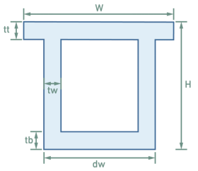

| 参数 | 备注  |
| -- | --- |
| W  | 长   |
| H  | 高   |
| dw | 底板宽 |
| tw | 腹板厚 |
| tt | 顶板厚 |
| tb | 底板厚 |

##### **（5）实腹八边形**

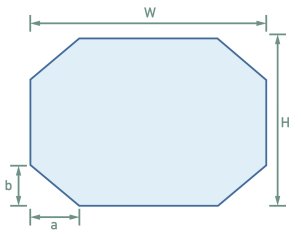

| 参数 | 备注  |
| -- | --- |
| W  | 长   |
| H  | 高   |
| a  | 倒角高 |
| b  | 倒角宽 |

##### **（6）空腹八边形**

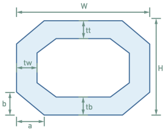

| 参数 | 备注  |
| -- | --- |
| W  | 长   |
| H  | 高   |
| tw | 腹板厚 |
| tt | 顶板厚 |
| tb | 底板厚 |
| a  | 倒角宽 |
| b  | 倒角高 |

##### **（7）内八角形**

| 参数 | 备注  |
| -- | --- |
| W  | 长   |
| H  | 高   |
| tw | 腹板厚 |
| tt | 顶板厚 |
| tb | 底板厚 |
| a  | 倒角宽 |
| b  | 倒角高 |

##### **（8）实腹圆端形**

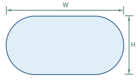

| 参数 | 备注 |
| -- | -- |
| W  | 长  |
| H  | 高  |

##### **（9）空腹圆端形**

| 参数 | 备注 |
| -- | -- |
| W  | 长  |
| H  | 高  |
| t  | 壁厚 |

##### **（10）T形**

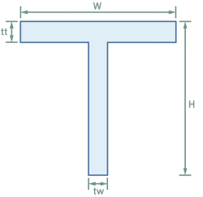

| 参数 | 备注  |
| -- | --- |
| W  | 长   |
| H  | 高   |
| tw | 腹板厚 |
| tt | 顶板厚 |

##### **（11）倒T形**

| 参数 | 备注  |
| -- | --- |
| W  | 长   |
| H  | 高   |
| tw | 腹板厚 |
| tt | 底板厚 |

##### **（12）I字形**

| 参数 | 备注  |
| -- | --- |
| Wt | 顶板宽 |
| Wb | 底板宽 |
| H  | 高   |
| tw | 腹板厚 |
| tt | 顶板厚 |
| tb | 底板厚 |

### 7.2.2.2 混凝土截面类型

桥通内置的混凝土截面类型有：

马蹄T形、I字型混凝土、混凝土箱梁。

#### **（1）马蹄T形**

| 参数 | 备注    |
| -- | ----- |
| W  | 长     |
| H  | 高     |
| tw | 腹板厚   |
| tt | 底板厚   |
| tb | 腹板底变高 |
| a1 | 顶板倒角宽 |
| b1 | 顶板倒角高 |
| a2 | 腹板倒角宽 |
| b2 | 腹板倒角高 |

#### **（2）I字型混凝土**

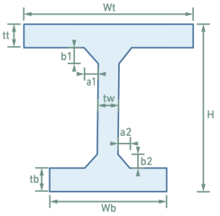

| 参数 | 备注    |
| -- | ----- |
| Wt | 顶板宽   |
| Wb | 底板宽   |
| H  | 高     |
| tw | 腹板厚   |
| tt | 顶板厚   |
| tb | 底板厚   |
| a1 | 顶板倒角宽 |
| b1 | 顶板倒角高 |
| a2 | 底板倒角宽 |
| b2 | 底板倒角高 |

#### （3）混凝土箱梁

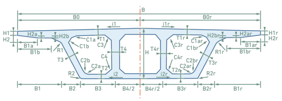

| 参数    | 备注       |
| ----- | -------- |
| B     | 桥面总宽     |
| N     | 箱室个数     |
| H     | 梁高       |
| 是否对称  |          |
| 左半箱数据 |          |
| i1    | 顶板坡度     |
| i2    | 底板坡度     |
| B0    | 顶板宽      |
| B1    | 悬臂宽度     |
| B1a   | 悬臂宽度     |
| B1b   | 悬臂宽度     |
| B2    | 左边腹板水平投影 |
| B3    | 边室底宽     |
| B4    | 中室底宽     |
| H1    | 悬臂端部高    |
| H2    | 悬臂下缘高    |
| H2a   | 悬臂下缘高    |
| H2b   | 悬臂下缘高    |
| T1    | 顶板厚      |
| T2    | 底板厚      |
| T3    | 边腹板厚     |
| T4    | 中腹板厚     |
| R1    | 悬臂根部倒角   |
| R2    | 边腹板外部下倒角 |
| C1    | 边腹板顶部倒角  |
| C2    | 边腹板底部倒角  |
| C3    | 中腹板顶部倒角  |
| C4    | 中腹板底部倒角  |
| 右半箱数据 |          |
| i1r   | 顶板坡度     |
| i2r   | 底板坡度     |
| B0r   | 顶板宽      |
| B1r   | 悬臂宽度     |
| B1ar  | 悬臂宽度     |
| B1br  | 悬臂宽度     |
| B2r   | 左边腹板水平投影 |
| B3r   | 边室底宽     |
| B4r   | 中室底宽     |
| H1r   | 悬臂端部高    |
| H2r   | 悬臂下缘高    |
| H2ar  | 悬臂下缘高    |
| H2br  | 悬臂下缘高    |
| T1r   | 顶板厚      |
| T2r   | 底板厚      |
| T3r   | 边腹板厚     |
| T4r   | 中腹板厚     |
| R1r   | 悬臂根部倒角   |
| R2r   | 边腹板外部下倒角 |
| C1r   | 边腹板顶部倒角  |
| C2r   | 边腹板底部倒角  |
| C3r   | 中腹板顶部倒角  |
| C4r   | 中腹板底部倒角  |

> 📌对于多箱室箱梁，中室底宽(B4)、中腹板厚(T4)、顶板宽（B0）、顶板坡度（i1），**可以填入多个数值，数值之间利用“|”分割**。中室底宽(B4)、中腹板厚(T4)利用“|”分割时**从箱梁两边往中间**控制参数大小。顶板宽（B0）、顶板坡度（i1） 利用“|” 分割时按照**从箱梁中间往两边**控制参数大小,顶板宽度个数要与顶板坡度个数相等。

### 7.2.2.3 钢梁截面类型

桥通内置的混凝土截面类型有：

带肋钢箱、带肋H截面、钢桁箱梁1、钢桁箱梁2、钢桁箱梁3、钢工字型带肋。

#### **（1）带肋钢箱**

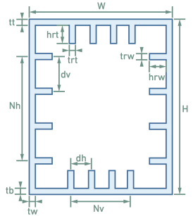

| 参数  | 备注    |
| --- | ----- |
| W   | 长     |
| H   | 高     |
| tw  | 腹板厚   |
| tt  | 顶板厚   |
| tb  | 底板厚   |
| hrt | 顶底板肋高 |
| trt | 顶底板肋厚 |
| hrw | 腹板肋高  |
| trw | 腹板肋厚  |
| dh  | 顶底板肋距 |
| dv  | 腹板肋距  |
| Nh  | 腹板肋数  |
| Nv  | 顶底板肋数 |

#### **（2）带肋H截面**

| 参数 | 备注    |
| -- | ----- |
| H  | 高     |
| B  | 长     |
| tw | 左右腹板厚 |
| tt | 横向腹板厚 |
| h1 | 腹板肋高  |
| t  | 腹板肋厚  |

#### **（3）钢桁箱梁1**

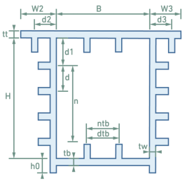

| 参数      | 备注            |
| ------- | ------------- |
| H       | 高（不包含顶板底板下悬臂） |
| B       | 长             |
| W2      | 左悬臂长          |
| W3      | 右悬臂长          |
| h0      | 下悬臂高          |
| Tw      | 腹板厚           |
| Tt      | 顶板厚           |
| Tb      | 底板厚           |
| h1      | 顶板肋高          |
| t       | 顶板肋厚          |
| h1      | 底板肋高          |
| t       | 底板肋厚          |
| d1      | 顶板与腹板肋距       |
| n       | 腹板肋数          |
| d       | 腹板肋距          |
| h1      | 腹板肋高          |
| t       | 腹板肋厚          |
| 左腹板肋位置d | 内/外           |
| 右腹板肋位置d | 内/外           |
| d2      | 左悬臂肋距         |
| h1      | 左悬臂肋高         |
| t       | 左悬臂肋厚         |
| b1      | 左悬臂肋顶距离       |
| b2      | 左悬臂肋底距离       |
| r       | 左悬臂肋倒角        |
| d3      | 右悬臂肋距         |
| h1      | 右悬臂肋高         |
| t       | 右悬臂肋厚         |
| b1      | 右悬臂肋顶距离       |
| b2      | 右悬臂肋底距离       |
| r       | 右悬臂肋倒角        |
| 顶底板肋数   | --            |
| 顶底板肋间距  | --            |

#### **（4）钢桁箱梁2**

| 参数     | 备注        |
| ------ | --------- |
| H      | 高         |
| B      | 长         |
| w2     | 左上悬臂长     |
| w3     | 右上悬臂长     |
| w4     | 左下悬臂长     |
| w5     | 右下悬臂长     |
| tw     | 腹板厚       |
| tt     | 顶板厚       |
| tb     | 底板厚       |
| h1     | 顶板肋高      |
| t      | 顶板肋厚      |
| h1     | 底板肋高      |
| t      | 底板肋厚      |
| d1     | 顶板与腹板肋的距离 |
| n      | 腹板肋数      |
| d      | 腹板距       |
| h1     | 腹板肋高      |
| t      | 腹板肋厚      |
| 左腹板肋位置 | 内/外       |
| 右腹板肋位置 | 内/外       |
| d2     | 左上悬臂肋距    |
| h1     | 左上悬臂肋高    |
| t      | 左上悬臂肋厚    |
| b1     | 左上悬臂肋顶距离  |
| b2     | 左上悬臂肋底距离  |
| r      | 左上悬臂肋倒角   |
| d3     | 右上悬臂肋距    |
| h1     | 右上悬臂肋高    |
| t      | 右上悬臂肋厚    |
| b1     | 右上悬臂肋顶距离  |
| b2     | 右上悬臂肋底距离  |
| r      | 右上悬臂肋倒角   |
| d4     | 左下悬臂肋距    |
| h1     | 左下悬臂肋高    |
| t      | 左下悬臂肋厚    |
| d5     | 右下悬臂肋距    |
| h1     | 右下悬臂肋高    |
| t      | 右下悬臂肋厚    |
| 顶底板肋数  | --        |
| 顶底板肋间距 | --        |

#### **（5）钢桁箱梁3**

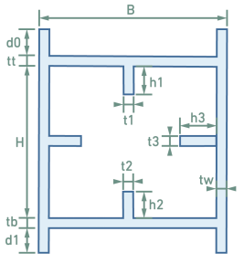

| 参数 | 备注    |
| -- | ----- |
| H  | 高     |
| B  | 长     |
| d0 | 上悬臂肋高 |
| d1 | 下悬臂肋高 |
| tw | 腹板厚   |
| tt | 顶板厚   |
| tb | 底板厚   |
| h1 | 顶板肋高  |
| t  | 顶板肋厚  |
| h1 | 底板肋高  |
| t  | 底板肋厚  |
| h1 | 腹板肋高  |
| t  | 腹板肋厚  |

#### **（6）钢工字型带肋**

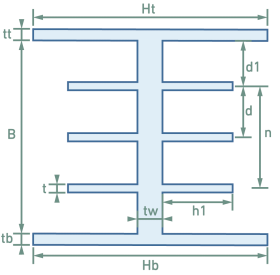

| 参数 | 备注        |
| -- | --------- |
| Ht | 顶板长       |
| Hb | 底板长       |
| B  | 中腹高       |
| Tt | 顶板厚       |
| Tb | 底板厚       |
| Tw | 腹板厚       |
| D1 | 顶板与腹板肋的距离 |
| n  | 肋数        |
| d  | 肋距        |
| h1 | 肋高        |
| t  | 肋厚        |

## **7.2.3**自定义截面

- 功能：定义自定义截面。
- 命令：

  从主菜单中选择“特性” >“截面” >“添加截面”> “一般截面”>“自定义截面”。

  从树形菜单中选择“工作”>“截面”>“添加截面”> “一般截面”>“自定义截面”。

- 输入
  - **截面类型**

    线圈

    线宽
  - **截面号**

    新建截面的编号自动设置为当前最大截面号+1。
  - **名称**

    输入截面名称。
  - **批量生成**

    批量生成多个相同截面。
  - **偏心**

    显示当前的截面偏心。对齐点共10种方式：中心、中上、中下、左中、右中、左上、右上、左下、右下，以及用户自定义。如果选择自定义，则需要输入自定义偏心坐标。
  - **考虑剪切变形**

    选择是否考虑剪切变形。
  - **网格密度**

    输入网格密度
  - **查看截面特性**

## **7.2.4特性**截面

- &#x20;功能：定义自定义截面。
- &#x20;命令：

  从主菜单中选择“特性” >“截面” >“添加截面”> “一般截面”>“自定义截面”。

  从树形菜单中选择“工作”>“截面”>“添加截面”> “一般截面”>“自定义截面”。

- 输入
  - **截面号**

    新建截面的编号自动设置为当前最大截面号+1。
  - **名称**

    输入截面名称。
  - **截面特性**

    输入截面特性值。
  - **偏心**

    显示当前的截面偏心。对齐点共10种方式：中心、中上、中下、左中、右中、左上、右上、左下、右下，以及用户自定义。如果选择自定义，则需要输入自定义偏心坐标。
  - **考虑剪切变形**

    选择是否考虑剪切变形。

## **7.2.5组合**截面

- 功能：定义组合截面。
- 命令：

  从主菜单中选择“特性” >“截面” >“添加截面”> “组合截面”。

  从树形菜单中选择“工作”>“截面”>“添加截面”> “组合截面”。

- 操作
  - **截面类型**

    钢管砼
  - **截面号**

    新建截面的编号自动设置为当前最大截面号+1。
  - **名称**

    输入截面名称。
  - **几何**

    输入截面几何参数。
  - **材料**

    输入截面材料系数：弹模比、容重比、泊松比、膨胀系数。或者从数据库中选择材料。
    - Es/Ec：钢与混凝土弹性模量之比
    - Ds/Dc：钢与混凝土容重之比。
    - Ps：钢梁泊松比
    - Pc：混凝土泊松比
    - Ts/Tc ：钢和混凝土的热膨胀系数之比
      
  - **偏心**

    显示当前的截面偏心。对齐点共10种方式：中心、中上、中下、左中、右中、左上、右上、左下、右下，以及用户自定义。如果选择自定义，则需要输入自定义偏心坐标。
  - **考虑剪切变形**

    选择是否考虑剪切变形。
  - **查看截面特性**
    > 📌组合截面的主/辅截面特性中的CentY和CentZ的取值为组合后截面的形心的偏移量。而组合截面的CentY和CentZ的取值为形心以截面包围框左下角为原点的偏移量
- **组合截面类型**

### 7.2.5.1 组合截面类型

软件内目前有两种类型：钢管砼、钢箱砼。

#### **（1）钢管砼**

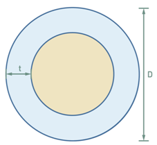

| 参数 | 备注   |
| -- | ---- |
| D  | 钢管直径 |
| t  | 钢管壁厚 |

#### **（2）钢箱砼**

| 参数 | 备注    |
| -- | ----- |
| W  | 长     |
| H  | 高     |
| dw | 钢箱底板宽 |
| tw | 钢箱腹板厚 |
| tt | 钢箱顶板厚 |
| tb | 钢箱底板厚 |

## **7.2.6**组合梁截面

- 功能：定义组合梁截面。
- 命令：

  从主菜单中选择“特性” >“截面” >“添加截面”> “组合梁截面”。

  从树形菜单中选择“工作”>“截面”>“添加截面”> “组合梁截面”。

- 操作
  - **截面类型**

    工字组合梁

    箱形组合梁

    自定义组合梁
  - **截面号**

    新建截面的编号自动设置为当前最大截面号+1。
  - **名称**

    输入截面名称。
  - **几何**

    输入截面几何参数。
  - **材料**

    输入截面材料系数：弹模比、容重比、泊松比、膨胀系数。或者从数据库中选择材料。
    - Es/Ec：钢与混凝土弹性模量之比
    - Ds/Dc：钢与混凝土容重之比。
    - Ps：钢梁泊松比
    - Pc：混凝土泊松比
    - Ts/Tc ：钢和混凝土的热膨胀系数之比
      
  - **偏心**

    显示当前的截面偏心。对齐点共10种方式：中心、中上、中下、左中、右中、左上、右上、左下、右下，以及用户自定义。如果选择自定义，则需要输入自定义偏心坐标。
  - **考虑剪切变形**

    选择是否考虑剪切变形。
  - **查看截面特性**
    > 📌组合梁截面的主/辅截面特性中的CentY和CentZ的取值为组合后截面的形心的偏移量。而组合截面的CentY和CentZ的取值为形心以截面包围框左下角为原点的偏移量
  - **自定义组合梁截面**

    输入分块数量，在图形视图绘制主材和辅材部分，再点击

    

    为主材和辅材定义几何和材料，点击后左键选取绘图窗口中线段后点击右键可完成选中。

    

### 7.2.6.1 组合梁截面类型

软件内目前有两种类型：工字组合梁、钢箱砼。

#### **（1）工字组合梁**

| 参数 | 备注    |
| -- | ----- |
| Wc | 辅材长   |
| Hc | 辅材高   |
| Wt | 主材顶板宽 |
| Wb | 主材底板宽 |
| H  | 主材高   |
| tw | 主材腹板厚 |
| tt | 主材顶板厚 |
| tb | 主材底板厚 |

#### **（2）钢箱砼**

| 参数 | 备注    |
| -- | ----- |
| Wc | 辅材长   |
| Hc | 辅材高   |
| W  | 主材长   |
| dw | 主材底板宽 |
| H  | 主材高   |
| tw | 主材腹板厚 |
| tt | 主材顶板厚 |
| tb | 主材底板厚 |

## **7.2.7**变截面

- 命令：

  “主菜单” > “特性”> “截面” > “变截面”。

  从树形菜单中选择“工作”> “特性”>“截面” > “变截面”。

- 操作
  - **截面号**

    新建截面的编号自动设置为当前最大截面号+1。
  - **名称**

    输入截面名称。
  - **截面类型**

    参数截面

    自定义截面
  - **截面形状**

    输入截面几何形状。若为自定义截面则选择线圈或线宽截面。
  - **变化系数取值**

    变化系数=1时，代表沿单元局部坐标系x轴方向按线性变化；当变化系数=2时，代表沿单元局部坐标系x轴方向按抛物线变化。

    以矩形梁截面为例，高度H按1.8次抛物线$H=Ax^{1.8}+Bx+C$变化，截面宽度L不变，弱轴惯性矩$H\times$$L^{3}/12$，弱轴惯性矩的变化规律即为1.8次抛物线。
  - **考虑剪切变形**

    选择是否考虑剪切变形。
  - **自动排序**

    选择是否自动排序，自动排序默认按照I最长线段作为首线段排序，对应J端首线段默认取为距离I端最近的线段（且与I端首线段宽度一致），用户可以通过改变I端最长线段的宽度与J端对应线段的宽度（增加0.1mm不影响截面特性）来自行确定排序规则，进而保证I端和J端排序时首线段对应。

## **7.2.7**变截面**组**

- 功能：将具体相同变截面的单元组成一个组，原变截面的I、J端变为变截面组的I端和J端，程序自动计算变截面组内单元的截面特性值。
- 命令：从主菜单中选择“特性” >“变截面组”。

- 操作
  - **选中的单元**

    在模型窗口中进行选择。
  - **名称**

    输入截面组名称。
  - **宽度Y、高度Z**
    - 线性：线性变化。
    - 非线性：按照右侧填写的数字进行曲线变化，例：填写2，做二次曲线变化。
    - 对称面：

      截面变化曲线的切线与单元坐标系x轴平行的位置，可以用距离基准点的距离来表示。
      - 基准点：选择基准点是I端还是J端。
      - 距离：从基准点到对称平面的沿单元坐标系x轴的距离。
      > 🧐注：如果需要定义非线性曲线，需要三个不在同一直线的已知点，对称面位置为非线性曲线的第三点位置（I、J端已知）
  - **添加**

    添加新的变截面组。
  - **编辑**

    对变截面组列表选择的变截面进行编辑。
  - **删除**

    删除变截面组。
  - **转换为变截面**

    程序将按照变截面组内单元个数，根据程序计算的变截面组内插值截面特性值，生成新的变截面，变截面组转换为变截面后，变截面组的信息将自动删除。

## **7.2.7参数化变截面组**

- 功能：桥通对于**参数类型截面**支持形成**参数化变截面组**的功能（自定义线圈截面，自定义线宽截面暂不支持），用户可以在参数化变截面组内按照**线性或非线性规律**修改变截面组内截面的**参数尺寸**。
- 命令：从主菜单中选择“特性” >“参数化变截面组”。

想要生成一个参数化变截面组，可按照一下流程操作

- 选择组内单元

  按照设计需要选择进入变截面组的单元。此处注意：变截面组内的单元均需要为**同一个变截面**。选中单元后左侧操作面板中**截面类型**会自动识别为当前的变截面类型，如果截面类型为空，则不支持对此类截面添加参数化变截面组。

  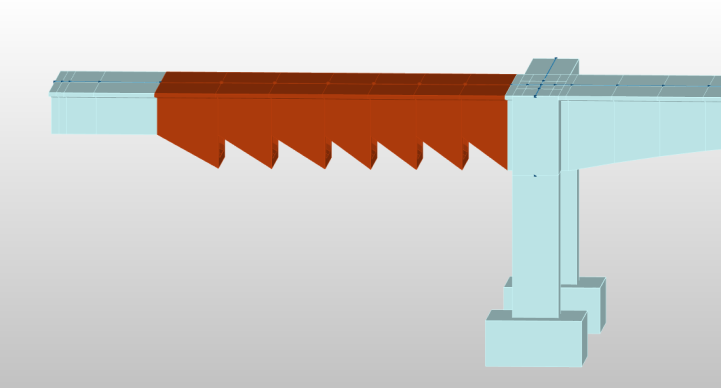
- 根据单元截面选择需要改变尺寸的参数

  

  在“定义参数“处选择“添加”, 打开“定义参数变化趋势”面板。并且选择需要改变尺寸的参数，参数名称会自动根据当前变截面的尺寸参数进行确定。

  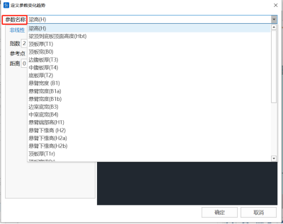

  定义参数数值的变化趋势有**非线性**和**自定义**两种方式。

  **非线性**：参数呈现非线性变化趋势，例如此例中梁高需要从支点到零号块处呈现2次变化趋势，则此处指数填写2，参考点填写I端，距离填写0。

  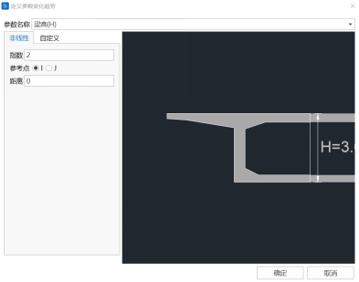

  **自定义**：参数呈现线形变化趋势,例如此例子中边腹板厚度T3从变截面组起始I端13.05m处变为0.48m厚,再过3m处变为0.7m厚,则按照图中表格填写变化趋势

  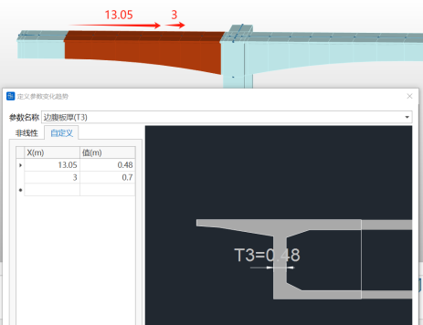
- 点击添加

  

  完成定义参数后，即可添加一个变截面组。图中已经添加了四个参数化变截面组。

  **注意**：如果某一个参数化变截面组的截面尺寸需要发生变化，则在列表中选中该组，程序会自动选中相关单元并显示其组内参数。在“定义参数”中根据需求编辑好参数后，点击“编辑”则可完成对参数化变截面组的编辑。

## **7.2.7查询截面**

- 功能：查询截面信息。
- 命令：从主菜单中选择“特性” >“查询截面”。

在模型视图中点击模型查询的单元，即可快速查看选择单元的截面预览，如果是变截面，预览窗口会显示I（左）J（右）端截面的预览图，文本区域会显示截面基本信息。

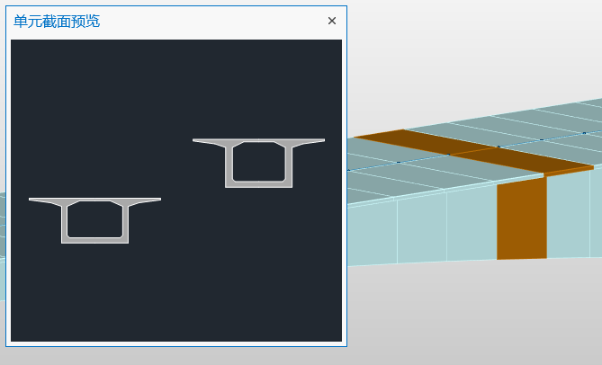

# 7.3 板厚

桥通中对于板单元厚度定义有两种方式：普通板厚度和加劲肋板厚度。

### 7.3.1普通板厚

板单元采用普通板厚时，板单元为普通板。

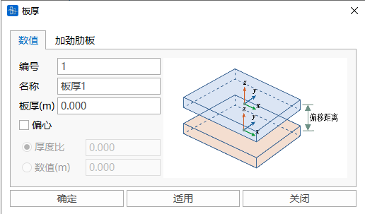

### 7.3.2加劲肋板厚度

板单元采用加劲肋板厚度时，板单元为正交异性板单元，板单元在横向和纵向截面有加劲肋，目前提供U型加劲肋和T型加劲肋。

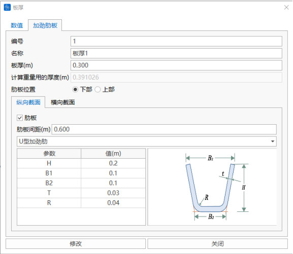

对于U型加劲肋的抗扭刚度Ix，采用薄壁封闭型管截面的抗扭刚度进行修正，公式

$$
I_{x}=\frac{4 A^{2}}{\oint d_{s} / t}
$$

其中，A为封闭管截面的面积，$\oint d_{s}$为薄壁截面的宽度中心线周长，t为厚度。

转为计算模型时，将采用加劲肋板厚度的板单元进行以下转化：

（1）正交异性板单元由普通板单元和等效梁单元组成；

（2）加劲肋个数$N$，其中$length$为板单元边长，$space$为肋板间距

$$
N=\frac{\text { length }}{\text { space }} \text{(向下取整)}
$$

（3）单个加劲肋截面特性为$A_{0 x}, \quad I_{0 x}, \quad I_{0 y}, \quad I_{0 z}, \quad Cent Y, \quad CentZ$

（4）梁单元截面等效，

$$
\begin{array}{c}\\A_{x}=\left(N \times A_{0 x}\right) / 2 \\\\I_{x}=\left(N \times I_{0 x}\right) / 2 \\\\I_{y}=\left(N \times I_{0 y}\right) / 2 \\\\I_{z}=\sum_{i}^{N}\left(I_{0 z}+A_{0 z} \times d_{i}^{2}\right) / 2\\\\\text{截面偏心} (CentY, CentZ)\\\end{array}
$$

其中$d_i$为第$i$加劲肋到板中心位置的水平距离。

### 7.3.3厚度表格

厚度表格中可以修改已经添加厚度的ID、名称、厚度信息，也可以通过表格粘贴的操作批量添加厚度信息。

