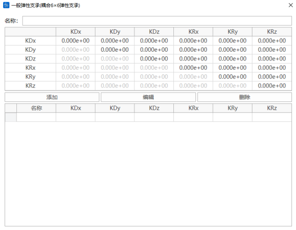
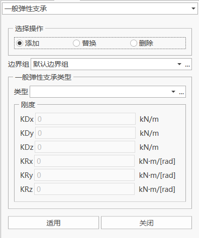
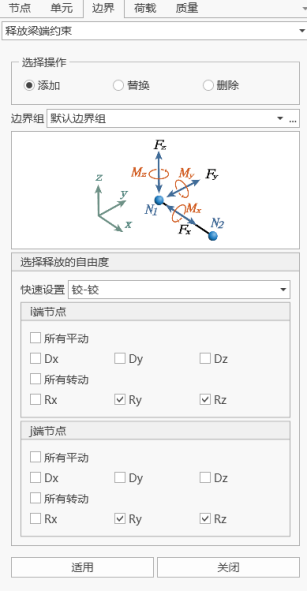

# 08. 边界

## 目录

- [8.1一般支承](#81一般支承)
- [8.2弹性支承](#82弹性支承)
- [8.3一般弹性支承](#83一般弹性支承)
  - [8.3.1 定义一般弹性支承类型](#831-定义一般弹性支承类型)
  - [8.3.2 一般弹性支承](#832-一般弹性支承)
- [8.4主从约束](#84主从约束)
- [8.5弹性连接](#85弹性连接)
- [8.6约束方程](#86约束方程)
- [8.7释放梁端约束](#87释放梁端约束)
- [8.8节点坐标系](#88节点坐标系)
- [8.9边界非线性单元](#89边界非线性单元)
  - [8.9.1边界非线性单元特性](#891边界非线性单元特性)
    - [（1）粘滞阻尼器](#1粘滞阻尼器)
    - [（2）支座摩阻
      ](#2支座摩阻)
    - [（3）滑动摩擦摆
      ](#3滑动摩擦摆)
    - [（4）钩](#4钩)
    - [（5）缝](#5缝)
  - [8.9.2边界非线性单元连接](#892边界非线性单元连接)
- [8.10边界组](#810边界组)
- [8.11边界表格](#811边界表格)

# 8.1一般支承

- 功能：约束节点6个方向的自由度。
- 命令：

  “主菜单”>“边界”>“一般支承”。

  从树形菜单中选择“工作”> “边界”>“一般支承”。

- 输入
  - **边界组**

    选择一般支承所属的边界组。默认选择“边界默认”组。当需要添加和编辑边界组时，可以点击右面的“…”按钮，将弹出"边界组定义"对话框。&#x20;
  - &#x20;**所选节点号**

    点击进入节点号文本框后，在模型窗口中选择节点添加一般支承。亦可直接输入节点号。
  - **约束自由度**

    D-ALL：全部平移自由度。

    Dx：整体坐标系X轴方向的平移自由度。

    Dy：整体坐标系Y轴方向的平移自由度。

    Dz：整体坐标系Z轴方向的平移自由度。

    R-ALL：全部旋转自由度。

    Rx：绕整体坐标系X轴方向的旋转自由度。

    Ry：绕整体坐标系Y轴方向的旋转自由度。

    Rz：绕整体坐标系Z轴方向的旋转自由度。
  - 附加参数

    

    附加参数仅在施工阶段计算的时候起作用

    (1)如果在施工阶段安装位置为变形前，则一般支承的安装位置采用附加参数输入的初始位移；

    (2)如果在施工阶段安装位置为变形后，则一般支承安装在变形后的位置，附加参数不再起作用。
  - 操作

    添加：输入新的一般支承。

    替换：替换先前输入的一般支承。

    删除：删除先前输入的一般支承。

| 列标题 | 属性                   |
| --- | -------------------- |
| 节点号 | 节点编号                 |
| Dx  | 整体坐标系X轴方向的平移自由度约束符号  |
| Dy  | 整体坐标系Y轴方向的平移自由度约束符号  |
| Dz  | 整体坐标系Z轴方向的平移自由度约束符号  |
| Rx  | 绕整体坐标系X轴方向的旋转自由度约束符号 |
| Ry  | 绕整体坐标系Y轴方向的旋转自由度约束符号 |
| Rz  | 绕整体坐标系Z轴方向的旋转自由度约束符号 |
| 边界组 | 该一般支承所属的边界组名称        |

> 🧐自由度约束符号规定1为约束，0为不约束。

# 8.2**弹性支承**

- 功能：输入弹簧刚度在节点上定义弹性支承。
- 命令：

  “主菜单”>“边界”>“弹性支承”。

  从树形菜单中选择“工作”> “边界”>“弹性支承”。

- 输入
  - **边界组**

    选择弹性支承所属的边界组。默认选择“边界默认”组。当需要添加和编辑边界组时，可以点击右面的“…”按钮，将弹出"边界组定义"对话框。
  - **所选节点号**

    点击进入节点号文本框后，在模型窗口中选择节点添加弹性支承。亦可直接输入节点号。
  - **支承定义**

    KDx：整体坐标系X轴方向的弹性刚度。

    KDy：整体坐标系Y轴方向的弹性刚度。

    KDz：整体坐标系Z轴方向的弹性刚度。

    KRx：绕整体坐标系X轴方向的弹性刚度。

    KRy：绕整体坐标系Y轴方向的弹性刚度。

    KRz：绕整体坐标系Z轴方向的弹性刚度。

    其中，KDx、KDy、KDz可选择“线性”（即可受拉或受压）、“只受拉”、“只受压”三项刚度标识。
  - **方向**

    以节点坐标系为基准

    
  - **附加参数**

    

    附加参数仅在施工阶段计算的时候起作用

    (1)如果在施工阶段安装位置为变形前，则一般支承的安装位置采用附加参数输入的初始位移；

    (2)如果在施工阶段安装位置为变形后，则一般支承安装在变形后的位置，附加参数不再起作用。
  - **操作**

    添加：输入新的弹性支承。

    替换：替换先前输入的弹性支承。

    删除：删除先前输入的弹性支承。

| 列标题 | 属性                               |
| --- | -------------------------------- |
| 节点号 | 节点编号                             |
| Kx  | 整体坐标系X轴方向(或已定义的节点坐标系x方向)的弹性支承刚度  |
| Ky  | 整体坐标系Y轴方向(或已定义的节点坐标系y方向)的弹性支承刚度  |
| Kz  | 整体坐标系Z轴方向(或已定义的节点坐标系z方向)的弹性支承刚度  |
| Krx | 绕整体坐标系X轴(或已定义的节点坐标系x方向)的转动弹性支承刚度 |
| Kry | 绕整体坐标系Y轴(或已定义的节点坐标系y方向)的转动弹性支承刚度 |
| Krz | 绕整体坐标系Z轴(或已定义的节点坐标系z方向)的转动弹性支承刚度 |
| 边界组 | 该弹性支承所属的边界组名称                    |

# 8.3一般**弹性支承**

### 8.3.1 **定义一般弹性支承类型**

- 功能：输入节点一般弹簧支承刚度。定义了节点局部坐标系时，自由度的方向为局部坐标系方向，否则为整体坐标系方向。

> 🧐主对角元素上的刚度需要大于主对角元素所在行和列的非对角元素的刚度

### 8.3.2 **一般弹性支承**

- 功能：选择一般弹簧刚度类型在节点上定义一般弹性支承
- 命令：

&#x20;  “主菜单”>“边界”>“一般弹性支承”。

&#x20;    从树形菜单中选择“工作”> “边界”>“一般弹性支承”。

- **边界组**

  选择弹性支承所属的边界组。默认选择“边界默认”组。当需要添加和编辑边界组时，可以点击右面的“…”按钮，将弹出"边界组定义"对话框。
- **所选节点号**

  点击进入节点号文本框后，在模型窗口中选择节点添加一般弹性支承。亦可直接输入节点号。
- **一般弹性支承类型**

  选择一般弹性支承类型。当需要添加和编辑一般弹性支承类型时，可以点击右面的“…”按钮，将弹出"定义一般弹性支承类型"对话框。 

# 8.4主从约束

- 功能：主从约束功能可使某一节点（从节点）的任意自由度从属于另一个节点（主节点）。
- 命令：

  “主菜单”>“边界”>“主从约束”。

  从树形菜单中选择“建模表格”> “边界”>“主从约束”。

- 输入
  - **边界组**

    选择主从约束所属的边界组。默认选择“边界默认”组。当需要添加和编辑边界组时，可以点击右面的“…”按钮，将弹出"边界组定义"对话框。
  - **主从节点定义**
    主节点号：点击鼠标进入主节点号文本框后，在模型窗口中选择节点添加主节点。亦可直接输入主节点号。

    从节点号：点击鼠标进入从节点号文本框后，在模型窗口中选择从节点。亦可直接输入从节点号。
  - **约束自由度**

    D-ALL：全部平移自由度。

    Dx：整体坐标系X轴方向的平移自由度。

    Dy：整体坐标系Y轴方向的平移自由度。

    Dz：整体坐标系Z轴方向的平移自由度。

    R-ALL：全部旋转自由度。

    Rx：绕整体坐标系X轴方向的旋转自由度。

    Ry：绕整体坐标系Y轴方向的旋转自由度。

    Rz：绕整体坐标系Z轴方向的旋转自由度。
  - **复制**

    方向：整体坐标系X、Y、Z

    距离：[复制间隔，例如，1，3@2.5，@前面为数量，@后面为间隔距离](mailto:复制间隔，例如，1，3@2.5，@前面为数量，@xn--siqw5l080b92q3hjp1ae5b "复制间隔，例如，1，3@2.5，@前面为数量，@后面为间隔距离")

    注意：复制位置需要有节点，否则复制不成功
  - **操作**

    添加：输入新的主从约束。

    删除：删除先前输入的主从约束。

| 列标题  | 属性                   |
| ---- | -------------------- |
| 主节点号 | 主节点编号                |
| 从节点号 | 从节点编号                |
| Dx   | 整体坐标系X轴方向的平移自由度约束符号  |
| Dy   | 整体坐标系Y轴方向的平移自由度约束符号  |
| Dz   | 整体坐标系Z轴方向的平移自由度约束符号  |
| Rx   | 绕整体坐标系X轴方向的旋转自由度约束符号 |
| Ry   | 绕整体坐标系Y轴方向的旋转自由度约束符号 |
| Rz   | 绕整体坐标系Z轴方向的旋转自由度约束符号 |
| 边界组  | 该主从约束所属的边界组          |

> 🧐自由度约束符号规定1为约束，0为不约束。

> 🧐主节点不能作为从节点、从节点不可以做支承单元、从节点的某个自由度不能从属于多个的自由度。

# **8.5弹性连接**

- 功能：创建或删除弹性连接。两个节点连接形成弹性连接。
- 命令：

  “主菜单”>“边界”>“弹性连接”。

  从树形菜单中选择“建模表格”> “边界”>“弹性连接”。

- 输入
  - **边界组**

    选择弹性连接所属的边界组。默认选择“边界默认”组。当需要添加和编辑边界组时，可以点击右面的“…”按钮，将弹出"边界组定义"对话框。
  - **类型**

    一般：一般弹性连接

    刚性：刚性弹性连接

    只受拉：只受拉弹性连接

    只受压：只受压弹性连接
  - **约束**

    KDx：单元局部坐标系x轴方向的平移自由度。

    KDy：单元局部坐标系y轴方向的平移自由度。

    KDz：单元局部坐标系z轴方向的平移自由度。

    KRx：绕单元局部坐标系x轴方向的旋转自由度。

    KRy：绕单元局部坐标系y轴方向的旋转自由度。

    KRz：单元局部坐标系z轴方向的旋转自由度。
  - **剪切弹簧位置**

    输入剪切型弹性支承在弹性连接单元的位置。该项主要为了考虑弹性支承两端因剪力传递的弯矩。当弹性连接两端作用有弯矩和剪力时，弯矩通过弹性连接的旋转刚度传递，剪力引起的弯矩通过定义的剪切型弹性支承位置通过计算后进行传递。

    距离I端距离比：输入局部坐标系y、z轴方向的剪切型弹性支承的位置(按到端点I的距离比输入)。

    （1）一般弹性连接可以自定义设置距离比，若不考虑剪切弹簧位置时，距离I端距离比默认为0；

    （2）刚性弹性连接自动默认为0.5；

    （3）仅受拉或者仅受压不设置剪切弹簧位置。
  - **注意事项**
    1. 弹性连接在施工阶段的安装方式全部为变形法安装；
    2. 如果弹性连接两点不重叠，就按弹性连接自身的坐标系（同梁单元）；如果弹性连接两点重叠，则弹性连接坐标系与整体坐标系一致。
  - **操作**

    添加：输入新的弹性连接。

    删除：删除先前输入的弹性连接。

    

# **8.6约束方程**

- 功能：

  约束方程是一种联系自由度值的线性方程，其形式如下:

  $\operatorname{Const}=\sum_{I=1}^{N}(Coefficient(I) \times U(I))$

  式中，U(I)为自由度项；Coefficient(I)为自由度项U(I)的系数；N为方程中项的编号。
- 命令：

  “主菜单”>“边界”>“约束方程”。

  从树形菜单中选择“建模表格”> “边界”>“约束方程”。

- 输入
  - **边界组**

    选择约束方程所属的边界组。默认选择“边界默认”组。当需要添加和编辑边界组时，可以点击右面的“…”按钮，将弹出"边界组定义"对话框。
  - **约束方程**

    常数项：输入约束方程的常数项。

    节点个数：方程包含的节点个数，即自由度项数。

    主节点“…”节点5：自由度项所在的节点，可直接输入，或点选输入。
  - **操作**

    添加：添加约束方程。

# **8.7释放**梁端约束

- 功能：添加、修改或删除释放梁端约束。
- 命令：

  &#x20;     “主菜单”>“边界”>“释放梁端约束”。

  &#x20;     “主菜单”>“边界”>“边界表格”> “释放梁端约束”。

- 输入
  - **边界组**

    选择约束方程所属的边界组。默认选择“边界默认”组。当需要添加和编辑边界组时，可以点击右面的“…”按钮，将弹出"边界组定义"对话框。
  - **快速设置**

    （1）铰—铰：释放梁单元I端、J端的Ry和Rz自由度；

    （2）铰—刚：释放梁单元I端Ry和Rz自由度；

    （3）刚—铰：释放梁单元J端Ry和Rz自由度；
  - **释放自由度选择**

    复选框勾选后，代表释放梁单元的该自由度。
  - **注意事项**

    （1）梁单元I端Dx和J端Dx只能释放一个，同理梁单元I端Dy和J端Dy，梁单元I端Dz和J端Dz，梁单元I端Rz和J端Rz也只能释放一个。

    （2）如果释放了梁单元I端Dx，梁单元I端Ry和梁单元J端Ry只能释放一个。

    （3）如果释放了梁单元I端Dy，梁单元I端Rx和梁单元J端Rx只能释放一个。

# **8.8节点坐标系**

- 功能：输入或修改指定节点的节点坐标系。
- 命令：

  “主菜单”>“边界”>“节点坐标系”。

  “主菜单”>“边界”>“边界表格”> “节点坐标系”。

- 输入
  - **节点**

    节点编号
  - **输入方法（角）**

    角度-X：绕GCS X轴的旋转角度。

    角度-Y：对绕GCS X轴旋转所得的y'轴的旋转角度。

    角度-Z：对绕GCS X轴及y'轴旋转所得的z"轴的旋转角度。
  - **输入方法（三点）**

    P0-X, P0-Y, P0-Z：原点P0在整体坐标系下的坐标。

    P1-X, P1-Y, P1-Z：点P1在整体坐标系下的坐标。

    P2-X, P2-Y, P2-Z：点P2在整体坐标系下的坐标。
  - **输入方法（向量）**

    V1-X：矢量V1在GCS X方向的分量。

    V1-Y：矢量V1在GCS Y方向的分量。

    V1-Z：矢量V1在GCS Z方向的分量。

    V2-X：矢量V2在GCS X方向的分量。

    V2-Y：矢量V2在GCS Y方向的分量。

    V2-Z：矢量V2在GCS Z方向的分量。

> 🧐**注意事项**
> （1）如果一般支承和弹性支承的节点位置定义节点坐标系，则支承位置自动采用节点坐标系，输出的支反力也为节点坐标系下的支反力。
> （2）约束方程和主从约束，相关节点的节点坐标系要一致。
> （3）如果某节点使用了节点坐标系，则所有边界，强迫位移、沉降都使用节点坐标系。
> （4）节点荷载的坐标系可以选择“节点坐标系”还是“整体坐标系”，如果节点位置处设置节点坐标系，且节点荷载的坐标系选择“节点坐标系”，则节点荷载为节点坐标系下的荷载，其余节点荷载为整体坐标系下的。
> （5）节点位移计算结果是在整体坐标系下的。

# **8.9边界非线性单元**

## **8.9.1边界非线性单元特性**

- 功能：定义各种非线性边界单元的力学模型。
- 命令：

  从主菜单中选择“荷载” >“动力荷载” >“边界单元特性”> “添加”。

  从树形菜单中选择“边界条件”>“边界非线性单元特性”>“添加”> “类型”。

- 输入
  - **名称**

    输入边界非线性单元特性名称
  - **类型**

    选择边界非线性单元类型。包含以下5种类型：

    
  - **自重**

    输入边界非线性单元的总重量。该重量换算为节点质量。
  - **集中重量系数**

    单元总重量分到I，J节点上的重量占比。
  - **非线性特征值**

    定义在x、y、z自由度上的特征值。
    > 🧐**注意：除支座摩阻和滑动摩擦摆外，每个单元特性只能定义一个方向特征值；支座摩阻和滑动摩擦摆可以定义一个轴向和一个切向。**

### **（1）粘滞阻尼器**

- 力学公式：$F=CV^{\alpha}$

  其中，F为阻尼力，v为速度，C为阻尼系数，α为速度指数。
- 特征值定义：

  
  | 参数 | 备注   | 单位         |
  | -- | ---- | ---------- |
  | C  | 阻尼系数 | kN·(m/s)-α |
  | α  | 速度指数 | 无量纲        |

### **（2）支座摩阻**

- 力学公式：

  $F=F_{y}sign(v)$

  $F_{y}=\mu \times \left(P-t_{u}\right)$

  其中，F为摩阻力，Fy为支座最大摩阻力，v为支座切向滑动速度，μ为摩擦系数，P为成桥状态下支座竖向支承力，K为支座轴向刚度，u为支座轴向相对位移。
- 特征值定义：

  

  
  | 参数  | 备注         | 单位   |
  | --- | ---------- | ---- |
  | K   | 支座轴向刚度     | kN/m |
  | P   | 成桥状态下支座支承力 | kN   |
  | *μ* | 支座摩擦系数     | 无量纲  |
  > 🧐**注意：支座轴向刚度K可设为0，当K为0时表示不考虑支座的变轴力，即支座最大滑动摩擦力为定值。**

### **（3）滑动摩擦摆**

- 力学公式：

  $F=F_{y}sign(v)+\frac{P u_{2}}{R}$

  $F_{y}=\mu \times \left(P-Ku_{1}\right)$

  其中，F为摩擦力，Fy为最大摩擦力，v为摩擦摆切向滑动速度，P为成桥状态下摩擦摆支承力，u2为摩擦摆切向相对位移，R为摩擦摆曲率半径，μ为摩擦系数， K为支座轴向刚度，u1为摩擦摆轴向相对位移。
- 特征值定义：

  

  
  | 参数  | 备注       | 单位   |
  | --- | -------- | ---- |
  | K   | 摩擦摆轴向刚度  | kN/m |
  | P   | 成桥状态下支承力 | kN   |
  | *μ* | 摩擦系数     | 无量纲  |
  | *R* | 摩擦摆曲率半径  | m    |
  > 🧐**注意：滑动摩擦摆轴向刚度K可设为0，当K为0时表示不考虑轴向的变轴力，即摩擦摆最大滑动摩擦力为定值。**

### **（4）钩**

- 力学公式：

  $F=\left\{\begin{array}{ll}\left.K(u-o)\right) & (u-o)>0 \\ 0 & (u-o)\leq0\end{array}\right.$

  其中，F为钩单元的内力，K为钩单元的弹性刚度，u为钩单元相对位移，o为钩单元初始间隙。
- 特征值定义：

  
  | 参数 | 备注   | 单位   |
  | -- | ---- | ---- |
  | K  | 弹性刚度 | kN/m |
  | o  | 初始间隙 | m    |

### **（5）缝**

- 力学公式：

  $F=\left\{\begin{array}{ll}\left.K(u+o)\right) & (u+o)<0 \\ 0 & (u+o)\geq0\end{array}\right.$

  其中，F为缝单元的内力，K为缝单元的弹性刚度，u为缝单元相对位移，o为缝单元初始间隙。
- 特征值定义：

  
  | 参数 | 备注   | 单位   |
  | -- | ---- | ---- |
  | K  | 弹性刚度 | kN/m |
  | o  | 初始间隙 | m    |

## **8.9.2边界非线性单元连接**

- 功能：创建或删除边界非线性单元。两个节点连接形成边界非线性单元。
- 命令：

  “主菜单”>“荷载”>“动力荷载”>“边界单元连接”。

  从树形菜单中选择“边界条件”> “时程边界”>“添加”。

- 输入
  - **操作**

    选择添加按钮创建单元，选择删除按钮删除单元。
  - **边界组**

    选择边界非线性单元所属的边界组。默认选择“默认边界”组。当需要添加和编辑边界组时，可以点击右面的“…”按钮，将弹出"边界组定义"对话框。
  - **单元特性**

    选择定义的边界非线性单元特性。当需要添加和编辑单元特性时，可点击右面“…”按钮，将弹出"边界单元特性"对话框，进行添加编辑。
  - **参考坐标系**

    可以选择单元局部坐标系和结构整体坐标系，单元特性中自由度将根据该坐标系而定。
  - **两点**

    选择边界非线性单元I端和J端两个节点。
  - **Beta（β）角**

    Beta（β）角用于定义边界非线性单元局部坐标系的z方向。

# **8.10边界组**

- 命令：“主菜单”>“边界”>“边界组”

若干一般支承、弹性支承、弹性连接、约束方程组成一个边界组，用于定义桥梁各施工阶段的边界条件，边界组之间不能重名。

# **8.11边界表格**

- 功能：可查看并编辑边界信息表格，包括一般支承、弹性支承、主从约束、弹性连接、节点坐标系、释放两端约束、约束方程、边界非线性单元、有效宽度放大系数。
- 命令：“主菜单”>“边界”>“边界表格”

功能：添加、修改或删除释放梁端约束。

8.2弹性支承
