## 9.1 荷载工况

- 功能：添加新的荷载工况，修改或删除先前定义的荷载工况。
- 命令：

  从主菜单中选择“荷载”>“静力荷载”>“荷载工况”;

  从树形菜单中选择“组”>“荷载组”:

- 输入
  - **名称**

    当前荷载工况的名称。&#x20;
  - **类型**
    - 从静力荷载工况类型列表中选择荷载类型。
    - **荷载工况类型如下：**

      施工阶段荷载

      恒载

      活载

      制动力

      风荷载

      体系温度荷载

      梯度温度荷载

      长轨伸缩挠曲力荷载

      脱轨荷载

      船舶撞击荷载

      汽车撞击荷载

      长轨断轨力荷载

      用户定义荷载
  - **后缀**

    当前荷载工况名称的后缀。名称+后缀组成当前荷载工况的实际名称。仅支持数字，可通过3To12By2的写法批量生成荷载工况。
  - **操作**

    添加：输入新的荷载工况定义。

    修改：修改先前输入的荷载工况定义。

    删除：删除先前输入的荷载工况定义。

## 9.2 荷载组

- 功能：添加新的荷载组，修改或删除先前定义的荷载组。
- 命令：

  从主菜单中选择“荷载”>“静力荷载”>“荷载组”;

- 输入
  - **名称**

    当前荷载组的名称。&#x20;
  - **后缀**

    当前荷载组名称的后缀。名称+后缀组成当前荷载组的实际名称。仅支持数字，可通过3To12By2的写法批量生成荷载组。
  - **操作**

    添加：输入新的荷载组定义。

    修改：修改先前输入的荷载组定义。

    删除：删除先前输入的荷载组定义。

## 9.3 静力荷载

### 9.3.1 自重

- 功能：结构自重在施工阶段设置时考虑
- &#x20;命令：

  从主菜单中选择“荷载”>“施工阶段”>“定义施工阶段”;

  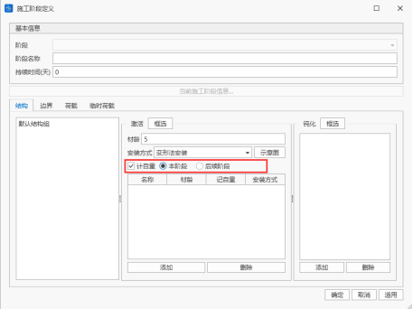
- **计自重阶段**

  自重荷载有三种形式：不计自重，本阶段计自重，后续阶段计自重。
  1. 不计自重：只考虑结构刚度，不考虑结构质量；
  2. 本阶段计自重：既考虑结构刚度，也考虑结构质量；
  3. 后续阶段计自重：本阶段考虑结构刚度，后续阶段考虑结构质量。

### 9.3.2 节点荷载

- 功能：输入作用在节点的集中荷载（集中力和力矩），修改或删除先前输入的节点荷载。
- 命令：

  从主菜单中选择“荷载”>“静力荷载”>“节点荷载”;

- 输入
  - **荷载工况**

    选择节点荷载所属的荷载工况。当需要添加和编辑荷载工况时，可以点击右面的“…”按钮，将弹出"荷载工况定义"对话框。&#x20;
  - **荷载组**

    选择节点荷载所属的荷载组。当需要添加和编辑荷载组时，可以点击右面的“…”按钮，将弹出"荷载组定义"对话框。&#x20;
  - **坐标系**

    如果节点荷载选择节点坐标系，且定义了节点坐标系，则节点荷载按照节点坐标系施加，其余按整体坐标系施加。
  - **荷载值**

    以整体坐标系为基准输入节点集中荷载。

    FX：集中荷载在选择坐标系X轴方向的分量。

    FY：集中荷载在选择坐标系Y轴方向的分量。

    FZ：集中荷载在选择坐标系Z轴方向的分量。

    MX：绕选择坐标系X轴的节点力矩分量。

    MY：绕选择坐标系Y轴的节点力矩分量。

    MZ：绕选择坐标系Z轴的节点力矩分量。
  - **操作**

    添加：添加新的节点荷载。

    替换：修改选择节点在该荷载工况和荷载组下的节点荷载。

    删除：删除选择节点在该荷载工况和荷载组下的所有节点荷载。

### 9.3.3 强制位移

- 功能：输入强制位移，修改或删除先前输入的强制位移。
- 命令：

  从主菜单中选择“荷载”>“静力荷载”>“强制位移”;

- 输入
  - **荷载工况**

    选择强制位移所属的荷载工况。当需要添加和编辑荷载工况时，可以点击右面的“…”按钮，将弹出"荷载工况定义"对话框。&#x20;
  - **荷载组**

    选择强制位移所属的荷载组。当需要添加和编辑荷载组时，可以点击右面的“…”按钮，将弹出"荷载组定义"对话框。&#x20;
  - **位移值**

    以整体坐标系为基准输入强制位移。

    Dx：强制位移在整体坐标系或节点局部坐标系x方向的分量。

    Dy：强制位移在整体坐标系或节点局部坐标系y方向的分量。

    Dz：强制位移在整体坐标系或节点局部坐标系z方向的分量。

    Rx：绕整体坐标系或节点局部坐标系x轴的强制旋转角度分量。

    Ry：绕整体坐标系或节点局部坐标系y轴的强制旋转角度分量。

    Rz：绕整体坐标系或节点局部坐标系z轴的强制旋转角度分量。

    如果该节点位置设置节点坐标系，则强迫位移为节点坐标系下的位移分量，否则为整体坐标系下的位移分量。
  - **操作**

    添加：添加新的强制位移。

    替换：修改选择节点在该荷载工况和荷载组下的强制位移。

    删除：删除选择节点在该荷载工况和荷载组下的所有强制位移。

### 9.3.4 梁单元荷载

- 功能：输入作用在梁单元的荷载（集中荷载、集中弯矩、均布荷载、均布弯矩、梯度荷载、梯度弯矩），修改或删除先前输入的梁单元荷载。
- 命令：

  从主菜单中选择“荷载”>“静力荷载”>“梁单元荷载”;

- 输入
  - **荷载工况**

    选择梁单元荷载所属的荷载工况。当需要添加和编辑荷载工况时，可以点击右面的“…”按钮，将弹出"荷载工况定义"对话框。&#x20;
  - **荷载组**

    选择梁单元荷载所属的荷载组。当需要添加和编辑荷载组时，可以点击右面的“…”按钮，将弹出"荷载组定义"对话框。&#x20;
  - **荷载类型**
    - 荷载类型为：

      集中荷载：单元某点处的集中荷载；

      集中弯矩：单元某点处的集中弯矩；

      均布荷载：均匀分布的均布力；

      均布弯矩：均匀分布的均布弯矩；

      梯度荷载：沿梁单元长度方向线性变化的梯度荷载；

      梯度弯矩：沿梁单元长度方向线性变化的梯度弯矩；
  - **坐标系**
    - 加载位置可选：

      整体坐标系X：梁单元荷载作用在整体坐标系X轴方向上。

      整体坐标系Y：梁单元荷载作用在整体坐标系Y轴方向上。

      整体坐标系Z：梁单元荷载作用在整体坐标系Z轴方向上。

      局部坐标系x：梁单元荷载作用在单元局部坐标系x轴方向上。

      局部坐标系y：梁单元荷载作用在单元局部坐标系y轴方向上。

      局部坐标系z：梁单元荷载作用在单元局部坐标系z轴方向上。
    - 若输入的荷载方向与上述六向不一致，可以通过考虑正负号后输入每个方向的荷载分量来控制该单元荷载方向。
  - **荷载值**
    - 输入方式：

      相对值：以梁单元长度的相对比例输入梁单元荷载的加载位置；

      绝对值：以梁单元的实际长度输入梁单元荷载的加载位置；
  > 🧐**注意事项**：梁单元荷载默认方式为单元形心处，如需要在单元其他位置施加，请设置偏心
  - 操作

    添加：添加新的梁单元荷载。

    替换：修改选择梁单元在该荷载工况和荷载组下的梁单元荷载。

    删除：删除选择梁单元在该荷载工况和荷载组下的所有梁单元荷载。

### 9.3.5 板单元荷载

- 功能：输入作用在板单元的荷载（集中力、集中弯矩、均布力、均布弯矩），修改或删除先前输入的板单元荷载。
- 命令：

  从主菜单中选择“荷载”>“静力荷载”>“板单元荷载”;

- 输入
  - **荷载工况**

    选择板单元荷载所属的荷载工况。当需要添加和编辑荷载工况时，可以点击右面的“…”按钮，将弹出"荷载工况定义"对话框。&#x20;
  - **荷载组**

    选择板单元荷载所属的荷载组。当需要添加和编辑荷载组时，可以点击右面的“…”按钮，将弹出"荷载组定义"对话框。&#x20;
  - **荷载类型**
    - 荷载类型为：

      集中力：单元某点处的集中荷载；

      集中弯矩：单元某点处的集中弯矩；

      均布力：均匀分布的均布力；

      均布弯矩：均匀分布的均布弯矩；
  - **加载位置**
    - 加载位置可选：

      面IJKL

      边IJ

      边JK

      边KL

      边LI
  - **坐标系**
    - 加载位置可选：

      整体坐标系X：板单元荷载作用在整体坐标系X轴方向上。

      整体坐标系Y：板单元荷载作用在整体坐标系Y轴方向上。

      整体坐标系Z：板单元荷载作用在整体坐标系Z轴方向上。

      局部坐标系x：板单元荷载作用在单元局部坐标系x轴方向上。

      局部坐标系y：板单元荷载作用在单元局部坐标系y轴方向上。

      局部坐标系z：板单元荷载作用在单元局部坐标系z轴方向上。
    - 若输入的荷载方向与上述六向不一致，可以通过考虑正负号后输入每个方向的荷载分量来控制该单元荷载方向。
  - **荷载值**

    可选均布或者线性变化方式输入荷载值；
  - **操作**

    添加：添加新的板单元荷载。

    替换：修改选择板单元在该荷载工况和荷载组下的板单元荷载。

    删除：删除选择板单元在该荷载工况和荷载组下的所有板单元荷载。

### 9.3.6 平面荷载

#### 9.3.6.1  定义平面荷载类型

- 功能：定义根据输入数据平面荷载，修改或删除先前预先定义的平面荷载类型
- 命令：

  从主菜单中选择“荷载”>“静力荷载”>“分配面荷载”>“定义平面荷载类型”;

  
- 输入
  - **名称**

    定义平面荷载名称
  - **说明**

    可输入平面荷载的简要描述
  - **荷载类型**

    选择初拉力的张拉方式：全量或者增量

    从集中、线、面荷载中，选择荷载类型

    （1）集中荷载

    **x，y:** 平面坐标系统中集中荷载的坐标（平面坐标系统在分配平面荷载对话框中的加载平面通过定义原点及x y轴的相关数据确定）

    **F**：集中荷载大小

    （2）线荷载

    荷载: 加载位置内力大小

    **x1, y1:** 线荷载在平面坐标系统中的起点坐标。

    **x2, y2:** 线荷载在平面坐标系统中的终点坐标。

    （3）面荷载

    **荷载:** 加载区域角点的荷载大小

    **x1, y1:** 定义加载面所需第1点坐标

    **x2, y2:** 定义加载面所需第2点坐标

    **x3, y3:** 定义加载面所需第3点坐标

    **x4, y4:** 定义加载面所需第4点坐标
  - &#x20;**复制到x轴方向**

    将定义的平面荷载沿平面坐标系x轴方向复制，输入复制间距。
  - \*\* 复制到y轴方向\*\*​

    将定义的平面荷载沿平面坐标系y轴方向复制，输入复制间距。
  - **操作**

    添加：添加新的平面荷载类型。

    编辑：修改选择的平面荷载类型。

    删除：删除选择的平面荷载类型。

#### 9.3.6.2  分配面荷载

- 功能：平面荷载用于在板单元上分配用户已定义的平面荷载类型。定义平面荷载类型中定义了荷载类型及大小后，通过分配荷载类型选择加载位置进行加载。
- 命令：

  从主菜单中选择“荷载”>“静力荷载”>“分配面荷载”>“分配平面荷载”;

  
- 输入
  - **荷载工况**

    选择平面荷载所属的荷载工况。当需要添加和编辑荷载工况时，可以点击右面的“…”按钮，将弹出"荷载工况定义"对话框。&#x20;
  - **荷载组**

    选择初拉力所属的荷载组。当需要添加和编辑荷载组时，可以点击右面的“…”按钮，将弹出"荷载组定义"对话框。&#x20;
  - \*\* 荷载类型\*\*​

    选择在定义平面荷载类型中定义的荷载类型。需要添加和编辑平面荷载类型时，点击右侧的“…”按钮，将弹出"平面荷载类型定义"对话框。
  - \*\* 加载方向\*\*​

    确定平面荷载的方向
  - **加载平面**

    定义加载平面坐标系。

    **第一点（原点）：** 平面坐标系的原点的整体坐标系坐标。

    **第二点（在x轴上）：** 平面坐标系x轴上的任意点的整体坐标系坐标。

    **第三点（在x—y平面上）：** 平面坐标系x-y平面上任意点的坐标。

### 9.3.7 初拉力

- 功能：输入杆/索单元的初拉力（预拉荷载），修改或删除先前输入的初拉力。
- 命令：

  从主菜单中选择“荷载”>“静力荷载”>“初拉力”;

- 输入
  - **荷载工况**

    选择初拉力所属的荷载工况。当需要添加和编辑荷载工况时，可以点击右面的“…”按钮，将弹出"荷载工况定义"对话框。&#x20;
  - **荷载组**

    选择初拉力所属的荷载组。当需要添加和编辑荷载组时，可以点击右面的“…”按钮，将弹出"荷载组定义"对话框。&#x20;
  - **张拉方式**

    选择初拉力的张拉方式：全量或者增量
  - &#x20;**荷载值**

    输入初拉力值；
  - **操作**

    添加：添加新的初拉力。

    替换：修改选择初拉力在该荷载工况和荷载组下的初拉力。

    删除：删除选择初拉力在该荷载工况和荷载组下的所有初拉力。

### 9.3.8 索长张拉

- 功能：输入杆单元或索单元的无应力索长，以达到施加初拉力的效果。修改或删除先前输入的无应力索长。
- 命令：

  从主菜单中选择“荷载”>“静力荷载”>“索长张拉”;

- 输入
  - **荷载工况**

    选择索长张拉所属的荷载工况。当需要添加和编辑荷载工况时，可以点击右面的“…”按钮，将弹出"荷载工况定义"对话框。&#x20;
  - **荷载组**

    选择索长张拉所属的荷载组。当需要添加和编辑荷载组时，可以点击右面的“…”按钮，将弹出"荷载组定义"对话框。&#x20;
  - **张拉方式**

    选择初拉力的张拉方式：全量或者增量
  - **表格输入**

    编号：用户选择的杆、索单元号；

    长度：单元的无应力索长。
  - **注意事项**

    只有索单元可以进行索长张拉。
  - **操作**

    添加：添加新的无应力索长。

    替换：修改指定荷载工况和荷载组下的无应力索长。

    删除：删除指定荷载工况和荷载组下的所有无应力索长。
  - 特殊说明
    - 软件中有两种单元可以模拟斜拉索，分别为杆单元和索单元。
      - 杆单元：既可受拉也可受压，不考虑垂度效应，即自重不计入单元内力，无论是采用线性计算还是非线性计算，杆单元I端和J端内力始终相同。
      - 索单元
    - **线性计算**：等效为Ernst公式修正弹性模量的只受拉杆单元，自重计入单元内力；
    - **非线性计算**：索单元为悬链线单元，只受拉；需要定义单元时填写初始参数（无应力索长、水平拉力或J端拉力），若初始参数为0，则默认无应长度与斜拉索单元几何长度相等。
    > 🧐索单元无论是采用线性计算还是非线性计算，两端索力均沿切线方向。
    - &#x20;**索力张拉**

      两种方式：

      （1）在施工阶段施加初拉力荷载（体外力），索力张拉数值可以为单元平均张拉力、I端张拉力或者J端张拉力，有增量和总量两种方式；

      （2）在索单元初始参数中设置水平拉力或J端拉力（体内力）。
    - &#x20;**索长张拉**

      两种方式：

      （1）在施工阶段施加索长荷载，有增量和总量两种方式；

      （2）在索单元初始参数中设置无应力索长。

### 9.3.9 索力张拉

- 功能: 在施工阶段对索单元施加初拉力，以模拟实际结构中通过张拉设备产生的索力效果。该功能可用于新增、修改或删除先前输入的索力荷载。
- 命令

  从主菜单中选择“荷载” > “静力荷载” > “索力张拉”；

  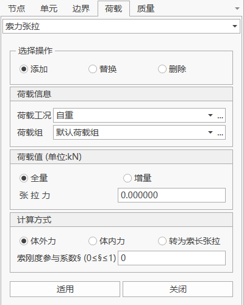
- 输入
  - **荷载工况**

    选择索力张拉所属的荷载工况。当需要添加或编辑荷载工况时，可以点击右侧的“…”按钮，弹出“荷载工况定义”对话框。
  - **荷载组**

    选择索力张拉所属的荷载组。当需要添加或编辑荷载组时，可以点击右侧的“…”按钮，弹出“荷载组定义”对话框。
  - **张拉方式**

    选择索力的施加方式，可选：
    - **全量**：直接输入目标张拉力的总量；
    - **增量**：在已有索力基础上增加指定的张拉力。
  - 表格输入
    - **编号**：用户选择的索单元号；
    - **索力**：输入每个单元对应的张拉力数值。
  - **张拉值（单位：kN）**

    输入索单元的张拉力数值。可指定为单元平均张拉力、I端张拉力或J端张拉力。
  - 特殊说明
    - **索刚度参与系数** 是一个用于描述**斜拉索在张拉过程中，其自身轴向刚度对张拉端拉力与索伸长量之间关系影响程度**的无量纲参数。
    - **索刚度参与系数** 的值在 **0 到 1** 之间。
  - 表格输入
    - **编号**：用户选择的索单元号；
    - **索力**：输入每个单元对应的张拉力数值。

***

### 9.3.10 制造偏差参数定义

- 功能：定义杆单元、梁单元、板单元的制造偏差参数，修改或删除先前输入的制造偏差参数。注意，目前软件不支持索单元制造偏差分析。
- 命令：

  从主菜单中选择“荷载”>“静力荷载”>“制造偏差”>“杆/梁单元制造偏差参数定义”或“板单元制造偏差参数定义”;

- 输入
  - **名称**

    该单元制造偏差参数定义的名称。&#x20;
  - **偏差值**
    - **杆、梁单元制造偏差包含7项：**
      1. 轴向偏差
      2. I端X向转角偏差
      3. I端Y向转角偏差
      4. I端Z向转角偏差
      5. J端X向转角偏差
      6. J端Y向转角偏差
      7. J端Z向转角偏差
    - **板单元制造偏差包含5项：**
      1. X向位移偏差
      2. Y向位移偏差
      3. Z向位移偏差
      4. X向转角偏差
      5. Y向转角偏差
    > 🧐以上所有偏差值均应在单元局部坐标系下定义，位移与单元坐标轴正方向一致为正，转角正负的判定遵循右手螺旋法则。
  - **操作**

    添加：添加新的制造偏差参数定义。

    修改：修改选择的制造偏差参数定义的参数。

    删除：删除选择的制造偏差参数定义。&#x20;

    关闭：关闭该页面。

### 9.3.11 制造偏差

- 功能：添加杆/梁、板单元的制造偏差，修改或删除先前输入的制造偏差。
- 命令：

  从主菜单中选择“荷载”>“静力荷载”>“制造偏差”>“杆/梁单元制造偏差”或“板单元制造偏差”;

- 输入
  - **荷载工况**

    选择初拉力所属的荷载工况。当需要添加和编辑荷载工况时，可以点击右面的“…”按钮，将弹出"荷载工况定义"对话框。&#x20;
  - **荷载组**

    选择初拉力所属的荷载组。当需要添加和编辑荷载组时，可以点击右面的“…”按钮，将弹出"荷载组定义"对话框。&#x20;
  - **制造偏差**
    - 杆/梁单元：

      选择已经定义过的杆/梁单元制造偏差参数。当需要添加和编辑杆/梁单元制造偏差参数时，可以点击右面的“…”按钮，将弹出"杆/梁单元制造偏差参数定义"对话框。&#x20;
    - 板单元：

      分别设置J、J、K、L四点的制造偏差，选择已经定义过的板单元制造偏差参数。当需要添加和编辑板单元制造偏差参数时，可以点击右面的“…”按钮，将弹出"板单元制造偏差参数定义"对话框。&#x20;
  - **操作**

    添加：添加新的制造偏差。

    替换：修改选择制造偏差在该荷载工况和荷载组下的制造偏差。

    删除：删除选择制造偏差在该荷载工况和荷载组下的所有制造偏差。

> 📌制造偏差荷载不能作为运营阶段荷载计算，只能在施工阶段中添加后查看结果。

## 9.4 动力荷载

### 9.4.1 节点质量

- 功能：输入节点质量，修改或删除先前输入的节点质量。
- 命令：

  从主菜单中选择“荷载”>“动力荷载”>“节点质量”;

- 输入
  - **荷载值**

    以整体坐标系为基准输入节点质量。

    m：节点质量在整体坐标系X、Y、Z轴方向的分量。

    rmX：绕整体坐标系X轴的节点质量力矩分量。

    rmY：绕整体坐标系Y轴的节点质量力矩分量。

    rmZ：绕整体坐标系Z轴的节点质量力矩分量。
  - **操作**

    添加：添加选择节点的节点质量。

    替换：修改选择节点的节点质量。

    删除：删除选择节点的节点质量。

### 9.4.2 将荷载转化为质量

- 功能：输入将荷载转化为质量，修改或删除先前输入的将荷载转化为质量。转化荷载包括：节点荷载、单元集中荷载、单元均布荷载。
- 命令：

  从主菜单中选择“荷载”>“动力荷载”>“将荷载转化为质量”;

- 输入
  - **荷载工况**

    选择质量所属的荷载工况。&#x20;
  - **组合值系数**

    输入该荷载工况转化为质量的转化系数。
  - **操作**

    添加：添加选择的质量。

    替换：修改选择的质量。

    删除：删除选择的质量。&#x20;

    删除质量数据：删除全部的质量数据。

### 9.4.3 **时程荷载工况**

#### **9.4.3.1 时程荷载工况列表**

- 功能：添加新的时程荷载工况，修改或删除先前定义的时程荷载工况。
- 命令：

  从主菜单中选择“荷载”>“动力荷载”>“时程荷载工况”;

  从树形菜单中选择“工作”>“动力时程分析” >“时程荷载工况” >“添加”:

#### **9.3.4.2时程荷载工况定义**

- 功能：定义时程荷载工况详细参数。
- 命令：

  从主菜单中选择“荷载”>“动力荷载”>“时程荷载工况” >“添加”;

  从树形菜单中选择“工作”>“动力时程分析” >“时程荷载工况” >“添加”>“添加”:

- 输入
  - **名称**

    当前时程荷载工况名称。&#x20;
  - **说明**

    根据用户需要填写简要描述或备注说明。
  - **分析类型**

    线性：进行线性时程分析；

    几何非线性：考虑结构应力刚度矩阵变化的非线性时程分析；

    边界非线性：考虑边界非线性单元的非线性时程分析。边界非线性需要选择边界组，可进行多选。

    
  - **分析时间**

    时程分析总时间。
  - **分析时间步长**

    时程分析的时间增量，该增量会影响时程分析结果精度。
  - **最小收敛步长**

    选择几何非线性和边界非线性时激活，输入每个时间步的子步最小值。
  - **收敛容限**

    进行非线性分析收敛标准，软件默认为位移标准，当每个时间步位移小于等于收敛容限时该时间步收敛。
  - **阻尼设置**

    设置结构阻尼，不计阻尼则结构阻尼为零。
    - **单一阻尼：** 结构每个单元采用相同的阻尼数值。

      

      周期：输入指定阻尼比振型的周期。

      阻尼比：输入相应周期的阻尼比。

      计算因子：周期和阻尼比输入完成后，点击计算因子自动计算质量因子和刚度因子。
    - **组阻尼：** 根据材料设置不同质量因子和刚度因子。

      

      表格：填写每个材料对应指定阻尼比振型的周期和相应周期的阻尼比

      统一振型：输入指定阻尼比振型的周期。所有材料周期相同。

      更新周期：一键更新表格里所有材料周期。

      更新因子：更新表格里所有材料的质量因子和刚度因子。

### 9.4.4 **时程函数**

#### **9.4.4.1 时程函数列表**

- 功能：添加新的时程函数，修改或删除先前定义的荷载函数。
- 命令：

  从主菜单中选择“荷载”>“动力荷载”>“时程函数”;

  从树形菜单中选择“工作”>“动力时程分析” >“时程函数” >“添加”:

#### **9.4.4.2 时程函数定义**

- 功能：定义时程函数曲线。
- 命令：

  从主菜单中选择“荷载”>“动力荷载”>“时程函数” >“添加”;

  从树形菜单中选择“工作”>“动力时程分析” >“时程函数” >“添加”>“添加”:

- 输入
  - **名称**

    当前时程函数名称。&#x20;
  - **导入**

    点击导入可选择csv格式数据表格一键导入时程函数数据。csv表格内数据格式与对话框中表格数据相同，为两列数据，第一列为时间，第二列为数值。
  - **更新时程函数图形**

    根据表格数据改变更新右侧时程函数图形。
  - **表格**

    显示时程函数数据列表，可进行复制、粘贴、修改和删除。
  - **数据类型**

    分为无量纲加速度，加速度，力和力矩。无量纲加速度数据表格中数值单位为g（重力加速度）。
    > 🧐**注意：无量纲加速度和加速度用于输入“地面加速度”，力或力矩用于输入“节点动力荷载”。**
  - **放大系数**

    定义时程数据的放大系数。时程函数最终值为表格中数值×放大系数。

### 9.4.5 **边界单元特性**

详见**8.9.1边界非线性单元特性**。

### 9.4.6 **边界单元连接**

详见**8.9.2边界非线性单元连接**。

### 9.4.7 **地面加速度**

#### **9.4.7.1 地面加速度列表**

- 功能：添加新的地面加速度，修改或删除先前定义的地面加速度。
- 命令：

  从主菜单中选择“荷载”>“动力荷载”>“地面加速度”;

  从树形菜单中选择“工作”>“动力时程分析” >“地面加速度” >“添加”:

#### **9.4.7.2 地面加速度定义**

- 功能：定义地面加速度。
- 命令：

  从主菜单中选择“荷载”>“动力荷载”>“地面加速度” >“添加”;

  从树形菜单中选择“工作”>“动力时程分析” >“地面加速度” >“添加”>“添加”:

- 输入
- **时程荷载工况**

  选择在“时程荷载工况”定义的时程分析工况。
- X**方向时程分析函数**

  输入整体坐标系下X方向地面加速度。

  函数名称：选择要添加的地面加速度函数。

  系数：地面加速度的调整系数。

  到达时间：地面加速度开始作用于结构上的时间。
- Y**方向时程分析函数**

  输入整体坐标系下Y方向地面加速度。

  函数名称：选择要添加的地面加速度函数。

  系数：地面加速度的调整系数。

  到达时间：地面加速度开始作用于结构上的时间。
- Z**方向时程分析函数**

  输入整体坐标系下Z方向地面加速度。

  函数名称：选择要添加的地面加速度函数。

  系数：地面加速度的调整系数。

  到达时间：地面加速度开始作用于结构上的时间。

### 9.4.8 **节点动力荷载**

- 功能：添加、修改或删除节点动力荷载。通过点选或框选节点施加荷载。
- 命令：

  从主菜单中选择“荷载”>“动力荷载”>“节点动力荷载”;

  从树形菜单中选择“工作”>“动力时程分析” >“节点动力荷载” >“添加”:

- 输入
  - **时程荷载工况**

    选择在“时程荷载工况”定义的时程分析工况。
  - **操作**

    添加：添加新的节点动力荷载。

    替换：修改选择节点在该时程荷载工况和时程函数下的节点动力荷载。

    删除：删除选择节点在该时程荷载工况下的所有节点荷载。&#x20;
  - **时程分析参数**

    函数名称：选择要添加的节点动力荷载函数。

    荷载类型：根据选择的函数自动确定，有**力**和**力矩**两种类型。

    方向：节点动力荷载加载方向。分为X，Y，Z，-X，-Y，-Z方向。

    系数：节点动力荷载的调整系数。

    到达时间：节点动力荷载开始作用于结构上的时间。

### 9.4.9 **节点动力荷载列表**

- 功能：以表格形式列出所有节点动力荷载，可进行编辑修改删除等。
- 命令：

  从树形菜单中选择“工作”>“动力时程分析” >“节点动力荷载” >“表格”:

- 输入
  - **节点**

    节点动力荷载作用的节点号。
  - **荷载工况**

    节点动力荷载所属的时程荷载工况名称。
  - **时程函数**

    时程函数名称。
  - **荷载类型**

    时程荷载函数类型，分为力和力矩两种类型，根据时程函数名称自动填写。
  - **加载方向**

    节点动力荷载加载方向。
  - **系数**

    节点动力荷载的调整系数。
  - **到达时间**

    节点动力荷载开始作用于结构上的时间。

### 9.4.10 **列车动力荷载生成器**

- 功能：快捷生成移动列车荷载作用下节点动力荷载。
- 命令：

  从主菜单中选择“荷载”>“动力荷载”>“列车动力荷载生成器”;

- 输入
  - **定义轨道**

    选择结构中列车轨道节点。
  - **时程荷载工况**

    节点动力荷载所属的时程荷载工况名称。
  - **时程函数名称**

    定义一个时程函数名称。
  - **车辆类型**

    选择列车类型，分ZK型车辆和动车组车辆。ZK型车辆适合列车设计荷载计算，动车组车辆适合列车运营荷载计算。
  - **列车参数**

    列车速度：列车行驶速度。

    考虑制动：是否考虑列车刹车。

    制动加速度：列车刹车减速度。

    制动开始行程：列车开始刹车时，车头距离上桥点距离。
  - **荷载加载参数**

    上桥时间：列车开始上桥的时间。

    加载方向：列车荷载加载方向。

    加载间距：列车荷载形成的节点动力列表每个作用节点之间间距。

    放大系数：列车荷载调整系数。考虑多车道折减系数。
  - ZK**型车辆**

    根据图式输入列车车辆参数。

    
  - **动车组车辆**

    根据图式输入列车车辆参数。

    

### 9.4.11 **反应谱函数**

- 功能：用户自定义或根据规范定义反应谱曲线。
- 命令：

  从主菜单中选择“荷载”>“动力荷载”>“反应谱分析数据”>“反应谱函数”;

- 输入
  - 操作

    添加：添加一个新的反应谱函数。

    替换：修改选择的反应谱函数。

    删除：删除选择的反应谱函数。&#x20;
  - 添加反应谱函数

    
  - 函数名称

    用户输入反应谱函数名称。注意反应谱函数名称不能重复。
  - 反应谱调整系数

    用户填入反应谱数据的调整系数。
  - 反应谱类型

    确认要输入的反应谱数据类型。

    无量纲加速度：加速度反应谱除以重力加速度得到的频谱。

    加速度：加速度反应谱。

    位移：位移反应谱。
  - 输入类型

    可选择自定义和按规范设计两种。.
  - 导入文件

    当输入类型为自定义时，该项可用。导入的数据文件应包含两列数据，第一列为周期，第二列为对应的反应谱类型数据（无量纲加速度/加速度/位移）。
  - 设计反应谱

    当输入类型为按规范设计，该项可用。根据规范，设置峰值加速度、特征周期等值，点击确定，即可完成反应谱函数设计。

    目前提供四种规范的反应谱函数：

    （1） 铁路工程抗震设计规范（GB50111-2006）

    

    （2） [城市桥梁抗震设计规范](https://www.doc88.com/p-5055640046416.html "城市桥梁抗震设计规范")（CJJ 166-2011）

    

    （3） [公路桥梁抗震设计规范](https://www.doc88.com/p-5055640046416.html "公路桥梁抗震设计规范")（JTG/T 2231-01-2020）

    

    （4） 城市轨道交通结构抗震设计规范（GB 50909-2014）

    

### 9.4.12 **反应谱工况**

- 功能：用户自定义或根据规范定义反应谱曲线。
- 命令：

  从主菜单中选择“荷载”>“动力荷载”>“反应谱分析数据”>“反应谱工况”;

- 输入
  - 操作

    添加：添加一个新的反应谱工况。

    替换：修改选择的反应谱工况。

    删除：删除选择的反应谱工况。&#x20;
  - 添加反应谱工况

    
  - 名称

    用户输入反应谱工况名称。注意反应谱工况名称不能重复。
  - 说明

    用户输入反应谱工况说明，默认无。
  - 组合方法

    选择各方向反应谱分析结果的组合计算方法。

    求模：
    $$
    u={\sqrt{u_{x}^{2}+u_{y}^{2}+u_{z}^{2}}}
    $$
    

    求和：
    $$
    u={u_{x}+u_{y}+u_{z}}
    $$
    
  - X、Y、Z方向反应谱函数

    函数名称：选择X、Y、Z方向进行反应谱分析的反应谱函数。

    系数：X、Y、Z方向反应谱结果参与组合时的系数。

## 9.5 移动荷载

### 9.5.1 **车辆**

#### 9.5.1.1纵向**移动荷载**

- 功能：定义移动荷载分析时的纵向车辆荷载大小。
- 命令：主菜单的“荷载”>“纵向移动荷载”> “车辆”。

- 输入
  - **修改先前输入的车辆荷载**

    在车辆总表中选中需要修改的车辆荷载并单击修改。
  - **删除先前输入的车辆荷载**

    在车辆总表中选中需要删除的车辆荷载并单击删除。
  - **清空先前输入的车辆荷载**

    清空车辆总表中的所有车辆荷载。
  - **复制先前输入的车辆荷载**

    在车辆总表中选中需要复制的车辆荷载并单击复制。

    移动荷载分析可考虑的车辆荷载包括标准车辆荷载与自定义车辆荷载两大类。
- 车辆荷载
- （1） 标准车辆荷载

  桥通软件目前可考虑的荷载规范和标准车辆荷载包括：
  - 中国铁路桥涵设计规范 TB10002-2017

    √ 高速铁路ZK普通荷载

    √ 城际铁路ZC普通荷载

    √ 重载铁路ZK普通荷载

    √ 客货共线铁路ZKH普通荷载

    √ 中—活载普通荷载

    √ 长大货物车检算荷载
    > 📌上述普通荷载中，列车加载长度L默认为0，即不限制加载长度。用户可根据需要修改L值。重载铁路ZH普通荷载中的荷载系数z默认为1.0，用户可根据需要修改z值。
    > 📌火车强度检算，根据异符号影响线区段长度L自行判断，$L<=15m$不加载，$>15m$按照空车加载，可根据用户设定，定义列车长度加载；火车疲劳检算时，异符号影响线区段长度按活载图示中的均布载加载。
    > 
  - 城市桥梁设计规范 CJJ11-2019

    √ 城A、城B车道荷载

    
  - 公路工程技术标准 JTG 001—97&#x20;

    √ 汽—10、汽—15、汽—20

    √ 汽超—20

    √ 挂—80、挂—100、挂—120
    > 📌注意：挂车荷载仅作用于单车道，且不计冲击系数、不计纵横向折减系数；车道宽度需大于5.0m，否则输出结果为0；加载时车辆在车道内横向摆动。
    > 
  - 公路桥涵设计通用规范 JTG D60—2004

    √ 公路I、II级车道

    
  - 公路桥涵设计通用规范 JTG D60—2015

    √ 公路I、II级车道

    √ 公路疲劳荷载Ⅰ、Ⅱ、Ⅲ
    > 📌注意：1）一个影响面内，无论有几个车道，公路疲劳荷载II、Ⅲ仅作用于单车道；2）疲劳加载不考虑冲击系数、横向折减和纵向折减系数；3）公路疲劳荷载子工况目前只支持输出单元的内力和应力，且不计入合计结果。
    > 
  - 城市轨道交通桥梁设计规范CB/T 51234-2017

    √ 地铁A、B、C型车

    
  - 市域铁路设计规范T/CRS C0101-2017

    √ ZS荷载

    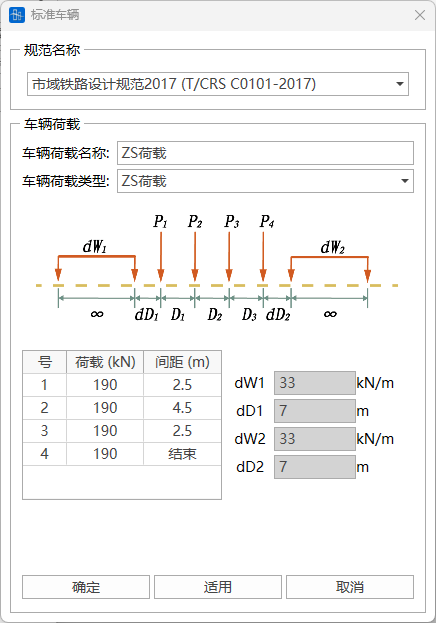
- （2） 自定义车辆荷载

  添加用户自定义车辆荷载，目前可考虑的自定义车辆荷载类型包括汽车、火车、城市轻轨、人群与非机动车。

  
  - 车辆类型

    选择所需的车辆类型。
  - 车辆荷载名称

    用户填入车辆名称，也可采用自定义车辆。注意，所有标准车辆和自定义车辆均不得重名。
  - 荷载值和荷载表格

    根据具体车辆荷载类型，填入荷载值和加载长度等参数。

    当车辆荷载类型以多个集中荷载的形式出现时，采用表格方式定义。用户可在表格中直接修改荷载值Pi，距离值Li，点击“添加”或“删除”修改集中荷载数量。
  - √ 汽车类型—车道荷载

    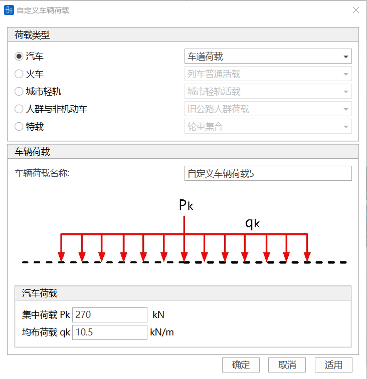
  - √ 汽车类型—车辆荷载

    车队布置参照公路工程技术标准（JTG 001—97）中的汽车-超20级。如车队中重车车轴少于5个，则相关车轮重和间距可不填。

    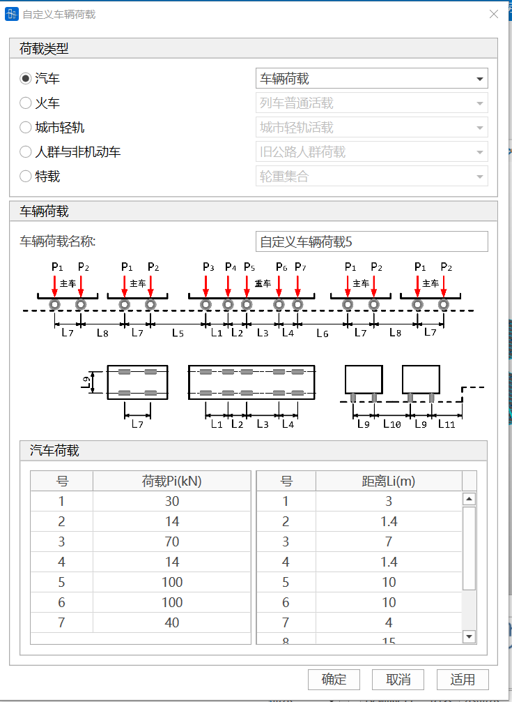
  - √ 火车类型—列车普通活载

    列车荷载布置参照中—活载普通荷载。

    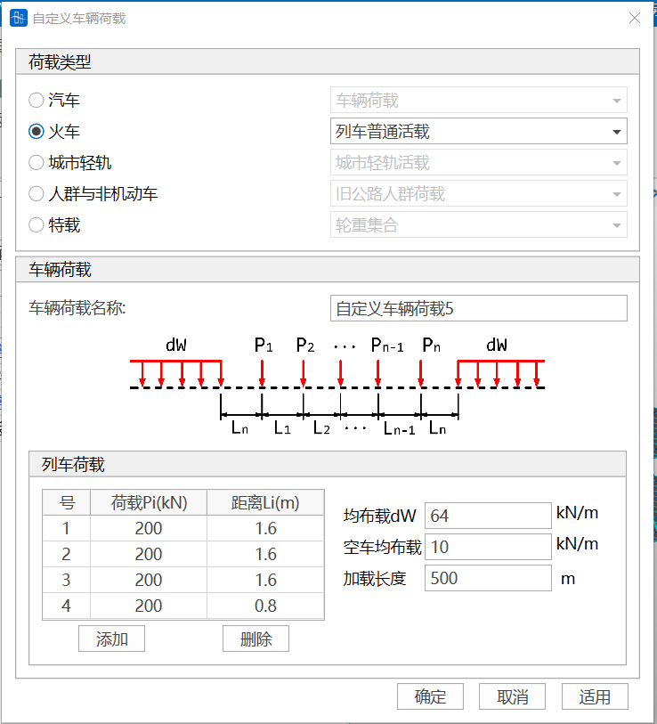
  - √ 城市轻轨类型—城市轻轨荷载

    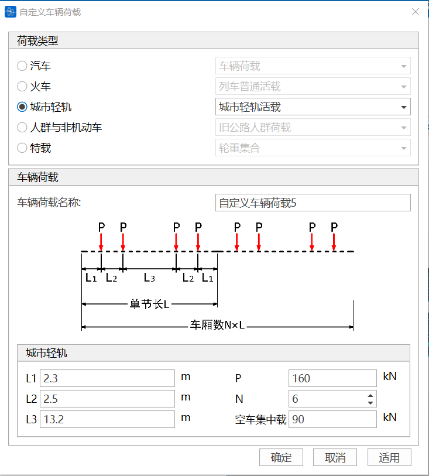
  - √ 人群与非机动车类型—旧公路人群荷载

    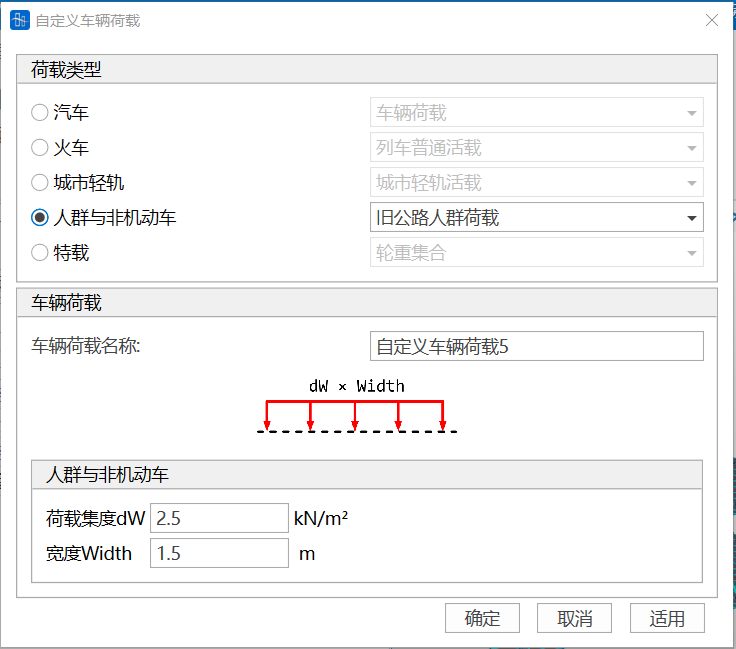
  - √ 特载—轮重集合
    > 📌注意：特载仅作用于单车道，且不计冲击系数、不计纵横向折减系数；加载时车辆在车道内横向摆动。
    > 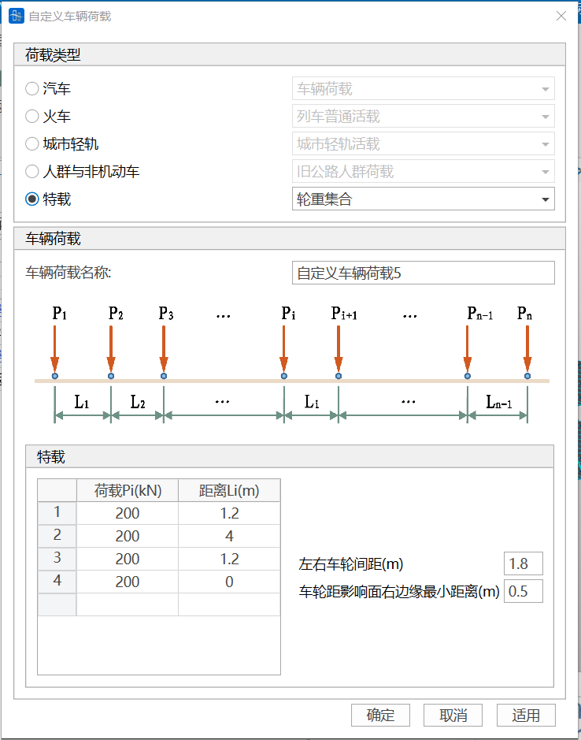

#### 9.5.1.2**横向移动荷载**

- 输入
  - 车辆荷载名称

    输入横向移动车辆荷载的名称。可定义多个车辆荷载，列表显示在界面最下方的表格中。
  - 车轮荷载P

    该值为横向移动车辆荷载中最大单轮重量。
  - 车轮间距Dw

    即横向移动车辆的车轮距离。
  - 最小车辆间距Dv

    车辆横向位置的最小间距。
  - 车轮至边缘距离De

    车轮中心线至加载边缘，如路缘石或中央分隔带的最小距离。
  - 人行及非机动车道宽度Dm

    桥面端部人行道及非机动车道的总宽度。
  - 模型纵向长度

    横向模型沿桥纵向的长度，即单元横向模型单元的宽度。
  - 中央分隔带

    不勾选，则为单幅桥面，仅定义左车道数n1即可。勾选则为双幅桥面，需分别定义左右两个车道数n1,n2。
  - 中心至左端距离

    中央分隔带的中心点距桥面左端的距离。
  - 宽度

    中央分隔带的宽度。
  - 左车道数n1

    加载时，将从0～n1不同数量的车辆取最不利的加载效应。
  - 右车道数n2

    加载时，将从0～n2不同数量的车辆取最不利的加载效应。
    

### 9.5.2 **节点纵列**

- 功能：节点纵列是定义影响面和车道的基础。一条节点纵列由沿桥梁纵向分布的多个节点组成。
- 命令：主菜单的“荷载”>“纵向移动荷载”> “节点纵列”。

- 输入
  - **添加节点纵列**

    点击添加节点纵列。

    
    - 节点纵列名称

      用户输入节点纵列名称。
    - 选择节点纵列
      - 用户可采用三种方式选择组成节点纵列的节点。

        选择“两点”方式：鼠标点入下方P1（点1）的文本框，在模型窗口点击首、尾两个节点，自动选择两点以及两点之间连线上的所有节点，并自动生成节点纵列。

        选择“鼠标选取”方式：在快捷键栏选择“点选”或者“框选”，在模型窗口选择组成节点纵列的所有节点后，点击“确定”生成节点纵列。

        选择“节点号输入”方式：在下方节点号文本框中输入节点号，点击“确定”生成节点纵列。
    - 起始点号
  - **修改节点纵列**

    在节点纵列总表中选中需要修改的节点纵列并单击修改。
  - **删除先前输入的节点纵列**

    在节点纵列总表中选中需要删除的节点纵列并单击删除。
  - **清空先前输入的节点纵列**

    清空节点纵列总表中的所有节点纵列。
  - **复制先前输入的节点纵列**

    在节点纵列总表中选中需要复制的节点纵列并单击复制。

### 9.5.3 **影响面**

- 功能：

  影响面代表移动荷载加载的范围，同一模型可存在多个影响面。每个影响面可由1条或多条节点纵列组成。当影响面由多条节点纵列组成时，影响面的纵向长度等于节点纵列长度，影响面宽度等于最左侧与最右侧节点纵列之间的横向距离；当影响面只包含1条节点纵列时，影响面横向宽度自动取为该节点纵列所在梁单元截面的最大宽度。
  > 🧐**注意，当影响面由多条节点纵列组成时，若选择采用梁单元形函数分配荷载加密影响面，则这些节点纵列所包含的节点个数应完全相等**，否则程序报错。默认采用壳单元形函数分配荷载加载影响面，无此限制。
- 命令：主菜单的“荷载”>“纵向移动荷载”> “影响面”。

- 输入
  - **添加影响面**

    点击添加影响面，如下图所示。

    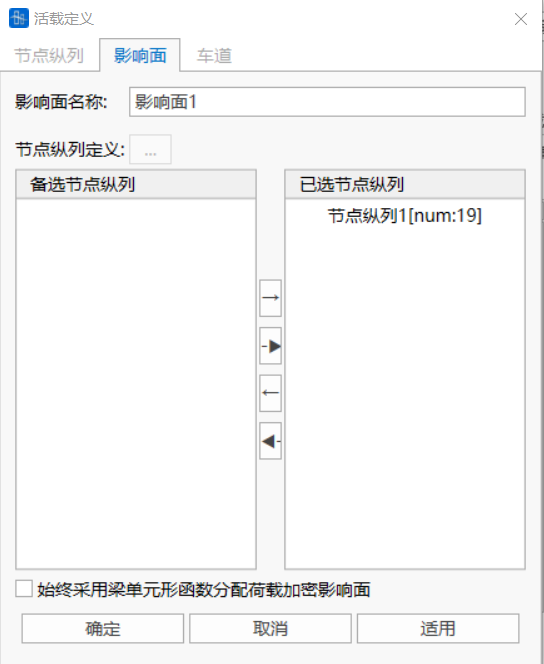
    - **影响面名称**

      用户输入影响面名称。注意影响面名称不能重复。
    - **节点纵列定义**

      点击按钮，可跳转到节点纵列定义对话框进行相应操作。
    - **选择节点纵列**

      选中左侧备选框中的一条或多条纵列，按往右箭头选择节点纵列。亦可选中右侧已选框中的纵列，按往左箭头取消选择。
    - **始终采用梁单元形函数分配荷载加密影响面**

      如勾选，则采用梁单元形函数分配荷载以加密影响面。默认采用壳单元形函数分配荷载。
  - **修改影响面**

    在影响面总表中选中需要修改的影响面并单击编辑。
  - **删除先前输入的影响面**

    在影响面总表中选中需要删除的影响面并单击删除。
  - **清空先前输入的影响面**

    清空影响面总表中的所有影响面。
  - **复制先前输入的影响面**

    在影响面总表中选中需要复制的影响面并单击复制。

### 9.5.4 **车道定义**

#### 9.5.4.1**纵向移动荷载**

- 功能：

  定义移动荷载加载的具体位置。一条标准车道在横桥向只加载一个车辆荷载。注意，实际车道外边缘（计入车道宽度，汽车车道默认宽度3.5m，火车轨道宽度1.435m，轻轨）不应超过当前影响面范围，否则程序报错。
- 命令：主菜单的“荷载”>“纵向移动荷载”> “车道”。

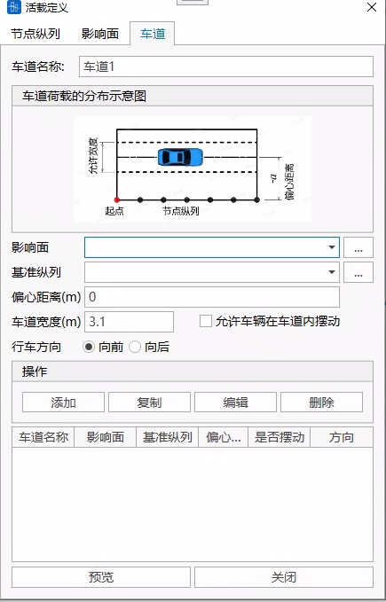

- 输入
  - **车道名称**

    用户输入车道名称。注意车道名称不能重复。
  - **影响面**

    选择车道所属影响面。点击右侧“…”按钮跳转到影响面定义窗口。
  - **基准纵列**

    选择一条节点纵列作为确定车道位置的基准线。
  - **偏心距离**

    输入实际车道相对于基准纵列的偏心距离。

    （+）表示沿整体坐标轴Y的正向偏移，（-）表示沿整体坐标轴Y的负向偏移。
  - **车辆行驶方向**

    选择车辆行驶方向。向前，只考虑车辆由始点向终点方向的移动；向后，只考虑车辆由终点向始点方向的移动。
  - **允许车辆在车道内摆动**

    勾选该项后，程序活载计算时将在允许摆动宽度范围内移动车辆（不包括火车和轻轨等行车道固定的车辆类型），从而得到车辆布置的最不利位置。注意，允许摆动宽度不能小于2.85m。
  - **添加**

    点击添加后，新增的车道将添加进下方的车道表格中。
  - **预览**

    点击预览，模型窗口中将显示所有当前已定义车道的具体位置。
  - **关闭**

    关闭当前定义窗口。

#### 9.5.4.2 **横向移动荷载**

用户可直接输入自行计算的荷载比例系数。也可通过“荷载分布宽度”工具计算荷载比例系数，将计算结果导入该表格中。荷载比例系数含义见“荷载分布宽度”。

“荷载分布宽度”工具用法见“荷载分布宽度”。

### 9.5.5  **移动荷载分析工况**

#### 9.5.5.1**纵向移动荷载**

- 功能：

  用输入的车辆荷载和车道生成移动荷载工况。需要定义车辆类型、车道数、移动荷载分析方法以及相关系数。一个移动荷载分析工况中，可包含多个移动荷载子工况，分析工况结果为各子工况结果的判别叠加结果。
- 命令：主菜单的“荷载”>“纵向移动荷载”> “移动分析工况”。

- 输入
  - **添加移动分析工况**

    点击添加按钮，如下图所示。

    
    - **工况名称**

      用户输入移动分析工况名称。注意工况名称不能重复。
    - **影响面**

      选择影响面，确定移动分析加载范围。
    - **保存子工况**结果

      选择是否保存子工况结果。如不勾选，则只输出该活载工况的合计结果（各子工况的判别叠加）；如勾选，则除合计结果外，还分别输出各子工况的单项结果。
    - **添加子工况**

      点击添加按钮，添加子工况。一个移动分析工况中可同时添加多个子工况。填写完成子工况数据并点击确定后，新增子工况将显示在表格中。

      
      - **车辆组**

        选择已定义的车辆荷载。
      - **系数ψ0**

        填入子工况组合系数。
      - **移动荷载优化**

        不选择，分配车道列表中显示标准车道，反之显示优化车道。
      - **分配车道**

        选择子工况分配的车道。
    - **折减系数与冲击系数**

      定义移动分析工况相关的折减系数与冲击系数。
    - **桥梁计算跨度**

      填入桥梁计算跨度，该值与纵向折减、横向折减和冲击系数有关。
    - **设置汽车相关系数**

      如子工况中包含汽车荷载类型，则点击勾选此项，并点击右侧“…”按钮设置规范类型、横向折减系数、纵向折减系数和冲击系数。

      程序约定：按照规范要求，公路疲劳计算不考虑冲击系数；公路疲劳荷载Ⅱ和Ⅲ加载仅考虑单车道加载；挂车不计冲击系数，不计折减系数。

      
    - **设置火车相关系数和疲劳**

      如子工况中包含火车荷载类型，则点击勾选此项，并点击右侧“…”按钮设置规范类型、横向折减系数、纵向折减系数和冲击系数等。

      勾选“计算疲劳”，并填入疲劳加载的火车线路数量，可在火车强度计算的同时，计算火车疲劳。

      注意，火车疲劳加载时不计入线路折减系数。同一影响面既运营普通火车，又运营ZK、ZC火车时，若要计算疲劳加载效应，则普通火车疲劳加载和ZK、ZC火车疲劳加载必须同时计算。

      同一影响面线性计算时， ZK、ZC火车结果合并输出到高速火车强度（或疲劳）结果中，ZKH、ZH和中-活载合并输出到高速火车强度（或疲劳）结果中。活载采用非线性计算时，则普通火车和高速火车同时计算，且结果合并输出到普通火车结果中。

      
    - **设置轻轨相关系数**

      如子工况中包含轻轨荷载类型，则点击勾选此项，并点击右侧“…”按钮设置自定义的横向折减系数、纵向折减系数和冲击系数。

      

#### 9.5.5.2 **横向移动荷载**

用输入的横向车辆荷载和横向车道生成横向移动荷载工况。需要事先定义车辆类型、车道数、冲击系数。

### 9.5.6 移动荷载分析**设置**

- 功能：设置移动荷载分析计算方式、加载控制以及结果输出的相关项。
- 命令：主菜单的“分析”>“移动荷载”。

- 输入
- **活载效应计算方式**

  用户选择相应的活载效应计算方式。
- **影响线加载控制**

  用户填入影响线加载时纵桥向、横桥向的加密间距。加密间距越小，加载点数越多，精度越高，但计算耗时长。建议值在0.1\~1m之间。

  在进行横向移动荷载分析时，不能进行“影响线加载控制”。
- **模拟阻尼器的约束方程**

  活载加载时，采用约束方程模拟阻尼器作用。可选择全部，也可通过边界组选择。
- **计算选项**

  选择需要输出活载分析结果的节点、单元、弹性连接和约束方程。可选择全部，也可通过结构/边界组选择。
- **曲线桥离心力计算**

  活载离心力计算系数$C=\frac{V^{2}}{(127 \times R)}$

  其中V为桥梁结构设计行车速度（单位：km/h）;R为桥梁结构半径（单位：m）,对处于缓和曲线上的桥梁结构可取平均半径。此系数**仅对单梁模型有效**，且要求车道线基准节点纵列位于曲线内测。对于直线桥梁结构此系数填0。

### 9.5.7 轨道形位定义

- 功能：计算火车作用下轨道的变形、三角坑等形位结果。
- 命令：主菜单的“荷载”>“纵向移动荷载”> “轨道形位定义”。

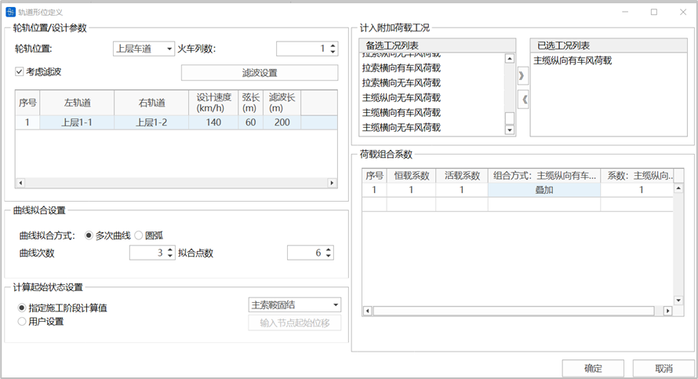

- 输入
  - 轮轨位置
    选择火车荷载作用的轮轨位置，即火车荷载所在的影响面。
  - 火车列数
    输入计算的火车列数。
  - &#x20;考虑滤波
  - &#x20;滤波设置
    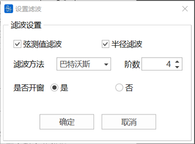
  根据需要勾选弦测值滤波或半径滤波，至少选择其中一种；选择滤波方法，包括高通和巴特沃斯法，当选择巴特沃斯法时，应确定滤波阶数；根据需要选择是否开窗。
  - 轮轨位置表格
    左轨道/右轨道：选择火车左、右轨道对应的节点纵列。
  设计速度：填写火车设计速度。

  弦长：用于评估轨道平顺性的弦长值。

  滤波长：当勾选考虑滤波时，填写滤波长度。
  - &#x20;曲线拟合设置
    曲线拟合方式：多次曲线或者圆弧。
  曲线次数和拟合点数：当拟合方式选择多次曲线时，选择拟合成的曲线方程次数n，注意：n次曲线拟合的拟合点数应大于n+2。
  - &#x20;计算起始状态设置
    指定施工阶段计算值：以指定施工阶段的纵列节点位移值作为起始状态值；
  用户设置：点击输入节点起始位移作为起始状态值，应输入火车左、右轨道对应节点纵列上节点的起始位置。
  - 计入附加荷载工况
    选择计入的附加荷载工况，注意工况属性为“施工阶段荷载”的工况不被列入备选项。
  - &#x20;荷载组合系数
    填入恒载、活载以及计入附加荷载工况的组合系数。注意，各附加荷载工况分别填写各自的系数和组合方式，组合方式包括：叠加（即强制叠加）和判别（即判别叠加，只叠加不利值）。
  > 📌注意：桥通软件做轨道形位分析还需在“分析→轨道形位分析”中进行相关设置。

## 9.6 温度荷载

### 9.6.1 单元温度

- 功能：输入单元温度，修改或删除先前输入的单元温度。
- 命令：

  从主菜单中选择“荷载”>“温度/预应力”>“单元温度”;

- 输入
  - **荷载工况**

    选择单元温度所属的荷载工况。当需要添加和编辑荷载工况时，可以点击右面的“…”按钮，将弹出"荷载工况定义"对话框。&#x20;
  - **荷载组**

    选择单元温度所属的荷载组。当需要添加和编辑荷载组时，可以点击右面的“…”按钮，将弹出"荷载组定义"对话框。&#x20;
  - **初始温度**

    输入单元的初始温度
  - **最终温度**

    输入单元上温度升高温度或温度降低温度。
  - **操作**

    添加：添加新的单元温度。

    替换：修改选择单元在该荷载工况和荷载组下的单元温度。

    删除：删除选择单元在该荷载工况和荷载组下的单元温度

### 9.6.2 梯度温度

- 功能：定义梁单元沿截面高度或宽度方向，板单元沿厚度方向呈线性变化的温度荷载。修改或删除先前输入的梯度温度。
- 命令：

  从主菜单中选择“荷载”>“温度/预应力”>“梯度温度”;

  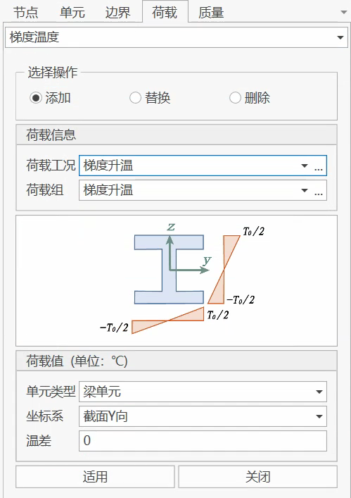

  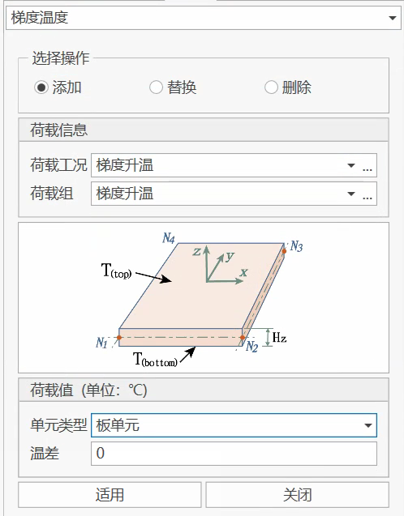
- 输入
  - **荷载工况**

    选择梯度荷载所属的荷载工况。当需要添加和编辑荷载工况时，可以点击右面的“…”按钮，将弹出"荷载工况定义"对话框。&#x20;
  - **荷载组**

    选择梯度荷载所属的荷载组。当需要添加和编辑荷载组时，可以点击右面的“…”按钮，将弹出"荷载组定义"对话框。&#x20;
  - **单元类型**

    可以选择梁单元或板单元。
  - &#x20;**温差**

    梁单元：沿截面坐标系y方向（或z方向）两端最外侧的温度差。

    板单元：板单元顶部与低部的温度差。
  - **操作**

    添加：添加新的梯度温度。

    替换：修改选择单元在该荷载工况和荷载组下的梯度温度。

    删除：删除选择单元在该荷载工况和荷载组下的梯度温度。

### 9.6.3 公路梁截面梯度温度

- &#x20;功能：根据规范D60-2015中的梯度温度模式，定义沿梁高度方向或梁宽度方向的温度变化。输入梁截面温度，修改或删除先前输入的梁截面温度。
- 命令：

  从主菜单中选择“荷载”>“温度/预应力”>“梁截面温度”;

  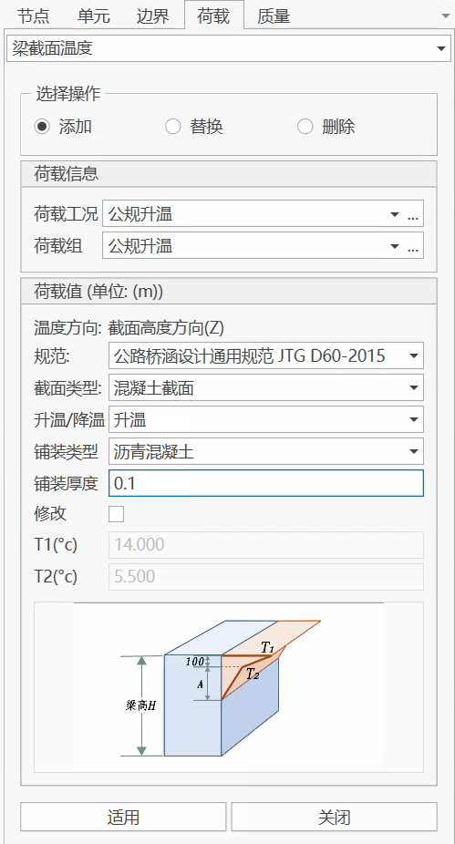
- 输入
  - **荷载工况**

    选择梁截面温度所属的荷载工况。当需要添加和编辑荷载工况时，可以点击右面的“…”按钮，将弹出"荷载工况定义"对话框。&#x20;
  - &#x20;**荷载组**

    选择梁截面温度所属的荷载组。当需要添加和编辑荷载组时，可以点击右面的“…”按钮，将弹出"荷载组定义"对话框。&#x20;
  - **规范**
    - 公路桥涵设计通用规范JTG D60-2015；
    - 美国规范ASSHTO 2017.
  - **升温/降温**

    选择升温还是降温。
  - &#x20;**铺装类型**
    - 规范D60-2015中：选择沥青混凝土还是水泥混凝土。
  - **铺装厚度**
    - 规范D60-2015中：填写铺装厚度值，单位m。填写铺装厚度值后， 根据规范自动计算T1、T2，可勾选“修改”后手动修改。
  - **操作**

    添加：添加新的梁截面温度。

    替换：修改选择梁单元在该荷载工况和荷载组下的梁截面温度。

    删除：删除选择梁单元在该荷载工况和荷载组下的梁截面温度。

### 9.6.4 铁路箱梁温度（指数温差）

- 功能：根据规范TB 10092-2017 附录B “混凝土箱梁温差应力计算”中有关规定，定义沿梁单元截面高度方向按指数变化的温度荷载，修改或删除先前输入的铁路箱梁温度。
- 命令：

  从主菜单中选择“荷载”>“温度/预应力”>“指数温度”;

  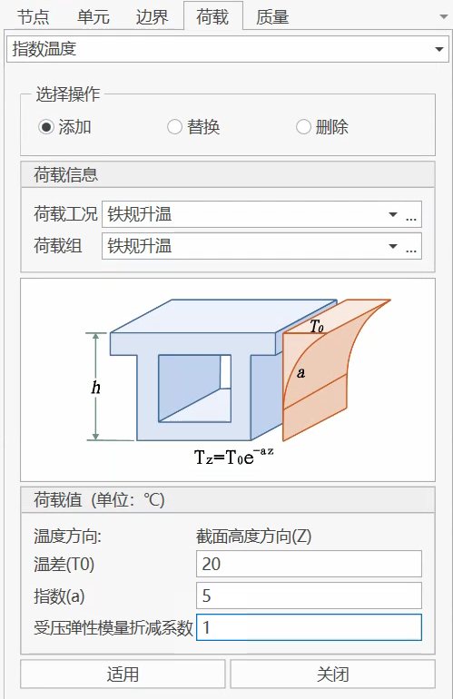
- 输入
  - &#x20;**荷载工况**

    选择铁路箱梁温度所属的荷载工况。当需要添加和编辑荷载工况时，可以点击右面的“…”按钮，将弹出"荷载工况定义"对话框。&#x20;
  - **荷载组**

    选择铁路箱梁温度所属的荷载组。当需要添加和编辑荷载组时，可以点击右面的“…”按钮，将弹出"荷载组定义"对话框。&#x20;
  - **荷载值**

    温度沿梁高度方向，按照函数变化。

    温差（$T_0$）：箱梁顶板的温度。

    指数（a）：以上温差公示中的系数a。
  - **操作**

    添加：添加新的铁路箱梁温度。

    替换：修改选择梁单元在该荷载工况和荷载组下的铁路箱梁温度。

    删除：删除选择梁单元在该荷载工况和荷载组下的铁路箱梁温度。

### 9.6.5 顶板温度

- 功能：

  定义梁单元顶板的变化温度，修改或删除先前输入的顶板温度。注意，对于一般梁单元，用户需在截面定义中填入“顶板厚度”，如顶板厚度为0，则顶板温度失效；对于组合梁单元，顶板厚度默认为辅材厚度，如辅材厚度为0，则顶板温度失效。
- 命令：

  从主菜单中选择“荷载”>“温度/预应力”>“顶板温度”;

  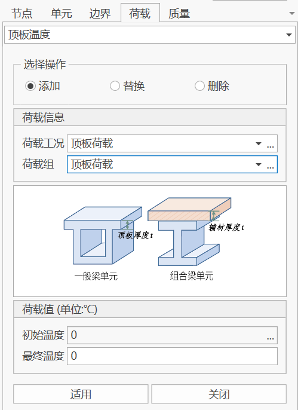
- 输入
  - **荷载工况**

    选择顶板温度所属的荷载工况。当需要添加和编辑荷载工况时，可以点击右面的“…”按钮，将弹出"荷载工况定义"对话框。&#x20;
  - **荷载组**

    选择顶板温度所属的荷载组。当需要添加和编辑荷载组时，可以点击右面的“…”按钮，将弹出"荷载组定义"对话框。&#x20;
  - **荷载值**

    初始温度：输入梁单元的顶板温度

    最终温度：输入梁单元的最终温度。
  - **操作**

    添加：添加新的顶板温度。

    替换：修改选择单元在该荷载工况和荷载组下的顶板温度。

    删除：删除选择单元在该荷载工况和荷载组下的顶板温度。

### 9.6.6 自定义温度

## 9.7 预应力荷载

### 9.7.1 钢束特性

- 功能：输入钢束特性，修改或删除先前输入的钢束特性。
- 命令：

  从主菜单中选择“荷载”>“温度/预应力”>“钢束特性”;

- 输入
- **特性名称**

  输入钢束特性名称。&#x20;
- **钢束类型**

  先张：在混凝土浇筑前张拉钢束；

  后张：在混凝土凝固后张拉钢筋。
- &#x20;**材料**

  选择钢束特性所属的材料类型。当需要添加和编辑材料类型时，可以点击右面的“…”按钮，将弹出"材料总表"对话框。&#x20;
- **预应力钢筋类型**

  预应力钢绞线

  预应力螺纹钢筋
- **管道种类**

  预埋金属波纹管

  预埋塑料波纹管

  预埋铁皮管

  预埋钢管

  抽芯成型
- **钢束结构**

  钢束结构可选择8mm(1×2)、 10mm(1×2)、 12mm(1×2)、 8.6mm(1×3)、 10.8mm(1×3)、 12.9mm(1×3)、 9.5mm(1×7)、 12.7mm(1×7)、 15.2mm(1×7)、 17.8mm(1×7)、自定义。
- **特性值**

  选择不同的钢束结构，可显示该钢束结构的对应特性值，也可对该特性值进行修改。

  钢束面积：

  摩阻系数：

  偏差系数：
- **松弛相关设置**

  (1) 钢绞线：

  

  

  (2) 螺纹钢筋：

  
- **锚具变形、钢筋回缩和接缝压缩值**

  填写始端值（钢束开始点的内缩值）、末端值（钢束结束点的内缩值）。&#x20;
- **操作**

  添加：添加新的钢束特性。

  替换：修改选择的钢束特性。

  删除：删除选择的钢束特性。

### 9.7.2 钢束

- &#x20;功能：输入钢束，修改或删除先前输入的钢束。
- &#x20;命令：

从主菜单中选择“荷载”>“温度/预应力”>“钢束”;

- 输入

  导入时，Dxf不能有完全重复的段，也不能出现多根钢束共点的情况。
  - **钢束特性**

    选择钢束的钢束特性。当需要添加和编辑钢束特性时，可以点击右面的“…”按钮，将弹出"钢束特性定义"对话框。
  - **钢束组**

    选择钢束所属的钢束组。当需要添加和编辑钢束组时，可以点击右面的“…”按钮，将弹出"钢束组定义"对话框。
  - **方式**

    导线点和折线点

    对于导线点，在B、C两点输入倒角半径

    对于折线点，在2、4两点输入倒角半径，其他点倒角半径为0；

    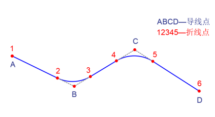
  - **对称点**

    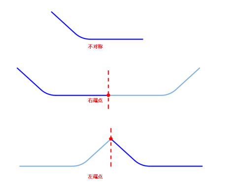
  - **批量导入Dxf**

    CAD中钢束定义的注意点：
    1. dxf导入平弯和竖弯钢束的导线点以CAD的世界坐标系的\[0,0,0]为原点
    2. 钢束为多段线对象，不能有重复线和0长度线段。
    3. 空间钢束按图层同时考虑横弯和竖弯；同一钢束的平弯和竖弯放在一个图层内（除0号图层外，0号图层为注释参考图层）,平弯设置为红色\[RGB(255,0,0)],竖弯为其他颜色。
    4. 空间钢束名称和cad的图层名称相对应，图层内除钢束多段线对象外，不能有其他对象。
    5. 导入桥通的钢束dxf文件中 除钢束对象和0号图层中的对象外，不能有其他对象内容。
  - **定位方式**

    （1）直线

    插入点：可以直接输入点坐标，也可以点击文本框之后，在三维图形中点选结构上的点。

    钢束x轴的方向：整体坐标系X、Y、Z，或者自定义方向向量。
    > 📌插入点是钢束局部坐标轴原点在全局坐标系中的位置
    > 方向向量是局部坐标轴x轴在全局坐标轴中的向量方向
    > （2）轨迹线：
    轨迹线：结构组中的单元要求首尾相接

    插入点：选择插入位置单元的IJ端

    钢束方向：定义钢束x的方向，由单元I端到J端，或者由单元J端到I端

    绕钢束旋转方向；沿钢束x轴的方向旋转的角度
  - **操作**

    添加：添加新的钢束。

    替换：修改选择的钢束参数。

    删除：删除选择的钢束。&#x20;

    移动复制：移动复制选择的钢束。

    

    镜像：镜像选择的钢束。

    

    导出Dxf：导出选择的钢束的dxf文件。

### 9.7.3 钢束组

- 功能：输入钢束组，修改或删除先前输入的钢束组。
- 命令：

  从主菜单中选择“荷载”>“温度/预应力”>“钢束组”;

- 输入
  - **名称**

    钢束组的名称。&#x20;
  - **后缀**

    钢束组名称的后缀。名称+后缀组成当前钢束组的实际名称。仅支持数字，可通过3To12By2的写法批量生成钢束组。
  - **操作**

    添加：输入新的钢束组定义。

    修改：修改先前输入的钢束组定义。

    删除：删除先前输入的钢束组定义。

### 9.7.4 预应力荷载

- 功能：输入预应力荷载，修改或删除先前输入的预应力荷载。
- 命令：

  从主菜单中选择“荷载”>“温度/预应力”>“预应力荷载”;

- 输入
  - **荷载工况**

    选择顶板温度所属的荷载工况。当需要添加和编辑荷载工况时，可以点击右面的“…”按钮，将弹出"荷载工况定义"对话框。&#x20;
  - **荷载组**

    选择顶板温度所属的荷载组。当需要添加和编辑荷载组时，可以点击右面的“…”按钮，将弹出"荷载组定义"对话框。&#x20;
  - &#x20;**钢束选择**

    在表格中选择已定义好的钢束。
  - **张拉力**

    张拉方式：两端、始端、末端。
  - **操作**

    添加：添加新的预应力荷载。

    编辑：修改选择钢束在该荷载工况和荷载组下的预应力荷载。

    删除：删除选择钢束在该荷载工况和荷载组下的预应力荷载。

### 9.7.5 预应力构件设置

- 功能：输入预应力构件设置，修改或删除先前输入的预应力构件设置。
- &#x20;命令：

  从主菜单中选择“荷载”>“温度/预应力”>“预应力构件设置”;

- 输入
  - **操作**

    添加：将填写的单元设置为预应力构件。

    删除：取消设置选择的单元为预应力构件。

> 🧐💡注意事项
>
> 1. 软件根据定义的预应力构件，自动识别预应力分别通过哪些单元。
> 2. 如果预应力钢束穿过单元的五分之一部分，则认为该单元有预应力荷载作用。

### 9.7.6 预应力相关注意事项

- 对于多根预应力来说，均是按多个孔道挖孔处理，即 净截面面积=毛截面面积-孔道面积×预应力根数；
- 若施工阶段中张拉预应力，在张拉预应力之前以及张拉预应力当前阶段

  对于结构自重：按毛截面处理；

  对于单元内力：桥通的内力是毛截面的形心处的内力；

  对于结构刚度：张拉之前按照净截面，张拉之后按照等效截面；

  对于单元应力：预应力张拉时的应力采用的是净截面，后期荷载采用的是换算截面；

## 9.8 施工阶段

### 9.8.1 **定义施工阶段**

- 功能：定义施工阶段，修改或删除先前输入的施工阶段。
- 命令：

从主菜单中选择“荷载”>“施工阶段”>“定义施工阶段”;

- 输入
  - **阶段名称**

    输入施工阶段的名称。&#x20;
  - **持续时间（天）**

    该施工阶段的持续时间。&#x20;
  - **结构**

    设置在施工阶段需要激活和钝化的结构组。

    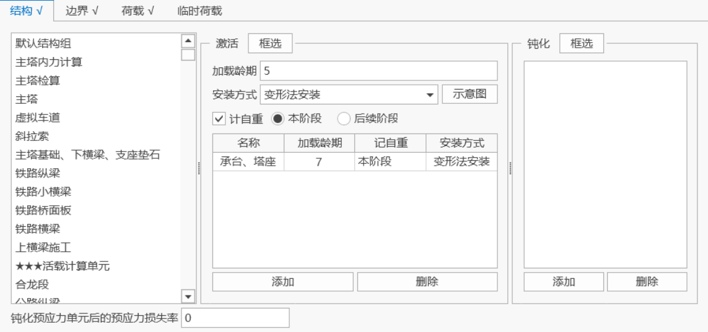
    - 材龄：施工阶段开始时的结构组已具备的材龄。
    - 安装方法：

      软件提供四种结构安装方式，分别为变形法、接线法、无应力尺寸安装和切线法安装。

      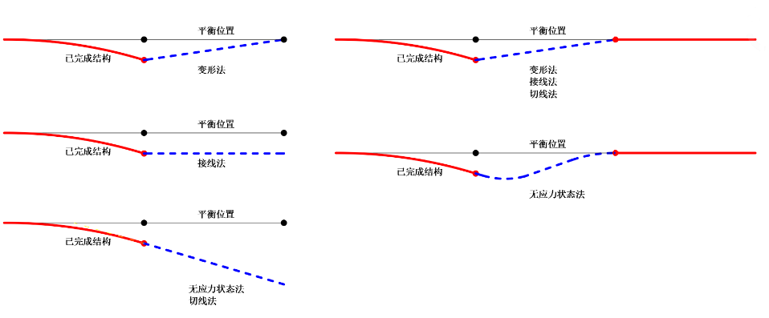

      变形法：单元安装到节点初始位置，不会产生安装内力。

      接线法：安装仅考虑虚线位移影响，不会产生安装内力。

      无应力状态法：计安装位移和安装次内力，如钢桁梁的安装。

      切线法：安装考虑线位移和转角位移，不会产生安装内力。
      > 🧐**注意事项**：对于索单元，无论选择哪一种安装方式，计算时均采用无应力尺寸安装；对于杆单元，计算时根据选择的安装方式进行计算。
    - **钝化预应力单元后的预应力损失率**γ：0≤ γ ≤ 1.0，γ=0表示不损失，γ=1.0 表示全部损失。
  - **边界**

    设置在施工阶段需要激活和钝化的边界组。

    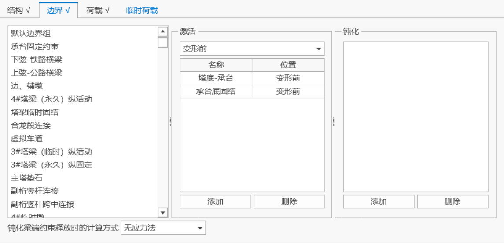
    - **变形前**：结构变形前的支承位置；
    - **变形后**：结构变形后的支承位置。
    > 🧐**注意事项**：对于弹性连接，安装位置采用“变形前”时，相当于无应力安装；安装位置采用“变形后”时，相当于变形法安装。
    - **钝化梁端约束释放时的计算方式**：可选择采用无应力法或者变形法计算。1）无应力法：软件设定将根据依钝化时单元变形施加相应的抗力（与无应力安装相似）；2）变形法：不根据单元变形施加相应的抗力（与变形法安装类似，目前只适用于线性计算。
    > 🧐**注意事项**：注意此处选择“变形法”，只在施工阶段总体计算方式采用“线性”时生效。另外，在钝化某个梁单元的端部约束释放功能时，该单元除自重外所受其它单元荷载均失效，如仍需考虑原先的单元荷载，则应重新添加。
  - **荷载**

    设置在施工阶段需要激活和钝化的荷载组。

    

    在激活/钝化表中可设置激活时间（施工阶段开始后荷载组开始作用的时间）/钝化时间（荷载组被钝化的时间）

    钝化荷载组时，仅钝化荷载组组中的节点荷载、节点强制位移、单元集中荷载，单元均布荷载，单元温度荷载。
  - **临时荷载**

    设置在施工阶段需要激活的临时荷载组。临时荷载组中的荷载仅在本阶段起作用，下一个阶段将自动钝化本阶段激活的临时荷载。

    激活临时荷载组时，仅激活荷载组组中的节点荷载、节点强制位移、单元集中荷载，单元均布荷载，单元温度荷载。

    
  - 操作

    添加：添加新的施工阶段。

    修改：修改选择的施工阶段信息。

    删除：删除选择的施工阶段。&#x20;

    前插：插入到选择的施工阶段之前。

    后插：插入到选择的施工阶段之后。

    全部删除：删除全部施工阶段。

### 9.8.2 **施工阶段联合截面**

- 功能：输入施工阶段联合截面，修改或删除先前输入的施工阶段联合截面。
- 命令：

  从主菜单中选择“荷载”>“施工阶段”>“施工阶段联合截面”;

- 输入
  - **名称**

    输入施工阶段联合截面的名称。&#x20;
  - **截面**

    选择施工阶段联合截面的截面。当需要添加和编辑截面时，可以点击右面的“…”按钮，将弹出"截面定义"对话框。&#x20;
  - **单元列表**

    选择截面后，为该截面的单元会自动显示该文本框。
  - **结合阶段**

    辅材和主材结合，开始共同作用的施工阶段
  - **辅材材料**

    用户定义的辅材材料
  - **材龄**

    输入各位置的材龄
  - **辅材计自重方式**
    - 类型：

      由主材单独承担

      由整体截面承担

      不计自重
  > 🧐**注意事项**：若组合梁单元未定义施工阶段联合截面，则在施工阶段激活组合梁单元时，主材和辅材同时激活。
  - 操作

    添加：添加新的施工阶段联合截面。

    编辑：修改选择的施工阶段联合截面信息。

    删除：删除选择的施工阶段联合截面。

## 9.9 支座沉降

### 9.9.1 支座沉降组

- 功能：定义一个沉降组，组中包含的多个支座沉降同时发生。
- &#x20;命令：主菜单的“荷载”>“支座沉降”>“支座沉降组”。

- 输入
  - **名称**

    用户填入沉降组名称，所有沉降组均不得重名。
  - **沉降量**

    输入支座沉降的大小。
  - **支座节点列表**

    输入要包含在支座沉降组中的支座节点号。可直接输入节点号，或者在模型中选择。
  - **操作**

    添加：输入新的支座沉降荷载。

    修改：修改表格中选定的支座沉降荷载。

    删除：删除表格中选定的支座沉降荷载。

### 9.9.2 支座沉降工况

- 功能：定义一个沉降工况，程序将对工况中各沉降组结果进行判别叠加分析，以求取最不利沉降工况结果。
- 命令：主菜单的“荷载”>“支座沉降”>“支座沉降组”。

- 输入
  - &#x20;**名称**

    用户填入支座沉降工况名称，所有支座沉降工况均不得重名。
  - **选择沉降组**

    求取最不利沉降工况结果时需要考虑的一个或多个沉降组。
  - **操作**

    添加：输入新的支座沉降工况。

    修改：修改表格中选定的支座沉降工况。

    删除：删除表格中选定的支座沉降工况。

### 9.9.3 并发反力组

- 功能：选择输出支座沉降工况引起的同时发生的支点反力结果的节点组。
- 命令：主菜单的“荷载”>“支座沉降”>“并发反力组”。

- 输入
  - **选择的节点组**

    通过已选择的节点组，确认需计算并发反力的支座。
  - **删除反力组**

    删除已选择的节点组。

### 9.9.4 并发内力组

- 输入
  - **选择的单元组**

    通过已选择的单元组，确认需计算并发内力的单元（壳单元除外）。
  - **删除内力组**

    删除已选择的单元组。

## 9.10 荷载表格

- 功能：可查看并编辑荷载信息表格。
- 命令：“主菜单”>“边界”>“边界表格”

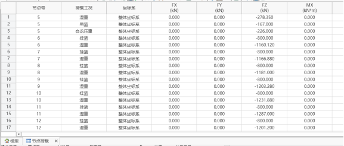

- 内容
  - 节点荷载
    - 节点荷载
    - 节点强制位移
    - 节点质量
  - 杆系单元荷载
    - 梁单元集中荷载
    - 梁单元分布荷载
    - 初拉力
    - 索长张拉
  - 板单元荷载
    - 板单元集中荷载
    - 板单元集中线荷载
    - 板单元集中面荷载
  - 预应力荷载
  - 温度荷载
    - 单元温度
    - 板单元梯度问题
    - 梁单元梯度温度
    - 梁单元截面温度
    - 指数温度
    - 顶板温度
  - 制造偏差
    - 杆/梁单元制造偏差参数
    - 杆/梁单元制造偏差
    - 板单元制造偏差参数
    - 板单元制造偏差
  - 节点动力荷载

## **9.11 荷载组**

若干节点荷载、单元荷载、温度荷载等静力荷载组成一个荷载组，用于定义桥梁各施工阶段的荷载，荷载组之间不能重名。

节点纵列定义

设置汽车相关系数

移动荷载分析设置

临时荷载设置

施工阶段联合截面窗口操作

将定义的平面荷载沿平面坐标系y轴方向复制，输入复制间距。

将定义的平面荷载沿平面坐标系y轴方向复制，输入复制间距。

定义加载平面坐标系。
第一点（原点）：平面坐标系的原点的整体坐标系坐标。
第二点（在x轴上）：平面坐标系x轴上的任意点的整体坐标系坐标。
第三点（在x—y平面上）：平面坐标系x-y平面上任意点的坐标。

$$
u=\sqrt{u_{x}^{2} + u_{y}^{2} + u_{z}^{2}}
$$

