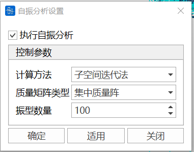
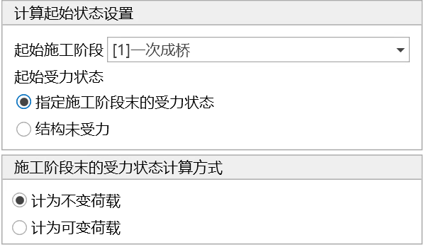
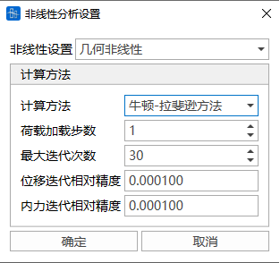

## 10.1 **总体设置**

- 功能：对求解器进行设置。
- 命令：从主菜单中选择“分析”>“分析设置”>“总体设置”

- 输入：

**求解器**可选择稀疏矩阵求解器或者变带宽求解器。

**并行计算设置**可选择软件自动设置线程数量、单线程、多线程三种，其中选择多线程时可以自定义求解时的线程数量。

## 10.2 **施工阶段设置**

- 功能：设置施工阶段分析信息。
- 命令：

  从主菜单中选择“分析”>“分析设置”>“施工阶段”;

- 输入
  - **基本设置**

    计算截至阶段：设置最终施工阶段，只有在最终施工阶段，才能与其他荷载工况进行组合。&#x20;

    其他阶段：在已定义的施工阶段中进行选择。
  - **分析选项**
    - 分析类型：线性或非线性。
    - 收缩徐变：设置收缩徐变信息。

      
    - 索力张拉位置（初拉力荷载中初拉力的张拉位置）：

      平均索力

      I端索力

      J端索力
    - 考虑成桥阶段内力对运营阶段内力的影响：

      将施工阶段最后一个阶段的单元内力内力转化为初始内力，形成成桥阶段（PostCS）结构的初始几何刚度。

## 10.3 **运营阶段设置**

- 功能：设置运营阶段分析信息。
- 命令：

  从主菜单中选择“分析”>“分析设置”>“运营阶段”;

- 输入
  - **基准阶段**

    设置运营阶段开始的基准阶段。
  - **静力荷载**

    分析类型：线性或非线性。

    静力工况：设置静力工况。

    沉降工况：设置沉降工况。
  - **移动荷载**

    分析类型：线性或非线性。

    活载工况：设置活载工况。

## 10.4 **自振设置**

- 功能：设置自振特性分析信息。
- 命令：

  从主菜单中选择“分析>自振”;

  
- **执行自振分析**

  确定进行自振特性分析。默认不勾选。
- **控制参数**

  计算方法：
  1. 子空间迭代法（不易漏根，但计算效率低）；&#x20;
  2. 滤频法（计算效率最低，阶数少时可用）；
  3. 多重Ritz法（计算效率高、但有可能丢根）；
  4. 兰索斯法（计算效率高、但有可能丢根）。
  > 📌若模型较大，且计算的振型数量较多，首推多重Ritz法和兰索斯法。
  > 质量矩阵类型：包括集中质量阵和一致质量阵。
  > 📌采用集中质量阵，输入的节点质量全部被计算，但输入的单元质量只计入了集中质量而忽略了转动惯量；采用一致质量阵，输入的节点质量和单元质量全部被计算。
  > 振型数量：计算并输出结果的振型模态数。
  > 📌结构自振频率计算阶数不能超过结构计算的自由度数。

## 10.5 **移动荷载设置**

功能：设置活载分析信息

命令：从主菜单中选择“分析>移动荷载分析设置”

- **活载效应计算方式**

  可采用线性计算方式、或者采用非线性计算方式(按照影响面确定活载最不利加载位置后，采用非线性计算活载效应)。注意：当施工阶段分析采用线性计算的时候，活载计算只能采用线性计算，施工阶段分析采用非线性计算时，活载计算可以采用线性和非线性计算两种方式。
- **影响面加载控制**

  设置影响面内横、纵桥向影响面的加密间距，以及选择模拟阻尼器的约束方程，

  **注意**：可以在施工阶段中不激活约束方程，仅仅在计算活载时激活某些约束方程以达到模拟阻尼器的目的。
- **计算选项**

  选择是否在计算活载时，**输出**位移、内力、反力、和弹性连接、约束方程的结果，**如果想要减少计算量，加快计算效率**可以选择不勾选某些计算项目。“是否追踪” 可以设定是否对所选计算项目进行活载追踪。

## 10.6 **屈曲分析设置**

- 功能：设置屈曲分析的基本信息
- 命令：从主菜单中选择“分析>屈曲分析设置”；

- 执行屈曲分析

  确定是否进行屈曲分析。默认不勾选。
- 屈曲模态数量

  待计算的屈曲模态数量。结构稳定计算模态数量**不能超过**结构计算的自由度数。
- &#x20;计算起始状态设置

  **起始施工阶段：** 选择指定施工阶段结束时的受力状态作为屈曲计算的起始状态。若未建立施工阶段，则该项无效。

  **起始受力状态：**
  - **指定施工阶段末的受力状态**
    &#x20;       即选择以指定施工阶段结束时的受力状态作为屈曲计算的起始状态。选择该项时，施工阶段末的受力状态计算方式可设为不变荷载，或可变荷载。
  
  - **结构未受力**
    &#x20;       即屈曲计算时结构未受力。选择该项时，结构自重计算方式可设置为：不计自重，计为不变荷载、计为可变荷载。其余施工阶段荷载皆不计入。
  <!--  -->
- 其它工况计算方式

  其它附加荷载工况参与屈曲计算的方式。计为不变荷载或可变荷载。目前，节点集中荷载，单元集中荷载和单元均布荷载有效，其余荷载类型无效。

> 📌注意，计为可变荷载的有效荷载总数（包括自重和其它工况）必须大于0，否则计算报错；若**结构无受压构件**，理论上不会发生屈曲，因此不输出屈曲计算结果。

## 10.7 **非线性设置**

- 功能：非线性分析设置。
- 命令：

  从主菜单中选择“分析>非线性”；

  
- **非线性设置**

  （1）几何非线性

  （2）索单元采用悬链线单元：索单元将采用悬链线单元刚度矩阵，其他单元采用线性刚度矩阵（其他单元计算总刚的时候，不考虑几何变形，但是仍然参与非线性迭代）
- **注意**

  （1）只有两个地方可以设置是否考虑非线性，施工阶段及活载

  （2）运营阶段除活载之外的分析类型与施工阶段一致，不可单独设置；

  （3）活载分析单独设置，其设置级别低于施工阶段

  即：施工阶段为线性分析时，活载只能选择线性分析；

  施工阶段为非线性分析时，活载可选线性或非线性；

  

## 10.8 **时程分析设置**

### 10.8.1 **求解器设置**

- 功能：设置动力时程分析求解器。
- 命令：

  从主菜单中选择“分析>总体设置”；

- 输入
  - **求解设置**

    选择求解器类型，**动力时程分析必须选择稀疏矩阵求解器。**
  - **并行计算设置**

    选择并行计算线程数量。

### 10.8.2 **时程分析设置**

- 功能：设置时程分析信息。
- 命令：

  从主菜单中选择“分析>时程分析”;

- 输入
  - **执行动力时程分析**

    确定进行动力时程分析。默认不勾选。
  - **分析结果**

    节点位移/速度/加速度：确定输出位移/速度/加速度的节点集合，可输出全部节点结果，也可通过选择结构组输出部分节点结果。

    单元内力/应力：确定输出内力/应力的单元集合，可输出全部单元结果，也可通过选择结构组输出部分单元结果。

## 10.9 **反应谱分析设置**

- 功能：是否进行反应谱分析、进行该分析时的阻尼比设置等。
- 命令：从主菜单中选择“分析>反应谱分析”；

- 执行反应谱分析

  **是否执行反应谱分析，若是，则默认进行自振分析。**
- 振型组合

  反应谱分析中振型的组合方式。
  - 平方和开方(SRSS：Square Root of Sum of the Squares)：将每个随机变量的响应视为独立的随机变量，并采用统计学上的平方和开方规则来组合多个随机变量的效应，输出平方和开方结果SRSS。
    - 对于多个独立的随机变量 $X_{1}, X_{2},..., X_{n},$ 每个随机变量都有一个系数 $a_{1}, a_{2},..., a_{n},$SRSS方法的计算表达式为：
    $$
    \mathrm{S R S S}={\sqrt{( a_{1} X_{1} )^{2}+( a_{2} X_{2} )^{2}+...+( a_{n} X_{n} )^{2}}}
    $$
  - 绝对值之和(CQC：Complete Quadratic Combination，即完全二次振型组合)：用于快速评估结构在多种工况下可能遭受的最大荷载，通过假设所有工况的最大响应同时发生，将每个工况的最大响应（不考虑方向）的绝对值相加，输出一个总的响应估计ABSSUM。
    - 对于多个随机变量 $X_{1}, X_{2},..., X_{n},$ 每个随机变量都有一个系数 $a_{1}, a_{2},..., a_{n},$ ABSSUM方法的计算表达式为：
    $$
    ABSSUM= |a_1 X_1| + |a_2X_2| + ...+ |a_nX_n |
    $$
- 阻尼比设置

  常数阻尼比：所有振型采用同一个阻尼比。

  按振型阶数设置：结构阻尼比与结构自振频率相对应，若输入阻尼比数目小于所求结构自振频率数，软件内部设定超出阻尼比数目的结构自振频率所对应的阻尼比值取最后输入的阻尼比值。

## 10.10 **轨道形位分析设置**

- 功能：是否进行轨道形位分析、分析控制参数项。
- 命令：从主菜单中选择“分析>轨道形位分析”；

- 执行轨道形位分析

  选择是否进行轨道形位分析。
  > 📌进行该分析的前提是：
  >
  > 1\) 建立并进行活载工况分析；
  >
  > 2\) 影响面上必须至少包含2条节点纵列，且这两条节点纵列所包含的节点数量相等；
  >
  > 3\) 活载工况中的**车辆类型必须是火车类型荷载**，即标准车辆—中国铁路桥涵设计规范支持的高速铁路普通荷载（ZKN）、城际铁路普通荷载（ZCN）、重在铁路普通荷载（ZHN）、客货共线铁路（ZKHN）、中-活载普通荷载（CHN），以及自定义车辆—火车类型荷载；
  >
  > 4）移动荷载设置中，**计算选项**内应勾选输出位移结果，确保输出轨道相关节点纵列上的节点位移结果。
- 分析控制参数

  计算节点步长；轨道形位分析每计算一步，车头前进的节点数。

  计算起始点和终止点：选择自动设置或自定义计算起始点和终止点序号。

  计算起始点序号：分析开始时，车头位置节点在节点纵列中的**位置序号**，默认为1；

  计算终止点序号：分析结束时，车头位置节点在节点纵列中的**位置序号**,默认为节点纵列总数。

## 10.11 **计算分析**

### 10.11.1 **运行分析**

- 功能：运行结构分析。
- &#x20;命令：

  从主菜单中选择“分析>运行分析”;

  在工具栏中点击运行结构分析;

  

  快捷键：F5

### 10.11.2 **删除中间结果**

- 功能：删除结构文件中计算的过程文件。
- 命令：

  从主菜单中选择“分析>删除中间结果”;
- **注意**

  删除中间结果之后，由于缺少过程文件，将不能进行接续计算;

### 10.11.3 **前处理**

- 功能：界面切换到前处理。
- &#x20;命令：

  从主菜单中选择“分析>前处理”;

  在工具栏中点击

  

  切换到前处理;

### 10.11.4 **后处理**

- 功能：界面切换到后处理。
- 命令：

  从主菜单中选择“分析>后处理”;

  在工具栏中点击

  

  切换到后处理;

清华大学GME
