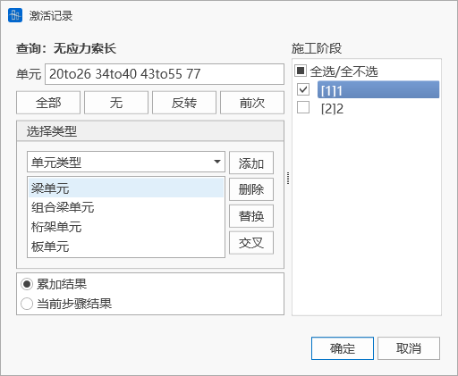

# 11. 结果

# 11.1 **静力分析结果**

## 11.1.1 **荷载组合**

- 功能：输入荷载组合。
- 命令：

  从主菜单中选择“结果”>“荷载组合”;

- 输入
  - **名称**

    荷载组合的名称。&#x20;
  - **类型**
    - 叠加：将各工况结果进行线性叠加，只输出一项结果。
    - 判别：对各工况的分析结果进行判断后叠加，输出Max、Min、All三项结果。若某工况结果大于0，则在Max中叠加；结果小于0，则在Min中叠加；All为Max与Min的绝对值最大结果。
    - 包络：求取各工况结果的包络值，输出Max、Min、All三项结果。Max为各工况结果的最大值，Min为各工况结果的最小值，All为Max与Min的绝对值最大结果。
    - 平方和开方：将每个随机变量的响应视为独立的随机变量，并采用统计学上的平方和开方规则来组合多个随机变量的效应，输出平方和开方结果SRSS。
      - 对于多个独立的随机变量 $X_{1}, X_{2},..., X_{n},$ 每个随机变量都有一个系数 $a_{1}, a_{2},..., a_{n},$SRSS方法的计算表达式为：
      $$
      \mathrm{S R S S}={\sqrt{( a_{1} X_{1} )^{2}+( a_{2} X_{2} )^{2}+...+( a_{n} X_{n} )^{2}}}
      $$
    - 绝对值之和：用于快速评估结构在多种工况下可能遭受的最大荷载，通过假设所有工况的最大响应同时发生，将每个工况的最大响应（不考虑方向）的绝对值相加，输出一个总的响应估计ABSSUM。
      - 对于多个随机变量 $X_{1}, X_{2},..., X_{n},$ 每个随机变量都有一个系数 $a_{1}, a_{2},..., a_{n},$ ABSSUM方法的计算表达式为：
      $$
      ABSSUM= |a_1 X_1| + |a_2X_2| + ...+ |a_nX_n |
      $$
    - 永久强制其余判别：除永久作用类型的荷载（成桥合计和分项，附加荷载工况中的恒载作用类型）采用强制叠加之外，对其余类型工况的分析结果进行判断后叠加，输出Max、Min、All三项结果。若某工况结果大于0，则在Max中叠加；结果小于0，则在Min中叠加；All为Max与Min的绝对值最大结果。
  - **说明**

    对荷载组合的描述说明。&#x20;
  - **荷载工况**

    从荷载工况列表中选择参与荷载组合的荷载工况。&#x20;
  - **荷载系数**

    输入选择的荷载工况参与荷载组合的组合系数。&#x20;

## 11.1.2 **反力**

- 功能：查看反力结果。
- 命令：

  从主菜单中选择“结果”>“结果”>“反力”;

  从主菜单中选择“结果”>“表格”>“反力”;

- 输入
  - **荷载工况/组合**

    选择需要查看反力的荷载工况/组合。&#x20;
  - **分量**

    选择查看反力的分量类型：

    FX：整体坐标系X轴方向或节点局部坐标系x方向的反力分量。

    FY：整体坐标系Y轴方向或节点局部坐标系y方向的反力分量。

    FZ：整体坐标系Z轴方向或节点局部坐标系z方向的反力分量。

    FXYZ：同时输出FX、FY、FZ。

    MX：绕整体坐标系X轴或节点局部坐标系x轴的弯矩反力分量。

    MY：绕整体坐标系Y轴或节点局部坐标系y轴的弯矩反力分量。

    MZ：绕整体坐标系X轴或节点局部坐标系z轴的弯矩反力分量。

    MXYZ：同时输出MX、MY、MZ。
    > 🧐**注：若支座所在节点局部坐标系已定义，则查看的反力分量为节点局部坐标系结果。**
  - **显示类型**

    数值：在模型界面上显示数值。

    图例：在模型界面上显示图例。

    箭头大小比例：模型界面上反力箭头的大小比例。

## 11.1.3 **变形**

- 功能：查看变形结果。
- 命令：

  从主菜单中选择“结果”>“变形”;

- 输入
  - **荷载工况/组合**

    选择需要查看变形的荷载工况/组合。&#x20;
  - **分量**

    选择查看变形的分量类型：
    |      |                   |
    | ---- | ----------------- |
    | DX   | 整体坐标系X轴方向的变形分量    |
    | DY   | 整体坐标系Y轴方向的变形分量    |
    | DZ   | 整体坐标系Z轴方向的变形分量    |
    | RX   | 绕整体坐标系X轴的旋转分量     |
    | RY   | 绕整体坐标系Y轴的旋转分量     |
    | RZ   | 绕整体坐标系X轴的旋转分量     |
    | DXY  | √(DX^2+DY^2)      |
    | DYZ  | √(DY^2+DZ^2)      |
    | DXZ  | √(DX^2+DZ^2)      |
    | DXYZ | √(DX^2+DY^2+DZ^2) |
  - **显示类型**

    等值线

    变形：在模型界面上显示变形形状

    数值：在模型界面上显示数值。

    图例：在模型界面上显示图例。

    变形前：在模型界面上显示变形前形状。

## 11.1.4 **并发反力**

### 11.1.4.1 自**并发反力（只支持表格）**

- 功能：查看活载或支座沉降荷载的并发反力。即每个支座反力的分量极值结果以及同时发生的该支座其它反力分量的值。目前支持查询活载工况，支座沉降工况以及包含以上类型工况的荷载组合的自并发结果查询。
- 注意：活载疲劳相关工况不输出自并发反力。
- 命令：

  从主菜单中选择“结果”>“表格”>“自并发反力”;

  
- 输入
  - **支座节点**

    选择支座节点。&#x20;
  - **选择类型**

    可通过选择类型快速增加支座节点。
  - **荷载工况/荷载组合**

    选择要查看结果的活载工况，支座沉降工况以及包含以上类型工况的荷载组合。
  - **显示项**

    选择反力分量，以查看该分量极值发生时，各支座的自并发反力结果。

### 11.1.4.2 完全并发反力（只支持表格）

- 功能：查看完全并发反力结果，即每个支座反力的分量极值结果、同时发生的该支座其它反力分量、同时发生的其它所有支座的反力值。目前只支持**支座沉降工况**以及**包含沉降工况的荷载组合**的完全并发结果查询。
- 注意：沉降工况、活载工况（疲劳相关活载工况除外）输出完全自并发反力，且活载计算前需勾选是否追踪。
- 命令：

  从主菜单中选择“结果”>“表格”>“完全并发反力”;

  
- 输入
  - **支座节点**

    选择支座节点。&#x20;
  - **选择类型**

    可通过选择类型快速增加支座节点。
  - **荷载工况/荷载组合**

    选择要查看结果的活载工况，支座沉降工况以及包含以上类型工况的荷载组合。

## 11.1.5 并发内力

- 功能：查看梁单元或组合梁单元自并发内力结果，即每个梁单元的内力分量极值结果以及同时发生的该单元其它内力分量的值。目前支持查询**活载工况**，**支座沉降工况**以及**包含以上类型工况的荷载组合**的自并发结果查询。
- 命令：

  从主菜单中选择“结果”>“表格”>“梁单元自并发内力” 或“组合梁单元自并发内力”;

  
- 输入
  - **单元**

    选择梁或组合梁单元号。&#x20;
  - **选择类型**

    可通过选择单元类型、结构组等类型快速增加单元。
  - **荷载工况/荷载组合**

    选择要查看结果的活载工况，支座沉降工况以及包含以上类型工况的荷载组合。
  - **位置号**

    选择单元的I /J端，以查看该端的极值发生时，各单元的自并发内力结果。
  - **显示项**

    选择内力分量，以查看该分量极值发生时，各单元的自并发内力结果。

## 11.1.6 **节点位移**

- 功能：查看节点位移结果。
- 命令：

  从主菜单中选择“结果”>“表格”>“节点位移”;
- 表格显示

  节点：节点编号

  荷载：荷载工况/组合

  DX：整体坐标系下X方向的位移分量

  DY：整体坐标系下Y方向的位移分量

  DZ：整体坐标系下Z方向的位移分量

  RX：整体坐标系下绕X轴的转动分量

  RY：整体坐标系下绕Y轴的转动分量

  RZ：整体坐标系下绕Z轴的转动分量

## 11.1.7 **桁架单元内力**

- 功能：查看桁架内力结果。
- 命令：

  从主菜单中选择“结果”>“结果”>“内力”>“桁架单元内力”;

  从主菜单中选择“结果”>“表格”>“内力”>“桁架单元内力”;

- 输入
  - **荷载工况/组合**

    选择需要查看内力的荷载工况/组合。&#x20;
  - **显示类型**

    折线图：在模型界面上显示折线图。

    变形：在模型界面上显示变形形状

    数值：在模型界面上显示数值。

    图例：在模型界面上显示图例。

    变形前：在模型界面上显示变形前形状。

## 11.1.8 **梁单元内力**

- 功能：查看梁内力结果。
- 命令：

  从主菜单中选择“结果”>“结果”>“内力”>“梁单元内力”;

  从主菜单中选择“结果”>“表格”>“内力”>“梁单元内力”;

- 输入
  - **荷载工况/组合**

    选择需要查看内力的荷载工况/组合。&#x20;
  - **分量**

    选择查看内力的分量类型：

    Fx：轴力。

    Fy：单元局部坐标系y方向的剪力。

    Fz：单元局部坐标系z方向的剪力。

    Mx：关于单元局部坐标系x轴的弯矩。

    My：关于单元局部坐标系y轴的弯矩。

    Mz：关于单元局部坐标系z轴的弯矩。
  - **显示类型**

    折线图：在模型界面上显示折线图。

    变形：在模型界面上显示变形形状

    数值：在模型界面上显示数值。

    图例：在模型界面上显示图例。

    变形前：在模型界面上显示变形前形状。

## 11.1.9 **组合梁单元内力**

- n 功能：查看组合梁内力结果。
- n 命令：

  从主菜单中选择“结果”>“结果”>“内力”>“组合梁单元内力”;

  从主菜单中选择“结果”>“表格”>“内力”>“组合梁单元内力”;

- 输入
  - **荷载工况/组合**

    选择需要查看内力的荷载工况/组合。&#x20;
  - **截面**

    选择是单独计算主材、单独计算辅材、主材+辅材。&#x20;
  - **分量**

    选择查看内力的分量类型：

    Fx：轴力。

    Fy：单元局部坐标系y方向的剪力。

    Fz：单元局部坐标系z方向的剪力。

    Mx：关于单元局部坐标系x轴的弯矩。

    My：关于单元局部坐标系y轴的弯矩。

    Mz：关于单元局部坐标系z轴的弯矩。
  - **显示类型**

    折线图：在模型界面上显示折线图。

    变形：在模型界面上显示变形形状

    数值：在模型界面上显示数值。

    图例：在模型界面上显示图例。

    变形前：在模型界面上显示变形前形状。

## 11.1.10 **板单元内力**

- n 功能：查看板内力结果。
- n 命令：

  从主菜单中选择“结果”>“结果”>“内力”>“板单元内力”;

  从主菜单中选择“结果”>“表格”>“内力”>“板单元内力”;

- 输入
  - **荷载工况/组合**

    选择需要查看内力的荷载工况/组合。&#x20;
  - **内力选项**

    单元：用单元各节点的应力显示等值线。

    节点平均 ：用共享节点的各单元在共享节点位置的平均节点应力显示等值线。
  - **分量**

    选择查看内力的分量类型：

    单元坐标系：输出沿各板单元局部坐标系方向的单位宽度的内力分布。

     内力(单位板宽)输出位置 (a) 内力(单位板宽)输出位置 ")
    > ❓$F_{ij}$：$i$-力作用平面,$j$-力作用方向,符号约定：
    >
    > - 力作用平面的法线方向与某单元坐标轴方向一致，且力作用方向j与单元坐标轴方向一致时为正(+)；
    > - 力作用平面的法线方向与某单元坐标轴方向相反，且力作用方向j与单元坐标轴方向相反时为正(+)。
    >    轴力和剪力(单位板宽) b) 轴力和剪力(单位板宽) ")$M_{ij}$：$i$-力作用平面,$j$-与弯矩旋转方向平行的轴,符号约定：
    > - 当i≠j时，按右手法则，大拇指方向与力作用平面的法线方向一致为正(+)；
    > - 当i=j时，弯矩作用时板的正面/顶面(法线方向作用面)受拉时为正(+)。
    >    弯矩和扭矩(单位板宽) (c) 弯矩和扭矩(单位板宽) ")
    Fxx：单元局部坐标系x方向单位宽度的轴力。

    Fyy：单元局部坐标系y方向单位宽度的轴力。

    Fxy：单元局部坐标系或用户坐标系的x-y平面内(平面内受剪)单位宽度剪力(Fxy=Fyx)。

    Mxx：单元局部坐标系x轴单位宽度的弯矩。

    Myy：单元局部坐标系y轴单位宽度的弯矩。

    Mxy：作用在与局部坐标系或用户坐标系x轴垂直平面内，绕x轴旋转的单位宽度扭矩(Mxy=Myx)。
  - **显示类型**

    变形：在模型界面上显示变形形状

    数值：在模型界面上显示数值。

    图例：在模型界面上显示图例。

    变形前：在模型界面上显示变形前形状。

## 11.1.11 **桁架单元应力**

- 功能：查看桁架应力结果。
- 命令：

  从主菜单中选择“结果”>“结果”>“应力”>“桁架单元应力”;

  从主菜单中选择“结果”>“表格”>“应力”>“桁架单元应力”;

- 输入
  - **荷载工况/组合**

    选择需要查看应力的荷载工况/组合。&#x20;
  - **显示类型**

    折线图：在模型界面上显示折线图。

    变形：在模型界面上显示变形形状

    数值：在模型界面上显示数值。

    图例：在模型界面上显示图例。

    变形前：在模型界面上显示变形前形状。

## 11.1.12 **梁单元应力**

- 功能：查看梁应力结果。
- 命令：

  从主菜单中选择“结果”>“结果”>“应力”>“梁单元应力”;

  从主菜单中选择“结果”>“表格”>“应力”>“梁单元应力”;

- 输入
  - **荷载工况/组合**

    选择需要查看应力的荷载工况/组合。&#x20;
  - **应力**

    选择查看应力的分量类型：

    轴力分量：轴力产生的轴向应力。

    Mz分量：关于单元局部坐标系z轴的弯矩产生的应力。

    My分量：关于单元局部坐标系z轴的弯矩产生的应力。

    组合：轴力加上两个方向弯矩所产生的应力。

    计算位置可选择包络（选取在四点中的组合应力的最大值）、左上、右上、右下、坐下
  - **显示类型**

    折线图：在模型界面上显示折线图。

    变形：在模型界面上显示变形形状

    数值：在模型界面上显示数值。

    图例：在模型界面上显示图例。

    变形前：在模型界面上显示变形前形状。

## 11.1.13 **组合梁单元应力**

- 功能：查看组合梁应力结果。
- 命令：

  从主菜单中选择“结果”>“结果”>“应力”>“组合梁单元应力”;

  从主菜单中选择“结果”>“表格”>“应力”>“组合梁单元应力”;

- 输入
  - **荷载工况/组合**

    选择需要查看应力的荷载工况/组合。&#x20;
  - **截面**

    选择是单独计算主材、单独计算辅材、主材+辅材。&#x20;
  - **应力**

    选择查看应力的分量类型：

    轴力分量：轴力产生的轴向应力。

    Mz分量：关于单元局部坐标系z轴的弯矩产生的应力。

    My分量：关于单元局部坐标系z轴的弯矩产生的应力。

    组合：轴力加上两个方向弯矩所产生的应力。

    计算位置可选择包络（选取在四点中的组合应力的最大值）、左上、右上、右下、坐下
  - **显示类型**

    折线图：在模型界面上显示折线图。

    变形：在模型界面上显示变形形状

    数值：在模型界面上显示数值。

    图例：在模型界面上显示图例。

    变形前：在模型界面上显示变形前形状。

## 11.1.14 **板单元应力**

- 功能：查看板应力结果。
- 命令：

  从主菜单中选择“结果”>“结果”>“应力”>“板单元应力”;

  从主菜单中选择“结果”>“表格”>“应力”>“板单元应力”;

- 输入
  - **荷载工况/组合**

    选择需要查看应力的荷载工况/组合。&#x20;
  - **内力选项**

    单元：用单元各节点的应力显示等值线。

    节点平均 ：用共享节点的各单元在共享节点位置的平均节点应力显示等值线。
  - **位置**

    板顶：板单元单元局部坐标系z方向上缘处的应力。

    板底：板单元单元局部坐标系z方向下缘处的应力。

    绝对值最大：顶面和底面处的应力的绝对值中最大值。
  - **分量**

    选择查看应力的分量类型：

    Sigxx：单元局部坐标系x方向的轴力应力。

    Sigyy：单元局部坐标系y方向的轴力应力。

    Sigxy：单元局部坐标系x-y平面内的剪应力。
  - **显示类型**

    变形：在模型界面上显示变形形状

    数值：在模型界面上显示数值。

    图例：在模型界面上显示图例。

    变形前：在模型界面上显示变形前形状。

## 11.1.15 **约束方程（只支持表格）**

- 功能：查看约束方程。
- 命令：

  从主菜单中选择“结果”>“表格”>“约束方程”;

- 输入
  - **约束方程**

    选择约束方程。&#x20;
  - **选择类型**

    可通过选择类型快速增加约束方程。

## 11.1.16 **弹性连接（只支持表格）**

- 功能：查看弹性连接结果。
- 命令：

  从主菜单中选择“结果”>“表格”>“弹性连接”;

- 输入
  - **弹性连接**

    选择弹性连接。&#x20;
  - **选择类型**

    可通过选择类型快速增加弹性连接。

## 11.1.17 **索单元无应力长度**

- 功能：查看索单元无应力索长。
- &#x20;命令：

  从主菜单中选择“结果>静力分析>无应力索长”;

  
- 输入
  - &#x20;**单元**

    选择索单元。&#x20;
  - **选择类型**

    可通过选择类型快速增加索单元。

## 11.1.18 **预应力筋结果**

暂未开放

## 11.1.19 施工阶段**预警设置**

- 功能：是否进行施工阶段预警，设置预警项。
- 命令：从主菜单中选择“结果>施工阶段预警>预警设置”;

- 输入
  - 施工阶段预警

    勾选该项，则在施工阶段计算完成后（或打开存在施工阶段结果的项目后），自动进行施工阶段的结果预警计算，如存在超限结果，将立即报警。
  - 起始施工阶段

    设置进行结果预警计算的起始施工阶段。
  - 截止施工阶段

    设置进行结果预警计算的终止施工阶段。
  - 构件内力预警

    设置杆、梁、索、板、组合梁单元的内力预警项。

    结构组：对结构组中的构件内力进行预警分析。

    内力分量：指定预警的单元内力分量，包括Fx、Fy、Fz、Mx、My、Mz。

    内力上限：单元内力若高于该值，将报警。

    内力下限：单元内力若低于该值，将报警。
  - 构件应力预警

    

    设置杆、梁、索、板单元的应力预警项。

    **结构组：** 对结构组中的构件应力（组合梁除外）进行预警分析。

    限值定义方式：包含两种定义方式，1）用户自定义；2）设计强度/安全系数。

    **应力上限：** 用户自定义方式，单元应力若高于该值，将报警。

    应力下限：用户自定义方式，单元应力若低于该值，将报警。

    **安全系数：** 设计强度除以安全系数方式，程序自动根据单元的材料类型得到设计的抗拉、抗压强度，除以安全系数后，确定应力上、下限值。
  - 组合梁应力预警

    

    设置组合梁单元的应力预警项。

    结构组：对结构组中的组合梁应力进行预警分析。

    限值定义方式：包含两种定义方式，1）用户自定义；2）设计强度/安全系数。

    主材/辅材应力上限：用户自定义方式，单元的主材/辅材应力若高于该值，将报警。

    主材/辅材应力下限：用户自定义方式，单元的主材/辅材应力若低于该值，将报警。

    安全系数：设计强度除以安全系数方式，程序自动根据单元的材料类型得到设计的抗拉、抗压强度，除以安全系数后，确定应力上、下限值。
  - 支座反力预警

    

    设置支座反力、弹性连接力、约束方程力的预警项。

    边界组：对边界组中的支座反力、弹性连接力、约束方程力进行预警分析。

    反力分量：指定预警的反力分量，包括Fx、Fy、Fz、Mx、My、Mz。

    反力上限：反力分量若高于该值，将报警。

    反力下限：反力分量若低于该值，将报警。

    可批量添加指定结构组或边界组的预警项，删除所有或指定预警项，在预警项表格中直接编辑预警项。预警设置完毕后，点击确定即可开始预警分析。

## 11.1.20 **预警结果**

- 功能：查看预警结果表格。
- 命令：从主菜单中选择“结果>施工阶段预警>预警结果”，点击确定即可。

- 输入
  - 施工阶段构件内力/应力预警

    选择显示预警内力和应力结果的单元类型。
  - 施工阶段反力预警

    选择显示预警反力结果的约束类型。
  - 施工阶段

    选择显示预警结果的施工阶段。

## 11.1.21 **预警显示**

- 功能：查看预警结果图形。
- 命令：从主菜单中选择“结果>施工阶段预警>预警显示”。

- 输入
  - 构件内力超限：显示杆、梁、索、板、组合梁单元内力超限结果。

    施工阶段：选择显示超限结果的施工阶段。

    超限类型：选择超限结果类型，包括所有、超过上限、低于下限。

    数值：是否显示超限的具体数值。
  - 构件应力超限：显示杆、梁、索、板单元应力超限结果。

    施工阶段：选择显示超限结果的施工阶段。

    超限类型：选择超限结果类型，包括所有、超过上限、低于下限。

    数值：是否显示超限的具体数值。
  - 组合梁内力超限：显示组合梁单元内力超限结果。

    施工阶段：选择显示超限结果的施工阶段。

    超限类型：选择超限结果类型，包括所有、主材高于上限、主材低于下限、辅材高于上限、辅材低于下限。

    数值：是否显示超限的具体数值。
  - 支座反力超限：显示支座反力、弹性连接力、约束方程力超限结果。

    施工阶段：选择显示超限结果的施工阶段。

    超限类型：选择超限结果类型，包括所有、超过上限、低于下限。

    数值：是否显示超限的具体数值。

## 11.1.22 **生成检算工况**

- 功能：对超限的钢筋混凝土和预应力混凝土构件进行进一步检算，并生成检算报告。
- 命令：从主菜单中选择“结果>施工阶段预警>生成检算工况”。

工况名称：用户填写生成的检算工况名称。

材料类型：选择需要检算的构件材料。

规范：选择检算规范。目前支持两种规范，《公路钢筋混凝土及预应力混凝土桥梁设计规范》（JTG3362-2018），以及《铁路桥涵混凝土结构设计规范》（TB10092-2017 J462-2017）。

结构类型：包括钢筋混凝土构件、全预应力构件、A类构件和B类构件。

确定上述输入项后，点击“生成检算工况”，即可进入到混凝土结构检算工况页面中，详见[12. 检算](<../12. 检算/12. 检算.md> "12. 检算")。

# 11.2 **动力分析结果**

## 11.2.1 **表格结果输出**

### **11.2.1.1时程表格**

##### **（1）节点反力**

- 功能：输出单个节点反力的时程数据。
- 命令：结果>时程表格>节点反力

- 输入

  节点：选择约束边界的节点。

  时程荷载工况：选择有计算结果的时程荷载工况名称。

##### **（2）变形**

- 功能：输出单个节点位移/速度/加速度时程数据。
- 命令：

  结果>时程表格>变形>位移

  结果>时程表格>变形>速度

  结果>时程表格>变形>加速度

- 输入

  节点：选择输出位移结果的节点。

  时程荷载工况：选择有计算结果的时程荷载工况名称。

##### **（3）内力**

- 功能：输出单个单元内力时程数据。
- 命令：

  结果>时程表格>内力>桁架单元内力

  结果>时程表格>内力>梁单元内力

  结果>时程表格>内力>板单元内力

  结果>时程表格>内力>边界单元内力

- 输入

  单元：选择输出内力结果的单元。

  时程荷载工况：选择有计算结果的时程荷载工况名称。

  位置号：选择输出单元内力位置。

##### **（4）应力**

- 功能：输出单个单元应力时程数据。
- 命令：

  结果>时程表格>应力>桁架单元应力

  结果>时程表格>应力>梁单元应力

  结果>时程表格>应力>板单元应力

- 输入

  单元：选择输出应力结果的单元。

  时程荷载工况：选择有计算结果的时程荷载工况名称。

  位置号：选择输出单元应力位置。

### **11.2.1.2 时程最值表格**

##### **（1）节点反力**

- 功能：输出节点反力的最值结果。
- 命令：结果>时程最值表格>节点反力

- 输入

  支座节点：选择约束边界的节点，可多选。

  选择类型：可根据类型选择该类别下所有支座节点号。

  荷载工况：选择有计算结果的时程荷载工况名称和最大值、最小值。

##### **（2）变形**

- 功能：输出多个节点位移/速度/加速度最值数据。
- 命令：

  结果>时程最值表格>变形>位移

  结果>时程最值表格>变形>速度

  结果>时程最值表格>变形>加速度

- 输入

  节点：选择输出位移最值结果的节点集合。

  选择类型：可根据类型选择该类别下所有节点号。

  荷载工况：选择有计算结果的时程荷载工况名称和最大值、最小值。

##### **（3）内力**

- 功能：输出多个单元内力最值数据。
- 命令：

  结果>时程最值表格>内力>桁架单元内力

  结果>时程最值表格>内力>梁单元内力

  结果>时程最值表格>内力>板单元内力

  结果>时程最值表格>内力>边界单元内力

- 输入

  单元：选择输出内力结果的单元集合。

  选择类型：可根据类型选择该类别下所有单元号。

  荷载工况：选择有计算结果的时程荷载工况名称和最大值、最小值。

  位置号：选择输出单元内力位置。

##### **（4）应力**

- 功能：输出对个单元应力最值数据。
- 命令：

  结果>时程最值表格>应力>桁架单元应力

  结果>时程最值表格>应力>梁单元应力

  结果>时程最值表格>应力>板单元应力

- 输入

  单元：选择输出应力结果的单元集合。

  选择类型：可根据类型选择该类别下所有单元号。

  荷载工况：选择有计算结果的时程荷载工况名称和最大值、最小值。

  位置号：选择输出单元应力位置。

## 11.2.2 **图形结果输出**

### **11.2.2.1 图形输出**

- 功能：输出时程曲线，将时程曲线数据导出到excel表格。
- 命令：

  结果>时程结果函数>时程图形

  结果>时程结果函数>时程表格

- 输入

  定义/编辑函数：定义或编辑要输出的时程结果图表函数。程结果图表类型详见**11.2.2.2 输出函数定义类型**.

  函数列表：列出已定义的结果图表函数。

  添加：将函数列表中函数添加至右侧纵轴函数内。

  移除：移除纵轴函数内函数。

  编辑：选择左侧函数列表中函数，打开定义函数对话框进行修改。

  纵轴函数：在函数列表中选择将输出的函数。
  > 🧐**注意：纵轴函数只能同时显示同种时程结果图表类型。**
  > 横轴函数：选择图形横轴的刻度基准值。
  显示：显示时程结果函数横轴和纵轴关系曲线。

  导出数据：将横轴和纵轴函数数据导出excel。

  

### **11.2.2.2 输出函数定义类型**

##### **（1）位移/速度/加速度**

- 功能：输出节点位移结果时程函数。
- 命令：结果>时程结果函数>时程图形>定义/编辑函数>位移/速度/加速度>添加

- 输入
  - **函数名称**

    定义位移/速度/加速度结果时程函数名称。
  - **节点号**

    选择输出时程函数曲线的节点号。
  - **参考点**

    绝对值：输出相对于地面产生的响应。

    相对参考节点：以输入节点为基准，计算要输出节点的相对响应。
  - **分量**

    选择位移/速度/加速度输出分量，可选择DX，DY，DZ，RX，RY，RZ。
  - **时程荷载工况**

    选择要输出的结果时程函数的时程荷载工况。

##### **（2）节点反力**

- 功能：输出节点反力结果时程函数。
- 命令：结果>时程结果函数>时程图形>定义/编辑函数>节点反力>添加

- 输入
  - **函数名称**

    定义节点反力结果时程函数名称。
  - **节点号**

    选择输出时程函数曲线的约束节点号。
  - **分量**

    选择节点反力输出分量，可选择FX，FY，FZ，MX，MY，MZ。
  - **时程荷载工况**

    选择要输出的结果时程函数的时程荷载工况。

##### **（3）梁单元内力/应力**

- 功能：输出梁单元内力/应力结果时程函数。
- 命令：结果>时程结果函数>时程图形>定义/编辑函数>梁单元内力/应力>添加

- 输入
  - **函数名称**

    定义梁单元内力/应力结果时程函数名称。
  - **单元号**

    选择输出时程函数曲线的单元号。
  - **结果类型**

    可选择输出内力结果和应力结果。
  - **I端**

    输出单元I端内力/应力结果。
  - **J端**

    输出单元J端内力/应力结果。
  - **分量**

    选择单元内力/应力输出分量。内力可选择轴力、剪力-y、剪力-z、扭矩、弯矩-y、弯矩-z。应力输出为组合应力，输出分量可选择梁单元左上、右上、左下、右下。
  - **时程荷载工况**

    选择要输出的结果时程函数的时程荷载工况。

##### **（4）桁架单元内力/应力**

- 功能：输出桁架单元内力/应力结果时程函数。
- 命令：结果>时程结果函数>时程图形>定义/编辑函数>桁架单元内力/应力>添加

- 输入
  - **函数名称**

    定义桁架单元内力/应力结果时程函数名称。
  - **单元号**

    选择输出时程函数曲线的单元号。
  - **结果类型**

    可选择输出内力结果和应力结果。
  - **I端**

    输出单元I端内力/应力结果。
  - **J端**

    输出单元J端内力/应力结果。
  - **时程荷载工况**

    选择要输出的结果时程函数的时程荷载工况。

##### **（5）板单元内力/应力**

- 功能：输出板单元内力/应力结果时程函数。
- 命令：结果>时程结果函数>时程图形>定义/编辑函数>板单元内力/应力>添加

- 输入
  - **函数名称**

    定义板单元内力/应力结果时程函数名称。
  - **单元号**

    选择输出时程函数曲线的单元号。
  - **结果类型**

    可选择输出内力结果和应力结果。
  - **端点**

    可选择输出板单元I、J、K、L四个端点。
  - **分量**

    选择板单元内力/应力输出分量。内力可选择FX，FY，FZ，MX，MY，MZ。应力输出分量可选择梁Sx、Sy、Sxy、S1、S2、Beta。
  - **时程荷载工况**

    选择要输出的结果时程函数的时程荷载工况。

##### **（6）边界单元连接变形/内力**

- 功能：输出边界单元连接变形/内力结果时程函数。
- 命令：结果>时程结果函数>时程图形>定义/编辑函数>边界单元连接变形/内力>添加

- 输入
  - **函数名称**

    定义边界单元连接变形/内力结果时程函数名称。
  - **单元号**

    选择输出时程函数曲线的边界单元连接编号。
  - **结果类型**

    可选择输出变形结果和内力结果。变形结果为边界单元I、J节点相对位移，内力结果为边界单元内力。
  - **分量**

    选择单元连接变形/内力输出分量。变形分量可选择DX，DY，DZ，内力可选择FX，FY，FZ。
  - **时程荷载工况**

    选择要输出的结果时程函数的时程荷载工况。

# 11.3 **自振及屈曲分析结果**

## 11.3.1 **表格结果输出**

- 功能：表格输出振型的角频率、工程频率、周期、振型参与质量、参与系数结果。
- 命令：

  结果>表格>周期与振型

  从主菜单中选择“”；

  

## 11.3.2 **图形结果输出**

- 功能：显示指定振型的模态位移。
- 命令：

  从主菜单中选择“结果>模态>振型”;

- 输入
  - **模态号**

    选择需要显示的振型模态号。也选择“多模态”按钮同时显示多个模态。
  - **显示类型**

    模态显示的类型、数值、图例等通过该项设置。
- **荷载工况/荷载组合**

  选择要查看结果的活载工况，支座沉降工况以及包含以上类型工况的荷载组合。
