## 12.1 功能介绍

### 12.1.1 混凝土检算

本模块用于混凝土梁单元的强度校核。

- 适用于：

  混凝土截面、预应力混凝土截面。
- 包含的规范为：

  ① 《公路钢筋混凝土及预应力混凝土桥涵设计规范》（JTG 3362—2018）

  ② 《铁路桥涵混凝土结构设计规范》（TB 10092—2017  J 462—2017）

  ③ 《英规：钢桥、混凝土桥及组合结构桥》（BS 5400:2006）

  ④ 《美规：AASHTO LRFD BRIDGE DESIGN SPECIFICATIONS, NINTH EDITION, 2020》
- 计算功能：

  ① 正截面抗弯承载力计算

  ② 斜截面抗剪承载力计算

  ③ 正截面应力

  ④ 剪应力与主应力

  ⑤ 裂缝宽度

  ⑥ 正截面抗裂

  ⑦ 斜截面抗裂

  ⑧ 预应力度计算

  ⑨ 弯矩曲率曲线分析

  ⑩ PM承载力曲线分析

  ⑪ MyMz承载力曲线分析

  ⑫ 截面配筋情况
- 计算线程：

  由 总体设置->并行计算设置 决定计算线程数。

### 12.1.2 钢桁梁检算

本模块用于混凝土梁单元的强度校核。

- 适用于：

  任意类型截面，**但钢桁梁扣孔功能仅对钢梁截面支持**。
- 包含的规范为：

  ① 《铁路桥梁钢结构设计规范》(TB 10091-2017 J461-2017)
- 计算功能：

  ① 强度计算

  ② 稳定计算

  ③ 疲劳计算

## 12.2 **配筋**

### 12.2.1 **纵向钢筋配筋**

#### 钢筋截面列表

- 功能：显示配置了纵向钢筋的截面列表。
- 命令：从主菜单中选择“检算”>“纵向钢筋”;

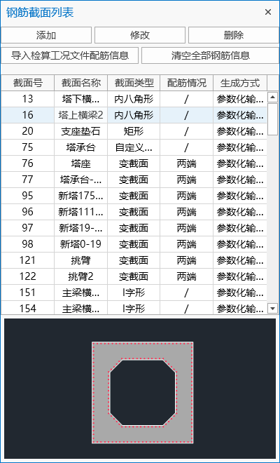

- 添加：添加新的截面配筋。方式有：参数化配筋、自定义配筋、DXF批量导入钢筋、查看钢筋点列表。
- 修改：在列表中选择相应截面，编辑或显示该截面配筋。
- 删除：在列表中选择相应截面，删除该截面配筋信息。
- 导入检算工况文件配筋信息：若已有检算工况，且在工况内配筋，可通过此功能将该检算工况内配筋信息导出到钢筋截面列表。
- 清空全部配筋信息：删除列表中全部截面的配筋信息。

#### **参数化配筋**

- 功能：使用参数化的方式对截面进行纵向钢筋配筋。线宽截面不允许使用参数化输入钢筋方式配筋
- 命令：“主菜单”>“检算”>“纵向钢筋”>“添加”>“参数化配筋”。

- 输入
  - **截面号**

    通过按钮选择截面：

    

    显示变截面组内插值截面：勾选后，可选择变截面组内插值截面，以（G变截面组号-插值截面号）的命名格式。

    
  - **外圈钢筋**

    绕截面外线圈布置钢筋。
  - **内圈钢筋**

    绕截面内线圈布置钢筋。
  - **配筋方式**

    可选按间距分布或按数量分布方式配筋。

#### 自定义配筋

- 功能：针对单独截面自定义配筋，支持选择截面线段局部参数化配筋、cad框选配筋、编辑截面钢筋点等功能。
- 命令：“主菜单”>“检算”>“纵向钢筋”>“添加”>“自定义配筋”。

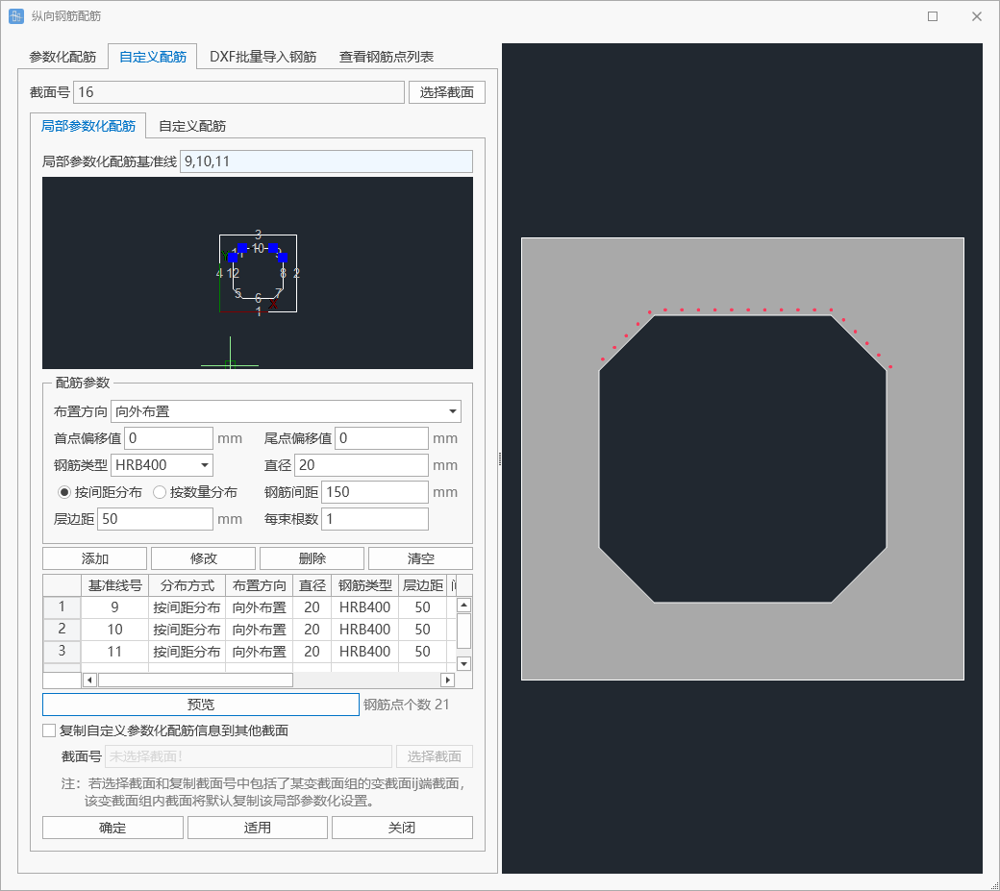

- 输入
  - **截面号**

    通过按钮选择截面：

    

    变截面：选择截面是变截面，再选择是I端截面配筋还是J端截面配筋。

    

    显示变截面组内插值截面：勾选后，可选择变截面组，以（G变截面组号）的命名格式。再选择是变截面组内第几个插值截面。

    

    

##### 局部参数化配筋

- 输入
  - **局部参数化配筋基准线**

    点击蓝色对话框，即可在下方的截面示意图中选取截面线段。

    对话框支持直接输入基准线号，支持1to3、2to10by2等写法。
  - **配筋参数**

    布置方向：以截面中心点为中心，选择线段是向外布置还是向内布置。

    首点偏移值：参数化配筋起始点距离线段首点的偏移量。

    尾点偏移值：参数化配筋终点距离线段尾点的偏移量。

    配筋方式：可选按间距分布或按数量分布方式配筋。
  - **预览**

    可在右侧图示区预览当前局部参数化表格设置的截面配筋情况。
  - **复制自定义参数化配筋信息到其他截面**

    复制当前设置到其他截面。
    > 🕵️注：该复制是复制当前的局部参数化配筋信息，即被复制截面设置在第三号基准线局部参数化配筋，那么复制截面是复制第三号基准线局部参数化配筋设置，并不是直接复制被复制截面的钢筋点坐标。
    > 🕵️注：若复制截面号中包括了某变截面组的变截面ij端截面，该变截面组内插值截面将默认复制该局部参数化设置。

##### 自定义配筋

- 输入
  - **框选**

    点击框选，调取CAD程序，在CAD中框选需要导入的线段，其中直径小于设置直径值的圆会作为钢筋导入进来，并在下侧的“编辑钢筋点列表”中显示，可二次编辑。
  - **预览**

    可在右侧图示区预览当前钢筋点列表的截面配筋情况。
  - **复制自定义参数化配筋信息到其他截面**

    复制当前钢筋点到其他截面。
    > 🕵️注：该复制是复制当前的钢筋点列表，即被复制截面所有的钢筋点坐标信息。

#### **dxf批量导入钢筋**

- 功能：使用dxf文件批量导入截面钢筋。
- 命令：“主菜单”>“检算”>“纵向钢筋”>“添加”>“dxf批量导入钢筋”。

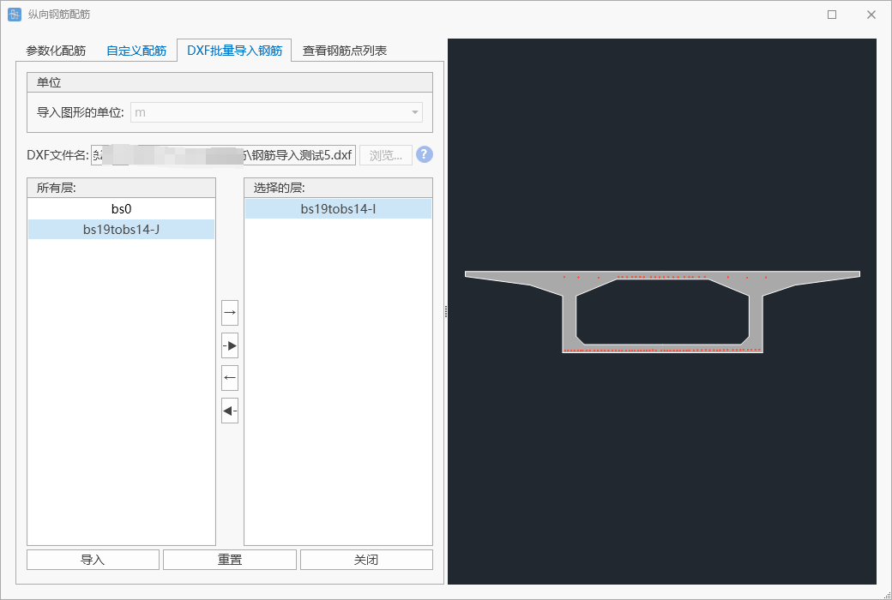

- 输入
  - **dxf文件**

    通过按钮选择dxf文件，按图层导入对应截面，dxf文件导入规则为：

    当导入DXF文件时，图层名需与截面名称对应，具体要求如下:

    1、等载面：图层名与载面名称相同。

    2、变载面：I端截面：图层名为：截面名称 +“-I”。J端截面：图层名为：截画名称 +“-J"

    3、变截面组内插值载面：图层名为:“G-”+变载面组名称 +“-插值序号”。

    例如：

    等载面名称为“倒T型载面1”，图层名需为“倒T型载面1”

    变载面名称为“倒T型载面1”，I端载面图层名需为“倒T型截面1-I”，J端载面图层名需为“倒T型截面1-J”。

    变载面组名称为“倒T型载面1"，第3个插值截面图层名需为“G-倒T型截面1-3”

    导入绘制的圆圈，圆心为导入钢筋的中心点坐标，圆圈直径为钢筋直径，圆圈的颜色为钢筋的钢筋规格：

    索引颜色号为190(RBG:127,0,255)的圆为钢筋类型为HPB235的钢筋；

    索引颜色号为200(RBG:191,0,255)的圆为钢筋类型为HPB300的钢筋；

    索引颜色号为210(RBG:255,0,255)的圆为钢筋类型为HRB335的钢筋；

    索引颜色号为220(RBG:255,0,191)的圆为钢筋类型为HRB400的钢筋；

    索引颜色号为230(RBG:255,0,127)的圆为钢筋类型为HRB500的钢筋。

    索引颜色号为191(RBG:194,127,255)的圆为钢筋类型为BS250的钢筋；

    索引颜色号为193(RBG:124,82,165)的圆为钢筋类型为BS460的钢筋；

    索引颜色号为195(RBG:95,63,127)的圆为钢筋类型为BS500的钢筋；

    索引颜色号为201(RBG:233,127,255)的圆为钢筋类型为Grade60的钢筋；

    索引颜色号为203(RBG:145,82,165)的圆为钢筋类型为Grade70的钢筋；

    索引颜色号为205(RBG:111,63,127)的圆为钢筋类型为Grade80的钢筋；

    索引颜色号为207(RBG:66,38,76)的圆为钢筋类型为Grade100的钢筋；

    导入成功后后续都可在钢筋点列表中修改。
  - **单位**

    设置导入图形的单位。
  - **所有层**

    该dxf文件匹配的所有截面。
  - **选择的层**

    选择导入的截面。
  - **重置**

    重新选择导入的文件。

#### **编辑钢筋点列表**

- 功能：显示选择截面的钢筋点列表信息，可编辑。
- 命令：“主菜单”>“检算”>“纵向钢筋”>“添加”>“查看钢筋点列表”。

- 输入
  - **选择截面**

    通过按钮选择截面。不支持特性截面。
  - **钢筋列表**

    点击列头再粘贴，可对该列批量粘贴复制的内容。

### 12.2.2 箍筋

- 功能：设置箍筋。
- 命令：“主菜单”>“检算”>“箍筋”。

#### 箍筋设置

- 功能：设置箍筋配置。
- 输入
  - **箍筋编号**

    设置该类型箍筋的箍筋编号。
  - **箍筋名称**

    设置该类型箍筋的箍筋名称。
  - **箍筋类型**

    普通箍筋、螺旋式箍筋。
  - **钢筋类型**

    支持R235，HPB300，HRB335，HRB400，HRB500，BS250，BS460，BS500，Grade60，Grade75，Grade80，Grade100。
  - **环数**

    箍筋类型为螺旋式箍筋时需设置，螺旋式箍筋的环数。
  - **肢数**

    箍筋类型为普通箍筋时需设置，箍筋束中纵向排列的钢筋的数量。
  - **箍筋直径**

    设置箍筋直径。
  - **箍筋间距**

    设置箍筋的间距。
  - **核心直径**

    箍筋类型为螺旋式箍筋时需设置，螺旋式箍筋的核心直径。

#### 单元配置箍筋信息

- 功能：对单元赋予箍筋特性。
- 输入
  - **单元号**

    仅支持杆系单元。
  - **箍筋名称**

    选择在上一环节设定好的箍筋类型。
  - **布置位置**

    可以选择只在I端或者只在J端或者两端都布置箍筋。
  - **添加或修改**

    可以添加或修改单元配置箍筋信息
  - **删除**

    选择表格要删除的行，点击删除，可删除该截面的配箍信息。
  - **清空**

    清空全部单元配箍信息。

### 12.2.3 竖向钢束

- 功能：设置竖向钢束。
- 命令：“主菜单”>“检算”>“竖向钢束”。

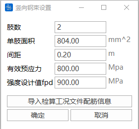

- 输入
  - **肢数**

    设置预应力筋束中的钢筋数量。
  - **单肢面积**

    设置竖向预应力筋束中一个肢的横截面积。
  - **间距**

    设置竖向预应力筋束中相邻两肢之间的距离。
  - **有效预应力**

    设置施加在预应力筋上的实际预应力大小。
  - **强度设计值**$f_{pd}$

    设置竖向预应力筋的强度设计值$f_{pd}$。

## 12.3 混凝土检算

### 12.3.1 检算材料

- 功能：设置混凝土检算所需的材料参数。可以专门针对检算需求调整材料参数，而不会影响特性模块中的原始材料定义，实现了检算参数与基础材料特性的独立管理
- 命令：从主菜单中选择“检算”>“检算材料”;

> 🧐进行检算的材料必须先在"特性" → "材料"中完成定义，方可在此模块中进一步设置检算参数。

- 输入
  - 修改
    - 点击"修改"复选框可编辑当前检算参数
    - 取消修改将恢复系统默认值
    - **重要提示**：在此界面修改的一般材料特性参数（如弹性模量）如与"特性"-"材料"中定义的参数不一致，将仅应用于混凝土检算计算，结构计算仍采用"特性"-"材料"中定义的参数值。
  - 适用

    保存当前修改的参数设置。

### 12.3.2 检算荷载组合

#### 检算荷载组合

- 功能：输入检算荷载组合。
- 命令：从主菜单中选择“检算”>“检算荷载组合”;

- 表格
  - &#x20;**名称**

    检算荷载组合的名称。&#x20;
  - **类型**

    选择该检算荷载组合的类型：

    基本组合、偶然组合、标准值组合、频遇组合、准永久组合

    主力组合、主加附组合、主加特殊组合
  - &#x20;**荷载工况**

    从荷载工况列表中选择参与荷载组合的荷载工况。

    注：活载类型的荷载工况，选取的是9.5.5  **移动荷载分析工况**中定义的工况作为活载参与组合，如果是在静力荷载中定义的类型为“活载”的9.1 荷载工况，不参与组合。
  - **不利系数**

    输入选择的荷载工况参与检算荷载组合的不利系数。
  - **有利系数**

    输入选择的荷载工况参与检算荷载组合的有利系数。
    > 🧐荷载与不利系数，同号走最大，异号走最小。
    >
    > 荷载与有利系数，同号走最小，异号走最大。
    >
    > 例：
    >
    > 若Fx为正，不利系数为正，则组合到Fxmax；有利系数为正，则组合到Fxmin；
    >
    > 若Fx为正，不利系数为负，则组合到Fxmin；有利系数为负，则组合到Fxmax；
    >
    > 若Fx为负，不利系数为正，则组合到Fxmin；有利系数为正，则组合到Fxmax；
    >
    > 若Fx为负，不利系数为负，则组合到Fxmax；有利系数为负，则组合到Fxmin；
    > 🧐填写Tip：
    >
    > 1. 永久作用（除支座沉降外）
    >
    >    包括结构自重、预加力、收缩徐变等，不利系数和有利系数均不得取负值。
    > 2. 活载与支座沉降
    >
    >    不利系数不得取负值，有利系数无实际意义，可填写为0。
    > 3. 其他可变作用
    >
    >    不利系数可以取负值。例如，针对风荷载，可通过填写两条相同工况但不利系数取正负相反的情况来模拟不同方向的风作用。有利系数无实际意义，可填写为0。
    >
    > 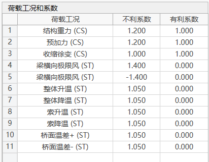
  - **自动生成检算荷载组合**

    辅助用户生成检算荷载组合功能，详见自动生成检算荷载组合。

#### 自动生成检算荷载组合

- 功能：辅助用户生成检算荷载组合。
- 命令：“检算荷载组合”窗口左下角的按钮;

- 输入
- **荷载组合**

  可选择规范列表：

  《公路桥涵设计通用规范》(JTG D60-2015)

  《铁路桥涵设计规范》（TB 10002-2017 J460-2017）

  

  
  - 铁路规范支持自动组合：

    主力组合、主加附组合、主加特殊荷载组合。
  - 公路规范支持自动组合：

    参与承载能力极限状态设计：基本组合、偶然组合

    参与正常使用极限状态设计：频遇组合、准永久组合

    参与弹性阶段截面应力计算（B类构件、钢筋混凝土构件还需考虑开裂情况）：标准值组合
  - 新铁路极限状态法组合:

    参与承载能力极限状态设计：基本组合I-VI、偶然组合VII

    参与预应力构件正常使用极限状态设计：频遇组合IX、频遇组合X、准永久组合XI

    参与钢筋混凝土构件正常使用极限状态设计：主力组合、主加附组合、偶然组合VII
- **风荷载设置**

  由于顺桥向和横桥向、有车风和无车风不能组合在一起，风荷载需单独设置。选择在9.1 荷载工况中定义类型为 风荷载 的荷载工况参与组合。

  
- &#x20;**梯度温度设置**

  由于顺桥向和横桥向、梯度升温和梯度降温不能组合在一起，梯度温度需单独设置。选择在9.1 荷载工况中定义类型为 梯度温度 的荷载工况参与组合。

  
- **制动力设置**

  选择的制动力工况会作为作为两个系数相反的工况参与组合。选择在9.1 荷载工况中定义类型为制动力 的荷载工况参与组合。

  
- **其他可变作用设置**

  其他荷载组合类型（包括自定义）的荷载工况若参与检算，勾选该项的“是否参与组合”，并填写自定义系数。

  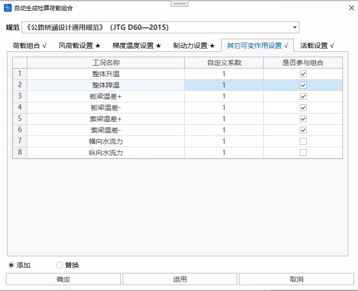
- **活载设置**

  若移动荷载参与检算，可选择在移动荷载分析工况中定义的工况参与组合，勾选该项的“是否参与组合”，并填写自定义系数。

  
- **添加/替换**

  添加：在原本的检算荷载组合后添加自动生成的检算荷载组合。

  替换：自动生成的检算荷载组合替换原有的检算荷载组合。

### 12.3.3 混凝土检算工况

- 功能：设置混凝土检算工况。（后续12.6 生成计算书也将使用该类型工况）
- 命令：从主菜单中选择“检算”>“混凝土检算”;

- **操作**
  - **添加**

    添加新的混凝土检算工况。

    

    规范支持：《公路钢筋混凝土及预应力混凝土桥涵设计规范》(JTG 3362-2018)、《铁路桥涵混凝土结构设计规范》(TB 10092-2017 J462-2017)。

    结构类型支持选择：钢筋混凝土、A类构件、B类构件、预应力构件。

    检算结构组：可以选择当前计算结果中成桥状态下，参与计算的6.5 **结构组**，且该中包含梁单元。
  - **删除**

    删除该混凝土检算工况。&#x20;
  - **编辑**

    编辑混凝土检算工况。&#x20;
  - **更新检算数据**

    【检算工况参数同步机制说明】

    当用户打开检算工况时，系统将遵循以下同步规则:
    1. 参数自动锁定机制

       在检算界面完成参数设置或执行计算操作后，当前参数配置将进入锁定状态。

       锁定状态下，配筋方案、箍筋规格等关联参数的后续修改不会自动同步至该检算工况
    2. 数据更新与重载流程

       如需将最新参数应用于已锁定的检算工况，请执行:
       - 步骤一 点击工具栏【更新检算数据】按钮。
       - 步骤二 双击目标检算工况:
    > 🕵️参数解锁后，检算界面将清空原有设置，需重新输入计算参数。
    > 🕵️本机制旨在防止设计过程中途修改，对既有计算结果造成意外影响。
    > 🕵️支持多工况独立配置：不同检算工况可独立保存差异化的配筋参数配置。
  - &#x20;**检算**

    检算该工况，详见12.3.4混凝土检算参数设置。

### 12.3.4 混凝土检算参数设置

#### 1 混凝土检算介绍

- 功能：设置检算信息。
- 命令：设置混凝土检算工况，在混凝土检算工况窗口中选择设置好的混凝土检算工况，点击“检算”（也可双击进入）；

- 目前支持检算规范为：

  《公路钢筋混凝土及预应力混凝土桥涵设计规范》(JTG 3362-2018)

  《铁路桥涵混凝土结构设计规范》(TB 10092-2017 J462-2017)。

  《英规：钢桥、混凝土桥及组合结构桥-Part4》（BS 5400-4:2006）

  《美规：AASHTO LRFD BRIDGE DESIGN SPECIFICATIONS, NINTH EDITION, 2020》
- **基本按钮：**
  - **开始计算**

    基于设置好的参数设置，开始进行检算计算，详见计算。&#x20;
  - **删除结果**

    删除该检算工况的检算计算结果。&#x20;
  - &#x20;**基本信息**

    详见2 基本信息。&#x20;
  - **配筋**

    设置该检算工况下的截面普通钢筋、箍筋、竖向预应力。

    

    详见3 截面与纵向钢筋、4 查看截面配筋情况、5 箍筋、6 竖向预应力。
  - **单元信息**

    详见7 单元信息。&#x20;
  - **荷载**

    详见8 荷载。&#x20;
  - &#x20;**分析设置**

    详见12.3.5检算项目说明中对应检算项目的分析设置。&#x20;
  - **结果查看**

    详见12.3.5检算项目说明。

#### 2 基本信息

- 功能：设置混凝土检算的规范工艺及结构类型、设置计算项目

- &#x20;**设计安全等级**

  公规需填写设计安全等级。
- **制作工艺**

  预制构件、现场浇筑。
- **板或梁单元**

  公规需选择是板式结构还是梁式结构。
- &#x20;**结构类型**

  铁规需选择是桥跨结构及顶帽还是其他结构。
- **计算项目**
  - **《公路钢筋混凝土及预应力混凝土桥涵设计规范》(JTG 3362-2018)支持的检算项目：**
    - 钢筋混凝土：

      正截面抗弯承载力、斜截面抗剪承载力、正截面应力、剪应力与主应力、裂缝宽度、弯矩曲率曲线分析、PM承载力曲线分析、MyMz承载力曲线分析；
    - A类构件：

      正截面抗弯承载力、斜截面抗剪承载力、正截面应力、剪应力与主应力、正截面抗裂、斜截面抗裂、弯矩曲率曲线分析、PM承载力曲线分析、MyMz承载力曲线分析；
    - B类构件：

      正截面抗弯承载力、斜截面抗剪承载力、正截面应力、剪应力与主应力、裂缝宽度、正截面抗裂、斜截面抗裂、弯矩曲率曲线分析、PM承载力曲线分析、MyMz承载力曲线分析；
    - 全预应力构件：

      正截面抗弯承载力、斜截面抗剪承载力、正截面应力、剪应力与主应力、正截面抗裂、斜截面抗裂、弯矩曲率曲线分析、PM承载力曲线分析、MyMz承载力曲线分析；
  - **《铁路桥涵混凝土结构设计规范》(TB 10092-2017 J462-2017)支持的检算项目：**
    - 钢筋混凝土：

      正截面抗弯承载力、斜截面抗剪承载力、正截面应力、剪应力与主应力、裂缝宽度、弯矩曲率曲线分析、PM承载力曲线分析、MyMz承载力曲线分析；
    - A类构件：

      正截面抗弯承载力、斜截面抗剪承载力、正截面应力、剪应力与主应力、预应力度、弯矩曲率曲线分析、PM承载力曲线分析、MyMz承载力曲线分析；
    - B类构件：

      正截面抗弯承载力、斜截面抗剪承载力、正截面应力、剪应力与主应力、裂缝宽度、预应力度、弯矩曲率曲线分析、PM承载力曲线分析、MyMz承载力曲线分析；
    - 全预应力构件：

      正截面抗弯承载力、斜截面抗剪承载力、正截面应力、剪应力与主应力、正截面抗裂、预应力度、弯矩曲率曲线分析、PM承载力曲线分析、MyMz承载力曲线分析；

#### 3 截面与纵向钢筋

- 功能：设置该检算工况下的截面与纵向钢筋。
- 命令：从主菜单中选择“检算”>“检算荷载组合”>选择检算工况点击“检算”>“混凝土检算”>“配筋”>“截面与纵向钢筋”;

- 输入
- &#x20;**截面**

  程序自动导入参与检算的单元截面。
- **参数化输入钢筋**

  

  参数化输入钢筋，可选按间距输入或按数量输入。长度单位为mm。
  - 外圈钢筋: 靠近外边缘的钢筋；
  - 内圈钢筋: 靠近内边缘的钢筋；
  - 间距: 按间距输入时需填，表示同层钢筋的距离，可以输入与层数相应的数量（例：150,150,150），也可输入一个数字（例：150）表示每层钢筋采用相同间距；
  - 每层束数: 按数量输入时需填，表示每层钢筋束筋数量，如每层束数为10，每束根数为2，则每层钢筋数量为20。可以输入与层数相应的数量（例：150,150,150），也可输入一个数字（例：150）表示每层钢筋都采用该束数。
  - 直径:可以输入与层数相应的数量（例：28,28,28），也可输入一个数字（例：28）表示每层钢筋采用相同直径。
  - 层距: 层数为1可以不填，大于1填相应的层距（例：如果有3层，填写100,100），顺序为从外圈向内圈。
  - 每束根数:用于束筋的输入，填1表示不采用束筋，填2表示两根钢筋为一束。可以输入与层数相应的数量（例：2,2,1），也可输入一个数（例：2）表示每层采用相同的每束根数。
- **输入钢筋点方式输入钢筋**

  

  双击截面列表，进入该截面的截面窗口中，可以在钢筋列表依次输入钢筋点的坐标、直径、种类参数。填写完成后点击“编辑”，完成钢筋设置。

  种类：1、2、3、4、5分别表示钢筋类型：R235、HPB300、HRB335、HRB400、HRB500。
- **CAD框选输入钢筋**

  

  双击截面列表，进入该截面的截面窗口中，点击CAD框选，在CAD中选择绘制好的截面钢筋，即可将相关信息导入到钢筋列表中，点击“编辑”，完成钢筋设置。通过颜色号表示钢筋类型：31、32、33、34、35分别表示钢筋类型：R235、HPB300、HRB335、HRB400、HRB500。

#### 4 查看截面配筋情况

- 说明：显示截面配筋情况。
- 命令：

  从主菜单中选择“检算”>“检算荷载组合”>选择检算工况点击“检算”>“混凝土检算”>“配筋”>“查看截面配筋情况”;

- &#x20;参数：

  截面配筋情况表显示截面名称、钢筋直径、钢筋根数、钢筋类别、钢筋面积、截面面积和配筋率。

  表格右键支持功能：复制、带表头复制、表格样式设置（可设置列宽、小数点显示精度）、导出表格Excel、导出表格为文本

#### 5 箍筋

- 功能：设置该检算工况下的箍筋。

- 输入
  - **箍筋名称**

    设置该类型箍筋的箍筋名称。
  - **箍筋类型**

    普通箍筋、螺旋式箍筋。
  - **钢筋类型**

    支持R235，HPB300，HRB335，HRB400，HRB500。
  - **环数**

    箍筋类型为螺旋式箍筋时需设置，螺旋式箍筋的环数。
  - **肢数**

    箍筋类型为普通箍筋时需设置，箍筋束中纵向排列的钢筋的数量。
  - **箍筋直径**

    设置箍筋直径。
  - **箍筋间距**

    设置箍筋的间距。
  - **核心直径**

    箍筋类型为螺旋式箍筋时需设置，螺旋式箍筋的核心直径。

#### 6 竖向预应力

- 功能：设置该检算工况下的竖向预应力。

- 输入
  - **肢数**

    设置预应力筋束中的钢筋数量。
  - **单肢面积**

    设置竖向预应力筋束中一个肢的横截面积。
  - **间距**

    设置竖向预应力筋束中相邻两肢之间的距离。
  - **有效预应力**

    设置施加在预应力筋上的实际预应力大小。
  - **强度设计值**$f_{pd}$

    设置竖向预应力筋的强度设计值$f_{pd}$。

#### 7 单元信息

- 功能：查看并修改参与检算的单元信息。

- 输入
  - **单元**

    根据选择的6.5 **结构组**自动导入单元。
  - &#x20;**计算长度Iy、计算长度Iz**

    ILY、ILZ、JLY、JLZ分别表示I端截面绕Y轴、Z轴和J端截面绕Y轴、Z轴的计算长度。用于计算偏心距增大系数、轴压稳定系数等。

#### 8 荷载

&#x20;功能：查看参与检算的单元荷载信息。

根据检算荷载组合对单元计算结果进行组合，分别得到I、J端各六个自由度最大最小时的并发荷载。

### 12.3.5 检算项目说明

#### 1 正截面抗弯承载力

- **说明：**
  - 选择铁路规范的正截面抗弯承载力计算说明：
    - 铁路规范未给出钢筋混凝土结构承载力计算公式，软件计算结果仅供参考。
    - 计算原则为：
      混凝土最大应力为极限强度，钢筋最大应力为计算强度，得到承载力。安全系数限值为：主力作用：K1=2.0；主+附：K2=1.8；施工临时荷载：K3=1.8；主+特殊荷载：K4=1.8。如果是现浇构件K1=K1*1.1、K2=K2*1.1。规范没有给出预应力混凝土结构在主+特殊荷载作用下的承载力计算的安全系数，软件取为1.8。
  - 其他
    - 考虑了偏心距增大系数和稳定系数。混凝土极限强度和极限压应变按规范取值，钢筋极限拉应变取0.01。
- **分析设置：**
  - 分析设置>正截面抗弯承载力设置。需设置计算方式。
  - 计算方式可选：
    - 同比例变化：$\frac{F_{X D}}{F_{X}}=\frac{M_{Y_{D}}}{M_{Y}}=\frac{M_{Z_{D}}}{M_{\underline{Z}}}=K$
    - 轴力不变：${F_{X D}}={F_{X}}$，$\frac{M_{Y_{D}}}{M_{Y}}=\frac{M_{Z_{D}}}{M_{Z}}=K$
    - MY不变：${M_{Y D}}={M_{Y}}$，$\frac{F_{X_{D}}}{F_{X}}=\frac{M_{Z_{D}}}{M_{Z}}=K$
    - MZ不变：${M_{Z D}}={M_{Z}}$，$\frac{F_{X_{D}}}{F_{X}}=\frac{M_{Y_{D}}}{M_{Y}}=K$
    - 轴力与MY不变：${F_{X D}}={F_{X}}$，${M_{Y D}}={M_{Y}}$，$\frac{M_{Z_{D}}}{M_{Z}}=K$
    - 轴力与MZ不变：${F_{X D}}={F_{X}}$，${M_{Z D}}={M_{Z}}$，$\frac{M_{Y_{D}}}{M_{Y}}=K$
    - MY与MZ不变：${M_{Y D}}={M_{Y}}$，${M_{Z D}}={M_{Z}}$，$\frac{F_{X_{D}}}{F_{X}}=K$
    式中，${F_{X}},{M_{Y}},{M_{Z}}$为荷载，${F_{XD}},{M_{YD}},{M_{ZD}}$为承载力，$K$为安全系数。
- 参数：

  总表可查看每个单元IJ端的最不利荷载结果。

  表格右键支持功能：复制、带表头复制、表格样式设置（可设置列宽、小数点显示精度）、导出表格Excel、导出表格为文本。
- 详表：

  本计算项目支持查看详表，点击截面“详表”按钮。可查看单元IJ端在不同荷载作用下的正截面抗弯承载力计算结果

  

#### 2 斜截面抗剪承载力

- **说明：**

  本模块仅计算Z向的抗剪承载力。

  选用《公路钢筋混凝土及预应力混凝土桥涵设计规范》（JTG 3362—2018）和《铁路桥涵混凝土结构设计规范》（TB 10092—2017  J 462—2017），软件中的斜截面抗剪承载力不考虑弯起钢筋的承载力。

  对于非对称截面，超出规范适用范围，本模块计算的斜截面抗剪承载力可能存在误差，计算结果仅供参考。

  因规范中仅给出受弯构件的斜截面抗剪承载力计算公式，对于拉弯构件，软件也按规范计算，结果可能偏大，对于压弯构件，软件也按规范计算，结果可能偏小，计算结果仅供参考。

  检算构件可能出现全截面受压或全截面受拉的情况。对于受正弯构件，取惯性主轴以下区域作为受拉区计算有效高度h0和纵向钢筋配筋率；对于受负弯构件，取惯性主轴以上区域作为受拉区计算有效高度h0和纵向钢筋配筋率。所以本模块轴力对有效高度h0和纵向钢筋配筋率没有影响。
- 分析设置：

  分析设置>斜截面抗剪承载力设置。
  - 可设置考虑几倍截面高度的钢筋。默认为1。

    用户可以输入参数，控制计算有效高度h0和纵向钢筋配筋率的钢筋范围。例如输入0.2，表示受拉边缘起始的0.2倍截面高度范围内的受拉钢筋，用于计算有效高度h0和纵向钢筋配筋率。

    按规范（JTG 3362—2018）时，计算有效高度h0和纵向钢筋配筋率，不考虑弯起钢束，钢束切线与单元轴向交角余弦≤0.996为弯起钢束；计算承载力设计值时，考虑所有与斜截面相交的弯起钢束。
- **参数：**

  总表可查看每个单元IJ端的最不利荷载结果。

  表格右键支持功能：复制、带表头复制、表格样式设置（可设置列宽、小数点显示精度）、导出表格Excel、导出表格为文本。
- **详表**

  本计算项目支持查看详表，点击截面“详表”按钮。可查看单元IJ端在不同荷载作用下的斜截面抗剪承载力计算结果。

#### 3 正截面应力

- **说明：**
  - 选择规范《公路钢筋混凝土及预应力混凝土桥涵设计规范》（JTG 3362—2018），且为预应力混凝土构件，施工阶段（短暂状况）应力计算，按规范采用弹性计算。
- **参数：**

  总表可查看每个单元IJ端的最不利荷载结果。

  表格右键支持功能：复制、带表头复制、表格样式设置（可设置列宽、小数点显示精度）、导出表格Excel、导出表格为文本。
- **详表：**

  本计算项目支持查看详表，点击截面“详表”按钮。可查看单元IJ端在不同荷载作用下的正截面应力计算结果。

#### 4 **剪应力**与主应力

- **说明：**

  只考虑轴力Fx、竖向剪力Fz和竖弯My的作用。z轴不对称截面，计算结果存在误差。

  混凝土竖向压应力的计算未考虑横向预应力钢筋的预加力、横向温度梯度和汽车荷载产生的混凝土竖向压应力频遇值。
  - 对于《公路钢筋混凝土及预应力混凝土桥涵设计规范》（JTG 3362—2018）

    钢筋混凝土构件只计算施工荷载的最大主拉应力，压弯和拉弯计算公式参考《铁路桥涵混凝土结构设计规范》（TB 10092—2017）的压弯构件计算公式；

    预应力混凝土计算标准值组合的主压应力。
  - 对于《铁路桥涵混凝土结构设计规范》（TB 10092—2017）

    钢筋混凝土构件只计算主力组合、主加附组合、主加特殊组合和施工荷载的最大主拉应力，拉弯计算公式参考压弯构件计算公式；

    预应力混凝土计算主力组合、主加附组合、主加特殊组合和施工荷载的剪应力和主拉应力，全预应力混凝土还需计算主压应力。

    按铁规条文，钢筋混凝土受弯构件应检算受压区板与梗相交处的剪应力和当受拉区翼缘突出梁梗较大时应检算梁梗与翼缘相交处的剪应力，软件暂时还未加入此检算。
    |       | 施工荷载                                     | 主力组合         | 主加附组合        | 主加特殊         |
    | ----- | ---------------------------------------- | ------------ | ------------ | ------------ |
    | 钢筋混凝土 | 无                                        |              |              |              |
    | B类构件  | $0.17 f_{c}+0.55 \sigma_{c y}$           |              |              |              |
    | A类构件  |                                          |              |              |              |
    | 全预应力  |                                          |              |              |              |
    |       | 施工荷载                                     | 主力组合         | 主加附组合        | 主加特殊         |
    | ----- | ---------------------------------------- | ------------ | ------------ | ------------ |
    | 钢筋混凝土 | $\left[\sigma_{tp-1}\right]=0.9 f_{c t}$ |              |              |              |
    | B类构件  | $0.7 f_{ct}$                             | $0.7 f_{ct}$ | $0.7 f_{ct}$ | $0.7 f_{ct}$ |
    | A类构件  | $0.85 f_{ct}$                            | $0.7 f_{ct}$ | $0.7 f_{ct}$ | $0.7 f_{ct}$ |
    | 全预应力  | $f_{ct}$                                 | $f_{ct}$     | $f_{ct}$     | $f_{ct}$     |
    |       | 施工荷载                                     | 主力组合         | 主加附组合        | 主加特殊         |
    | ----- | ------------                             | -----------  | ------------ | ------------ |
    | 钢筋混凝土 | 无                                        |              |              |              |
    | B类构件  |                                          |              |              |              |
    | A类构件  |                                          |              |              |              |
    | 全预应力  | $0.66 f_{c}$                             | $0.6 f_{c}$  | $0.66 f_{c}$ | $0.66 f_{c}$ |
- **参数：**

  可查看每个单元IJ端的剪应力与主应力计算结果。

  表格右键支持功能：复制、带表头复制、表格样式设置（可设置列宽、小数点显示精度）、导出表格Excel、导出表格为文本。

#### 5 裂缝宽度

- **计算范围：**

  《公路钢筋混凝土及预应力混凝土桥涵设计规范》(JTG 3362-2018)：构件类型为：钢筋混凝土、B类构件；

  《铁路桥涵混凝土结构设计规范》(TB 10092-2017 J462-2017)：构件类型为：钢筋混凝土、B类构件；
- **说明：**

  软件取最大钢筋应变计算裂缝宽度。等效直径按规范取值。

  因规范未给出空间受力构件的配筋率计算公式，本模块参考规范的平面受力公式进行计算，可能存在误差，下面对计算方式进行说明：

  除圆形和圆环形外，钢筋混凝土构件按铁路规范（TB 10092-2017）的配筋率计算公式为：

  $\mu_{z}=\frac{\left(\beta_{1} n_{1}+\beta_{2} n_{2}+\beta_{3} n_{3}\right) A_{s l}}{A_{c l}}$

  式中，$\beta_{1},\beta_{2},\beta_{3}$为考虑成束钢筋的系数，单根钢筋$\beta_{1}=1.0$，两根一束$\beta_{2}=0.85$，三根一束$\beta_{3}=0.7$。$n_{1},n_{2},n_{3}$为单根、两根一束、三根一束的受拉钢筋的根数。$A_{s1}$为单根钢筋的面积。$A_{c1}$为与受拉钢筋相互作用的受拉混凝土面积，取受拉区面积ABDF与两倍面积CDE的最小值。直线AF为中性轴，直线CE平行中性轴且经过受拉区合力点。

  

  预应力混凝土构件按铁路规范（TB 10092-2017）的配筋率计算公式为：

  $\mu_{z}=\frac{A_{s}+A_{p}}{A_{c e}}$

  式中，$A_{s},A_{p}$为受拉区普通钢筋与预应力筋的面积，$A_{ce}$为受拉区面积ABC与面积643B的最小值。14边、12边、23边和34边离最近的受拉钢筋为7.5d。

  

  除圆形和圆环形外，按公路规范（JTG 3362-2018）的配筋率计算公式为：

  $\mu_{\mathrm{z}}=\frac{\mathrm{A}_{\mathrm{s}}}{\mathrm{A}_{\mathrm{te}}}$

  式中，$A_{s}$为受拉区纵向钢筋面积，$A_{t e}=2 a_{s} b$，$a_{s}$为受拉区合力点到受拉边缘距离，b为受拉区宽度。AC为中性轴，区域ABC为受拉区。

  
- **分析设置：**

  分析设置>裂缝宽度计算设置。
  - **环境类别**

    设置环境类别。
  - **裂缝限制**

    仅显示，值由选择的环境类别决定。
  - **净保护层厚度**

    净保护层厚度。
  - &#x20;**钢筋类型**

    选择带肋钢筋或者光圆钢筋。
  - **作用影响系数**

    可根据输入的荷载，软件自动计算得到作用影响系数，也支持用户自定义。
  - &#x20;**环氧树脂钢筋**

    可选择是否是环氧树脂钢筋。
  - **焊接钢筋骨架**

    可选择是否是焊接钢筋骨架。
- **参数：**

  总表可查看每个单元IJ端的最大裂缝宽度及其裂缝宽度计算相关结果。

  表格右键支持功能：复制、带表头复制、表格样式设置（可设置列宽、小数点显示精度）、导出表格Excel、导出表格为文本。
- **详表：**

  本计算项目支持查看详表，点击截面“详表”按钮。可查看单元IJ端在不同荷载作用下的裂缝宽度计算结果。

#### 6 正截面抗裂

- **说明：**

  本模块按《铁路桥涵混凝土结构设计规范》（TB 10092—2017  J 462—2017）的抗裂计算，不考虑混凝土塑性的修正系数。
- **参数：**

  表格右键支持功能：复制、带表头复制、表格样式设置（可设置列宽、小数点显示精度）、导出表格Excel、导出表格为文本。

#### 7 斜截面抗裂

- **计算范围：**

  《公路钢筋混凝土及预应力混凝土桥涵设计规范》(JTG 3362-2018)：构件类型为：A类构件、B类构件、全预应力构件。
- **说明：**

  只考虑轴力Fx、竖向剪力Fz和竖弯My的作用。z轴不对称截面，计算结果存在误差。

  对于《公路钢筋混凝土及预应力混凝土桥涵设计规范》（JTG 3362—2018），预应力混凝土计算频遇值组合的主压应力。

#### 8 预应力度

- **说明：**

  按规范计算。
- **参数：**

  表格右键支持功能：复制、带表头复制、表格样式设置（可设置列宽、小数点显示精度）、导出表格Excel、导出表格为文本。

#### 9 弯矩曲率曲线分析

- **说明：**

  本模块采用材料的真实本构，即未考虑分项系数。

  未考虑偏心距增大系数和稳定系数。
- **分析设置：**

  分析设置>弯矩曲率曲线分析设置。
  - **轴力P变化/弯矩M变化**

    选择是根据轴力P变化还是根据弯矩M变化。
  - **弯矩曲率关系**

    选择双线性模型或理想弹塑性模型。
- **参数：**

  总表可查看每个单元IJ端的最不利荷载结果。

  表格右键支持功能：复制、带表头复制、表格样式设置（可设置列宽、小数点显示精度）、导出表格Excel、导出表格为文本。
- **详表：**

  本计算项目支持查看详表，点击截面“详表”按钮。可查看单元IJ端在不同荷载作用下的弯矩曲率曲线分析计算结果。

#### 10 PM承载力曲线分析

- **说明：**

  未考虑偏心距增大系数和稳定系数。

  计算采用承载力计算强度和承载力计算应变。
- **分析设置：**

  分析设置>承载力曲线分析设置。
  - **点数**

    承载力曲线的离散点数。
  - **M与y轴角度**

    M与y轴的角度。方向为y轴绕x轴向M逆时针方向为正。

    
  - **轴力P值**

    轴力P值。
- **参数：**

  可查看不同单元IJ端的PM承载力曲线分析结果。

  表格右键支持功能：复制、带表头复制、表格样式设置（可设置列宽、小数点显示精度）、导出表格Excel、导出表格为文本。

#### 11 MyMz承载力曲线分析

- 说明：

  未考虑偏心距增大系数和稳定系数。

  计算采用承载力计算强度和承载力计算应变。
- 分析设置：

  分析设置>承载力曲线分析设置。
  - **点数**

    承载力曲线的离散点数。
  - **M与y轴角度**

    该参数仅对PM承载力曲线分析有意义，对MyMz承载力曲线分析无意义，可不设置。
  - **轴力P值**

    轴力P值。
- 参数：

  可查看不同单元IJ端的MyMz承载力曲线分析结果。

  表格右键支持功能：复制、带表头复制、表格样式设置（可设置列宽、小数点显示精度）、导出表格Excel、导出表格为文本。

## 12.4 钢桁梁检算

### 12.4.1 板件扣孔

- 说明：

  在钢结构设计中，螺栓孔会减少构件的有效截面面积，从而降低其承载能力。在设计时，需要考虑孔洞对构件截面强度的影响，确保即使在存在孔洞的情况下，构件仍能满足承载要求。

  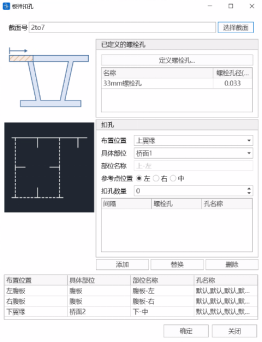

> 📌**自动化扣孔功能：**
>
> - 自动化处理：下翼缘和左右腹板：软件能够自动对箱型钢梁截面的下翼缘和左右腹板进行满扣孔处理。这种自动化处理可以减少手动操作的繁琐，提高设计效率。
> - 默认孔径和孔距：孔径：软件默认的螺栓孔径为33毫米。孔距：孔间距默认设置为100毫米。
> - 批量化扣孔：规则一致的截面：对于具有相同扣孔规则的多个截面，软件支持批量化处理。用户只需设置一次扣孔规则，软件可以将这一规则自动应用于多个截面，大大减少了重复操作，提高了工作效率。

### 12.4.2 定义杆件

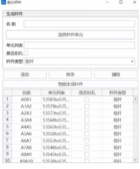

#### 12.4.2.1 **杆件分类与信息输入**

- 杆件分类
  - 弦杆：弦杆主要包括上弦杆和下弦杆，通常用于承受弯矩和纵向荷载。
  - 腹杆：腹杆位于桁架的中部，用于增加结构的稳定性和承载能力，主要承受剪力。
  - 弦杆和腹杆的分类会影响杆件计算长度，依照铁路桥梁钢结构设计规范5.1.1, 弦杆计算长度为杆件长度l0，对于无交叉杆件面内计算长度取l0,面外计算长度取0.8l0。
- 信息输入
  - 单元划分：用户需要填写每个杆件所包含的单元。这帮助软件进行准确的结构计算和分析。
  - 杆件名称：每个杆件都需要一个名称，用于标识和管理。
  - 是否扣孔：用户需指明杆件是否存在螺栓孔。该信息用于调整计算，以考虑孔洞对结构强度和稳定性的影响。

> 📌智能生成杆件功能 **：**
>
> - 结构组建立：用户需要定义两个结构组：上弦杆结构组和下弦杆结构组，用来辅助对杆件的智能生成。
> - 自动寻找节点位置：点击“智能生成杆件”按钮，软件能够根据上弦杆和下弦杆的结构组信息，自动识别和确定杆件的节点位置。
> - 自动划分和生成杆件：上弦杆和下弦杆：软件会自动划分和生成所有的上弦杆、下弦杆和腹杆，根据节点位置确定每根杆件的具体位置和尺寸。

### 12.4.3 定义检算工况

- 说明

  生成检算工况前，首先需要定义所检算的荷载，在下拉框中分别选择主力工况、主加附工况、以及疲劳工况，并且在列表中选择需要生成被检算的杆件。程序会自动根据杆件信息、截面扣孔信息、以及对应工况下的内力状态提取计算相关信息。

#### 12.4.3.1 **提取材料信息**

- 说明

  软件材料表中列举了所选杆件的所有材料信息，包括材料号、弹性模量、轴拉允许应力、弯曲允许应力、疲劳允许应力等等。用户可自行核对、修改。

#### 12.4.3.2**提取截面信息**

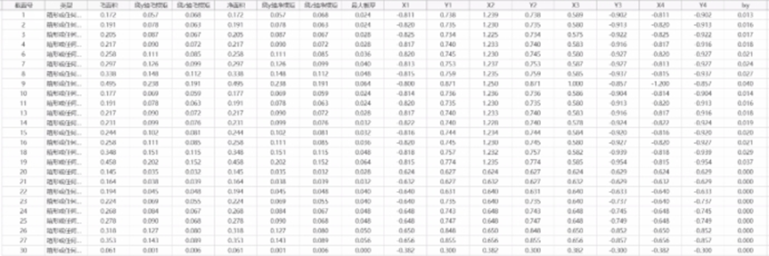

软件截面表中列举了所选杆件的所有截面信息，包括毛截面面积、绕单元y轴毛惯性矩、绕单元z轴毛惯性矩、净截面面面积、绕单元y轴净惯性矩、绕单元z轴净惯性矩、最大板厚、应力点位置、以及对单元局部坐标系yz面内的惯性积。

> 📌注意1：只有当截面扣孔后，净截面特性与毛界面特性才会有差别

> 📌注意2：当单元坐标系beta角为90或270°时绕y轴的惯性矩和绕z轴的惯性矩会进行自动调换。

> 📌注意3：考虑Ixy是在以下公式计算抵抗矩 (其中xy为截面横轴和截面竖轴) &#x20;
>
> $$
> W_{x}=\frac{I_{x} I_{y}-I_{x y}^{2}}{I_{y} y-I_{x y} \cdot x} 
> $$

#### 12.4.3.3 **提取杆件构件信息**

- 说明

  软件构件表包含杆件的名称、材料号、截面号、以及绕y轴计算长度、绕z轴计算长度、和H形受压翼缘对弱轴的计算长度$l_{0}$，此外每个单元所对应的杆件号也列举在右侧。

> 📌其中l0构件受压翼缘对弱轴的计算长度，ry、rz分别为构件对强轴和弱轴的回转半径，详细请参考4.2.2-4的相关条文。程序对于H形杆件考虑用此参数计算容许应力折减系数φ2x、φ2y。
>
> $$
> \lambda_{e}=\alpha \cdot \frac{l_{0} r_{x}}{h r_{y}}
> $$

#### 12.4.3.4 **提取内力**

- 说明

  根据所选工况以及杆件中的单元，程序会去寻找对应工况下的梁单元自并发内力（轴力、面内弯矩、面外弯矩）。

> 📌每一个单元都会提取到6个内力项：轴力最大、轴力最小、My最大、My最小、Mz最大、Mz最小。以轴力最大项举例：这一行中I端、J端轴力均是最大的：当I端轴力最大时，其对应并发的My、Mz值，当J端轴力最大时，其对应并发的My、Mz值。I、J端轴力最大并不一定同时发生，但是放在同一行中来减少表格行数。

### 12.4.4 **检算计算**

#### 12.4.4.1**强度计算**

强度计算采取公式如下：

强度计算采取公式如下：

轴向受力：$σ_1=N/A≤[σ]$

单向受弯：$σ_1=M/W≤[σ]$

单向压弯拉弯：$σ_1= \frac{N}{A}±\frac{M}{W}≤[σ]$

斜弯：$σ_1=((M_x/W_x)+M_y/W_y )  1/C≤[σ]$

斜向压弯拉弯：$σ_1=N/A±(M_x/W_x +M_y/W_y )  1/C≤[σ]$

C为斜弯允许应力增大系数。

#### 12.4.4.2 **稳定计算**

稳定计算采取公式如下所示：

轴向受力：$σ_1=N/(φ_1 A_m )≤[σ]$

单向受弯：$σ_1=M/φ_2 W_m ≤[σ]$

压弯：$σ_1=N/(φ_1 A_m )+1/(μ_1 φ_2 )  M/W_m ≤[σ]$

#### 12.4.4.3 **疲劳计算**

1、焊接构件：

1\) 拉拉构件或以拉为主的拉压构件$ρ=σ_{min}/σ_{max} ≥-1$等效应力幅计算公式:

$\sigma_{d f}=\frac{\gamma_{\mathrm{d}} \gamma_{\mathrm{n}}\left(\sigma_{\max }-\sigma_{\min }\right)}{\gamma_{\mathrm{t}}} \leq\left[\sigma_{0}\right]$

2\) 以压为主的拉压构件$ρ=σ_{min}/σ_{max} <-1$等效应力幅计算公式:

$\sigma_{d f}=\frac{\gamma_{\mathrm{d}} \gamma_{\mathrm{n}}^{\prime}\left(\sigma_{\max }\right)}{\gamma_{\mathrm{t}} \gamma_{\rho}} \leq\left[\sigma_{0}\right]$

2、非焊接构件：

1\) 拉拉构件$ρ=σ_{min}/σ_{max} ≥ 0$等效应力幅计算公式:

$\sigma_{d f}=\frac{\gamma_{\mathrm{d}} \gamma_{\mathrm{n}}\left(\sigma_{\max }-\sigma_{\min }\right)}{\gamma_{\mathrm{t}}} \leq\left[\sigma_{0}\right]$

2\) 拉拉构件$ρ=σ_{min}/σ_{max} ≥ 0$等效应力幅计算公式:

$\sigma_{d f}=\frac{\gamma_{\mathrm{d}} \gamma_{\mathrm{n}}^{\prime}\left(\sigma_{\max }\right)}{\gamma_{\mathrm{t}} \gamma_{\rho}} \leq\left[\sigma_{0}\right]$

$σ_{min}$$σ_{max}$为最大最小应力，拉为正；$[σ_{0}]$为允许应力幅; $ \gamma_{d}$为多线系数$ \gamma_{n}$受拉为主的损伤修正系数；$ \gamma_{n}^{,}$受压为主的损伤修正系数；$ \gamma_{t}$为板厚修正系数；$ \gamma_{ρ}$为应力比修正系数。

### 12.4.5 **查询结果**

#### 12.4.5.1 **强度计算结果**

主力作用下的应力，k取1.0

主力+面内次应力（或面外次应力）作用下的应力，k取1.2.

主力+面内次应力+面外次应力作用下的应力，k取1.4.

主力+附加力作用下的应力，k取1.3.

主力+面内次应力（或面外次应力）作用下的应力，k取1.4.

主力+附加力+面内次应力+面外次应力作用下的应力，k取1.45.

#### 12.4.5.2 **稳定计算结果**

主力，k取1.0.

主力+面内次应力（或面外次应力），k取1.2.

主力+面内次应力+面外次应力，k取1.4.

主力+附加力，k取1.3.

主力+附加力+面内次应力+面外次应力，k取1.45.

#### 12.4.5.3 **疲劳检算结果**

$σ_{min}$$σ_{max}$为最大最小应力，拉为正；$[σ_{0}]$为允许应力幅; $ \gamma_{d}$为多线系数$ \gamma_{n}$受拉为主的损伤修正系数；$ \gamma_{n}^{,}$受压为主的损伤修正系数；$ \gamma_{t}$为板厚修正系数；$ \gamma_{ρ}$为应力比修正系数。

## 12.5 抗倾覆检算

依据《公路钢筋混凝土及预应力混凝土桥涵设计规范》（JTG 3362-2018）中的4.1.8条，对**整体截面简支梁和连续梁桥**进行抗倾覆稳定性计算。注意，抗倾覆检算只能在后处理结果存在的情况下才能进行。

### 12.5.1 抗倾覆工况

- 功能：生成、编辑或删除抗倾覆工况。
- 命令：

  从主菜单中选择“检算”>“抗倾覆工况”;

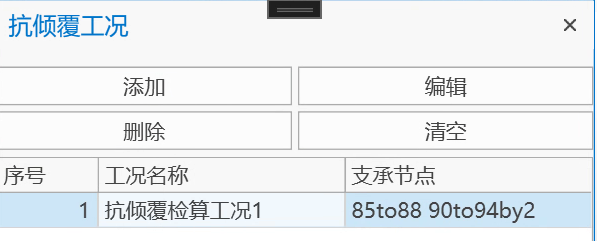

- 添加：添加抗倾覆工况
- 编辑：编辑抗倾覆工况
- 删除：删除选中的抗倾覆工况
- 清空：清空所有抗倾覆工况

### 12.5.2 抗倾覆工况定义，结果查看和导出

##### 抗倾覆工况定义

- 功能：定义、编辑抗倾覆工况；查看抗倾覆工况表格结果；导出word格式的结果。
- 命令：

  从主菜单中选择“检算”>“抗倾覆工况”>添加/编辑，新增或编辑已有的抗倾覆工况。

  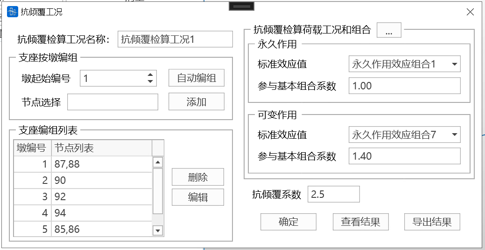
  - **抗倾覆检算工况名称**：用户填入工况名称，注意不能与已有的检算工况名称重复。
  - **支座按墩编组**：根据设置的墩起始编号为支座编组，比如同一桥墩上有2个支座，墩起始编号为1，则横桥向y值较小的一侧支座编号为1-1，另一侧支座编号为1-2。可选择自动编组或用户自定义编组。
    - 墩起始编号：用户设置桥墩的起始编号
    - 自动编组：点击自动编组，程序将自动识别所有支座节点，并默认X方向顺桥向距离在2.5m之内的所有支座，识别为同一桥墩上的支座。
    - 添加：节点选择框内所有支座节点，将采用同一墩号进行编组。
  - **支座编组列表**：显示桥墩编号，以及墩上的支座节点
    - 删除：删除选中的桥墩和支座节点
    - 编辑：重新定义选中桥墩上的支座节点
  - **抗倾覆检算荷载组合**

    点击...或通过“检算”>“检算荷载组合”>“抗倾覆验算”，打开抗倾覆检算荷载组合定义界面

    
    - 荷载组合列表：抗倾覆验算组合列表，支持直接在表格中直接编辑。定义方式与一般荷载组合相同，目前支持三种类型的荷载组合，包括叠加，判别和包络。
    - 荷载工况和系数：每个组合中包含的荷载工况，以及相应系数。
    - 自动生成检算组合: 程序根据已定义荷载工况的类型，自动生成抗倾覆检算所需的永久和可变作用标准效应组合。用户可根据需要自行修改组合内的荷载工况和系数。
    > 📌自动纳入永久标准效应组合的工况类型包括：成桥（合计值），沉降工况；自动纳入可变作用标准效应组合的工况类型为：活载。
  - 永久作用

    标准效应值：进行特征状态二检算采用标准组合时，永久作用标准效应值。

    参与基本组合系数：进行特征状态一检算采用的基本组合时，永久作用的组合系数。
  - 可变作用

    标准效应值：进行特征状态二检算采用标准组合时，可变作用标准效应值。

    参与基本组合系数：进行特征状态一检算采用的基本组合时，可变作用的组合系数。
    **抗倾覆系数**：横桥向抗倾覆稳定系数，默认2.5。
  ##### 查看结果
  确定各计算参数填写无误，点击查看结果按钮，可实时查看抗倾覆检算的表格结果。

  
  - 特载状态一结果

    支座号：支座节点的编组号。5-2表示5号墩的第2个支座节点；

    支座节点：支座所在节点号；

    工况名称：抗倾覆检算工况名称；

    Fz（kN）：支座节点在基本组合下的支反力；

    验算结果：Fz大于0，则验算通过，否则验算不通过。
    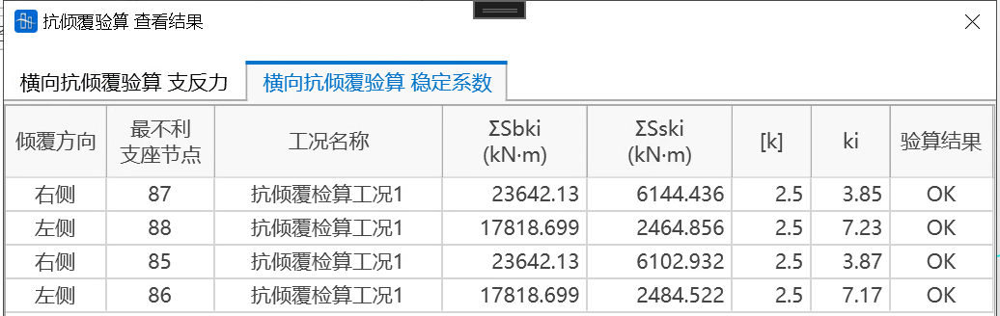
  - 特载状态二结果

    倾覆方向：梁体倾覆的方向。以顺桥向X坐标正向为准，确定左、右侧倾覆；

    支座节点：支座所在节点号；

    工况名称：抗倾覆检算工况名称；

    Sbki（kN.m）：稳定效应；

    Sski（kN.m）：失稳效应；

    \[k]：横桥向抗倾覆稳定系数;

    ki：结构稳定性系数；

    验算结果：Ki小于等于\[K]，则验算通过，否则验算不通过。
  ##### 导出结果
  导出word版本的抗倾覆结果.

  

## 12.6 生成计算书

- 功能：软件针对混凝土梁结构可自动生成 \*.DOCX格式的计算书。计算书包括基本信息和检算结果两大部分。用户可自定义输出内容。
- 命令：

  从主菜单中选择“检算”>“生成计算书”;

用户建模需以Z为垂直方向，X为沿桥纵向。

建议用户在使用该功能前，保证主梁单元号连续，以便正确输出结果图形。可应用命令：主菜单栏>节点/单元>单元编号，进行单元、节点号排序。

### 12.6.1 检算工况

用户选择在检算功能中创建的检算工况，软件将根据该12.3.3混凝土检算工况判断输出检算内容。分为公规钢筋混凝土，公规预应力混凝土(全预应力、A类、B类)、铁规钢筋混凝土，铁规预应力混凝土(全预应力、A类、B类)。

> 🧐注：为便于统一表达，将铁路规范中对预应力混凝土结构所描述的不允许出现拉应力的构件，允许出现拉应力但不允许开裂的构件，允许开裂的构件三类，比照公路规范的表达，对应称为全预应力构件、A类构件、B类构件。

### 12.6.2 基本信息

基本信息目录如下：

#### 1工程概述

- 工程概况

  由“命令：主菜单栏>结构>项目信息>项目描述”所填内容自动填充。桥式总体布置图及横断面布置图由用户自行补充。
- 设置
  - 技术标准：针对公路规范，铁路规范，列出不同的技术标准。
  - 设计荷载：列出软件中所有定义的车辆荷载类型。
  - 设计安全等级：软件自动填充用户在公路规范检算功能中选定的内容。若未做公路规范检算，则该项由用户自行补充。
  - 结构重要性系数：软件由设计安全等级按照规范给出该值。若未做公路规范检算，则该项由用户自行补充。
  - 环境类别：软件自动填充用户在检算功能中进行裂缝宽度检算时进行分析设置选定的内容。若未做裂缝宽度检算，则该项由用户自行补充。
  - 车道布置、线路布置、行车速度、平纵断面、气温情况、设计基本分风速、抗震标准、洪水频率、通航要求、防撞要求：由用户自行补充。
- 主要规范

  软件给出常用的公路规范、铁路规范。其它由用户自行补充。
- 材料性能

  软件列出整体计算所采用的混凝土及预应力材料各项性能。当进行了检算，则给出普通钢筋材料性能。若未检算，由用户自行补充。

#### 2计算模型

- 模型概况：软件给出单元数，节点数，边界条件数，施工阶段数。自动插入有限元模型图。
- &#x20;计算荷载
  - 恒载、活载：由用户自行补充。
  - 温度荷载：软件自动列出所定义的温度荷载工况及类型。
  - 风荷载：软件自动列出所定义的风荷载工况名称，内容由用户自行补充。
  - 基础沉降：软件自动列出支座沉降组的名称、节点号及沉降量。
  - 收缩徐变：软件自动给出收缩徐变计算的关键参数。
  - 荷载组合：软件自动列出从检算组合中读取组合名称及内容。
- &#x20;施工方案：软件自动列出施工阶段名称，持续时间及施工时刻。

#### 3计算结果

- 方向说明：给出软件内力方向规定。
- 内力图：给出最不利施工阶段，成桥阶段的N，Q，M图，施工阶段的N，Q，M包络图。所输出的单元由计算书工具界面“其它定义”中“输出单元”项定义。
- 应力图：给出最不利施工阶段，成桥阶段的上缘、下缘应力图，施工阶段的上缘、下缘应力包络图。所输出的单元由计算书工具界面“其它定义”中“输出单元”项定义。
- 支反力：

  给出每个一般支撑对应节点处的各工况分项X,Z两个方向的反力。活载工况支反力包括冲击系数。
  - 公路规范：软件自动按照规范要求的标准组合规则进行组合，给出每个一般支撑对应节点处的最大、最小竖向反力。

    标准组合Fzmax=恒载(成桥合计)+工况(沉降，温度，风，活载)正值

    标准组合Fzmin=恒载(成桥合计)+工况(沉降，温度，风，活载)负值
  - 铁路规范：软件自动按照规范要求的主力组合、主加附组合规则进行组合，给出每个一般支撑对应节点处的最大、最小竖向反力。

    主力组合Fzmax=恒载(成桥合计)+工况(沉降，活载)正值

    主力组合Fzmin=恒载(成桥合计)+工况(沉降，活载)负值

    主加附组合Fzmax=恒载(成桥合计)+工况(沉降，活载，温度，风)正值

    主加附组合Fzmin=恒载(成桥合计)+工况(沉降，活载，温度，风)负值
- 刚度指标：由用户自行补充。
- 静力稳定：由用户自行补充。

### 12.6.3 其它定义

- 最不利施工阶段：用户可选择最不利的施工阶段，默认值为最后一个施工阶段。软件将在计算结果中给出最不利施工阶段的内力图，应力图。
- 输出单元：此处用于选择输出内力图，应力图的单元组。需注意，输出检算项目的单元在计算书工具无法选择。软件将输出检算功能中对应的检算工况所定义的单元组的检算结果。

### 12.6.4 检算项目

所选的”检算工况”中进行了检算的项目将默认选中。灰显的检算项目，则表示未在检算功能中进行检算。

检算结果说明请参考12.3 混凝土检算。

- **公路规范（自25.07.20版起）正截面抗弯承载力验算说明：**
  抗力包络图数据源自“检算-正截面承载力计算-单元详表”，提取各单元轴力、My弯矩、Mz弯矩的**极值荷载组合**计算结果生成。与上方表格（取安全系数**最小值荷载组**）形成互补分析体系，全面反映结构极限状态。
- 表格
  - &#x20;**名称**

    检算荷载组合的名称。&#x20;
  - **类型**

    选择该检算荷载组合的类型：

    基本组合、偶然组合、标准值组合、频遇组合、准永久组合

    主力组合、主加附组合、主加特殊组合
  - &#x20;**荷载工况**

    从荷载工况列表中选择参与荷载组合的荷载工况。

    注：活载类型的荷载工况，选取的是9.5.5  **移动荷载分析工况**中定义的工况作为活载参与组合，如果是在静力荷载中定义的类型为“活载”的9.1 荷载工况，不参与组合。
  - **不利系数**

    输入选择的荷载工况参与检算荷载组合的不利系数。
  - **有利系数**

    输入选择的荷载工况参与检算荷载组合的有利系数。
    > 🧐荷载与不利系数，同号走最大，异号走最小。
    >
    > 荷载与有利系数，同号走最小，异号走最大。
    >
    > 例：
    >
    > 若Fx为正，不利系数为正，则组合到Fxmax；有利系数为正，则组合到Fxmin；
    >
    > 若Fx为正，不利系数为负，则组合到Fxmin；有利系数为负，则组合到Fxmax；
    >
    > 若Fx为负，不利系数为正，则组合到Fxmin；有利系数为正，则组合到Fxmax；
    >
    > 若Fx为负，不利系数为负，则组合到Fxmax；有利系数为负，则组合到Fxmin；
    > 🧐填写Tip：
    >
    > 1. 永久作用（除支座沉降外）
    >
    >    包括结构自重、预加力、收缩徐变等，不利系数和有利系数均不得取负值。
    > 2. 活载与支座沉降
    >
    >    不利系数不得取负值，有利系数无实际意义，可填写为0。
    > 3. 其他可变作用
    >
    >    不利系数可以取负值。例如，针对风荷载，可通过填写两条相同工况但不利系数取正负相反的情况来模拟不同方向的风作用。有利系数无实际意义，可填写为0。
    >
    > 
  - **自动生成检算荷载组合**

    辅助用户生成检算荷载组合功能，详见自动生成检算荷载组合。
