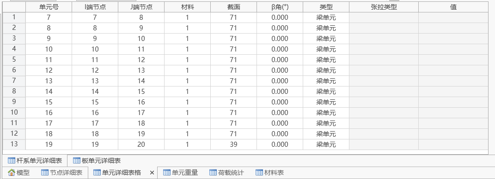
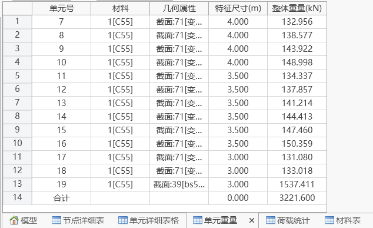
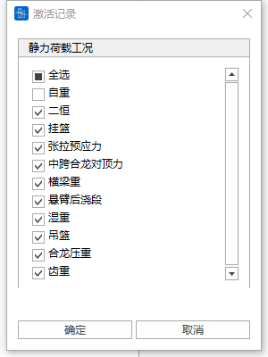
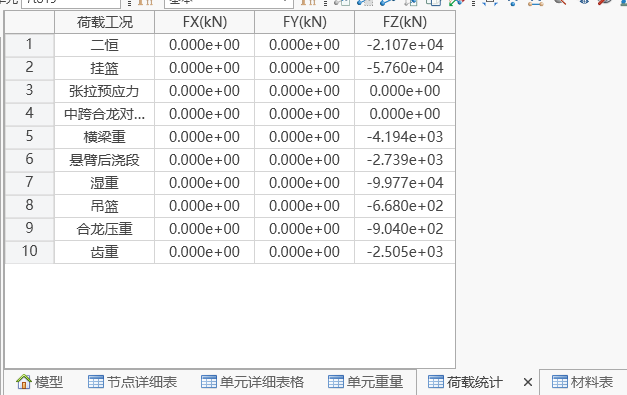

# 13. 查询

## 目录

- [13.1 节点详细表格](#131-节点详细表格)
- [13.2 单元详细表格](#132-单元详细表格)
- [13.3 单元重量表格](#133-单元重量表格)
- [13.4 荷载统计表格](#134-荷载统计表格)
- [13.5 材料表](#135-材料表)

# 13.1 **节点详细表格**

- 功能：查看已选择节点的详细表格（可编辑）。
- 命令：查询>节点详细表格。

# 13.2 **单元详细表格**

功能：查看已选择单元的详细表格（可编辑）。

命令：查询>单元详细表格。

# 13.3 **单元重量表格**

功能：查看已选择单元的重量表格（包括材料、截面、特征尺寸整体重量），得到合计整体重量。

命令：查询>单元重量表格。

# 13.4 **荷载统计表格**

功能：查看激活荷载的统计表格（可编辑）。

命令：查询>荷载统计表格。

在空白区域右键，可重新选择激活项。

# 13.5 **材料表**

功能：查看材料表。

命令：查询>材料表。

