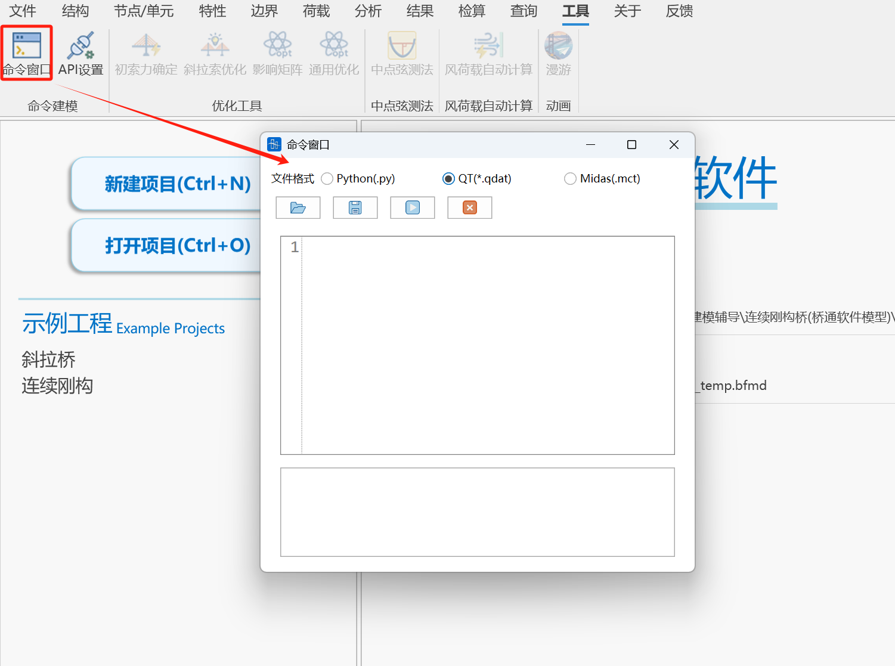
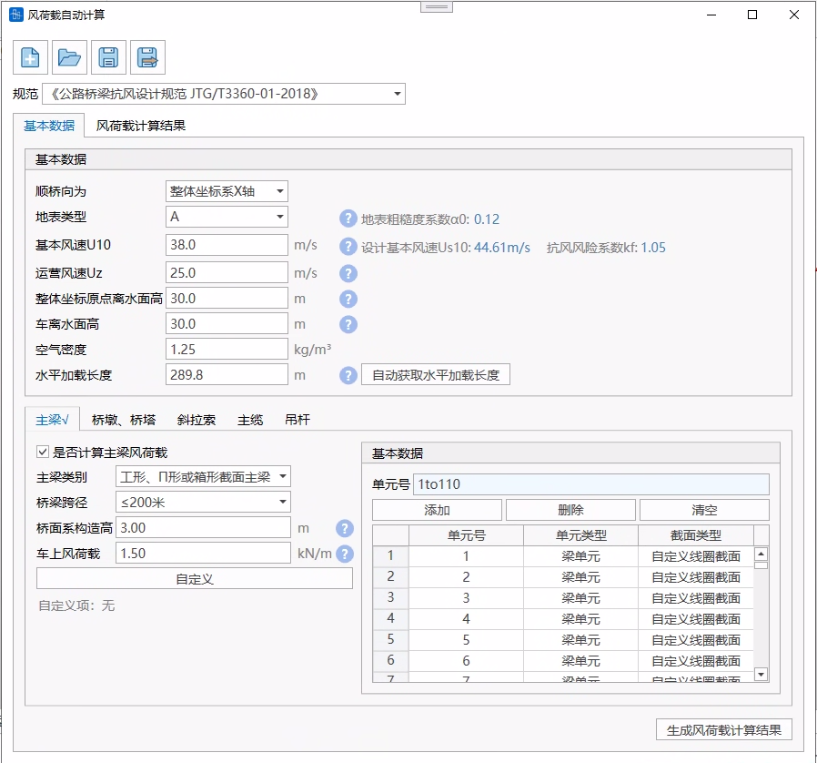
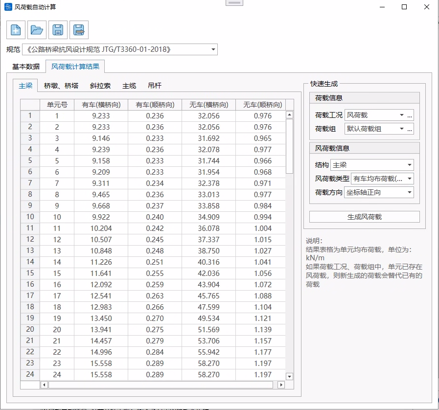

# 14.1 **命令窗口**

- 功能：支持mct文本建模和python建模，python建模。
- 命令：

  工具>命令窗口>Midas(.mct)

  工具>命令窗口>Qdat(.qdat) ——格式详见[Qdat命令流](Qdat命令流/Qdat命令流.md "Qdat命令流")

  工具>命令窗口>Python(.py) ——格式详见

  
  - **打开文件**

    

    点击如上所示图标跳转至文件管理器选择文件即可导入文本框
  - **保存文件**

    

    点击如上所示图标跳转至文件管理器输入文件名即可导出到文件
  - **运行文本**

    

    点击如上所示图标即可运行mct命令或python命令
  - **清空文本**

    

    点击如上所示图标即可清空当前文本窗口

# 14.2 **索力优化**

详见：斜拉索智能调索

# 14.3 **中点弦测法**

- 功能：计算中点弦测值。
- 命令：

  工具>中点弦测法>中点弦测法

  
- **数据加密间距**

  两点坐标之间需要增加加密点的间距
- **计算弦长**

  一般为10m和60m弦测值
- **是否进行滤波**

  弦测值是否进行滤波
- **滤波长度**

  输入滤波波长
- **是否加窗**

  输根据需求，选择是否需要加窗，加窗可以优化频谱滤波过程，减少频谱泄露。
- &#x20;**滤波器**

  （1）高通滤波器

  （2）巴特沃斯滤波器：填写滤波阶数
  > 📌目前，铁路相关验收规范推荐采用4阶巴特沃斯滤波器进行滤波。
- **原始数据**

  （1）坐标

  （2）位移值

  支持与excel相互交互操作，支持快捷键Ctrl+C或Ctrl+V
- **结果**

  支持表格和图表两种方式查看10m弦测值、未滤波计算弦测值、滤波计算弦测值和滤波后弦测值

# 14.4 通用优化工具

- 功能：非线性约束优化计算
- 命令

  工具>优化工具>通用优化工具

根据用户提供的影响矩阵，分别设置优化变量的调整上下限值，约束目标的初始值、目标值、调整上下限值以及权重系数，一键计算生成精确计算结果。

- **数据导入**

  采用软件提供的excel表格数据模板，在表格中依次填写数据，直接导入
- **优化变量个数、约束目标个数**

  确定影响矩阵大小
- **影响矩阵**

  可以表格输入，支持复制粘贴

  
- **优化变量**

  填写优化变量初始值、上下限值，表格支持复制粘贴
- **约束目标**

  填写约束目标初始值、目标值、上下限值、权重系数、表格支持复制张贴
- **优化计算**

  得到优化变量和约束目标的结果，软件同时将中间变量包括优化变量和约束目标的变化值呈现出来。

# 14.5 **风荷载自动计算**

- 功能：根据规范自动计算风荷载，并添加到模型中。支持主梁、桥墩、桥塔、斜拉索、主缆、吊杆结果。
- 命令：工具>风荷载自动计算

- 输入
  - 文件管理

    存储格式为.wlc的文件。
  - 规范

    支持《公路桥梁抗风设计规范JTG/T3360-01-2018》。

## 14.5.1 **基本数据**

### 14.5.1.1基本数据

- 顺桥向坐标轴

  选择桥梁顺桥向是X轴还是Y轴。
- 地表类型

  A——海面、海岸、开阔水面、沙漠

  B——田野、乡村、丛林、平坦开阔地及低层建筑物稀少地区

  C——树木及低层建筑物等密集地区、中高层建筑物稀少地区、平缓的丘陵地

  D——中高层建筑物密集地区、起伏较大的丘陵地
- 基本风速$U_{10}$

  桥梁设计基本风速Us10可根据桥地表类别按公式计算：

  $U_{s10}=k_{c}U_{10}$

  式中：$k_{c}$——基本风速地表类别转换系数；

  $U_{10}$——桥梁所在地区B类地表地面以上10m高度处的风速值（m/s）。
- 全国基本风速分布值及分布图（基本风速查询）

  

  
- 运营风速$U_{z}$

  桥址离开地面（或水面）桥面板高度的风速，用于有车风荷载计算。

  若为双层桥面，则需确定采用上层或下层高度。
- 整体坐标原点离水面高

  该值用于确定有限元模型与实际工程高程相对位置。

  整体坐标原点在水面以下为负值，否则为正值。
- 空气密度

  该值全桥取统一值。
- 车离水面高

  该值用于确定桥面板高度。
- 水平加载长度

  点击“自动获取水平加载长度”，自动获取选择的桥梁顺桥向的模型总长度。

### 14.5.1.2结构数据

#### 1、主梁

- 主梁类别

  共三类：工形、Π形或箱形截面主梁、桁架式主梁、闭口流线型箱梁。
- 桥梁跨径

  该值用于确定主梁纵风的计算方式。请参考规范5.3.5，5.3.6。
- 摩擦系数$C_{f}$

  可通过桥梁主梁上下表面情况选择，或用户自行输入。跨径>=200m计算主梁纵风时需。
- 桥面系构造高

  为了考虑附属设施（如栏杆、风障或风屏障）而设定的高度。该高度用于计算由这些构造所产生的横风荷载。

  对于单主梁，这个高度将被纳入结构的特征高度中；

  对于桁架梁，程序会根据桥面系构造高度与桁架实面积比的关系，换算出构件的横向力系数$C_{H}$，并将荷载均匀分配到各桁架的上弦、下弦及腹杆。
- 车上风荷载

  在W1风作用水平下，风荷载与汽车荷载组合时，主梁的风荷载应包括作用在车辆上的横向荷载，其增加值可取为1.5kN/m；当设置风障或声屏障时，可不考虑作用在车辆上的横向荷载。

  对于单主梁，将该值加在主梁上；

  对于桁架梁，将该值均摊至桁梁上、下弦杆。
- 桁片数

  支持两片桁或三片桁。
- 单元选择

  点击单元号的填写框，可在模型中框选单元，也可直接输入单元号。点击添加，即可计算选择单元的风荷载。仅支持杆系单元。
- 自定义

  程序根据已填写的基本信息、结构信息、选择单元模型信息自动计算风荷载计算过程中的中间参数，可在“自定义”中进行修改。

  

  若需要修改某个参数，需点击左侧列表中对应参数的勾选框，勾选后可修改表格对应列的值，取消勾选则恢复默认值。
  - 计算梁高：规范5.3.1式中的主梁特征高度，对于单主梁，该值包括了桥面系构造高度。
  - 基准高度：若用户不自定义，该值为单元IJ端截面偏心点在z方向上高度+整体坐标系原点离水面高。
  - 桁架截面类型：用于计算桁架梁的横向力系数（若横向力系数自定义，该值不考虑），0为矩形与H形截面构件，1表示圆柱形构件($dU_{d}\leq6m^{2}/s$)，2表示圆柱形构件($dU_{d}>6m^{2}/s$)。
  - 主梁周长s：对于单主梁，该值为截面周长。对于桁架梁，该值为梁体外轮廓周长，用于计算桁架式主梁纵风荷载，若用户未对单元自定义，则采用程序计算值，全桥使用同一个值。
  - 横向力系数$C_{H}$：若用户自定义，请输入整个结构(包括风障或声屏障等)综合的横向力系数(通常为成桥风洞试验结果)。对于桁架梁，该值包括桁架的横向力系数和桥面系的横向力系数。
  - 设计基准风速（有车）：若用户不自定义，程序按照$U_{d}=k_{f}(\frac{基准高度}{车离水面高})^{α_{0}}U_{z} $公式计算。
  - 设计基准风速（极限）：若用户不自定义，程序按照$U_{d}=k_{f}(\frac{基准高度}{10m})^{α_{0}}U_{s10} $公式计算。

#### 2、桥墩、桥塔

- 单元选择

  点击单元号的填写框，可在模型中框选单元，也可直接输入单元号。点击添加，即可计算选择单元的风荷载。仅支持杆系单元。
- 自定义

  程序根据已填写的基本信息、结构信息、选择单元模型信息自动计算风荷载计算过程中的中间参数，可在“自定义”中进行修改。

  若需要修改某个参数，需点击左侧列表中对应参数的勾选框，勾选后可修改表格对应列的值，取消勾选则恢复默认值。
  - 基准高度：若用户不自定义，该值为单元IJ端截面偏心点在z方向上高度+整体坐标系原点离水面高。
  - 塔墩截面类型：用于计算阻力系数（若阻力系数自定义，该值不考虑），0为矩形，1表示斜正方形或八角形，2表示12边形，3表示光滑表面圆形($dU_{d}\geq6m^{2}/s$)，4表示光滑表面圆形($dU_{d}<6m^{2}/s$)或有粗糙面或带凸起的圆形，5表示带圆弧角的矩形（若程序未识别出该截面为带圆弧角的矩形桥墩，用户自定义选择为5，圆弧角半径依旧为0进行计算，即按矩形截面进行计算，故不建议用户自定义修改为该截面类型为带圆弧角的矩形，若修改，请自行对阻力系数值按规范进行折减），6代表其他（该类型将按矩形截面计算阻力系数，建议修改该截面类型或自定义填写阻力系数）。
  - 设计基准风速（有车）：若用户不自定义，程序按照$U_{d}=k_{f}(\frac{基准高度}{车离水面高})^{α_{0}}U_{z} $公式计算。
  - 设计基准风速（极限）：若用户不自定义，程序按照$U_{d}=k_{f}(\frac{基准高度}{10m})^{α_{0}}U_{s10} $公式计算。

#### 3、斜拉索

- 斜拉索类别

  共二类：平行钢丝、钢绞线。
- 运营风阻力系数

  用于有车风荷载计算，可修改。
- 极限风阻力系数

  用于无车风荷载计算，可修改。

  可参考规范5.4.5：表面光滑、表面凹坑处理及表面缠绕螺旋线的拉索在W1风作用水平时阻力系数可取为1.0，在W2风作用水平时阻力系数可取为0.8；其他外形、并列平行布置以及考虑覆冰影响的斜拉索、主缆及吊杆（索）的阻力系数宜通过风洞试验或虚拟风洞试验获取。
- 斜拉索单元组合数

  该值用于推算斜拉索的直径。
- 单元选择

  点击单元号的填写框，可在模型中框选单元，也可直接输入单元号。点击添加，即可计算选择单元的风荷载。仅支持杆系单元。
- 自定义

  程序根据已填写的基本信息、结构信息、选择单元模型信息自动计算风荷载计算过程中的中间参数，可在“自定义”中进行修改。

  若需要修改某个参数，需点击左侧列表中对应参数的勾选框，勾选后可修改表格对应列的值，取消勾选则恢复默认值。
  - 单根斜拉索外直径：若用户不自定义，该值根据斜拉索类别和单元面积/斜拉索单元组合数，按照表格插值计算得到。
  - 基准高度：若用户不自定义，该值为单元IJ端截面偏心点在z方向上高度+整体坐标系原点离水面高。
  - 设计基准风速（有车）：若用户不自定义，程序按照$U_{d}=k_{f}(\frac{基准高度}{车离水面高})^{α_{0}}U_{z} $公式计算。
  - 设计基准风速（极限）：若用户不自定义，程序按照$U_{d}=k_{f}(\frac{基准高度}{10m})^{α_{0}}U_{s10} $公式计算。

该值用于推算斜拉索的直径。

#### 4、主缆

- 阻力系数

  可参考规范5.4.4：当悬索桥主缆的中心间距为直径的4倍及以上时，每根缆索的风荷载宜独立考虑，单根主缆的阻力系数可取0.7；当主缆中心距小于直径的4倍时，可按一根主缆计算，其阻力系数宜取1.0。
- 主缆单元由几根主缆合成

  该值用于推算主缆的直径。
- 单元选择

  点击单元号的填写框，可在模型中框选单元，也可直接输入单元号。点击添加，即可计算选择单元的风荷载。仅支持杆系单元。
- 自定义

  程序根据已填写的基本信息、结构信息、选择单元模型信息自动计算风荷载计算过程中的中间参数，可在“自定义”中进行修改。

  若需要修改某个参数，需点击左侧列表中对应参数的勾选框，勾选后可修改表格对应列的值，取消勾选则恢复默认值。
  - 单根主缆外直径：若用户不自定义，程序参考经验公式$D=2\sqrt{\frac{单元面积/主缆单元组合数}{0.8\pi}}$计算外直径。
  - 基准高度：若用户不自定义，该值为单元IJ端截面偏心点在z方向上高度+整体坐标系原点离水面高。
  - 设计基准风速（有车）：若用户不自定义，程序按照$U_{d}=k_{f}(\frac{基准高度}{车离水面高})^{α_{0}}U_{z} $公式计算。
  - 设计基准风速（极限）：若用户不自定义，程序按照$U_{d}=k_{f}(\frac{基准高度}{10m})^{α_{0}}U_{s10} $公式计算。

#### 5、吊杆

- 吊杆类别

  共三类：平行钢丝、钢绞线、刚性吊杆。注：若为刚性吊杆，计算吊杆外直径为单元实际直径，吊杆单元组合数建议为1。
- 阻力系数

  可参考规范5.4.4：当悬索桥吊杆的中心距离为直径的4倍及以上时,每根吊杆的阻力系数可取1.0。。
- l 吊杆单元由几根吊杆合成

  该值用于推算吊杆的直径。
- 单元选择

  点击单元号的填写框，可在模型中框选单元，也可直接输入单元号。点击添加，即可计算选择单元的风荷载。仅支持杆系单元。
- 自定义

  程序根据已填写的基本信息、结构信息、选择单元模型信息自动计算风荷载计算过程中的中间参数，可在“自定义”中进行修改。

  若需要修改某个参数，需点击左侧列表中对应参数的勾选框，勾选后可修改表格对应列的值，取消勾选则恢复默认值。
  - 单根吊杆外直径：若用户不自定义，若吊杆类别为平行钢丝或钢绞线，该值根据吊杆类别和单元面积/斜拉索单元组合数，按照表格插值计算得到，若吊杆类别为刚性吊杆，该值为单元实际直径。
  - 基准高度：若用户不自定义，该值为单元IJ端截面偏心点在z方向上高度+整体坐标系原点离水面高。
  - 设计基准风速（有车）：若用户不自定义，程序按照$U_{d}=k_{f}(\frac{基准高度}{车离水面高})^{α_{0}}U_{z} $公式计算。
  - 设计基准风速（极限）：若用户不自定义，程序按照$U_{d}=k_{f}(\frac{基准高度}{10m})^{α_{0}}U_{s10} $公式计算。

## 13.5.2 **风荷载计算结果**

基本数据填写完成后，点击“生成风荷载计算结果”，进行计算。

结果表格为单元均布荷载，单位为：kN/m。

如果荷载工况、荷载组中，单元已存在风荷载，新生成的荷载会替代已有的荷载

[Qdat命令流](Qdat命令流/Qdat命令流.md "Qdat命令流")
