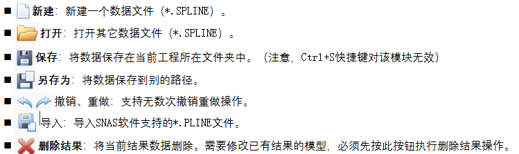

# 18. 空间缆索找形

# 18.1功能介绍

该模块基于解析法计算悬索桥空间理想成桥线形、鞍座位置、鞍座预偏量及空缆线形，单跨主缆空间线形等。主要功能包括：

1. 悬索桥空间理想成桥线形计算
   - 成桥找形时，边跨平衡控制条件可选择纵向力/水平面合力相等，锚跨平衡控制条件可选择水平面合力/纵向力/索力相等。
   - 各跨主缆精确空间线形和索力。
   - 索鞍与主缆的相对位置。
   - 精确考虑空间鞍座内曲线线形后实际主缆的形状长度、无应力长度和伸长量。
   - 加劲梁的设计线形。
   - 吊索的理论形状长度和无应力长度、下料长度。
2. 空缆空间线形和鞍座预偏量计算
   - 考虑温差效应以及鞍座预留位移的空缆空间线形
   - &#x20;索夹安装的理论位置
   - 空间鞍座预偏量

# 18.2单位制与坐标系

除特殊说明外，本模块单位制规定如下：力（kN）,长度（m）,角度（°）。

整体坐标轴设置如下图所示：桥梁的顺桥向为X轴方向，以向右为正；桥梁的高度方向为Z方向，以向上为正；桥梁的横桥向为Y方向，与X、Z轴满足右手螺旋法则。所有荷载、位移和内力结果都以沿坐标轴正向为正，反之为负。

# 18.3基本操作

点击主菜单栏>悬索桥空间线形>全桥数据和计算。进入空间线形计算窗口。在“计算选项与类型”页面选择需要的计算选项，目前提供“计算理想成桥线形”（默认必选）、“计算鞍座位置”、“计算理想空缆线形”三项计算内容。

## 18.3.1计算理想成桥线形

计算理想成桥线形操作步骤如下：

1. 在“总体信息>桥跨信息”页面填入各项数据并点击**生成桥跨**按钮生成桥跨信息。在已生成桥跨信息的情况下，修改各跨理论顶点坐标，需再次点击此按钮更新桥跨信息，否则修改无效。
2. 在“总体信息>材料和截面”页面填入材料和截面的各项数据，并确定各跨主缆的材料、截面。
3. 在“主缆分点与吊杆”页面添加各跨主缆分点、吊杆信息，并可预览分点、吊杆位置。
4. 根据用户需要，在“加劲梁”、“吊杆下料”页面填入相关数据（默认不填）。
5. 点击**计算**按钮开始计算。
6. 若计算成功，则可在“计算结果”页面查看相关结果。
7. 在已存在结果数据的情况下，必须点击“删除结果”按钮后，才能进行修改参数的操作。

## 18.3.2计算鞍座位置理想成桥线形

计算鞍座位置操作步骤如下：

除按照18.3.1计算理想成桥线形步骤1\~4填入数据外，还需在“鞍座信息”页面中填入主索鞍、边索鞍的详细信息，然后开始计算。

## 18.3.3计算理想空缆线形

计算理想空缆线形,必须先计算鞍座位置。操作步骤如下：

填入计算鞍座位置所需的所有数据，除此之外，还需在“空缆”页面中填入是否改变主缆特性、空缆计算温差等信息，然后开始计算。

# 18.4全桥数据和计算操作界面介绍

## 18.4.1基本按钮

窗口上部各基本按钮功能如下：

## 18.4.2总体信息—桥跨信息

桥跨信息页面如下图所示：

- **桥跨设置**

  填入总跨数、控制跨跨号、控制跨跨垂比、是否存在锚跨。
- **各跨理论顶点坐标**

  输入各分跨点和锚固点的X、Y、Z坐标，点击添加按钮可添加到右侧的表格中。按右键点击删除，即可删除坐标。可直接从其它程序如excel中直接粘贴数据。
- **生成/更新桥跨信息**

  点击该按钮。若无数据错误且无旧的桥跨信息，则成功生成桥跨基本信息，并显示在“桥跨信息”表格中。
  在已生成桥跨信息的情况下，修改各跨理论顶点坐标，需再次点击此按钮更新桥跨信息，否则修改无效。更新桥跨信息不会修改各跨主缆的材料、截面和分点信息，用户应注意检查分点的纵向坐标是否已超出跨度范围而导致计算错误。
- **清除桥跨**

  在已生成桥跨信息的情况下修改总体数据，例如X坐标、锚跨设置，需先点击该按钮清除桥跨信息后，方可进行修改，以确保总体数据与桥跨信息一致。清除桥跨将会丢失所有已定义的主缆分点、吊杆和鞍座信息。
- **修改锚跨**

  软件提供的一种增加或删除锚跨的方式，可保留已定义的边跨、主跨的主缆分点、吊杆信息。

  
  - **操作类型**

    删除/增加锚跨。
  - **锚跨位置**

    选择删除/增加左锚跨、右锚跨、左右锚跨。
  - **新增顶点**

    增加左/右锚跨时，需要用户填入左/右锚点的顶点坐标。
  - **自动修正控制跨跨号**

    勾选该项后，程序将自动根据删除、增加锚跨后的桥跨来修正控制跨跨号，以达到不改变原有控制跨的目的。例如原悬索桥有5跨（第1、5跨为左、右锚跨），第3跨主跨为控制跨。如删除左锚跨，则总跨数变为4，主跨变为第2跨。如勾选该项，程序自动将控制跨跨号变为2。

## 18.4.3 截面和材料

截面和材料页面如下图所示

- **材料表格**

  填入所有材料的名称、弹性模量、容重。
- **截面表格**

  填入所有截面的名称、面积。
- &#x20;**设置各跨主缆材料截面**

  填入各跨主缆的材料、截面，从已定义的材料、截面名称中选择。

## 18.4.4 加劲梁吊杆

加劲梁吊杆页面如下图所示。

- **是否定义加劲梁设计线形**

  用户根据需要选择。如果选择是，则吊杆下料长度表格中的D8\_L、D8\_R，以及主缆分点表格中的吊杆下端坐标Ys无效。程序会根据用户定义的加劲梁设计线形自动计算这些参数。
- **加劲梁设计线形表格**

  线形：包含点、直线、抛物线、上拱圆曲线1、上拱圆曲线2、下拱圆曲线1、下拱圆曲线2共7种类型，定义各种线形所需的参数可查看参数说明，如下图所示所示。

  

  X1、Z1/ X2、Z2/ X3、Z3：定义加劲梁线形的关键点1/2/3的水平、竖向坐标。半径：定义加劲梁线形的半径（下图所示类型5、7）。
- **是否计算吊杆下料长度**

  用户根据需要选择。如果选择是，则按桥跨号填入吊杆下料参数。可根据吊杆的类型（销铰式或骑跨式）查看详细参数说明。
- **吊杆下料长度表格**

  类型：包括销铰式\_H、销铰式\_P、骑跨式\_H、骑跨式\_P共4种类型。其中，销铰式\_H表示纵向两销铰连线水平；销铰式\_P表示纵向两销铰连线平行于索夹；骑跨式\_H表示吊索纵向两肢的横向定位器连线水平；骑跨式\_P表示吊索纵向两肢的横向定位器连续平行于索夹。
  | D1                     | 吊索纵向两肢的距离                                                              |
  | ---------------------- | ---------------------------------------------------------------------- |
  | D2                     | 销铰式\_H为吊索上销铰中心到主缆中心的长度；销铰式\_P为吊索上销铰中心距主缆中心间的垂直距离。骑跨式为吊索横向定位器距主缆中心间的距离。 |
  | D3                     | 销铰式为吊索上端销铰中心与锚头锚口间的距离；骑跨式为吊索横向两肢的间距（定位器处）                              |
  | D4                     | 吊索下端销铰中心（或非销铰式锚头的锚固面）与锚头锚口间的距离。                                        |
  | D5                     | 销铰式为吊索钢丝在上端锚头内的锚固长度；骑跨式为吊索在索夹上骑跨绕成的横向直径。                               |
  | D6                     | 吊索钢丝在下端锚头（或刚性段）内的锚固长度。                                                 |
  | D7                     | 桥面加劲梁标高参考点到吊索下销铰中心（或非销铰式锚头的锚固面）的距离。注意区分正负号，吊索下销铰中心在桥面加劲梁标高参考点下面为正。     |
  | D8L、D8R                | 由桥面竖曲线引起的左、右吊索处桥面与两者中心线处桥面的高差，吊索处桥面在中心线处桥面以上为正。                        |
  | 销铰式吊杆各参数和骑跨式吊杆各参数如下示意图 |                                                                        |
  

  

## 18.4.5 主缆分点

程序根据桥跨号、起始位置和分点距离，自动按照从左向右的顺序生成主缆分点和分点处的吊杆，如下图所示。

- **桥跨号**

  选择要定义主缆分点的桥跨号，如选择的桥跨为锚跨，则提示无法添加分点。
- **起始位置**

  左侧理论点——默认选项。以该跨的“左侧理论点”为起点计算分点位置。

  最右侧分点——以该跨已添加的所有分点中最右侧的分点为起点计算分点位置。
- **分点距离**

  填入各分点间的距离。例如，10,3\@6.5表示生成4个分点，第1分点距离起始位置为10m，第2分点与第1分点距离6.5m，第3分点与第2分点距离6.5m，以此类推。
- **分点荷载**

  填入添加的分点处x、y、z三个方向的集中荷载。
- **吊杆材料**

  填入分点处的吊杆材料名称，从已定义的材料中选择。
- **吊杆截面**

  填入分点处的吊杆截面名称，从已定义的截面中选择。
- **吊杆下端竖向荷载**

  填入吊杆下端所受的Z方向的竖向荷载,方向以向上为正 **，因此一般来说该项为负值**。若不存在吊杆，则该项填0，或者在吊杆信息表格中取消“有吊杆”项的选择。
- **下端坐标**

  填入吊杆下端点坐标。
- **添加分点**

  点击该按钮添加分点和吊杆。
- **清除全部**

  删除该跨所有主缆分点、吊杆信息。
- **删除选择**

  删除选定的主缆分点、吊杆信息（需点击行标题整行选取）。
- **预览**

  预览该跨的主缆分点和吊杆位置。

## 18.4.6 鞍座

鞍座页面如下图所示：

- **索鞍序号**

  桥跨信息生成后，程序自动生成鞍座序号、名称和鞍座信息表格。
- **类型**

  主索鞍：包括不旋转、可绕X轴旋转、可绕Z轴旋转、可绕X、Z轴旋转四种类型。

  散索鞍：包括滑移式、摇轴式两种类型。
- **鞍座数据**

  主索鞍：输入索鞍半径。

  滑移式散索鞍：输入索鞍半径、重量、倾斜角度。倾斜角度以逆时针旋转为正。

  摇轴式散索鞍：输入索鞍半径、重量、摇轴中心相对理论顶点的坐标、重心相对摇轴中心的坐标。
- **编辑鞍座**

  填入鞍座数据后，点击完成修改。

## 18.4.7 空缆

空缆页面如下图：

- **空缆计算时是否改变主缆特性**

  根据需要选择是或否。若为是，则填入空缆线形计算时各跨主缆的容重和截面面积。
- **主缆材料线膨胀系数**

  设置空缆线形计算时的主缆材料线膨胀系数。
- **空缆温差**

  设置空缆线形计算时各跨相对于基准温度的温差。
- &#x20;**鞍座预留位移设置**

  设置空缆线形计算时两侧锚固点和各鞍座的预留位移。

## 18.4.8 计算设置

计算设置页面如下图所示：

主跨数据和主缆数据

- &#x20;**成桥找形计算设置**

  找形控制力类型：可分别设置边跨、左右锚跨的找形控制力。边跨可选择水平面合力（相等）、纵向力（相等）两项；锚跨可选择水平面合力（相等）、纵向力（相等），索力（相等）三项。

  主缆迭代找形容许误差：成桥线形迭代计算时的容许误差。

  收敛调整系数：默认值1.0，当计算无法收敛或收敛较慢时可适当增大或减小该值以帮助计算收敛。
- **鞍座位置计算设置**

  是否计算鞍座位置：选择成桥计算时是否考虑鞍座。

  鞍座迭代找形容许误差：成桥鞍座迭代找形计算时的容许误差。
- **空缆找形计算设置**

  是否进行空缆计算：选择是，则应在鞍座位置计算设置中选择计算鞍座位置，否则无法进行。

  主缆迭代找形和鞍座预偏量容许误差：空缆迭代找形计算时的容许误差。

  收敛调整系数：默认值1.0，当计算无法收敛或收敛较慢时可适当增大或减小该值以帮助计算收敛。

## 18.4.9 计算结果

计算结果页面如下图所示：

通过该页面查询所有计算结果。可查询结果类型如下：

| 计算内容    | 结果类型        | 说明                                                                                            |
| ------- | ----------- | --------------------------------------------------------------------------------------------- |
| 成桥      | 理论顶点坐标      | 成桥状态下各理论顶点（IP点）坐标。                                                                            |
|         | 各跨跨中坐标和索力   | 成桥状态下各跨跨中坐标和左、右侧索力。                                                                           |
|         | 各跨端部力       | 成桥状态下各跨主缆端部力。                                                                                 |
|         | 主缆分点信息      | 成桥状态下各跨主缆的分点坐标，竖直面和水平面内切线角。                                                                   |
|         | 主缆索段长度      | 成桥状态下各跨主缆分点间索段的无应力长度、伸长量、曲线总长。各跨主缆的首、末端点为IP点。                                                 |
|         | 主缆索段端部力     | 成桥状态下各跨主缆分点间索段的左、右侧端部力。                                                                       |
|         | 吊杆信息        | 如在“加劲梁吊杆页面内”选择计算吊杆下料长度，则根据吊杆类型（销铰式或骑跨式）分别输出结果参数如下。                                            |
|         |             | 销铰式(参数尾部L、R代表左、右侧吊索)：                                                                         |
|         |             | RS1\_L、RS1\_R：销铰中心有应力总成长。                                                                     |
|         |             | RS2\_L、RS2\_R：销铰中心无应力总成长。                                                                     |
|         |             | RS3\_L、RS3\_R：销铰中心吊索伸长量。                                                                      |
|         |             | RS4\_L、RS4\_R：钢丝无应力切割总长。                                                                      |
|         |             | 骑跨式(参数尾部L、R代表左、右侧吊索)：                                                                         |
|         |             | RS1\_L、RS1\_R：紧固点至下销铰或锚面形状高度。                                                                 |
|         |             | RS2\_L、RS2\_R：两紧固点间（骑跨部分）形状长度。                                                                |
|         |             | RS3\_L、RS3\_R：紧固点至下锚头锚口无应力长度。                                                                 |
|         |             | RS4\_L、RS4\_R：两紧固点间（骑跨部分）无应力长。                                                                |
|         |             | RS5\_L、RS5\_R：吊索总成形状长度。                                                                       |
|         |             | RS6\_L、RS6\_R：钢丝无应力切割总长。                                                                      |
|         |             | RS7\_L、RS7\_R：成桥恒载状态弹性伸长。                                                                     |
|         |             | 如在“加劲梁吊杆页面内”选择不计算吊杆下料长度，则输出成桥状态下各跨吊杆的无应力长度、伸长量、曲线总长。                                          |
|         | 加劲梁设计线形     | 成桥状态下的加劲梁节点（纵桥向对应主缆分点位置）坐标。                                                                   |
|         | 修正后的主缆长度    | 根据鞍座不动点（鞍座左右切点之间索长的中点）修正后的各跨主缆实际的无应力长度、伸长量、曲线总长度。                                             |
|         | 鞍槽内索段信息     | 鞍座不动点左、右侧无应力索长和无应力总索长。                                                                        |
|         | 鞍座位置信息      | 成桥状态下各鞍座绕X和Y轴的倾角、圆心坐标、实际顶点坐标。                                                                 |
|         | 鞍座切点信息      | 成桥状态下各鞍座与主缆的左、右侧切点坐标，切点三向分力，竖直、水平面内切线角。                                                       |
| 空缆      | 空缆各跨跨中坐标和索力 | 空缆状态下各跨主缆跨中坐标和左右侧索力分力。                                                                        |
|         | 主缆分点坐标      | 空缆状态下各跨主缆分点坐标。                                                                                |
|         | 主缆分点力       | 空缆状态下各跨主缆分点左右侧分力。                                                                             |
|         | 鞍座预偏量       | 空缆状态下各鞍座预偏量。                                                                                  |
|         | 空缆鞍座切点信息    | 空缆状态下鞍座左、右切点坐标和切点分力。                                                                          |
| 丝股下料    | 丝股下料长度      | 各根丝股下料长度。                                                                                     |
|         | 平弯是否在竖弯之内   | 各根丝股在左、右侧散索鞍处的平弯点是否在竖弯点内侧，1为是，0为否。                                                            |
|         | 锚拉杆长度和角度    | 各根丝股的左、右端锚拉杆的长度和角度。锚拉杆的角度结果包括左、右锚杆XY平面投影与主缆中心线夹角α，左、右锚杆XZ平面投影与主缆中心线夹角β，左、右锚杆与XZ平面夹角θ，详见图8-15。 |
|         | 调索丝股测点理论标高  | 调索丝股在边、主跨标高控制点的架设标高。                                                                          |
| 丝股架设线形  | 调索丝股跨中理论标高  | 调索丝股在边、主跨跨中点的架设标高。                                                                            |
|         | 调索丝股索长调整量   | 调索丝股的无应力长度增量。                                                                                 |
|         | 调索丝股线形      | 调索丝股的各跨线形。                                                                                    |
| 锚跨控制张拉力 | 锚跨控制张拉力     | 各根丝股在左、右锚跨的控制张拉力。                                                                             |
| 空缆调整线形  | 测点理论标高      | 调整后空缆线形的边、主跨测点的理论标高。                                                                          |
|         | 跨中理论标高      | 调整后空缆线形的边、主跨跨中点的理论标高。                                                                         |
|         | 调整后的空缆线形    | 调整后空缆线形的各跨主缆分点坐标，竖直面和水平面内切线角。                                                                 |

