# VS Code 中 Jupyter Notebook 使用方法

&#x20;   Jupyter（以前称为 IPython Notebook）是一个开源项目，可让您轻松地将 Markdown 文本和可执行 Python 源代码组合在一个称为NoteBook的画布上。Visual Studio Code 支持本机并通过Python 代码文件使用 Jupyter Notebook 。本主题涵盖 Jupyter Notebooks 可用的本机支持，并演示如何：

- 创建、打开和保存 Jupyter Notebook
- 使用 Jupyter 代码单元
- 使用变量浏览器和数据查看器查看、检查和过滤变量
- 连接到远程 Jupyter 服务器
- 调试 Jupyter Notebook

&#x20;     [Jupyter](https://jupyter-notebook.readthedocs.io/en/latest/ "Jupyter")（以前称为 IPython Notebook）是一个开源项目，可让您轻松地将 Markdown 文本和可执行 Python 源代码组合在一个称为NoteBook的画布上。Visual Studio Code 支持本机并通过[Python 代码文件](https://code.visualstudio.com/docs/python/jupyter-support-py "Python 代码文件")使用 Jupyter Notebook 。本主题涵盖 Jupyter Notebooks 可用的本机支持，并演示如何：

- 创建、打开和保存 Jupyter Notebook
- 使用 Jupyter 代码单元
- 使用变量浏览器和数据查看器查看、检查和过滤变量
- 连接到远程 Jupyter 服务器
- 调试 Jupyter Notebook

## 一、[设置您的环境](https://link.zhihu.com/?target=https://code.visualstudio.com/docs/datascience/jupyter-notebooks#_setting-up-your-environment "设置您的环境")

&#x20;     要在 Jupyter Notebooks 中使用 Python，您必须在 VS Code 中激活 Anaconda 环境，或已安装 Jupyter[包的](https://pypi.org/project/jupyter/ "包的")另一个 Python 环境。要选择环境，请使用“Python：从命令面板**选择解释器”命令 (** Ctrl+Shift+P )。

&#x20;    激活适当的环境后，您可以创建并打开 Jupyter Notebook，连接到远程 Jupyter 服务器以运行代码单元，并将 Jupyter Notebook 导出为 Python 文件。

## 二、[工作空间信任](https://code.visualstudio.com/docs/datascience/jupyter-notebooks#_workspace-trust "工作空间信任")

开始使用 Jupyter Notebooks 时，您需要确保您在受信任的工作区中工作。有害代码可以嵌入NoteBook中，[工作区信任](https://code.visualstudio.com/docs/editor/workspace-trust "工作区信任")功能允许您指示哪些文件夹及其内容应允许或限制自动代码执行。

如果您尝试在 VS Code 位于运行[Restricted Mode 的](https://code.visualstudio.com/docs/editor/workspace-trust#_restricted-mode "Restricted Mode 的")不受信任工作区中时打开NoteBook，您将无法执行单元格并且丰富的输出将被隐藏

## 三、[创建或打开 Jupyter Notebook](https://code.visualstudio.com/docs/datascience/jupyter-notebooks#_create-or-open-a-jupyter-notebook "创建或打开 Jupyter Notebook")

您可以通过从命令面板 ( Ctrl+Shift+P )运行创建 **：新建 Jupyter Notebook**命令或在工作区中创建新文件来创建Jupyter Notebook。`.ipynb`

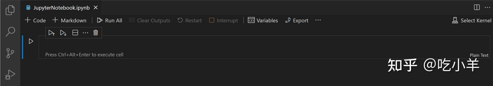

接下来，使用右上角的内核选择器选择内核。

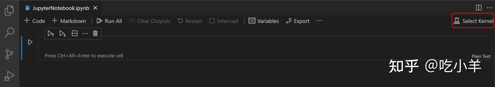

选择内核后，位于每个代码单元右下角的语言选择器将自动更新为内核支持的语言。

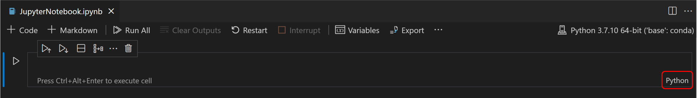

如果您有现有的 Jupyter Notebook，则可以通过右键单击该文件并使用 VS Code 打开或通过 VS Code 文件资源管理器打开它。

## 四、[运行单元格](https://code.visualstudio.com/docs/datascience/jupyter-notebooks#_running-cells "运行单元格")

拥有NoteBook后，您可以使用单元左侧的**运行图标运行代码单元，输出将直接显示在代码单元下方。**

要运行代码，您还可以在命令和编辑模式下使用键盘快捷键。要运行当前单元格，请使用Ctrl+Enter。要运行当前单元格并前进到下一个单元格，请使用Shift+Enter。

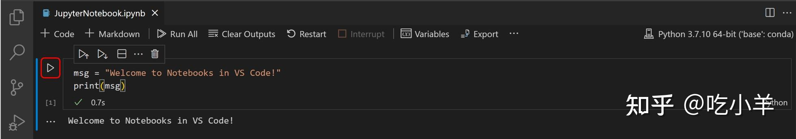

您可以通过选择“运行全部”**、**“运行上方全部 **”或**“运行下方全部”来运行多个单元格。


## 五、[保存您的 Jupyter](https://code.visualstudio.com/docs/datascience/jupyter-notebooks#_save-your-jupyter-notebook "保存您的 Jupyter") NoteBook

您可以使用键盘快捷键Ctrl+S或**文件**>**保存**来保存 Jupyter Notebook 。

## 六、[导出您的 Jupyter](https://link.zhihu.com/?target=https://code.visualstudio.com/docs/datascience/jupyter-notebooks#_export-your-jupyter-notebook "导出您的 Jupyter") NoteBook

您可以将 Jupyter Notebook 导出为 Python 文件 ( `.py`)、PDF 或 HTML 文件。要导出，请选择主工具栏上的**导出操作。** 然后您将看到文件格式选项的下拉列表。

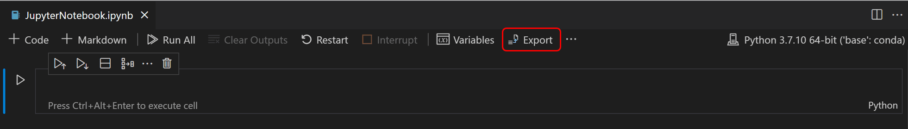

> **注意：** 要导出 PDF，您必须[安装 TeX](https://nbconvert.readthedocs.io/en/latest/install.html#installing-tex "安装 TeX")。如果没有，当您选择 PDF 选项时，系统会通知您需要安装它。另外，请注意，如果您的 Notebook 中只有 SVG 输出，它们将不会显示在 PDF 中。要在 PDF 中包含 SVG 图形，请确保您的输出包含非 SVG 图像格式，或者您可以先导出为 HTML，然后使用浏览器另存为 PDF。

## [在NoteBook编辑器中使用代码单元](https://code.visualstudio.com/docs/datascience/jupyter-notebooks#_work-with-code-cells-in-the-notebook-editor "在NoteBook编辑器中使用代码单元")

NoteBook编辑器可以轻松地在 Jupyter Notebook 中创建、编辑和运行代码单元。

### [创建代码单元格](https://code.visualstudio.com/docs/datascience/jupyter-notebooks#_create-a-code-cell "创建代码单元格")

默认情况下，空白NoteBook将有一个空代码单元供您开始使用，现有NoteBook将在底部放置一个代码单元。将您的代码添加到空代码单元格即可开始。

```python 
msg = "Hello world"
print(msg）
```


### [代码单元模式](https://code.visualstudio.com/docs/datascience/jupyter-notebooks#_code-cell-modes "代码单元模式")

使用代码单元时，单元可以处于三种状态：未选择、命令模式和编辑模式。代码单元格和编辑器边框左侧的垂直条显示单元格的当前状态。当没有可见的栏时，该单元格未被选中。选择单元格后，它可以处于命令模式或编辑模式。

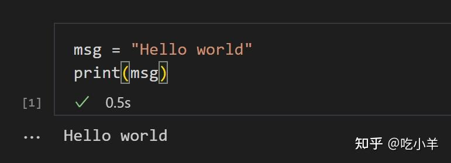

在命令模式下，单元格左侧将出现一个实心垂直条。该单元可以进行操作并接受键盘命令。

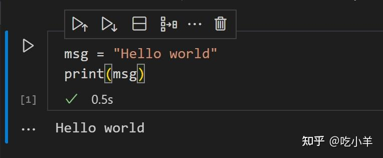

在编辑模式下，单元格编辑器周围有一个实心垂直条由边框连接起来。单元格的内容（代码或 Markdown）可以修改。

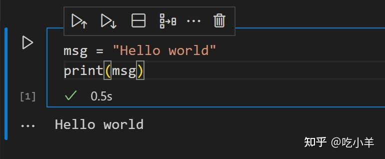

要切换模式，您可以使用键盘或鼠标。在键盘上，按Enter键可进入编辑模式，或按Esc键可进入命令模式。使用鼠标单击单元格左侧或代码单元格中代码/Markdown 区域之外的垂直条。

### [添加额外的代码单元格](https://code.visualstudio.com/docs/datascience/jupyter-notebooks#_add-additional-code-cells "添加额外的代码单元格")

您可以使用主工具栏、单元格的添加单元格工具栏（悬停时可见）以及通过键盘命令添加代码单元格。

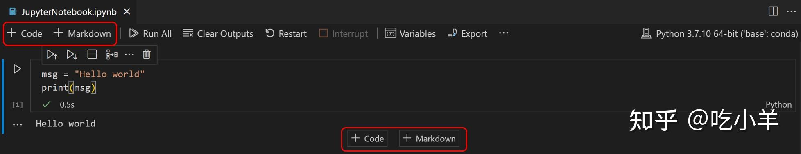

要在当前选定的单元格下方添加新单元格，请使用主工具栏或单元格的悬停工具栏中的加号图标。

当代码单元格处于命令模式时，使用A键在所选单元格上方添加单元格，使用B键在所选单元格下方添加单元格。

### [选择代码单元格](https://code.visualstudio.com/docs/datascience/jupyter-notebooks#_select-a-code-cell "选择代码单元格")

您可以使用鼠标或键盘上的向上/向下箭头键更改选定的代码单元格。当代码单元处于命令模式时，您还可以使用J键（向下）和K键（向上）。

### [选择多个代码单元格](https://code.visualstudio.com/docs/datascience/jupyter-notebooks#_select-multiple-code-cells "选择多个代码单元格")

要选择多个单元格，请从选定模式下的一个单元格开始。填充的背景表示选定的单元格。要选择连续的单元格，请按住Shift键并单击要选择的最后一个单元格。要选择任何单元格组，请按住Ctrl键并单击要添加到选择中的单元格。

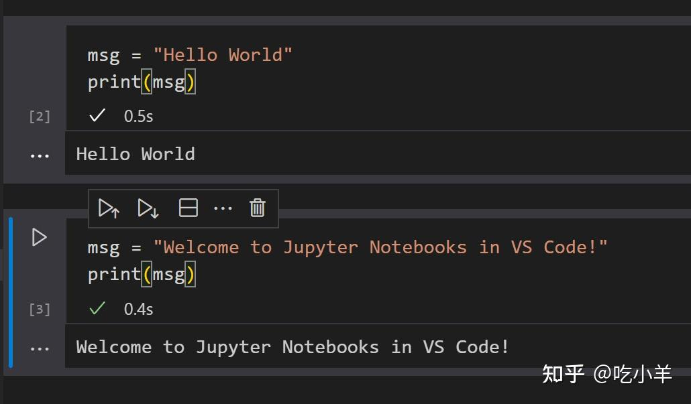

### [运行单个代码单元](https://code.visualstudio.com/docs/datascience/jupyter-notebooks#_run-a-single-code-cell "运行单个代码单元")

添加代码后，您可以使用单元格左侧的**运行图标运行单元格，输出将显示在代码单元格下方。**

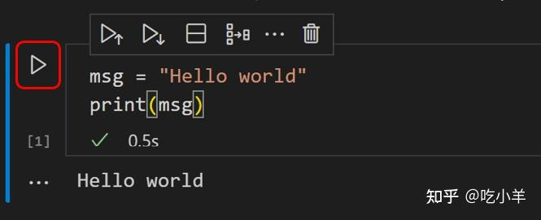

要运行选定的代码单元，您还可以在命令和编辑模式下使用键盘快捷键。Ctrl+Enter运行当前选定的单元格。Shift+Enter运行当前选定的单元格并在紧邻下方插入一个新单元格（焦点移至新单元格）。Alt+Enter运行当前选定的单元格，并在紧邻其下方插入一个新单元格（焦点仍位于当前单元格上）。

### [运行多个代码单元](https://code.visualstudio.com/docs/datascience/jupyter-notebooks#_run-multiple-code-cells "运行多个代码单元")

运行多个代码单元可以通过多种方式完成。您可以使用NoteBook编辑器主工具栏中的双箭头来运行NoteBook中的所有单元格，或者使用单元格工具栏中带有方向箭头的**运行图标来运行当前代码单元格上方或下方的所有单元格。**

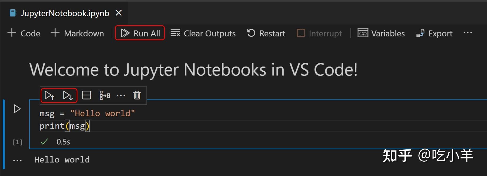

### [移动代码单元格](https://code.visualstudio.com/docs/datascience/jupyter-notebooks#_move-a-code-cell "移动代码单元格")

您可以通过拖放在NoteBook中向上或向下移动单元格。对于代码单元格，拖放区域位于单元格编辑器的左侧，如下所示。对于渲染的 Markdown 单元格，您可以单击任意位置来拖放单元格。

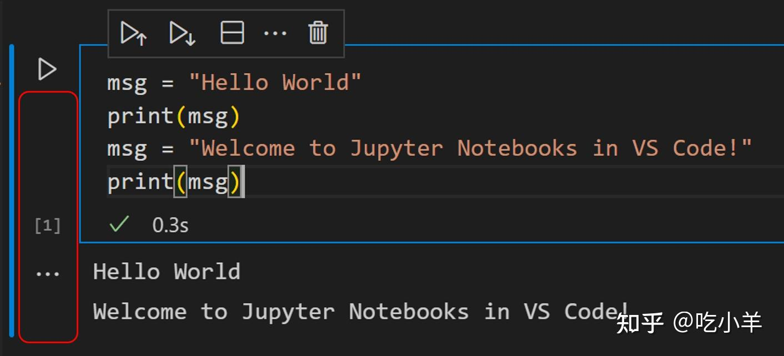

要移动多个单元格，您可以在所选内容中包含的任何单元格中使用相同的拖放区域。

键盘快捷键Alt+箭头还可以移动一个或多个选定的单元格。

### [删除代码单元格](https://code.visualstudio.com/docs/datascience/jupyter-notebooks#_delete-a-code-cell "删除代码单元格")

要删除代码，您可以使用代码单元工具栏中的 **“删除”图标。** 当选定的代码单元处于命令模式时，您可以使用键盘快捷键dd。

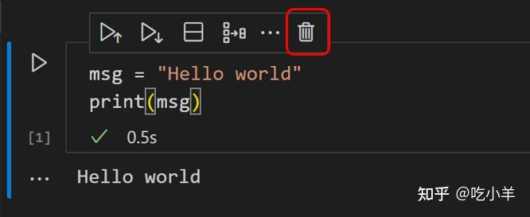

### [撤消上次更改](https://code.visualstudio.com/docs/datascience/jupyter-notebooks#_undo-your-last-change "撤消上次更改")

您可以使用z键撤消之前的更改，例如，如果您意外进行了编辑，则可以将其撤消到之前的正确状态，或者如果您意外删除了单元格，则可以将其恢复。

### [在代码和 Markdown 之间切换](https://code.visualstudio.com/docs/datascience/jupyter-notebooks#_switch-between-code-and-markdown "在代码和 Markdown 之间切换")

NoteBook编辑器允许您轻松地在 Markdown 和代码之间更改代码单元格。选择单元格右下角的语言选择器将允许您在 Markdown 和所选内核支持的任何其他语言（如果适用）之间切换。


您还可以使用键盘更改单元格类型。当选择单元格并处于命令模式时，M键将单元格类型切换为 Markdown，Y键将单元格类型切换为代码。

设置好 Markdown 后，就可以在代码单元格中输入 Markdown 格式的内容了。


要渲染 Markdown 单元格，您可以选择单元格工具栏中的复选标记，或使用键盘快捷键Ctrl+Enter和Shift+Enter。


### [清除输出或重新启动/中断内核](https://code.visualstudio.com/docs/datascience/jupyter-notebooks#_clear-output-or-restartinterrupt-the-kernel "清除输出或重新启动/中断内核")

如果您想清除所有代码单元输出或重新启动/中断内核，可以使用主NoteBook编辑器工具栏来完成此操作。


### [启用/禁用行号](https://code.visualstudio.com/docs/datascience/jupyter-notebooks#_enabledisable-line-numbers "启用/禁用行号")

当您处于命令模式时，您可以使用L键在单个代码单元中启用或禁用行编号。


要切换整个NoteBook的行编号，请在任何单元格上处于命令模式时使用Shift+L。


## [目录](https://code.visualstudio.com/docs/datascience/jupyter-notebooks#_table-of-contents "目录")

要浏览NoteBook，请打开活动栏中的文件资源管理器。然后打开侧栏中的**大纲选项卡。**


> 大纲：显示代码单元格 \*\*。

## [Jupyter Notebook 编辑器中的 IntelliSense 支持](https://code.visualstudio.com/docs/datascience/jupyter-notebooks#_intellisense-support-in-the-jupyter-notebook-editor "Jupyter Notebook 编辑器中的 IntelliSense 支持")

Python Jupyter Notebook 编辑器窗口具有完整的 IntelliSense – 代码完成、成员列表、方法的快速信息和参数提示。您可以像在代码编辑器中一样在NoteBook编辑器窗口中高效地键入内容。


## [变量浏览器和数据查看器](https://code.visualstudio.com/docs/datascience/jupyter-notebooks#_variable-explorer-and-data-viewer "变量浏览器和数据查看器")

在 Python Notebook 中，可以查看、检查、排序和过滤当前 Jupyter 会话中的变量。运行代码和单元格后，通过选择主工具栏中的 **“变量”** 图标，您将看到当前变量的列表，该列表将在代码中使用变量时自动更新。变量窗格将在NoteBook底部打开。


### [数据查看器](https://code.visualstudio.com/docs/datascience/jupyter-notebooks#_data-viewer "数据查看器")

有关变量的其他信息，您还可以双击行或使用变量旁边的“在**数据查看器中显示变量”按钮，以在数据查看器中更详细地查看变量。**


### [过滤行](https://code.visualstudio.com/docs/datascience/jupyter-notebooks#_filtering-rows "过滤行")

可以通过在每列顶部的文本框中键入内容来过滤数据查看器中的行。输入要搜索的字符串，将找到该列中包含该字符串的任何行：


如果您想找到完全匹配的内容，请在过滤器前加上“=”前缀：


[可以通过键入正则表达式](https://link.zhihu.com/?target=https://developer.mozilla.org/en-US/docs/Web/JavaScript/Guide/Regular_Expressions "可以通过键入正则表达式")来完成更复杂的过滤：


## [保存绘图](https://code.visualstudio.com/docs/datascience/jupyter-notebooks#_saving-plots "保存绘图")

要保存NoteBook中的绘图，只需将鼠标悬停在输出上并选择右上角的 **“保存”图标即可。**


> **注意：** 支持渲染使用[matplotlib](https://link.zhihu.com/?target=https://matplotlib.org/ "matplotlib")和[Altair](https://link.zhihu.com/?target=https://altair-viz.github.io/index.html "Altair")创建的绘图。

## [自定义NoteBook差异](https://code.visualstudio.com/docs/datascience/jupyter-notebooks#_custom-notebook-diffing "自定义NoteBook差异")

在底层，Jupyter Notebook 是 JSON 文件。JSON 文件中的段呈现为由三个组件组成的单元格：输入、输出和元数据。使用基于行的比较来比较NoteBook中所做的更改非常困难且难以解析。NoteBook的丰富差异编辑器使您可以轻松查看单元格每个组件的更改。

您甚至可以自定义要在差异视图中显示的更改类型。在右上角，选择工具栏中的溢出菜单项以自定义要包含的单元格组件。输入差异将始终显示。


要了解有关 VS Code 中的 Git 集成的更多信息，请访问[VS Code 中的源代码管理](https://link.zhihu.com/?target=https://code.visualstudio.com/docs/sourcecontrol/overview "VS Code 中的源代码管理")。

## [调试 Jupyter Notebook](https://code.visualstudio.com/docs/datascience/jupyter-notebooks#_debug-a-jupyter-notebook "调试 Jupyter Notebook")

调试 Jupyter Notebook 有两种不同的方法：一种称为“按行运行”的更简单模式，以及完全调试模式。

> **注意：** 这两个功能都需要 ipykernel 6+。有关安装或升级 ipykernel 的详细信息，请参阅[此 wiki 页面。](https://link.zhihu.com/?target=https://github.com/microsoft/vscode-jupyter/wiki/Setting-Up-Run-by-Line-and-Debugging-for-Notebooks "此 wiki 页面。")

### [按行运行](https://code.visualstudio.com/docs/datascience/jupyter-notebooks#_run-by-line "按行运行")

Run by Line 可让您一次执行一行单元格，而不会被其他 VS Code 调试功能分散注意力。首先，选择单元格工具栏中的 **“按行运行”按钮：**


使用同一按钮前进一项语句。您可以选择单元格 \*\*“停止”**按钮提前停止，或选择工具栏中的**“继续”\*\*按钮继续运行到单元格末尾。

### [调试单元](https://code.visualstudio.com/docs/datascience/jupyter-notebooks#_debug-cell "调试单元")

如果您想使用 VS Code 中支持的全套调试功能，例如断点以及单步执行其他单元和模块的功能，则可以使用完整的 VS Code 调试器。

1. 首先通过单击NoteBook单元格的左边距来设置所需的任何断点。
2. \*\*然后在“运行”**按钮旁边的菜单中选择**“调试单元”\*\*按钮。这将在调试会话中运行单元，并在任何运行的代码中的断点处暂停，即使它位于不同的单元或文件中。`.py`
3. 您可以像在 VS Code 中一样使用调试视图、调试控制台以及调试工具栏中的所有按钮。


### [通过NoteBook搜索](https://code.visualstudio.com/docs/datascience/jupyter-notebooks#_search-through-notebook "通过NoteBook搜索")

您可以使用键盘快捷键Ctrl/Cmd + F搜索NoteBook（或通过过滤搜索选项来搜索NoteBook的一部分）。单击“过滤器”选项（漏斗图标）进行搜索：

- Markdown 单元格输入（**Markdown 源**）
- Markdown 单元输出（**渲染 Markdown**）
- 代码单元输入（**代码单元源**）
- 代码单元输出（**Cell Output**）

默认情况下，NoteBook搜索仅是过滤的单元格输入。


## [数据科学个人资料模板](https://code.visualstudio.com/docs/datascience/jupyter-notebooks#_data-science-profile-template "数据科学个人资料模板")

[配置文件](https://code.visualstudio.com/docs/editor/profiles "配置文件")可让您根据当前项目或任务快速切换扩展、设置和 UI 布局。为了帮助您开始使用 Jupyter Notebooks，您可以使用[数据科学配置文件模板](https://code.visualstudio.com/docs/editor/profiles#_data-science-profile-template "数据科学配置文件模板")，这是一个精心策划的配置文件，包含有用的扩展、设置和片段。您可以按原样使用配置文件模板，也可以将其用作起点来进一步自定义您自己的工作流程。

**您可以通过：配置文件****创建配置文件...** 下拉列表选择配置文件模板：


选择配置文件模板后，您可以查看设置和扩展，如果您不想将个别项目包含在新配置文件中，则可以将其删除。根据模板创建新配置文件后，对设置、扩展或 UI 所做的更改将保留在您的配置文件中。
