# VScode+Python环境搭建（保姆级教程）

## 目录

- [1.安装Python](#1安装Python)
- [2.安装VScode](#2安装VScode)
- [3.安装VScode插件](#3安装VScode插件)
- [4. 安装各种库（pip install）](#4-安装各种库pip-install)

## 1.安装Python

首先我们下载需要的python：

老规矩奉上官网链接：[https://www.python.org](https://link.zhihu.com/?target=https://www.python.org/ "https://www.python.org")，进入官网直接点击Download即可

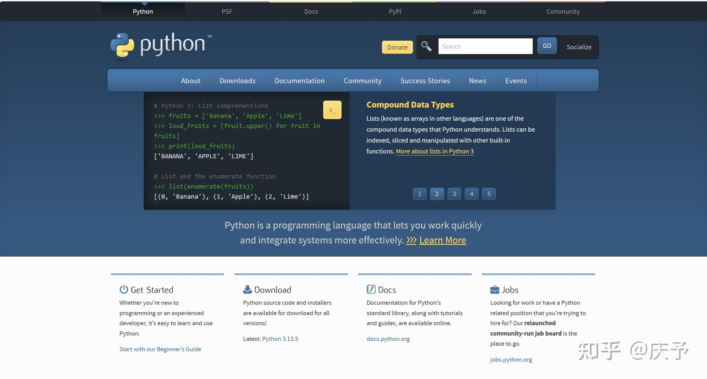

点击windows可以下载windows版本，其它操作系统同理

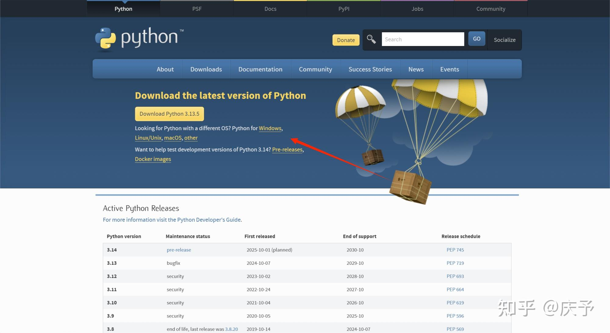

然后选择自己的对应版本，下载3.10以上版本都可以

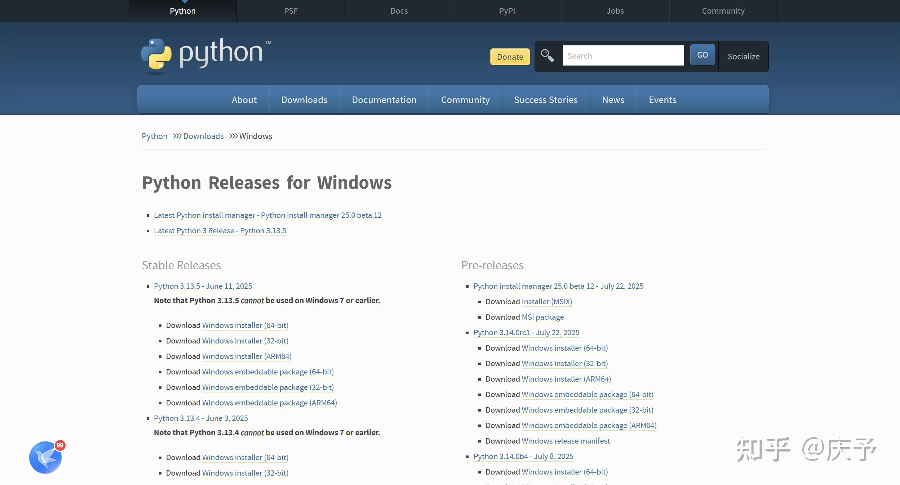

下载成功的安装包如下

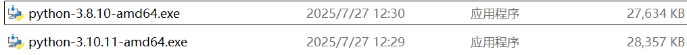

然后我们点击安装运行，一定要选中下面的Add Python 3.8 to PATH

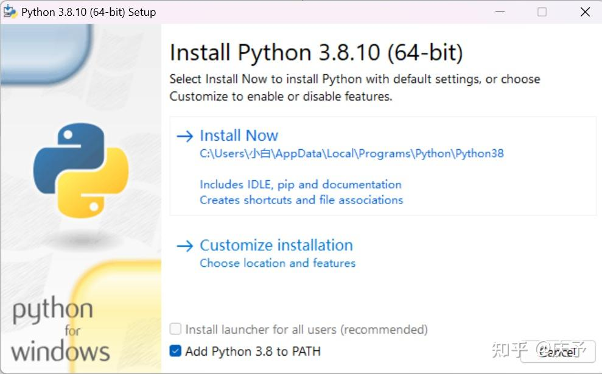

如果没有这个选项也没关系，后面我写如何检查有没有加在环境变量里。

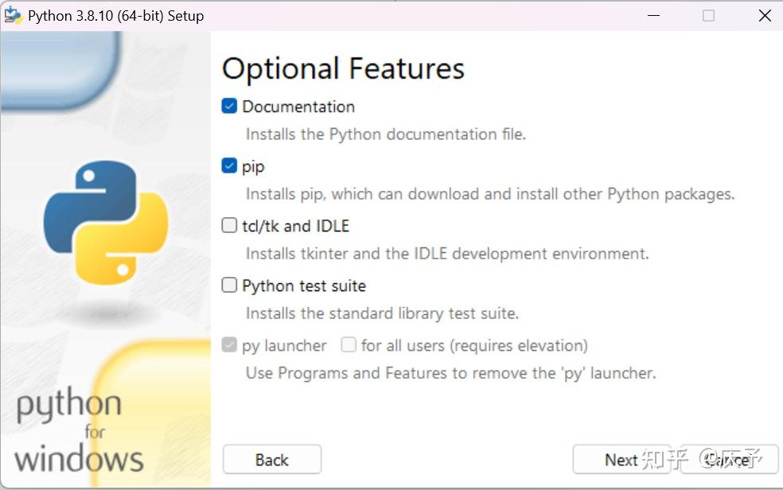

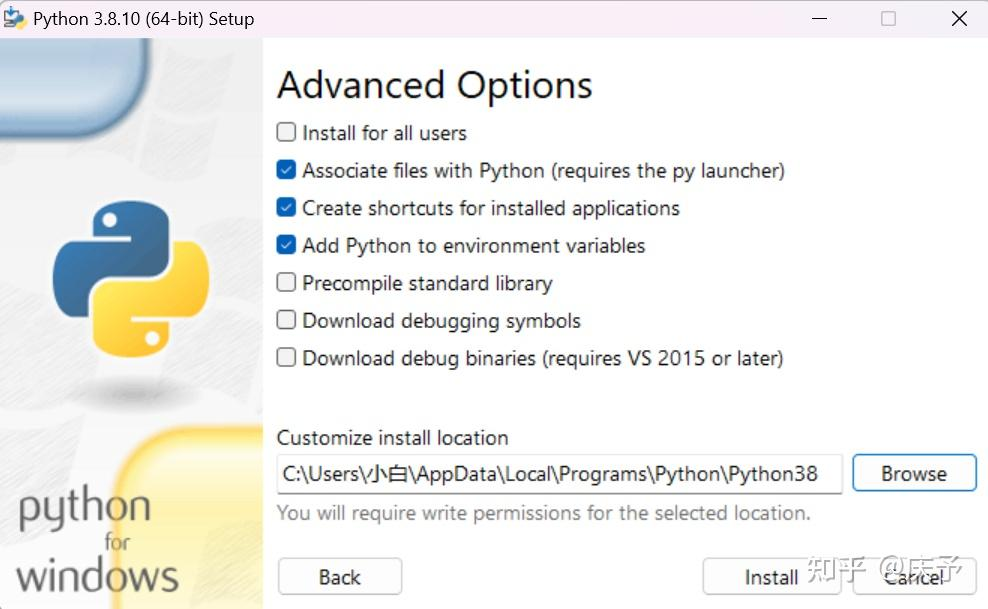

然后点击install就OK啦。
我们进入cmd然后输入python，如果可以直接进入命令行界面，那就是成功了

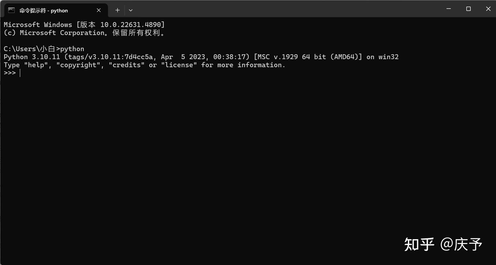

退出函数时exit()（别忘加英文括号）
如果这里没出来的话，可以去检查一下环境变量
我们直接搜索“环境变量”(这样比较快)

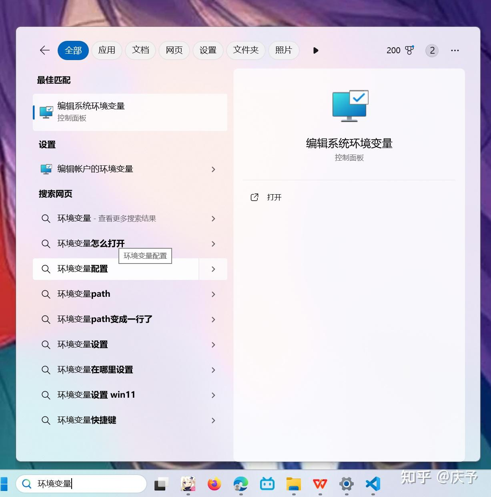

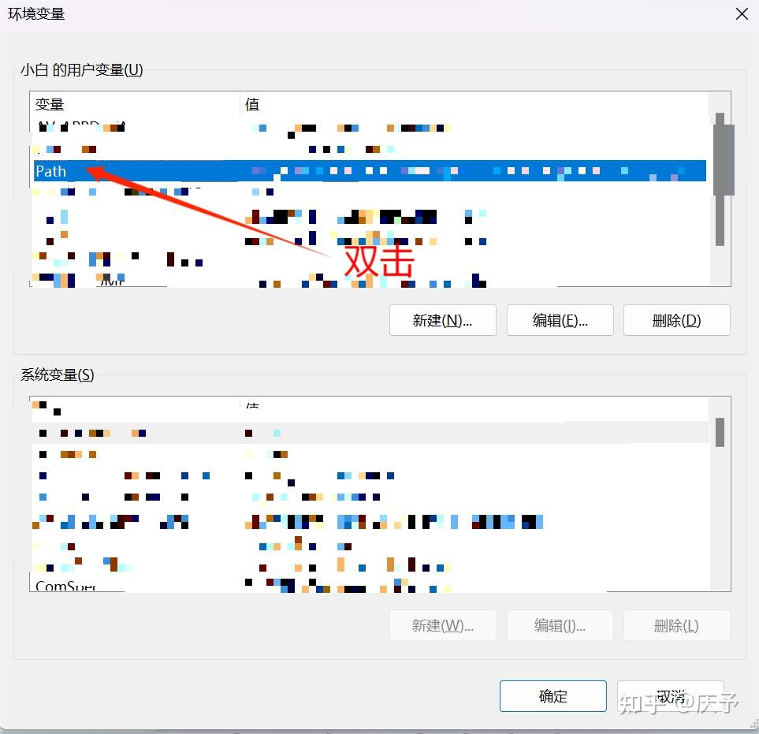

看看有没有这两个

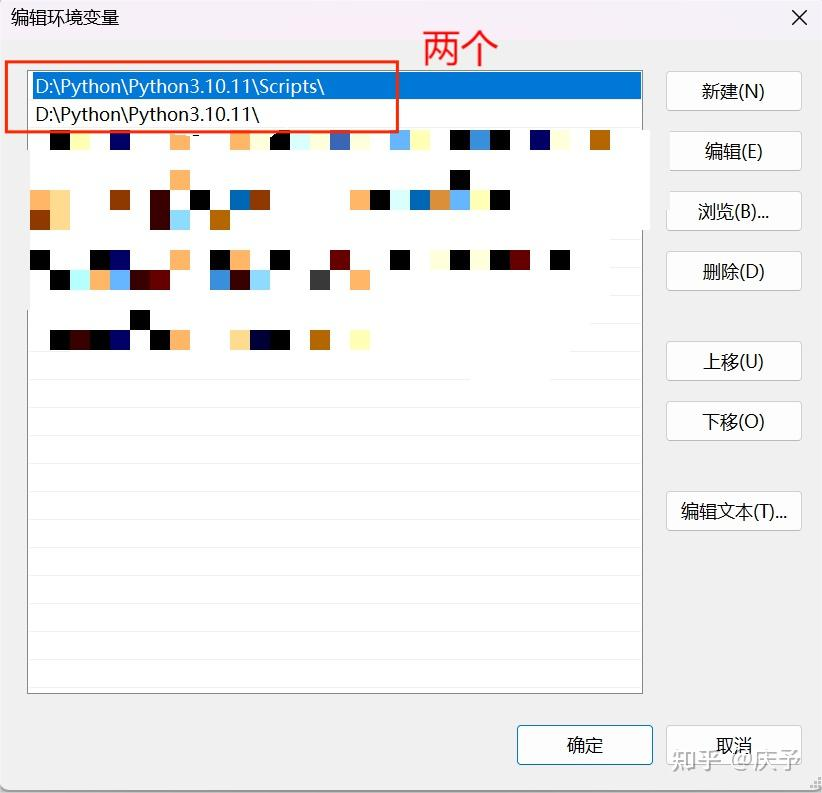

看看有没有这两个如果没有，就直接用浏览按钮手动添加

## 2.安装VScode

进入链接,[https://code.visualstudio.com/download](https://code.visualstudio.com/download "https://code.visualstudio.com/download"),选择合适自己的版本下载即可
基本默认就可以了，这里就不过多演示了

## 3.安装VScode插件

找到python官方插件

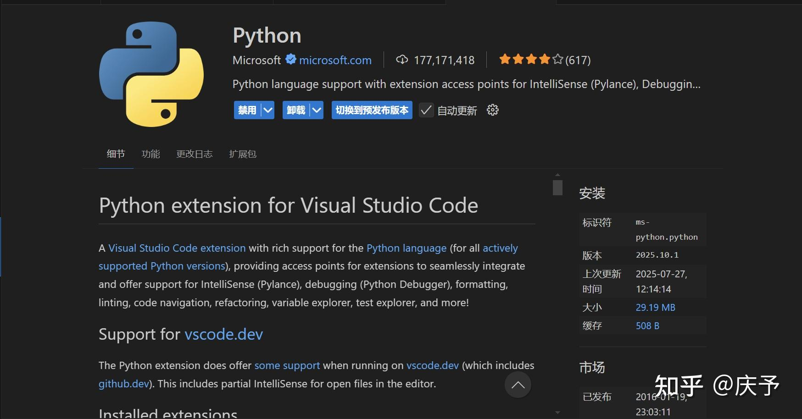

然后按Win+Shift+P（Win+大写P）选择解释器

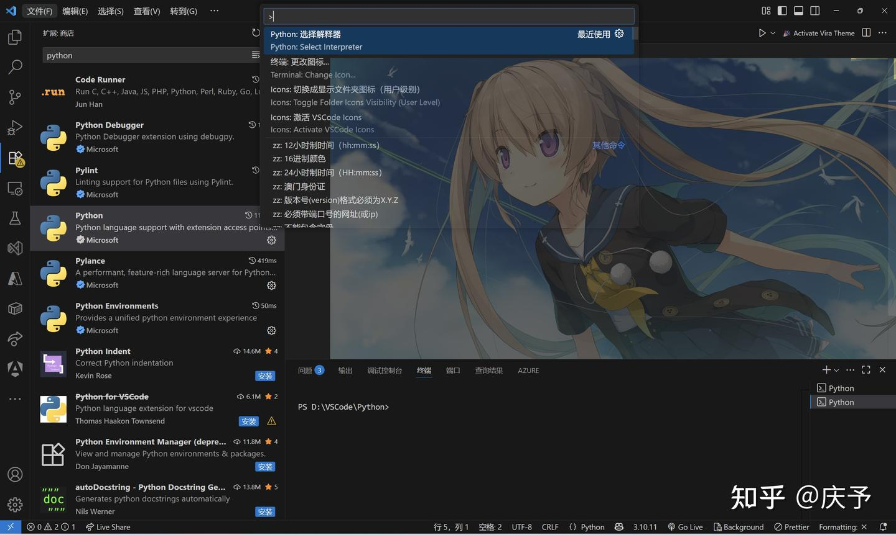

选择在用的版本

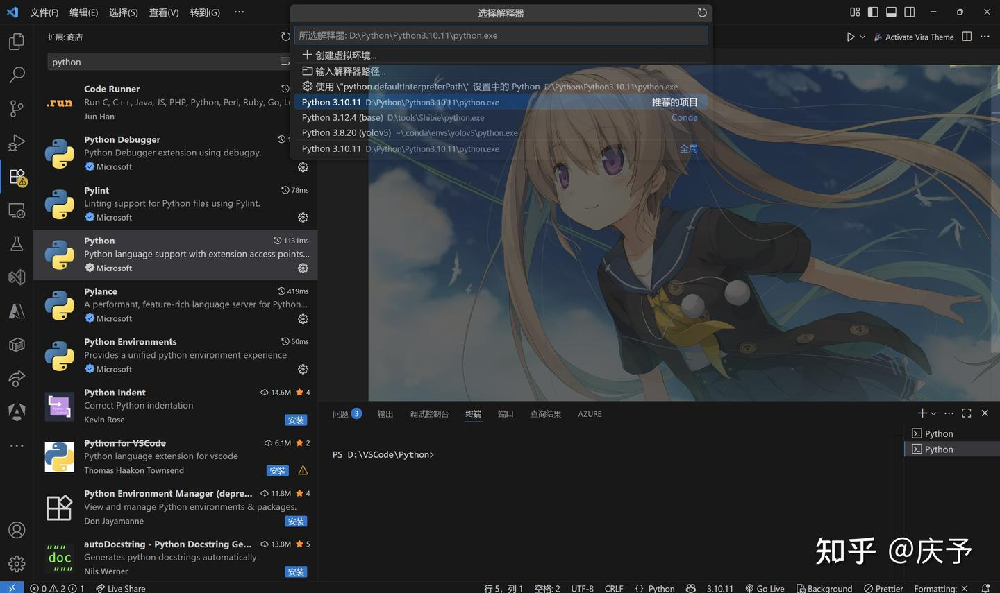

右键，选择在终端中运行Python\_在终端中运行Python

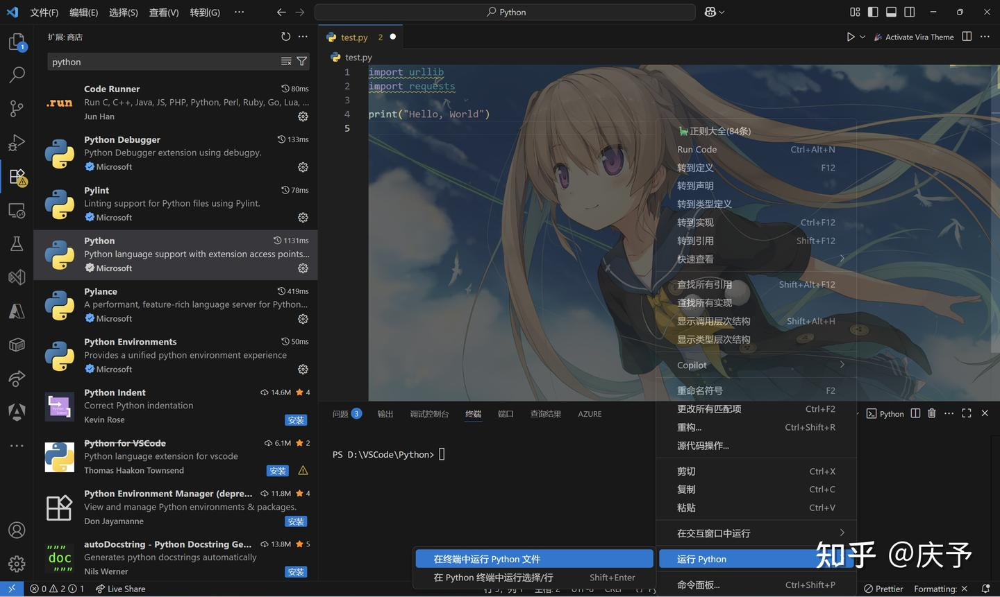

运行成功：

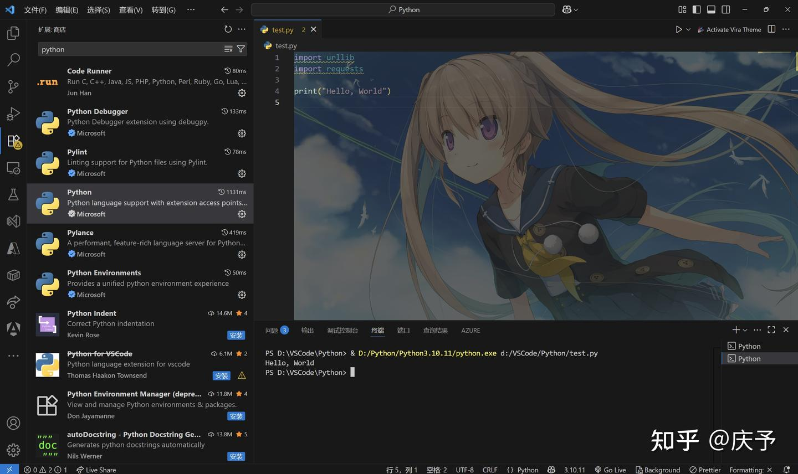

## 4. 安装各种库（pip install）

Python好用的地方就两个，一个是轻巧方便，另一个就是有各种库

安装就是：pip install “想要的库名称”，安装桥通库的命令为：pip install qtmodel

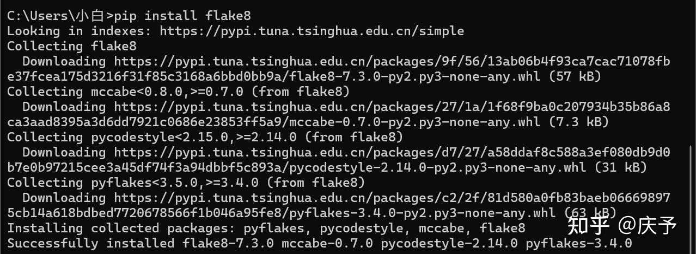

但是python的默认镜像源可能会很慢，可以切换成别的源，我用的是清华镜像源：

Pip config set global.index-url [https://pypi.tuna.tsinghua.edu.cn](https://link.zhihu.com/?target=https://pypi.tuna.tsinghua.edu.cn/simple "https://pypi.tuna.tsinghua.edu.cn")
