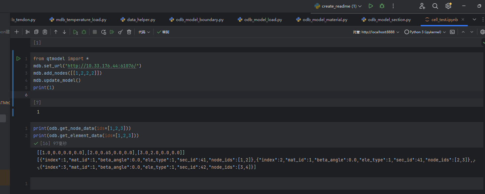
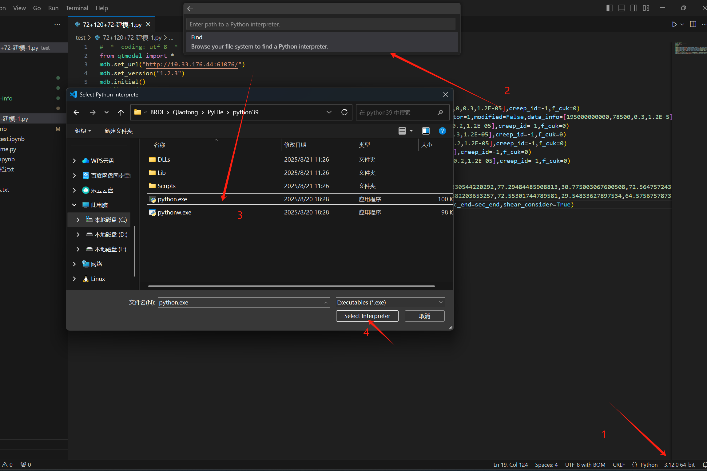
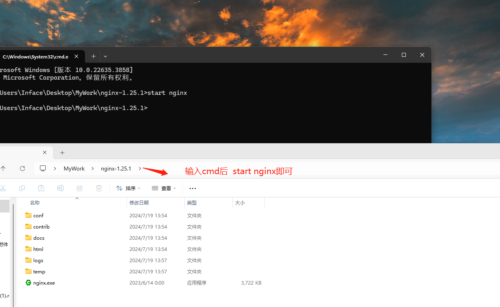
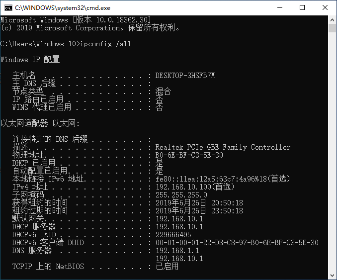

## 功能介绍

桥通API是桥通软件提供的一种接口，用于与外部程序进行交互。通过桥通API，用户可以在外部程序中调用桥通软件的功能，实现自动化分析、数据处理等。

## 调用方式

桥通API的调用方式主要有两种：

- 直接调用：用户在外部程序中直接调用桥通API的函数，实现对桥通软件的控制。
- 间接调用：用户在外部程序中调用桥通API的函数，桥通API再调用桥通软件的函数，实现对桥通软件的控制。

## 接口文档

桥通API的接口文档详细介绍了桥通API的函数、参数、返回值等信息。用户可以根据接口文档，在外部程序中调用桥通API的函数，实现对桥通软件的控制。

## 软件内部调用

### 文件导入导出

桥通支持python模型文件导入与导出，用户可点击文件→导入\导出→python文件，选择需要导入或导出的文件即可完成导入导出。

> 📌**注意**：目前python文件导入仅支持模型文件导入，暂不支持运行分析命令

### 内部运行演示

目前已默认配置好Python 环境，默认无需配置，可直接打开工具→命令窗口→输入代码→点击运行即可，在运行时默认运行按钮为灰显状态，运行完成后自动恢复为可点击状态。


> 📌**注意**：内部运行时（导入文件同理）等同于导入模块运行，请勿使用语句 `if __name__ == "__main__"`:

### 自定义python解释器

可点击工具→API设置→python安装路径右侧编辑按钮，更改python解释器，默认开启服务器如下所示，调用时可以通过mdb.set\_url函数设置调用服务器（默认调用为如下地址）。

<!--  -->

注意：使用自定义python时请使用`pip install qtmodel` 安装第三方库并注意匹配当前桥通版本所支持的qtmodel版本号，可在API设置中查看当前版本桥通对应的版本号，第三方库安装与更新相关cmd命令如下(如未添加环境变量或环境变量中存在多个python请切换到对应python安装路径运行)：

```bash title="cmd命令（请在python目录下运行）"
# 安装第三方库
python -m pip install qtmodel==1.1.13 -i https://pypi.tuna.tsinghua.edu.cn/simple
# 更新第三方库
python -m pip install --upgrade qtmodel==1.1.13 -i https://pypi.tuna.tsinghua.edu.cn/simple


```

最新版本下载链接：[Pypi官方网址](https://pypi.org/search/?q=qtmodel "Pypi官方网址")   最新版本：1.1.13

**mdb类**提供了一系列用于处理模型数据的方法，包括节点、单元、荷载等全部建模相关操作，**odb类**提供了查询模型信息和结果信息相关操作，调用如下：


> 📌**注意**：如已下载第三方库，请及时更新至最新版本

### Python基础教程

[Python3 教程 | 菜鸟教程 Python 3 教程     Python 的 3.0 版本，常被称为 Python 3000，或简称 Py3k。相对于 Python 的早期版本，这是一个较大的升级。为了不带入过多的累赘，Python 3.0 在设计的时候没有考虑向下兼容。 Python 介绍及安装教程我们在Python 2.X 版本的教程中已有介绍，这里就不再赘述。 你也可以点击  Python2.x与3.x版本区别 来 https://www.runoob.com/python3/python3-tutorial.html](https://www.runoob.com/python3/python3-tutorial.html "Python3 教程 | 菜鸟教程 Python 3 教程     Python 的 3.0 版本，常被称为 Python 3000，或简称 Py3k。相对于 Python 的早期版本，这是一个较大的升级。为了不带入过多的累赘，Python 3.0 在设计的时候没有考虑向下兼容。 Python 介绍及安装教程我们在Python 2.X 版本的教程中已有介绍，这里就不再赘述。 你也可以点击  Python2.x与3.x版本区别 来 https://www.runoob.com/python3/python3-tutorial.html")

## 外部软件调用

支持外部运行和调试，可使用文件→导出→导出py功能，将导出后文件可直接在VSCode等IDE中运行，IDE环境可使用桥通下载目录下python39(已内置好当前版本qtmodel库)，用户可使用update\_model函数刷新界面实时数据显示。

### Pycharm调用演示

查看当前桥通本地服务路径，使用set\_url函数可链接桥通软件(默认55125端口时可省略)，存在多桥通运行时设置地址参考工具→API设置→本地服务器地址



### VSCode解释器配置

外部IDE调用时可选择桥通安装目录下PyFile中python.exe（已内置qtmodel包）

[Python VScode 配置 | 菜鸟教程 Python VScode 配置 在上一章节中我们已经安装了 Python 的环境，本章节我们将介绍 Python VScode 的配置。 准备工作：  安装 VS Code 安装 VS Code Python 扩展 安装 Python 3  安装 VS Code VSCode（全称：Visual Studio Code）是一款由微软开发且跨平台的免费源代码编辑器，VSCode 开发环境非常简单易 https://www.runoob.com/python3/python-vscode-setup.html](https://www.runoob.com/python3/python-vscode-setup.html " Python VScode 配置 | 菜鸟教程 Python VScode 配置 在上一章节中我们已经安装了 Python 的环境，本章节我们将介绍 Python VScode 的配置。 准备工作：  安装 VS Code 安装 VS Code Python 扩展 安装 Python 3  安装 VS Code VSCode（全称：Visual Studio Code）是一款由微软开发且跨平台的免费源代码编辑器，VSCode 开发环境非常简单易 https://www.runoob.com/python3/python-vscode-setup.html")



[基于AI代码助手的代码优化.mp4](video/基于AI代码助手的代码优化_Djxf5yJYTC.mp4)

### Autolisp调用桥通

[AutoLisp运行桥通.lsp](file/AutoLisp运行桥通_iFtDlPlPX-.lsp "AutoLisp运行桥通.lsp")

[LISP\_20250818\_14075502.mp4](video/LISP_20250818_14075502_JPqoxlhA-d.mp4)

### VBA调用桥通

[桥通API例子.xlsm](file/桥通API例子_vLUPOn_6zm.xlsm "桥通API例子.xlsm")

[Video\_2025-08-18\_00039\_20250818\_13535729.mp4](video/Video_2025-08-18_00039_20250818_13535729_zgP7Xkyu6.mp4)

### Java程序调用

```java
import java.io.BufferedReader;
import java.io.InputStreamReader;
import java.io.OutputStream;
import java.net.HttpURLConnection;
import java.net.URL;
import java.nio.charset.StandardCharsets;

public class JavaPostExample {
    public static void main(String[] args) {
        try {
            // 创建URL对象
            URL url = new URL("http://localhost:55125/pythonForQt/");
            // 打开连接
            HttpURLConnection connection = (HttpURLConnection) url.openConnection();
            // 设置请求方法为POST
            connection.setRequestMethod("POST");
            // 启用输入输出流
            connection.setDoOutput(true);

            // 设置请求头  支持Python(此时输入command) 和 PyFile(此时输入文件path)
            connection.setRequestProperty("Content-Type", "Python");
//            connection.setRequestProperty("Content-Type", "PyFile");

            // 创建请求体
            String jsonInputString = """
                    from qtmodel import*
                    mdb.initial()
                    mdb.add_nodes([[i+1,2,3]for i in range(200)])
                    mdb.update_model()""";
//            String jsonInputString = "C:\Users\Desktop\PythonCode\连续钢梁建模.py";

            // 发送请求体数据
            try (OutputStream os = connection.getOutputStream()) {
                byte[] input = jsonInputString.getBytes(StandardCharsets.UTF_8);
                os.write(input, 0, input.length);
            }

            // 获取响应
            int status = connection.getResponseCode();
            System.out.println("Response Code: " + status);

            // 根据响应码处理不同的情况
            if (status >= 200 && status < 300) {
                // 成功响应
                try (BufferedReader br = new BufferedReader(
                        new InputStreamReader(connection.getInputStream(), StandardCharsets.UTF_8))) {
                    StringBuilder response = new StringBuilder();
                    String responseLine;
                    while ((responseLine = br.readLine()) != null) {
                        response.append(responseLine.trim());
                    }
                    System.out.println("Response Body: " + response.toString());
                }
            } else if (status == 400) {
                // 400错误，读取错误信息
                try (BufferedReader br = new BufferedReader(
                        new InputStreamReader(connection.getErrorStream(), StandardCharsets.UTF_8))) {
                    StringBuilder errorResponse = new StringBuilder();
                    String errorLine;
                    while ((errorLine = br.readLine()) != null) {
                        errorResponse.append(errorLine);
                    }
                    System.out.println("Error 400 - Bad Request: " + errorResponse.toString());
                }
            } else {
                // 其他错误状态码
                System.out.println("Error: HTTP " + status);
                // 尝试读取错误信息
                try (BufferedReader br = new BufferedReader(
                        new InputStreamReader(connection.getErrorStream(), StandardCharsets.UTF_8))) {
                    StringBuilder errorResponse = new StringBuilder();
                    String errorLine;
                    while ((errorLine = br.readLine()) != null) {
                        errorResponse.append(errorLine);
                    }
                    System.out.println("Error Details: " + errorResponse.toString());
                } catch (Exception e) {
                    System.out.println("Could not read error details");
                }
            }

        } catch (Exception e) {
            e.printStackTrace();
        }
    }
}
```

[Java运行.mp4](video/Java运行_QcnkEXErtB.mp4)

### BimBase调用

[qt\_importer.py](file/qt_importer_p7iR9yd3qT.py "qt_importer.py")

将上述文件配置到BIMBase自定义插件中，或配置bimbase开发环境后直接运行即可将当前开启的模型导入BIMBase

[bimbase导入桥通模型.mp4](video/bimbase导入桥通模型_6ItX_ea9Up.mp4)

### 局域网内跨主机调用

[nginx-1.25.1.zip](file/nginx-1.25.1_o6WCgNvpQR.zip "nginx-1.25.1.zip")

解压后配置监听端口和本地桥通服务器地址，运行nginx.exe文件即可

1. 配置conf文件

   ```apl title="conf配置"
   events {
       worker_connections 1024;
   }

   http {
       client_max_body_size 100m;
       client_body_timeout    1200s;
       client_header_timeout  1200s;
       send_timeout           1200s;

       # ---- 反向代理超时与缓存 ----
       proxy_connect_timeout  1200s;
       proxy_send_timeout     1200s;
       proxy_read_timeout     1200s;
       proxy_buffering        off;     # 关闭代理缓冲，适合大请求/流式
       proxy_request_buffering off;    # 上传大文件时减少落盘
     
       server {
       # 开辟新的端口监听其他主机请求
           listen 61076;
           server_name localhost;
           client_max_body_size 100m;

           location / {
               client_max_body_size 100m;
           # 输入本机服务器地址
               proxy_pass http://localhost:55125/pythonForQt/;
           }
       }
   }
   ```

   
2. 开启nginx服务

   
3. 局域网内其他主机调用post命令，只需输入被调用主机地址和nignx端口即可完成调用

   

   IP地址查询方法

   - 右键Windows, 选择"运行", 输入cmd, 回车打开命令窗口
   - 输入ipconfig：查看网络配置
   - 输入ipconfig /all：查看本机网络配置的详细信息

   

## Python脚本详解

[API参考手册](../ch21_api_manual/index.md "API参考手册")

## 开发环境配置

[Python环境配置](Python环境配置/Python环境配置.md "Python环境配置")

[Jupyter Notebook使用指南](Jupyter-Notebook使用指南/Jupyter-Notebook使用指南.md "Jupyter Notebook使用指南")

[Git与Gitee代码管理](Git与Gitee代码管理/Git与Gitee代码管理.md "Git与Gitee代码管理")
