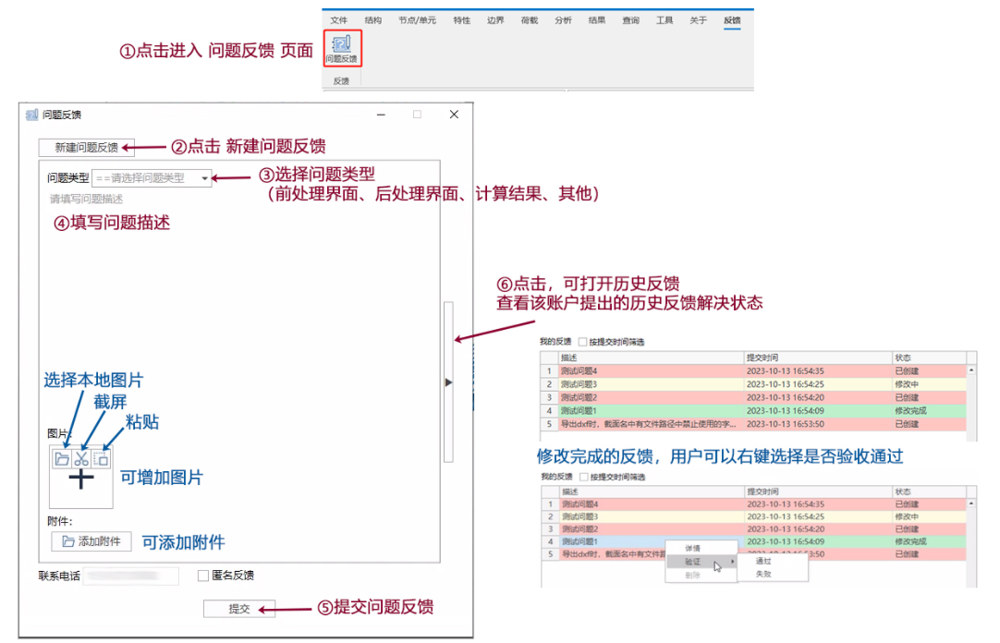
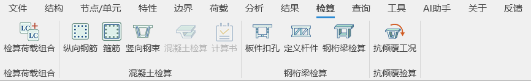

# 问题反馈之正确提问手册

#### 一、问题反馈系统提交流程

按照图示流程提交问题和查看问题反馈

#### 二、问题反馈系统注意点

1. **请尽量根据你遇到的问题准确的选择问题的分类类别。**
   1. 前处理界面，主要是指你的构建有限元模型过程中遇到的问题，例如新建梁单元截面、导入预应力钢束、施加边界条件等等，可以简单的理解为你在单击计算运行按钮之前遇到的问题。
   2. 后处理界面，主要是指你的查看有限元计算结果遇到的问题，例如查看支座反力、查看跨中位移、查看单元内力等等，可以简单的理解为你在单击计算运行按钮之后遇到的问题。
   3. 计算结果，主要是指有限元程序在计算过程中断、不收敛及计算结果异常。
   4. 检算，主要是指有限元程序在计算完成后在进行结构规范检算时遇到问题，主要指检算选项卡下的功能。

      
   5. 其他，不属于以上四类问题，可以选择其他，**其他选项的问题反馈较慢，请尽量选择前面的四项分类。**
2. 如果是在使用桥通过程中出现报错，**请提供报错的模型和导入的数据文件**，方便技术人员通过你的描述，利用你提供的数据文件你遇到复现问题，从而找到问题出错的原因，给出解决问题的方法，所以**模型和导入数据文件是关键**。
3. 为了桥通的技术客服为您提拱高效技术，请**采用图片+文字的方式**，**详细准确描述出现的问题的过程和位置****，** 方便技术客服能准确的理解您在软件使用过程中遇到的问题。
