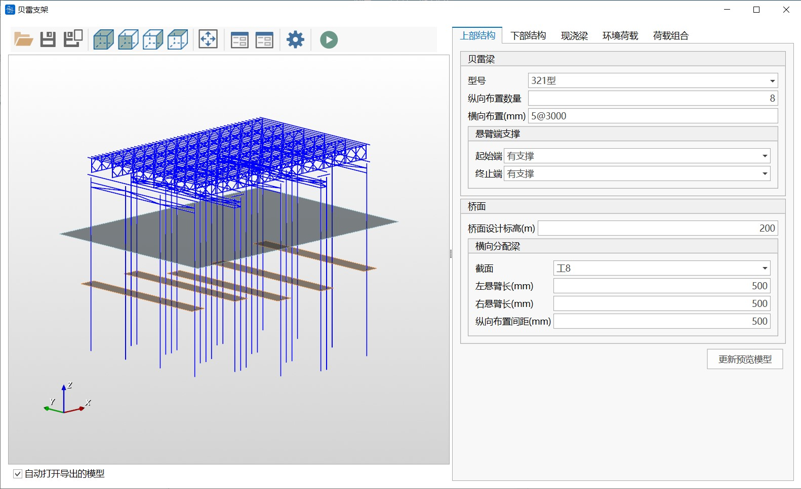
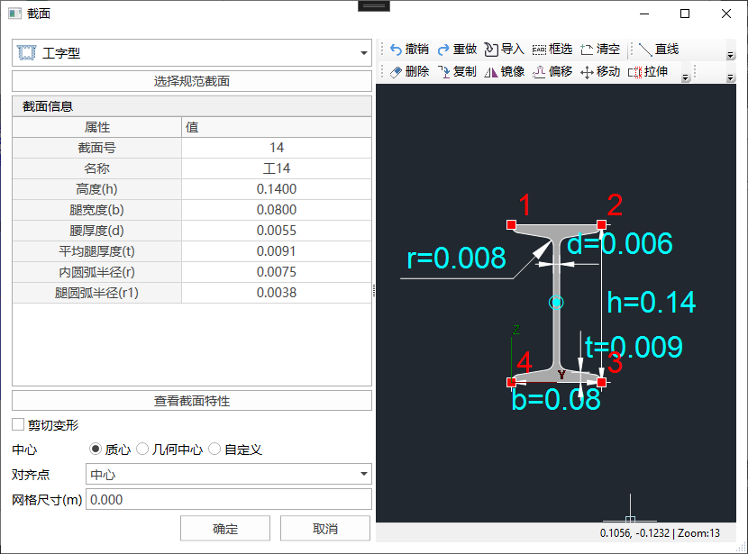
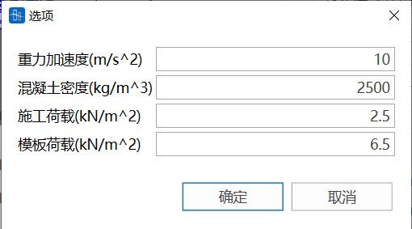
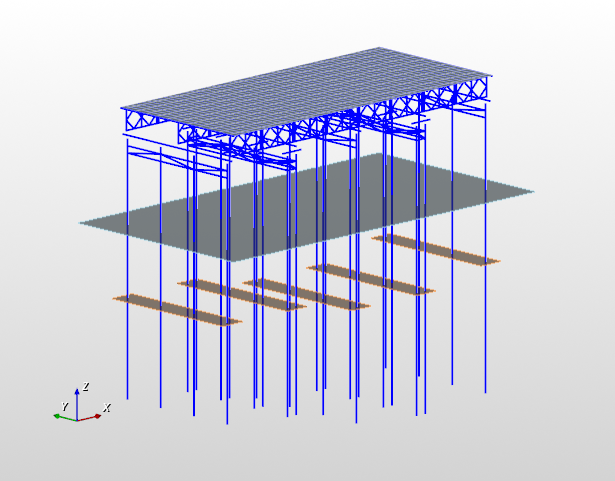
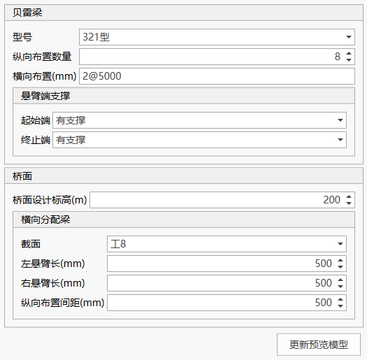
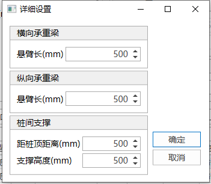
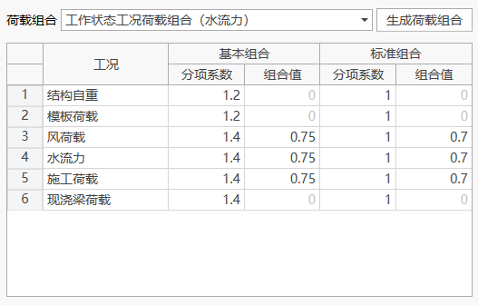
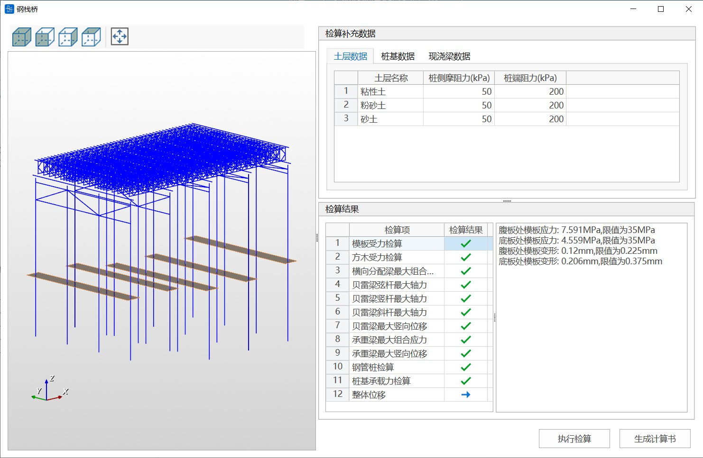
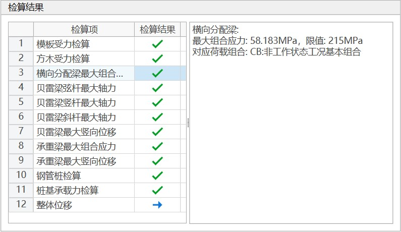

## 功能

通过贝雷支架参数化模型快速生成钢栈桥有限元模型，并支持结构检算和生成计算书功能（仅支持通过建模助手生成的钢栈桥模型）。

## 命令

从主菜单中选择“结构”>“贝雷支架”>“贝雷支架建模”;



## 工具栏


工具栏中按钮的功能依次为：

- 打开数据文件：打开建模助手数据文件；
- 保存数据文件：保存建模助手数据文件；
- 另存为：将当前建模数据另存为其他名称的数据文件；
- 轴测视图；
- 前视图；
- 右视图；
- 顶视图；
- 自动缩放；
- 截面：显示构件截面设计对话框；
- 地质钻孔：显示土层数据和地质钻孔数据编辑对话框；
- 选项：显示选项对话框，包括重力加速度等基本参数；
- 创建桥通模型：根据当前数据生成桥通有限元模型。

## 截面设计




点击工具栏中的“截面”按钮可显示截面列表对话框，然后在截面设计对话框中尽显截面设计。

## 地质钻孔数据管理


点击工具栏中的“地质钻孔”按钮可显示地质钻孔数据管理对话框，可导入导出土层参数、地质钻孔数据。

## 基本参数设定

点击工具栏中的“选项”按钮可显示需要输入的基本参数，包括重力加速度、混凝土密度、施工荷载及模板荷载。其中模板荷载布置在现浇梁梁体投影面内，施工荷载布置在除模板荷载外支架上其他区域。



## 三维模型预览窗口



三维模型预览窗口可实时查看当前参数选项设置对应的模型，包括结构布置、水位面、桩位地面等信息。可通过鼠标操作进行模型的旋转，缩放等操作，也可以通过工具栏中视图相关按钮进行模型视图操作。

## 上部结构设计



上部结构设计面板用于贝雷梁和桥面布置的设计，设计参数调整后，需要点击“更新预览模型”按钮更新三维模型预览视图。

（1）贝雷梁

可设置贝雷梁型号、纵向布置数量、横向布置、悬臂端支撑。

**横向布置**：通过“间距表达式”设置横向布置数量与布置间距，“2\@5000”表示按5000mm间距布置2片贝雷梁。有效的间距表达式示例如下：

```text
4@123.45
100 4@123, 200 300

```

**悬臂端支撑**：用于设置当栈桥端头不设置桩基支撑时的约束方式，“有支撑”选项为端部添加竖向约束（可用于模拟牛腿支撑），“无支撑”选项表示端部为悬臂梁。

（2）桥面

可设置桥面设计标高、桥面布置参数。

## 下部结构设计


（1）桩布置

可设置钢管桩的结构设置和布置位置。其中，“跨径”是指一排桩布置中心线对应的贝雷梁纵向片数，软件仅支持在贝雷梁端部布置下部结构。

（2）横向承重梁

可设置桩顶横向承重梁的设置信息。点击右上方按钮可以设置更多信息。



（3）纵向承重梁

可设置桩顶纵向承重梁的设置信息，仅适用于双排桩。点击右上方按钮可以设置更多信息，。

（4）桩间支撑

可设置桩间支撑的设置信息。点击右上方按钮可以设置更多信息。

## 现浇梁设置


可设置现浇梁荷载布置情况。

点击“导入箱梁平曲线与截面布置”按钮显示导入相关现浇梁图纸文件。

**注意**：

（1）图层规则

1.平曲线必须是多段线，从左向右布置，且必须放置在名为“#平曲线”的图层中。导入时，按导入图形的原始绝对坐标布置在桥面上，布置原点为桥面左侧对称中线点，平曲线根据实际可不放在原点上。绘图单位为m。

2.截面定位线从左往右布置，，且必须放置在名为“#截面定位线”的图层中。截面定位线表示下方截面对应在平曲线纵向的位置。

3.截面布置从左往右，对应截面定位线排列顺序；当截面发生突变时（如单箱单室变为单箱双室），则需要在同一截面位置设置两个截面并换行放置。每一横排的截面线条均拐点相同，保证截面可以进行放样处理。


（2）现浇梁断面图纸规则

现浇梁截面设置为块，在块编辑器中现浇梁断面轮廓线有一条外轮廓线和至少一条内轮廓线构成，外轮廓线放置在名为“#截面外轮廓”的图纸中，内轮廓线放置在名为“#截面内轮廓”的图层中。轮廓线必须是多段线。以块中原点作为断面的对齐点（即与平曲线对应的点）。绘图单位为m。


（3）现浇梁图块命名规则

每一排对应的命名前缀相同，第n排为"#Sec-0n-"，第一个为01，末尾数字保证右边大于左边即可。


## 环境荷载设置


可设置风荷载、流水荷载与波浪力。

（1）风荷载

仅考虑贝雷梁受到的风荷载作用，荷载计算后施加到桩顶；贝雷梁挡风折减系数取0.66。

（2）流水荷载与波浪力

波浪力根据《港口与航道水文规范》(JTS 145-2015)计算，以线荷载的方式施加到钢管桩上。

## 荷载组合设置



可根据现浇梁荷载、施工荷载、环境荷载等设置信息自动生成荷载组合。生成的荷载组合系数可调整。

**注意**：请在完成前面的设计后再使用荷载组合功能。在生成荷载组合后，返回调整其他设置信息可能会导致此前的荷载组合数据失效。

## 检算与计算书

从主菜单中选择“结构”>“贝雷支架”>"计算书"，打开贝雷支架检算与计算书对话框



（1）土层数据

需要补充土层的桩侧摩阻力及桩端摩阻力值，可直接在表格中输入也可复制粘贴，粘贴时保证原表格数据列数与土层表格相同。


（2）桩基数据

需要补充每排桩桩基类型及其他相关参数。


（3）现浇梁模板数据

需补充模板类型、厚度、需验算处梁高及模底方木参数情况。


### 检算

土层数据、桩基数据及模板信息补充完成后点击"执行检算"，检算结果以表格形式读取，检算结果打"√"表示检算通过，打"×"表示检算不通过。每项检算会在右侧显示有限元模型计算结果及限值，并显示对应荷载组合，可根据荷载组合在模型中找寻对应检算结果。模板相关检算仅根据模板补充信息检算，若模板检算不通过可直接修改上方相关数据，再点击"执行检算"。整体位移只显示最大水平位移计算结果，无限制。



### 计算书

当所有检算结果均通过后，点击"生成计算书"即可生成计算书文件。


