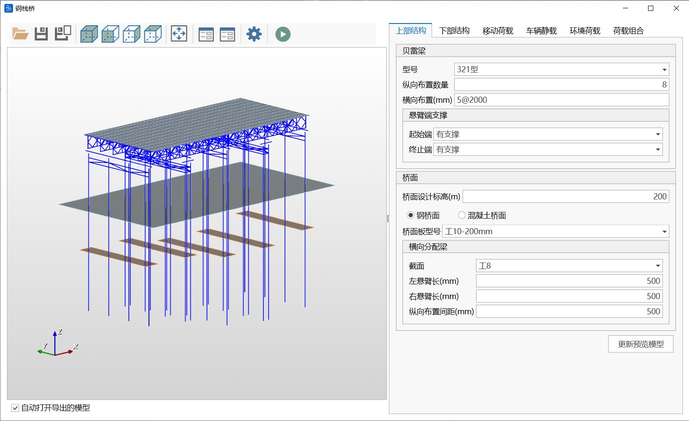
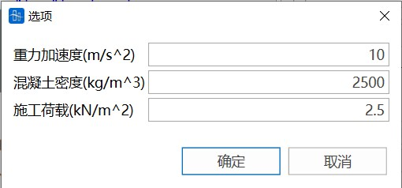
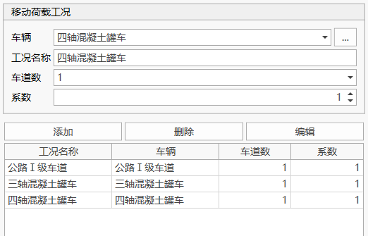
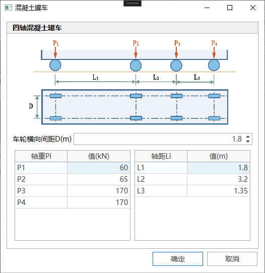
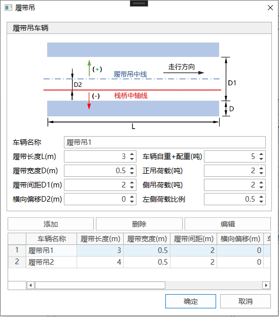
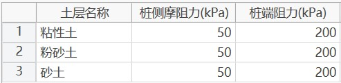
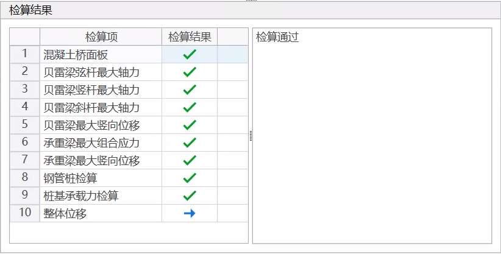
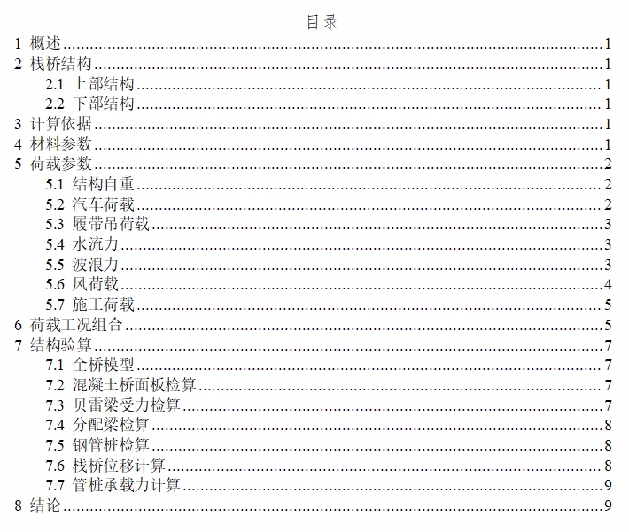

## 功能

通过钢栈桥参数化模型快速生成钢栈桥有限元模型，并支持结构检算和生成计算书功能（仅支持通过建模助手生成的钢栈桥模型）

## 命令

从主菜单中选择“结构”>“钢栈桥”>“钢栈桥建模”，打开;



## 工具栏

工具栏中按钮的功能依次为：

- [截面设计](#截面设计)
- [地质钻孔数据管理](#地质钻孔数据管理)
- 打开数据文件：打开建模助手数据文件；
- 保存数据文件：保存建模助手数据文件；
- 另存为：将当前建模数据另存为其他名称的数据文件；
- 轴测视图；
- 前视图；
- 右视图；
- 顶视图；
- 自动缩放；
- 截面：显示构件截面设计对话框；
- 地质钻孔：显示土层数据和地质钻孔数据编辑对话框；
- 选项：显示选项对话框，包括重力加速度等基本参数；
- 创建桥通模型：根据当前数据生成桥通有限元模型。

## 截面设计

点击工具栏中的“截面”按钮可显示截面列表对话框，然后在截面设计对话框中尽显截面设计。


## 地质钻孔数据管理

点击工具栏中的“地质钻孔”按钮可显示地质钻孔数据管理对话框，可导入导出土层参数、地质钻孔数据。


## 基本参数设定

点击工具栏中的“选项”按钮可显示需要输入的基本参数，包括重力加速度、混凝土密度及施工荷载。



## 三维模型预览窗口


三维模型预览窗口可实时查看当前参数选项设置对应的模型，包括结构布置、水位面、桩位地面等信息。可通过鼠标操作进行模型的旋转，缩放等操作，也可以通过工具栏中视图相关按钮进行模型视图操作。

## 上部结构设计


上部结构设计面板用于钢栈桥贝雷梁和桥面布置的设计，设计参数调整后，需要点击“更新预览模型”按钮更新三维模型预览视图。

（1）贝雷梁

可设置贝雷梁型号、纵向布置数量、横向布置、悬臂端支撑。

**横向布置**：通过“间距表达式”设置横向布置数量与布置间距，“2\@5000”表示按5000mm间距布置2片贝雷梁。有效的间距表达式示例如下：

```text
4@123.45
100 4@123, 200 300
```

**悬臂端支撑**：用于设置当栈桥端头不设置桩基支撑时的约束方式，“有支撑”选项为端部添加竖向约束（可用于模拟桥台支撑），“无支撑”选项表示端部为悬臂梁。

（2）桥面

可设置桥面设计标高、桥面类型、桥面布置参数。

**钢桥面**：


可设置桥面板型号、横向分配梁截面类型、横向分配梁悬臂长、纵向布置间距。

**注意**：钢桥面板为带有纵梁的钢板，生成的模型不考虑桥面板单元的刚度，生成的桥面板单元厚度为10mm，纵梁的重量通过调整桥面板材料的密度折算到桥面板中。

**混凝土桥面**：


可设置桥面板厚度、混凝土标号。

## 下部结构设计


（1）桩布置

可设置钢管桩的结构设置和布置位置。其中，“跨径”是指一排桩布置中心线对应的贝雷梁纵向片数，软件仅支持在贝雷梁端部布置下部结构。

（2）横向承重梁

可设置桩顶横向承重梁的设置信息。点击右上方按钮可以设置更多信息。


（3）纵向承重梁

可设置桩顶纵向承重梁的设置信息，仅适用于双排桩。点击右上方按钮可以设置更多信息，。

（4）桩间支撑

可设置桩间支撑的设置信息。点击右上方按钮可以设置更多信息。

## 移动荷载设置



可设置移动荷载工况。支持公路Ⅰ级车道、三轴混凝土罐车、四轴混凝土罐车三种移动荷载。可点击右上角按钮调整混凝土罐车的轴重等设置。



## 车辆静载设置


可设置履带吊荷载。履带吊以静力荷载的方式施加到桥面上。

（1）车辆

点击右上角按钮可以显示履带吊定义对话框，用于自定义履带吊车辆。



（2）荷载类型

可指定履带吊荷载类型，包括走行、正吊（正向）、正吊（反向）、侧吊。履带吊走行方向，从左向右为正向，反之为反向。

（3）跨间加载、桩顶加载

可指定履带吊荷载的加载位置。一项车辆设置、一种荷载类型和一个加载位置共同构成一个加载工况。

在调整当前指定的车辆、荷载类型和加载位置时，面板上方的平面布置图会实时显示当前的加载情况。

## 环境荷载设置


可设置风荷载、流水荷载与波浪力。

（1）风荷载

仅考虑贝雷梁受到的风荷载作用，荷载计算后施加到桩顶；贝雷梁挡风折减系数取0.66。

（2）流水荷载与波浪力

波浪力根据《港口与航道水文规范》(JTS 145-2015)计算，以线荷载的方式施加到钢管桩上。

## 荷载组合设置


可根据移动荷载、车辆静载、环境荷载等设置信息自动生成荷载组合。生成的荷载组合系数可调整。

**注意**：请在完成前面的设计后再使用荷载组合功能。在生成荷载组合后，返回调整其他设置信息可能会导致此前的荷载组合数据失效。

## 检算与计算书

从主菜单中选择“结构”>“钢栈桥”>"计算书"，打开钢栈桥检算与计算书对话框


（1）土层数据

需要补充土层的桩侧摩阻力及桩端摩阻力值，可直接在表格中输入也可复制粘贴，粘贴时保证原表格数据列数与土层表格相同。



（2）桩基数据

需要补充每排桩桩基类型及其他相关参数。


### 检算

土层数据及桩基数据补充完成后点击"执行检算"，检算结果以表格形式读取，检算结果打"√"表示检算通过，打"×"表示检算不通过。每项检算会在右侧显示有限元模型计算结果及限值，并显示对应荷载组合，可根据荷载组合在模型中找寻对应检算结果。桥面板为混凝土则不检算横向分配梁最大组合应力，检算混凝土吊装工况下最大弯矩及剪力；考虑混凝土桥面板保护层厚度为40mm且受压高度为80mm。整体位移只显示最大水平位移计算结果，无限制。




### 计算书

当所有检算结果均通过后，点击"生成计算书"即可生成计算书文件。


