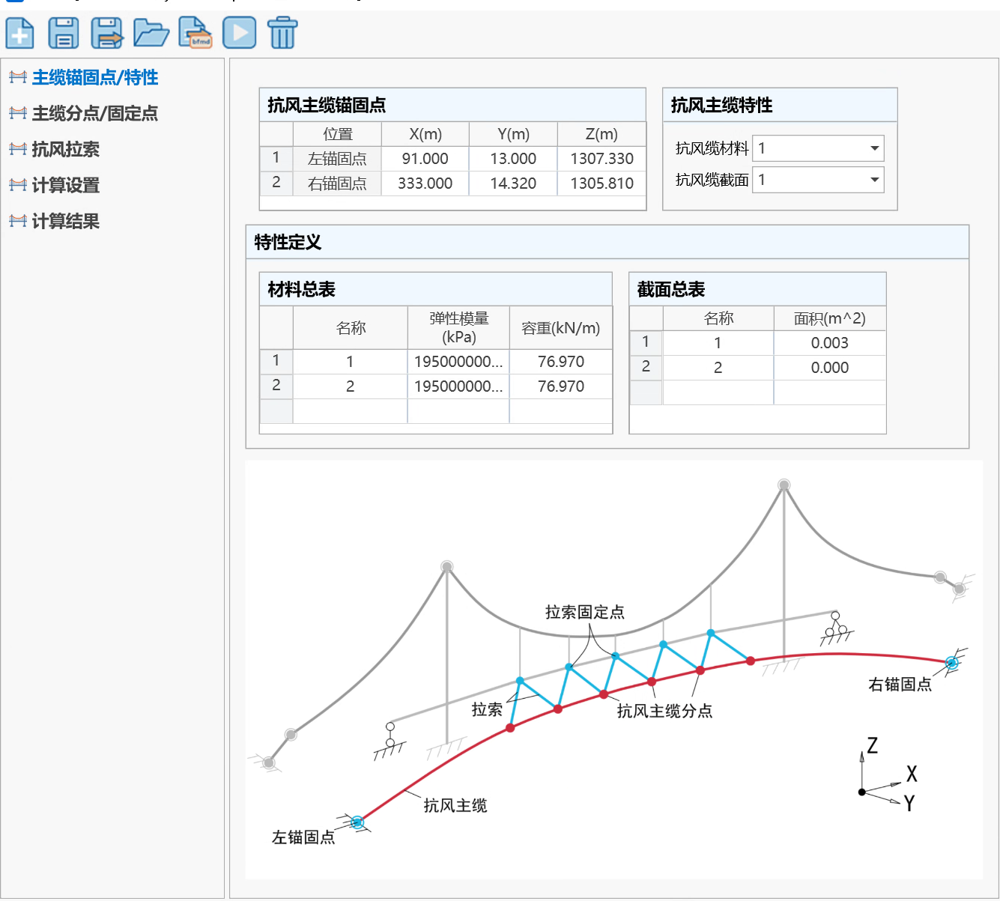
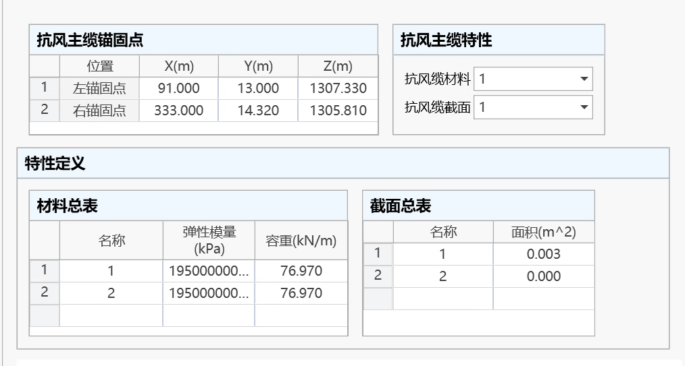

## 功能介绍

该模块适用于拉索平行布置的抗风缆、拉索三角交叉的抗风缆、空间索网结构等形式，且可以进行考虑斜置中央扣的传统主缆找形；支持多种控制方式，实现缆(索)力、缆(索)长、分点坐标等精确快速求解。主要功能包括：

(1) 已知抗风主缆纵向力和抗风拉索拉力，求抗风主缆的横、竖坐标等。

(2) 已知抗风主缆跨中横坐标和抗风拉索拉力，求抗风主缆的纵向力等。

(3) 已知抗风主缆跨中竖坐标和抗风拉索拉力，求抗风主缆的纵向力等。

(4) 已知抗风主缆跨中横坐标和纵向力,求抗风拉索拉力(各索力相同)等。

(5) 已知抗风主缆跨中竖坐标和纵向力，求抗风拉索拉力(各索力相同)等。

## 单位制与坐标系

除特殊说明外，本模块单位制规定如下：力（kN）,长度（m）,角度（°）。

整体坐标轴设置如下图所示：桥梁的顺桥向为X轴方向，以向右为正；桥梁的高度方向为Z方向，以向上为正；桥梁的横桥向为Y方向，与X、Z轴满足右手螺旋法则。所有荷载、位移和内力结果都以沿坐标轴正向为正，反之为负。

## 基本操作

(1) 点击“结构→悬索桥助手→抗风缆”图标进入模块窗口；

(2) 首页为“主缆锚固点/特性”页面：填入主缆锚固点坐标；“特性定义”中输入主缆、拉索杆件的截面、材料特性值；“抗风主缆特性”输入已定义好的抗风主缆的材料和截面名称。

(3) 进入“主缆分点/固定点”页面：添加抗风缆分点，以及固定点（主梁上的分点）。

(4) 进入“抗风拉索信息”页面：定义每根抗风拉索的两侧端点（一侧为主缆分点，另一侧为固定点），材料名称和截面名称。

(5) 进入“计算设置”页面：定义找形控制方式（须定义抗风缆纵向力、跨中竖向横向坐标、拉索力三者中的任意两个量），设置迭代精度（一般可不修改）。

(6) 点击“计算”按钮开始计算。

(7) 若计算成功，则可在“计算结果”页面查看相关结果。

## 计算操作界面介绍

### 基本按钮

l **新建**：新建一个数据文件（ \*.sfmd1）。

l **保存**：将数据保存在当前工程所在文件夹中。

l **另存为**：将数据保存到别的路径。

l **打开**：打开其它数据文件（ \*.sfmd1）。

l \*\* 导出到桥通\*\*：计算完成后的结果导出到桥通主程序中，生成相应的单元、节点和荷载。

l  **计算**：点击开始计算。

l  **删除结果**：将当前结果数据删除。

### 主缆锚固点/特性

l **抗风主缆锚固点**

填入抗风缆左、右端点坐标。

l **材料**

填入所有材料的弹模和容重。

l **截面**

填入所有截面的名称、面积。

l **抗风主缆特性**

填入抗风缆的材料、截面，从已定义的材料、截面列表中选择。

### 主缆分点/固定点

程序根据桥跨号、起始位置和分点距离，自动按照从左向右的顺序生成抗风缆分点位置、集中力，以及主梁分点位置，以确定抗风拉索的具体位置。

#### 抗风缆分点

l **抗风缆分点初始位置**

左侧理论点——默认选项。以该跨的“左侧理论点”为起点计算分点位置。

最右侧分点——以该跨已添加的所有分点中最右侧的分点为起点计算分点位置。

l **添加分点**

填入各分点间的X方向距离。例如，10,3\@6.5表示生成4个分点，第1分点距离起始位置为10m，第2分点与第1分点距离6.5m，第3分点与第2分点距离6.5m，以此类推。

l **分点力**

填入添加的抗风缆分点处x、y、z三个方向的集中荷载。

l\*\* 清除全部\*\*

删除所有抗风缆分点。

l\*\* 分点表格\*\*

显示所有添加的抗风缆分点X坐标和分点力，支持表格粘贴复制。表格处点鼠标右键，支持修改显示精度。

#### 固定点

**l 固定点起点坐标**

填入固定点（主梁上点）的起始坐标。

l **添加分点**

填入各固定点间的X方向距离。

l\*\* 清除全部\*\*

删除所有固定点。

l\*\* 分点表格\*\*

显示所有添加的固定点XYZ坐标，支持表格粘贴复制。表格处点鼠标右键，支持修改显示精度。

### 抗风拉索

定义抗风拉索，在表格每行填入拉索的两端点（一端为抗风主缆上的分点，另一端为固定点），以及拉索的材料和截面。

### 计算设置

l **计算方法设置**

选择5种找形控制方式之一，并根据控制方式填入相应数据。

> 📌注意：可通过“拉索力类型”统一设置所有拉索力类型，也可在表格中单独修改设置。

l **找形迭代误差**

找形计算的迭代误差，默认为1e-7。用户一般可不做修改。

**l  收敛调整系数**

当计算收敛困难时，可适当调整该系数γ（0&lt;γ≤1）以帮助收敛。用户一般可不做修改。

### 计算结果

通过该页面查询所有计算结果。可查询结果类型如下：

| 计算内容       | 结果类型       | 说明                             |
| ---------- | ---------- | ------------------------------ |
| **抗风缆相关**​ | 主缆锚固点分力    | 成桥状态下抗风主缆两端锚固点的分力。             |
|            | 主缆分点坐标及切线角 | 成桥状态下抗风主缆各分点的坐标和竖向、水平切线角。      |
|            | 主缆索段长度     | 成桥状态下抗风主缆分点间索段的无应力长度、伸长量、曲线总长。 |
|            | 主缆索段端部力    | 成桥状态下各跨主缆分点间索段的左、右侧端部力。        |
| **拉索相关**​  | 拉索长度       | 成桥状态下拉索的无应力长度、伸长量和曲线总长。        |
|            | 拉索端部力      | 拉索的两端（抗风缆端和主梁端）分力。             |
| **固定点相关**​ | 固定点处竖反力    | 固定点反力的竖向分力。                    |
