## 24.1美规

### 24.1.1材料

- 规范：AASHTO-LRFDBDS-2017、AASHTO-LRFDBDS-2020

### 24.1.2收缩徐变

- 规范：AASHTO-LRFDBDS-2017

### 24.1.3钢筋松弛

- 规范：AASHTO-LRFDBDS-2020

### 24.1.4 活载

移动荷载规范选择AASHTO-LRFD

#### 24.1.4.1 设计汽车荷载

AASHTO LRFD规范中采用 HL-93 汽车荷载模型，包括三部分：设计货车、设计双轴荷载、设计车道荷载。

- **设计双轴荷载与设计车道荷载组合**

  设计双轴荷载考虑冲击系数，设计车道荷载不考虑冲击系数

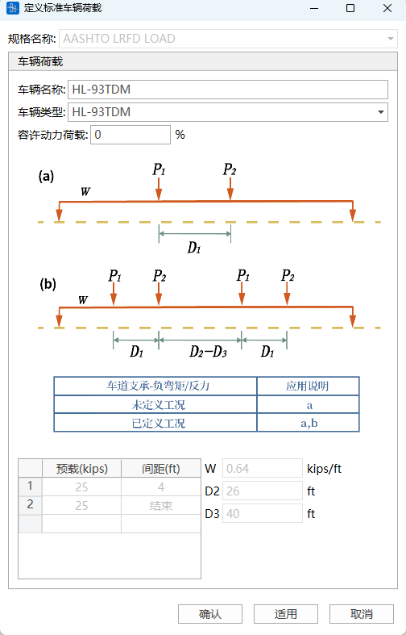

- **设计货车（变轴距）与设计车道荷载组合**

  设计货车荷载考虑冲击系数，设计车道荷载不考虑冲击系数

- **疲劳荷载**

- **自定义车辆荷载**

  可以自定义多轴荷载（定轴或变轴）、自定义车道荷载、或者两者组合的车辆荷载
  > 如果车辆荷载最后一个轴为定轴，则最后一个荷载对应的间距填0。

> 🧐**AASHTO-LRFD规范中规定：在确定车道数量的过程中，如果活载工况中包括人群荷载和在包括人群荷载与一个车道以上的汽车荷载组合工况中，需将人群荷载视作一个车道与其他车道一起考虑折减系数，所以人群荷载采用自定义车辆。**

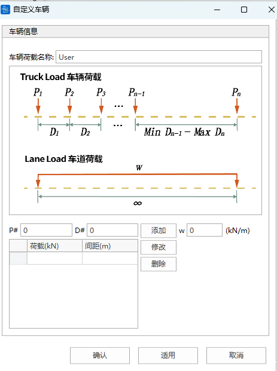

#### 24.1.4.2 多车道折减

- 当考虑桥上多条车道加载时，需按的系数m考虑其多车道折减。

  | 车道数量 | 多车道折减系数m |
  | ---- | -------- |
  | 1    | 1.20     |
  | 2    | 1.00     |
  | 3    | 0.85     |
  | \\>3 | 0.65     |

- 注意事项

  在确定车道数量的过程中，如果活载工况中包括人群荷载和在包括人群荷载与一个车道以上的汽车荷载组合工况中，需将人群荷载视作一个车道与其他车道一起考虑折减系数。
  - 如果活载工况中有一个人行道和一个车道，单独计算汽车活载时，m=1.2：人群荷载与车辆活载组合时，m=1.0；
  - 如果活载工况中有一个人行道和两个车道的车辆荷载：
    &#x20;       （1）汽车活载取一个车道，m=1.2；
  &#x20;       （2）汽车活载中较大的车道和人群荷载组合，或者汽车活载取两车道，m=1.0；

  &#x20;       （3）两车道的汽车活载和人群活载，m=0.85.
  - 对于单车道而言，多车道系数（m=1.2）并不适用人群荷载。因此，没有车辆活载的人群荷载，m取1.0。

#### 24.1.4.3 荷载动力效应

📖   除了离心力和制动力外，设计货车或设计双轴荷载需要在静力效应的基础上增加动力荷载系数IM以考虑荷载动力效应。人群荷载和设计车道荷载不需要考虑冲击系数。

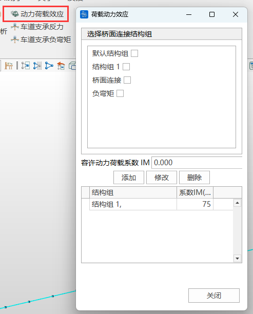

>  如果结构组设置了动力荷载效应系数，则单元内力、应力，节点位移计算时，均采用设置的动力荷载效应系数，车辆中的动力荷载效应失效。

#### 24.1.4.4 车道支承反力和负弯矩

📖       规范规定；对于均布荷载的反弯点之间的负弯矩(梁单元或者板单元的负弯矩)和中间墩支反力，2辆设计货车效应的90%（前车后轴与后车前轴最小间距为50ft）与车道荷载效应的90%组合，每辆卡车的32kip轴间距为14ft。两辆货车应布置在相邻两孔以得到最大荷载效应。

- 车道支承反力

  选择中间墩支承单元所在节点

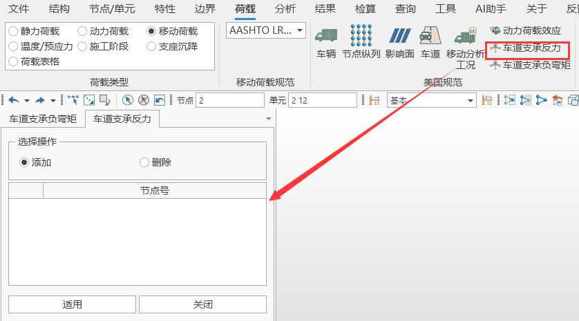

- 车道支承负弯矩

  选择均布荷载的反弯点之间的负弯矩(梁单元或者板单元的负弯矩)所在单元

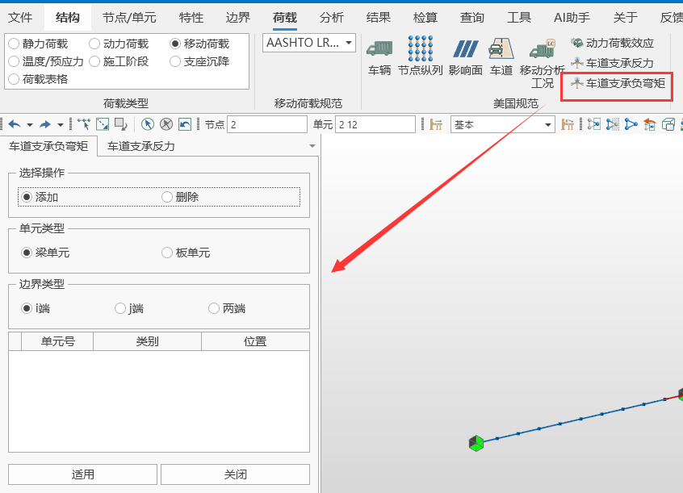

- ❗注意事项
  1. 如果设置了车道支承负弯矩单元，梁单元内力负弯矩，梁单元应力计算考虑车辆荷载中“已定义工况”；
  2. 如果设置了车道支承反力，支反力计算考虑车辆荷载中“已定义工况”；
  3. 如果设置了车道支承负弯矩单元，且单元同时定义动力荷载效应系数，两者均考虑。

### 24.1.5 混凝土检算

#### 24.1.5.1检算荷载组合

#### 检算荷载组合

- 规范：AASHTO-LRFDBDS-2020
- 类型分为：强度组合、极端事件、使用组合Ⅰ、使用组合Ⅱ、使用组合Ⅲ、使用组合Ⅳ、疲劳组合、永久作用组合

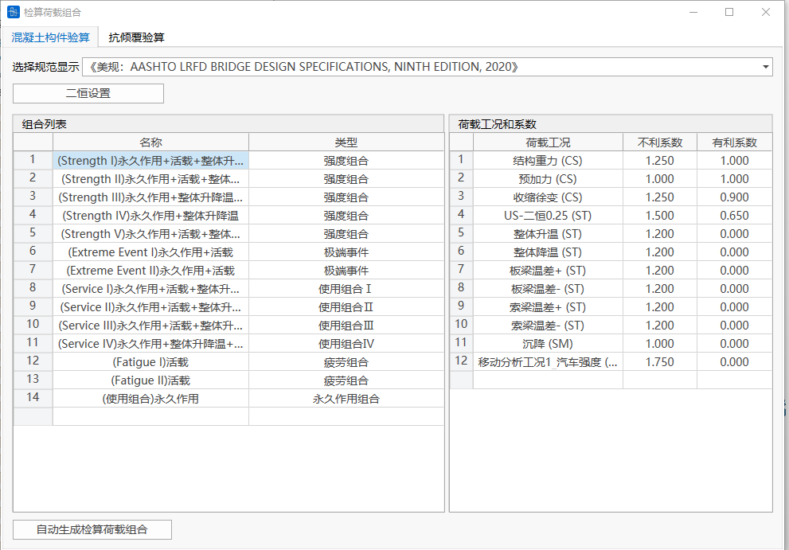

- **二恒设置**

  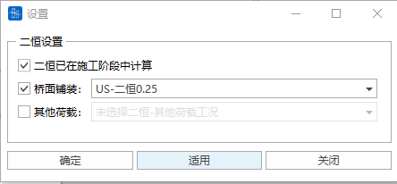
  - **“二恒”是否已在施工阶段中计算**

    若二恒荷载工况（工况类型为恒载）也在施工阶段中参与计算，CQ成桥（恒载）结果实际包括了一恒和用户定义的二恒，那么需要将CQ成桥（恒载）结果减去运营阶段的二恒荷载工况（工况类型为恒载）计算结果，从而得到一恒的计算结果，所以二恒设置中需要选择是否二恒荷载工况（工况类型为恒载）已经在施工阶段中计算。

#### 自动生成检算荷载组合

- 功能：辅助用户生成检算荷载组合。
- 命令：“检算荷载组合”窗口左下角的按钮。

- 输入
  - **二恒设置**

    
    - **“二恒”是否已在施工阶段中计算**

      若二恒荷载工况（工况类型为恒载）也在施工阶段中参与计算，CQ成桥（恒载）结果实际包括了一恒和用户定义的二恒，那么需要将CQ成桥（恒载）结果减去运营阶段的二恒荷载工况（工况类型为恒载）计算结果，从而得到一恒的计算结果，所以二恒设置中需要选择是否二恒荷载工况（工况类型为恒载）已经在施工阶段中计算。
  - **梯度温度设置**

    由于不同方向的梯度温度不能组合在一起，梯度温度需单独设置梯度温度工况1和梯度温度工况2（梯度温度工况1和梯度温度工况2会分开组合）。选择在9.1 荷载工况中定义类型为 梯度温度 的荷载工况参与组合。
  - **其他可变作用设置**

    其他荷载组合类型（包括自定义）的荷载工况若参与检算，勾选该项的“是否参与组合”，并填写自定义系数。

    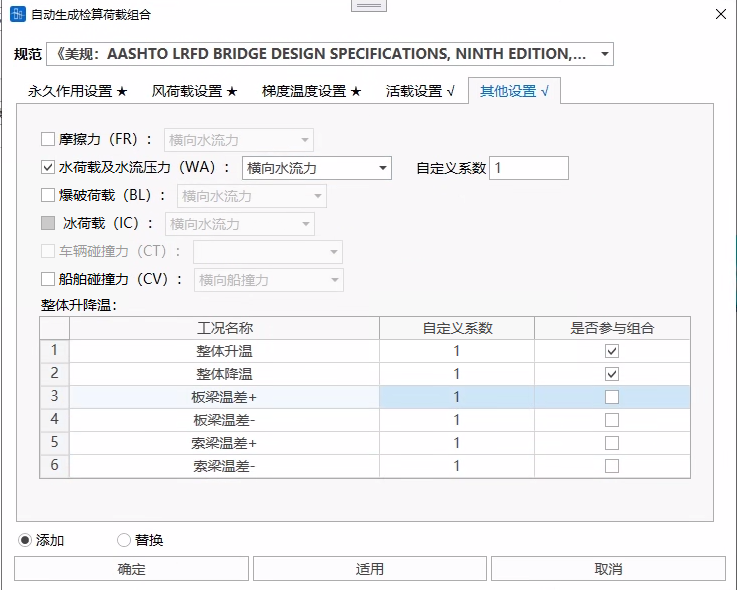
  - **活载设置**

    若移动荷载参与检算，可选择在移动荷载分析工况中定义的工况参与组合，勾选该项的“是否参与组合”，并填写自定义系数。

    
  - **添加/替换**

    添加：在原本的检算荷载组合后添加自动生成的检算荷载组合。

    替换：自动生成的检算荷载组合替换原有的检算荷载组合。

#### 24.1.5.2计算项目

#### 正截面承载力

- 计算组合类型：强度组合、极端事件组合
- 分析设置：
  - 分析设置>正截面承载力设置。需设置计算方式。

    
  - 计算方式可选：
    - 同比例变化：$\frac{F_{X D}}{F_{X}}=\frac{M_{Y_{D}}}{M_{Y}}=\frac{M_{Z_{D}}}{M_{\underline{Z}}}=K$
    - 轴力不变：${F_{X D}}={F_{X}}$，$\frac{M_{Y_{D}}}{M_{Y}}=\frac{M_{Z_{D}}}{M_{Z}}=K$
    - MY不变：${M_{Y D}}={M_{Y}}$，$\frac{F_{X_{D}}}{F_{X}}=\frac{M_{Z_{D}}}{M_{Z}}=K$
    - MZ不变：${M_{Z D}}={M_{Z}}$，$\frac{F_{X_{D}}}{F_{X}}=\frac{M_{Y_{D}}}{M_{Y}}=K$
    - 轴力与MY不变：${F_{X D}}={F_{X}}$，${M_{Y D}}={M_{Y}}$，$\frac{M_{Z_{D}}}{M_{Z}}=K$
    - 轴力与MZ不变：${F_{X D}}={F_{X}}$，${M_{Z D}}={M_{Z}}$，$\frac{M_{Y_{D}}}{M_{Y}}=K$
    - MY与MZ不变：${M_{Y D}}={M_{Y}}$，${M_{Z D}}={M_{Z}}$，$\frac{F_{X_{D}}}{F_{X}}=K$
    式中，${F_{X}},{M_{Y}},{M_{Z}}$为荷载，${F_{XD}},{M_{YD}},{M_{ZD}}$为承载力，$K$为安全系数。
- 计算说明
  - **计算假设**
    - 1）平截面假定；
    - 2）钢筋与预应力筋采用第一节的应力应变曲线、极限压应变和极限拉应变，最大应力取屈服强度。
    - 3）混凝土采用第一节的应力应变曲线和极限压应变，最大压应力取等效矩形混凝土抗压强度（$α*f_{c'}$），忽略混凝土的抗拉强度。

      | 混凝土等级      | 抗压强度 $f'\_c$ (ksi) | 强度折减系数α |
      | ---------- | -------------------- | ------- |
      | Grade2500  | 2.5                  | 0.85    |
      | Grade3000  | 3.0                  | 0.85    |
      | Grade3500  | 3.5                  | 0.85    |
      | Grade4000  | 4.0                  | 0.85    |
      | Grade4500  | 4.5                  | 0.85    |
      | Grade5000  | 5.0                  | 0.85    |
      | Grade6000  | 6.0                  | 0.85    |
      | Grade7000  | 7.0                  | 0.85    |
      | Grade8000  | 8.0                  | 0.85    |
      | Grade9000  | 9.0                  | 0.85    |
      | Grade10000 | 10.0                 | 0.85    |
      | Grade11000 | 11.0                 | 0.83    |
      | Grade12000 | 12.0                 | 0.81    |
      | Grade13000 | 13.0                 | 0.79    |
      | Grade14000 | 14.0                 | 0.77    |
      | Grade15000 | 15.0                 | 0.75    |

  - **计算内容**

    考虑抗力系数的承载力设计值应按下式确定： &#x20;
    $M_r = \phi M_n$
    式中： &#x20;

    $M_n$：公称承载力（名义承载力） &#x20;

    $\phi$：抗力系数
  - **抗力系数**

    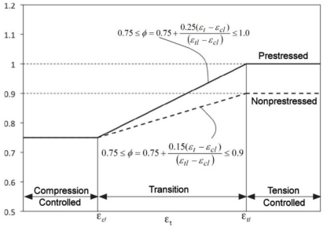

    $ε_t$：钢筋的拉应变

    $ε_{cl}$：钢筋或钢束极限压应变

    $ε_{tl}$：钢筋或钢束极限拉应变
  - **最小配筋率是否满足要求**
    - 功能：避免少筋破坏（混凝土压应变较小时，钢筋过早受拉破坏）。
      除非另有规定，非受压控制受弯构件任一截面的预应力和非预应力受拉钢筋，应保证满足： &#x20;
    $M_r \geq \min(1.33 M_{design},\, M_cr)$

    $M_{design}$：计算组合的设计力矩；

    $M_cr$：开裂弯矩，
    $M_cr = \gamma_3\left[\left(\gamma_1 f_r + \gamma_2 f_cpe\right) S_c - M_dnc\left(\frac{S_c}{S_nc} - 1\right)\right] \quad (5.6.3.3-1)$

    | 符号         | 定义                    | 单位     |
    | ---------- | --------------------- | ------ |
    | $f_r$      | 混凝土断裂模量               | ksi    |
    | $f_cpe$    | 极端受拉纤维处仅由有效预应力产生的压应力  | ksi    |
    | $S_c$      | 组合截面极端受拉纤维截面模量        | in³    |
    | $M_dnc$    | 作用在整体/非组合截面上的总未分解恒载力矩 | kip-in |
    | $S_nc$     | 整体/非组合截面极端受拉纤维截面模量    | in³    |

    > 📌 **截面处理规则：**
    > 1. 中间组合截面需匹配 $M_{dnc}$ 和 $S_{nc}$ 取值
    > 2. 梁按整体截面设计时：$S_{nc}$ 替代 $S_c$ 计算 &

    ***
    变异系数：

    | 系数             | 定义                                | 取值条件           | 取值       |
    | -------------- | --------------------------------- | -------------- | -------- |
    | $\gamma\_1$  | 弯曲开裂变异系数                          | 预制节段结构 其他混凝土结构 | 1.2 1.6  |
    | $\gamma\_2$  | 预应力变异系数                           | 有粘结钢筋束 无粘结钢筋束  | 1.1 1.0  |
    | $\gamma\_3$  | 钢筋屈服/极限强度比                        |                | **见下表** |
    | $\gamma_3$ 取值： |                                   |                |          |
    | 取值             | 钢筋规范及等级                           |                |          |
    | -----          | --------------------------------- |                |          |
    | 0.67           | AASHTO M 31 / ASTM A615 (60级)     |                |          |
    | 0.75           | AASHTO M 31 / ASTM A615 (75级)     |                |          |
    | 0.76           | AASHTO M 31 / ASTM A615 (80级)     |                |          |
    | 0.67           | AASHTO M 334 / ASTM A1035 (100级)  |                |          |
    | 1.0            | 预应力筋                              |                |          |

  - 长细效应的近似估计

    暂未考虑
  - **轴压承载力**

    规范只规定了两个主轴对称的截面适用于以下公式，软件考虑所有截面都适用于以下公式。
    $$
    P_r = \phi P_n \quad
    $$
    $P_r$：乘系数的轴心抗压承载力（kip） &#x20;

    $\phi$：抗力系数 &#x20;

    $P_n$：名义轴心抗压承载力（kip）

    | 箍筋类型                    | 计算公式                                                                                                                                             |
    | ----------------------- | ------------------------------------------------------------------------------------------------------------------------------------------------ |
    | **螺旋箍筋**               | $P_n = 0.85 \left[ \begin{matrix} k_c f'c (A_g - A{st} - A_{ps}) \ + f_y A_{st} \ - A _{ps}(f_{pe} - E_p \varepsilon_{cu}) \end{matrix} \right]$ |
    | **普通箍筋**               | $P_n = 0.80 \left[ \begin{matrix} k_c f'c (A_g - A{st} - A_{ps}) \ + f_y A_{st} \ - A _{ps}(f_{pe} - E_p \varepsilon_{cu}) \end{matrix} \right]$ |
    | $k_c$ ：混凝土极限压应力与设计强度比值， |                                                                                                                                                  |

    $$
    k_c = \begin{cases}  
    0.85 & \text{若 } f'_c \leq 10 \text{ ksi} \\  
    {0.85 - 0.02(f'_c - 10)} & \text{若 } 10 < f'_c < 15 \text{ ksi} \\  
    0.75 & \text{若 } f'_c \geq 15 \text{ ksi}  
    \end{cases}
    $$

    | 符号                  | 物理意义      | 单位      |
    | ------------------- | --------- | ------- |
    | $f'\_c$           | 混凝土设计抗压强度 | ksi     |
    | $A\_g$            | 截面总面积     | in.²    |
    | $A _{st}$           | 普通钢筋总面积   | in.²    |
    | $A _{ps}$           | 预应力钢筋面积   | in.²    |
    | $f\_y$            | 钢筋屈服强度    | ksi     |
    | $f _{pe}$           | 预应力钢筋有效应力 | ksi     |
    | $E\_p$            | 预应力钢筋弹性模量 | ksi     |
    | $\varepsilon _{cu}$ | 混凝土极限压应变  | in./in. |

#### 斜截面抗剪承载力

- 计算组合类型：强度组合、极端事件组合。
- 目前软件只计算了Z方向的抗剪。**不考虑**弯起纵向钢筋和竖向预应力筋的抗剪作用。
- 分析设置：
  - 分析设置>斜截面抗剪承载力设置。

    
  - 可设置考虑几倍截面高度的钢筋。默认为1。

    用户可以输入参数，控制计算有效高度h0和纵向钢筋配筋率的钢筋范围。例如输入0.2，表示受拉边缘起始的0.2倍截面高度范围内的受拉钢筋，用于计算有效高度h0和纵向钢筋配筋率。
- 计算说明
  - 标称抗剪强度Vn计算

    标称抗剪强度 $V_n$ 取以下两式计算的**较小值**：
    $$
    V_n = \min \left\{ \begin{array}{c} V_c + V_s + V_p \\ 0.25 f'_c b_v d_v + V_p \end{array} \right.
    $$
    *(**规范**公式 5.7.3.3-1 和 5.7.3.3-2)* &#x20;
    - $V_c$**：** 混凝土抗剪分量
      $$
      V_c = 0.0316\beta\lambda\sqrt{f'_c} b_v d_v \quad (\text{规范}5.7.3.3-3)
      $$
    - $V_s$**：** 钢筋抗剪分量
      $$
      V_s = \frac{A_v f_y d_v (\cot\theta + \cot\alpha) \sin\alpha}{s} \lambda_{\text{duct}} \quad (\text{规范}5.7.3.3-4)
      $$
      - $\lambda_{\text{duct}}$**：** 抗剪强度折减系数，该系数考虑了由于存在灌浆后张管道而导致的横向钢筋提供的抗剪强度的降低。对于未布线的后张拉管道，取1.0，并减小腹板或法兰宽度，以考虑未布线管道的存在。
        $$
        \lambda_{\text{duct}} = 1 - \delta \left( \frac{\Phi_{\text{duct}}}{b_w} \right)^2 \quad (\text{规范}5.7.3.3-5)
        $$
        **程序中用户在分析设置中自行输入。**
    - $V_p$**：** 预应力分量，$V_p$ = 预应力在剪切力方向的分量（抵抗外力时取正值）
    - 关键参数定义表 &#x20;

      | 符号                    | 定义        | 单位  | 关键说明              |
      | --------------------- | --------- | --- | ----------------- |
      | $b\_v$              | 有效腹板宽度    | in  | 取$d\_v$范围内最小腹宽  |
      | $d\_v$              | 有效剪切深度    | in  | 按规范5.7.2.8条确定     |
      | $\beta$             | 斜裂缝应力传递系数 | - | 按规范5.7.3.4条规定     |
      | $\lambda$           | 混凝土密度修正系数 | - | 按规范5.4.2.8条规定     |
      | $A\_v$              | 箍筋面积      | in² | 间距$s$范围内        |
      | $\theta$            | 斜压应力倾角    | °   | 按规范5.7.3.4条确定     |
      | $\alpha$            | 箍筋纵轴倾角    | °   | **软件默认取90°** |
      | $s$                 | 箍筋纵向间距    | in  | 平行纵筋方向量测          |
      | $\delta$            | 管道直径修正系数  | - | 灌浆管道取2.0          |
      | $\Phi _{\text{duct}}$ | 后张拉管道直径   | in  | $d\_v$深度内存在     |
      | $b\_w$              | 腹板总宽度     | in  | 不因管道减小            |
      | $f'\_c$             | 混凝土抗压强度   | ksi |                   |

      - $d_v$ ：有效剪切深度，满足： &#x20;
        $$
        d_v \geq \max \left( \begin{array}{c} 0.9d_e \\ 0.72h \end{array} \right)
        $$
        其中：

        $d_e$：受拉钢筋和预应力筋合力点到受压边缘的距离： &#x20;
        $$
        d_e = \frac{A_{ps} f_{ps} d_p + A_s f_y d_s}{A_{ps} f_{ps} + A_s f_y}
        $$
        $h$：截面总高度

        $d_p$：预应力筋受拉轴心到受压边缘的距离

        $d_s$：钢筋受拉轴心到受压边缘的距离

        $A_{ps}$：受拉区预应力筋面积

        $A_s$：受拉区普通钢筋面积

        $f_{ps}$：受拉区预应力平均应力

        $f_y$：受拉区钢筋屈服应力 &#x20;
  - 抗剪参数β和θ

    程序默认按照满足横向钢筋大于第5.7.2.5条规定的最小横向钢筋量时，确定的β值方程式：
    $$
      \beta = \frac{4.8}{(1+750ε_s)} \quad (\text{规范}5.7.3.4.2-1)
    $$
    θ的值可通过以下方程式确定：
    $$
      θ = 29 + 3500ε_s \quad (\text{规范}5.7.3.4.2-3)
    $$
    - $ε_s$：受拉钢筋质心处截面的净纵向拉伸应变，且$ε_s\geq0$

#### 正应力

- 计算组合类型：使用组合、永久作用组合、疲劳组合、施工荷载
- 分析设置：
  - 分析设置>正应力设置。

    
- 计算说明
  - 计算假设
    1. 不开裂预应力混凝土构件：考虑混凝土受拉区抗力
    2. 平截面假定
    3. 采用换算截面计算，换算截面的模量比$n$计算如下：

       普通钢筋：$n_s = \dfrac{E_s}{E_c}$

       预应力钢筋：$n_p = \dfrac{E_p}{E_c}$
    4. 钢筋混凝土构件：不考虑受拉区抗力
  - 正常使用极限状态应力计算
    - 正常使用极限状态应力限值

      | 构件类型            | 状态类型    | 混凝土压应力限值                 | 混凝土拉应力限值       | 钢束拉应力限值        |
      | --------------- | ------- | ------------------------ | -------------- | -------------- |
      | **不允许开裂预应力构件** | 施工阶段    | $0.65 f'_{ci}$           | **分析设置中自行设置** | $0.90 f_{ptk}$ |
      |                 | 成桥      | $0.45 f'_{ck}$           | -            | -            |
      |                 | 使用组合I   | $0.60\phi_w f'_{ck}$     | -            | $0.80 f_{ptk}$ |
      |                 | 使用组合III | -                      | **分析设置中自行设置** | $0.80f _{ptk}$ |
      |                 | 其他使用组合  | -                      | -            | $0.80f _{ptk}$ |
      | **允许开裂预应力构件**  | 施工阶段    | $0.65 f'_{ci}$           | -            | $0.90 f_{ptk}$ |
      |                 | 成桥      | $0.45 f'_{ck}$           | -            | -            |
      |                 | 使用组合I   | $0.60\phi_w f'_{ck}$     | -            | $0.80 f_{ptk}$ |
      |                 | 使用组合III | -                      | -            | $0.80f _{ptk}$ |
      |                 | 其他使用组合  | -                      | -            | $0.80f _{ptk}$ |
      | **钢筋混凝土构件**    | 施工阶段    | $0.65 f'_{ci}$           | -            | -            |
      |                 | 成桥      | $0.45 f'_{ck}$           | -            | -            |
      |                 | 使用组合I   | $0.60\phi_w f'_{ck}$     | -            | -            |
      |                 | 使用组合III | -                      | -            | -            |

      - 软件默认取$f'_{ci}=0.7*f'_{c}$
      - 混凝土压应力限值（施工阶段）为$0.65f'_{ci}$。
      - 混凝土压应力限值（成桥、使用组合Ⅰ）：

        | 位置                      | 应力限值                     |
        | ----------------------- | ------------------------ |
        | 有效预应力和永久荷载共同引起          | $0.45 f'_{ck}$           |
        | 有效预应力+永久荷载+临时荷载+运输/吊装引起 | $0.60\phi_w f'_{ck}$     |

        - 腹板宽厚比修正系数$\phi_w$：
          $$
          \phi_w =
          \begin{cases}
          1.0 & \lambda_w \leq 15 \\
          1 - 0.025(\lambda_w - 15) & 15 < \lambda_w \leq 25 \\
          0.75 & 25 < \lambda_w \leq 35
          \end{cases}
          $$
          $\lambda_w$：腹板或翼缘宽厚比，**分析设置中自行设置**
    - 钢束应力限值

      | 工况        | 光面高强度钢筋        | 低松弛高强度钢绞线      | 变形高强度钢筋        |
      | --------- | -------------- | -------------- | -------------- |
      | 施工阶段      | $0.90f _{ptk}$ | $0.90f _{ptk}$ | $0.90f _{ptk}$ |
      | 损失后使用极限状态 | $0.80f _{ptk}$ | $0.80f _{ptk}$ | $0.80f _{ptk}$ |

  - 疲劳极限状态应力计算
    - 仅考虑疲劳组合Ⅰ，未考虑疲劳组合Ⅱ相关的计算。
    - 计算钢筋混凝土构件应力幅时，考虑混凝土受拉退出工作，荷载采用永久作用组合+疲劳组合。
    - 计算预应力混凝土构件应力幅时，按线弹性计算，荷载采用0.5×(未折减有效预应力+永久作用组合)+疲劳组合。
      对疲劳的考虑，混凝土构件应符合： &#x20;
    $$
    \gamma(\Delta f) \leq (\Delta F)_{TH} \quad
    $$

    | 符号                 | 物理意义               | 单位  | 规范依据                 |
    | ------------------ | ------------------ | --- | -------------------- |
    | $\gamma$         | 疲劳组合Ⅰ系数（荷载组合中已经考虑） | - | 表3.4.1-1             |
    | $\Delta f$       | 由于疲劳荷载引起的活载应力幅     | ksi | 第3.6.1.4条            |
    | $(\Delta F) _{TH}$ | 应力幅限值              | ksi | 第5.5.3.2\\\~5.5.3.4条 |

    - 由疲劳I荷载组合活载与永久荷载作用下全截面受压，可以不考虑疲劳。
    - 对于按照Service III（使用组合Ⅲ）极限状态设计，且混凝土最外层纤维拉应力不超过规范表5.9.2.3.2b-1规定拉应力限值的预应力构件，其钢筋无需进行疲劳验算。
    - 若结构构件中同时配置预应力钢束和普通钢筋，且允许混凝土拉应力超过规范表5.9.2.3.2b-1规定的Service III（使用组合Ⅲ）限值时，则必须对该构件进行疲劳验算。
    - 钢筋应力幅限值

      | 钢筋类型                     | 计算公式                                                  |
      | ------------------------ | ----------------------------------------------------- |
      | 对于直钢筋以及在高应力区域无交叉焊缝的焊接钢丝网 | $ (\Delta F) _{TH} = 26 - \frac{22 f_{\min}}{f _{y}}$ |
      | 对于在高应力区域带有交叉焊缝的直焊接钢丝网    | $ (\Delta F) _{TH} = 18 - 0.36 f_{\min}$              |

      - 钢筋类型：**用户在分析设置中设置**。
      - $f_{\min}$：由疲劳组合I引起的最小活载应力（拉为正，压为负） &#x20;
      - $f_y$：钢筋的指定最小屈服强度，不得低于60.0 ksi，且不得大于100 ksi。
    - 预应力筋应力幅限值&#x20;

      **用户在分析设置中自行设置**“预应力筋允许应力幅”。

      | 曲率半径（英尺）                  | $(\Delta F) _{TH}$             |
      | ------------------------- | ------------------------------ |
      | $r$ < 12.0              | 10.0 ksi                       |
      | $12.0 \leq r \leq 30.0$ | $10.0 + \dfrac{8(r-12)}{18}$ |
      | $r$ > 30.0              | 18.0 ksi                       |

    - 其他&#x20;
      - 对于除节段施工桥梁外的预应力构件，由疲劳组合I产生的压应力与未折减有效预应力和永久荷载之和的一半叠加后，在预应力损失后不得超过混凝土抗压强度的0.40倍（$0.40 f'_c$）。
        （$\sigma_c = \sigma_{c,\text{fatigue}} + 0.5(\sigma_{c,\text{pe}} + \sigma_{c,\text{DL}}) \leq 0.40 f'_c$）
        其中：$\sigma_{c,\text{fatigue}}$ 为疲劳组合I产生的压应力，$\sigma_{c,\text{pe}}$ 为未折减有效预应力产生的压应力，$\sigma_{c,\text{DL}}$ 为永久荷载产生的压应力。
      - 预应力构件在疲劳组合I的活载与永久荷载所产生的混凝土拉应力超过$0.095\sqrt{f'_c}$，按开裂截面计算。

#### 剪应力与主应力

- 仅构件类型是全预应力构件、A类构件、B类构件
- 计算组合类型：使用组合Ⅲ
- 计算说明
  - 混凝土主拉应力限值： &#x20;
    $$
    \sigma_{t} \leq 0.110 \sqrt{f'_c}
    $$
  - 软件只计算预应力混凝土构件的主拉应力，且只考虑轴力 ($F_x$)、竖向剪力 ($F_z$)、弯矩 ($M_y$, $M_z$)  ，不考虑横向剪力 ($F_y$)、扭矩 ($M_x$)  。
  - 剪应力计算 &#x20;
    - 截面特性选用规则： &#x20;

      | 荷载类型    | 截面特性   |
      | ------- | ------ |
      | 预应力一次效应 | 毛截面特性  |
      | 其他荷载效应  | 等效截面特性 |

    - 腹板中心轴剪应力公式： &#x20;
      $$
      \tau = \frac{VQ_g}{I_g b_w}
      $$

      | 符号       | 物理意义          |
      | -------- | ------------- |
      | $\tau$ | 腹板中心剪应力       |
      | $V$    | 使用组合III下的剪力   |
      | $Q\_g$ | 关于中和轴面积一次矩    |
      | $I\_g$ | 截面关于形心轴的惯性矩   |
      | $b\_w$ | 主拉应力检查点处腹板的宽度 |

  - 法向正应力计算
    - 截面特性选用规则： &#x20;

      | 荷载类型    | 截面特性   |
      | ------- | ------ |
      | 预应力一次效应 | 毛截面特性  |
      | 其他荷载效应  | 等效截面特性 |

  - 竖向正应力计算 &#x20;

    规范参考依据： &#x20;

    中国《公路钢筋混凝土及预应力混凝土桥涵设计规范》(JTG 3362-2018) 公式6.3.3-4

#### 裂缝宽度

- 通过控制钢筋间距实现裂缝宽度的控制，实际计算结果为钢筋间距的允许最大值，同时控制钢筋应力小于规范允许值。
- 本软件只是根据实现裂缝宽度的控制计算要求计算钢筋间距的允许最大值，没有考虑构造要求。
- 仅构件类型是钢混构件、B类构件
- 计算组合类型：使用组合
- 分析设置：
  - 分析设置>裂缝宽度设置。

    
- 计算说明

  在使用极限状态荷载组合下，正截面应力超过0.8倍断裂模量（正截面应力 > $0.8f_r$)  的所有混凝土构件，最靠近受拉面的层中非预应力钢筋的间距s应满足以下要求：
  $$
  s \leq \frac{700\gamma_e}{\beta_s f_{ss}} - 2d_c
  $$

  | 符号            | 名称      | 备注                                              | 单位  |
  | ------------- | ------- | ----------------------------------------------- | --- |
  | $\gamma\_e$ | 暴露系数    | **用户在分析设置中设置**  1.00（1级暴露条件）   0.75（2级暴露条件） | - |
  | $\beta\_s$  | 应变比系数   | 混凝土最大拉应变与受拉区钢筋质心处的应变之比                          | - |
  | $f _{ss}$     | 普通钢筋拉应力 | $\leq 0.60f\_y$                               | ksi |
  | $d\_c$      | 有效保护层厚度 | 混凝土受拉边缘到最近的钢筋中心的距离                              | in  |

## 24.2英规

### 24.2.1材料

- 规范：BS 5400-4:1990

### 24.2.2收缩徐变

- 规范：BS 5400-4:1990

### 24.2.3钢筋松弛

- 规范：BS 5400-4:1990

### 24.2.4 活载

#### 24.2.4.1车俩荷载

标准公路荷载由HA荷载和HB荷载组成。两种荷载中均已考虑了冲击荷载作用效应的富裕度，无须再设置冲击系数。

- HA荷载

  均布荷载值与加载长度有关

- HB荷载

  第二个轴与第三个轴之间距离可变，活载计算取最不利加载距离计算。

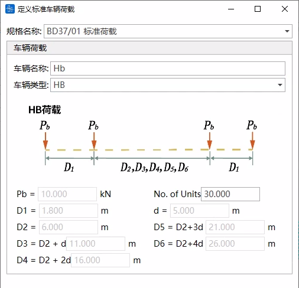

- HA类和HB类组合作用（HA\&HB）

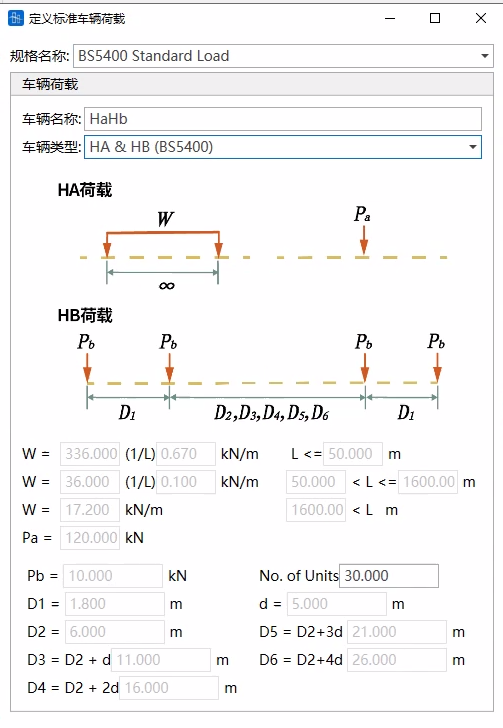

- 💡注意事项
  1. HA\&HB车辆荷载加载分为两种情况，取其最不利：
  - HB荷载作用在一个车道上
    
  - HB荷载分布在两个车道上 指定HB行驶的两车道
    活载工况中需要定义HB行驶的两车道，如果未定义，则不计算HB荷载分布在两车道的情况
  

  

  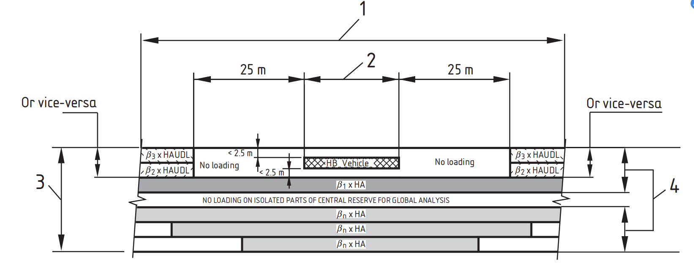
- 人群荷载

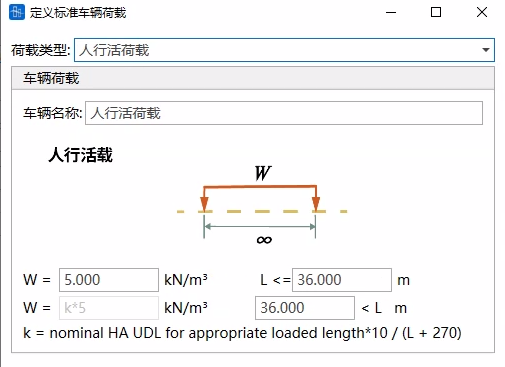

#### 24.2.4.2 多车道折减系数

- HA车辆荷载、HA与HB组合作用荷载，多车道折减系数根据规范自动计算，如下表

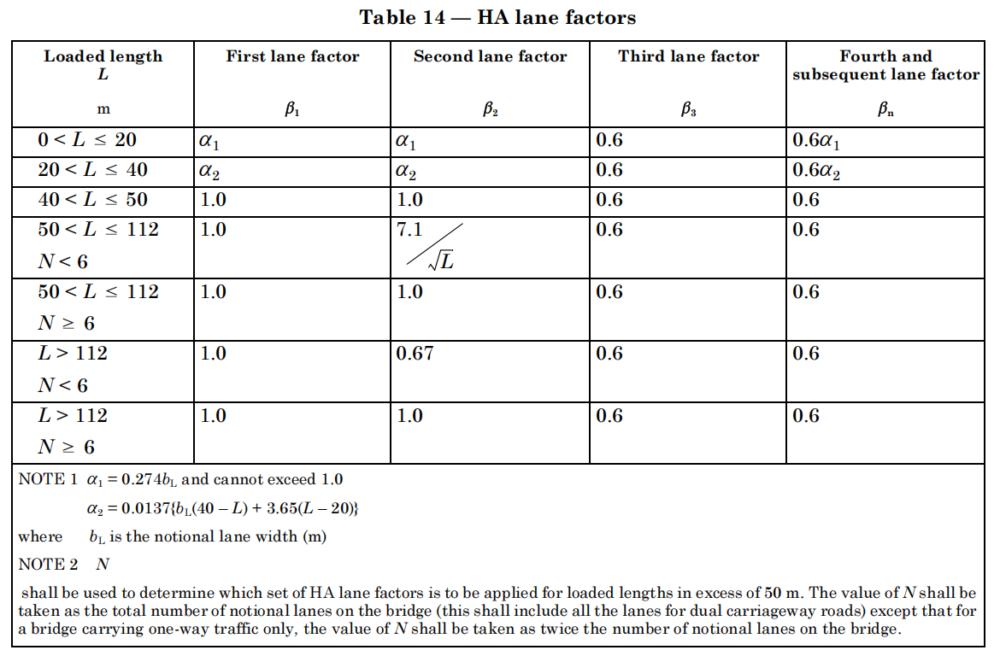

- 如果车道只加载HB车辆荷载，则车道不进行多车道折减，但是可以设置实际加载车辆数量

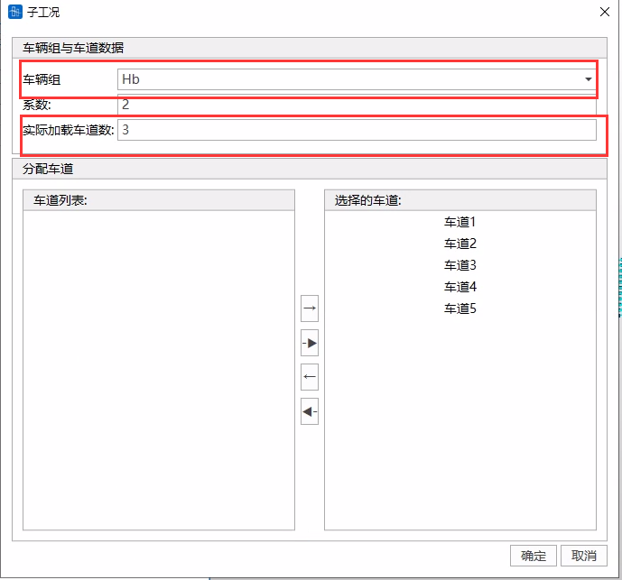

### 24.2.5 混凝土检算

#### 24.2.5.1检算荷载组合

#### 检算荷载组合

- 规范：BS 5400-2:2006
- 类型分为：承载能力极限状态、正常使用极限状态

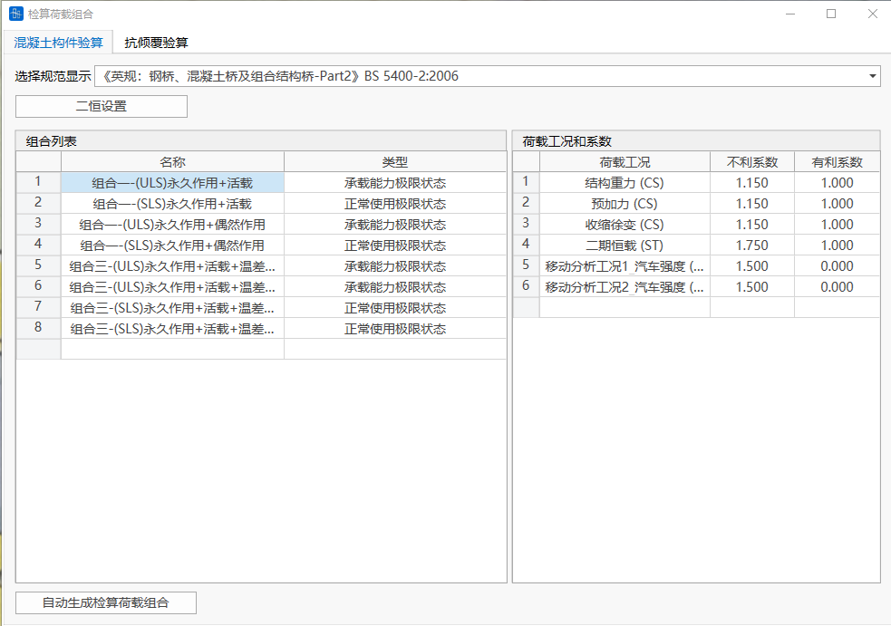

- **二恒设置**

  
  - **“二恒”是否已在施工阶段中计算**

    若二恒荷载工况（工况类型为恒载）也在施工阶段中参与计算，CQ成桥（恒载）结果实际包括了一恒和用户定义的二恒，那么需要将CQ成桥（恒载）结果减去运营阶段的二恒荷载工况（工况类型为恒载）计算结果，从而得到一恒的计算结果，所以二恒设置中需要选择是否二恒荷载工况（工况类型为恒载）已经在施工阶段中计算。

#### 自动生成检算荷载组合

- 功能：辅助用户生成检算荷载组合。
- 命令：“检算荷载组合”窗口左下角的按钮。

- 输入
  - **二恒设置**

    
    - **“二恒”是否已在施工阶段中计算**

      若二恒荷载工况（工况类型为恒载）也在施工阶段中参与计算，CQ成桥（恒载）结果实际包括了一恒和用户定义的二恒，那么需要将CQ成桥（恒载）结果减去运营阶段的二恒荷载工况（工况类型为恒载）计算结果，从而得到一恒的计算结果，所以二恒设置中需要选择是否二恒荷载工况（工况类型为恒载）已经在施工阶段中计算。
  - **梯度温度设置**

    由于不同方向的梯度温度不能组合在一起，梯度温度需单独设置梯度温度工况1和梯度温度工况2（梯度温度工况1和梯度温度工况2会分开组合）。选择在9.1 荷载工况中定义类型为 梯度温度 的荷载工况参与组合。
  - **整体升降温设置**

    荷载工况类型是“体系温度荷载”的荷载工况若作为整体升降温参与检算，需勾选该项的“是否参与组合”，并填写自定义系数。

    
  - **活载设置**

    若移动荷载参与检算，可选择在移动荷载分析工况中定义的工况参与组合，勾选该项的“是否参与组合”，并填写自定义系数。

    
  - **二次活载设置**

    根据在基础信息选择的桥型不同，需要设置不同的二次活载设置内容。

    
  - **添加/替换**

    添加：在原本的检算荷载组合后添加自动生成的检算荷载组合。

    替换：自动生成的检算荷载组合替换原有的检算荷载组合。

#### 24.2.5.2材料本构

- 规范：BS 5400-4:1990
- 本规范采用的是极限状态法，分承载力能力极限状态和正常使用极限状态。两种状态下的材料本构参数 $\gamma_m$ 取值见下表：
  1. 正常使用极限状态

     | 材料  | 钢筋混凝土结构 | 预应力混凝土结构 |
     | --- | ------- | -------- |
     | 混凝土 | 1.00    | 1.25     |
     | 钢筋  | 1.00    | 1.00     |
     | 钢束  | 1.00    | 1.00     |

  2. 承载能力极限状态

     | 材料  | 钢筋混凝土结构 | 预应力混凝土结构 |
     | --- | ------- | -------- |
     | 混凝土 | 1.50    | 1.50     |
     | 钢筋  | 1.15    | 1.15     |
     | 钢束  | 1.15    | 1.15     |

#### 24.2.5.3计算项目

- 规范：BS 5400-4:1990

#### 正截面承载力

- 计算组合类型：承载能力极限状态荷载组合。
- 分析设置：
  - 分析设置>正截面承载力设置。需设置计算方式。

    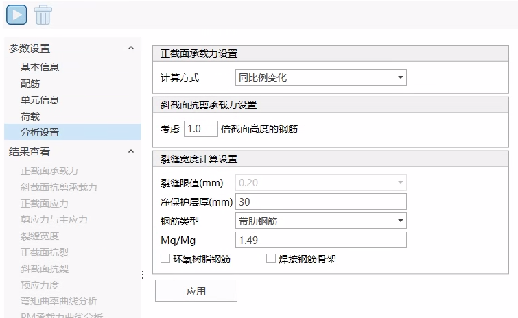
  - 计算方式可选：
    - 同比例变化：$\frac{F_{X D}}{F_{X}}=\frac{M_{Y_{D}}}{M_{Y}}=\frac{M_{Z_{D}}}{M_{\underline{Z}}}=K$
    - 轴力不变：${F_{X D}}={F_{X}}$，$\frac{M_{Y_{D}}}{M_{Y}}=\frac{M_{Z_{D}}}{M_{Z}}=K$
    - MY不变：${M_{Y D}}={M_{Y}}$，$\frac{F_{X_{D}}}{F_{X}}=\frac{M_{Z_{D}}}{M_{Z}}=K$
    - MZ不变：${M_{Z D}}={M_{Z}}$，$\frac{F_{X_{D}}}{F_{X}}=\frac{M_{Y_{D}}}{M_{Y}}=K$
    - 轴力与MY不变：${F_{X D}}={F_{X}}$，${M_{Y D}}={M_{Y}}$，$\frac{M_{Z_{D}}}{M_{Z}}=K$
    - 轴力与MZ不变：${F_{X D}}={F_{X}}$，${M_{Z D}}={M_{Z}}$，$\frac{M_{Y_{D}}}{M_{Y}}=K$
    - MY与MZ不变：${M_{Y D}}={M_{Y}}$，${M_{Z D}}={M_{Z}}$，$\frac{F_{X_{D}}}{F_{X}}=K$
    式中，${F_{X}},{M_{Y}},{M_{Z}}$为荷载，${F_{XD}},{M_{YD}},{M_{ZD}}$为承载力，$K$为安全系数。
- 计算说明
  - 钢筋混凝土构件
    - **梁**
      - 计算假设
        - 1）平截面假定；
        - 2）混凝土极限压应变取0.0035；
        - 3）忽略混凝土抗拉贡献 ；
        - 4）超筋破坏控制条件 &#x20;

          当钢筋抗力 $R < 1.15R_d$ 时需满足： &#x20;
          $$
          \varepsilon_{s,\max} \geq 0.002 + \frac{f_y}{E_s\gamma_m}
          $$
          式中参数： &#x20;

          | 符号                    | 物理意义            |
          | ----------------------- | ------------------- |
          | $R$                     | 截面实际抗力        |
          | $R_d$                   | 设计抗力值          |
          | $\varepsilon _{s,\max}$ | 受拉钢筋最大拉应变  |
          | $f\_y$                  | 钢筋屈服强度        |
          | $E\_s$                | 弹性模量            |
          | $\gamma\_m$           | 材料本构参数\&#x20; |

    - **柱**
      - 定义 &#x20;
        - 受压构件 &#x20;
        - 最大横向尺寸 ≤ 4×最小横向尺寸 &#x20;
        - 在每个屈曲平面中，比值$l_e/h$不应超过40，除非柱的一端没有受到约束，但比值$l_e/h$不应超过30。
        - 如果每个屈曲平面中的比值$l_e/h$比小于12，则应将柱视为短柱，否则视为长柱。
        > $l_e$：所考虑的屈曲平面内的有效高度（计算高度）
        > $h$：所考虑的屈曲平面内横截面的宽度
      - 计算假设
        - 1）平截面假定；
        - 2）混凝土极限压应变取0.0035；
        - 3）忽略混凝土抗拉贡献 ；
      - 偏心距增大计算方法
        - 短柱计算规则 ($l_e/h < 12$) &#x20;
          - a) 单轴弯曲增大偏心距 &#x20;
            $$
            e_{\text{\text(增大)}} = \min\left(0.05h,\, 0.02\right) \, \text{m}
            $$
          - b) 双轴弯曲增大偏心距 &#x20;
            $$
            e_{\text{增大}} = \min\left(0.03h,\, 0.02\right) \, \text{m}
            $$
        - 长柱计算规则 ($l_e/h \geq 12$) &#x20;
          - c) 单轴绕长轴y弯曲增大弯矩 &#x20;
            $$
            M_{\mathrm{ty}} = M_{\mathrm{iy}} + \dfrac{N h_{\mathrm{x}}}{1750}\left(\dfrac{l_{\mathrm{e}}}{h_{\mathrm{x}}}\right)^{2}\left(1 - \dfrac{0.0035 l_{\mathrm{e}}}{h_{\mathrm{x}}}\right)
            $$
            关键约束条件： &#x20;
            1. $M_{\mathrm{ty}}$ 不得小于短柱单轴计算出的弯矩 &#x20;
            2. $h_{x}$：$M_{iy}$作用平面内横截面的宽度 &#x20;
            3. $l_{e}$：取截面两个方向计算长度最大值 &#x20;
          - d) 当$ h_{y} < 3 h_{x}$，单轴绕短轴x弯曲增大弯矩 &#x20;
            $$
            M_{\mathrm{tx}} = M_{\mathrm{ix}} + \dfrac{N h_{\mathrm{y}}}{1750}\left(\dfrac{l_{\mathrm{e}}}{h_{\mathrm{x}}}\right)^{2}\left(1 - \dfrac{0.0035 l_{\mathrm{e}}}{h_{\mathrm{x}}}\right)
            $$
            关键约束条件： &#x20;
            1. &#x20;$M_{\mathrm{tx}}$ 不得小于短柱单轴计算出的弯矩 &#x20;
          - e) 双轴弯曲增大弯矩 &#x20;
            $$
            M_{\mathrm{tx}} = M_{\mathrm{ix}} + \dfrac{N h_{\mathrm{y}}}{1750}\left(\dfrac{l_{\mathrm{ex}}}{h_{\mathrm{y}}}\right)^{2}\left(1 - \dfrac{0.0035 l_{\mathrm{ex}}}{h_{\mathrm{y}}}\right)
            $$

            $$
            M_{\mathrm{ty}}= M_{\mathrm{iy}} + \dfrac{N h_{\mathrm{x}}}{1750}\left(\dfrac{l_{\mathrm{ey}}}{h_{\mathrm{x}}}\right)^{2}\left(1 - \dfrac{0.0035 l_{\mathrm{ey}}}{h_{\mathrm{x}}}\right)
            $$
        - 参数定义表 &#x20;

          | 符号        | 物理意义        | 单位   |
          | --------- | ----------- | ---- |
          | $l\_e$  | 计算长度（有效高度）  | m    |
          | $h$     | 截面高度（弯矩方向）  | m    |
          | $h\_x$  | x方向截面尺寸（宽度） | m    |
          | $h\_y$  | y方向截面尺寸（高度） | m    |
          | $N$     | 轴向压力设计值     | kN   |
          | $M _{iy}$ | y轴初始弯矩      | kN·m |
          | $M _{ix}$ | x轴初始弯矩      | kN·m |

  - 预应力混凝土构件
    - 计算假设
      - 1）平截面假定；
      - 2）混凝土极限压应变取0.0035；
      - 3）忽略混凝土抗拉贡献 ；
      - 4）超筋破坏控制条件：

        当钢束抗力 $R < 1.15R_d$ 时需满足： &#x20;
        $$
        \varepsilon_{s,\max} \geq 0.005 + \frac{f_{pu}}{E_s\gamma_m}
        $$
        式中参数： &#x20;

        | 符号                      | 物理意义          |
        | ----------------------- | ------------- |
        | $R$                   | 截面实际抗力        |
        | $R\_d$                | 设计抗力值         |
        | $\varepsilon _{s,\max}$ | 钢束最大应变        |
        | $f _{pu}$               | 预应力筋极限抗拉强度    |
        | $E\_s$                | 弹性模量          |
        | $\gamma\_m$           | 材料本构参数\&#x20; |

#### 斜截面抗剪承载力

- 计算组合类型：承载能力极限状态荷载组合。
- 目前软件只计算了Z方向的抗剪。
- 分析设置：
  - 分析设置>斜截面抗剪承载力设置。

    
  - 可设置考虑几倍截面高度的钢筋。默认为1。

    用户可以输入参数，控制计算有效高度h0和纵向钢筋配筋率的钢筋范围。例如输入0.2，表示受拉边缘起始的0.2倍截面高度范围内的受拉钢筋，用于计算有效高度h0和纵向钢筋配筋率。
- 计算说明
  - 钢筋混凝土构件
    - 受弯构件 &#x20;

      斜截面抗剪承载力： &#x20;
      $$
      V_{cr} = \left( \frac{0.87 f_{yv} A_{sv}}{b s_{v}} + \xi_s v_c - 0.4 \right) \cdot b d
      $$
      承载力上限： &#x20;
      $$
      V_{\text{crmax}} = \min(0.75 \sqrt{f_{cu}},\, 4.75) \cdot b d \quad (\text{单位：N})
      $$
      公式量纲统一为 N-mm制，式中参数：&#x20;

      | 符号              | 物理意义                 | 备注                                                                                                                                                                           |
      | --------------- | -------------------- | ---------------------------------------------------------------------------------------------------------------------------------------------------------------------------- |
      | $\xi\_s$      | 深度系数                 | $\xi\_s = \left( \frac{500}{d} \right)^{1/4}$，且  $0.7 \leq \xi\_s \leq 1.5$                                                                                              |
      | $v\_c$\&#x20; | 混凝土极限剪应力             | $v_c = \dfrac{0.27}{\gamma_m}\left( \dfrac{100 A_s}{b d} f_{cu} \right)^{1/3}$  且：1. $\dfrac{100 A_s}{bd} \in [0.15, 3] $ ；2. $f_{cu} \leq 40 \text{MPa}$；3. $γ _{m} =1.25$。 |
      | $A _{sv}$       | 箍筋所有肢的面积             | -                                                                                                                                                                          |
      | $s\_v$        | 箍筋间距                 | -                                                                                                                                                                          |
      | $f _{sv}$       | 箍筋特征强度               | $f _{yv} \leq 460 \text{MPa}$                                                                                                                                                |
      | $b$           | 腹板厚度                 | -                                                                                                                                                                          |
      | $d$           | 计算深度（受拉钢筋合力点→受压边缘距离） | *计算钢筋合力点本软件不考虑弯起钢筋（规范没有明确这点）*                                                                                                                                               |

    - 轴向受力构件 &#x20;
      - 斜截面抗剪承载力： &#x20;
        $$
        V_{cr} = \left( \frac{0.87 f_{yv} A_{sv}}{b s_{v}} + \left(1 - \frac{0.05N}{A_c}\right) \xi_s v_c - 0.4 \right) \cdot b d
        $$

        | 新增参数     | 物理意义     | 备注                                           |
        | -------- | -------- | -------------------------------------------- |
        | $N$    | 轴向载荷设计值  | 压为负，规范只考虑了轴压对斜截面抗剪承载力的提高，没有考虑轴拉对斜截面抗剪承载力的减小。 |
        | $A\_c$ | 混凝土全截面面积 | -                                          |

      - 双轴剪切验算条件： &#x20;
        $$
        \frac{V_x}{V_{ux}} + \frac{V_y}{V_{uy}} \leq 1.0
        $$
        > ⚠️ **软件实现说明：**
        > 当前版本仅支持Z方向剪力计算（$V_z$），此公式暂未启用
    - 受拉区内最小纵向钢筋面积

      在构件受拉区任一横截面处，除满足粘结需求的基本配筋外，必须配置附加纵向受拉钢筋，其最小面积应满足：
      $$
      A_{sa} \geq \frac{V}{2(0.87 f_y)}
      $$
  - 预应力混凝土构件
    - 设计准则

      预应力混凝土构件的斜截面抗剪承载力取以下两者中的**较大值**：
      1. 钢筋混凝土构件计算结果（纵向受拉钢筋$A_{s}$不包含预应力钢束）；
      2. 按下述方法计算结果。
    - 计算路径选择

      若极限荷载引起的弯矩 $M \leq M_cr$，按弯曲未开裂状态计算承载力，否则按弯曲开裂状态计算承载力。
    - 弯曲未开裂状态计算

      核心公式：  未弯曲开裂截面的极限抗剪强度$V_{co}$：
      $$
      V_{co} = 0.67bh\sqrt{f_t^2 + f_{cp}f_t}
      $$
      参数定义： &#x20;

      | 符号        | 物理意义           | 计算规则                 | 单位    |
      | --------- | -------------- | -------------------- | ----- |
      | $b$     | 构件宽度           | T/I/L形梁取肋宽$b\_w$   | mm    |
      | $h$     | 构件总高度          | -                  | mm    |
      | $f\_t$  | 混凝土抗拉强度        | $0.24\sqrt{f _{cu}}$ | N/mm² |
      | $f _{cp}$ | 预应力在形心轴上产生的压应力 | 取正值                  | N/mm² |

      - **倾斜钢束处理：** &#x20;

        当截面存在倾斜钢筋束时，垂直于构件纵轴的预应力分量（乘以适当的$γ_{fl}$值）应代数添加到Vco中： &#x20;
        $$
        V_{co} \leftarrow V_{co} + γ_{fl}P_v
        $$
        $γ_{fl}$：预应力的部分安全系数，$γ_{fl}=0.87$

        &#x20;$P_v$：钢束竖向分量（垂直纵轴方向） &#x20;
    - 4.1.3.2.2 弯曲开裂状态计算
      - 不考虑倾斜钢束的竖向预应力分量 &#x20;
      - 1）全预应力和A类构件 &#x20;
        $$
        V_{cr} = 0.037bd\sqrt{f_{cu}} + \frac{M_{cr}}{M}V
        $$
        开裂弯矩Mcr公式： &#x20;
        $$
        M_{cr} = \frac{(0.37\sqrt{f_{cu}} + f_{pt})I}{y} \geq 0
        $$

        | 关键参数      | 定义                 | 注意                                |
        | --------- | ------------------ | --------------------------------- |
        | $d$     | 受压边缘到钢筋束质心的距离      | *计算钢筋束质心不考虑弯起钢筋和钢束（规范没有明确这点）*  |
        | $f _{pt}$ | 最大拉应变点y处由于预应力引起的应力 | 乘以$γ _{fl}=0.87$                  |
        | $I$     | 截面惯性矩              | -                               |
        | $M _{cr}$ | 开裂弯矩               | 取正值                               |
        | $V$     | 由极限荷载引起的截面处的剪力     | 取正值                               |
        | $M$     | 由极限荷载引起的截面处的弯矩     | 取正值                               |

      - 2）B类构件 &#x20;
        $$
        V_{cr} = \left(1 - 0.55\frac{f_{pa}}{f_{pu}}\right)v_c bd + M_o\frac{V}{M}
        $$
        - $M_o$：深度d处混凝土中产生零应力所需的弯矩，
          $$
          M_o = f_{pt} \dfrac{I}{y}
          $$
          参数说明： &#x20;

          | 符号        | 物理意义               | 计算规则             |
          | --------- | ------------------ | ---------------- |
          | $f _{pt}$ | 最大拉应变点y处由于预应力引起的应力 | 乘以$γ _{fl}=0.87$ |
          | $I$     | 截面惯性矩              | -              |
          | $y$     | 最大拉应变点位置           | -              |

        - 预应力相关参数
        - $v_c$：混凝土极限剪应力，
          $$
          v_c = \dfrac{0.27}{\gamma_m} \left( \dfrac{100 A_s}{b d} f_{cu} \right)^{1/3}
          $$
          且$ 0.15 \leq \dfrac{100 A_s}{b d} \leq 3$、$ f_{cu} \leq 40 \text{MPa}$、$\gamma_m = 1.25$。

          As：包含钢筋和钢束。
          $$
          A_s = A_{su} + A_p
          $$
          d：从压缩面到受拉钢筋（包含钢束）合力点的距离，*计算*钢筋束合力点*不考虑弯起钢筋和钢束（规范没有明确这点）。*
        - 当构件同时包含普通钢筋和钢束时： &#x20;
          $$
          \dfrac{f_{pe}}{f_{pu}} = \dfrac{P_t}{A_p f_{pu} + A_{su} f_y}
          $$
          参数定义表： &#x20;

          | 符号        | 物理意义       | 单位  |
          | --------- | ---------- | --- |
          | $P\_t$  | 损耗后的有效预应力度 | N   |
          | $A\_p$  | 钢束截面积      | mm² |
          | $A _{su}$ | 非预应力钢筋面积   | mm² |
          | $f _{pu}$ | 钢束特征强度     | MPa |
          | $f\_y$  | 钢筋特征强度     | MPa |

      - 箍筋斜截面抗剪承载力
        $$
        V_{sv} = \left( \frac{0.87f_{yv}A_{sv}}{bs_v} - 0.4 \right) bd
        $$

        | 参数        | 定义        | 约束       |
        | --------- | --------- | -------- |
        | $A _{sv}$ | 箍筋所有肢的总面积 | -      |
        | $s\_v$  | 箍筋间距      | -      |
        | $f _{yv}$ | 箍筋特征强度    | ≤460 MPa |

        > ⚠️ **软件处理说明：**
        > 当前版本不考虑竖向预应力筋的抗剪贡献（规范没有明确）
      - 受拉区最小纵向钢筋面积

        采用钢箍时，受拉区内纵向钢筋的截面面积应：
        $$
        A_s \geq \frac{V}{2(0.87f_y)}
        $$
        参数定义： &#x20;

        | 符号       | 物理意义         | 规范要求          |
        | -------- | ------------ | ------------- |
        | $A\_s$ | 有效锚固纵向受拉钢筋面积 | 含预应力筋（不含解粘结筋） |
        | $f\_y$ | 钢筋特征强度       | ≤460 N/mm²    |

      - 斜截面抗剪承载力限值

        | 限值类型 | 计算公式                                                   |
        | ---- | ------------------------------------------------------ |
        | 下限值  | $V _{cr,\min} = 0.1\sqrt{f_{cu}} \cdot bd $            |
        | 上限值  | $V _{cr,\max} = \min(0.75\sqrt{f_{cu}}, 5.8) \cdot bd$ |

#### 正应力

- 计算组合类型：正常使用极限状态荷载组合、施工荷载
- 计算说明
  - 计算假设
    - 1）平截面假定；
    - 2）混凝土极限压应变取0.0035；
    - 3）忽略混凝土抗拉贡献 ；
  - 正常使用极限状态的应力限值

    | 材料       | 受力类型 | 结构类型   | 应力限值             |
    | -------- | ---- | ------ | ---------------- |
    | **混凝土** | 受弯   | 钢筋混凝土  | $0.50f _{cu}$    |
    |          |      | 预应力混凝土 | $0.40f _{cu}$    |
    |          | 受压   | 钢筋混凝土  | $0.38f _{cu}$    |
    |          |      | 预应力混凝土 | $0.30f _{cu}$    |
    | **钢筋**  | 压/拉  | 钢筋混凝土  | $0.75f\_y$     |
    |          |      | 预应力混凝土 | 不适用              |
    | **钢束**  | 拉    | 钢筋混凝土  | 不适用              |
    |          |      | 预应力混凝土 | 锚固后：$0.7f _{pu}$ |

#### 裂缝宽度

- 仅构件类型是钢混构件、B类构件
- 计算组合类型：正常使用极限状态荷载组合
- 分析设置：
  - 分析设置>裂缝宽度设置。

    
    - 荷载比$M_q/M_g$处理规则

      | 输入条件                               | 处理方式                 |
      | ---------------------------------- | -------------------- |
      | 若用户设置$M\_q/M\_g > 0$             | 直接采用输入值              |
      | 若用户设置$M\_q/M\_g = 0$ 且 输入活/恒载内力  | 软件自动计算 $M\_q/M\_g$ |
      | 若用户设置$M\_q/M\_g = 0$ 且 未输入活/恒载内力 | $M\_q/M\_g = 1.0$  |

- 计算说明
  - 计算假设
    - 1）平截面假定；
    - 2）混凝土极限压应变取0.0035；
    - 3）忽略混凝土抗拉贡献 ；
  - 对于实心矩形截面、T型梁和其它实心截面形且不带凹角的梁腹的裂缝宽度计算
    - 计算公式： &#x20;
      $$
      \text{设计裂缝宽度} = \dfrac{3 a_{\mathrm{cr}} \varepsilon_{\mathrm{m}}}{1+2\left(a_{\mathrm{cr}}-c_{\mathrm{nom}}\right)/\left(h-d_{\mathrm{c}}\right)}
      $$
      $\varepsilon_{\mathrm{m}}$：考虑开裂水平的计算应变，考虑了受拉区混凝土的硬化效应；负值表示该截面未开裂： &#x20;
      $$
      \varepsilon_{\mathrm{m}} = \varepsilon_{1} - \left[\dfrac{3.8 b_{\mathrm{t}} h\left(a^{\prime}-d_{\mathrm{c}}\right)}{\varepsilon_{\mathrm{s}} A_{\mathrm{s}}\left(h-d_{\mathrm{c}}\right)}\right] \left(1 - \dfrac{M_{\mathrm{q}}}{M_{\mathrm{g}}}\right) 10^{-9}
      $$
      其他参数定义：

      | 符号            | 物理意义                  | 备注                                                                                      |
      | ------------- | --------------------- | --------------------------------------------------------------------------------------- |
      | $a_cr$        | 开裂点（最大拉应变点）到最近钢筋表面的距离 | -                                                                                     |
      | $c_nom$       | 最外层钢筋净保护层厚度           | **用户在分析设置中设置“净保护层厚”**                                                                  |
      | $d_c$         | 受压混凝土高度               | $d_c=0$ 时使用下方全截面受拉时的裂缝宽度计算公式计算                                                        |
      | $h$           | 截面总高度                 | -                                                                                     |
      | $\varepsilon_m$ | 考虑开裂水平的计算应变           | $0 \leq \varepsilon_m \leq \varepsilon_1$                                           |
      | $\varepsilon_1$ | 开裂点计算应变               | -                                                                                     |
      | $b_t$         | 受拉钢筋质心水平处的截面宽度        | -                                                                                     |
      | $a'$          | 受压面到裂纹宽度点的距离          | 受拉区高度（最大拉应力点到中心轴的距离）+受压区高度（最大压应力点到中心轴的距离）                                       |
      | $M_g$         | 永久荷载引起的弯矩             | 恒载效应                                                                                    |
      | $M_q$         | 活载引起的弯矩               | 活载效应，荷载比 $M_q/M_g$ 由**用户在分析设置中设置，** 处理规则见荷载比 $M_q/M_g$ 处理规则                         |
      | $\varepsilon_s$ | 受拉钢筋计算应变              | -                                                                                     |
      | $A_s$         | 受拉钢筋有效面积              | 如果设计力矩的轴线和抵抗该力矩的受拉钢筋的方向彼此不垂直（例如在斜交板中）时：$A_s=\Sigma\left(A_t \cos^4 \alpha_1\right)$ |

  - b) 全截面受拉裂缝宽度计算
    - 计算公式： &#x20;
      $$
      \text{设计裂缝宽度} = 3 a_{\mathrm{cr}} \varepsilon_{\mathrm{m}}
      $$
      参数定义同上。
  - 对不适用规范要求的截面，如关于竖向不对称截面或双向弯曲受力截面，不适用以上的规范公式，软件采用上述公式计算，可能存在误差，计算结果仅供参考。

> *文档规范依据：*
>
> *AASHTO LRFD桥梁设计规范（第9版）*
>
> *BRITISH STANDARD：Steel, concrete and composite bridges — Part 2: Specification for loads（BS5400-2：2006）*
>
> *BRITISH STANDARD：Steel, concrete and composite bridges — Part 4: Code of practice for design of concrete bridges（BS5400-4：1990）*
