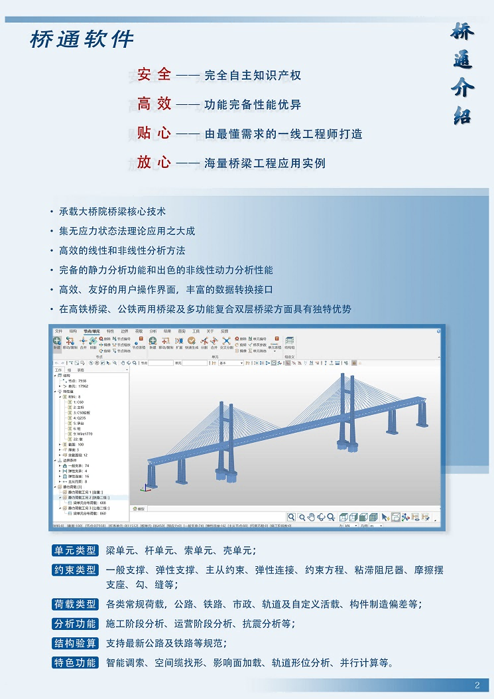

QiaoTong is a general-purpose finite element analysis software for bridges, independently developed by **China Railway Major Bridge Reconnaissance & Design Institute Co., Ltd.** (hereinafter referred to as "BRDI"). The software inherits BRDI's core technologies, offering comprehensive features and excellent performance. It is suitable for force analysis throughout the entire lifecycle of any bridge type, from design and construction to operation and maintenance. QiaoTong supports highway, railway, and municipal standards, and is widely used in design, construction, and research organizations. The name "QiaoTong" summarizes the software's capabilities and also carries forward the spirit of the Wuhan Yangtze River Bridge: **"A bridge flies across the north and south, turning a natural moat into a thoroughfare"**.

Developed for the Windows environment, QiaoTong integrates an interactive modeling interface, 3D graphics engine, dynamic bidirectional 2D graphics engine, efficient database access technology, excellent solver performance, and powerful post-processing modules. The software is crafted by experienced engineers to meet real-world needs. Its user interface seamlessly connects with commercial software, requiring no change in user habits and enabling zero-cost onboarding. Data formats are mutually recognized and convertible with commercial software. The finite element calculation kernel of QiaoTong has been validated by decades of use and hundreds of bridges, ensuring accurate and reliable results.

