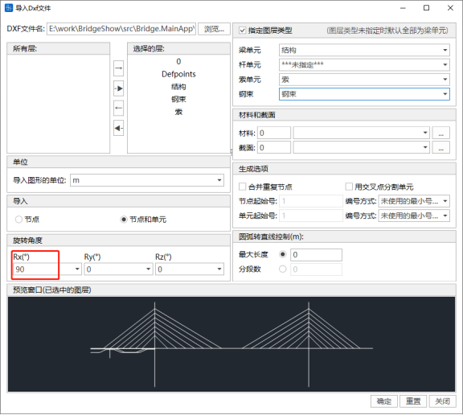

## 3.1  Project Operations

### 3.1.1 New Project

- Command: Main menu bar > File > New
- Icon menu:

  
- Shortcut: Ctrl+N

After clicking New Project, the software automatically creates model data.

### 3.1.2 Open Project

- Command: Main menu bar > File > Open
- Icon menu:

  
- Shortcut: Ctrl+O

After selecting Open Project, a file open dialog box appears. Select the required \*.bfmd project file and click Open to open the corresponding project.

### 3.1.3 Open Project Directory

- Command: Main menu bar > File > Open Project Directory
- Shortcut: Ctrl+P

Select the \*.bfmd project file to open the corresponding project.

### 3.1.4 Save/Save As

- Command: Main menu bar > File > Save/Save As
- Icon menu:

  

  
- Shortcut: Ctrl+S

Save the current project to the database. The first save requires entering the project name and file path. Saving an existing project will directly replace it with the current project. If you click Save As, you need to re-enter the project name and path to save it as a new database.

### 3.1.5 Close Project

- Command: Main menu bar > File > Close
- Icon menu:

  

Close the current project. If the project data has been modified, a dialog box will appear before closing asking whether to save the modifications. If you select Yes, the data will be automatically saved. If you select No, the data will not be saved.

### 3.1.6 Save Current Stage As

- Command: Main menu bar > File > Save Current Stage As
- Icon menu:

  

You can save the model in the current construction stage separately. This is generally used for separate analysis of a specific construction stage.

### 3.1.7 Recently Opened Models

- Command: Main menu bar > File > Recently Opened Models
- Icon menu:

  

The recently opened models list will display the file names of the 3 most recently used project files. Select the \*.bfmd file to open the corresponding project.

### 3.1.8 Exit

- Command: Main menu bar > File > Exit
- Icon menu:

  

Directly exit the application and close all processes.

## 3.2  Project Operations

### 3.2.1 Import Midas Data

- Command: Main menu bar > File > Import > MIDAS(.mct)

Select the Midas(.mct) model file and double-click to import the model. Only supports versions 9.1.0 and 9.3.0.

- See the error prompt for details on unsupported import content

### 3.2.2 Import Dxf Graphics

- Command: Main menu bar > File > Import > Dxf File(.dxf).

An import Dxf file dialog box appears. Select the DXF file, select the graphics layer, select data to import such as nodes, elements, materials, sections, etc., rotation angle, etc. You can view the imported graphics in the preview window. Click the OK button to import the graphics.

If you need to convert the Y-axis in dxf to the spatial Z-axis, enter 90° for the Rx rotation angle.

### 3.2.3 Export Midas Data

- Command: Main menu bar > File > Export > MIDAS(.mct)

Enter the file name to export as a Midas model file. This file can be opened in Midas software.

- See the error prompt for details on unsupported export content

### 3.2.4 Export 3DBridge Data

- Command: Main menu bar > File > Export > 3DBridge(.3db) File

Enter the file name to export as a 3DBridge(.3db) file. This file can be opened in the 3DBridge software independently developed by BRDI.

### 3.2.5 Merge Models

- Command: Main menu bar > File > Merge Models (*.bfmd)

Merge the current model data file with other model data files. Click Browse to select the model to be merged, and the corresponding model will be merged into the current model.

Merge model information includes nodes, elements, materials, sections, and thickness. When merging models, you can select the model starting point and model rotation direction Rx, Ry, Rz. In the generation options, you can set merge duplicate nodes and cross segmentation options, and provides numbering methods for nodes and elements.

## 3.3  Project Information

Click Project Information to display the overall control settings window. In the calculation information bar, enter the project name, design unit, calculation personnel, and reviewer information. In the basic data bar, set the gravitational acceleration and design temperature. Fill in the detailed project description to complete the project information settings.

## 3.4  File Management

Users should save the project as soon as possible after creating a new project. After saving, a model database file \*.bfmd is generated. After the model calculation is successful, a result folder named after the project will be generated, which contains various result files and intermediate data files.

| Module     | File Name              | File Type   | Description             |
| ------ | ---------------- | ------ | -------------- |
| Static Analysis Module | \*.bfmd          | Model File   | Contains finite element model information established by users |
|        | \*.bfmd.bak      | Model Backup File | Automatically generated by the software after performing save operations |
|        | Project Named Folder/ \*.srd  | Result File   | Construction stage result file       |
|        | Project Named Folder/ \*.erd  | Result File   | Construction envelope result file       |
|        | Project Named Folder/ \*.ard  | Result File   | Additional load analysis result file     |
|        | Project Named Folder/ \*.scrd | Result File   | Bearing settlement analysis result file     |
|        | Project Named Folder/ \*.mrd  | Result File   | Moving load analysis result file     |
