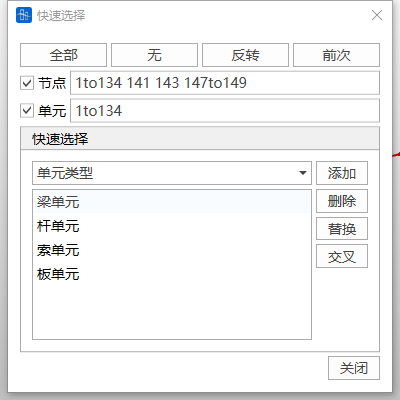
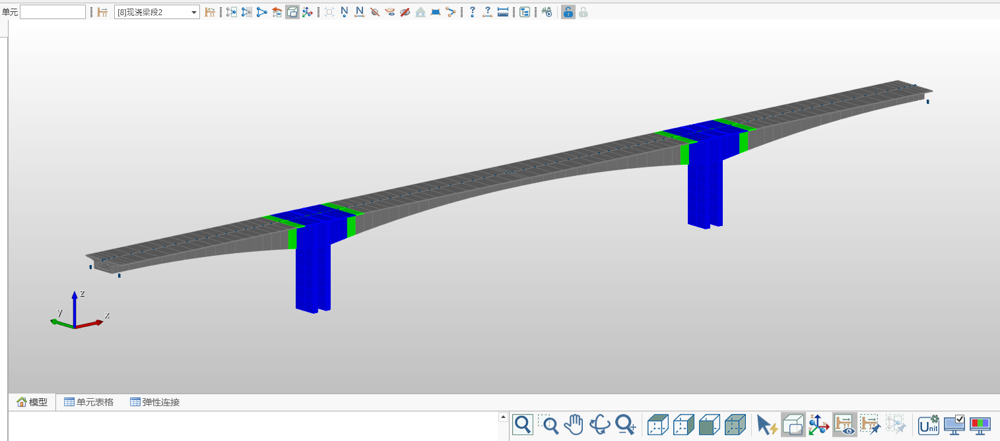
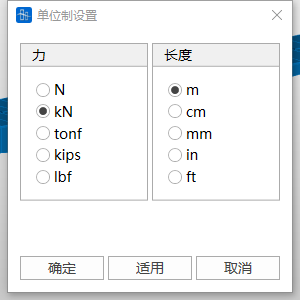
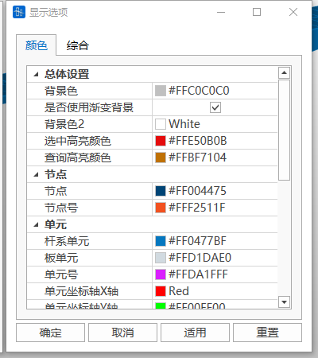
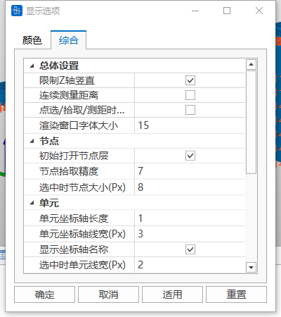

## 4.1 Selection

### 4.1.1 Single Selection

In the model window, move the mouse cursor near the target node or element and click the left button to select nodes or elements one by one. Clicking on already selected nodes or elements again will cancel the selection.

### 4.1.2 Box Selection

In the model window, press and hold the left mouse button and drag to form a selection box. Nodes or elements within the box will be selected.

### 4.1.3 Window Deselection

In the model window, drag to form a selection box to cancel the selection of already selected nodes or elements within the box.

### 4.1.4 Select All

Select all nodes and elements in the model.

### 4.1.5 Deselect All

Clear all selected nodes and elements.

### 4.1.6 Restore Previous Selection

Restore the most recent selection set state.

## 4.2 Activation/Deactivation

Through activation or deactivation functions, you can display only specified parts of the model in the model window, improving the focus of model operations.

### 4.2.1 Activate

Select target nodes or elements. After clicking the "Activate" button, only the selected parts will be displayed.

### 4.2.2 Deactivate

Select target nodes or elements. After clicking the "Deactivate" button, the selected parts will be hidden.

### 4.2.3 Activate All

Restore display of all deactivated nodes and elements in the model.

### 4.2.4 Previous Activation

Return to the state of the most recent activation/deactivation operation.

## 4.3 Hidden Line Removal

Hide the element lines of the model structure and display element thickness and section shapes for clearer observation of the actual geometric effects of the model.

## 4.4 Element Coordinate System

Display the local coordinate system of each element, using X, Y, Z to indicate the direction of each coordinate axis.

## 4.5 View Reduced Element Shape

Only available in hidden line removal mode. Used to observe the shape of reduced elements for clearer viewing of the spatial relationship between nodes and elements.

## 4.6 Display ID

### 4.6.1 Display Node ID

Display the number of each node in the model window.

### 4.6.2 Display Element ID

Display the number of each element in the model window.

## 4.7 Hide Nodes

Hide the display of nodes in the model window to make model observation more intuitive and focused on other elements.

## 4.8 Display All Tendons

Display all defined tendon shapes in the model window for overall inspection of tendon arrangement.

## 4.9 Hide Tendon Names

Hide the tendon names displayed in the model window to simplify the model view.

## 4.10 Display All **Boundaries**

Display all boundary conditions defined in the model in the model window.

## 4.11 **Activate All Plate Elements**

Activate all plate elements in the model and make them visible.

## 4.12 **Activate All Line Elements**

Activate all line elements in the model and make them visible.

## 4.13 Query

### 4.13.1 Query Node

After clicking "Query Node", select any node in the model. The information window will display the node number and its coordinate values on the X, Y, and Z axes.

### 4.13.2 Query Element

After clicking "Query Element", select any element in the model. The information window will display detailed information about the element, including I and J end node numbers, section number, etc., and supports element section preview.

### 4.13.3 Query Distance

Click two nodes in sequence in the model window. The information window will display the straight-line distance between the two nodes and the relative distances along the X, Y, and Z directions.

## 4.14 Tree Menu

### 4.14.1 Work

List a series of workflows from modeling to analysis and design. Right-click on each step to select corresponding functional operations.

### 4.14.2 Groups

Display information about structure groups, load groups, boundary groups, and tendon groups set in the model for easy viewing and management.

### 4.14.3 Tables

List multiple table information related to the structure, such as node tables, element tables, and property value tables for quick query and editing.

### 4.14.4 Tree Menu 2

A second tree menu can be expanded on the right side of the screen to display additional functions or information.

## 4.15 Analysis

### 4.15.1 Run Analysis

Start calculation to perform model analysis operations.

### 4.15.2 Pre-processing

Switch to the pre-processing environment for model creation, parameter setting, load application, and other operations.

### 4.15.3 Post-processing

Switch to the post-processing environment for viewing analysis results, such as stress distribution and displacement conditions, performing structure checking, generating calculation reports, and supporting data visualization functions.

## 4.16 Window Display

### 4.16.1 Auto Zoom

Automatically adjust the currently activated model to a scale suitable for the window size to ensure the model is displayed completely.

### 4.16.2 Window Zoom

Click in the window to form a rectangular area and zoom in on that area to view details.

### 4.16.3 Dynamic Pan

Move the model in the direction of the drag by dragging the mouse.

### 4.16.4 Dynamic Rotate

Rotate the model by dragging the mouse, making it dynamically rotate in the direction of the drag to adjust the viewing angle.

### 4.16.5 Dynamic Zoom

Zoom by dragging the mouse up and down. Dragging up zooms in, dragging down zooms out.

### 4.16.6 Top View

Switch to the view looking down at the model from the +Z direction.

### 4.16.7 Right View

Switch to the view observing the model from the +X direction.

### 4.16.8 Front View

Switch to the view observing the model from the -Y direction.

### 4.16.9 Spatial View

Switch to the isometric view of the model, providing a three-dimensional stereoscopic observation effect.

## 4.17 Quick Select

Quickly select nodes or elements in the model based on conditions such as element type, material properties, section characteristics, or thickness to improve selection efficiency.

## 4.18 Display All Construction Stages

Select a construction stage. After clicking "Display All Construction Stages", the model window will display the model for all construction stages (gray: parts not yet activated, green: parts activated in the current construction stage, blue: parts that have completed activation).

## 4.19 Construction Stage Zoom Fixed

After enabling this function, the model display scale remains unchanged when switching construction stages. If this function is not enabled, when switching construction loads, the model will automatically adjust the display scale according to the currently activated structure of the construction stage to fill the current activated structure in the working window.

## 4.20 Unit System Settings

Change the software's display unit system, such as length, force, or other physical quantity units to meet different needs.

## 4.21 Display

### 4.21.1 Display Settings

Provide overall settings for interface display.

Display by Group: You can pre-define structure groups (such as load groups, boundary groups). After checking, only the results of the selected groups will be displayed, including element numbers, loads, or analysis results, etc.

### 4.21.2 Display Options

Adjust interface display parameters. For example, interface color scheme, node picking precision, element coordinate axis display settings, etc.

## 4.22 Information Window

Display operation information during modeling and analysis, including operation logs, warning prompts, and error messages for tracking and checking model status.

## 4.23 Status Bar

Display overall status information of the model, such as total number of nodes, number of elements, etc. In addition, the status bar provides functions such as whether to display loads when switching stages, whether to display boundaries, quick switching of unit systems, etc., to improve operation efficiency.

