## 5.1 **Project Information**

See Section 3.3 Project Information

## 5.2 **Check Structure**

### 5.2.1 **Display Duplicate Elements**

- Function: Display duplicate elements in the model.
- Command: Select "Structure" > "Display Duplicate Elements" from the main menu.

### 5.2.2 **Delete Duplicate Elements**

- Function: Delete duplicate elements in the model.
- Command: Select "Structure" > "Delete Duplicate Elements" from the main menu.

## 5.3 **Suspension Bridge Assistant**

### 5.3.1 **Spatial Cable Shape Finding**

See `18. Spatial Cable Shape Finding`

## 5.4 **Modeling Assistant** **Transverse Analysis**

- Function: By selecting elements with parameterized concrete box girder sections, quickly divide the element section into a transverse finite element model.
- Command: Select "Structure" > "Transverse Analysis Modeling Assistant" from the main menu;

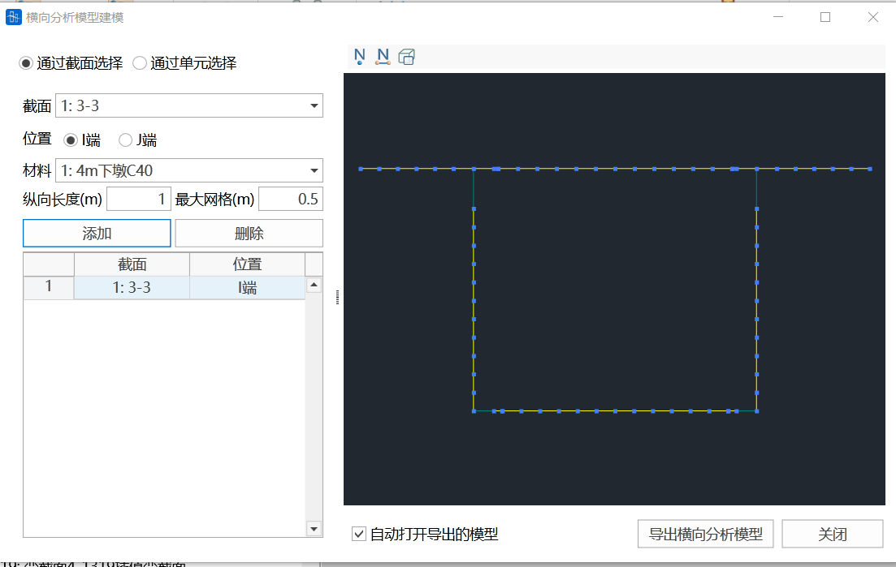

- Input
  - **By Section Selection**

    The software will list all parameterized concrete box girder sections in the section library in the dropdown box, and display the box girder section contour in the right window. Select the I-end or J-end of the element section, select the element material, and click Add. The software will automatically generate the finite element model corresponding to the concrete box girder section and display it in the right window. Node numbers, element numbers, and rendered images can be displayed.

    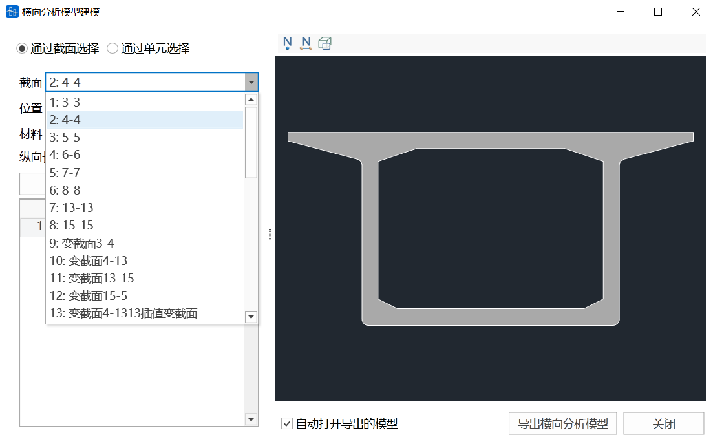

  - **By Element Selection**

    You can manually input an element number, select the I-end or J-end of the element section, and the element material, and click Add. The software will automatically generate the finite element model corresponding to the element position section and display it in the right window. Node numbers, element numbers, and rendered images can be displayed. You can also use the

    

    button to select an element in the QiaoTong main interface, and the software will automatically add the finite element model. The added elements will be listed in the lower left table.
  - **Position**

    When "By Section Selection", for variable sections, you can choose whether to generate the finite element model of the variable section I-end or J-end. When "By Element Selection", you can choose to generate the finite element model of the I-end or J-end section of the element.
  - **Material**

    When "By Section Selection", you need to select the material type of the section finite element model in the "Material" dropdown box. When "By Element Selection", the element's material is the material type of the section finite element model, and no further selection is needed.
  - **Longitudinal Length**

    This value is used to determine the longitudinal length of the generated transverse finite element model. The default value is 1m. Users can adjust it as needed.
  - **Maximum Mesh**

    This value is used to determine the element length of the generated transverse finite element model. The default value is 0.5m. Users can adjust it as needed.
  - **Export Transverse Analysis Model**

    This function is used to export the sections corresponding to the currently selected element positions in the table as a QiaoTong finite element model. Users need to select a save directory. When the "Auto-open exported model" option is selected, the software will automatically open the QiaoTong finite element model after saving the data.

    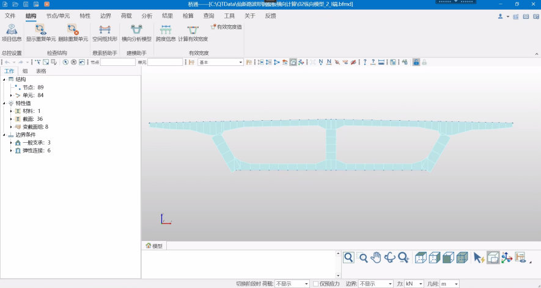

## 5.5 Modeling Assistant Cantilever Casting Method Continuous Beam/Rigid Frame

### 5.5.1 Function

  Parameterized generation of **cantilever casting method** **variable section continuous beam bridge** and **variable section continuous rigid frame bridge** finite element models. Includes complete model information such as nodes, elements, sections, tendons, loads, settlement, construction stages, etc.

### 5.5.2 Command

Select "Structure" > "Modeling Assistant" > "Cantilever/Rigid Frame" from the main menu to open the modeling assistant.

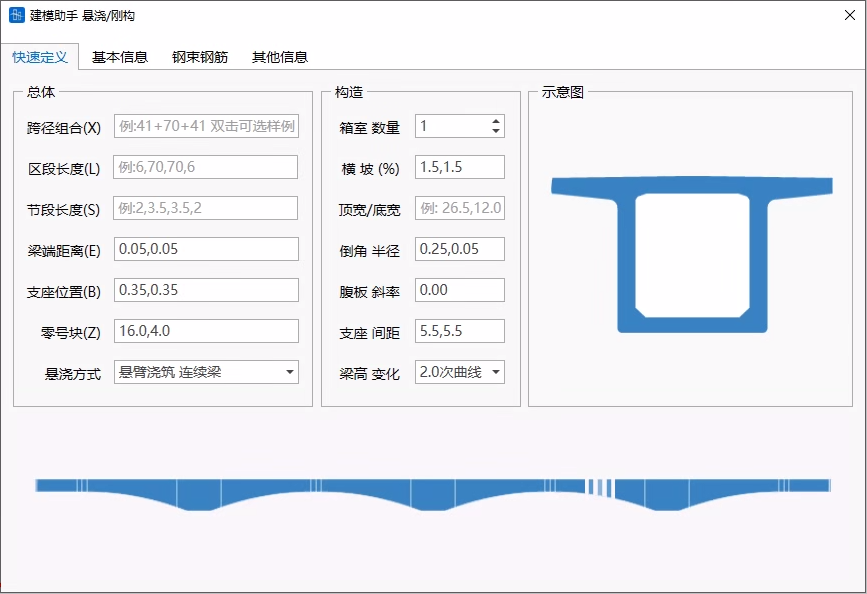

### 5.5.3 Quick Definition

Quickly define the main information required for the full bridge model, including "Overall" and "Construction" parts.

#### 5.5.3.1 Overall

Define overall parameters related to the bridge

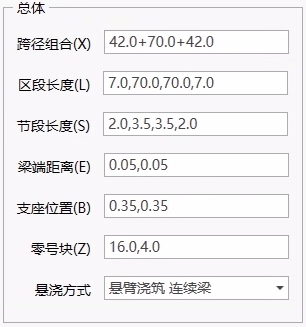

- **Span Combination:** Parameters related to the full bridge span arrangement (e.g., 42.0+70.0+42.0; associated with "Segment Length"; supports multiple spans).
- **Segment Length:** Cast-in-place segment/cantilever segment settings (e.g., 7.0,70.0,70.0,7.0; associated with "Span Combination"; supports multiple spans).
- **Segment Length:** Element division reference length (e.g., 2.0,3.5,3.5,2.0, indicating that the cast-in-place segment/cantilever segment is automatically divided into segments with a reference length of 2.0/3.5m respectively, corresponding to the values in "Segment Length"; for more detailed segment division, define it in "Basic Information > Segments").
- **Beam End Distance:** Distance between the main beam end and the pier center line (or the abutment back edge line).
- **Bearing Position:** Distance between the bearing and the main beam end.
- **Zero Block:** Main dimensions of the zero block (top and bottom full length).
- **Cantilever Casting Method:** Select the current bridge type (continuous beam/continuous rigid frame).
- **Engineering Example**\*

  

#### 5.5.3.2 Construction

Define parameters related to the reference section construction of the full bridge

- **Number of Box Cells:** Number of box cells (current version supports single cell and double cell);
- **Transverse Slope:** Top slab transverse slope (e.g., 1.5,1.5, indicating that both left and right half sides are 1.5%);
- **Top Width/Bottom Width:** Top and bottom widths;

\*Note: When it's a variable height beam with inclined webs, the bottom width of each section is a variable value. The input value here represents the bottom width at the starting end of the full bridge, and other positions will be automatically calculated.
- **Fillet Radius:** Fillet radius (e.g., 0.25,0.05, representing that the fillet radius at the cantilever root/web bottom is 0.25/0.05m respectively);
- **Web Slope:** Web slope (H/X; where [0.0] can be input, indicating vertical web);
- **Bearing Spacing:** Bearing distribution (e.g., 4.5,4.5, indicating three bearings with a spacing of 4.5m; can be empty, indicating a single bearing);
- **Beam Height Variation:** Beam height variation form (optional: linear, circular arc, 1.8th degree curve, 2.0th degree curve).

#### 5.5.3.3 Schematic Diagram

Real-time display of the meaning of parameters related to "Overall" and "Construction"

 Schematic Diagram > Overall > Span Combination(X) ")

 Schematic Diagram > Overall > Segment Length(L) ")

 Schematic Diagram > Overall > Segment Length(S) ")

### 5.5.4 Basic Information

This page contains calculation results related to "Segments" and "Sections", and displays them in the corresponding **Preview Area**. Users can quickly browse related data, and can also perform more detailed modifications or settings as needed.

#### 5.5.4.1 Segments

Quickly browse the calculation results of "Segments" for each part of the cantilever casting beam. (Clicking on any item will also synchronously display the corresponding schematic diagram)

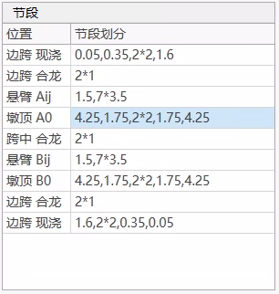

Double-click on any item in the list to perform detailed modification. Among them, the section variation segment (or web thickness variation segment) can be specified in the corresponding column.

#### 5.5.4.2 Sections

Quickly browse the calculation results of "Sections" for each part of the cantilever casting beam.
- Clicking on any item will also synchronously display the corresponding schematic diagram

- Double-click on the corresponding item in the list to perform detailed modification.

 Section Parameter Detailed Settings (General) ")

 Section Parameter Detailed Settings (Cantilever Inner End) ")

### 5.5.5 Tendons and Reinforcement

This page contains calculation results related to "Tendons" and displays them in the corresponding **Preview Area**. Users can quickly browse related data, and can also perform more detailed modifications or settings as needed.

#### 5.5.5.1 Prestressing Tendons

- Pier Top Tendons

 Parameters related to tendons at pier top position. (\"Serial Number\" is the bridge pier position, or corresponds to the serial number of the middle support point) ")

- Web Tendons

 Parameters related to tendons at web position. (\"Serial Number\" is the bridge pier position, or corresponds to the serial number of the middle support point) ")

- Mid-span Tendons

 Parameters related to tendons at mid-span position. (\"Serial Number\" is the mid-span position, i.e., corresponds to the serial number of the mid-span closure segment) ")

- Side Span Tendons

 Parameters related to tendons at side span position. (\"I-end / J-end\" is the position of the side span tendons) ")

#### 5.5.5.2 Ordinary Reinforcement\*

(Note: The current version does not support "Reinforcement" information. If users need it, they can set it in the "Checking" > "Reinforcement" function)

#### 5.5.5.3 Schematic Diagram

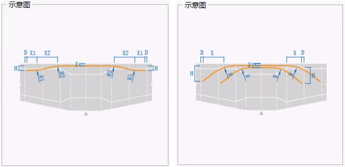

### 5.5.6 Other Information

On this page, define load-related information in the model, and settings related to the generated model content.

#### 5.5.6.1 Loads

- **Self-weight:** Define self-weight related loads;
- **Pavement:** Define pavement related loads;
- **Accessories:** Define accessory loads (including: guardrails, sidewalks);
- **Special:** Define special loads (e.g., external hanging loads such as cables, pipelines, etc., where "edge distance" represents the distance from the beam edge);
- **Temperature:** Define temperature loads (overall temperature rise, temperature drop; beam section temperature will be automatically calculated according to the code);
- **Settlement:** Define settlement amount (side support point, middle support point) (unit: mm);
- **Other:** Define cantilever casting beam related load information (including: hanging basket, lifting frame, closure jacking force, closure segment counterweight, prestressing, etc.);
- **Moving:** Define moving load related information.

#### 5.5.6.2 Structure

- **Bearing Thickness:** Define the bearing thickness for the full bridge (unit: mm);
- **Bearing Stiffness:** Define the bearing stiffness for the full bridge (local coordinate system Dx/Dy/Dz/Rx/Ry/Rz) (unit: kN/m);
- **Support Stiffness:** Define the cast-in-place segment support stiffness (local coordinate system Dx/Dy/Dz/Rx/Ry/Rz) (unit: kN/m).

#### 5.5.6.3 Model

Control the information included in the model and generate the model.

Note: When importing section characteristic related information, it takes some time. When quickly browsing or viewing the model, you can first not select "Section Characteristics".

## 5.6 Modeling Assistant Grillage Method Concrete Box Girder

### 5.6.1 Function

  Parameterized generation of **grillage method** **concrete box girder bridge** finite element models. Based on input basic information such as spans, it helps users automatically complete the definition of preliminary section parameters, beam segment parameters, section division, tendon characteristics and shapes, etc. It can quickly generate finite element models, including complete model information such as nodes, elements, sections, tendons, loads, settlement, construction stages, etc.

### 5.6.2 Command

Select "Structure" > "Modeling Assistant" > "Grillage Concrete Box Girder" from the main menu to open the modeling assistant.

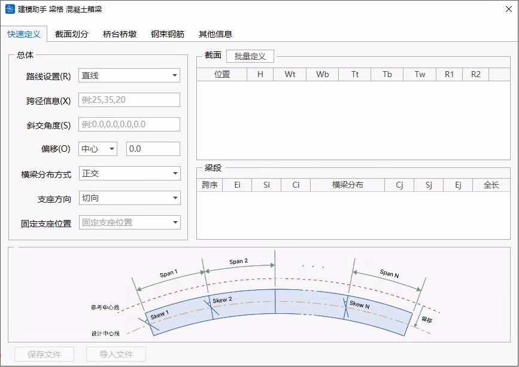

### 5.6.3 Quick Definition

Quickly define the main information required for the full bridge model, including "Overall", "Sections", "Beam Segments", etc.

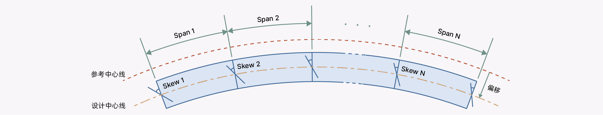

#### 5.6.3.1 Overall

Define overall parameters related to the bridge

- **Alignment Settings:** Define the full bridge horizontal curve (optional: straight line, custom, user import).

  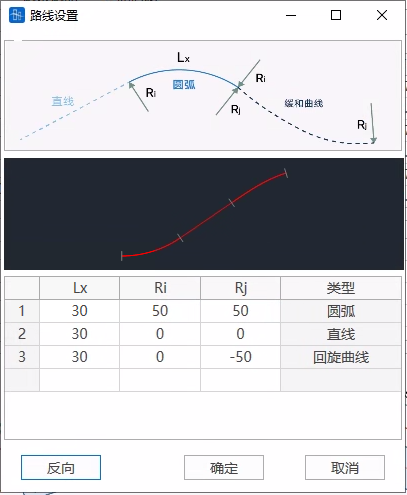
  - **LX:** Arc length of any segment of the curve;
  - **Ri/Rj:** Radii at both ends of any segment of the curve (straight line end can define R=[0.0]).
- **Span Information:** Define the full bridge span arrangement (e.g., 25.0+36.0+25.0; supports single span/multiple spans).
- **Skew Angle:** Define the skew angle at each support position (e.g., 0.0,0.0,0.0,0.0).
- **Offset:** Define the offset method and offset amount between the *design centerline* and the *reference centerline*.
- **Transverse Beam Distribution Method:** Select the virtual transverse beam distribution form (orthogonal, skew).
- **Bearing Direction:** Select the bearing direction (tangential direction, fixed bearing connection direction).
- **Fixed Bearing Position:** Select the fixed bearing position (abutment 1, pier 1-N, abutment 2).

#### 5.6.3.2 Sections

Define parameters related to the control sections of the full bridge

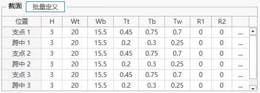

In the current table, quickly define basic parameters related to sections. You can also double-click the **[...]** button at the end of the row to perform detailed definition or modification.

- **Parameter Meanings**
  - **H:** Beam height;
  - **Wt/Wb:** Width (top slab, bottom slab);
  - **Tt/Tb/Tw:** Plate thickness (top slab, bottom slab, web);
  - **R1/R2:** Fillet radius (top slab fillet, bottom slab fillet);
- **Batch Definition**

  
  - **Number of Box Cells:** Number of box cells (current version supports number of box cells: 1-5);
  - **Transverse Slope:** Top slab transverse slope (e.g., 1.5,1.5, indicating that both left and right half sides are 1.5%);
  - **Width Top/Bottom:** Top and bottom slab widths;
  > 📌\*Note: When it's a variable height beam with inclined webs, the bottom width of each section is a variable value. The input value here represents the bottom width at the starting end of the full bridge, and other positions will be automatically calculated.
  - **Thickness Top/Bottom:** Top and bottom slab thickness;
  - **Thickness Side/Middle:** Web thickness (side web, middle web);
  - **Fillet Radius:** Fillet radius (e.g., 0.25,0.05, representing that the fillet radius at the cantilever root/web bottom is 0.25/0.05m respectively);
  - **Web Slope:** Web slope (H/X; where [0.0] can be input, indicating vertical web).

#### 5.6.3.3 Beam Segments

Define parameters related to the beam segments of each span of the full bridge

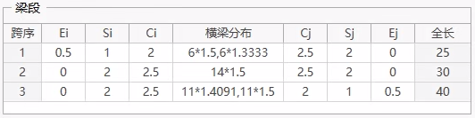

- **Parameter Meanings**
  - **Span No.:** Corresponds to the bridge span serial number;
  - **Parameters:** Define beam segment parameters and virtual transverse beam distribution
  - **E:** Distance between the bearing and the pier center line (middle support point position equals [0.0]);
  - **S:** Distance between the bearing and the starting position of the section variation segment;
  - **C:** Length of the section variation segment;
  - **Transverse Beam Distribution:** Transverse beam distribution spacing on the design centerline (distributed within the equal section range of the span);
  - **Full Length:** Full length of the current span.
- **Schematic Diagram**

   Schematic Diagram > Beam Segments (Side Span) ")

   Schematic Diagram > Beam Segments (Middle Span) ")

   Schematic Diagram > Beam Segments (Side Span) ")

### 5.6.4 Section Division

On this page, you can adjust content related to section division. It mainly includes **Division Settings** and **Division Results**.

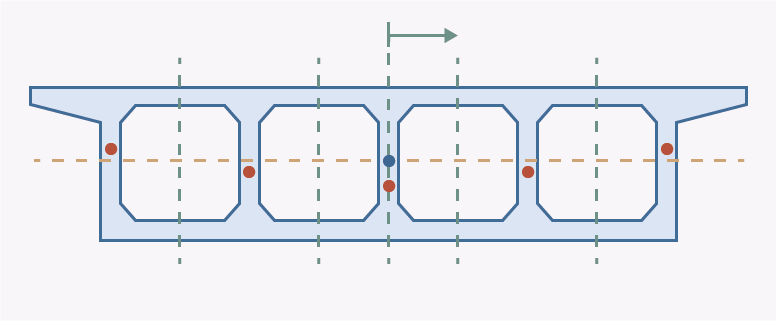

#### 5.6.4.1 Settings

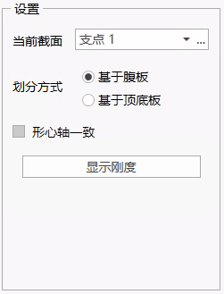

- **Current Section:** Select the current section (already defined in the "Quick Definition" page, and can be modified on the current page);
- **Division Option:** Select the desired section division method (based on web, based on top and bottom slabs);
- **Centroid Axis Consistent:** Select whether to keep the **divided section** and **full section** centroid axis consistent;
- **Display Stiffness:** Display the geometric characteristic results of each divided section corresponding to the current section.

#### 5.6.4.2 Results

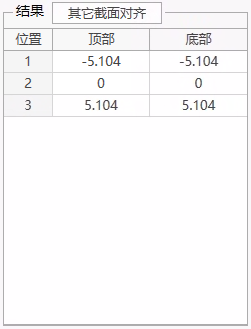

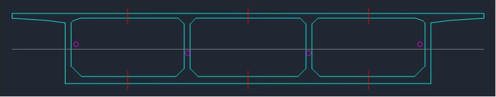

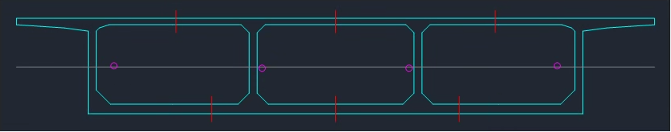

- **Align Other Sections:** Make other sections consistent with the current section division position.
- **Position:** Section division position;
- **Top:** Top of the section division position (horizontal distance from the section top surface slope change point, negative left, positive right);
- **Bottom:** Bottom of the section division position (horizontal distance from the section top surface slope change point, negative left, positive right).

### 5.6.5 Abutments and Piers

On this page, you can adjust content related to abutments and piers. It mainly includes **Abutment/Pier Bearing Arrangement**, **Fixed Bearing Position**, etc.

#### 5.6.5.1 Bearing Arrangement

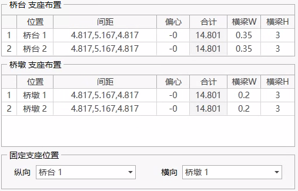

- **Position:** Description of the parameter position (abutment 1-2, pier 1-N);
- **Spacing:** Bearing spacing (coordinated with the "Eccentricity" parameter);
- **Eccentricity:** Bearing eccentricity (coordinated with the "Spacing" parameter);
- **Total:** Distance of the bearing range at the current position;
- **Transverse Beam W/H:** Transverse beam width/height at the current position (defines the rectangular section of the abutment/pier position);
- **Fixed Bearing Position:** Select the fixed bearing position.

#### 5.6.5.2 Schematic Diagram

### 5.6.6 Tendons and Reinforcement

On this page, you can adjust content related to prestressing tendons and ordinary reinforcement.

#### 5.6.6.1 Prestressing Tendons

- Top Slab Tendons

 Top Slab Tendon List (Middle Support Point) ")

- Web Tendons

 Web Tendon List (Full Span) ")

- Bottom Slab Tendons

 Bottom Slab Tendon List (Each Span) ")

#### 5.6.6.2 Ordinary Reinforcement\*

(Note: The current version does not support "Reinforcement" information. If users need it, they can set it in the "Checking" > "Reinforcement" function)

### 5.6.7 Other Information

On this page, you can define load-related information that needs to be set in the model, as well as control information for generating the model.

#### 5.6.7.1 Loads

- **Self-weight:** Define self-weight related loads;
- **Pavement:** Define pavement related loads;
- **Accessories:** Define accessory loads (including: guardrails, sidewalks);
- **Special:** Define special loads (e.g., external hanging loads such as cables, pipelines, etc., where "edge distance" represents the distance from the beam edge);
- **Temperature:** Define temperature loads (overall temperature rise, temperature drop; beam section temperature will be automatically calculated according to the code);
- **Settlement:** Define settlement amount (side support point, middle support point) (unit: mm);
- **Other:** Define bridge related load information (including: prestressing, etc.);
- **Moving:** Define moving load related information.

#### 5.6.7.2 Structure

- **Bearing Thickness:** Define the bearing thickness for the full bridge (unit: mm);
- **Bearing Stiffness:** Define the bearing stiffness for the full bridge (local coordinate system Dx/Dy/Dz/Rx/Ry/Rz) (unit: kN/m).

#### 5.6.7.3 Model

Control the information included in the model and generate the model.

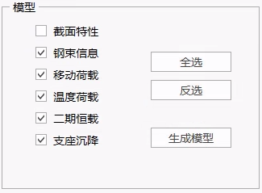

Note: When importing section characteristic related information, it takes some time. When quickly browsing or viewing the model, you can first not select "Section Characteristics".

## 5.7 **Effective Width**

**Function:** Automatically calculate the effective width for the main beam elements defined in the span information, obtain the correction coefficients for the vertical bending moment of inertia and centroid position of the element section, used to consider the effective width of the section. **For concrete box girders, composite beams, and steel beam parameter sections, the software automatically calculates the effective width. ** For custom sections, users can define the flange lines and web lines to determine the flange position and flange width of the section, and the software automatically calculates the effective width.

### 5.7.1 **Span Information**

- **Function:** Define the span information of the structure, used to calculate the effective width.
- **Command:** Select "Structure" > "Span Information" from the main menu;

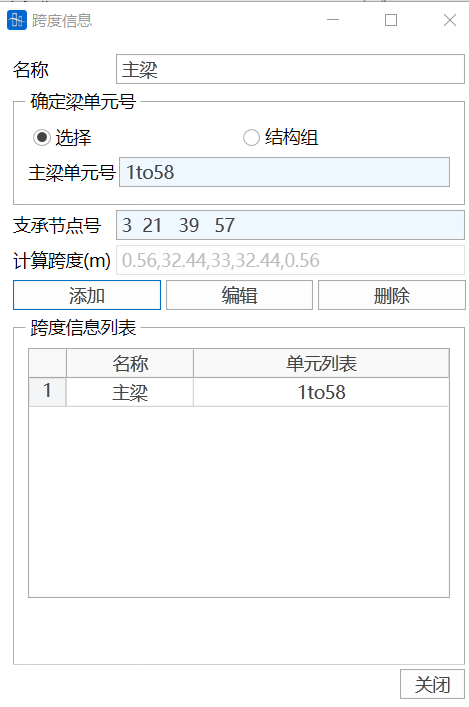

- **Input**
  - **Name**

    Enter the name of the current span information.
  - **Determine Beam Element Numbers**

    Select: After the cursor is positioned in the "Main Beam Element Number" text box, select the start and end nodes of the beam elements for which span information needs to be defined on the diagram, and the software will automatically fill the corresponding element numbers into the text box.

    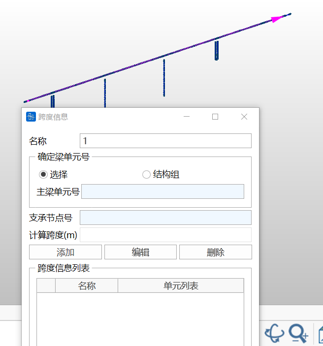

    - Structure Group:
      Select the structure group of the beam elements that need to define the span information, and the software will automatically fill the corresponding element numbers into the text box.

      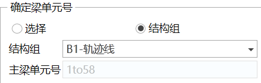

    - Main Beam Element Numbers:
      Can be automatically filled through "Select" or "Structure Group", or can be manually input.
    - Support Node Numbers:
      Users manually input the support node numbers to determine the boundary conditions of the beam element structure corresponding to the span information definition.
  - **Calculate Span**

    The software will automatically calculate the span value based on the above input main beam element numbers and support node numbers, used to calculate the effective width value. Users cannot modify it. If modification is needed, the support node numbers need to be modified.

    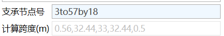

  - **Span Information List**

    The software can define multiple sets of span information as needed. Listed in the table.

### 5.7.2 Concrete Beam

#### 5.7.2.1 **Custom Section Flange Width**

- **Function:** For custom wire loop section types, this function can be used to determine the flange position and flange width of the section by defining the flange lines and web lines, used for the software to automatically calculate the effective width later.
- **Command:** Select "Structure" > "Concrete Beam" > "Custom Section Flange Width" from the main menu;

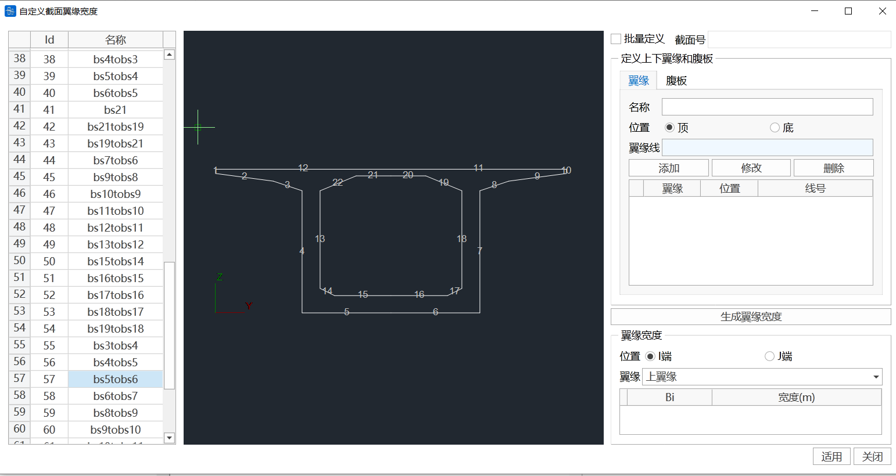

- **Input**
  - **Section List**

    Automatically lists all custom wire loop sections in the section table, including variable sections of custom wire loop types.
  - **Batch Definition**

    After selecting batch definition, select multiple sections in the left section list to perform batch definition. However, it must be ensured that the corresponding line numbers of the sections are consistent. Otherwise, errors may occur.

    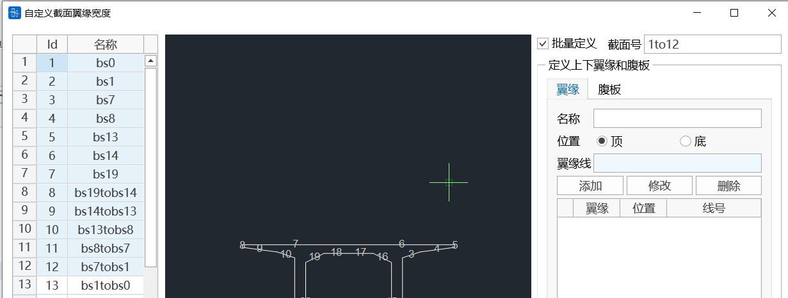

  - **Define Top and Bottom Flanges and Webs**

    Flanges: Define the top surface line and bottom surface line of the section flanges respectively by inputting the line number or selecting lines in the diagram.

    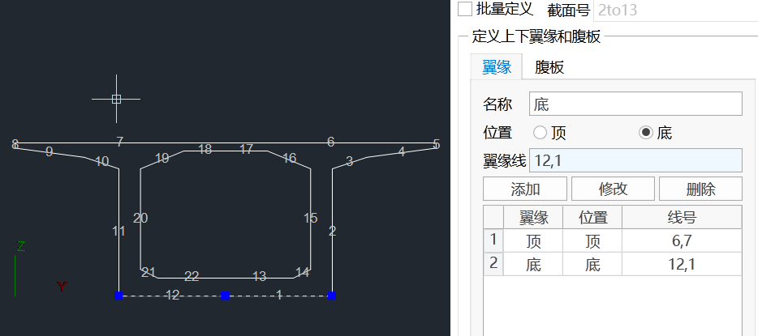

    Webs: Define the left web line and right web line of each web respectively, and the direction of the web and flange intersection by inputting the line number or selecting lines in the diagram.

    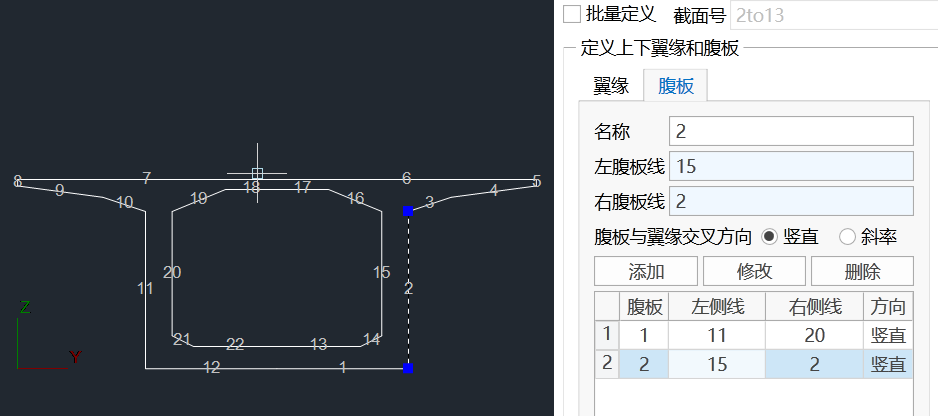

    Add: Add the defined flanges and webs to the list.

    Modify: Modify the defined flanges and webs.

    Delete: Delete the defined flanges and webs.
  - **Generate Flange Width**

    The software automatically generates the flange width of the top and bottom flanges for checking and confirmation. For variable sections, the flange width of the I and J ends can be viewed separately.

    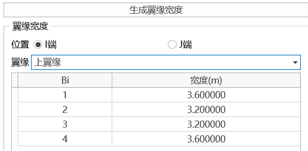

#### 5.7.2.2 **Calculate Effective Width**

- **Input**
  - **Span Information:** Select the span information corresponding to the elements for which the effective width needs to be calculated.
  - **Design Code:** The software provides two effective width calculation methods: "Code for Design of Highway Reinforced Concrete and Prestressed Concrete Bridges and Culverts" (JTG 3362-2018) and "Code for Design of Concrete Structures of Railway Bridges and Culverts" (J 462-2017).
  - **Calculate:** Calculate the top and bottom flange calculation widths of each element's I-end and J-end, as well as the effective width of each component of the top and bottom flanges. At the same time, draw the variation diagram of the effective width value along the span.

    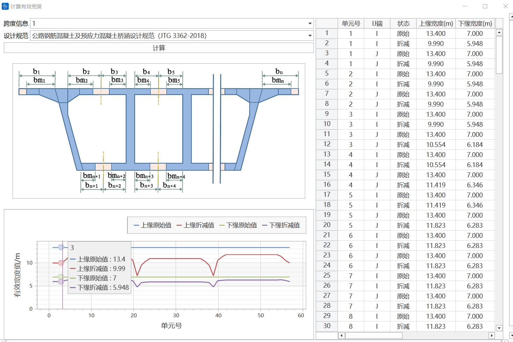

### 5.7.3 Composite Beam

#### 5.7.3.1 Custom Section Flange Width

- **Function:** For custom composite beam section types, this function can be used to determine the flange position and flange width of the section by defining the top slab flange lines and web lines, used for the software to automatically calculate the effective width later.
- **Command:** Select "Structure" > "Composite Beam" > "Custom Section Flange Width" from the main menu;

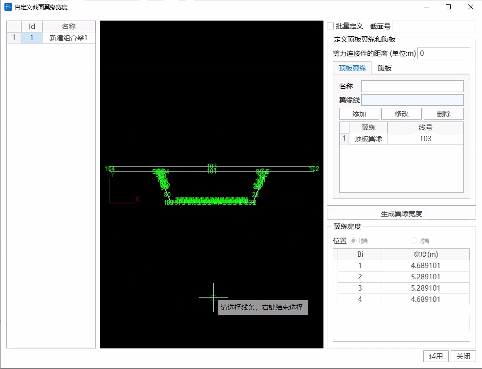

- **Input**
  - **Section List**

    Automatically lists all custom composite sections in the section table, including variable sections of custom composite beams.
  - **Batch Definition**

    After selecting batch definition, select multiple sections in the left section list to perform batch definition. However, it must be ensured that the corresponding line numbers of the sections are consistent. Otherwise, errors may occur.
  - **Define Top Slab Flange and Webs**

    Top Slab Flange: Define the top slab flange line of the section by inputting the line number or selecting lines in the diagram. Only need to select the topmost edge line of the top slab.

    

    Webs: Define the left web line and right web line of each web respectively by inputting the line number or selecting lines in the diagram.

    

    Add: Add the defined flanges and webs to the list.

    Modify: Modify the defined flanges and webs.

    Delete: Delete the defined flanges and webs.
  - **Generate Flange Width**

    The software automatically generates the flange width of the top and bottom flanges for checking and confirmation. For variable sections, the flange width of the I and J ends can be viewed separately.

#### 5.7.3.2 **Calculate Effective Width**

- **Input**
  - **Span Information:** Select the span information corresponding to the elements for which the effective width needs to be calculated.
  - **Design Code:** The software provides "Code for Design and Construction of Highway Steel-Concrete Composite Bridges" (JTG/T D64-01—2015).
  - **Distance of Shear Connectors:** Distance between the centers of shear connectors.
  - **Calculate:** Calculate the top flange calculation width of each element's I-end and J-end, as well as the effective width of each component of the top and bottom flanges. At the same time, draw the variation diagram of the effective width value along the span.

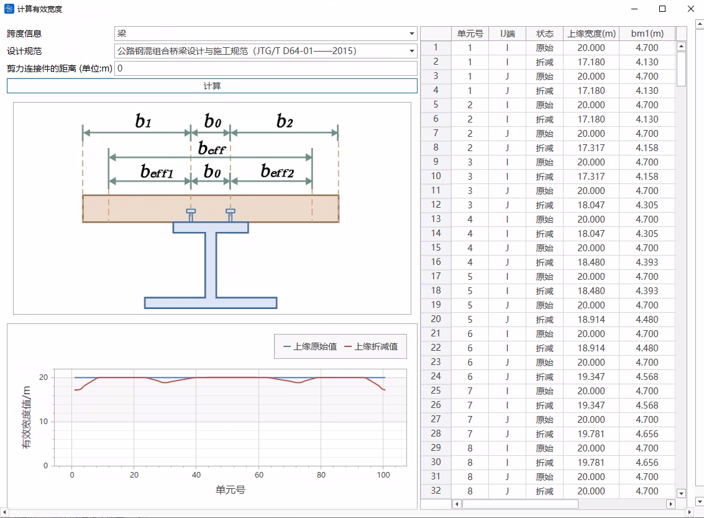

### 5.7.4 Steel Beam

#### 5.7.4.1 Custom Section Flange Width

- **Function:** For custom line width section types, this function can be used to determine the flange position and flange width of the section by defining the top and bottom slab flange lines, web lines, and stiffening ribs, used for the software to automatically calculate the effective width later.
- **Command:** Select "Structure" > "Steel Beam" > "Custom Section Flange Width" from the main menu;

- **Input**
  - **Section List**

    Automatically lists all custom line width sections in the section table, including variable sections of custom line width types.
  - **Batch Definition**

    After selecting batch definition, select multiple sections in the left section list to perform batch definition. However, it must be ensured that the corresponding line numbers of the sections are consistent. Otherwise, errors may occur.
  - **Define Top Slab Flange and Webs**

    - Flanges: Define the top and bottom slab flange lines of the section by inputting the line number or selecting lines in the diagram.
      

    - Webs: Define the web lines by inputting the line number or selecting lines in the diagram.
      > If the web is a single line, batch generation can be used. If a web consists of multiple lines, batch generation cannot be used.
      > 

    - Stiffening Ribs: Define the stiffening ribs of the top flange and bottom flange respectively by inputting the line number or selecting lines in the diagram.
      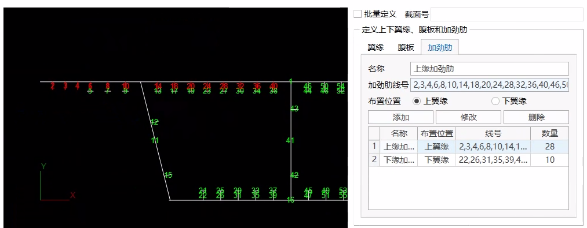

      > For stiffening rib lines, only the web lines need to be defined. As shown in the figure below, only the lines marked in red need to be defined.
      > 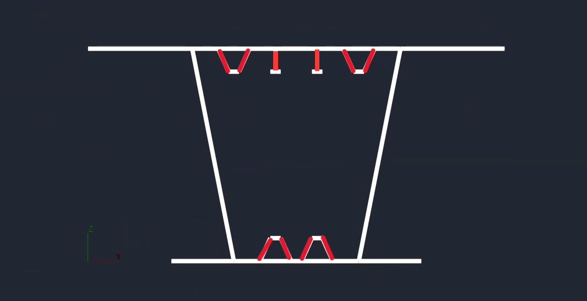

    Add: Add the defined flanges, webs, and stiffening ribs to the list.

    Modify: Modify the defined flanges, webs, and stiffening ribs.

    Delete: Delete the defined flanges, webs, and stiffening ribs.
  - **Generate Flange Width**

    The software automatically generates the flange width of the top and bottom flanges for checking and confirmation. For variable sections, the flange width of the I and J ends can be viewed separately.

#### 5.7.4.2 **Calculate Effective Width**

- **Input**
  - **Span Information:** Select the span information corresponding to the elements for which the effective width needs to be calculated.
  - **Design Code:** The software provides "Code for Design of Highway Steel Structures" (JTG D64—2015).
  - **Stiffening Rib Type:** Rigid and flexible.
  - **Elastic Buckling Coefficient:** Value taken according to the code.
  - **Calculate:** Calculate the top flange calculation width of each element's I-end and J-end, as well as the effective width of each component of the top and bottom flanges. At the same time, draw the variation diagram of the effective width value along the span.

> 🧐**Notes**>
>
> 1. Stiffening Rib Type Selection: The stiffening rib type affects the local stability calculation reduction coefficient calculation. For rigid stiffening ribs, the local stability calculation width of the stiffening rib takes the spacing of the stiffening ribs; for flexible stiffening ribs, it is calculated based on the web spacing or the width from the web to the cantilever end.
> 2. The steel beam effective width calculation will give three results, respectively,
>
>    (1) Top flange considering the local stability reduction coefficient, bottom flange considering the local stability reduction coefficient;
>
>    (2) Top flange considering the local stability reduction coefficient and shear lag, bottom flange considering shear lag;
>
>    (3) Top flange considering shear lag, bottom flange considering the local stability reduction coefficient and shear lag.
>
>    The corresponding generated effective width coefficient boundary groups are `{Span Information Name}_EW Boundary Group 1, {Span Information Name}_EW Boundary Group 2, {Span Information Name}_EW Boundary Group 3`.

### 5.7.5 **Effective Width Coefficient Table**

When the effective width is calculated, the software simultaneously calculates the correction coefficient "Iy Coefficient" for the vertical bending moment of inertia and the correction coefficient "Δz" for the centroid variation of the element's I-end and J-end, and lists them in the table.

At the same time, the "EW Boundary Group" is automatically generated. When this boundary group is activated in the construction stage, the software will consider the effective width of the section in that stage.

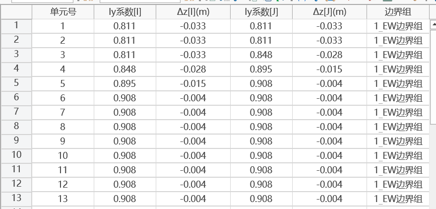

When calculating the construction stage stress, the section characteristics of the current construction stage are used as the benchmark. The stress caused by the vertical bending moment My considers the influence of the vertical bending moment of inertia and centroid correction coefficient, while the stress caused by other internal forces and temperature self-stress does not consider the influence of the correction coefficient. When calculating the operation stage stress, the section characteristics of the last construction stage are used as the benchmark, and the same principle is adopted for calculation.

> If multiple effective width coefficients are activated for the same element in the same construction stage, the most unfavorable effective width coefficient is taken to calculate the stress value.
