## 6.1 **Coordinate Systems**

QiaoTong software includes multiple coordinate systems, including: global coordinate system, element coordinate system, node coordinate system, and section coordinate system.

### 6.1.1 Global Coordinate System

The global coordinate system is the reference coordinate system for modeling when users open the software, i.e., the OXYZ coordinate system, as shown in the figure:

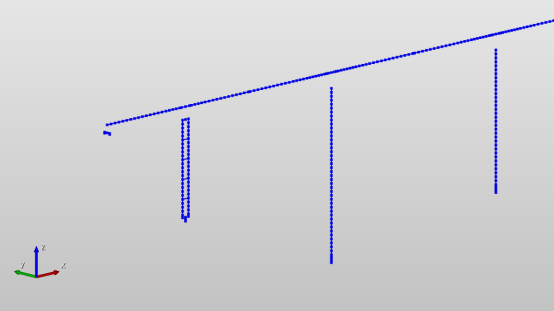

Where in the default view:
- The Z axis points vertically along the screen, pointing from the bottom of the screen to the top is positive;
- The XOY plane is perpendicular to the Z axis, following the right-hand screw rule. Users can switch views during modeling as needed to improve modeling convenience.

### 6.1.2 Element Coordinate System

The element coordinate system (local coordinate system) is the basic data for finite element calculation. QiaoTong software determines it jointly through the element's nodes and the element's characteristic angle (β angle). The meaning of the β angle:

> When the element is a linear element (truss, beam, etc.), specify the β angle or the coordinates of the K node to define the direction of the component. If the coordinates of the K node are input, the program automatically calculates the component layout angle and uses it as the β angle input. In QiaoTong, the direction of the element coordinate system x-axis of a line element is from the N1 point (I point) pointing to the N2 point (J point).

> When the element coordinate system x-axis of a line element is parallel to the Z axis of the global coordinate system, the β angle of the element is the angle between the global coordinate system X-axis and the element coordinate system z-axis. The sign of the angle is determined by the right-hand rule of rotation around the element coordinate system x-axis. When the element coordinate system x-axis of a line element is not parallel to the Z axis of the global coordinate system, the β angle of the element is the angle between the global coordinate system Z-axis and the element coordinate system x-z plane.

 Vertical Component (element coordinate system x-axis of line element is parallel to the global coordinate system Z-axis) (a) Vertical Component (element coordinate system x-axis of line element is parallel to the global coordinate system Z-axis) ")

 Horizontal or Inclined Component (element coordinate system x-axis of line element is not parallel to the global coordinate system Z-axis) (b) Horizontal or Inclined Component (element coordinate system x-axis of line element is not parallel to the global coordinate system Z-axis) ")

Figure 4-2 Element Coordinate System

### 6.1.3 Node Coordinate System

The node coordinate system is an optional definition item, mainly applicable to scenarios where the structure has inclined boundaries (the direction of constraints is skew to the global coordinate system). At this time, users can define the node coordinate system on these nodes and add constraints in the specified direction. QiaoTong provides users with a convenient node coordinate system definition function.

### 6.1.4 Section Coordinate System

The section coordinate system is mainly used in the section creation module, indicating the directions of the section along the width and height. When the β angle of the element is 0, the section coordinate system is consistent with the element coordinate system direction.

### 6.1.5 Internal Force Sign Convention for Frame Elements

 Sign Convention in Beam Element Local Coordinate System Internal Force (or Stress) Sign Convention in Beam Element Local Coordinate System ")

QiaoTong software, according to user habits, defines the internal force direction of frame elements as shown in the figure, where:

**Axial Force**: The element is in tension as positive, in compression as negative; The axial force at the element start end along -x is positive, and the axial force at the element end along +x is positive;

**Torque**: The torque at the element start end rotating around -x is positive, and the torque at the element end rotating around +x is positive;

**Shear Force**:

1. Shear force Qz causes the element to rotate counterclockwise in the xoz plane (i.e., the shear force Qz at the start end is along the -z axis, and the shear force Qz at the end is along the +z axis) is positive;
2. Shear force Qy causes the element to rotate counterclockwise in the xoy plane (i.e., the shear force Qy at the start end is along the -y axis, and the shear force Qy at the end is along the +y axis) is positive;

**Bending Moment**:

1. **Vertical Bending Plane (xoz)**:

   The bending moment My causes the "section bottom (-z) fiber to be in tension" for the beam element to be positive (i.e., the My at the start end rotating around the +y axis is positive, and the My at the end rotating around -y is positive), as shown in the deformation diagram below:

    Fiber in Tension Section Bottom (-z) Fiber in Tension ")
2. **Horizontal Bending Plane (xoy)**:

   The bending moment Mz causes the "section bottom (-y) fiber to be in tension" for the beam element to be positive (i.e., the Mz at the start end rotating around the -z axis is positive, and the My at the end rotating around the z axis is positive), as shown in the deformation diagram below:

    Fiber in Tension Section Bottom (-y) Fiber in Tension ")

# 6.2 **Unit Settings**

Except for special explanations, the basic units of the finite element structure model follow the international unit system. Users can set force and geometric basic units as needed.

| Physical Quantity | Unit         | Physical Quantity | Unit      |
| ---- | ---------- | --- | ------- |
| Coordinate   | $m$        | Area  | $m_{2}$ |
| Length   | $m$        | Moment of Inertia | $m_{4}$ |
| Force    | $N$        | Linear Displacement | $m$     |
| Moment   | $N\cdot m$ | Angular Displacement | Radian      |
| Density   | $kg/m_{3}$ | Angular Degree | Degree       |
| Specific Weight   | $N/m_{3}$ | Temperature  | Celsius Temperature ℃   |
| Modulus of Elasticity | Pa         | Stress  | Pa      |

# 6.3 **Nodes**

### 6.3.1 New Node

- Function: Create a node or simultaneously copy this node to create a group of nodes.
- Command:

  Select "Nodes/Elements" > "Nodes" > "New" from the main menu;
  Select "Work" > "Structure" > "Nodes" > "Table" from the tree menu: This opens the node table, and adds nodes through the table.
  Right-click select "Nodes" > "New" in the model view.

- Input
  - **Numbering Method**

    The numbering of the new node is automatically set to the current maximum node number + 1.
  - **Coordinates**

    Input the coordinate values (in the global coordinate system) of the node to be created.
  - **Copy**

    Copy the nodes established by the above steps at equal spacing. This function can realize the generation of multiple equally spaced nodes.

    Number of copies: Input the number of copies.
    Spacing (dx, dy, dz): Input the copy distance on the three global coordinate axes.
    You can directly key in the copy spacing in the input box, or click on the copy spacing and then specify the copy spacing with the mouse in the model window.
  - **Merge Duplicate Nodes**

    If the new node duplicates the position of an existing node, decide whether to merge the overlapping nodes into one node. If necessary, you can set the merge tolerance error (tolerance).

    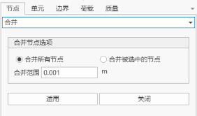
  - **Split Elements at Intersection Points**

    When the newly established node is on an existing line element (beam and truss elements), decide whether to split the existing line elements. If necessary, click to modify the intersection tolerance error (tolerance).

### 6.3.2 Copy and Move Nodes

- Function: Copy or move nodes at equal spacing or unequal spacing.
- Command: Select "Nodes/Elements" > "Nodes" > "Copy and Move" from the main menu.

- Input
  - **Numbering Method**

    The numbering of the new node is automatically set to the current maximum node number + 1.
  - **Form**

    Copy: Copy nodes

    Move: Move nodes
  - **Equal Spacing Copy and Move**

    Copy (or move) nodes at equal spacing.

    Number of copies: Input the number of copies.
    Spacing (dx, dy, dz): Input the copy (or move) distance on the three global coordinate axes.
  - **Unequal Spacing Copy and Move**

    Copy (or move) nodes at unequal spacing.

    Direction: Select the copy (or move) direction.
    x: Copy nodes at unequal spacing on the global coordinate system X axis. When selecting move, move the node according to the first input spacing.
    y: Copy nodes at unequal spacing on the global coordinate system Y axis. When selecting move, move the node according to the first input spacing.
    z: Copy nodes at unequal spacing on the global coordinate system Z axis. When selecting move, move the node according to the first input spacing.
    Arbitrary direction: Copy (or move) nodes at unequal spacing in an arbitrary direction.
    Spacing: Input unequal copy spacing in the specified direction as needed. (For example: 3, 5, 2\@6 = 3, 5, 6, 6)
    Direction vector: If arbitrary direction is selected, input the direction vector components in the x, y, z directions.
  - **Merge Duplicate Nodes**

    If the new node duplicates the position of an existing node, decide whether to merge the overlapping nodes into one node. If necessary, you can set the merge tolerance error (tolerance).
  - **Copy Node Attributes**

    Decide whether to copy the attributes of the copied node together when copying nodes (node boundary conditions, node concentrated loads, etc.). Click to select target attributes.

### 6.3.3 Delete Nodes

- **Command:**

  Select "Nodes/Elements" > "Nodes" > "Delete" from the main menu.
  Right-click select "Nodes" > "Delete" in the model view.
  Delete nodes through the node table.

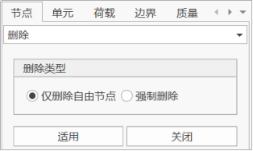

- Input
  - **Delete Only Free Nodes**

    Select the free nodes to be deleted in the model window with the mouse, and click OK. The program will delete these nodes. After selecting this option, nodes associated with elements and nodes that have been assigned attributes (node loads, boundary conditions, etc.) will be retained.
  - **Force Delete**

    After selecting this option, nodes associated with elements and nodes that have been assigned attributes (node loads, boundary conditions, etc.) as well as the elements associated with the nodes will all be deleted.

### 6.3.4 Mirror Nodes

- Function: Implement node mirror copy or move by specifying a plane.
- Command:

  Select "Nodes/Elements" > "Nodes" > "Mirror" from the main menu.
  Right-click select "Nodes" > "Mirror" in the model view.

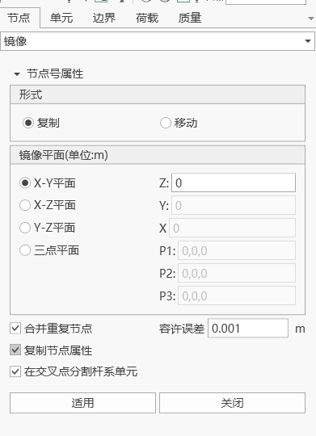

- Input
  - **Numbering Method**

    The numbering of the new node is automatically set to the current maximum node number + 1.
  - **Form**

    Copy: Copy nodes

    Move: Move nodes
  - **Mirror Plane**

    X-Y plane
    X-Z plane
    Y-Y plane
    Three-point plane (need to input three coordinate information, and ensure that the three points are on a unique spatial plane)
  - **Merge Duplicate Nodes**

    If the new node duplicates the position of an existing node, decide whether to merge the overlapping nodes into one node.
  - **Copy Node Attributes**

    Decide whether to copy the attributes of the copied node together when copying nodes. The copied node attributes by default include boundary conditions, static loads, and dynamic loads.
  - **Split Frame Elements at Intersection Points**

    If the new node is on the existing line element segment, the element will be split into multiple elements by the new node.

### 6.3.5 Project Nodes

- Function: Move or copy nodes by projecting on a specific line or plane.
- Command:

  Select "Nodes/Elements" > "Nodes" > "Project" from the main menu.
  Right-click select "Nodes" > "Project" in the model view.

- Input
  - **Numbering Method**

    The numbering of the new node is automatically set to the current maximum node number + 1.
  - **Form**

    Copy: Copy nodes

    Move: Move nodes
  - **Projection Type**

    Select the geometric shape of the projection reference. The types of the projection reference are as follows:

    Project nodes onto a straight line
    Project nodes onto a plane
    Project nodes onto an element
  - **Define Reference**

    Input necessary data to define the projection reference as follows:

    Directly key in all data on the keyboard. Or, click on the corresponding input area and define the reference in the working window.
    **a. Project Nodes onto a Straight Line**

    

    **P1**: Coordinates of any point on the reference line.
    **P2**: Coordinates of any point on the reference line.
    **b. Project Nodes onto a Plane**

    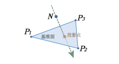

    **P1**: Coordinates of any point on the reference plane.
    **P2**: Coordinates of any point on the reference plane.
    **P3**: Coordinates of any point on the reference plane.
    **c. Project Nodes onto an Element**

    

    Element number: Plate element number (plane stress element, plate element, etc.).
  - **Projection Direction**

    Select the projection direction of the defined projection reference line or plane.
    Normal direction: Projection direction perpendicular to the projection reference line or plane.
    Arbitrary direction: Project in an arbitrary direction. Input the x, y, z vector components in the projection direction.
  - **Merge Duplicate Nodes**

    If the new node duplicates the position of an existing node, decide whether to merge the overlapping nodes into one node.
  - **Copy Node Attributes**

    Decide whether to copy the attributes of the copied node together when copying nodes. The copied node attributes by default include boundary conditions, static loads, and dynamic loads.
  - **Split Frame Elements**

    Generate nodes at equal spacing or unequal spacing between the existing nodes and the nodes generated after projection along the projection direction.
    Equal spacing: Generate nodes at equal spacing.
    Number of divisions: Number of equal spacings.
    Unequal spacing: Generate nodes at unequal spacing defined by distance ratio.
    Distance ratio: Division positions along the total projection length represented by distance ratio. (For example: 0.4, 0.6, 0.9)

### 6.3.6 Rotate Nodes

- Function: Rotate, move, or copy nodes by rotating around a specific axis.
- Command:

  Select "Nodes/Elements" > "Nodes" > "Rotate" from the main menu.
  Right-click select "Nodes" > "Rotate" in the model view.

- Input
  - **Numbering Method**

    The numbering of the new node is automatically set to the current maximum node number + 1.
  - **Form**

    Copy: Copy nodes

    Move: Move nodes
  - **Rotation Axis**

    Select the rotation axis.
    - Rotate around x-axis: x-axis
    - Rotate around y-axis: y-axis
    - Rotate around z-axis: z-axis
    - Custom
      - Axis defined by two points: Define the straight line connecting the two points as the rotation axis.
        - Point 1:
          When selecting to rotate around x, y, z axis, input the coordinates of any point on that axis.
          When selecting to rotate around an axis defined by two points, input the coordinates of point 1.
        - Point 2:
          When selecting to rotate around an axis defined by two points, input the coordinates of point 2.
      - Rotation angle: The angle of rotation when copying.
        > 0: Copy nodes according to the right-hand rule.
        < 0: Copy nodes in the opposite direction of the right-hand rule.
  - **Merge Duplicate Nodes**

    If the new node duplicates the position of an existing node, decide whether to merge the overlapping nodes into one node. If necessary, you can set the merge tolerance error (tolerance).
  - **Copy Node Attributes**

    Decide whether to copy the attributes of the copied node together when copying nodes. The copied node attributes by default include boundary conditions, static loads, and dynamic loads. Click to select target attributes.

  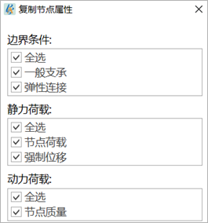

  - **Split Frame Elements at Intersection Points**

    When the newly established node is on the existing line element (beam and truss elements), decide whether to split the existing elements.

### 6.3.7 Merge Nodes

- Function:

  Merge all nodes (>1) and their attributes (node loads and node boundary conditions) within a given range.
  Nodes cannot be merged when there are elements between nodes.

  The nodes of plate elements are temporarily not supported for merging, because when merging, users can manually specify the tolerance. If the tolerance is too large, after the nodes of plate elements are modified, the four points may no longer be coplanar, causing other effects.
- Command:

  Select "Nodes/Elements" > "Nodes" > "Merge" from the main menu.
  Right-click select "Nodes" > "Merge" in the model view.

- Input
  - **Merge**

    Select the method of merging nodes.
    Merge all nodes: Select all nodes.
    Merge selected nodes: Use the nodes selected in the selection function as the merge objects.
  - **Merge Range**

    Specify the range of merging. Only nodes within that distance range can be merged. The center of the range is the start node, and the position of the new node formed after merging is at the position of the start node.

### 6.3.8 Node Numbering

- Function: Renumber nodes with a given starting node number and numbering order.
- Command:

  Select "Nodes/Elements" > "Nodes" > "Node Numbering" from the main menu.
  Right-click select "Nodes" > "Node Numbering" in the model view.

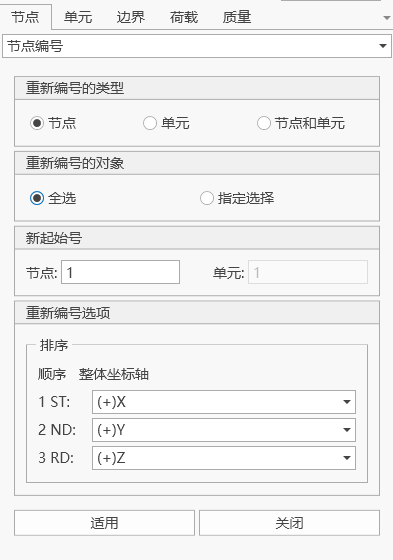

- Input
  - **Renumbering Type**

    Specify the type of numbering. You can choose nodes, elements, or nodes and elements.
  - **Renumbering Object**

    Select all or specify selection. When specifying selection, you need to select the numbering object in the model.
  - **Start Number**

    Specify the starting node number or element number for renumbering.
  - **Renumbering Order**

    According to the global coordinate system, when the first order selected is X, sort by the node coordinate x values from small to large in the actual model. When renumbering elements, sort by the I node coordinates of the element as the benchmark. When the first order values are equal, sort by the second order from small to large, and so on.

### 6.3.9 Compact Node Numbering

- Function: Eliminate unused node numbers and compact the original node numbers into consecutive node numbers.
- Command: Select "Nodes/Elements" > "Nodes" > "Compact Node Numbering" from the main menu.

- Input
  - **Renumbering Type**

    Specify the type of numbering. You can choose nodes, elements, or nodes and elements.
  - **Renumbering Object**

    All select: All nodes or elements.
    Specify selection: Select nodes or elements in the model window.

### 6.3.10 Node Scaling

- Function: Scale the distance between nodes along each coordinate axis with a given scaling factor, using a given reference point.
- Command: Select "Nodes/Elements" > "Nodes" > "Node Scaling" from the main menu.

- Input
  - **Operation Object**

    Select the object for scaling node distance:
    All select
    Specify selection
  - **Spacing Scaling Reference Point**

    Select the scaling reference point for node spacing:
      GCS origin point
      Center
      User-defined
  - **Spacing Scaling Factor**

    Given scaling factor along each coordinate axis.

### 6.3.11 Node Filtering

- Function: Select nodes along the coordinate axis direction in the model.
- Command: Select "Nodes/Elements" > "Nodes" > "Node Filtering" from the main menu.

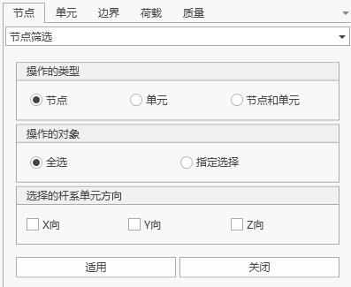

- **Operation Type**

  You can choose to filter only nodes, filter only elements, or filter nodes and elements.
- **Operation Object**

  Select the object for node filtering:
    All select
    Specify selection
- **Selected Frame Element Direction**

  Select nodes of frame elements along each coordinate axis.

### 6.3.12 View Node Table

- Function: Input or modify node coordinate data in the form of an electronic table. The table tools in the platform provide various powerful functions.
- Command:

  Select "Nodes/Elements" > "Nodes" > "Node Table" from the main menu.
  Right-click select "Work" > "Structure" > "Nodes" > right-click select "Table" in the model structure tree.

- Table Content
  - Node: Node number
  - X: GCS X coordinate
  - Y: GCS Y coordinate
  - Z: GCS Z coordinate

# 6.4 **Elements**

The platform includes the following four types of elements:

- Frame elements
  Composed of 2 nodes, belonging to three-dimensional elements under uniaxial tension-compression. Each node has 3 translational degrees of freedom.
- Beam elements
  Composed of 2 nodes, each node has 3 translational degrees of freedom and 3 rotational degrees of freedom, not considering the shear deformation of the element.
- Cable elements
  Composed of 2 nodes, belonging to elastic tension-only cable elements. Each node has 3 translational degrees of freedom.
- Plate elements
  4-node plate elements.

## 6.4.1 New Element

- Function: Create elements.
- Command:

  "Main Menu" > "Nodes/Elements" > "Elements".
  Select "Work" > "Elements" from the tree menu.
  Right-click select "Elements" > "New" in the model window.

- Input
  - **Basic Parameters:**

    I node, J node, element type, section, material, Beta (β) angle, initial parameters.
  - **Numbering Method**

    The numbering of the new node is automatically set to the current maximum element number + 1.
  - **Element Type**

    Specify the element type, including frame elements, beam elements, cable elements, plate elements.
  - **Element Properties**

    Select the section property number, or select the section property name in the defined section property data.
    Select the material property number, or select the material property name in the defined material property data.
    Section and material can be directly input or selected through the dropdown list, but are limited to the established sections and materials.
  - **Beta (β)**

    The Beta (β) angle is used to define the direction of the component section, and is only effective for beam elements. For other elements, it defaults to 0.
  - **K Node**

    In this way, the local coordinate XOZ of the created frame element is the IJK plane, and the Z axis points to the K node.
  - **Node Selection**

    Point selection: Click on the node connection text box, its background color will become light green, and then specify the target node input in the model window in succession. The text box will automatically fill in the node number.
    Input: Directly input the node number in the node connection.
  - **Cross Splitting**

    Select cross splitting node: If an existing node is on the generated element, the element will be split at the existing node.
    Select cross splitting element: If the generated element intersects with an existing element, a node will be automatically generated at the intersection point.

## 6.4.2 Delete Elements

- Function: Delete elements.
- Command:

  Select "Nodes/Elements" > "Elements" > "Delete Elements" from the main menu.
  Select "Work" > "Elements" > "Table" in the tree menu > right-click select "Delete" on the selected element.
  Select "Elements" > "Delete" in the model window.

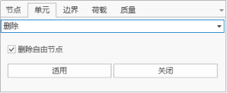

- Input
  - Delete free nodes

    After selecting this option, nodes without attributes (node loads, boundary conditions, etc.) and nodes not associated with elements will be deleted together with the elements.

## 6.4.3 Copy and Move Elements

- Function: Move or copy elements at equal spacing or unequal spacing.
- Command:

  Select "Nodes/Elements" > "Elements" > "Copy/Move" from the main menu.
  Select "Work" > "Elements" > "Table" in the tree menu > right-click select "Copy" on the selected element.

- Input
  - **Numbering Method**

    The numbering of the new node is automatically set to the current maximum element number + 1.
  - **Form**

    Copy: Copy the elements selected in the model window.
    Move: Move the elements selected in the model window.
  - **Node Number Increment**

    When copying (or moving) elements using existing nodes, you can use the node increment.
    Number of copies: Input the number of copies.
  - **Equal Spacing Copy and Move**

    Copy (or move) elements at equal spacing.
    Number of copies: Input the number of copies.
    Spacing (dx, dy, dz): Input the copy (or move) distance on the three global coordinate axes.
  - **Unequal Spacing Copy and Move**

    Copy (or move) elements at unequal spacing.
    Direction: Select the copy (or move) direction.
      x: Copy elements at unequal spacing on the global coordinate system X axis.
      y: Copy elements at unequal spacing on the global coordinate system Y axis.
      z: Copy elements at unequal spacing on the global coordinate system Z axis.
      Arbitrary direction: Copy (or move) elements at unequal spacing in an arbitrary direction.
    Spacing: Input copy distances in sequence in the specified direction. (For example: 5, 3, 4.5, 3\@5.0, 4 = 5, 3, 4.5, 5.0, 5.0, 4)
    Direction vector: If arbitrary direction is selected, input the direction vector components in the x, y, z directions.
  - **Copy Node Attributes**

    Decide whether to copy the attributes of the copied node together (node boundary conditions, node concentrated loads).
  - **Copy Element Attributes**

    Decide whether to copy the attributes of the copied element together (element boundary conditions, element concentrated loads).
  - **Delete Free Nodes**

    When the current operation is move, if this option is selected, the free nodes at the original position will be automatically deleted after the elements are moved.
  - **Cross Splitting**

    Select cross splitting node: If an existing node is on the generated element, the element will be split at the existing node.
    Select cross splitting element: If the generated element intersects with an existing element, a node will be automatically generated at the intersection point and the element will be split.

## 6.4.4 Extend Elements

- Function:

  Create elements by extending dimensions, i.e., extend nodes to line elements, line elements to plane elements, and plane elements to solid elements.
  > **Extended elements have the following functions:**

  > Form line elements from points along a specified path. Form plane elements from line elements along a specified path.
- Command:

  Select "Nodes/Elements" > "Elements" > "Extend" from the main menu.
  Select elements in the model window > "Elements" > "Extend".

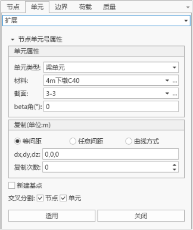

- Input
  - **Numbering Method**

    The numbering of the new node is automatically set to the current maximum element number + 1.
  - **Element Type**

    Specify the type of the elements to be created.
    Line elements: Truss elements, beam elements, tension-only elements, compression-only elements, etc.
    Plane elements: Plate elements, plane stress elements, plane strain elements, axisymmetric elements, etc.
  - **Material and Section**

    - a. **When selecting** "**Beam Elements**", "**Frame Elements**", or "**Cable Elements**":

      Material: Select the material property number, or select the material property name in the defined material property data. Click "…" to add, query, modify, or delete material property data. You can also define the element's material properties after creating the elements.
      Section: Select the section number, or select the section name in the defined section data. Click "…" to add, query, modify, or delete section data. You can also define the element's section properties after creating the elements.
    - b. **When selecting** "**Plate Elements**":

      Material: Select the material property number, or select the material property name in the defined material property data. Click "…" to add, query, modify, or delete material property data. You can also define the element's material properties after creating the elements.
      Thickness: Select the plate thickness number, or select the thickness name in the defined thickness data. Click "…" to add, query, modify, or delete thickness data. You can also define the element's section properties after creating the elements.
      β angle: Specify the β angle of the plate element.
  - **Equal Spacing Copy and Move**

    Copy (or move) elements at equal spacing.
    Number of copies: Input the number of copies.
    Spacing (dx, dy, dz): Input the copy (or move) distance on the three global coordinate axes.
  - **Unequal Spacing Copy and Move**

    Copy (or move) elements at unequal spacing.
    Direction: Select the copy (or move) direction.
      x: Copy elements at unequal spacing on the global coordinate system X axis.
      y: Copy elements at unequal spacing on the global coordinate system Y axis.
      z: Copy elements at unequal spacing on the global coordinate system Z axis.
      Arbitrary direction: Copy (or move) elements at unequal spacing in an arbitrary direction.
    Spacing: Input copy distances in sequence in the specified direction. (For example: 5, 3, 4.5, 3\@5.0, 4 = 5, 3, 4.5, 5.0, 5.0, 4)
    Direction vector: If arbitrary direction is selected, input the direction vector components in the x, y, z directions.

## 6.4.5 Quick Generate Elements

- Command: Select "Nodes/Elements" > "Elements" > "Quick Generate" from the main menu.

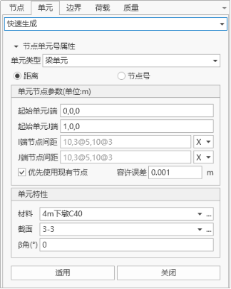

## 6.4.6 Split Elements

- Function: Split the selected elements and create nodes at the splitting points.
- Command: Select "Nodes/Elements" > "Elements" > "Split" from the main menu.

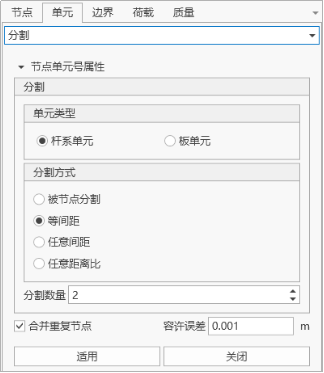

- Input
  - **Numbering Method**

    The numbering of the new node is automatically set to the current maximum element number + 1.
  - **Element Type**

    Specify the type of the elements to be created.
    Line elements: Truss elements, beam elements, tension-only elements, compression-only elements, etc.
    Plane elements: Plate elements (plate elements, plane stress elements, etc.).
  - **Splitting**

    Element type: Specify the element type.
    Line elements: Line elements (frame elements, beam elements, cable elements, etc.).
    Plate elements: Plate elements (plate elements, plane stress elements, etc.).
  - **Splitting Method**

    Split by node: Select the element and nodes. Use the node to split the element into two new elements.
    Equal spacing: Split elements at equal spacing.
    Unequal spacing: Split at unequal spacing.
    Unequal distance ratio: Split elements with different length ratios defined by distance ratio. (For example: 0.4, 0.6, 0.9)

## 6.4.7 Merge Elements

- Function: Merge two or more consecutive line elements into one element.
- Command: Select "Nodes/Elements" > "Elements" > "Merge" from the main menu.

- Input
  - **Merge**

    Currently selected: Merge the elements selected in the model.
    All elements: Merge all line elements contained in the model.
  - **Delete Free Nodes**

    Delete all nodes without attributes and nodes not associated with elements after merging.

## 6.4.8 Cross Split Elements

- Function: Automatically split elements at the intersection points of the previously input line elements (truss, beams, etc.).
- Command: Select "Nodes/Elements" > "Elements" > "Cross Split" from the main menu.

- Input
  - **Numbering Method**

    The numbering of the new node is automatically set to the current maximum element number + 1.
  - **Cross Splitting**

    Currently selected: Cross split the elements selected in the model.
    All elements: Cross split all line elements contained in the model.
  - **Tolerance**

    Input the minimum distance considered as an intersection.

## 6.4.9 Rotate Elements

- Function: Rotate, move, or rotate and copy elements by rotating around a specific axis.
- Command: Select "Nodes/Elements" > "Elements" > "Rotate" from the main menu.

- Input
  - **Numbering Method**

    The numbering of the new node is automatically set to the current maximum element number + 1.
  - **Form**

    Copy: Copy elements.
    Move: Move elements.
  - **Rotation**

    - a. Equal angle: Rotate copy elements with the same angle increment.
      Number of copies: Number of copies.
      Rotation angle: The angle of rotation of the existing element.
        > 0: Rotate copy (or move) elements according to the right-hand rule.
        < 0: Rotate copy (or move) elements in the opposite direction of the right-hand rule.
    - b. Arbitrary angle: Rotate copy elements with different angle increments.
      Rotation angle: Input the rotation angle increments of the copy in sequence. For example: 20, 10, 3\@30, 15 = 20, 10, 30, 30, 30, 15.
  - **Copy Node Attributes**

    Decide whether to copy the attributes of the copied node together (node boundary conditions, node concentrated loads).
  - **Copy Element Attributes**

    Decide whether to copy the attributes of the copied element together (element boundary conditions, element concentrated loads).
  - **Cross Splitting**

    Nodes: If cross splitting is selected and an existing node is on the generated line element, the element will be split at the existing node.
    Elements: If cross splitting is selected and the generated line element intersects with an existing element, a node will be automatically generated at the intersection point and the element will be split.

## 6.4.10 Mirror Elements

- Function: Move or copy elements symmetrically with a specific mirror plane.
- Command: Select "Nodes/Elements" > "Elements" > "Rotate" from the main menu.

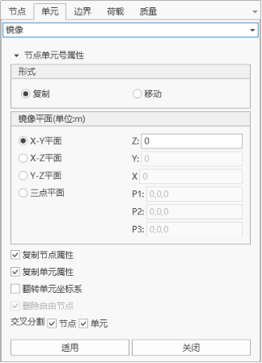

- Input
  - **Numbering Method**

    The numbering of the new node is automatically set to the current maximum element number + 1.
  - **Form**

    Copy: Copy elements.
    Move: Move elements.
  - **Mirror Plane**

    - y-z plane: The mirror plane is parallel to the user coordinate system y-z plane.
      x: The x coordinate of the mirror plane.
    - x-y plane: The mirror plane is parallel to the user coordinate system x-y plane.
      z: The z coordinate of the mirror plane.
    - z-x plane: The mirror plane is parallel to the user coordinate system z-x plane.
      y: The y coordinate of the mirror plane.
    - Plane defined by three points: The mirror plane is an arbitrary plane.
      x1, y1, z1: Define the x, y, z coordinates of the first point of the mirror plane.
      x2, y2, z2: Define the x, y, z coordinates of the second point of the mirror plane.
      x3, y3, z3: Define the x, y, z coordinates of the third point of the mirror plane.
      You can directly key in the three-point coordinates on the keyboard, or click on the corresponding input area and then click on the target node in the model window.
  - **Copy Node Attributes**

    Decide whether to copy the attributes of the copied node together (node boundary conditions, node concentrated loads).
  - **Copy Element Attributes**

    Decide whether to copy the attributes of the copied element together (element boundary conditions, element concentrated loads).
  - **Flip Element Coordinate System**

    When mirror copying or moving elements, select whether to mirror the coordinate system with the reflection plane as the symmetry plane.
    For line elements, the β angle remains unchanged, only changing the node i, j (local coordinate axis direction).
    For plane elements, reverse the node input order during the element generation process.
  - **Delete Free Nodes**

    Delete all nodes without attributes and nodes not associated with elements after merging.
  - **Cross Splitting**

    Nodes: If cross splitting is selected and an existing node is on the generated line element, the element will be split at the existing node.
    Elements: If cross splitting is selected and the generated line element intersects with an existing element, a node will be automatically generated at the intersection point and the element will be split.

## 6.4.11 Element Numbering

- Function: Renumber existing elements (nodes) according to the priority order of the global coordinate system directions.
- Command: Select "Nodes/Elements" > "Elements" > "Element Numbering" from the main menu.

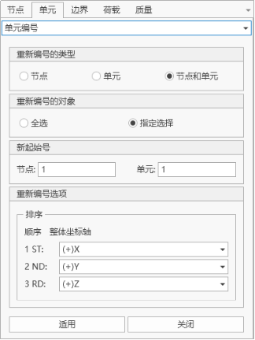

- Input
  - **Renumbering Type**

    Nodes: Renumber node numbers.
    Elements: Renumber element numbers.
    Nodes and Elements: Renumber node and element numbers.
  - **Renumbering Object**

    All select: Select all objects.
    Specify selection: The objects selected by the user.
  - **New Start Number**

    Nodes: New starting node number.
    Elements: New starting element number.
  - **Renumbering Options**

    Sorting: Select the priority of each coordinate axis when sorting.
    When a right-angle coordinate system is selected in the sorting coordinates, the priority order of the global coordinate axes considered for the new node (element) numbering is as follows:
    1ST: The global coordinate axis with the highest priority when selecting to renumber nodes (elements).
    2ND: The axis with the second priority.
    3RD: The remaining axis.

## 6.4.12 Compact Element Numbering

- Function: Eliminate unused element numbers and compact the original element numbers into consecutive element numbers.
- Command: Select "Nodes/Elements" > "Nodes" > "Compact Element Numbering" from the main menu.

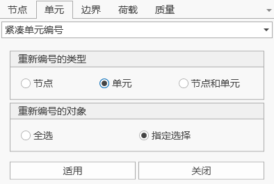

- Input
  - **Renumbering Type**

    Specify the type of numbering. You can choose nodes, elements, or nodes and elements.
  - **Renumbering Object**

    All select: All nodes or elements.
    Specify selection: Select nodes or elements in the model window.

## 6.4.13 Modify Element Parameters

- Command: Select "Nodes/Elements" > "Elements" > "Modify Element Parameters" from the main menu.

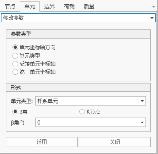

- Input
  - **Parameter Type**

    Select the type of parameters to be modified.
  - **Form**

    Input the specific values to be modified.

## 6.4.14 Element Filtering

- Function: Select elements along the coordinate axis direction in the model.
- Select "Nodes/Elements" > "Elements" > "Element Filtering" from the main menu.

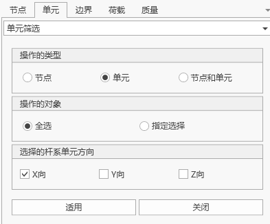

- Input
  - **Operation Type**

    You can choose to filter only nodes, filter only elements, or filter nodes and elements.
  - **Operation Object**

    Select the object for element filtering:
    All select
    Specify selection
  - **Selected Frame Element Direction**

    Select frame elements along each coordinate axis.

## 6.4.15 Mass Coefficient

- Function: Set the mass coefficient of elements.
- Command:

  Select "Nodes/Elements" > "Elements" > "Mass Coefficient" from the main menu.

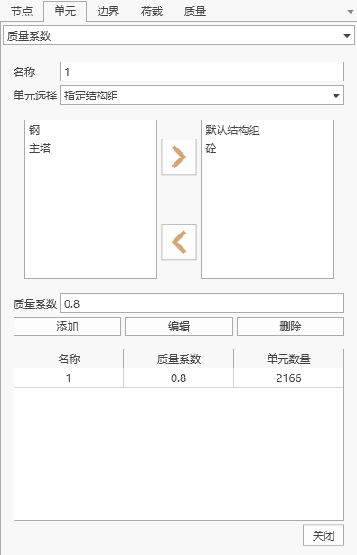

- Input
  - **Element Selection**

    Select the elements for which the mass coefficient is to be set:
    Specify structure group: Select elements by structure group division.
    Specify elements: You can select elements according to the model interface, or directly input element numbers.
  - **Mass Coefficient**

    The set mass coefficient.
  - **Mass Coefficient Table**

    Lists all the set mass coefficients, which can be added, edited, and deleted.

## 6.4.16 Stiffness Coefficient

- Function: Set the stiffness coefficient of elements.
- Command:

  Select "Nodes/Elements" > "Elements" > "Stiffness Coefficient" from the main menu.

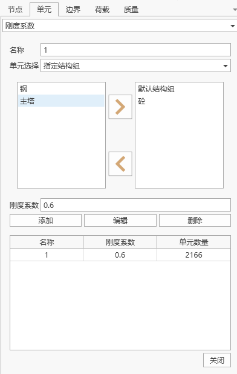

- Input
  - **Element Selection**

    Select the elements for which the stiffness coefficient is to be set:
    Specify structure group: Select elements by structure group division.
    Specify elements: You can select elements according to the model interface, or directly input element numbers.
  - **Stiffness Coefficient**

    The set stiffness coefficient.
  - **Stiffness Coefficient Table**

    Lists all the set stiffness coefficients, which can be added, edited, and deleted.

## 6.4.17 View Element Table

- Command: Select "Nodes/Elements" > "Elements" > "Element Table" from the main menu.

- Table Window Operation
  - ID: Element number
  - I End Node: Element I end node number
  - J End Node: Element J end node number
  - Material: Element's material number
  - Section: Element's section number
  - Beta Angle: Element Beta angle.

# 6.5 **Structure Groups**

A structure group consists of several nodes and elements, used to define the structure of each construction stage of the bridge. Users can define, delete, and modify multiple structure groups. Structure groups cannot have duplicate names.
