## 7.1 Materials

### 7.1.1 Material List

QiaoTong software uses a docked list for centralized management of material creation. The list provides common operations such as Add, Modify, Delete, Compact Numbering, Delete All, and Copy.

- Commands:

  "Main Menu" > "Properties" > "Materials".

  From the tree menu, select "Work" > "Properties" > "Materials".

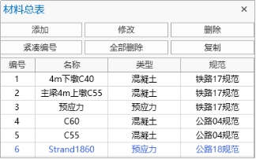

- Operations

  Add: Add a new material.

  Modify: Select the corresponding material in the list to edit or display that material.

  Delete: Select the corresponding material in the list to delete that material.

  Delete All: Delete all materials in the list.

  Compact Numbering: Renumber material IDs starting from 1.

  Copy: Select the material to be copied in the list and click Copy to duplicate it.

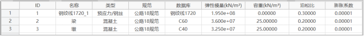

- Table Content

  Material ID: The serial number of the material.

  Material Name: User-defined material name.

  Values: Elastic modulus, Poisson's ratio, linear expansion coefficient, etc.

  Database: Includes basic data for four types of materials: concrete, steel, prestressed, and reinforcement.

### 7.1.2 New Material

- Function: Add material properties.
- Commands:

  "Main Menu" > "Properties" > "Materials" > "Add".

  From the tree menu, select "Work" > "Properties" > "Materials" > "Add Material".

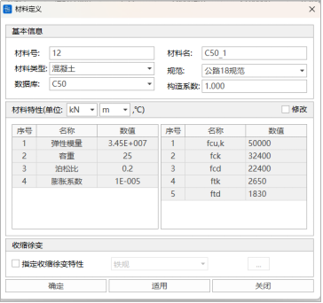

- Input

  **In the Material and Section dialog, enter the following data:**

  Material ID: Define the material number

  Name: Define the material name

  Material Type: Select material type: Concrete, Steel, Prestressed, Reinforcement, or User-defined type.

  Code: Select the code.

  Construction Coefficient: During calculation, the material unit weight will be multiplied by this coefficient.

  Database: Select the material database.

  Values: Elastic modulus, Poisson's ratio, linear expansion coefficient, etc.

### 7.1.3 Shrinkage and Creep

- Function: Define shrinkage and creep.
- Command: "Main Menu" > "Properties" > "Materials" > "Shrinkage and Creep".

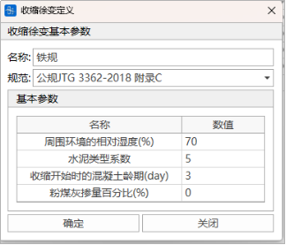

- Input

  **In the Define Shrinkage and Creep dialog, enter the following data:**
  - Name: Shrinkage and creep name
  - Code: Shrinkage and creep code
  - Basic Parameters:

    The creep basic coefficient $\varphi_{f1}$ and creep coefficient calculation parameter $\lambda$ in "Railway Code TB 10092-2017". Refer to Appendix 4 of "Highway Code JTJ 023-85" (see figure below).

    
  - Ultimate Shrinkage Strain:
    - Default is 0.00015, can be manually modified, or enter 0 to let QiaoTong software automatically calculate the ultimate shrinkage strain based on the structural theoretical thickness

### 7.1.4 Material Description

#### 7.1.4.1 Concrete Materials

- Code ASTM
  - American Society for Testing and Materials (ASTM)
  - Includes concrete grades Grade2500-Grade15000, corresponding to design standard strength $f'c$ = 2500lbf ~ 15000lbf, i.e., $f'c$ = 2.5ksi ~ 15ksi.
  - Concrete unit weight is calculated according to Table 7.1.
  - Concrete elastic modulus calculation method:
    - For normal concrete with unit weight $w_{c}=0.145$ kcf and design compressive strength not exceeding 10.0 ksi, $E_{c}$ is calculated according to Equation 7.1:
      $$
      E_{c}=33,000 K_{1} {w_{c}}^{1.5} \sqrt{f_{c}^{\prime}\,} \tag{7.1}
      $$
    - For normal concrete with design compressive strength exceeding 10.0 ksi but not greater than 15.0 ksi, $E_{c}$ is calculated according to Equation 7.2:
      $$
      E_{c}=120,000 K_{1} {w_{c}}^{2.0} {f_{c}^{\prime}}^{0.33} \tag{7.2}
      $$
- Code AASHTO 17/20/24
  - AASHTO LRFD Bridge Design 2017/2020/2024 versions (The American Association of State Highway and Transportation Officials)
  - Includes concrete grades Grade2500-Grade15000, corresponding to design standard strength $f'c$ = 2500lbf ~ 15000lbf, i.e., $f'c$ = 2.5ksi ~ 15ksi.
  - Concrete unit weight is calculated according to Table 7.1.
  - Concrete elastic modulus calculation method:
    - For normal concrete with design compressive strength not greater than 15.0 ksi, $E_{c}$ is calculated according to Equation 7.3:
      $$
      E_{c}=120,000 K_{1} {w_{c}}^{2.0} {f_{c}^{\prime}}^{0.33} \tag{7.3}
      $$

Table 7.1 Unit Weight

| Material                            | Unit Weight (kcf)/Unit Length Weight (klf) |
| ----------------------------- | -------------------- |
| Concrete                           |                      |
| Lightweight concrete                         | 0.110~0.135       |
| Normal concrete ($f'c$ ≤5.0 ksi)      | 0.145                |
| Normal concrete (5.0< $f'c$ ≤15.0 ksi) | 0.140+0.001 $f'c$  |

## 7.2 Sections

### 7.2.1 Section List

- Commands:

"Main Menu" > "Properties" > "Sections".

From the tree menu, select "Work" > "Properties" > "Sections".

- Operations

  Add: Add a new section.

  Modify: Select the corresponding section in the list to edit or display that section.

  Delete: Select the corresponding section in the list to delete that section.

  Delete All: Delete all sections in the list.

  Compact Numbering: Renumber section IDs starting from 1.

  Copy: Select the section to be copied in the list and click Copy to duplicate it.

  Export Dxf: Export the section as a Dxf file.

- Table
  - **Section table properties are defined as follows:**
    | Column Header   | Property            |
    | ----- | ------------- |
    | Section ID   | Section number          |
    | Name    | Section name          |
    | Area    | Section area          |
    | Ix    | Torsional moment of inertia about element local x-axis |
    | Iy    | Moment of inertia about element local y-axis   |
    | Iz    | Moment of inertia about element local z-axis   |
    | z1, y1 | z, y coordinates of corner point 1.    |
    | z2, y2 | z, y coordinates of corner point 2.    |
    | Z3, y3 | z, y coordinates of corner point 3.    |
    | Z4, y4 | z, y coordinates of corner point 4.    |
  - **Section types are divided into:**

    Parametric Section

    Custom Section

    Property Section

    Composite Section

    Composite Beam Section

    Tapered Section

### 7.2.2 Parametric Section

- Function: Define parametric sections.
- Commands:

  From the main menu, select "Properties" > "Sections" > "Add Section" > "General Section" > "Parametric Section".

  From the tree menu, select "Work" > "Sections" > "Add Section" > "General Section" > "Parametric Section".

- Input
  - **Section Type**

    Select the desired section type. Parametric sections include 16 types.

    

    See 4.6.2.1 Basic Section Types, 4.6.2.2 Concrete Section Types, 4.6.2.3 Steel Beam Section Types.
  - **Section ID**

    The new section ID is automatically set to current maximum section ID + 1.
  - **Name**

    Enter the section name.
  - **Geometric Information**

    Enter section geometric information.
  - **Eccentricity**

    Display the current section eccentricity. There are 10 alignment methods: Center, Top Center, Bottom Center, Left Center, Right Center, Top Left, Top Right, Bottom Left, Bottom Right, and User-defined. If User-defined is selected, custom eccentricity coordinates need to be entered.
  - **Consider Shear Deformation**

    Select whether to consider shear deformation.
  - **Mesh Density**

    Enter mesh density
  - **View Section Properties**

    

    
    - A: Cross-sectional area.
      - Basic geometric and position properties
        - Ax: Cross-sectional area (A).
        - Ay: Effective shear area in the element local y-axis direction.
          - When shear deformation is not considered, this property value has no effect.
        - Az: Effective shear area in the element local z-axis direction.
          - When shear deformation is not considered, this property value has no effect.
        - Peri:O: Outer perimeter of the section.
        - Peri:I: Inner perimeter of box or tubular sections.
      - Bending and torsional properties
        - Ix: Torsional moment of inertia about element local x-axis.
        - Iy: Moment of inertia about element local y-axis.
        - Iz: Moment of inertia about element local z-axis.
        - Iyz: Product of inertia in the element local yz-plane.
        - Iw: Warping constant
        - Thw: Web thickness. (Web thickness is used for calculating oblique section shear capacity, shear stress, and principal stress; can be filled as 0 if these items are not checked)
        - Tt: Top slab thickness. (Affects calculation under railway top slab temperature mode; can be filled as 0 if not considered)
        - Cyp: Distance from the neutral axis to the edge fiber along the element local +y-axis direction.
        - Cym: Distance from the neutral axis to the edge fiber along the element local -y-axis direction.
        - Czp: Distance from the neutral axis to the edge fiber along the element local +z-axis direction.
        - Czm: Distance from the neutral axis to the edge fiber along the element local -z-axis direction.
        - Qyb: Shear coefficient along the element local z-axis direction.
        - Qzb: Shear coefficient along the element local y-axis direction.
        - Cent:y: Distance from the leftmost point of the section to the centroid.
        - Cent:z: Distance from the bottommost point of the section to the centroid.
      - Shear properties
        - Shear Center Y: Horizontal distance from shear center to centroid
        - Shear Center Z: Vertical distance from shear center to centroid
        - y1, z1: y, z coordinates of the top-leftmost edge point of the section.
        - y2, z2: y, z coordinates of the top-rightmost edge point of the section.
        - y3, z3: y, z coordinates of the bottom-rightmost edge point of the section.
        - y4, z4: y, z coordinates of the bottom-leftmost edge point of the section.
        - Equivalent Thickness Hys: Equivalent thickness for calculating shear stress along the y-axis direction.
        - Equivalent Thickness Hzs: Equivalent thickness for calculating shear stress along the z-axis direction.
        - Maximum Static Moment about y-axis Sys: Moment of half the section area about the neutral axis, i.e., static moment or area moment (S).
        - Maximum Static Moment about z-axis Szs: Moment of half the section area about the neutral axis, i.e., static moment or area moment (S).

#### 7.2.2.1 Basic Section Types

QiaoTong's built-in basic section types include:

Rectangle, Circle, Circular Tube, Box, Solid Octagon, Hollow Octagon, Inner Octagon, Solid Round-End, Hollow Round-End, Inverted T-shape, T-shape, I-shape.

##### **(1) Rectangle**

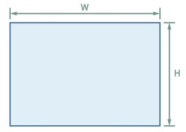

| Parameter | Remarks |
| -- | -- |
| W  | Length  |
| H  | Height  |

##### **(2) Circle**

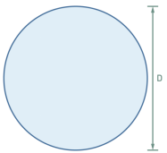

| Parameter | Remarks |
| -- | -- |
| D  | Diameter |

##### **(3) Circular Tube**

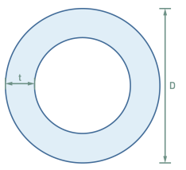

| Parameter | Remarks |
| -- | -- |
| D  | Diameter |
| t  | Wall thickness |

##### **(4) Box**

| Parameter | Remarks  |
| -- | --- |
| W  | Length   |
| H  | Height   |
| dw | Bottom slab width |
| tw | Web thickness |
| tt | Top slab thickness |
| tb | Bottom slab thickness |

##### **(5) Solid Octagon**

| Parameter | Remarks  |
| -- | --- |
| W  | Length   |
| H  | Height   |
| a  | Chamfer height |
| b  | Chamfer width |

##### **(6) Hollow Octagon**

| Parameter | Remarks  |
| -- | --- |
| W  | Length   |
| H  | Height   |
| tw | Web thickness |
| tt | Top slab thickness |
| tb | Bottom slab thickness |
| a  | Chamfer width |
| b  | Chamfer height |

##### **(7) Inner Octagon**

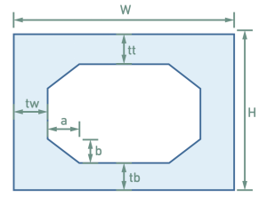

| Parameter | Remarks  |
| -- | --- |
| W  | Length   |
| H  | Height   |
| tw | Web thickness |
| tt | Top slab thickness |
| tb | Bottom slab thickness |
| a  | Chamfer width |
| b  | Chamfer height |

##### **(8) Solid Round-End**

| Parameter | Remarks |
| -- | -- |
| W  | Length  |
| H  | Height  |

##### **(9) Hollow Round-End**

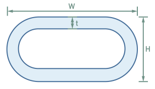

| Parameter | Remarks |
| -- | -- |
| W  | Length  |
| H  | Height  |
| t  | Wall thickness |

##### **(10) T-shape**

| Parameter | Remarks  |
| -- | --- |
| W  | Length   |
| H  | Height   |
| tw | Web thickness |
| tt | Top slab thickness |

##### **(11) Inverted T-shape**

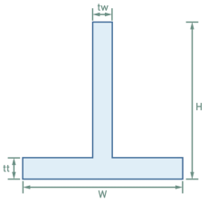

| Parameter | Remarks  |
| -- | --- |
| W  | Length   |
| H  | Height   |
| tw | Web thickness |
| tt | Bottom slab thickness |

##### **(12) I-shape**

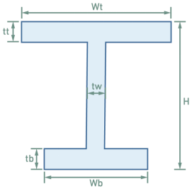

| Parameter | Remarks  |
| -- | --- |
| Wt | Top slab width |
| Wb | Bottom slab width |
| H  | Height   |
| tw | Web thickness |
| tt | Top slab thickness |
| tb | Bottom slab thickness |

#### 7.2.2.2 Concrete Section Types

QiaoTong's built-in concrete section types include:

Horseshoe T-shape, I-shaped Concrete, Concrete Box Beam.

#### **(1) Horseshoe T-shape**

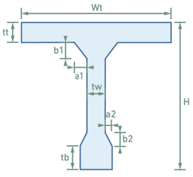

| Parameter | Remarks    |
| -- | ----- |
| W  | Length     |
| H  | Height     |
| tw | Web thickness   |
| tt | Bottom slab thickness   |
| tb | Web bottom variable height |
| a1 | Top slab chamfer width |
| b1 | Top slab chamfer height |
| a2 | Web chamfer width |
| b2 | Web chamfer height |

#### **(2) I-shaped Concrete**

| Parameter | Remarks    |
| -- | ----- |
| Wt | Top slab width   |
| Wb | Bottom slab width   |
| H  | Height     |
| tw | Web thickness   |
| tt | Top slab thickness   |
| tb | Bottom slab thickness   |
| a1 | Top slab chamfer width |
| b1 | Top slab chamfer height |
| a2 | Bottom slab chamfer width |
| b2 | Bottom slab chamfer height |

#### **(3) Concrete Box Beam**

| Parameter    | Remarks       |
| ----- | -------- |
| B     | Total bridge deck width     |
| N     | Number of box cells     |
| H     | Beam height       |
| Symmetric  |          |
| Left Box Data |          |
| i1    | Top slab slope     |
| i2    | Bottom slab slope     |
| B0    | Top slab width      |
| B1    | Cantilever width     |
| B1a   | Cantilever width     |
| B1b   | Cantilever width     |
| B2    | Left web horizontal projection |
| B3    | Edge cell bottom width     |
| B4    | Middle cell bottom width     |
| H1    | Cantilever end height    |
| H2    | Cantilever bottom edge height    |
| H2a   | Cantilever bottom edge height    |
| H2b   | Cantilever bottom edge height    |
| T1    | Top slab thickness      |
| T2    | Bottom slab thickness      |
| T3    | Edge web thickness     |
| T4    | Middle web thickness     |
| R1    | Cantilever root chamfer   |
| R2    | Edge web external bottom chamfer |
| C1    | Edge web top chamfer  |
| C2    | Edge web bottom chamfer  |
| C3    | Middle web top chamfer  |
| C4    | Middle web bottom chamfer  |
| Right Box Data |          |
| i1r   | Top slab slope     |
| i2r   | Bottom slab slope     |
| B0r   | Top slab width      |
| B1r   | Cantilever width     |
| B1ar  | Cantilever width     |
| B1br  | Cantilever width     |
| B2r   | Left web horizontal projection |
| B3r   | Edge cell bottom width     |
| B4r   | Middle cell bottom width     |
| H1r   | Cantilever end height    |
| H2r   | Cantilever bottom edge height    |
| H2ar  | Cantilever bottom edge height    |
| H2br  | Cantilever bottom edge height    |
| T1r   | Top slab thickness      |
| T2r   | Bottom slab thickness      |
| T3r   | Edge web thickness     |
| T4r   | Middle web thickness     |
| R1r   | Cantilever root chamfer   |
| R2r   | Edge web external bottom chamfer |
| C1r   | Edge web top chamfer  |
| C2r   | Edge web bottom chamfer  |
| C3r   | Middle web top chamfer  |
| C4r   | Middle web bottom chamfer  |

> 📌For multi-cell box beams, middle cell bottom width (B4), middle web thickness (T4), top slab width (B0), and top slab slope (i1) **can have multiple values separated by "|"**. When middle cell bottom width (B4) and middle web thickness (T4) are separated by "|", the parameter size is controlled **from both sides of the box beam towards the center**. When top slab width (B0) and top slab slope (i1) are separated by "|", the parameter size is controlled **from the center of the box beam towards both sides**. The number of top slab widths must equal the number of top slab slopes.

#### 7.2.2.3 Steel Beam Section Types

QiaoTong's built-in concrete section types include:

Ribbed Steel Box, Ribbed H-section, Steel Truss Box Beam 1, Steel Truss Box Beam 2, Steel Truss Box Beam 3, Ribbed Steel I-section.

#### **(1) Ribbed Steel Box**

| Parameter  | Remarks    |
| --- | ----- |
| W   | Length     |
| H   | Height     |
| tw  | Web thickness   |
| tt  | Top slab thickness   |
| tb  | Bottom slab thickness   |
| hrt | Top/bottom slab rib height |
| trt | Top/bottom slab rib thickness |
| hrw | Web rib height  |
| trw | Web rib thickness  |
| dh  | Top/bottom slab rib spacing |
| dv  | Web rib spacing  |
| Nh  | Number of web ribs  |
| Nv  | Number of top/bottom slab ribs |

#### **(2) Ribbed H-section**

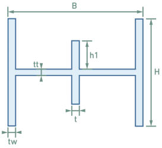

| Parameter | Remarks    |
| -- | ----- |
| H  | Height     |
| B  | Length     |
| tw | Left/right web thickness |
| tt | Transverse web thickness |
| h1 | Web rib height  |
| t  | Web rib thickness  |

#### **(3) Steel Truss Box Beam 1**

| Parameter      | Remarks            |
| ------- | ------------- |
| H       | Height (excluding top and bottom slab cantilevers) |
| B       | Length             |
| W2      | Left cantilever length          |
| W3      | Right cantilever length          |
| h0      | Bottom cantilever height          |
| Tw      | Web thickness           |
| Tt      | Top slab thickness           |
| Tb      | Bottom slab thickness           |
| h1      | Top slab rib height          |
| t       | Top slab rib thickness          |
| h1      | Bottom slab rib height          |
| t       | Bottom slab rib thickness          |
| d1      | Top slab to web rib spacing       |
| n       | Number of web ribs          |
| d       | Web rib spacing          |
| h1      | Web rib height          |
| t       | Web rib thickness          |
| Left web rib position d | Inner/Outer           |
| Right web rib position d | Inner/Outer           |
| d2      | Left cantilever rib spacing         |
| h1      | Left cantilever rib height         |
| t       | Left cantilever rib thickness         |
| b1      | Left cantilever rib top distance       |
| b2      | Left cantilever rib bottom distance       |
| r       | Left cantilever rib chamfer        |
| d3      | Right cantilever rib spacing         |
| h1      | Right cantilever rib height         |
| t       | Right cantilever rib thickness         |
| b1      | Right cantilever rib top distance       |
| b2      | Right cantilever rib bottom distance       |
| r       | Right cantilever rib chamfer        |
| Top/bottom slab rib count   | --            |
| Top/bottom slab rib spacing  | --            |

#### **(4) Steel Truss Box Beam 2**

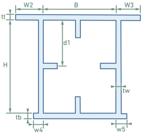

| Parameter     | Remarks        |
| ------ | --------- |
| H      | Height         |
| B      | Length         |
| w2     | Left top cantilever length     |
| w3     | Right top cantilever length     |
| w4     | Left bottom cantilever length     |
| w5     | Right bottom cantilever length     |
| tw     | Web thickness       |
| tt     | Top slab thickness       |
| tb     | Bottom slab thickness       |
| h1     | Top slab rib height      |
| t      | Top slab rib thickness      |
| h1     | Bottom slab rib height      |
| t      | Bottom slab rib thickness      |
| d1     | Distance between top slab and web ribs |
| n      | Number of web ribs      |
| d      | Web spacing       |
| h1     | Web rib height      |
| t      | Web rib thickness      |
| Left web rib position | Inner/Outer       |
| Right web rib position | Inner/Outer       |
| d2     | Left top cantilever rib spacing    |
| h1     | Left top cantilever rib height    |
| t      | Left top cantilever rib thickness    |
| b1     | Left top cantilever rib top distance  |
| b2     | Left top cantilever rib bottom distance  |
| r      | Left top cantilever rib chamfer   |
| d3     | Right top cantilever rib spacing    |
| h1     | Right top cantilever rib height    |
| t      | Right top cantilever rib thickness    |
| b1     | Right top cantilever rib top distance  |
| b2     | Right top cantilever rib bottom distance  |
| r      | Right top cantilever rib chamfer   |
| d4     | Left bottom cantilever rib spacing    |
| h1     | Left bottom cantilever rib height    |
| t      | Left bottom cantilever rib thickness    |
| d5     | Right bottom cantilever rib spacing    |
| h1     | Right bottom cantilever rib height    |
| t      | Right bottom cantilever rib thickness    |
| Top/bottom slab rib count  | --        |
| Top/bottom slab rib spacing | --        |

#### **(5) Steel Truss Box Beam 3**

| Parameter | Remarks    |
| -- | ----- |
| H  | Height     |
| B  | Length     |
| d0 | Top cantilever rib height |
| d1 | Bottom cantilever rib height |
| tw | Web thickness   |
| tt | Top slab thickness   |
| tb | Bottom slab thickness   |
| h1 | Top slab rib height  |
| t  | Top slab rib thickness  |
| h1 | Bottom slab rib height  |
| t  | Bottom slab rib thickness  |
| h1 | Web rib height  |
| t  | Web rib thickness  |

#### **(6) Ribbed Steel I-section**

| Parameter | Remarks        |
| -- | --------- |
| Ht | Top slab length       |
| Hb | Bottom slab length       |
| B  | Middle web height       |
| Tt | Top slab thickness       |
| Tb | Bottom slab thickness       |
| Tw | Web thickness       |
| D1 | Distance between top slab and web ribs |
| n  | Number of ribs        |
| d  | Rib spacing        |
| h1 | Rib height        |
| t  | Rib thickness        |

### 7.2.3 Custom Section

- Function: Define custom sections.
- Commands:

  From the main menu, select "Properties" > "Sections" > "Add Section" > "General Section" > "Custom Section".

  From the tree menu, select "Work" > "Sections" > "Add Section" > "General Section" > "Custom Section".

- Input
  - **Section Type**

    Line loop

    Line width
  - **Section ID**

    The new section ID is automatically set to current maximum section ID + 1.
  - **Name**

    Enter the section name.
  - **Batch Generation**

    Batch generate multiple identical sections.
  - **Eccentricity**

    Display the current section eccentricity. There are 10 alignment methods: Center, Top Center, Bottom Center, Left Center, Right Center, Top Left, Top Right, Bottom Left, Bottom Right, and User-defined. If User-defined is selected, custom eccentricity coordinates need to be entered.
  - **Consider Shear Deformation**

    Select whether to consider shear deformation.
  - **Mesh Density**

    Enter mesh density
  - **View Section Properties**

### 7.2.4 Property Section

- Function: Define custom sections.
- Commands:

  From the main menu, select "Properties" > "Sections" > "Add Section" > "General Section" > "Custom Section".

  From the tree menu, select "Work" > "Sections" > "Add Section" > "General Section" > "Custom Section".

- Input
  - **Section ID**

    The new section ID is automatically set to current maximum section ID + 1.
  - **Name**

    Enter the section name.
  - **Section Properties**

    Enter section property values.
  - **Eccentricity**

    Display the current section eccentricity. There are 10 alignment methods: Center, Top Center, Bottom Center, Left Center, Right Center, Top Left, Top Right, Bottom Left, Bottom Right, and User-defined. If User-defined is selected, custom eccentricity coordinates need to be entered.
  - **Consider Shear Deformation**

    Select whether to consider shear deformation.

### 7.2.5 Composite Section

- Function: Define composite sections.
- Commands:

  From the main menu, select "Properties" > "Sections" > "Add Section" > "Composite Section".

  From the tree menu, select "Work" > "Sections" > "Add Section" > "Composite Section".

- Operations
  - **Section Type**

    Steel pipe concrete
  - **Section ID**

    The new section ID is automatically set to current maximum section ID + 1.
  - **Name**

    Enter the section name.
  - **Geometry**

    Enter section geometric parameters.
  - **Material**

    Enter section material coefficients: elastic modulus ratio, unit weight ratio, Poisson's ratio, expansion coefficient. Or select materials from the database.
    - Es/Ec: Ratio of steel to concrete elastic modulus
    - Ds/Dc: Ratio of steel to concrete unit weight.
    - Ps: Steel beam Poisson's ratio
    - Pc: Concrete Poisson's ratio
    - Ts/Tc: Ratio of steel to concrete thermal expansion coefficient
      
  - **Eccentricity**

    Display the current section eccentricity. There are 10 alignment methods: Center, Top Center, Bottom Center, Left Center, Right Center, Top Left, Top Right, Bottom Left, Bottom Right, and User-defined. If User-defined is selected, custom eccentricity coordinates need to be entered.
  - **Consider Shear Deformation**

    Select whether to consider shear deformation.
  - **View Section Properties**
    > 📌The CentY and CentZ values in the main/auxiliary section properties of a composite section represent the offset of the centroid of the combined section. The CentY and CentZ values of the composite section represent the offset of the centroid from the bottom-left corner of the section bounding box.
- **Composite Section Types**

#### 7.2.5.1 Composite Section Types

There are currently two types in the software: steel pipe concrete and steel box concrete.

#### **(1) Steel Pipe Concrete**

| Parameter | Remarks   |
| -- | ---- |
| D  | Steel pipe diameter |
| t  | Steel pipe wall thickness |

#### **(2) Steel Box Concrete**

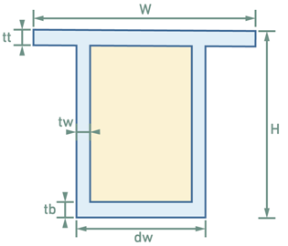

| Parameter | Remarks    |
| -- | ----- |
| W  | Length     |
| H  | Height     |
| dw | Steel box bottom slab width |
| tw | Steel box web thickness |
| tt | Steel box top slab thickness |
| tb | Steel box bottom slab thickness |

### 7.2.6 Composite Beam Section

- Function: Define composite beam sections.
- Commands:

  From the main menu, select "Properties" > "Sections" > "Add Section" > "Composite Beam Section".

  From the tree menu, select "Work" > "Sections" > "Add Section" > "Composite Beam Section".

- Operations
  - **Section Type**

    I-shaped composite beam

    Box-shaped composite beam

    Custom composite beam
  - **Section ID**

    The new section ID is automatically set to current maximum section ID + 1.
  - **Name**

    Enter the section name.
  - **Geometry**

    Enter section geometric parameters.
  - **Material**

    Enter section material coefficients: elastic modulus ratio, unit weight ratio, Poisson's ratio, expansion coefficient. Or select materials from the database.
    - Es/Ec: Ratio of steel to concrete elastic modulus
    - Ds/Dc: Ratio of steel to concrete unit weight.
    - Ps: Steel beam Poisson's ratio
    - Pc: Concrete Poisson's ratio
    - Ts/Tc: Ratio of steel to concrete thermal expansion coefficient
      
  - **Eccentricity**

    Display the current section eccentricity. There are 10 alignment methods: Center, Top Center, Bottom Center, Left Center, Right Center, Top Left, Top Right, Bottom Left, Bottom Right, and User-defined. If User-defined is selected, custom eccentricity coordinates need to be entered.
  - **Consider Shear Deformation**

    Select whether to consider shear deformation.
  - **View Section Properties**
    > 📌The CentY and CentZ values in the main/auxiliary section properties of a composite beam section represent the offset of the centroid of the combined section. The CentY and CentZ values of the composite beam section represent the offset of the centroid from the bottom-left corner of the section bounding box.
  - **Custom Composite Beam Section**

    Enter the number of blocks, draw the main material and auxiliary material parts in the graphic view, then click

    

    Define geometry and materials for the main and auxiliary materials. After clicking, select line segments in the drawing window with the left mouse button, then right-click to complete the selection.

    

#### 7.2.6.1 Composite Beam Section Types

There are currently two types in the software: I-shaped composite beam and steel box concrete.

#### **(1) I-shaped Composite Beam**

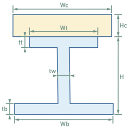

| Parameter | Remarks    |
| -- | ----- |
| Wc | Auxiliary material length   |
| Hc | Auxiliary material height   |
| Wt | Main material top slab width |
| Wb | Main material bottom slab width |
| H  | Main material height   |
| tw | Main material web thickness |
| tt | Main material top slab thickness |
| tb | Main material bottom slab thickness |

#### **(2) Steel Box Concrete**

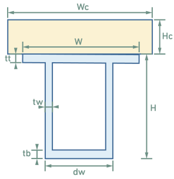

| Parameter | Remarks    |
| -- | ----- |
| Wc | Auxiliary material length   |
| Hc | Auxiliary material height   |
| W  | Main material length   |
| dw | Main material bottom slab width |
| H  | Main material height   |
| tw | Main material web thickness |
| tt | Main material top slab thickness |
| tb | Main material bottom slab thickness |

### 7.2.7 Tapered Section

- Commands:

  "Main Menu" > "Properties" > "Sections" > "Tapered Section".

  From the tree menu, select "Work" > "Properties" > "Sections" > "Tapered Section".

- Operations
  - **Section ID**

    The new section ID is automatically set to current maximum section ID + 1.
  - **Name**

    Enter the section name.
  - **Section Type**

    Parametric Section

    Custom Section
  - **Section Shape**

    Enter section geometric shape. If it's a custom section, select line loop or line width section.
  - **Variation Coefficient Value**

    When the variation coefficient = 1, it represents linear variation along the element local x-axis direction; when the variation coefficient = 2, it represents parabolic variation along the element local x-axis direction.

    Taking a rectangular beam section as an example, if the height H varies according to a 1.8-degree parabola $H=Ax^{1.8}+Bx+C$, and the section width L remains constant, the weak axis moment of inertia $H\times$$L^{3}/12$ will also vary according to a 1.8-degree parabola.
  - **Consider Shear Deformation**

    Select whether to consider shear deformation.
  - **Auto Sort**

    Select whether to automatically sort. Auto-sorting defaults to using the longest line segment at the I-end as the first segment. The corresponding J-end first segment defaults to the segment closest to the I-end (and with the same width as the I-end first segment). Users can determine the sorting rule by changing the width of the longest line segment at the I-end and the width of the corresponding segment at the J-end (adding 0.1mm does not affect section properties), thereby ensuring that the first segments correspond when sorting at the I-end and J-end.

### 7.2.7 Tapered Section Group

- Function: Group elements with the same tapered section. The I and J ends of the original tapered section become the I and J ends of the tapered section group, and the software automatically calculates the section property values of elements within the tapered section group.
- Command: From the main menu, select "Properties" > "Tapered Section Group".

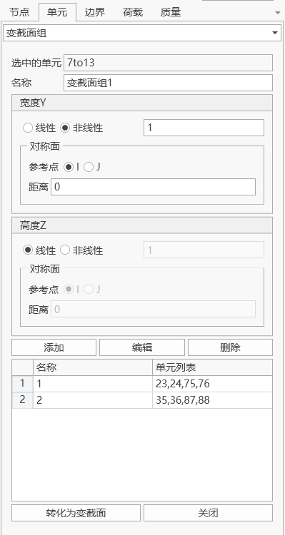

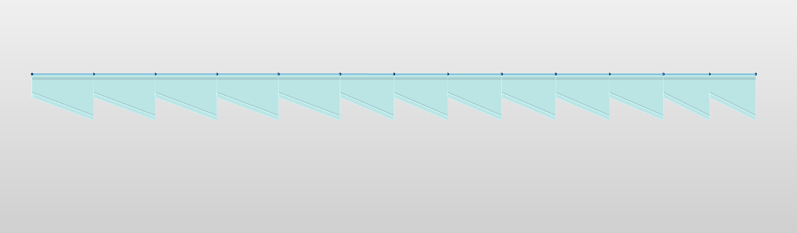

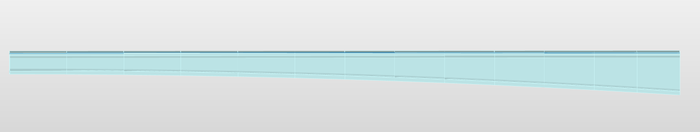

- Operations
  - **Selected Elements**

    Select in the model window.
  - **Name**

    Enter the section group name.
  - **Width Y, Height Z**
    - Linear: Linear variation.
    - Nonlinear: Curve variation according to the number filled on the right. Example: enter 2 for quadratic curve variation.
    - Symmetry Plane:

      The position where the tangent of the section variation curve is parallel to the element coordinate system x-axis can be represented by the distance from the reference point.
      - Reference Point: Select whether the reference point is the I-end or J-end.
      - Distance: The distance along the element coordinate system x-axis from the reference point to the symmetry plane.
      > 🧐Note: If you need to define a nonlinear curve, three non-collinear known points are required. The symmetry plane position is the third point position of the nonlinear curve (I and J ends are known).
  - **Add**

    Add a new tapered section group.
  - **Edit**

    Edit the tapered section selected in the tapered section group list.
  - **Delete**

    Delete the tapered section group.
  - **Convert to Tapered Section**

    The software will generate new tapered sections based on the number of elements in the tapered section group and the interpolated section property values calculated by the software for the tapered section group. After the tapered section group is converted to a tapered section, the tapered section group information will be automatically deleted.

### 7.2.7 Parametric Tapered Section Group

- Function: QiaoTong supports the function of forming **parametric tapered section groups** for **parametric section types** (custom line loop sections and custom line width sections are not yet supported). Users can modify the **parameter dimensions** of sections within the tapered section group according to **linear or nonlinear laws**.
- Command: From the main menu, select "Properties" > "Parametric Tapered Section Group".

To generate a parametric tapered section group, follow the process below:

- Select group elements

  Select elements to be included in the tapered section group according to design requirements. Note: All elements within the tapered section group must be **the same tapered section**. After selecting elements, the **Section Type** in the left operation panel will automatically identify the current tapered section type. If the section type is empty, parametric tapered section groups cannot be added for this type of section.

  
- Select parameters to change dimensions based on element section

  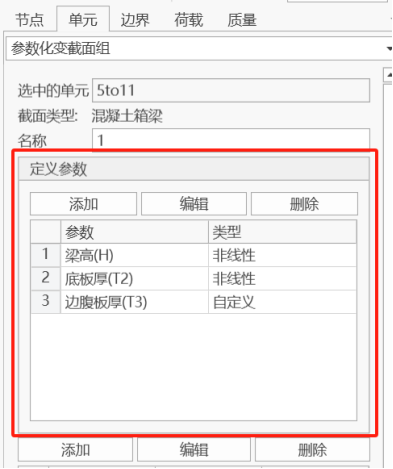

  Select "Add" at "Define Parameters" to open the "Define Parameter Variation Trend" panel. Select the parameters that need to change dimensions. The parameter names will be automatically determined based on the current tapered section's dimensional parameters.

  

  There are two ways to define the variation trend of parameter values: **Nonlinear** and **Custom**.

  **Nonlinear**: Parameters show a nonlinear variation trend. For example, in this case, the beam height needs to show a quadratic variation trend from the support point to the zero block, so enter 2 for the exponent, enter I-end for the reference point, and enter 0 for the distance.

  

  **Custom**: Parameters show a linear variation trend. For example, in this case, the edge web thickness T3 changes from 13.05m at the starting I-end of the tapered section group to 0.48m thickness, then to 0.7m thickness after 3m. Fill in the variation trend according to the table in the figure.

  
- Click Add

  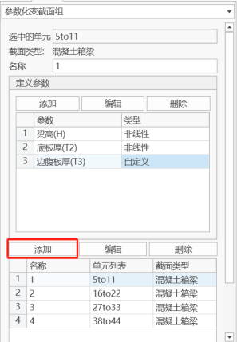

  After completing the parameter definition, you can add a tapered section group. Four parametric tapered section groups have been added in the figure.

  **Note**: If the section dimensions of a certain parametric tapered section group need to change, select that group in the list. The software will automatically select the related elements and display their group parameters. After editing the parameters in "Define Parameters" according to requirements, click "Edit" to complete the editing of the parametric tapered section group.

### 7.2.7 Query Section

- Function: Query section information.
- Command: From the main menu, select "Properties" > "Query Section".

Click on the element to be queried in the model view to quickly view the section preview of the selected element. If it's a tapered section, the preview window will display the I (left) and J (right) end section previews, and the text area will display basic section information.

## 7.3 Plate Thickness

In QiaoTong, there are two ways to define plate element thickness: normal plate thickness and stiffened plate thickness.

### 7.3.1 Normal Plate Thickness

When plate elements use normal plate thickness, the plate element is a normal plate.

### 7.3.2 Stiffened Plate Thickness

When plate elements use stiffened plate thickness, the plate element is an orthotropic plate element. The plate element has stiffeners in both transverse and longitudinal sections. Currently, U-shaped stiffeners and T-shaped stiffeners are provided.

For the torsional stiffness Ix of U-shaped stiffeners, the torsional stiffness of thin-walled closed tubular sections is used for correction with the formula:

$$
I_{x}=\frac{4 A^{2}}{\oint d_{s} / t}
$$

Where A is the area of the closed tubular section, $\oint d_{s}$ is the perimeter of the centerline of the thin-walled section, and t is the thickness.

When converting to the calculation model, plate elements with stiffened plate thickness will undergo the following transformation:

(1) Orthotropic plate elements consist of normal plate elements and equivalent beam elements;

(2) Number of stiffeners $N$, where $length$ is the side length of the plate element and $space$ is the stiffener spacing:

$$
N=\frac{\text { length }}{\text { space }} \text{(rounded down)}
$$

(3) Single stiffener section properties are $A_{0 x}, \quad I_{0 x}, \quad I_{0 y}, \quad I_{0 z}, \quad Cent Y, \quad CentZ$

(4) Beam element section equivalence:

$$
\begin{array}{c}\\A_{x}=\left(N \times A_{0 x}\right) / 2 \\\\I_{x}=\left(N \times I_{0 x}\right) / 2 \\\\I_{y}=\left(N \times I_{0 y}\right) / 2 \\\\I_{z}=\sum_{i}^{N}\left(I_{0 z}+A_{0 z} \times d_{i}^{2}\right) / 2\\\\\text{Section eccentricity} (CentY, CentZ)\\\end{array}
$$

Where $d_i$ is the horizontal distance from the $i$-th stiffener to the plate center position.

### 7.3.3 Thickness Table

In the thickness table, you can modify the ID, name, and thickness information of already added thicknesses. You can also batch add thickness information through table paste operations.

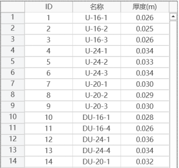
