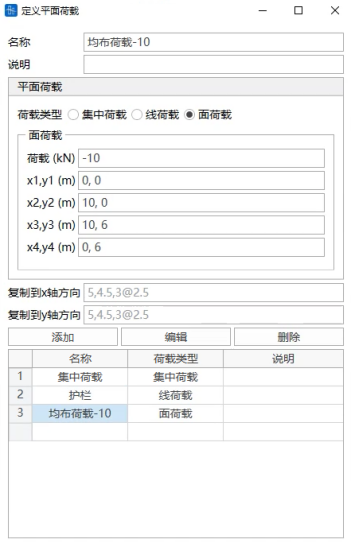
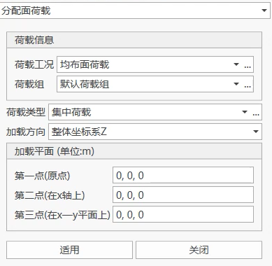

## 9.1 Load Cases

- Function: Add new load cases, modify or delete previously defined load cases.
- Commands:

  From the main menu, select "Loads" > "Static Loads" > "Load Cases";

  From the tree menu, select "Groups" > "Load Groups":

- Input
  - **Name**

    The name of the current load case.
  - **Type**
    - Select the load type from the static load case type list.
    - **The load case types are as follows:**

      Construction stage load

      Dead load

      Live load

      Braking force

      Wind load

      System temperature load

      Gradient temperature load

      Long-rail expansion and deflection force load

      Derailment load

      Ship impact load

      Vehicle impact load

      Long-rail breakage force load

      User-defined load
  - **Suffix**

    The suffix of the current load case name. The actual name of the current load case is composed of name + suffix. Only numbers are supported, and load cases can be batch generated using 3To12By2 notation.
  - **Operations**

    Add: Input a new load case definition.

    Modify: Modify a previously input load case definition.

    Delete: Delete a previously input load case definition.

## 9.2 Load Groups

- Function: Add new load groups, modify or delete previously defined load groups.
- Commands:

  From the main menu, select "Loads" > "Static Loads" > "Load Groups";

- Input
  - **Name**

    The name of the current load group.
  - **Suffix**

    The suffix of the current load group name. The actual name of the current load group is composed of name + suffix. Only numbers are supported, and load groups can be batch generated using 3To12By2 notation.
  - **Operations**

    Add: Input a new load group definition.

    Modify: Modify a previously input load group definition.

    Delete: Delete a previously input load group definition.

## 9.3 Static Loads

### 9.3.1 Self-weight

- Function: Structural self-weight is considered during construction stage settings.
- Commands:

  From the main menu, select "Loads" > "Construction Stages" > "Define Construction Stages";

  

- **Self-weight Calculation Stages**

  Self-weight load has three forms: no self-weight, this stage self-weight, subsequent stage self-weight.
  1. No self-weight: Only considers structural stiffness, does not consider structural mass;
  2. This stage self-weight: Considers both structural stiffness and structural mass;
  3. Subsequent stage self-weight: This stage considers structural stiffness, and subsequent stages consider structural mass.

### 9.3.2 Node Loads

- Function: Input concentrated loads (concentrated forces and moments) acting on nodes, modify or delete previously input node loads.
- Commands:

  From the main menu, select "Loads" > "Static Loads" > "Node Loads";

- Input
  - **Load Case**

    Select the load case to which the node load belongs. When you need to add and edit load cases, you can click the "..." button on the right to pop up the "Load Case Definition" dialog.
  - **Load Group**

    Select the load group to which the node load belongs. When you need to add and edit load groups, you can click the "..." button on the right to pop up the "Load Group Definition" dialog.
  - **Coordinate System**

    If the node load selects a node coordinate system and a node coordinate system is defined, then the node load is applied according to the node coordinate system; otherwise, it is applied according to the global coordinate system.
  - **Load Values**

    Input the node concentrated load based on the global coordinate system.

    FX: Component of the concentrated load in the X-axis direction of the selected coordinate system.

    FY: Component of the concentrated load in the Y-axis direction of the selected coordinate system.

    FZ: Component of the concentrated load in the Z-axis direction of the selected coordinate system.

    MX: Component of the node moment about the X-axis of the selected coordinate system.

    MY: Component of the node moment about the Y-axis of the selected coordinate system.

    MZ: Component of the node moment about the Z-axis of the selected coordinate system.
  - **Operations**

    Add: Add a new node load.

    Replace: Modify the node load of the selected node in that load case and load group.

    Delete: Delete all node loads of the selected node in that load case and load group.

### 9.3.3 Forced Displacement

- Function: Input forced displacement, modify or delete previously input forced displacement.
- Commands:

  From the main menu, select "Loads" > "Static Loads" > "Forced Displacement";

- Input
  - **Load Case**

    Select the load case to which the forced displacement belongs. When you need to add and edit load cases, you can click the "..." button on the right to pop up the "Load Case Definition" dialog.
  - **Load Group**

    Select the load group to which the forced displacement belongs. When you need to add and edit load groups, you can click the "..." button on the right to pop up the "Load Group Definition" dialog.
  - **Displacement Values**

    Input the forced displacement based on the global coordinate system.

    Dx: Component of the forced displacement in the global coordinate system or node local coordinate system X-axis direction.

    Dy: Component of the forced displacement in the global coordinate system or node local coordinate system Y-axis direction.

    Dz: Component of the forced displacement in the global coordinate system or node local coordinate system Z-axis direction.

    Rx: Component of the forced rotation angle about the global coordinate system or node local coordinate system X-axis direction.

    Ry: Component of the forced rotation angle about the global coordinate system or node local coordinate system Y-axis direction.

    Rz: Component of the forced rotation angle about the global coordinate system or node local coordinate system Z-axis direction.

    If a node coordinate system is set at that node position, then the forced displacement is the displacement component under the node coordinate system; otherwise, it is the displacement component under the global coordinate system.
  - **Operations**

    Add: Add a new forced displacement.

    Replace: Modify the forced displacement of the selected node in that load case and load group.

    Delete: Delete all forced displacements of the selected node in that load case and load group.

### 9.3.4 Beam Element Loads

- Function: Input loads (concentrated loads, concentrated moments, distributed loads, distributed moments, gradient loads, gradient moments) acting on beam elements, modify or delete previously input beam element loads.
- Commands:

  From the main menu, select "Loads" > "Static Loads" > "Beam Element Loads";

- Input
  - **Load Case**

    Select the load case to which the beam element load belongs. When you need to add and edit load cases, you can click the "..." button on the right to pop up the "Load Case Definition" dialog.
  - **Load Group**

    Select the load group to which the beam element load belongs. When you need to add and edit load groups, you can click the "..." button on the right to pop up the "Load Group Definition" dialog.
  - **Load Type**

    - The load types are:

      Concentrated load: Concentrated load at a certain point of the element;

      Concentrated moment: Concentrated moment at a certain point of the element;

      Distributed load: Uniformly distributed force;

      Distributed moment: Uniformly distributed moment;

      Gradient load: Gradient load varying linearly along the beam element length direction;

      Gradient moment: Gradient moment varying linearly along the beam element length direction;
  - **Coordinate System**

    - Loading position options:

      Global coordinate system X: Beam element load acts on the global coordinate system X-axis direction.

      Global coordinate system Y: Beam element load acts on the global coordinate system Y-axis direction.

      Global coordinate system Z: Beam element load acts on the global coordinate system Z-axis direction.

      Local coordinate system x: Beam element load acts on the element local coordinate system x-axis direction.

      Local coordinate system y: Beam element load acts on the element local coordinate system y-axis direction.

      Local coordinate system z: Beam element load acts on the element local coordinate system z-axis direction.

    - If the input load direction is inconsistent with the above six directions, you can control the beam element load direction by inputting the load component in each direction after considering the positive or negative sign.
  - **Load Values**

    - Input method:

      Relative value: Input the loading position of the beam element load as a relative proportion to the beam element length;

      Absolute value: Input the loading position of the beam element load as the actual length of the beam element;
  > 🧐**Note**: The default method for beam element loads is at the element centroid. If you need to apply loads at other positions of the element, please set the eccentricity.
  - Operations

    Add: Add a new beam element load.

    Replace: Modify the beam element load of the selected beam element in that load case and load group.

    Delete: Delete all beam element loads of the selected beam element in that load case and load group.

### 9.3.5 Plate Element Loads

- Function: Input loads (concentrated forces, concentrated moments, distributed forces, distributed moments) acting on plate elements, modify or delete previously input plate element loads.
- Commands:

  From the main menu, select "Loads" > "Static Loads" > "Plate Element Loads";

- Input
  - **Load Case**

    Select the load case to which the plate element load belongs. When you need to add and edit load cases, you can click the "..." button on the right to pop up the "Load Case Definition" dialog.
  - **Load Group**

    Select the load group to which the plate element load belongs. When you need to add and edit load groups, you can click the "..." button on the right to pop up the "Load Group Definition" dialog.
  - **Load Type**

    - The load types are:

      Concentrated force: Concentrated load at a certain point of the element;

      Concentrated moment: Concentrated moment at a certain point of the element;

      Distributed force: Uniformly distributed force;

      Distributed moment: Uniformly distributed moment;
  - **Loading Position**

    - Loading position options:

      Face IJKL

      Edge IJ

      Edge JK

      Edge KL

      Edge LI
  - **Coordinate System**

    - Loading position options:

      Global coordinate system X: Plate element load acts on the global coordinate system X-axis direction.

      Global coordinate system Y: Plate element load acts on the global coordinate system Y-axis direction.

      Global coordinate system Z: Plate element load acts on the global coordinate system Z-axis direction.

      Local coordinate system x: Plate element load acts on the element local coordinate system x-axis direction.

      Local coordinate system y: Plate element load acts on the element local coordinate system y-axis direction.

      Local coordinate system z: Plate element load acts on the element local coordinate system z-axis direction.

    - If the input load direction is inconsistent with the above six directions, you can control the plate element load direction by inputting the load component in each direction after considering the positive or negative sign.
  - **Load Values**

    You can input load values using uniform or linear variation methods;
  - **Operations**

    Add: Add a new plate element load.

    Replace: Modify the plate element load of the selected plate element in that load case and load group.

    Delete: Delete all plate element loads of the selected plate element in that load case and load group.

### 9.3.6 Plane Loads

#### 9.3.6.1 Define Plane Load Types

- Function: Define plane loads based on input data, modify or delete previously predefined plane load types
- Commands:

  From the main menu, select "Loads" > "Static Loads" > "Assign Plane Loads" > "Define Plane Load Types";

  

- Input
  - **Name**

    Define the plane load name
  - **Description**

    You can input a brief description of the plane load
  - **Load Type**

    Select the tension method of initial tension force: total or incremental
    Select the load type from concentrated, line, and surface loads
    (1) Concentrated load

    **x, y:** Coordinates of the concentrated load in the plane coordinate system (the loading plane in the assign plane loads dialog is determined by defining the origin point and related data of x and y axes)

    **F:** Magnitude of the concentrated load

    (2) Line load

    Load: Magnitude of the load within the loading position

    **x1, y1:** Starting point coordinates of the line load in the plane coordinate system.

    **x2, y2:** Ending point coordinates of the line load in the plane coordinate system.

    (3) Surface load

    **Load:** Magnitude of the load at the corner points of the loading area

    **x1, y1:** Define the coordinates of the first point required to define the loading area

    **x2, y2:** Define the coordinates of the second point required to define the loading area

    **x3, y3:** Define the coordinates of the third point required to define the loading area

    **x4, y4:** Define the coordinates of the fourth point required to define the loading area
  - **Copy to X-axis direction**

    Copy the defined plane load along the plane coordinate system X-axis direction, input the copy spacing.
  - **Copy to Y-axis direction**

    Copy the defined plane load along the plane coordinate system Y-axis direction, input the copy spacing.
  - **Operations**

    Add: Add a new plane load type.

    Edit: Modify the selected plane load type.

    Delete: Delete the selected plane load type.

#### 9.3.6.2 Assign Plane Loads

- Function: Plane loads are used to assign user-defined plane load types on plate elements. After defining the load type and magnitude in the define plane load types, loading is performed by selecting the loading position in the assign plane load types.
- Commands:

  From the main menu, select "Loads" > "Static Loads" > "Assign Plane Loads" > "Assign Plane Loads";

  

- Input
  - **Load Case**

    Select the load case to which the plane load belongs. When you need to add and edit load cases, you can click the "..." button on the right to pop up the "Load Case Definition" dialog.
  - **Load Group**

    Select the load group to which the initial tension force belongs. When you need to add and edit load groups, you can click the "..." button on the right to pop up the "Load Group Definition" dialog.
  - **Load Type**

    Select the load type defined in the define plane load types. When you need to add and edit plane load types, you can click the "..." button on the right to pop up the "Plane Load Type Definition" dialog.
  - **Loading Direction**

    Determine the direction of the plane load.
  - **Loading Plane**

    Define the loading plane coordinate system.

    **First Point (Origin Point):** Global coordinate system coordinates of the origin point of the plane coordinate system.

    **Second Point (on X-axis):** Global coordinate system coordinates of any point on the plane coordinate system X-axis.

    **Third Point (on X-Y plane):** Coordinates of any point on the plane coordinate system X-Y plane.

### 9.3.7 Initial Tension Force

- Function: Input initial tension force of link/cable elements (prestressing load), modify or delete previously input initial tension force.
- Commands:

  From the main menu, select "Loads" > "Static Loads" > "Initial Tension Force";

- Input
  - **Load Case**

    Select the load case to which the initial tension force belongs. When you need to add and edit load cases, you can click the "..." button on the right to pop up the "Load Case Definition" dialog.
  - **Load Group**

    Select the load group to which the initial tension force belongs. When you need to add and edit load groups, you can click the "..." button on the right to pop up the "Load Group Definition" dialog.
  - **Tension Method**

    Select the tension method of the initial tension force: total or incremental
  - **Load Value**

    Input the initial tension force value;
  - **Operations**

    Add: Add a new initial tension force.

    Replace: Modify the selected initial tension force in that load case and load group.

    Delete: Delete all initial tension forces of the selected initial tension force in that load case and load group.

### 9.3.8 Cable Length Tension

- Function: Input the unstressed cable length of link elements or cable elements to achieve the effect of applying initial tension force. Modify or delete previously input unstressed cable length.
- Commands:

  From the main menu, select "Loads" > "Static Loads" > "Cable Length Tension";

- Input
  - **Load Case**

    Select the load case to which the cable length tension belongs. When you need to add and edit load cases, you can click the "..." button on the right to pop up the "Load Case Definition" dialog.
  - **Load Group**

    Select the load group to which the cable length tension belongs. When you need to add and edit load groups, you can click the "..." button on the right to pop up the "Load Group Definition" dialog.
  - **Tension Method**

    Select the tension method of the initial tension force: total or incremental
  - **Table Input**

    ID: The link or cable element number selected by the user;

    Length: The unstressed cable length of the element.
  - **Notes**

    Only cable elements can perform cable length tension.
  - **Operations**

    Add: Add a new unstressed cable length.

    Replace: Modify the unstressed cable length of the specified load case and load group.

    Delete: Delete all unstressed cable lengths of the specified load case and load group.
  - Special Instructions

    - There are two types of elements in the software that can simulate stay cables: link elements and cable elements.

      - For link elements:

        Can be subjected to both tension and compression, sag effect is not considered, i.e., self-weight is not included in the element internal force. Whether using linear calculation or nonlinear calculation, the internal forces at the I-end and J-end of the link element are always the same.

      - For cable elements

        - **Linear calculation**: Equivalent to a tension-only link element with elastic modulus corrected by Ernst formula, only tension, self-weight is included in the element internal force;

        - **Nonlinear calculation**: Cable element is a catenary element, can only be tension, cannot be subjected to compression, bending, or torsion. Cable elements need to have initial parameters (unstressed cable length, horizontal tension force, or J-end tension force). If the initial parameters are 0, then the default unstressed length is equal to the geometric length of the stay cable element.
  > 🧐Whether cable elements use linear calculation or nonlinear calculation, the cable forces at both ends are along the tangent direction.
  - **Cable Force Tension**

      Two methods:

        (1) Apply initial tension force load (external force) in the construction stage. The cable force tension value can be the element average tension force, I-end tension force, or J-end tension force. There are two methods: increment and total;

        (2) Set horizontal tension force or J-end tension force (internal force) in the cable element initial parameters.
    - **Cable Length Tension**

      Two methods:

        (1) Apply cable length load in the construction stage. There are two methods: increment and total;

        (2) Set unstressed cable length in the cable element initial parameters.

### 9.3.9 Cable Force Tension

- Function: Apply initial tension force to cable elements in the construction stage to simulate the cable force effect generated by tensioning equipment in actual structures. This function can be used to add, modify, or delete previously input cable force loads.
- Commands:

  From the main menu, select "Loads" > "Static Loads" > "Cable Force Tension";

  

- Input
  - **Load Case**

    Select the load case to which the cable force tension belongs. When you need to add or edit load cases, you can click the "..." button on the right to pop up the "Load Case Definition" dialog.
  - **Load Group**

    Select the load group to which the cable force tension belongs. When you need to add or edit load groups, you can click the "..." button on the right to pop up the "Load Group Definition" dialog.
  - **Tension Method**

    Select the application method of the cable force. Options include:

    - **Total**: Directly input the total tension force;

    - **Increment**: Add the specified tension force on top of existing cable forces.
  - **Table Input**

    - **ID**: The cable element number selected by the user;

    - **Cable Force**: Input the tension force value corresponding to each element. Can be specified as the element average tension force, I-end tension force, or J-end tension force.
  - **Tension Value (Unit: kN)**

    Input the tension force value of the cable element. Can be specified as the element average tension force, I-end tension force, or J-end tension force.
  - Special Instructions

    - **Cable Stiffness Participation Coefficient** is a dimensionless parameter used to describe **the degree of influence of the axial stiffness of the stay cable on the relationship between the tension force at the tension end and the cable elongation** during the tensioning process.

    - The value of **Cable Stiffness Participation Coefficient** is between **0 and 1**.
  - **Table Input**

    - **ID**: The cable element number selected by the user;

    - **Cable Force**: Input the tension force value corresponding to each element.

    ***

### 9.3.10 Manufacturing Deviation Parameter Definition

- Function: Define manufacturing deviation parameters for link elements, beam elements, and plate elements, modify or delete previously input manufacturing deviation parameters. Note: The software currently does not support cable element manufacturing deviation analysis.
- Commands:

  From the main menu, select "Loads" > "Static Loads" > "Manufacturing Deviation" > "Link/Beam Element Manufacturing Deviation Parameter Definition" or "Plate Element Manufacturing Deviation Parameter Definition";

- Input
  - **Name**

    The name of this element manufacturing deviation parameter definition.
  - **Deviation Values**

    - **Link/Beam element manufacturing deviation includes 7 items:**

      1. Axial deviation

      2. I-end X-axis rotation angle deviation

      3. I-end Y-axis rotation angle deviation

      4. I-end Z-axis rotation angle deviation

      5. J-end X-axis rotation angle deviation

      6. J-end Y-axis rotation angle deviation

      7. J-end Z-axis rotation angle deviation
    - **Plate element manufacturing deviation includes 5 items:**

      1. X-axis displacement deviation

      2. Y-axis displacement deviation

      3. Z-axis displacement deviation

      4. X-axis rotation angle deviation

      5. Y-axis rotation angle deviation
    > 🧐All the above deviation values should be defined under the element local coordinate system. Displacement is positive when consistent with the positive direction of the element coordinate axis. The determination of the positive or negative sign of rotation angle follows the right-hand screw rule.
  - **Operations**

    Add: Add a new manufacturing deviation parameter definition.

    Modify: Modify the parameters of the selected manufacturing deviation parameter definition.

    Delete: Delete the selected manufacturing deviation parameter definition.
    Close: Close this page.

### 9.3.11 Manufacturing Deviation

- Function: Add manufacturing deviations for link/beam and plate elements, modify or delete previously input manufacturing deviations.
- Commands:

  From the main menu, select "Loads" > "Static Loads" > "Manufacturing Deviation" > "Link/Beam Element Manufacturing Deviation" or "Plate Element Manufacturing Deviation";

- Input
  - **Load Case**

    Select the load case to which the initial tension force belongs. When you need to add and edit load cases, you can click the "..." button on the right to pop up the "Load Case Definition" dialog.
  - **Load Group**

    Select the load group to which the initial tension force belongs. When you need to add and edit load groups, you can click the "..." button on the right to pop up the "Load Group Definition" dialog.
  - **Manufacturing Deviation**

    - Link/Beam elements:

      Select the previously defined link/beam element manufacturing deviation parameters. When you need to add and edit link/beam element manufacturing deviation parameters, you can click the "..." button on the right to pop up the "Link/Beam Element Manufacturing Deviation Parameter Definition" dialog.
    - Plate elements:

      Set the manufacturing deviations at J, J, K, and L four points respectively, and select the previously defined plate element manufacturing deviation parameters. When you need to add and edit plate element manufacturing deviation parameters, you can click the "..." button on the right to pop up the "Plate Element Manufacturing Deviation Parameter Definition" dialog.
  - **Operations**

    Add: Add a new manufacturing deviation.

    Replace: Modify the selected manufacturing deviation in that load case and load group.

    Delete: Delete all selected manufacturing deviations in that load case and load group.

> 📌Manufacturing deviation loads cannot be calculated as operation stage loads, and can only be added and viewed as results in construction stages.

## 9.4 Dynamic Loads

### 9.4.1 Node Mass

- Function: Input node mass, modify or delete previously input node mass.
- Commands:

  From the main menu, select "Loads" > "Dynamic Loads" > "Node Mass";

- Input
  - **Load Value**

    Input the node mass based on the global coordinate system.

    m: Components of the node mass in the global coordinate system X, Y, and Z-axis directions.

    rmX: Component of the node mass moment about the global coordinate system X-axis direction.

    rmY: Component of the node mass moment about the global coordinate system Y-axis direction.

    rmZ: Component of the node mass moment about the global coordinate system Z-axis direction.
  - **Operations**

    Add: Add the node mass of the selected node.

    Replace: Modify the node mass of the selected node.

    Delete: Delete the node mass of the selected node.

### 9.4.2 Convert Loads to Mass

- Function: Input converting loads to mass, modify or delete previously input converting loads to mass. Converting loads include: node loads, element concentrated loads, and element distributed loads.
- Commands:

  From the main menu, select "Loads" > "Dynamic Loads" > "Convert Loads to Mass";

- Input
  - **Load Case**

    Select the load case to which the mass belongs.
  - **Combination Value Coefficient**

    Input the conversion coefficient of that load case to mass.
  - **Operations**

    Add: Add the selected mass.

    Replace: Modify the selected mass.

    Delete: Delete the selected mass.

    Delete mass data: Delete all mass data.

### 9.4.3 **Time History Load Cases**

#### **9.4.3.1 Time History Load Case List**

- Function: Add new time history load cases, modify or delete previously defined time history load cases.
- Commands:

  From the main menu, select "Loads" > "Dynamic Loads" > "Time History Load Cases";

  From the tree menu, select "Work" > "Dynamic Time History Analysis" > "Time History Load Cases" > "Add":

#### **9.4.3.2 Time History Load Case Definition**

- Function: Define detailed parameters of time history load cases.
- Commands:

  From the main menu, select "Loads" > "Dynamic Loads" > "Time History Load Cases" > "Add";

  From the tree menu, select "Work" > "Dynamic Time History Analysis" > "Time History Load Cases" > "Add" > "Add":

- Input
  - **Name**

    The current time history load case name.
  - **Description**

    Fill in a brief description or remark notes according to user needs.
  - **Analysis Type**

    Linear: Perform linear time history analysis;

    Geometric Nonlinear: Consider nonlinear time history analysis with structural stiffness matrix changes;

    Boundary Nonlinear: Consider nonlinear time history analysis with boundary nonlinear elements. Boundary nonlinear elements need to select boundary groups, and multiple selections are allowed.

    
  - **Analysis Time**

    The total time of time history analysis.
  - **Analysis Time Step**

    The time increment of time history analysis. This increment affects the accuracy of time history analysis results.
  - **Minimum Convergence Step**

    Select when performing geometric nonlinear and boundary nonlinear. Input the minimum sub-step value for each time step.
  - **Convergence Tolerance**

    The convergence standard for performing nonlinear analysis. The software defaults to displacement standard. When the displacement of each time step is less than or equal to the convergence tolerance, that time step converges.
  - **Damping Settings**

    Set structural damping. If damping is not considered, the structural damping is zero.
    - **Single Damping:** The same damping value is used for each element of the structure.

      
      Period: Input the period of the specified damping ratio mode.

      Damping Ratio: Input the damping ratio corresponding to the period.

      Calculation Factor: After the period and damping ratio inputs are completed, click the calculation factor to automatically calculate the mass factor and stiffness factor.
    - **Group Damping:** Set different mass factors and stiffness factors according to materials.

      
      Table: Fill in the periods of the specified damping ratio modes and corresponding damping ratios for each material.

      Unified Mode: Input the period of the specified damping ratio mode. All material periods are the same.

      Update Periods: One-click update all material periods in the table.

      Update Factors: Update all material mass factors and stiffness factors in the table.
