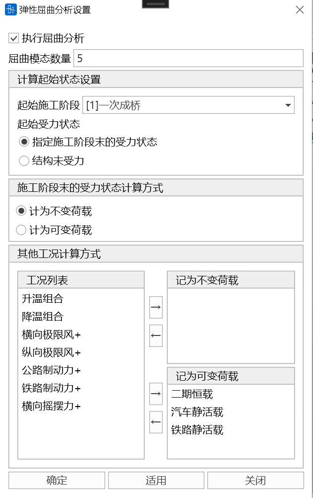
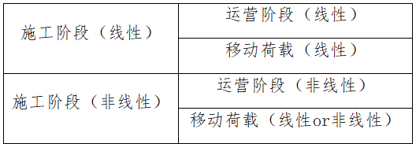

## 10.1 **Global Settings**

- Function: Set up the solver.
- Command: From the main menu, select "Analysis" > "Analysis Settings" > "Global Settings"

- Input:

**Solver** can be selected as sparse matrix solver or variable bandwidth solver.

**Parallel Computing Settings** can be set to automatic thread count, single thread, or multi-thread. When multi-thread is selected, the number of threads during solution can be customized.

## 10.2 **Construction Stage Settings**

- Function: Set construction stage analysis information.
- Command:

  From the main menu, select "Analysis" > "Analysis Settings" > "Construction Stage";

- Input
  - **Basic Settings**

    Calculation End Stage: Set the final construction stage. Only in the final construction stage can it be combined with other load cases.

    Other Stages: Select from defined construction stages.
  - **Analysis Options**
    - Analysis Type: Linear or nonlinear.
    - Shrinkage and Creep: Set shrinkage and creep information.

      
    - Tendon Tension Position (tension position of initial tension in initial tension load):

      Average tendon force

      I-end tendon force

      J-end tendon force
    - Consider the influence of internal forces in the completed bridge stage on internal forces in the operation stage:

      Convert the element internal forces at the last stage of construction to initial internal forces to form the initial geometric stiffness of the completed bridge stage (PostCS) structure.

## 10.3 **Operation Stage Settings**

- Function: Set operation stage analysis information.
- Command:

  From the main menu, select "Analysis" > "Analysis Settings" > "Operation Stage";

- Input
  - **Reference Stage**

    Set the reference stage for the start of the operation stage.
  - **Static Load**

    Analysis Type: Linear or nonlinear.

    Static Load Cases: Set static load cases.

    Settlement Cases: Set settlement cases.
  - **Moving Load**

    Analysis Type: Linear or nonlinear.

    Live Load Cases: Set live load cases.

## 10.4 **Natural Vibration Settings**

- Function: Set natural vibration analysis information.
- Command:

  From the main menu, select "Analysis>Natural Vibration";

  
- **Execute Natural Vibration Analysis**

  Determine whether to perform natural vibration analysis. Not checked by default.
- **Control Parameters**

  Calculation Method:
  1. Subspace Iteration Method (not easy to miss roots, but low calculation efficiency);
  2. Frequency Filtering Method (lowest calculation efficiency, usable when the order is small);
  3. Multiple Ritz Method (high calculation efficiency, but may miss roots);
  4. Lanczos Method (high calculation efficiency, but may miss roots).
  > 📌For large models with many vibration modes to calculate, the Multiple Ritz Method and Lanczos Method are recommended.
  > Mass Matrix Type: Includes lumped mass matrix and consistent mass matrix.
  > 📌Using lumped mass matrix, all input node masses are calculated, but only lumped mass is included for input element masses while rotational inertia is ignored; using consistent mass matrix, all input node masses and element masses are calculated.
  > Number of Vibration Modes: Number of vibration mode shapes to calculate and output results for.
  > 📌The order of structural natural frequency calculation cannot exceed the number of degrees of freedom in structural calculation.

## 10.5 **Moving Load Settings**

Function: Set live load analysis information

Command: From the main menu, select "Analysis>Moving Load Analysis Settings"

- **Live Load Effect Calculation Method**

  Linear calculation method or nonlinear calculation method can be used (after determining the most unfavorable loading position of live load according to the influence surface, nonlinear calculation is used for live load effects). Note: When linear calculation is used for construction stage analysis, live load calculation can only use linear calculation; when nonlinear calculation is used for construction stage analysis, live load calculation can use both linear and nonlinear calculation methods.
- **Influence Surface Loading Control**

  Set the encryption spacing of influence surfaces in transverse and longitudinal bridge directions, and select constraint equations for simulating dampers,

  **Note**: Constraint equations can be not activated in construction stages, and only some constraint equations can be activated during live load calculation to simulate dampers.
- **Calculation Options**

  Select whether to **output** displacement, internal force, reaction force, elastic connection, and constraint equation results during live load calculation. **If you want to reduce calculation amount and speed up calculation efficiency**, you can choose not to check some calculation items. "Whether to Track" can set whether to perform live load tracking for selected calculation items.

## 10.6 **Buckling Analysis Settings**

- Function: Set basic information for buckling analysis
- Command: From the main menu, select "Analysis>Buckling Analysis Settings";

- Execute Buckling Analysis

  Determine whether to perform buckling analysis. Not checked by default.
- Number of Buckling Modes

  Number of buckling modes to be calculated. The number of modes for structural stability calculation **cannot exceed** the number of degrees of freedom in structural calculation.
- Calculation Start State Settings

  **Start Construction Stage**: Select the stress state at the end of the specified construction stage as the start state for buckling calculation. If no construction stage is established, this item is invalid.

  **Start Stress State**:
  - **Stress state at the end of specified construction stage**
      Select the stress state at the end of the specified construction stage as the start state for buckling calculation. When this item is selected, the calculation method of the stress state at the end of the construction stage can be set to constant load or variable load.
  
  - **Structure without stress**
      The structure is unstressed during buckling calculation. When this item is selected, the structure self-weight calculation method can be set to: not counting self-weight, counting as constant load, or counting as variable load. Other construction stage loads are not included.
  <!--  -->
- Other Load Case Calculation Methods

  The way other additional load cases participate in buckling calculation. Count as constant load or variable load. Currently, node concentrated load, element concentrated load, and element uniform load are effective, other load types are invalid.

> 📌Note: The total number of effective loads counted as variable loads (including self-weight and other cases) must be greater than 0, otherwise calculation error will occur; if the **structure has no compression members**, buckling will not theoretically occur, so no buckling calculation results will be output.

## 10.7 **Nonlinear Settings**

- Function: Nonlinear analysis settings.
- Command:

  From the main menu, select "Analysis>Nonlinear";

  
- **Nonlinear Settings**

  (1) Geometric nonlinearity

  (2) Tendon elements use catenary elements: Tendon elements will use catenary element stiffness matrix, other elements use linear stiffness matrix (other elements do not consider geometric deformation when calculating total stiffness, but still participate in nonlinear iteration)
- **Notes**

  (1) There are only two places to set whether to consider nonlinearity: construction stage and live load

  (2) The analysis type of operation stage except live load is consistent with construction stage and cannot be set separately;

  (3) Live load analysis is set separately, and its setting level is lower than construction stage

  That is: When construction stage is linear analysis, live load can only choose linear analysis;

  When construction stage is nonlinear analysis, live load can choose linear or nonlinear;

  

## 10.8 **Time History Analysis Settings**

### 10.8.1 **Solver Settings**

- Function: Set dynamic time history analysis solver.
- Command:

  From the main menu, select "Analysis>Global Settings";

- Input
  - **Solution Settings**

    Select solver type. **Dynamic time history analysis must select sparse matrix solver.**
  - **Parallel Computing Settings**

    Select the number of parallel computing threads.

### 10.8.2 **Time History Analysis Settings**

- Function: Set time history analysis information.
- Command:

  From the main menu, select "Analysis>Time History Analysis";

- Input
  - **Execute Dynamic Time History Analysis**

    Determine whether to perform dynamic time history analysis. Not checked by default.
  - **Analysis Results**

    Node Displacement/Velocity/Acceleration: Determine the node set for outputting displacement/velocity/acceleration. All node results can be output, or partial node results can be output by selecting structural groups.

    Element Internal Force/Stress: Determine the element set for outputting internal force/stress. All element results can be output, or partial element results can be output by selecting structural groups.

## 10.9 **Response Spectrum Analysis Settings**

- Function: Whether to perform response spectrum analysis, damping ratio settings for this analysis, etc.
- Command: From the main menu, select "Analysis>Response Spectrum Analysis";

- Execute Response Spectrum Analysis

  **Whether to execute response spectrum analysis. If yes, natural vibration analysis is performed by default.**
- Vibration Mode Combination

  Combination method of vibration modes in response spectrum analysis.
  - Square Root of Sum of Squares (SRSS): Treat the response of each random variable as an independent random variable, and use the statistical square root of sum of squares rule to combine the effects of multiple random variables, outputting the square root of sum of squares result SRSS.
    - For multiple independent random variables $X_{1}, X_{2},..., X_{n},$ each with a coefficient $a_{1}, a_{2},..., a_{n},$ the calculation expression of SRSS method is:
    $$
    \mathrm{S R S S}={\sqrt{( a_{1} X_{1} )^{2}+( a_{2} X_{2} )^{2}+...+( a_{n} X_{n} )^{2}}}
    $$
  - Absolute Sum (CQC: Complete Quadratic Combination): Used for quickly evaluating the maximum load that a structure may suffer under multiple load cases. By assuming that the maximum responses of all load cases occur simultaneously, the absolute values of the maximum responses (regardless of direction) of each load case are summed to output a total response estimate ABSSUM.
    - For multiple random variables $X_{1}, X_{2},..., X_{n},$ each with a coefficient $a_{1}, a_{2},..., a_{n},$ the calculation expression of ABSSUM method is:
    $$
    ABSSUM= |a_1 X_1| + |a_2X_2| + ...+ |a_nX_n |
    $$
- Damping Ratio Settings

  Constant Damping Ratio: All vibration modes use the same damping ratio.

  Set by Vibration Mode Order: Structural damping ratio corresponds to structural natural vibration frequency. If the number of input damping ratios is less than the number of structural natural vibration frequencies to be calculated, the damping ratio corresponding to the structural natural vibration frequencies exceeding the number of damping ratios is set to the last input damping ratio internally by the software.

## 10.10 **Track Geometry Analysis Settings**

- Function: Whether to perform track geometry analysis, analysis control parameters, etc.
- Command: From the main menu, select "Analysis>Track Geometry Analysis";

- Execute Track Geometry Analysis

  Select whether to perform track geometry analysis.
  > 📌Prerequisites for this analysis:
  >
  > 1) Establish and perform live load case analysis;
  >
  > 2) The influence surface must contain at least 2 node columns, and these two node columns must contain the same number of nodes;
  >
  > 3) The **vehicle type in the live load case must be train type load**, i.e., standard vehicles—high-speed railway ordinary load (ZKN), intercity railway ordinary load (ZCN), heavy railway ordinary load (ZHN), passenger-freight common line railway (ZKHN), medium-live load ordinary load (CHN) supported by China Railway Bridge Design Code, and custom vehicles—train type loads;
  >
  > 4) In moving load settings, **Calculation Options** should check output displacement results to ensure output of node displacement results on track-related node columns.
- Analysis Control Parameters

  Calculation Node Step: For each calculation step in track geometry analysis, the number of nodes the train head advances.

  Calculation Start and End Points: Select automatic setting or custom calculation start and end point numbers.

  Calculation Start Point Number: The **position number** of the train head position node in the node column at the start of analysis, default is 1;

  Calculation End Point Number: The **position number** of the train head position node in the node column at the end of analysis, default is the total number of node columns.

## 10.11 **Calculation Analysis**

### 10.11.1 **Run Analysis**

- Function: Run structural analysis.
- Command:

  From the main menu, select "Analysis>Run Analysis";

  Click Run Structural Analysis in the toolbar;

  

  Shortcut key: F5

### 10.11.2 **Delete Intermediate Results**

- Function: Delete calculation process files in structural files.
- Command:

  From the main menu, select "Analysis>Delete Intermediate Results";
- **Notes**

  After deleting intermediate results, continuous calculation cannot be performed due to missing process files;

### 10.11.3 **Preprocessing**

- Function: Switch interface to preprocessing.
- Command:

  From the main menu, select "Analysis>Preprocessing";

  Click in the toolbar

  

  Switch to preprocessing;

### 10.11.4 **Postprocessing**

- Function: Switch interface to postprocessing.
- Command:

  From the main menu, select "Analysis>Postprocessing";

  Click in the toolbar

  

  Switch to postprocessing;

Tsinghua University GME