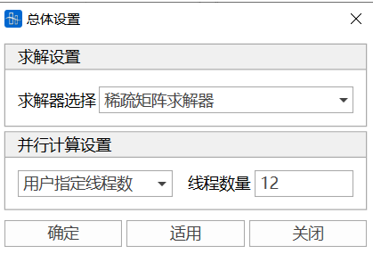

# 10.1 **Global Settings**

- Function: Settings for solver.
- Command: From the main menu, select "Analysis" > "Analysis Settings" > "Global Settings"

- Input:

**Solver** can select sparse matrix solver or variable bandwidth solver.

**Parallel Computing Settings** can choose software automatic thread count, single thread, or multi-thread. When multi-thread is selected, you can customize the number of threads during solving.

# 10.2 **Construction Stage Settings**

- Function: Set up construction stage analysis information.
- Commands:

  From the main menu, select "Analysis" > "Analysis Settings" > "Construction Stages";

- Input
  - **Basic Settings**

    Calculation End Stage: Set the final construction stage. Only in the final construction stage can it be combined with other load cases.

    Other Stages: Select from the defined construction stages.
  - **Analysis Options**
    - Analysis Type: Linear or nonlinear.
    - Shrinkage and Creep: Set up shrinkage and creep information.

      
    - Cable Tension Position (tension position of initial tension force in initial tension load):

      Average cable force

      I-end cable force

      J-end cable force
    - Consider the Effect of Completed Bridge Stage Internal Force on Operation Stage Internal Force:

      Convert the internal forces of elements in the last construction stage to initial internal forces, forming the initial geometric stiffness of the completed bridge stage (PostCS) structure.

# 10.3 **Operation Stage Settings**

- Function: Set up operation stage analysis information.
- Commands:

  From the main menu, select "Analysis" > "Analysis Settings" > "Operation Stages";

- Input
  - **Reference Stage**

    Set the reference stage for operation stage analysis.
  - **Static Load**

    Set the static load case for operation stage analysis.
  - **Live Load**

    Set the live load case for operation stage analysis.
  - **Settlement Load**

    Set the settlement load case for operation stage analysis.
  - **Moving Load**

    Set the moving load case for operation stage analysis.

# 10.4 **Eigenvalue Analysis Settings**

- Function: Set up eigenvalue analysis information.
- Commands:

  From the main menu, select "Analysis" > "Eigenvalue Analysis Settings";

- Input
  - **Analysis Type**

    Linear: Linear eigenvalue analysis.

    Nonlinear: Nonlinear eigenvalue analysis.
  - **Mass Matrix Type**

    Lumped mass matrix: Lumped mass matrix.

    Consistent mass matrix: Consistent mass matrix.
  - **Number of Modes**

    The number of eigenvalue modes to be calculated.
  - **Convergence Tolerance**

    Convergence tolerance for eigenvalue analysis.
  - **Max Iterations**

    Maximum number of iterations for eigenvalue analysis.

# 10.5 **Buckling Analysis Settings**

- Function: Set up buckling analysis information.
- Commands:

  From the main menu, select "Analysis" > "Buckling Analysis Settings";

- Input
  - **Analysis Type**

    Linear: Linear buckling analysis.

    Nonlinear: Nonlinear buckling analysis.
  - **Number of Modes**

    The number of buckling modes to be calculated.
  - **Convergence Tolerance**

    Convergence tolerance for buckling analysis.
  - **Max Iterations**

    Maximum number of iterations for buckling analysis.

# 10.6 **Time History Analysis Settings**

- Function: Set up time history analysis information.
- Commands:

  From the main menu, select "Analysis" > "Time History Analysis Settings";

- Input
  - **Analysis Type**

    Linear: Linear time history analysis.

    Nonlinear: Nonlinear time history analysis.
  - **Time Step**

    Time step for time history analysis.
  - **Output Time Step**

    Output time step for time history analysis results.
  - **Damping**

    Set structural damping.
  - **Nonlinear Settings**

    - Nonlinear Analysis Type: Geometric nonlinear or boundary nonlinear.

    - Boundary Nonlinear Group: Select boundary nonlinear group.

    - Max Iterations: Maximum number of iterations for nonlinear analysis.

    - Convergence Tolerance: Convergence tolerance for nonlinear analysis.

# 10.7 **Moving Load Analysis Settings**

- Function: Set up moving load analysis information.
- Commands:

  From the main menu, select "Analysis" > "Moving Load Analysis Settings";

- Input
  - **Analysis Type**

    Linear: Linear moving load analysis.

    Nonlinear: Nonlinear moving load analysis.
  - **Influence Surface Loading Control**

    - Longitudinal encryption spacing: Input the encryption spacing in the longitudinal bridge direction of the influence surface.

    - Transverse encryption spacing: Input the encryption spacing in the transverse bridge direction of the influence surface.
  - **Simulation Damper Constraint Equation**

    Simulate damper action using constraint equations during live loading.

    - Select constraint equation: Select the constraint equation to be used.

# 10.8 **Cable Force Tensioning Settings**

- Function: Set up cable force tensioning analysis information.
- Commands:

  From the main menu, select "Analysis" > "Cable Force Tensioning Settings";

- Input
  - **Analysis Type**

    Linear: Linear cable force tensioning analysis.

    Nonlinear: Nonlinear cable force tensioning analysis.
  - **Max Iterations**

    Maximum number of iterations for cable force tensioning analysis.
  - **Convergence Tolerance**

    Convergence tolerance for cable force tensioning analysis.

# 10.9 **Rail Profile Shape Finding Settings**

- Function: Set up rail profile shape finding analysis information.
- Commands:

  From the main menu, select "Analysis" > "Rail Profile Shape Finding Settings";

- Input
  - **Analysis Type**

    Linear: Linear rail profile shape finding analysis.

    Nonlinear: Nonlinear rail profile shape finding analysis.
  - **Max Iterations**

    Maximum number of iterations for rail profile shape finding analysis.
  - **Convergence Tolerance**

    Convergence tolerance for rail profile shape finding analysis.

# 10.10 **General Settings**

- Function: Set up general analysis settings.
- Commands:

  From the main menu, select "Analysis" > "General Settings";

- Input
  - **Analysis Control**

    - Auto-save analysis results: Automatically save analysis results.

    - Auto-save intermediate results: Automatically save intermediate analysis results.

    - Auto-save analysis results interval: Set the interval for automatically saving analysis results.
  - **Output Control**

    - Output node displacement results: Determine whether to output node displacement results.

    - Output element internal force results: Determine whether to output element internal force results.

    - Output element stress results: Determine whether to output element stress results.

    - Output element reaction force results: Determine whether to output element reaction force results.

    - Output elastic link force results: Determine whether to output elastic link force results.

    - Output constraint equation force results: Determine whether to output constraint equation force results.

    - Output boundary nonlinear element force results: Determine whether to output boundary nonlinear element force results.
