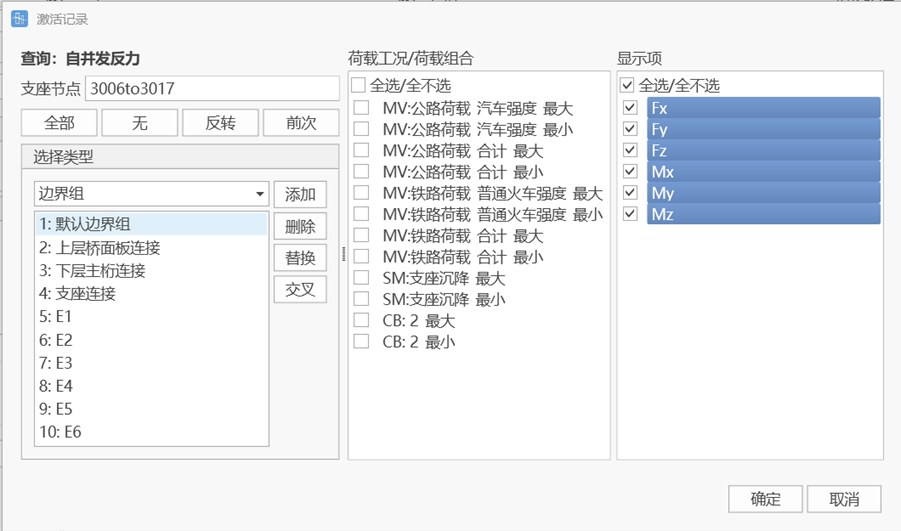
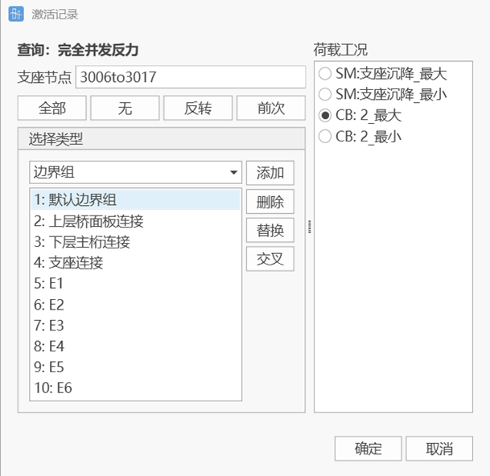
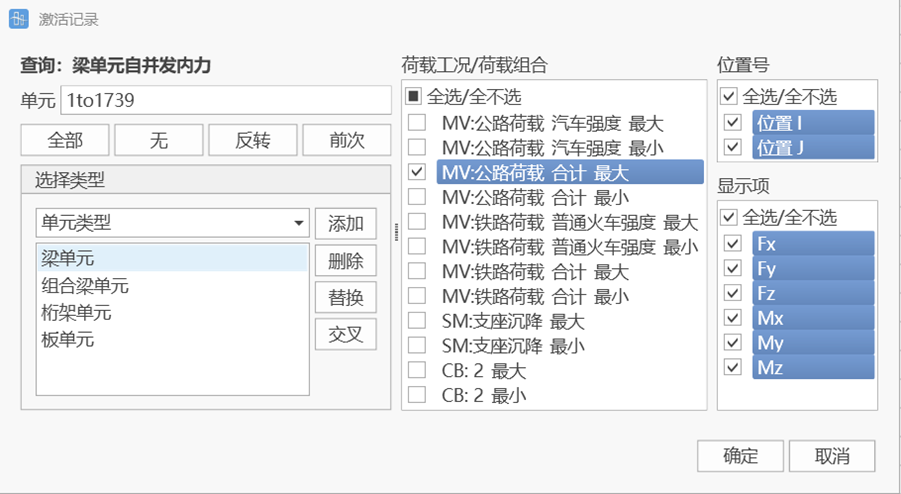
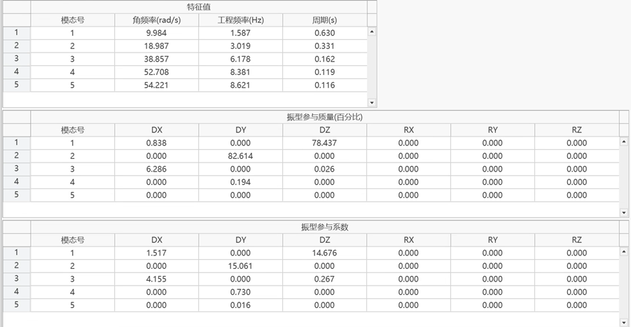

# 11.1 **Static Analysis Results**

## 11.1.1 **Load Combinations**

- Function: Input load combinations.
- Command:

  Select "Results" > "Load Combinations" from the main menu;

- Input
  - **Name**

    Name of the load combination.
  - **Type**
    - Superposition: Linearly superpose the results of each load case, outputting only one result item.
    - Discrimination: Superpose the analysis results of each load case after judgment, outputting Max, Min, and All three result items. If the result of a load case is greater than 0, it is superposed in Max; if the result is less than 0, it is superposed in Min; All is the maximum absolute value of Max and Min.
    - Envelope: Obtain the envelope value of each load case result, outputting Max, Min, and All three result items. Max is the maximum value of each load case result, Min is the minimum value of each load case result, All is the maximum absolute value of Max and Min.
    - Square Root of Sum of Squares (SRSS): Treat the response of each random variable as an independent random variable, and use the statistical square root of sum of squares rule to combine the effects of multiple random variables, outputting the SRSS result.
      - For multiple independent random variables $X_{1}, X_{2},..., X_{n},$ each random variable has a coefficient $a_{1}, a_{2},..., a_{n},$ the calculation expression of the SRSS method is:
      $$
      \mathrm{S R S S}={\sqrt{( a_{1} X_{1} )^{2}+( a_{2} X_{2} )^{2}+...+( a_{n} X_{n} )^{2}}}
      $$
    - Absolute Sum (ABSSUM): Used for quickly assessing the maximum load a structure may be subjected to under multiple load cases. By assuming that the maximum responses of all load cases occur simultaneously, the absolute values of the maximum responses of each load case (regardless of direction) are added together to output a total response estimate ABSSUM.
      - For multiple random variables $X_{1}, X_{2},..., X_{n},$ each random variable has a coefficient $a_{1}, a_{2},..., a_{n},$ the calculation expression of the ABSSUM method is:
      $$
      ABSSUM= |a_1 X_1| + |a_2X_2| + ...+ |a_nX_n |
      $$
    - Permanent Force Others Discrimination: Except for permanent action type loads (bridge completion total and components, dead load action types in additional load cases) which use forced superposition, the analysis results of other type load cases are superposed after judgment, outputting Max, Min, and All three result items. If the result of a load case is greater than 0, it is superposed in Max; if the result is less than 0, it is superposed in Min; All is the maximum absolute value of Max and Min.
  - **Description**

    Description of the load combination.
  - **Load Cases**

    Select load cases participating in the load combination from the load case list.
  - **Load Factors**

    Input the combination coefficients for the selected load cases participating in the load combination.

## 11.1.2 **Reactions**

- Function: View reaction results.
- Command:

  Select "Results" > "Results" > "Reactions" from the main menu;

  Select "Results" > "Tables" > "Reactions" from the main menu;

- Input
  - **Load Case/Combination**

    Select the load case/combination for which to view reactions.
  - **Components**

    Select the component type of reactions to view:

    FX: Reaction component in the X-axis direction of the global coordinate system or x direction of the node local coordinate system.

    FY: Reaction component in the Y-axis direction of the global coordinate system or y direction of the node local coordinate system.

    FZ: Reaction component in the Z-axis direction of the global coordinate system or z direction of the node local coordinate system.

    FXYZ: Output FX, FY, FZ simultaneously.

    MX: Moment reaction component about the X-axis of the global coordinate system or x-axis of the node local coordinate system.

    MY: Moment reaction component about the Y-axis of the global coordinate system or y-axis of the node local coordinate system.

    MZ: Moment reaction component about the X-axis of the global coordinate system or z-axis of the node local coordinate system.

    MXYZ: Output MX, MY, MZ simultaneously.
    > 🧐**Note: If the node local coordinate system where the support is located has been defined, the viewed reaction components are node local coordinate system results.**
  - **Display Type**

    Values: Display values on the model interface.

    Legend: Display legend on the model interface.

    Arrow Size Scale: Scale of reaction arrow size on the model interface.

## 11.1.3 **Deformation**

- Function: View deformation results.
- Command:

  Select "Results" > "Deformation" from the main menu;

- Input
  - **Load Case/Combination**

    Select the load case/combination for which to view deformation.
  - **Components**

    Select the component type of deformation to view:
    |      |                   |
    | ---- | ----------------- |
    | DX   | Deformation component in the X-axis direction of the global coordinate system    |
    | DY   | Deformation component in the Y-axis direction of the global coordinate system    |
    | DZ   | Deformation component in the Z-axis direction of the global coordinate system    |
    | RX   | Rotation component about the X-axis of the global coordinate system     |
    | RY   | Rotation component about the Y-axis of the global coordinate system     |
    | RZ   | Rotation component about the X-axis of the global coordinate system     |
    | DXY  | √(DX^2+DY^2)      |
    | DYZ  | √(DY^2+DZ^2)      |
    | DXZ  | √(DX^2+DZ^2)      |
    | DXYZ | √(DX^2+DY^2+DZ^2) |
  - **Display Type**

    Contour

    Deformation: Display deformation shape on the model interface

    Values: Display values on the model interface.

    Legend: Display legend on the model interface.

    Before Deformation: Display shape before deformation on the model interface.

## 11.1.4 **Concurrent Reactions**

### 11.1.4.1 Self-Concurrent Reactions (Table Only)

- Function: View concurrent reactions of live loads or support settlement loads. That is, the extreme value results of each support reaction component and the values of other reaction components of the same support occurring simultaneously. Currently supports querying self-concurrent results of live load cases, support settlement cases, and load combinations containing the above type cases.
- Note: Live load fatigue related cases do not output self-concurrent reactions.
- Command:

  Select "Results" > "Tables" > "Self-Concurrent Reactions" from the main menu;

  
- Input
  - **Support Nodes**

    Select support nodes.
  - **Selection Type**

    Can quickly add support nodes through selection type.
  - **Load Case/Load Combination**

    Select live load cases, support settlement cases, and load combinations containing the above type cases for which to view results.
  - **Display Items**

    Select reaction components to view self-concurrent reaction results of each support when the extreme value of that component occurs.

### 11.1.4.2 Fully Concurrent Reactions (Table Only)

- Function: View fully concurrent reaction results, that is, the extreme value results of each support reaction component, other reaction components of the same support occurring simultaneously, and reaction values of all other supports occurring simultaneously. Currently only supports querying fully concurrent results of **support settlement cases** and **load combinations containing settlement cases**.
- Note: Settlement cases and live load cases (except fatigue related live load cases) output fully self-concurrent reactions, and live load calculation requires checking whether to track before calculation.
- Command:

  Select "Results" > "Tables" > "Fully Concurrent Reactions" from the main menu;

  
- Input
  - **Support Nodes**

    Select support nodes.
  - **Selection Type**

    Can quickly add support nodes through selection type.
  - **Load Case/Load Combination**

    Select live load cases, support settlement cases, and load combinations containing the above type cases for which to view results.

## 11.1.5 Concurrent Internal Forces

- Function: View self-concurrent internal force results of beam elements or composite beam elements, that is, the extreme value results of each beam element's internal force component and the values of other internal force components of the same element occurring simultaneously. Currently supports querying self-concurrent results of **live load cases**, **support settlement cases**, and **load combinations containing the above type cases**.
- Command:

  Select "Results" > "Tables" > "Beam Element Self-Concurrent Internal Forces" or "Composite Beam Element Self-Concurrent Internal Forces" from the main menu;

  
- Input
  - **Element**

    Select beam or composite beam element numbers.
  - **Selection Type**

    Can quickly add elements through selection element type, structure group, etc.
  - **Load Case/Load Combination**

    Select live load cases, support settlement cases, and load combinations containing the above type cases for which to view results.
  - **Position Number**

    Select I/J end of the element to view self-concurrent internal force results of each element when the extreme value at that end occurs.
  - **Display Items**

    Select internal force components to view self-concurrent internal force results of each element when the extreme value of that component occurs.

## 11.1.6 **Node Displacements**

- Function: View node displacement results.
- Command:

  Select "Results" > "Tables" > "Node Displacements" from the main menu;
- Table Display

  Node: Node number

  Load: Load case/combination

  DX: Displacement component in X direction under global coordinate system

  DY: Displacement component in Y direction under global coordinate system

  DZ: Displacement component in Z direction under global coordinate system

  RX: Rotation component about X axis under global coordinate system

  RY: Rotation component about Y axis under global coordinate system

  RZ: Rotation component about Z axis under global coordinate system

## 11.1.7 **Truss Element Internal Forces**

- Function: View truss internal force results.
- Command:

  Select "Results" > "Results" > "Internal Forces" > "Truss Element Internal Forces" from the main menu;

  Select "Results" > "Tables" > "Internal Forces" > "Truss Element Internal Forces" from the main menu;

- Input
  - **Load Case/Combination**

    Select the load case/combination for which to view internal forces.
  - **Display Type**

    Line Chart: Display line chart on the model interface.

    Deformation: Display deformation shape on the model interface

    Values: Display values on the model interface.

    Legend: Display legend on the model interface.

    Before Deformation: Display shape before deformation on the model interface.

## 11.1.8 **Beam Element Internal Forces**

- Function: View beam internal force results.
- Command:

  Select "Results" > "Results" > "Internal Forces" > "Beam Element Internal Forces" from the main menu;

  Select "Results" > "Tables" > "Internal Forces" > "Beam Element Internal Forces" from the main menu;

- Input
  - **Load Case/Combination**

    Select the load case/combination for which to view internal forces.
  - **Components**

    Select the component type of internal forces to view:

    Fx: Axial force.

    Fy: Shear force in the y direction of the element local coordinate system.

    Fz: Shear force in the z direction of the element local coordinate system.

    Mx: Moment about the x-axis of the element local coordinate system.

    My: Moment about the y-axis of the element local coordinate system.

    Mz: Moment about the z-axis of the element local coordinate system.
  - **Display Type**

    Line Chart: Display line chart on the model interface.

    Deformation: Display deformation shape on the model interface

    Values: Display values on the model interface.

    Legend: Display legend on the model interface.

    Before Deformation: Display shape before deformation on the model interface.

## 11.1.9 **Composite Beam Element Internal Forces**

- Function: View composite beam internal force results.
- Command:

  Select "Results" > "Results" > "Internal Forces" > "Composite Beam Element Internal Forces" from the main menu;

  Select "Results" > "Tables" > "Internal Forces" > "Composite Beam Element Internal Forces" from the main menu;

- Input
  - **Load Case/Combination**

    Select the load case/combination for which to view internal forces.
  - **Section**

    Select whether to calculate main material separately, auxiliary material separately, or main material + auxiliary material.
  - **Components**

    Select the component type of internal forces to view:

    Fx: Axial force.

    Fy: Shear force in the y direction of the element local coordinate system.

    Fz: Shear force in the z direction of the element local coordinate system.

    Mx: Moment about the x-axis of the element local coordinate system.

    My: Moment about the y-axis of the element local coordinate system.

    Mz: Moment about the z-axis of the element local coordinate system.
  - **Display Type**

    Line Chart: Display line chart on the model interface.

    Deformation: Display deformation shape on the model interface

    Values: Display values on the model interface.

    Legend: Display legend on the model interface.

    Before Deformation: Display shape before deformation on the model interface.

## 11.1.10 **Plate Element Internal Forces**

- Function: View plate internal force results.
- Command:

  Select "Results" > "Results" > "Internal Forces" > "Plate Element Internal Forces" from the main menu;

  Select "Results" > "Tables" > "Internal Forces" > "Plate Element Internal Forces" from the main menu;

- Input
  - **Load Case/Combination**

    Select the load case/combination for which to view internal forces.
  - **Internal Force Options**

    Element: Display contours using stresses at each node of the element.

    Node Average: Display contours using average node stresses at shared node positions of elements sharing the node.
  - **Components**

    Select the component type of internal forces to view:

    Element Coordinate System: Output internal force distribution per unit width along each plate element local coordinate system direction.

     Internal Force (per unit plate width) Output Position (a) Internal Force (per unit plate width) Output Position ")
    > ❓$F_{ij}$: $i$-force action plane, $j$-force action direction, sign convention:
    >
    > - When the normal direction of the force action plane is consistent with a certain element coordinate axis direction, and the force action direction j is consistent with the element coordinate axis direction, it is positive (+);
    > - When the normal direction of the force action plane is opposite to a certain element coordinate axis direction, and the force action direction j is opposite to the element coordinate axis direction, it is positive (+).
    >    Axial Force and Shear Force (per unit plate width) b) Axial Force and Shear Force (per unit plate width) ")$M_{ij}$: $i$-force action plane, $j$-axis parallel to moment rotation direction, sign convention:
    > - When i≠j, according to the right-hand rule, when the thumb direction is consistent with the normal direction of the force action plane, it is positive (+);
    > - When i=j, when the positive/top surface of the plate (normal direction action surface) is in tension during moment action, it is positive (+).
    >    Moment and Torque (per unit plate width) (c) Moment and Torque (per unit plate width) ")
    Fxx: Axial force per unit width in the x direction of the element local coordinate system.

    Fyy: Axial force per unit width in the y direction of the element local coordinate system.

    Fxy: Shear force per unit width in the x-y plane of the element local coordinate system or user coordinate system (in-plane shear) (Fxy=Fyx).

    Mxx: Moment per unit width about the x-axis of the element local coordinate system.

    Myy: Moment per unit width about the y-axis of the element local coordinate system.

    Mxy: Torque per unit width acting in the plane perpendicular to the x-axis of the local coordinate system or user coordinate system, rotating about the x-axis (Mxy=Myx).
  - **Display Type**

    Deformation: Display deformation shape on the model interface

    Values: Display values on the model interface.

    Legend: Display legend on the model interface.

    Before Deformation: Display shape before deformation on the model interface.

## 11.1.11 **Truss Element Stresses**

- Function: View truss stress results.
- Command:

  Select "Results" > "Results" > "Stresses" > "Truss Element Stresses" from the main menu;

  Select "Results" > "Tables" > "Stresses" > "Truss Element Stresses" from the main menu;

- Input
  - **Load Case/Combination**

    Select the load case/combination for which to view stresses.
  - **Display Type**

    Line Chart: Display line chart on the model interface.

    Deformation: Display deformation shape on the model interface

    Values: Display values on the model interface.

    Legend: Display legend on the model interface.

    Before Deformation: Display shape before deformation on the model interface.

## 11.1.12 **Beam Element Stresses**

- Function: View beam stress results.
- Command:

  Select "Results" > "Results" > "Stresses" > "Beam Element Stresses" from the main menu;

  Select "Results" > "Tables" > "Stresses" > "Beam Element Stresses" from the main menu;

- Input
  - **Load Case/Combination**

    Select the load case/combination for which to view stresses.
  - **Stresses**

    Select the component type of stresses to view:

    Axial Force Component: Axial stress produced by axial force.

    Mz Component: Stress produced by moment about the z-axis of the element local coordinate system.

    My Component: Stress produced by moment about the z-axis of the element local coordinate system.

    Combined: Stress produced by axial force plus moments in two directions.

    Calculation position can select envelope (selecting the maximum value of combined stress among four points), upper left, upper right, lower right, lower left
  - **Display Type**

    Line Chart: Display line chart on the model interface.

    Deformation: Display deformation shape on the model interface

    Values: Display values on the model interface.

    Legend: Display legend on the model interface.

    Before Deformation: Display shape before deformation on the model interface.

## 11.1.13 **Composite Beam Element Stresses**

- Function: View composite beam stress results.
- Command:

  Select "Results" > "Results" > "Stresses" > "Composite Beam Element Stresses" from the main menu;

  Select "Results" > "Tables" > "Stresses" > "Composite Beam Element Stresses" from the main menu;

- Input
  - **Load Case/Combination**

    Select the load case/combination for which to view stresses.
  - **Section**

    Select whether to calculate main material separately, auxiliary material separately, or main material + auxiliary material.
  - **Stresses**

    Select the component type of stresses to view:

    Axial Force Component: Axial stress produced by axial force.

    Mz Component: Stress produced by moment about the z-axis of the element local coordinate system.

    My Component: Stress produced by moment about the z-axis of the element local coordinate system.

    Combined: Stress produced by axial force plus moments in two directions.

    Calculation position can select envelope (selecting the maximum value of combined stress among four points), upper left, upper right, lower right, lower left
  - **Display Type**

    Line Chart: Display line chart on the model interface.

    Deformation: Display deformation shape on the model interface

    Values: Display values on the model interface.

    Legend: Display legend on the model interface.

    Before Deformation: Display shape before deformation on the model interface.

## 11.1.14 **Plate Element Stresses**

- Function: View plate stress results.
- Command:

  Select "Results" > "Results" > "Stresses" > "Plate Element Stresses" from the main menu;

  Select "Results" > "Tables" > "Stresses" > "Plate Element Stresses" from the main menu;

- Input
  - **Load Case/Combination**

    Select the load case/combination for which to view stresses.
  - **Internal Force Options**

    Element: Display contours using stresses at each node of the element.

    Node Average: Display contours using average node stresses at shared node positions of elements sharing the node.
  - **Position**

    Plate Top: Stress at the top edge in the z direction of the plate element local coordinate system.

    Plate Bottom: Stress at the bottom edge in the z direction of the plate element local coordinate system.

    Maximum Absolute Value: Maximum value among absolute values of stresses at the top and bottom surfaces.
  - **Components**

    Select the component type of stresses to view:

    Sigxx: Axial force stress in the x direction of the element local coordinate system.

    Sigyy: Axial force stress in the y direction of the element local coordinate system.

    Sigxy: Shear stress in the x-y plane of the element local coordinate system.
  - **Display Type**

    Deformation: Display deformation shape on the model interface

    Values: Display values on the model interface.

    Legend: Display legend on the model interface.

    Before Deformation: Display shape before deformation on the model interface.

## 11.1.15 **Constraint Equations (Table Only)**

- Function: View constraint equations.
- Command:

  Select "Results" > "Tables" > "Constraint Equations" from the main menu;

- Input
  - **Constraint Equations**

    Select constraint equations.
  - **Selection Type**

    Can quickly add constraint equations through selection type.

## 11.1.16 **Elastic Links (Table Only)**

- Function: View elastic link results.
- Command:

  Select "Results" > "Tables" > "Elastic Links" from the main menu;

- Input
  - **Elastic Links**

    Select elastic links.
  - **Selection Type**

    Can quickly add elastic links through selection type.

## 11.1.17 **Cable Element Unstressed Length**

- Function: View unstressed cable length of cable elements.
- Command:

  Select "Results > Static Analysis > Unstressed Cable Length" from the main menu;

  
- Input
  - **Element**

    Select cable elements.
  - **Selection Type**

    Can quickly add cable elements through selection type.

## 11.1.18 **Prestressing Tendon Results**

Not yet available

## 11.1.19 Construction Stage **Warning Settings**

- Function: Whether to perform construction stage warning, set warning items.
- Command: Select "Results > Construction Stage Warning > Warning Settings" from the main menu;

- Input
  - Construction Stage Warning

    Check this item to automatically perform construction stage result warning calculation after construction stage calculation is completed (or after opening a project with construction stage results). If there are over-limit results, an alarm will be issued immediately.
  - Start Construction Stage

    Set the start construction stage for result warning calculation.
  - End Construction Stage

    Set the end construction stage for result warning calculation.
  - Member Internal Force Warning

    Set internal force warning items for rod, beam, cable, plate, and composite beam elements.

    Structure Group: Perform warning analysis on internal forces of members in the structure group.

    Internal Force Components: Specify unit internal force components for warning, including Fx, Fy, Fz, Mx, My, Mz.

    Internal Force Upper Limit: If unit internal force is higher than this value, an alarm will be issued.

    Internal Force Lower Limit: If unit internal force is lower than this value, an alarm will be issued.
  - Member Stress Warning

    

    Set stress warning items for rod, beam, cable, and plate elements.

    **Structure Group:** Perform warning analysis on member stresses in the structure group (except composite beams).

    Limit Definition Method: Includes two definition methods, 1) User-defined; 2) Design strength/Safety factor.

    **Stress Upper Limit:** User-defined method, if unit stress is higher than this value, an alarm will be issued.

    Stress Lower Limit: User-defined method, if unit stress is lower than this value, an alarm will be issued.

    **Safety Factor:** Design strength divided by safety factor method, the program automatically obtains design tensile and compressive strengths based on the unit's material type, and determines stress upper and lower limit values after dividing by the safety factor.
  - Composite Beam Stress Warning

    

    Set stress warning items for composite beam elements.

    Structure Group: Perform warning analysis on composite beam stresses in the structure group.

    Limit Definition Method: Includes two definition methods, 1) User-defined; 2) Design strength/Safety factor.

    Main/Auxiliary Material Stress Upper Limit: User-defined method, if the unit's main/auxiliary material stress is higher than this value, an alarm will be issued.

    Main/Auxiliary Material Stress Lower Limit: User-defined method, if the unit's main/auxiliary material stress is lower than this value, an alarm will be issued.

    Safety Factor: Design strength divided by safety factor method, the program automatically obtains design tensile and compressive strengths based on the unit's material type, and determines stress upper and lower limit values after dividing by the safety factor.
  - Support Reaction Warning

    

    Set warning items for support reactions, elastic link forces, and constraint equation forces.

    Boundary Group: Perform warning analysis on support reactions, elastic link forces, and constraint equation forces in the boundary group.

    Reaction Components: Specify reaction components for warning, including Fx, Fy, Fz, Mx, My, Mz.

    Reaction Upper Limit: If reaction component is higher than this value, an alarm will be issued.

    Reaction Lower Limit: If reaction component is lower than this value, an alarm will be issued.

    You can batch add warning items for specified structure groups or boundary groups, delete all or specified warning items, and directly edit warning items in the warning item table. After warning settings are completed, click OK to start warning analysis.

## 11.1.20 **Warning Results**

- Function: View warning result table.
- Command: Select "Results > Construction Stage Warning > Warning Results" from the main menu, click OK.

- Input
  - Construction Stage Member Internal Force/Stress Warning

    Select element type to display warning internal force and stress results.
  - Construction Stage Reaction Warning

    Select constraint type to display warning reaction results.
  - Construction Stage

    Select construction stage to display warning results.

## 11.1.21 **Warning Display**

- Function: View warning result graphics.
- Command: Select "Results > Construction Stage Warning > Warning Display" from the main menu.

- Input
  - Member Internal Force Over-limit: Display over-limit internal force results of rod, beam, cable, plate, and composite beam elements.

    Construction Stage: Select construction stage to display over-limit results.

    Over-limit Type: Select over-limit result type, including all, exceeding upper limit, below lower limit.

    Values: Whether to display specific over-limit values.
  - Member Stress Over-limit: Display over-limit stress results of rod, beam, cable, and plate elements.

    Construction Stage: Select construction stage to display over-limit results.

    Over-limit Type: Select over-limit result type, including all, exceeding upper limit, below lower limit.

    Values: Whether to display specific over-limit values.
  - Composite Beam Internal Force Over-limit: Display over-limit internal force results of composite beam elements.

    Construction Stage: Select construction stage to display over-limit results.

    Over-limit Type: Select over-limit result type, including all, main material exceeding upper limit, main material below lower limit, auxiliary material exceeding upper limit, auxiliary material below lower limit.

    Values: Whether to display specific over-limit values.
  - Support Reaction Over-limit: Display over-limit results of support reactions, elastic link forces, and constraint equation forces.

    Construction Stage: Select construction stage to display over-limit results.

    Over-limit Type: Select over-limit result type, including all, exceeding upper limit, below lower limit.

    Values: Whether to display specific over-limit values.

## 11.1.22 **Generate Verification Cases**

- Function: Perform further verification on over-limit reinforced concrete and prestressed concrete members, and generate verification reports.
- Command: Select "Results > Construction Stage Warning > Generate Verification Cases" from the main menu.

Case Name: User fills in the name of the generated verification case.

Material Type: Select materials of members to be verified.

Code: Select verification code. Currently supports two codes, "Code for Design of Highway Reinforced Concrete and Prestressed Concrete Bridges and Culverts" (JTG3362-2018), and "Code for Design of Concrete Structures of Railway Bridges and Culverts" (TB10092-2017 J462-2017).

Structure Type: Includes reinforced concrete members, fully prestressed members, Class A members, and Class B members.

After determining the above input items, click "Generate Verification Cases" to enter the concrete structure verification case page, see [12. Verification](../ch12_check/index.md "12. Verification").

# 11.2 **Dynamic Analysis Results**

## 11.2.1 **Table Result Output**

### **11.2.1.1 Time History Tables**

##### **(1) Node Reactions**

- Function: Output time history data of single node reactions.
- Command: Results > Time History Tables > Node Reactions

- Input

  Node: Select nodes with constrained boundaries.

  Time History Load Case: Select time history load case name with calculation results.

##### **(2) Deformation**

- Function: Output time history data of single node displacement/velocity/acceleration.
- Command:

  Results > Time History Tables > Deformation > Displacement

  Results > Time History Tables > Deformation > Velocity

  Results > Time History Tables > Deformation > Acceleration

- Input

  Node: Select nodes to output displacement results.

  Time History Load Case: Select time history load case name with calculation results.

##### **(3) Internal Forces**

- Function: Output time history data of single element internal forces.
- Command:

  Results > Time History Tables > Internal Forces > Truss Element Internal Forces

  Results > Time History Tables > Internal Forces > Beam Element Internal Forces

  Results > Time History Tables > Internal Forces > Plate Element Internal Forces

  Results > Time History Tables > Internal Forces > Boundary Element Internal Forces

- Input

  Element: Select elements to output internal force results.

  Time History Load Case: Select time history load case name with calculation results.

  Position Number: Select position to output element internal force.

##### **(4) Stresses**

- Function: Output time history data of single element stresses.
- Command:

  Results > Time History Tables > Stresses > Truss Element Stresses

  Results > Time History Tables > Stresses > Beam Element Stresses

  Results > Time History Tables > Stresses > Plate Element Stresses

- Input

  Element: Select elements to output stress results.

  Time History Load Case: Select time history load case name with calculation results.

  Position Number: Select position to output element stress.

### **11.2.1.2 Time History Maximum Value Tables**

##### **(1) Node Reactions**

- Function: Output maximum value results of node reactions.
- Command: Results > Time History Maximum Value Tables > Node Reactions

- Input

  Support Nodes: Select nodes with constrained boundaries, multiple selections allowed.

  Selection Type: Can select all support node numbers of that category according to type.

  Load Case: Select time history load case name with calculation results and maximum value, minimum value.

##### **(2) Deformation**

- Function: Output maximum value data of multiple node displacements/velocities/accelerations.
- Command:

  Results > Time History Maximum Value Tables > Deformation > Displacement

  Results > Time History Maximum Value Tables > Deformation > Velocity

  Results > Time History Maximum Value Tables > Deformation > Acceleration

- Input

  Nodes: Select node set to output displacement maximum value results.

  Selection Type: Can select all node numbers of that category according to type.

  Load Case: Select time history load case name with calculation results and maximum value, minimum value.

##### **(3) Internal Forces**

- Function: Output maximum value data of multiple element internal forces.
- Command:

  Results > Time History Maximum Value Tables > Internal Forces > Truss Element Internal Forces

  Results > Time History Maximum Value Tables > Internal Forces > Beam Element Internal Forces

  Results > Time History Maximum Value Tables > Internal Forces > Plate Element Internal Forces

  Results > Time History Maximum Value Tables > Internal Forces > Boundary Element Internal Forces

- Input

  Elements: Select element set to output internal force results.

  Selection Type: Can select all element numbers of that category according to type.

  Load Case: Select time history load case name with calculation results and maximum value, minimum value.

  Position Number: Select position to output element internal force.

##### **(4) Stresses**

- Function: Output maximum value data of multiple element stresses.
- Command:

  Results > Time History Maximum Value Tables > Stresses > Truss Element Stresses

  Results > Time History Maximum Value Tables > Stresses > Beam Element Stresses

  Results > Time History Maximum Value Tables > Stresses > Plate Element Stresses

- Input

  Elements: Select element set to output stress results.

  Selection Type: Can select all element numbers of that category according to type.

  Load Case: Select time history load case name with calculation results and maximum value, minimum value.

  Position Number: Select position to output element stress.

## 11.2.2 **Graphic Result Output**

### **11.2.2.1 Graphic Output**

- Function: Output time history curves, export time history curve data to excel tables.
- Command:

  Results > Time History Result Functions > Time History Graphics

  Results > Time History Result Functions > Time History Tables

- Input

  Define/Edit Function: Define or edit time history result graph functions to be output. Time history result graph types are detailed in **11.2.2.2 Output Function Definition Types**.

  Function List: Lists defined result graph functions.

  Add: Add functions from the function list to the right vertical axis function.

  Remove: Remove functions from the vertical axis function.

  Edit: Select a function from the left function list to open the define function dialog for modification.

  Vertical Axis Function: Select functions to be output from the function list.
  > 🧐**Note: Vertical axis functions can only display the same type of time history result graph simultaneously.**
  > Horizontal Axis Function: Select the scale reference value for the graphic horizontal axis.
  Display: Display time history result function horizontal axis and vertical axis relationship curve.

  Export Data: Export horizontal axis and vertical axis function data to excel.

  

### **11.2.2.2 Output Function Definition Types**

##### **(1) Displacement/Velocity/Acceleration**

- Function: Output node displacement result time history function.
- Command: Results > Time History Result Functions > Time History Graphics > Define/Edit Function > Displacement/Velocity/Acceleration > Add

- Input
  - **Function Name**

    Define displacement/velocity/acceleration result time history function name.
  - **Node Number**

    Select node number to output time history function curve.
  - **Reference Point**

    Absolute Value: Output response relative to ground.

    Relative Reference Node: Calculate relative response of the output node based on the input node.
  - **Components**

    Select displacement/velocity/acceleration output components, can select DX, DY, DZ, RX, RY, RZ.
  - **Time History Load Case**

    Select time history load case for the result time history function to be output.

##### **(2) Node Reactions**

- Function: Output node reaction result time history function.
- Command: Results > Time History Result Functions > Time History Graphics > Define/Edit Function > Node Reactions > Add

- Input
  - **Function Name**

    Define node reaction result time history function name.
  - **Node Number**

    Select constraint node number to output time history function curve.
  - **Components**

    Select node reaction output components, can select FX, FY, FZ, MX, MY, MZ.
  - **Time History Load Case**

    Select time history load case for the result time history function to be output.

##### **(3) Beam Element Internal Forces/Stresses**

- Function: Output beam element internal force/stress result time history function.
- Command: Results > Time History Result Functions > Time History Graphics > Define/Edit Function > Beam Element Internal Forces/Stresses > Add

- Input
  - **Function Name**

    Define beam element internal force/stress result time history function name.
  - **Element Number**

    Select element number to output time history function curve.
  - **Result Type**

    Can select to output internal force results and stress results.
  - **I End**

    Output element I end internal force/stress results.
  - **J End**

    Output element J end internal force/stress results.
  - **Components**

    Select element internal force/stress output components. Internal forces can select axial force, shear force-y, shear force-z, torque, moment-y, moment-z. Stress output is combined stress, output components can select beam element upper left, upper right, lower left, lower right.
  - **Time History Load Case**

    Select time history load case for the result time history function to be output.

##### **(4) Truss Element Internal Forces/Stresses**

- Function: Output truss element internal force/stress result time history function.
- Command: Results > Time History Result Functions > Time History Graphics > Define/Edit Function > Truss Element Internal Forces/Stresses > Add

- Input
  - **Function Name**

    Define truss element internal force/stress result time history function name.
  - **Element Number**

    Select element number to output time history function curve.
  - **Result Type**

    Can select to output internal force results and stress results.
  - **I End**

    Output element I end internal force/stress results.
  - **J End**

    Output element J end internal force/stress results.
  - **Time History Load Case**

    Select time history load case for the result time history function to be output.

##### **(5) Plate Element Internal Forces/Stresses**

- Function: Output plate element internal force/stress result time history function.
- Command: Results > Time History Result Functions > Time History Graphics > Define/Edit Function > Plate Element Internal Forces/Stresses > Add

- Input
  - **Function Name**

    Define plate element internal force/stress result time history function name.
  - **Element Number**

    Select element number to output time history function curve.
  - **Result Type**

    Can select to output internal force results and stress results.
  - **End Points**

    Can select to output four end points I, J, K, L of plate element.
  - **Components**

    Select plate element internal force/stress output components. Internal forces can select FX, FY, FZ, MX, MY, MZ. Stress output components can select beam Sx, Sy, Sxy, S1, S2, Beta.
  - **Time History Load Case**

    Select time history load case for the result time history function to be output.

##### **(6) Boundary Element Link Deformation/Internal Forces**

- Function: Output boundary element link deformation/internal force result time history function.
- Command: Results > Time History Result Functions > Time History Graphics > Define/Edit Function > Boundary Element Link Deformation/Internal Forces > Add

- Input
  - **Function Name**

    Define boundary element link deformation/internal force result time history function name.
  - **Element Number**

    Select boundary element link number to output time history function curve.
  - **Result Type**

    Can select to output deformation results and internal force results. Deformation results are relative displacement of boundary element I, J nodes, internal force results are boundary element internal forces.
  - **Components**

    Select element link deformation/internal force output components. Deformation components can select DX, DY, DZ, internal forces can select FX, FY, FZ.
  - **Time History Load Case**

    Select time history load case for the result time history function to be output.

# 11.3 **Free Vibration and Buckling Analysis Results**

## 11.3.1 **Table Result Output**

- Function: Table output of mode angular frequency, engineering frequency, period, modal participation mass, participation coefficient results.
- Command:

  Results > Tables > Period and Modes

  Select "" from the main menu;

  

## 11.3.2 **Graphic Result Output**

- Function: Display modal displacements of specified modes.
- Command:

  Select "Results > Modes > Mode Shapes" from the main menu;

- Input
  - **Mode Number**

    Select mode number to display. Also can select "Multiple Modes" button to display multiple modes simultaneously.
  - **Display Type**

    Set mode display type, values, legend, etc. through this item.
- **Load Case/Load Combination**

  Select live load cases, support settlement cases, and load combinations containing the above type cases for which to view results.
