## 12.1 Function Introduction

### 12.1.1 Concrete Verification

This module is used for strength verification of concrete beam elements.

- Applicable to:

  Concrete sections, prestressed concrete sections.
- Included codes are:

  ① "Code for Design of Highway Reinforced Concrete and Prestressed Concrete Bridges and Culverts" (JTG 3362—2018)

  ② "Code for Design of Concrete Structures of Railway Bridges and Culverts" (TB 10092—2017  J 462—2017)

  ③ "British Standard: Steel, Concrete and Composite Bridges" (BS 5400:2006)

  ④ "American Standard: AASHTO LRFD BRIDGE DESIGN SPECIFICATIONS, NINTH EDITION, 2020"
- Calculation functions:

  ① Normal section flexural bearing capacity calculation

  ② Oblique section shear bearing capacity calculation

  ③ Normal section stress

  ④ Shear stress and principal stress

  ⑤ Crack width

  ⑥ Normal section crack resistance

  ⑦ Oblique section crack resistance

  ⑧ Prestress degree calculation

  ⑨ Moment-curvature curve analysis

  ⑩ PM bearing capacity curve analysis

  ⑪ MyMz bearing capacity curve analysis

  ⑫ Section reinforcement arrangement
- Calculation threads:

  Determined by General Settings > Parallel Computing Settings for the number of calculation threads.

### 12.1.2 Steel Truss Beam Verification

This module is used for strength verification of concrete beam elements.

- Applicable to:

  Any type of section, **but the steel truss beam hole deduction function is only supported for steel beam sections**.
- Included codes are:

  ① "Code for Design of Steel Structures of Railway Bridges" (TB 10091-2017 J461-2017)
- Calculation functions:

  ① Strength calculation

  ② Stability calculation

  ③ Fatigue calculation

## 12.2 **Reinforcement**

### 12.2.1 **Longitudinal Reinforcement**

#### Reinforcement Section List

- Function: Display list of sections configured with longitudinal reinforcement.
- Command: Select "Verification" > "Longitudinal Reinforcement" from the main menu;

- Add: Add new section reinforcement. Methods include: parametric reinforcement, custom reinforcement, DXF batch import reinforcement, view reinforcement point list.
- Modify: Select corresponding section in the list to edit or display that section reinforcement.
- Delete: Select corresponding section in the list to delete that section reinforcement information.
- Import verification case file reinforcement information: If there is already a verification case and reinforcement has been configured in the case, this function can be used to export the reinforcement information in that verification case to the reinforcement section list.
- Clear all reinforcement information: Delete reinforcement information of all sections in the list.

#### **Parametric Reinforcement**

- Function: Use parametric method to configure longitudinal reinforcement for sections. Line width sections do not allow parametric input reinforcement method.
- Command: "Main Menu" > "Verification" > "Longitudinal Reinforcement" > "Add" > "Parametric Reinforcement".

- Input
  - **Section Number**

    Select section through button:

    

    Display tapered section group interpolation sections: After checking, you can select interpolation sections within tapered section groups, named in the format (G tapered section group number - interpolation section number).

    
  - **Outer Ring Reinforcement**

    Arrange reinforcement around the outer ring of the section.
  - **Inner Ring Reinforcement**

    Arrange reinforcement around the inner ring of the section.
  - **Reinforcement Method**

    Can choose to arrange by spacing or by quantity.

#### Custom Reinforcement

- Function: Custom reinforcement for individual sections, supporting functions such as selecting section segment local parametric reinforcement, CAD frame selection reinforcement, editing section reinforcement points, etc.
- Command: "Main Menu" > "Verification" > "Longitudinal Reinforcement" > "Add" > "Custom Reinforcement".

- Input
  - **Section Number**

    Select section through button:

    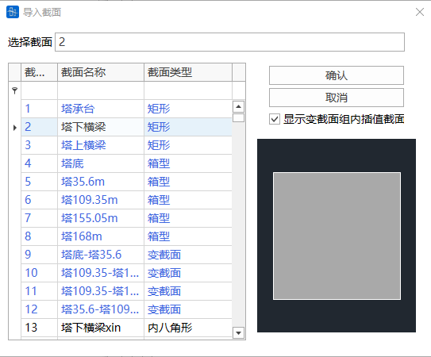

    Tapered section: Select section as tapered section, then select whether to reinforce I-end section or J-end section.

    

    Display tapered section group interpolation sections: After checking, you can select tapered section groups, named in the format (G tapered section group number). Then select which interpolation section within the tapered section group.

    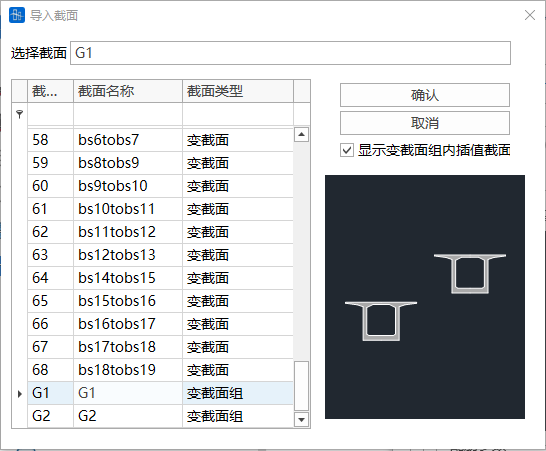

    

##### Local Parametric Reinforcement

- Input
  - **Local Parametric Reinforcement Reference Line**

    Click the blue dialog box to select section segments in the section schematic below.

    The dialog box supports direct input of reference line numbers, supporting formats such as 1to3, 2to10by2.
  - **Reinforcement Parameters**

    Arrangement direction: With the section center point as the center, select whether the segment is arranged outward or inward.

    First point offset value: Offset distance of parametric reinforcement starting point from the segment first point.

    Last point offset value: Offset distance of parametric reinforcement end point from the segment last point.

    Reinforcement method: Can choose to arrange by spacing or by quantity.
  - **Preview**

    Can preview the section reinforcement situation of current local parametric table settings in the right diagram area.
  - **Copy Custom Parametric Reinforcement Information to Other Sections**

    Copy current settings to other sections.
    > 🕵️Note: This copy copies the current local parametric reinforcement information, that is, if the copied section is set with local parametric reinforcement on the third reference line, then the copied section copies the third reference line local parametric reinforcement settings, not directly copying the reinforcement point coordinates of the copied section.
    > 🕵️Note: If the copied section numbers include tapered I-end or J-end sections of a tapered section group, the interpolation sections within that tapered section group will default to copying this local parametric setting.

##### Custom Reinforcement

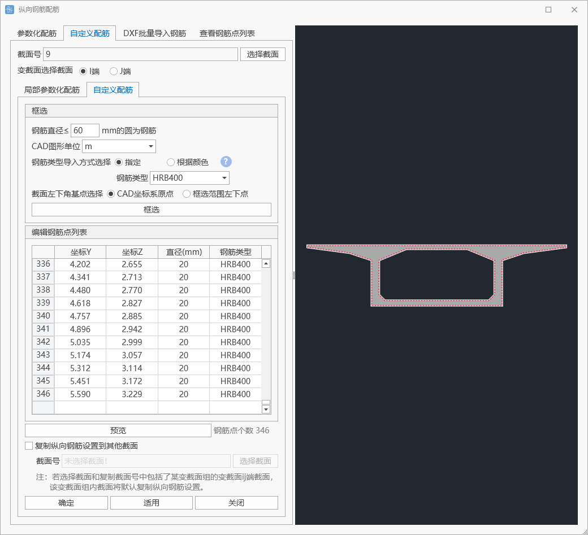

- Input
  - **Frame Selection**

    Click frame selection to call the CAD program, frame select the segments to be imported in CAD, where circles with diameter smaller than the set diameter value will be imported as reinforcement and displayed in the "Edit Reinforcement Point List" below, which can be edited twice.
  - **Preview**

    Can preview the section reinforcement situation of current reinforcement point list in the right diagram area.
  - **Copy Custom Parametric Reinforcement Information to Other Sections**

    Copy current reinforcement points to other sections.
    > 🕵️Note: This copy copies the current reinforcement point list, that is, all reinforcement point coordinate information of the copied section.

#### **dxf Batch Import Reinforcement**

- Function: Use dxf file to batch import section reinforcement.
- Command: "Main Menu" > "Verification" > "Longitudinal Reinforcement" > "Add" > "dxf Batch Import Reinforcement".

- Input
  - **dxf file**

    Select dxf file through button, import corresponding sections by layer, dxf file import rules are as follows:

    When importing DXF files, layer names need to correspond to section names, specific requirements are as follows:

    1. Constant section: Layer name is the same as section name.

    2. Tapered section: I-end section: Layer name is: section name + "-I". J-end section: Layer name is: section name + "-J"

    3. Interpolation section within tapered section group: Layer name is: "G-" + tapered section group name + "-interpolation serial number".

    For example:

    Constant section name is "Inverted T-section 1", layer name needs to be "Inverted T-section 1"

    Tapered section name is "Inverted T-section 1", I-end section layer name needs to be "Inverted T-section 1-I", J-end section layer name needs to be "Inverted T-section 1-J".

    Tapered section group name is "Inverted T-section 1", the third interpolation section layer name needs to be "G-Inverted T-section 1-3"

    Import drawn circles, circle center is the imported reinforcement center point coordinates, circle diameter is reinforcement diameter, circle color is reinforcement specification:

    Circles with index color number 190 (RBG:127,0,255) are reinforcement of type HPB235;

    Circles with index color number 200 (RBG:191,0,255) are reinforcement of type HPB300;

    Circles with index color number 210 (RBG:255,0,255) are reinforcement of type HRB335;

    Circles with index color number 220 (RBG:255,0,191) are reinforcement of type HRB400;

    Circles with index color number 230 (RBG:255,0,127) are reinforcement of type HRB500.

    Circles with index color number 191 (RBG:194,127,255) are reinforcement of type BS250;

    Circles with index color number 193 (RBG:124,82,165) are reinforcement of type BS460;

    Circles with index color number 195 (RBG:95,63,127) are reinforcement of type BS500;

    Circles with index color number 201 (RBG:233,127,255) are reinforcement of type Grade60;

    Circles with index color number 203 (RBG:145,82,165) are reinforcement of type Grade70;

    Circles with index color number 205 (RBG:111,63,127) are reinforcement of type Grade80;

    Circles with index color number 207 (RBG:66,38,76) are reinforcement of type Grade100;

    After successful import, can be modified in the reinforcement point list subsequently.
  - **Unit**

    Set the unit of imported graphics.
  - **All Layers**

    All sections matched by this dxf file.
  - **Selected Layers**

    Select sections to import.
  - **Reset**

    Re-select the imported file.

#### **Edit Reinforcement Point List**

- Function: Display reinforcement point list information of selected sections, editable.
- Command: "Main Menu" > "Verification" > "Longitudinal Reinforcement" > "Add" > "View Reinforcement Point List".

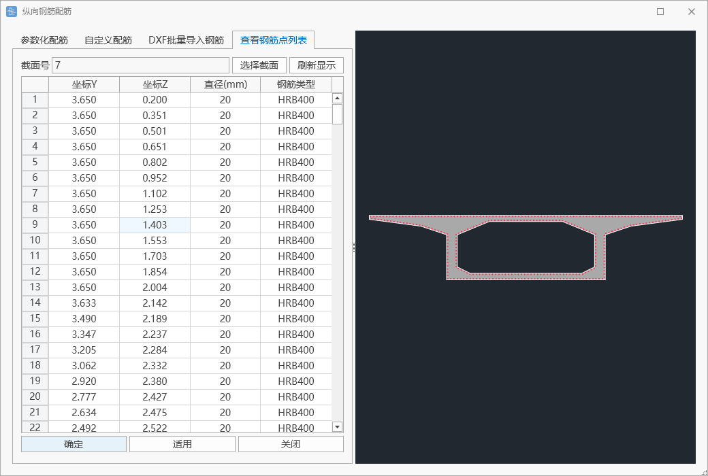

- Input
  - **Select Section**

    Select section through button. Feature sections are not supported.
  - **Reinforcement List**

    Click column header then paste to batch paste copied content to that column.

### 12.2.2 Stirrups

- Function: Set stirrups.
- Command: "Main Menu" > "Verification" > "Stirrups".

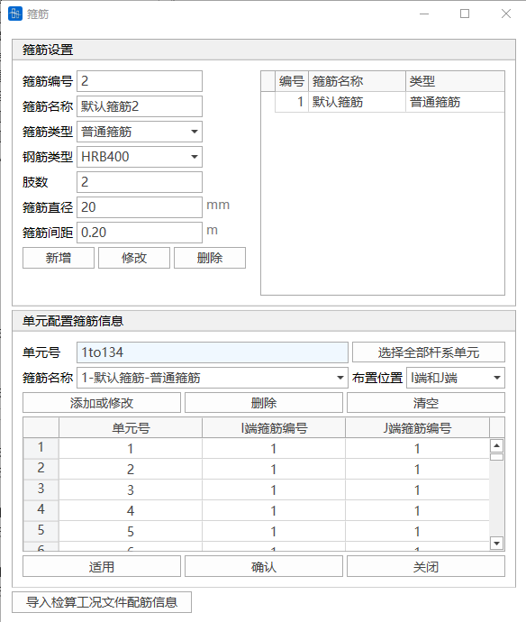

#### Stirrup Settings

- Function: Set stirrup configuration.
- Input
  - **Stirrup Number**

    Set the stirrup number for this type of stirrup.
  - **Stirrup Name**

    Set the stirrup name for this type of stirrup.
  - **Stirrup Type**

    Ordinary stirrup, spiral stirrup.
  - **Reinforcement Type**

    Supports R235, HPB300, HRB335, HRB400, HRB500, BS250, BS460, BS500, Grade60, Grade75, Grade80, Grade100.
  - **Number of Turns**

    Required to set when stirrup type is spiral stirrup, number of turns of spiral stirrup.
  - **Number of Legs**

    Required to set when stirrup type is ordinary stirrup, number of longitudinally arranged reinforcement in stirrup bundle.
  - **Stirrup Diameter**

    Set stirrup diameter.
  - **Stirrup Spacing**

    Set stirrup spacing.
  - **Core Diameter**

    Required to set when stirrup type is spiral stirrup, core diameter of spiral stirrup.

#### Element Configuration Stirrup Information

- Function: Assign stirrup properties to elements.
- Input
  - **Element Number**

    Only supports frame elements.
  - **Stirrup Name**

    Select stirrup type set in the previous step.
  - **Arrangement Position**

    Can choose to arrange stirrups only at I-end or only at J-end or at both ends.
  - **Add or Modify**

    Can add or modify element configuration stirrup information.
  - **Delete**

    Select row to delete in the table, click delete to delete stirrup information of that section.
  - **Clear**

    Clear all element stirrup configuration information.

### 12.2.3 Vertical Tendons

- Function: Set vertical tendons.
- Command: "Main Menu" > "Verification" > "Vertical Tendons".

- Input
  - **Number of Legs**

    Set the number of reinforcement in prestressing tendon bundle.
  - **Single Leg Area**

    Set the cross-sectional area of one leg in vertical prestressing tendon bundle.
  - **Spacing**

    Set the distance between adjacent two legs in vertical prestressing tendon bundle.
  - **Effective Prestress**

    Set the actual prestress magnitude applied to prestressing tendon.
  - **Strength Design Value**$f_{pd}$

    Set the strength design value $f_{pd}$ of vertical prestressing tendon.

## 12.3 Concrete Verification

### 12.3.1 Verification Materials

- Function: Set material parameters required for concrete verification. Can adjust material parameters specifically for verification needs without affecting original material definitions in the properties module, achieving independent management of verification parameters and basic material properties.
- Command: Select "Verification" > "Verification Materials" from the main menu;

> 🧐Materials used for verification must first be defined in "Properties" → "Materials" before further setting verification parameters in this module.

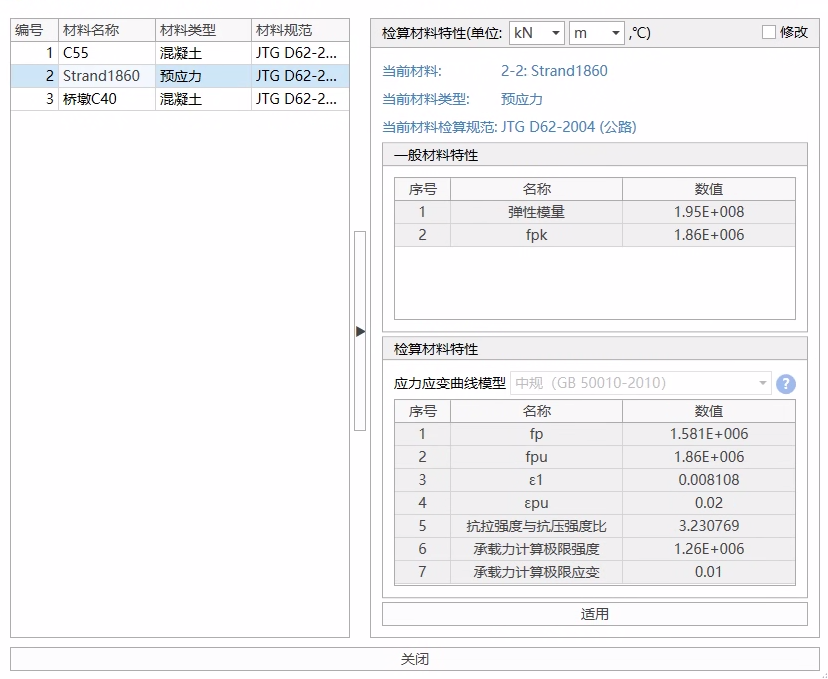

- Input
  - Modify
    - Click "Modify" checkbox to edit current verification parameters
    - Cancel modification to restore system default values
    - **Important Note**: General material property parameters (such as elastic modulus) modified in this interface, if inconsistent with parameters defined in "Properties"-"Materials", will only be applied to concrete verification calculations. Structural calculations still use parameter values defined in "Properties"-"Materials".
  - Apply

    Save currently modified parameter settings.

### 12.3.2 Verification Load Combinations

#### Verification Load Combinations

- Function: Input verification load combinations.
- Command: Select "Verification" > "Verification Load Combinations" from the main menu;

- Table
  - **Name**

    Name of verification load combination.
  - **Type**

    Select the type of this verification load combination:

    Basic combination, accidental combination, characteristic value combination, frequent combination, quasi-permanent combination

    Main force combination, main plus additional combination, main plus special combination
  - **Load Cases**

    Select load cases participating in load combination from load case list.

    Note: For load cases of live load type, the cases defined in 9.5.5 **Moving Load Analysis Cases** are selected as live loads to participate in combination. If load cases of type "live load" defined in static loads in 9.1 Load Cases are used, they do not participate in combination.
  - **Unfavorable Coefficient**

    Input the unfavorable coefficient for selected load cases participating in verification load combination.
  - **Favorable Coefficient**

    Input the favorable coefficient for selected load cases participating in verification load combination.
    > 🧐Load and unfavorable coefficient, same sign takes maximum, different sign takes minimum.
    >
    > Load and favorable coefficient, same sign takes minimum, different sign takes maximum.
    >
    > Example:
    >
    > If Fx is positive, unfavorable coefficient is positive, then combined to Fxmax; favorable coefficient is positive, then combined to Fxmin;
    >
    > If Fx is positive, unfavorable coefficient is negative, then combined to Fxmin; favorable coefficient is negative, then combined to Fxmax;
    >
    > If Fx is negative, unfavorable coefficient is positive, then combined to Fxmin; favorable coefficient is positive, then combined to Fxmax;
    >
    > If Fx is negative, unfavorable coefficient is negative, then combined to Fxmax; favorable coefficient is negative, then combined to Fxmin;
    > 🧐Filling Tips:
    >
    > 1. Permanent actions (except support settlement)
    >
    >    Including structural self-weight, prestressing force, creep and shrinkage, etc., unfavorable coefficients and favorable coefficients must not take negative values.
    > 2. Live loads and support settlement
    >
    >    Unfavorable coefficients must not take negative values, favorable coefficients have no practical significance, can be filled as 0.
    > 3. Other variable actions
    >
    >    Unfavorable coefficients can take negative values. For example, for wind loads, different wind directions can be simulated by filling two identical load cases but with opposite unfavorable coefficients. Favorable coefficients have no practical significance, can be filled as 0.
    >
    > 
  - **Auto Generate Verification Load Combinations**

    Function to assist users in generating verification load combinations, see Auto Generate Verification Load Combinations.

#### Auto Generate Verification Load Combinations

- Function: Assist users in generating verification load combinations.
- Command: Button in the lower left corner of "Verification Load Combinations" window;

- Input
- **Load Combinations**

  Can select code list:

  "Code for Design of Highway Bridges and Culverts General Specifications" (JTG D60-2015)

  "Code for Design of Railway Bridges and Culverts" (TB 10002-2017 J460-2017)

  

  
  - Railway code supports auto combination:

    Main force combination, main plus additional combination, main plus special load combination.
  - Highway code supports auto combination:

    Participate in ultimate limit state design: basic combination, accidental combination

    Participate in serviceability limit state design: frequent combination, quasi-permanent combination

    Participate in elastic stage section stress calculation (Class B members and reinforced concrete members also need to consider cracking conditions): characteristic value combination
  - New railway limit state method combination:

    Participate in ultimate limit state design: basic combinations I-VI, accidental combination VII

    Participate in prestressed member serviceability limit state design: frequent combination IX, frequent combination X, quasi-permanent combination XI

    Participate in reinforced concrete member serviceability limit state design: main force combination, main plus additional combination, accidental combination VII
- **Wind Load Settings**

  Since longitudinal and transverse directions, wind with and without vehicles cannot be combined together, wind loads need to be set separately. Select load cases of type wind load defined in 9.1 Load Cases to participate in combination.

  
- **Gradient Temperature Settings**

  Since longitudinal and transverse directions, gradient heating and gradient cooling cannot be combined together, gradient temperature needs to be set separately. Select load cases of type gradient temperature defined in 9.1 Load Cases to participate in combination.

  
- **Braking Force Settings**

  Selected braking force cases will participate in combination as two cases with opposite coefficients. Select load cases of type braking force defined in 9.1 Load Cases to participate in combination.

  
- **Other Variable Actions Settings**

  For load cases of other load combination types (including custom) that participate in verification, check "Participate in Combination" for that item and fill in custom coefficients.

  
- **Live Load Settings**

  If moving loads participate in verification, can select cases defined in moving load analysis cases to participate in combination, check "Participate in Combination" for that item and fill in custom coefficients.

  
- **Add/Replace**

  Add: Add auto-generated verification load combinations after original verification load combinations.

  Replace: Auto-generated verification load combinations replace original verification load combinations.

### 12.3.3 Concrete Verification Cases

- Function: Set concrete verification cases (subsequent 12.6 Generate Calculation Report will also use this type of case).
- Command: Select "Verification" > "Concrete Verification" from the main menu;

- **Operations**
  - **Add**

    Add new concrete verification case.

    

    Code support: "Code for Design of Highway Reinforced Concrete and Prestressed Concrete Bridges and Culverts" (JTG 3362-2018), "Code for Design of Concrete Structures of Railway Bridges and Culverts" (TB 10092-2017 J462-2017).

    Structure type supports selection: reinforced concrete, Class A members, Class B members, prestressed members.

    Verification structure group: Can select 6.5 **Structure Groups** participating in calculation in the completed bridge state of current calculation results, and the group contains beam elements.
  - **Delete**

    Delete this concrete verification case.
  - **Edit**

    Edit concrete verification case.
  - **Update Verification Data**

    [Verification Case Parameter Synchronization Mechanism Description]

    When users open verification cases, the system will follow the following synchronization rules:
    1. Parameter Auto-Lock Mechanism

       After completing parameter settings or performing calculation operations in the verification interface, current parameter configuration will enter locked state.

       In locked state, subsequent modifications of related parameters such as reinforcement schemes and stirrup specifications will not automatically synchronize to this verification case.
    2. Data Update and Reload Process

       To apply latest parameters to already locked verification cases, please perform:
       - Step 1 Click toolbar [Update Verification Data] button.
       - Step 2 Double-click target verification case:
    > 🕵️After parameter unlocking, the verification interface will clear original settings and need to re-enter calculation parameters.
    > 🕵️This mechanism aims to prevent accidental impact on existing calculation results caused by mid-process modifications during design.
    > 🕵️Supports multi-case independent configuration: Different verification cases can independently save differentiated reinforcement parameter configurations.
  - **Verification**

    Verify this case, see 12.3.4 Concrete Verification Parameter Settings.

### 12.3.4 Concrete Verification Parameter Settings

#### 1 Concrete Verification Introduction

- Function: Set verification information.
- Command: Set concrete verification case, select set concrete verification case in concrete verification case window, click "Verification" (can also double-click to enter);

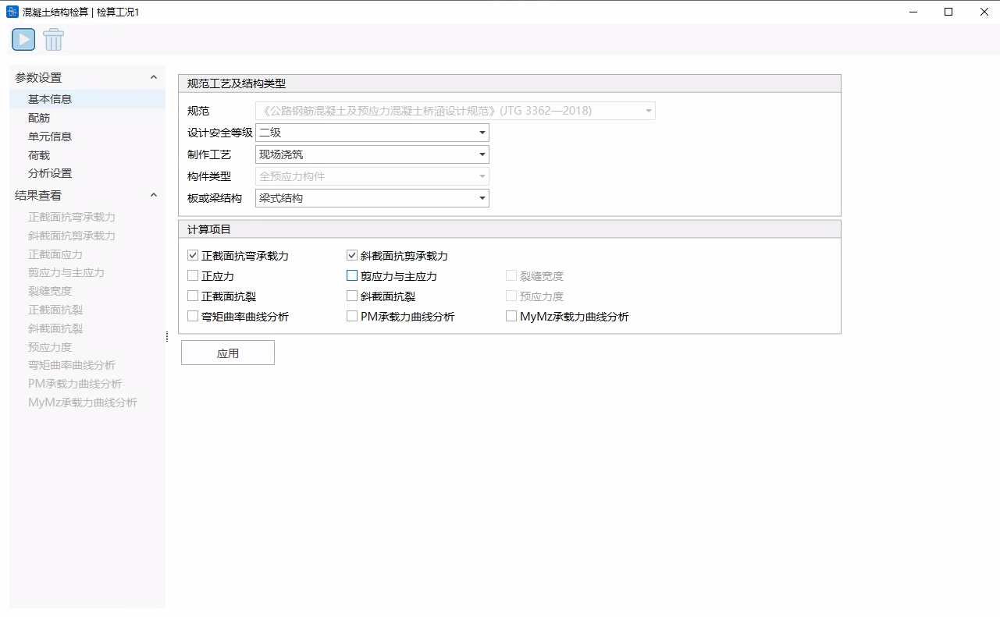

- Currently supported verification codes are:

  "Code for Design of Highway Reinforced Concrete and Prestressed Concrete Bridges and Culverts" (JTG 3362-2018)

  "Code for Design of Concrete Structures of Railway Bridges and Culverts" (TB 10092-2017 J462-2017).

  "British Standard: Steel, Concrete and Composite Bridges-Part4" (BS 5400-4:2006)

  "American Standard: AASHTO LRFD BRIDGE DESIGN SPECIFICATIONS, NINTH EDITION, 2020"
- **Basic Buttons:**
  - **Start Calculation**

    Based on set parameter settings, start verification calculation, see Calculation.
  - **Delete Results**

    Delete verification calculation results of this verification case.
  - **Basic Information**

    See 2 Basic Information.
  - **Reinforcement**

    Set ordinary reinforcement, stirrups, and vertical prestress for sections under this verification case.

    

    See 3 Section and Longitudinal Reinforcement, 4 View Section Reinforcement Situation, 5 Stirrups, 6 Vertical Prestress.
  - **Element Information**

    See 7 Element Information.
  - **Loads**

    See 8 Loads.
  - **Analysis Settings**

    See analysis settings corresponding to verification items in 12.3.5 Verification Item Description.
  - **View Results**

    See 12.3.5 Verification Item Description.

#### 2 Basic Information

- Function: Set concrete verification code process and structure type, set calculation items

- **Design Safety Class**

  Highway code requires filling design safety class.
- **Fabrication Process**

  Prefabricated members, cast-in-place.
- **Plate or Beam Element**

  Highway code requires selecting whether it's plate structure or beam structure.
- **Structure Type**

  Railway code requires selecting whether it's bridge span structure and cap or other structure.
- **Calculation Items**
  - **Verification items supported by "Code for Design of Highway Reinforced Concrete and Prestressed Concrete Bridges and Culverts" (JTG 3362-2018):**
    - Reinforced concrete:

      Normal section flexural bearing capacity, oblique section shear bearing capacity, normal section stress, shear stress and principal stress, crack width, moment-curvature curve analysis, PM bearing capacity curve analysis, MyMz bearing capacity curve analysis;
    - Class A members:

      Normal section flexural bearing capacity, oblique section shear bearing capacity, normal section stress, shear stress and principal stress, normal section crack resistance, oblique section crack resistance, moment-curvature curve analysis, PM bearing capacity curve analysis, MyMz bearing capacity curve analysis;
    - Class B members:

      Normal section flexural bearing capacity, oblique section shear bearing capacity, normal section stress, shear stress and principal stress, crack width, normal section crack resistance, oblique section crack resistance, moment-curvature curve analysis, PM bearing capacity curve analysis, MyMz bearing capacity curve analysis;
    - Fully prestressed members:

      Normal section flexural bearing capacity, oblique section shear bearing capacity, normal section stress, shear stress and principal stress, normal section crack resistance, oblique section crack resistance, moment-curvature curve analysis, PM bearing capacity curve analysis, MyMz bearing capacity curve analysis;
  - **Verification items supported by "Code for Design of Concrete Structures of Railway Bridges and Culverts" (TB 10092-2017 J462-2017):**
    - Reinforced concrete:

      Normal section flexural bearing capacity, oblique section shear bearing capacity, normal section stress, shear stress and principal stress, crack width, moment-curvature curve analysis, PM bearing capacity curve analysis, MyMz bearing capacity curve analysis;
    - Class A members:

      Normal section flexural bearing capacity, oblique section shear bearing capacity, normal section stress, shear stress and principal stress, prestress degree, moment-curvature curve analysis, PM bearing capacity curve analysis, MyMz bearing capacity curve analysis;
    - Class B members:

      Normal section flexural bearing capacity, oblique section shear bearing capacity, normal section stress, shear stress and principal stress, crack width, prestress degree, moment-curvature curve analysis, PM bearing capacity curve analysis, MyMz bearing capacity curve analysis;
    - Fully prestressed members:

      Normal section flexural bearing capacity, oblique section shear bearing capacity, normal section stress, shear stress and principal stress, normal section crack resistance, prestress degree, moment-curvature curve analysis, PM bearing capacity curve analysis, MyMz bearing capacity curve analysis;

#### 3 Section and Longitudinal Reinforcement

- Function: Set sections and longitudinal reinforcement under this verification case.
- Command: Select "Verification" > "Verification Load Combinations" from main menu > select verification case click "Verification" > "Concrete Verification" > "Reinforcement" > "Section and Longitudinal Reinforcement";

- Input
- **Section**

  Program automatically imports sections of elements participating in verification.
- **Parametric Input Reinforcement**

  

  Parametric input reinforcement, can choose to input by spacing or by quantity. Length unit is mm.
  - Outer ring reinforcement: Reinforcement near outer edge;
  - Inner ring reinforcement: Reinforcement near inner edge;
  - Spacing: Required to fill when inputting by spacing, represents distance between same layer reinforcement, can input quantity corresponding to number of layers (example: 150,150,150), can also input one number (example: 150) representing same spacing for each layer reinforcement;
  - Number of bundles per layer: Required to fill when inputting by quantity, represents number of reinforcement bundles per layer, for example if number of bundles per layer is 10, number of bars per bundle is 2, then number of reinforcement per layer is 20. Can input quantity corresponding to number of layers (example: 150,150,150), can also input one number (example: 150) representing same bundle number for each layer.
  - Diameter: Can input quantity corresponding to number of layers (example: 28,28,28), can also input one number (example: 28) representing same diameter for each layer reinforcement.
  - Layer spacing: Can leave blank when number of layers is 1, fill corresponding layer spacing when greater than 1 (example: if there are 3 layers, fill 100,100), order is from outer ring to inner ring.
  - Number of bars per bundle: Used for bundle reinforcement input, fill 1 means not using bundle reinforcement, fill 2 means two reinforcement as one bundle. Can input quantity corresponding to number of layers (example: 2,2,1), can also input one number (example: 2) representing same number of bars per bundle for each layer.
- **Input Reinforcement Points Method Input Reinforcement**

  

  Double-click section list to enter section window of that section, can sequentially input reinforcement point coordinates, diameter, type parameters in reinforcement list. After filling, click "Edit" to complete reinforcement setting.

  Type: 1, 2, 3, 4, 5 respectively represent reinforcement types: R235, HPB300, HRB335, HRB400, HRB500.
- **CAD Frame Selection Input Reinforcement**

  

  Double-click section list to enter section window of that section, click CAD frame selection, select drawn section reinforcement in CAD, can import relevant information to reinforcement list, click "Edit" to complete reinforcement setting. Represent reinforcement type by color number: 31, 32, 33, 34, 35 respectively represent reinforcement types: R235, HPB300, HRB335, HRB400, HRB500.

#### 4 View Section Reinforcement Situation

- Description: Display section reinforcement situation.
- Command:

  Select "Verification" > "Verification Load Combinations" from main menu > select verification case click "Verification" > "Concrete Verification" > "Reinforcement" > "View Section Reinforcement Situation";

- Parameters:

  Section reinforcement situation table displays section name, reinforcement diameter, number of reinforcement, reinforcement type, reinforcement area, section area and reinforcement ratio.

  Table right-click supports functions: copy, copy with header, table style settings (can set column width, decimal point display precision), export table to Excel, export table as text

#### 5 Stirrups

- Function: Set stirrups under this verification case.

- Input
  - **Stirrup Name**

    Set stirrup name for this type of stirrup.
  - **Stirrup Type**

    Ordinary stirrup, spiral stirrup.
  - **Reinforcement Type**

    Supports R235, HPB300, HRB335, HRB400, HRB500.
  - **Number of Turns**

    Required to set when stirrup type is spiral stirrup, number of turns of spiral stirrup.
  - **Number of Legs**

    Required to set when stirrup type is ordinary stirrup, number of longitudinally arranged reinforcement in stirrup bundle.
  - **Stirrup Diameter**

    Set stirrup diameter.
  - **Stirrup Spacing**

    Set stirrup spacing.
  - **Core Diameter**

    Required to set when stirrup type is spiral stirrup, core diameter of spiral stirrup.

#### 6 Vertical Prestress

- Function: Set vertical prestress under this verification case.

- Input
  - **Number of Legs**

    Set number of reinforcement in prestressing tendon bundle.
  - **Single Leg Area**

    Set cross-sectional area of one leg in vertical prestressing tendon bundle.
  - **Spacing**

    Set distance between adjacent two legs in vertical prestressing tendon bundle.
  - **Effective Prestress**

    Set actual prestress magnitude applied to prestressing tendon.
  - **Strength Design Value**$f_{pd}$

    Set strength design value $f_{pd}$ of vertical prestressing tendon.

#### 7 Element Information

- Function: View and modify element information participating in verification.

- Input
  - **Element**

    Automatically import elements based on selected 6.5 **Structure Group**.
  - **Calculation Length Iy, Calculation Length Iz**

    ILY, ILZ, JLY, JLZ respectively represent calculation lengths of I-end section about Y-axis, Z-axis and J-end section about Y-axis, Z-axis. Used to calculate eccentricity increase coefficient, axial compression stability coefficient, etc.

#### 8 Loads

Function: View element load information participating in verification.

Combine element calculation results according to verification load combinations to obtain concurrent loads when each of the six degrees of freedom at I and J ends are maximum and minimum.

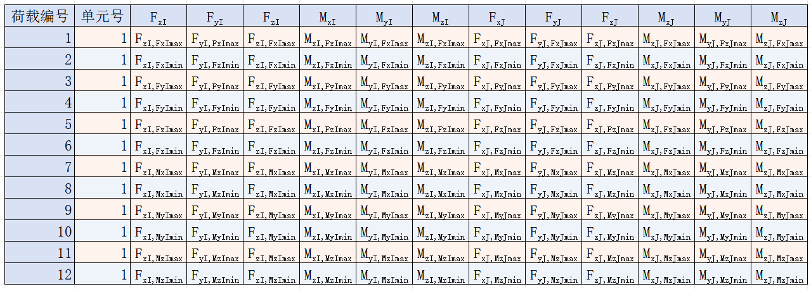

### 12.3.5 Verification Item Description

#### 1 Normal Section Flexural Bearing Capacity

- **Description:**
  - Normal section flexural bearing capacity calculation description for railway code selection:
    - Railway code does not provide bearing capacity calculation formulas for reinforced concrete structures, software calculation results are for reference only.
    - Calculation principle is:
      Concrete maximum stress is ultimate strength, reinforcement maximum stress is calculation strength, obtain bearing capacity. Safety coefficient limit values are: Main force action: K1=2.0; Main+Additional: K2=1.8; Construction temporary load: K3=1.8; Main+Special load: K4=1.8. If it's cast-in-place member K1=K1*1.1, K2=K2*1.1. Code does not provide safety coefficient for bearing capacity calculation of prestressed concrete structures under main+special load action, software takes 1.8.
  - Others
    - Considered eccentricity increase coefficient and stability coefficient. Concrete ultimate strength and ultimate compressive strain are taken according to code, reinforcement ultimate tensile strain is taken as 0.01.
- **Analysis Settings:**
  - Analysis Settings > Normal Section Flexural Bearing Capacity Settings. Need to set calculation method.
  - Calculation method options:
    - Proportional change: $\frac{F_{X D}}{F_{X}}=\frac{M_{Y_{D}}}{M_{Y}}=\frac{M_{Z_{D}}}{M_{\underline{Z}}}=K$
    - Axial force unchanged: ${F_{X D}}={F_{X}}$, $\frac{M_{Y_{D}}}{M_{Y}}=\frac{M_{Z_{D}}}{M_{Z}}=K$
    - MY unchanged: ${M_{Y D}}={M_{Y}}$, $\frac{F_{X_{D}}}{F_{X}}=\frac{M_{Z_{D}}}{M_{Z}}=K$
    - MZ unchanged: ${M_{Z D}}={M_{Z}}$, $\frac{F_{X_{D}}}{F_{X}}=\frac{M_{Y_{D}}}{M_{Y}}=K$
    - Axial force and MY unchanged: ${F_{X D}}={F_{X}}$, ${M_{Y D}}={M_{Y}}$, $\frac{M_{Z_{D}}}{M_{Z}}=K$
    - Axial force and MZ unchanged: ${F_{X D}}={F_{X}}$, ${M_{Z D}}={M_{Z}}$, $\frac{M_{Y_{D}}}{M_{Y}}=K$
    - MY and MZ unchanged: ${M_{Y D}}={M_{Y}}$, ${M_{Z D}}={M_{Z}}$, $\frac{F_{X_{D}}}{F_{X}}=K$
    Where, ${F_{X}},{M_{Y}},{M_{Z}}$ are loads, ${F_{XD}},{M_{YD}},{M_{ZD}}$ are bearing capacities, $K$ is safety coefficient.
- Parameters:

  General table can view most unfavorable load results for each element IJ end.

  Table right-click supports functions: copy, copy with header, table style settings (can set column width, decimal point display precision), export table to Excel, export table as text.
- Detailed Table:

  This calculation item supports viewing detailed table, click section "Detailed Table" button. Can view normal section flexural bearing capacity calculation results of element IJ end under different load actions

  

#### 2 Oblique Section Shear Bearing Capacity

- **Description:**

  This module only calculates shear bearing capacity in Z direction.

  When selecting "Code for Design of Highway Reinforced Concrete and Prestressed Concrete Bridges and Culverts" (JTG 3362—2018) and "Code for Design of Concrete Structures of Railway Bridges and Culverts" (TB 10092—2017  J 462—2017), oblique section shear bearing capacity in software does not consider bearing capacity of bent-up reinforcement.

  For asymmetric sections, exceeding code application range, oblique section shear bearing capacity calculated by this module may have errors, calculation results are for reference only.

  Since code only provides oblique section shear bearing capacity calculation formulas for flexural members, for tension-flexure members, software also calculates according to code, results may be too large, for compression-flexure members, software also calculates according to code, results may be too small, calculation results are for reference only.

  Verified members may have situations of full section in compression or full section in tension. For positive moment members, take area below inertia principal axis as tension zone to calculate effective height h0 and longitudinal reinforcement ratio; for negative moment members, take area above inertia principal axis as tension zone to calculate effective height h0 and longitudinal reinforcement ratio. Therefore, this module has no effect of axial force on effective height h0 and longitudinal reinforcement ratio.
- Analysis Settings:

  Analysis Settings > Oblique Section Shear Bearing Capacity Settings.
  - Can set consider how many times section height of reinforcement. Default is 1.

    User can input parameter to control reinforcement range for calculating effective height h0 and longitudinal reinforcement ratio. For example, input 0.2, represents tension reinforcement within 0.2 times section height range starting from tension edge, used for calculating effective height h0 and longitudinal reinforcement ratio.

    When following code (JTG 3362—2018), for calculating effective height h0 and longitudinal reinforcement ratio, do not consider bent-up tendons, tendon tangent and element axial angle cosine ≤0.996 is bent-up tendon; when calculating bearing capacity design value, consider all bent-up tendons intersecting with oblique section.
- **Parameters:**

  General table can view most unfavorable load results for each element IJ end.

  Table right-click supports functions: copy, copy with header, table style settings (can set column width, decimal point display precision), export table to Excel, export table as text.
- **Detailed Table**

  This calculation item supports viewing detailed table, click section "Detailed Table" button. Can view oblique section shear bearing capacity calculation results of element IJ end under different load actions.

#### 3 Normal Section Stress

- **Description:**
  - When selecting code "Code for Design of Highway Reinforced Concrete and Prestressed Concrete Bridges and Culverts" (JTG 3362—2018), and for prestressed concrete members, construction stage (transient condition) stress calculation, elastic calculation is adopted according to code.
- **Parameters:**

  General table can view most unfavorable load results for each element IJ end.

  Table right-click supports functions: copy, copy with header, table style settings (can set column width, decimal point display precision), export table to Excel, export table as text.
- **Detailed Table:**

  This calculation item supports viewing detailed table, click section "Detailed Table" button. Can view normal section stress calculation results of element IJ end under different load actions.

#### 4 **Shear Stress** and Principal Stress

- **Description:**

  Only consider action of axial force Fx, vertical shear force Fz and vertical bending My. For z-axis asymmetric sections, calculation results have errors.

  Calculation of concrete vertical compressive stress does not consider prestressing force of transverse prestressing reinforcement, transverse temperature gradient and concrete vertical compressive stress frequent value generated by vehicle loads.
  - For "Code for Design of Highway Reinforced Concrete and Prestressed Concrete Bridges and Culverts" (JTG 3362—2018)

    Reinforced concrete members only calculate maximum principal tensile stress of construction loads, compression-flexure and tension-flexure calculation formulas refer to compression-flexure member calculation formulas in "Code for Design of Concrete Structures of Railway Bridges and Culverts" (TB 10092—2017);

    Prestressed concrete calculates principal compressive stress of characteristic value combination.
  - For "Code for Design of Concrete Structures of Railway Bridges and Culverts" (TB 10092—2017)

    Reinforced concrete members only calculate maximum principal tensile stress of main force combination, main plus additional combination, main plus special combination and construction loads, tension-flexure calculation formulas refer to compression-flexure member calculation formulas;

    Prestressed concrete calculates shear stress and principal tensile stress of main force combination, main plus additional combination, main plus special combination and construction loads, fully prestressed concrete also needs to calculate principal compressive stress.

    According to railway code provisions, reinforced concrete flexural members should verify shear stress at intersection of compression zone slab and stem, and when tension zone flange protrudes significantly from beam stem, should verify shear stress at intersection of beam stem and flange, software has not yet added this verification.
    |       | Construction Loads                                     | Main Force Combination         | Main Plus Additional Combination        | Main Plus Special         |
    | ----- | ---------------------------------------- | ------------ | ------------ | ------------ |
    | Reinforced Concrete | None                                        |              |              |              |
    | Class B Members  | $0.17 f_{c}+0.55 \sigma_{c y}$           |              |              |              |
    | Class A Members  |                                          |              |              |              |
    | Fully Prestressed  |                                          |              |              |              |
    |       | Construction Loads                                     | Main Force Combination         | Main Plus Additional Combination        | Main Plus Special         |
    | ----- | ---------------------------------------- | ------------ | ------------ | ------------ |
    | Reinforced Concrete | $\left[\sigma_{tp-1}\right]=0.9 f_{c t}$ |              |              |              |
    | Class B Members  | $0.7 f_{ct}$                             | $0.7 f_{ct}$ | $0.7 f_{ct}$ | $0.7 f_{ct}$ |
    | Class A Members  | $0.85 f_{ct}$                            | $0.7 f_{ct}$ | $0.7 f_{ct}$ | $0.7 f_{ct}$ |
    | Fully Prestressed  | $f_{ct}$                                 | $f_{ct}$     | $f_{ct}$     | $f_{ct}$     |
    |       | Construction Loads                                     | Main Force Combination         | Main Plus Additional Combination        | Main Plus Special         |
    | ----- | ------------                             | -----------  | ------------ | ------------ |
    | Reinforced Concrete | None                                        |              |              |              |
    | Class B Members  |                                          |              |              |              |
    | Class A Members  |                                          |              |              |              |
    | Fully Prestressed  | $0.66 f_{c}$                             | $0.6 f_{c}$  | $0.66 f_{c}$ | $0.66 f_{c}$ |
- **Parameters:**

  Can view shear stress and principal stress calculation results for each element IJ end.

  Table right-click supports functions: copy, copy with header, table style settings (can set column width, decimal point display precision), export table to Excel, export table as text.

#### 5 Crack Width

- **Calculation Range:**

  "Code for Design of Highway Reinforced Concrete and Prestressed Concrete Bridges and Culverts" (JTG 3362-2018): Member types are: reinforced concrete, Class B members;

  "Code for Design of Concrete Structures of Railway Bridges and Culverts" (TB 10092-2017 J462-2017): Member types are: reinforced concrete, Class B members;
- **Description:**

  Software takes maximum reinforcement strain to calculate crack width. Equivalent diameter is taken according to code.

  Since code does not provide reinforcement ratio calculation formula for spatially loaded members, this module refers to code plane loading formula for calculation, may have errors, calculation method is described below:

  Except for circular and annular, reinforced concrete member reinforcement ratio calculation formula according to railway code (TB 10092-2017) is:

  $\mu_{z}=\frac{\left(\beta_{1} n_{1}+\beta_{2} n_{2}+\beta_{3} n_{3}\right) A_{s l}}{A_{c l}}$

  Where, $\beta_{1},\beta_{2},\beta_{3}$ are coefficients considering bundled reinforcement, single reinforcement $\beta_{1}=1.0$, two reinforcement per bundle $\beta_{2}=0.85$, three reinforcement per bundle $\beta_{3}=0.7$. $n_{1},n_{2},n_{3}$ are numbers of tension reinforcement of single, two per bundle, three per bundle. $A_{s1}$ is area of single reinforcement. $A_{c1}$ is tension concrete area interacting with tension reinforcement, take minimum of tension zone area ABDF and twice area CDE. Line AF is neutral axis, line CE is parallel to neutral axis and passes through tension zone resultant point.

  

  Prestressed concrete member reinforcement ratio calculation formula according to railway code (TB 10092-2017) is:

  $\mu_{z}=\frac{A_{s}+A_{p}}{A_{c e}}$

  Where, $A_{s},A_{p}$ are areas of ordinary reinforcement and prestressing tendons in tension zone, $A_{ce}$ is minimum of tension zone area ABC and area 643B. 14 side, 12 side, 23 side and 34 side are 7.5d from nearest tension reinforcement.

  

  Except for circular and annular, reinforcement ratio calculation formula according to highway code (JTG 3362-2018) is:

  $\mu_{\mathrm{z}}=\frac{\mathrm{A}_{\mathrm{s}}}{\mathrm{A}_{\mathrm{te}}}$

  Where, $A_{s}$ is longitudinal reinforcement area in tension zone, $A_{t e}=2 a_{s} b$, $a_{s}$ is distance from tension zone resultant point to tension edge, b is tension zone width. AC is neutral axis, area ABC is tension zone.

  
- **Analysis Settings:**

  Analysis Settings > Crack Width Calculation Settings.
  - **Environment Category**

    Set environment category.
  - **Crack Limit**

    Display only, value determined by selected environment category.
  - **Net Cover Thickness**

    Net cover thickness.
  - **Reinforcement Type**

    Select ribbed reinforcement or plain round reinforcement.
  - **Action Influence Coefficient**

    Can automatically calculate action influence coefficient based on input loads, also supports user customization.
  - **Epoxy Resin Reinforcement**

    Can choose whether it is epoxy resin reinforcement.
  - **Welded Reinforcement Skeleton**

    Can choose whether it is welded reinforcement skeleton.
- **Parameters:**

  General table can view maximum crack width and crack width calculation related results for each element IJ end.

  Table right-click supports functions: copy, copy with header, table style settings (can set column width, decimal point display precision), export table to Excel, export table as text.
- **Detailed Table:**

  This calculation item supports viewing detailed table, click section "Detailed Table" button. Can view crack width calculation results of element IJ end under different load actions.

#### 6 Normal Section Crack Resistance

- **Description:**

  This module calculates crack resistance according to "Code for Design of Concrete Structures of Railway Bridges and Culverts" (TB 10092—2017  J 462—2017), does not consider concrete plasticity correction coefficient.
- **Parameters:**

  Table right-click supports functions: copy, copy with header, table style settings (can set column width, decimal point display precision), export table to Excel, export table as text.

#### 7 Oblique Section Crack Resistance

- **Calculation Range:**

  "Code for Design of Highway Reinforced Concrete and Prestressed Concrete Bridges and Culverts" (JTG 3362-2018): Member types are: Class A members, Class B members, fully prestressed members.
- **Description:**

  Only consider action of axial force Fx, vertical shear force Fz and vertical bending My. For z-axis asymmetric sections, calculation results have errors.

  For "Code for Design of Highway Reinforced Concrete and Prestressed Concrete Bridges and Culverts" (JTG 3362—2018), prestressed concrete calculates principal compressive stress of frequent value combination.

#### 8 Prestress Degree

- **Description:**

  Calculate according to code.
- **Parameters:**

  Table right-click supports functions: copy, copy with header, table style settings (can set column width, decimal point display precision), export table to Excel, export table as text.

#### 9 Moment-Curvature Curve Analysis

- **Description:**

  This module uses actual material constitutive models, that is, does not consider partial coefficients.

  Does not consider eccentricity increase coefficient and stability coefficient.
- **Analysis Settings:**

  Analysis Settings > Moment-Curvature Curve Analysis Settings.
  - **Axial Force P Change / Moment M Change**

    Select whether to change based on axial force P or based on moment M.
  - **Moment-Curvature Relationship**

    Select bilinear model or ideal elastic-plastic model.
- **Parameters:**

  General table can view most unfavorable load results for each element IJ end.

  Table right-click supports functions: copy, copy with header, table style settings (can set column width, decimal point display precision), export table to Excel, export table as text.
- **Detailed Table:**

  This calculation item supports viewing detailed table, click section "Detailed Table" button. Can view moment-curvature curve analysis calculation results of element IJ end under different load actions.

#### 10 PM Bearing Capacity Curve Analysis

- **Description:**

  Does not consider eccentricity increase coefficient and stability coefficient.

  Calculation uses bearing capacity calculation strength and bearing capacity calculation strain.
- **Analysis Settings:**

  Analysis Settings > Bearing Capacity Curve Analysis Settings.
  - **Number of Points**

    Number of discrete points of bearing capacity curve.
  - **Angle between M and y-axis**

    Angle between M and y-axis. Direction is positive counterclockwise from y-axis about x-axis to M.

    
  - **Axial Force P Value**

    Axial force P value.
- **Parameters:**

  Can view PM bearing capacity curve analysis results for different element IJ ends.

  Table right-click supports functions: copy, copy with header, table style settings (can set column width, decimal point display precision), export table to Excel, export table as text.

#### 11 MyMz Bearing Capacity Curve Analysis

- Description:

  Does not consider eccentricity increase coefficient and stability coefficient.

  Calculation uses bearing capacity calculation strength and bearing capacity calculation strain.
- Analysis Settings:

  Analysis Settings > Bearing Capacity Curve Analysis Settings.
  - **Number of Points**

    Number of discrete points of bearing capacity curve.
  - **Angle between M and y-axis**

    This parameter is only meaningful for PM bearing capacity curve analysis, has no meaning for MyMz bearing capacity curve analysis, can be left unset.
  - **Axial Force P Value**

    Axial force P value.
- Parameters:

  Can view MyMz bearing capacity curve analysis results for different element IJ ends.

  Table right-click supports functions: copy, copy with header, table style settings (can set column width, decimal point display precision), export table to Excel, export table as text.

## 12.4 Steel Truss Beam Verification

### 12.4.1 Plate Hole Deduction

- Description:

  In steel structure design, bolt holes reduce the effective cross-sectional area of members, thereby reducing their bearing capacity. During design, need to consider the influence of holes on member section strength to ensure that even with holes, members can still meet bearing requirements.

  

> 📌**Automatic Hole Deduction Function:**
>
> - Automatic processing: Lower flange and left and right webs: Software can automatically perform full hole deduction on lower flange and left and right webs of box-type steel beam sections. This automatic processing can reduce tedious manual operations and improve design efficiency.
> - Default hole diameter and hole spacing: Hole diameter: Software default bolt hole diameter is 33 mm. Hole spacing: Hole spacing is set to 100 mm by default.
> - Batch hole deduction: Sections with consistent rules: For multiple sections with same hole deduction rules, software supports batch processing. Users only need to set hole deduction rules once, software can automatically apply this rule to multiple sections, greatly reducing repetitive operations and improving work efficiency.

### 12.4.2 Define Members

#### 12.4.2.1 **Member Classification and Information Input**

- Member Classification
  - Chord: Chords mainly include upper chord and lower chord, usually used to withstand moments and longitudinal loads.
  - Web member: Web members are located in the middle of truss, used to increase structural stability and bearing capacity, mainly withstand shear force.
  - Chord and web member classification affects member calculation length, according to railway bridge steel structure design code 5.1.1, chord calculation length is member length l0, for non-crossed members in-plane calculation length takes l0, out-of-plane calculation length takes 0.8l0.
- Information Input
  - Element division: Users need to fill in elements contained in each member. This helps software perform accurate structural calculation and analysis.
  - Member name: Each member needs a name for identification and management.
  - Whether to deduct holes: Users need to indicate whether members have bolt holes. This information is used to adjust calculations to consider the influence of holes on structural strength and stability.

> 📌Intelligent Member Generation Function **:**
>
> - Structure group establishment: Users need to define two structure groups: upper chord structure group and lower chord structure group, used to assist intelligent member generation.
> - Automatic node position finding: Click "Intelligent Member Generation" button, software can automatically identify and determine member node positions based on upper chord and lower chord structure group information.
> - Automatic division and member generation: Upper chord and lower chord: Software will automatically divide and generate all upper chords, lower chords and web members, determining specific position and dimensions of each member based on node positions.

### 12.4.3 Define Verification Cases

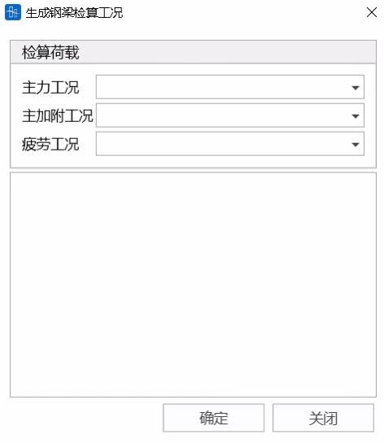

- Description

  Before generating verification cases, first need to define loads to be verified, select main force cases, main plus additional cases, and fatigue cases in drop-down boxes respectively, and select members to be verified in the list. Program will automatically extract calculation related information based on member information, section hole deduction information, and internal force status under corresponding cases.

#### 12.4.3.1 **Extract Material Information**

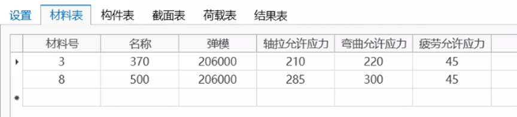

- Description

  Software material table lists all material information of selected members, including material number, elastic modulus, axial tension allowable stress, bending allowable stress, fatigue allowable stress, etc. Users can check and modify by themselves.

#### 12.4.3.2**Extract Section Information**

Software section table lists all section information of selected members, including gross section area, gross moment of inertia about element y-axis, gross moment of inertia about element z-axis, net section area, net moment of inertia about element y-axis, net moment of inertia about element z-axis, maximum plate thickness, stress point position, and product of inertia in element local coordinate system yz plane.

> 📌Note 1: Only after section hole deduction, net section properties will differ from gross section properties

> 📌Note 2: When element coordinate system beta angle is 90 or 270°, moment of inertia about y-axis and moment of inertia about z-axis will automatically swap.

> 📌Note 3: Considering Ixy is in the following formula for calculating section modulus (where xy are section horizontal axis and section vertical axis) 
>
> $$
> W_{x}=\frac{I_{x} I_{y}-I_{x y}^{2}}{I_{y} y-I_{x y} \cdot x}
> $$

#### 12.4.3.3 **Extract Member Information**

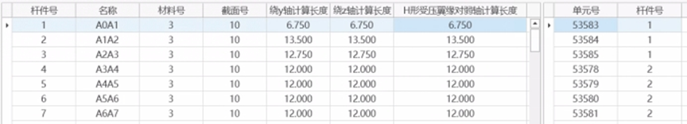

- Description

  Software member table contains member name, material number, section number, and calculation length about y-axis, calculation length about z-axis, and calculation length $l_{0}$ of H-shaped compression flange about weak axis, in addition, member number corresponding to each element is also listed on the right.

> 📌Where l0 is calculation length of compression flange about weak axis, ry, rz are radii of gyration of member about strong axis and weak axis respectively, for details please refer to provisions 4.2.2-4. Program considers using this parameter to calculate allowable stress reduction coefficients φ2x, φ2y for H-shaped members.
>
> $$
> \lambda_{e}=\alpha \cdot \frac{l_{0} r_{x}}{h r_{y}}
> $$

#### 12.4.3.4 **Extract Internal Forces**

- Description

  Based on selected cases and elements in members, program will find beam element self-concurrent internal forces (axial force, in-plane moment, out-of-plane moment) under corresponding cases.

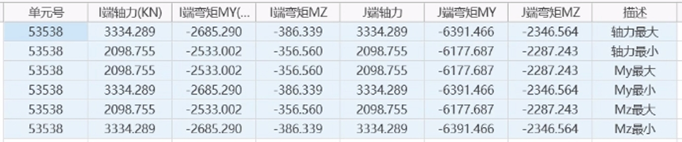

> 📌Each element will extract 6 internal force items: axial force maximum, axial force minimum, My maximum, My minimum, Mz maximum, Mz minimum. Taking axial force maximum item as example: In this row, I-end and J-end axial forces are both maximum: when I-end axial force is maximum, its corresponding concurrent My, Mz values, when J-end axial force is maximum, its corresponding concurrent My, Mz values. I-end and J-end axial force maximum do not necessarily occur simultaneously, but are placed in same row to reduce table rows.

### 12.4.4 **Verification Calculation**

#### 12.4.4.1**Strength Calculation**

Strength calculation adopts formulas as follows:

Strength calculation adopts formulas as follows:

Axial loading: $σ_1=N/A≤[σ]$

Unidirectional bending: $σ_1=M/W≤[σ]$

Unidirectional compression-flexure tension-flexure: $σ_1= \frac{N}{A}±\frac{M}{W}≤[σ]$

Oblique bending: $σ_1=((M_x/W_x)+M_y/W_y )  1/C≤[σ]$

Oblique compression-flexure tension-flexure: $σ_1=N/A±(M_x/W_x +M_y/W_y )  1/C≤[σ]$

C is oblique bending allowable stress increase coefficient.

#### 12.4.4.2 **Stability Calculation**

Stability calculation adopts formulas as follows:

Axial loading: $σ_1=N/(φ_1 A_m )≤[σ]$

Unidirectional bending: $σ_1=M/φ_2 W_m ≤[σ]$

Compression-flexure: $σ_1=N/(φ_1 A_m )+1/(μ_1 φ_2 )  M/W_m ≤[σ]$

#### 12.4.4.3 **Fatigue Calculation**

1, Welded members:

1\) Tension-tension members or tension-compression members mainly in tension $ρ=σ_{min}/σ_{max} ≥-1$ equivalent stress amplitude calculation formula:

$\sigma_{d f}=\frac{\gamma_{\mathrm{d}} \gamma_{\mathrm{n}}\left(\sigma_{\max }-\sigma_{\min }\right)}{\gamma_{\mathrm{t}}} \leq\left[\sigma_{0}\right]$

2\) Tension-compression members mainly in compression $ρ=σ_{min}/σ_{max} <-1$ equivalent stress amplitude calculation formula:

$\sigma_{d f}=\frac{\gamma_{\mathrm{d}} \gamma_{\mathrm{n}}^{\prime}\left(\sigma_{\max }\right)}{\gamma_{\mathrm{t}} \gamma_{\rho}} \leq\left[\sigma_{0}\right]$

2, Non-welded members:

1\) Tension-tension members $ρ=σ_{min}/σ_{max} ≥ 0$ equivalent stress amplitude calculation formula:

$\sigma_{d f}=\frac{\gamma_{\mathrm{d}} \gamma_{\mathrm{n}}\left(\sigma_{\max }-\sigma_{\min }\right)}{\gamma_{\mathrm{t}}} \leq\left[\sigma_{0}\right]$

2\) Tension-tension members $ρ=σ_{min}/σ_{max} ≥ 0$ equivalent stress amplitude calculation formula:

$\sigma_{d f}=\frac{\gamma_{\mathrm{d}} \gamma_{\mathrm{n}}^{\prime}\left(\sigma_{\max }\right)}{\gamma_{\mathrm{t}} \gamma_{\rho}} \leq\left[\sigma_{0}\right]$

$σ_{min}$$σ_{max}$ are maximum and minimum stresses, tension is positive; $[σ_{0}]$ is allowable stress amplitude; $ \gamma_{d}$ is multi-line coefficient; $ \gamma_{n}$ is damage correction coefficient mainly in tension; $ \gamma_{n}^{,}$ is damage correction coefficient mainly in compression; $ \gamma_{t}$ is plate thickness correction coefficient; $ \gamma_{ρ}$ is stress ratio correction coefficient.

### 12.4.5 **Query Results**

#### 12.4.5.1 **Strength Calculation Results**

Stress under main force action, k takes 1.0

Stress under main force + in-plane secondary stress (or out-of-plane secondary stress) action, k takes 1.2.

Stress under main force + in-plane secondary stress + out-of-plane secondary stress action, k takes 1.4.

Stress under main force + additional force action, k takes 1.3.

Stress under main force + in-plane secondary stress (or out-of-plane secondary stress) action, k takes 1.4.

Stress under main force + additional force + in-plane secondary stress + out-of-plane secondary stress action, k takes 1.45.

#### 12.4.5.2 **Stability Calculation Results**

Main force, k takes 1.0.

Main force + in-plane secondary stress (or out-of-plane secondary stress), k takes 1.2.

Main force + in-plane secondary stress + out-of-plane secondary stress, k takes 1.4.

Main force + additional force, k takes 1.3.

Main force + additional force + in-plane secondary stress + out-of-plane secondary stress, k takes 1.45.

#### 12.4.5.3 **Fatigue Verification Results**

$σ_{min}$$σ_{max}$ are maximum and minimum stresses, tension is positive; $[σ_{0}]$ is allowable stress amplitude; $ \gamma_{d}$ is multi-line coefficient; $ \gamma_{n}$ is damage correction coefficient mainly in tension; $ \gamma_{n}^{,}$ is damage correction coefficient mainly in compression; $ \gamma_{t}$ is plate thickness correction coefficient; $ \gamma_{ρ}$ is stress ratio correction coefficient.

## 12.5 Anti-Overturning Verification

According to Article 4.1.8 in "Code for Design of Highway Reinforced Concrete and Prestressed Concrete Bridges and Culverts" (JTG 3362-2018), perform anti-overturning stability calculation for **integral section simply supported beams and continuous beam bridges**. Note that anti-overturning verification can only be performed when post-processing results exist.

### 12.5.1 Anti-Overturning Cases

- Function: Generate, edit or delete anti-overturning cases.
- Command:

  Select "Verification" > "Anti-Overturning Cases" from the main menu;

- Add: Add anti-overturning case
- Edit: Edit anti-overturning case
- Delete: Delete selected anti-overturning case
- Clear: Clear all anti-overturning cases

### 12.5.2 Anti-Overturning Case Definition, Result Viewing and Export

##### Anti-Overturning Case Definition

- Function: Define, edit anti-overturning cases; view anti-overturning case table results; export word format results.
- Command:

  Select "Verification" > "Anti-Overturning Cases" from main menu > Add/Edit, add new or edit existing anti-overturning cases.

  
  - **Anti-Overturning Verification Case Name**: User fills in case name, note that it cannot duplicate existing verification case names.
  - **Support Grouping by Pier**: Group supports according to set pier starting number, for example if there are 2 supports on same bridge pier, pier starting number is 1, then support with smaller transverse y value is numbered 1-1, other side support is numbered 1-2. Can choose automatic grouping or user-defined grouping.
    - Pier starting number: User sets bridge pier starting number
    - Automatic grouping: Click automatic grouping, program will automatically identify all support nodes, and by default identifies all supports with longitudinal X-direction distance within 2.5m as supports on same bridge pier.
    - Add: Select all support nodes in node selection box, will use same pier number for grouping.
  - **Support Grouping List**: Display bridge pier number, and support nodes on pier
    - Delete: Delete selected bridge pier and support nodes
    - Edit: Redefine support nodes on selected bridge pier
  - **Anti-Overturning Verification Load Combinations**

    Click ... or through "Verification" > "Verification Load Combinations" > "Anti-Overturning Verification", open anti-overturning verification load combination definition interface

    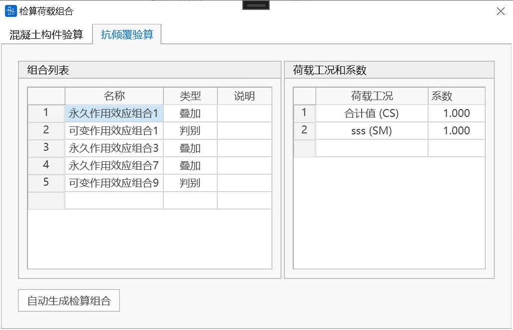
    - Load combination list: Anti-overturning verification combination list, supports direct editing in table. Definition method is same as general load combinations, currently supports three types of load combinations, including superposition, discrimination and envelope.
    - Load cases and coefficients: Load cases contained in each combination, and corresponding coefficients.
    - Auto generate verification combinations: Program automatically generates permanent and variable action standard effect combinations required for anti-overturning verification based on defined load case types. Users can modify load cases and coefficients in combinations according to needs.
    > 📌Load case types automatically included in permanent standard effect combinations include: bridge completion (total value), settlement cases; load case types automatically included in variable action standard effect combinations are: live loads.
  - Permanent Actions

    Standard effect value: When performing characteristic state 2 verification using standard combination, permanent action standard effect value.

    Participate in basic combination coefficient: When performing characteristic state 1 verification using basic combination, permanent action combination coefficient.
  - Variable Actions

    Standard effect value: When performing characteristic state 2 verification using standard combination, variable action standard effect value.

    Participate in basic combination coefficient: When performing characteristic state 1 verification using basic combination, variable action combination coefficient.
    **Anti-Overturning Coefficient**: Transverse anti-overturning stability coefficient, default 2.5.
  ##### View Results
  After confirming all calculation parameters are filled correctly, click view results button to view anti-overturning verification table results in real time.

  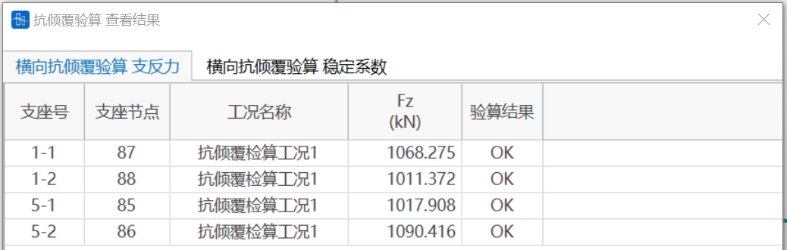
  - Characteristic State 1 Results

    Support number: Grouping number of support node. 5-2 represents second support node of pier 5;

    Support node: Node number where support is located;

    Case name: Anti-overturning verification case name;

    Fz (kN): Support reaction at support node under basic combination;

    Verification result: If Fz is greater than 0, verification passes, otherwise verification fails.
    
  - Characteristic State 2 Results

    Overturning direction: Direction of beam body overturning. Based on longitudinal X-coordinate positive direction, determine left and right overturning;

    Support node: Node number where support is located;

    Case name: Anti-overturning verification case name;

    Sbki (kN.m): Stabilizing effect;

    Sski (kN.m): Destabilizing effect;

    [k]: Transverse anti-overturning stability coefficient;

    ki: Structural stability coefficient;

    Verification result: If Ki is less than or equal to [K], verification passes, otherwise verification fails.
  ##### Export Results
  Export word version of anti-overturning results.

  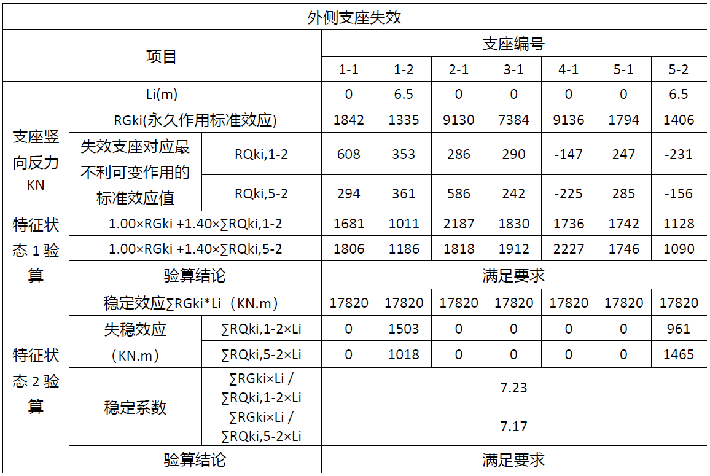

## 12.6 Generate Calculation Report

- Function: Software can automatically generate *.DOCX format calculation reports for concrete beam structures. Calculation report includes two major parts: basic information and verification results. Users can customize output content.
- Command:

  Select "Verification" > "Generate Calculation Report" from the main menu;

User modeling needs to use Z as vertical direction, X as longitudinal direction along bridge.

It is recommended that users ensure main beam element numbers are continuous before using this function, so that result graphics can be output correctly. Can apply command: Main menu bar > Nodes/Elements > Element Numbering, to sort elements and node numbers.

### 12.6.1 Verification Cases

Users select verification cases created in verification function, software will determine output verification content based on this 12.3.3 Concrete Verification Cases. Divided into highway code reinforced concrete, highway code prestressed concrete (fully prestressed, Class A, Class B), railway code reinforced concrete, railway code prestressed concrete (fully prestressed, Class A, Class B).

> 🧐Note: For unified expression, according to railway code description of prestressed concrete structure members without tensile stress, members allowing tensile stress but no cracking, members allowing cracking, compared to highway code expression, correspondingly called fully prestressed members, Class A members, Class B members.

### 12.6.2 Basic Information

Basic information catalog is as follows:

#### 1 Project Overview

- Project Overview

  Automatically filled from content filled in "Command: Main menu bar > Structure > Project Information > Project Description". Bridge overall layout plan and cross-sectional layout plan are supplemented by users.
- Settings
  - Technical standards: For highway code and railway code, list different technical standards.
  - Design loads: List all vehicle load types defined in software.
  - Design safety class: Software automatically fills content selected by users in highway code verification function. If highway code verification is not performed, this item is supplemented by users.
  - Structure importance coefficient: Software gives this value based on design safety class according to code. If highway code verification is not performed, this item is supplemented by users.
  - Environment category: Software automatically fills content selected by users when performing crack width verification in verification function. If crack width verification is not performed, this item is supplemented by users.
  - Lane arrangement, track arrangement, driving speed, plan and longitudinal section, temperature situation, design basic wind speed, seismic standard, flood frequency, navigation requirements, collision protection requirements: Supplemented by users.
- Main Codes

  Software gives common highway codes and railway codes. Others supplemented by users.
- Material Properties

  Software lists various properties of concrete and prestressing materials used in overall calculation. When verification is performed, gives ordinary reinforcement material properties. If verification is not performed, supplemented by users.

#### 2 Calculation Model

- Model Overview: Software gives number of elements, number of nodes, number of boundary conditions, number of construction stages. Automatically inserts finite element model diagram.
- Calculation Loads
  - Dead loads, live loads: Supplemented by users.
  - Temperature loads: Software automatically lists defined temperature load cases and types.
  - Wind loads: Software automatically lists defined wind load case names, content supplemented by users.
  - Foundation settlement: Software automatically lists support settlement group names, node numbers and settlement amounts.
  - Shrinkage and creep: Software automatically gives key parameters for shrinkage and creep calculation.
  - Load combinations: Software automatically lists combination names and contents read from verification combinations.
- Construction Scheme: Software automatically lists construction stage names, duration and construction time.

#### 3 Calculation Results

- Direction Description: Gives internal force direction regulations in software.
- Internal Force Diagrams: Gives N, Q, M diagrams of most unfavorable construction stage and completed bridge stage, N, Q, M envelope diagrams of construction stages. Output elements are defined by "Output Elements" item in "Other Definitions" in calculation report tool interface.
- Stress Diagrams: Gives upper edge and lower edge stress diagrams of most unfavorable construction stage and completed bridge stage, upper edge and lower edge stress envelope diagrams of construction stages. Output elements are defined by "Output Elements" item in "Other Definitions" in calculation report tool interface.
- Support Reactions:

  Gives reaction forces in X and Z directions of each component at nodes corresponding to general supports. Live load case support reactions include impact coefficients.
  - Highway code: Software automatically combines according to standard combination rules required by code, gives maximum and minimum vertical reaction forces at nodes corresponding to each general support.

    Standard combination Fzmax = dead load (bridge completion total) + case (settlement, temperature, wind, live load) positive value

    Standard combination Fzmin = dead load (bridge completion total) + case (settlement, temperature, wind, live load) negative value
  - Railway code: Software automatically combines according to main force combination and main plus additional combination rules required by code, gives maximum and minimum vertical reaction forces at nodes corresponding to each general support.

    Main force combination Fzmax = dead load (bridge completion total) + case (settlement, live load) positive value

    Main force combination Fzmin = dead load (bridge completion total) + case (settlement, live load) negative value

    Main plus additional combination Fzmax = dead load (bridge completion total) + case (settlement, live load, temperature, wind) positive value

    Main plus additional combination Fzmin = dead load (bridge completion total) + case (settlement, live load, temperature, wind) negative value
- Stiffness Indicators: Supplemented by users.
- Static Stability: Supplemented by users.

### 12.6.3 Other Definitions

- Most Unfavorable Construction Stage: Users can select most unfavorable construction stage, default value is last construction stage. Software will give internal force diagrams and stress diagrams of most unfavorable construction stage in calculation results.
- Output Elements: This is used to select element groups for outputting internal force diagrams and stress diagrams. Note that elements for outputting verification items cannot be selected in calculation report tool. Software will output verification results of element groups defined in corresponding verification cases in verification function.

### 12.6.4 Verification Items

Verification items performed in selected "Verification Cases" will be selected by default. Grayed out verification items indicate that verification has not been performed in verification function.

Verification result description please refer to 12.3 Concrete Verification.

- **Highway code (from version 25.07.20 onwards) normal section flexural bearing capacity verification description:**
  Resistance envelope diagram data comes from "Verification - Normal Section Bearing Capacity Calculation - Element Detailed Table", extracting calculation results of **extreme load combinations** of each element axial force, My moment, Mz moment to generate. Forms complementary analysis system with above table (taking safety coefficient **minimum load group**), comprehensively reflecting structural limit state.
- Table
  - **Name**

    Name of verification load combination.
  - **Type**

    Select the type of this verification load combination:

    Basic combination, accidental combination, characteristic value combination, frequent combination, quasi-permanent combination

    Main force combination, main plus additional combination, main plus special combination
  - **Load Cases**

    Select load cases participating in load combination from load case list.

    Note: For load cases of live load type, the cases defined in 9.5.5 **Moving Load Analysis Cases** are selected as live loads to participate in combination. If load cases of type "live load" defined in static loads in 9.1 Load Cases are used, they do not participate in combination.
  - **Unfavorable Coefficient**

    Input the unfavorable coefficient for selected load cases participating in verification load combination.
  - **Favorable Coefficient**

    Input the favorable coefficient for selected load cases participating in verification load combination.
    > 🧐Load and unfavorable coefficient, same sign takes maximum, different sign takes minimum.
    >
    > Load and favorable coefficient, same sign takes minimum, different sign takes maximum.
    >
    > Example:
    >
    > If Fx is positive, unfavorable coefficient is positive, then combined to Fxmax; favorable coefficient is positive, then combined to Fxmin;
    >
    > If Fx is positive, unfavorable coefficient is negative, then combined to Fxmin; favorable coefficient is negative, then combined to Fxmax;
    >
    > If Fx is negative, unfavorable coefficient is positive, then combined to Fxmin; favorable coefficient is positive, then combined to Fxmax;
    >
    > If Fx is negative, unfavorable coefficient is negative, then combined to Fxmax; favorable coefficient is negative, then combined to Fxmin;
    > 🧐Filling Tips:
    >
    > 1. Permanent actions (except support settlement)
    >
    >    Including structural self-weight, prestressing force, creep and shrinkage, etc., unfavorable coefficients and favorable coefficients must not take negative values.
    > 2. Live loads and support settlement
    >
    >    Unfavorable coefficients must not take negative values, favorable coefficients have no practical significance, can be filled as 0.
    > 3. Other variable actions
    >
    >    Unfavorable coefficients can take negative values. For example, for wind loads, different wind directions can be simulated by filling two identical load cases but with opposite unfavorable coefficients. Favorable coefficients have no practical significance, can be filled as 0.
    >
    > 
  - **Auto Generate Verification Load Combinations**

    Function to assist users in generating verification load combinations, see Auto Generate Verification Load Combinations.
