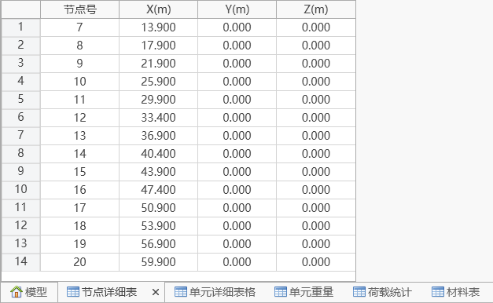
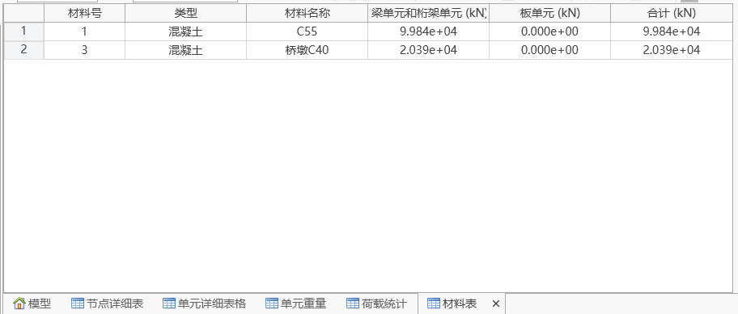

## 13.1 **Node Detail Table**

- Function: View detail table of selected nodes (editable).
- Command: Query > Node Detail Table.

## 13.2 **Element Detail Table**

Function: View detail table of selected elements (editable).

Command: Query > Element Detail Table.

## 13.3 **Element Weight Table**

Function: View weight table of selected elements (including materials, sections, characteristic dimensions, total weight), and obtain total overall weight.

Command: Query > Element Weight Table.

## 13.4 **Load Statistics Table**

Function: View statistics table of activated loads (editable).

Command: Query > Load Statistics Table.

Right-click in the blank area to reselect activation items.

## 13.5 **Material Table**

Function: View material table.

Command: Query > Material Table.

