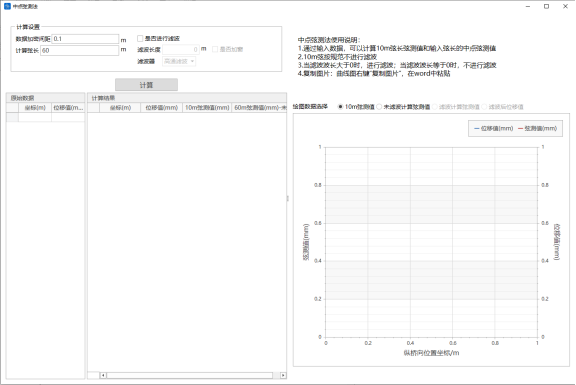
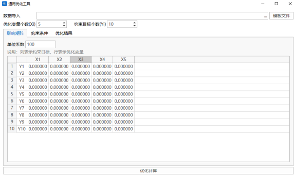
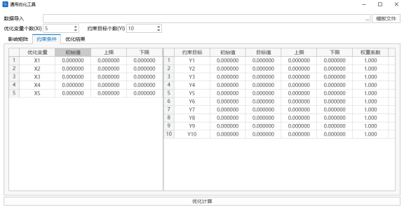
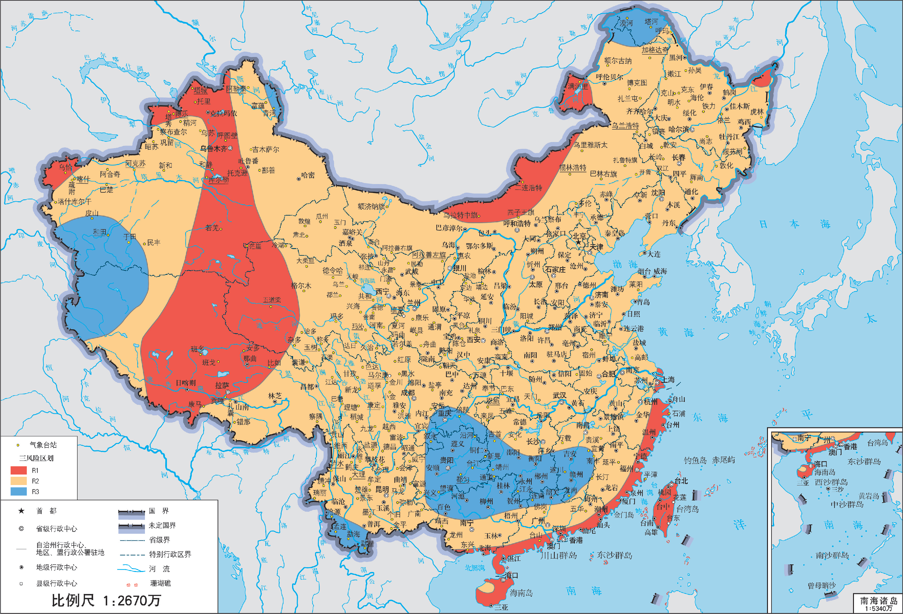
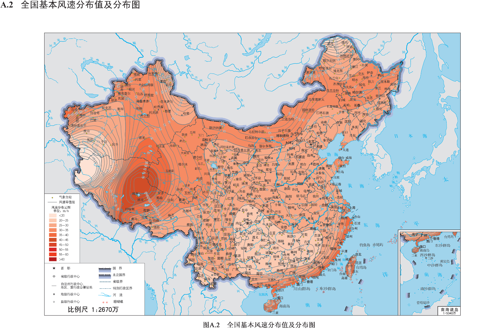
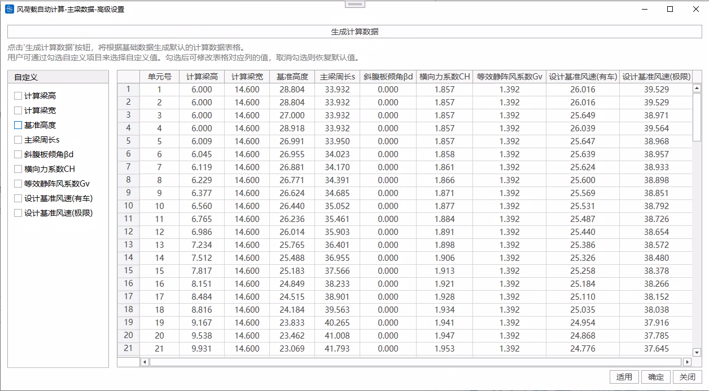

# 14.1 **Command Window**

- Function: Supports mct text modeling and python modeling, python modeling.
- Commands:

  Tools > Command Window > Midas(.mct)

  Tools > Command Window > Qdat(.qdat) —— See [Qdat Command Flow](Qdat命令流/Qdat命令流.md "Qdat Command Flow") for format details

  Tools > Command Window > Python(.py) —— See format details for

- **Open File**

  

  Click on the icon as shown above to jump to file manager to select a file for importing into the text box.
- **Save File**

  

  Click on the icon as shown above to jump to file manager to enter a file name to export to a file.
- **Run Text**

  

  Click on the icon as shown above to run mct commands or python commands.
- **Clear Text**

  

  Click on the icon as shown above to clear the current text window.

# 14.2 **Cable Force Optimization**

See: Intelligent Cable Force Adjustment for Cable-Stayed Bridges

# 14.3 **Midpoint Chord Measurement Method**

- Function: Calculate midpoint chord measurement values.
- Command:

  Tools > Midpoint Chord Measurement Method > Midpoint Chord Measurement Method

  
- **Data Encryption Spacing**

  The spacing for adding encryption points between two coordinate points.
- **Calculate Chord Length**

  Generally 10m and 60m chord measurement values.
- **Whether to Filter**

  Whether to filter the chord measurement values.
- **Filter Length**

  Input filter wavelength.
- **Whether to Apply Window**

  Select whether to apply window according to requirements. Applying window can optimize the spectrum filtering process and reduce spectrum leakage.
- **Filter**

  (1) High-pass filter

  (2) Butterworth filter: Enter filter order.
  > 📌 Currently, railway-related acceptance codes recommend using 4th-order Butterworth filter for filtering.
- **Original Data**

  (1) Coordinates

  (2) Displacement values

  Supports interactive operations with Excel, supports shortcuts Ctrl+C or Ctrl+V.
- **Results**

  Supports viewing 10m chord measurement values, unfiltered calculated chord measurement values, filtered calculated chord measurement values, and filtered chord measurement values in two ways: tables and charts.

# 14.4 General Optimization Tool

- Function: Nonlinear constrained optimization calculation.
- Command

  Tools > Optimization Tool > General Optimization Tool

Based on the influence matrix provided by the user, set the adjustment upper and lower limit values of optimization variables, initial values of constraint targets, target values, adjustment upper and lower limit values, and weight coefficients respectively. One-click calculation generates precise calculation results.

- **Data Import**

  Use the Excel table data template provided by the software, fill in data in the table in sequence, and import directly.
- **Number of Optimization Variables, Number of Constraint Targets**

  Determine the size of the influence matrix.
- **Influence Matrix**

  Can be input in table, supports copy and paste.

  
- **Optimization Variables**

  Fill in the initial values, upper and lower limit values of optimization variables. The table supports copy and paste.
- **Constraint Targets**

  Fill in the initial values, target values, upper and lower limit values, and weight coefficients of constraint targets. The table supports copy and paste.
- **Optimization Calculation**

  Obtain the results of optimization variables and constraint targets. The software also presents the intermediate variables including the change values of optimization variables and constraint targets.

# 14.5 **Automatic Wind Load Calculation**

- Function: Automatically calculate wind loads according to codes and add them to the model. Supports main beams, piers, towers, stay cables, main cables, hangers, and other results.
- Command: Tools > Automatic Wind Load Calculation

- Input
  - **File Management**

    The storage format is .wlc files.
  - **Code**

    Supports "Code for Wind-Resistant Design of Highway Bridges JTG/T3360-01-2018".

## 14.5.1 **Basic Data**

### 14.5.1.1 Basic Data

- **Longitudinal Bridge Coordinate Axis**

  Select whether the bridge longitudinal direction is the X-axis or Y-axis.
- **Ground Surface Type**

  A —— Sea surface, coast, open water surface, desert

  B —— Fields, villages, jungles, flat open areas and areas with few low-rise buildings

  C —— Dense areas with trees and low-rise buildings, areas with few mid-to-high-rise buildings, gentle hilly terrain

  D —— Dense areas with mid-to-high-rise buildings, hilly terrain with large undulations
- **Basic Wind Speed $U_{10}$**

  The bridge design basic wind speed $U_{s10}$ can be calculated according to the formula based on the bridge ground surface category:

  $U_{s10}=k_{c}U_{10}$

  Where: $k_{c}$ —— Basic wind speed ground surface category conversion coefficient;

  $U_{10}$ —— The wind speed value (m/s) at a height of 10m above the ground surface of the bridge location for category B ground surface.
- **National Basic Wind Speed Distribution Values and Distribution Map (Basic Wind Speed Query)**

  

  

- **Operating Wind Speed $U_{z}$**

  The wind speed at the height of the bridge deck above the ground (or water surface) at the bridge site, used for vehicle wind load calculation.

  If it is a double-deck bridge, it is necessary to determine whether to adopt the upper deck or lower deck height.
- **Global Coordinate Origin Height Above Water Surface**

  This value is used to determine the relative position between the finite element model and the actual engineering elevation.

  The global coordinate origin is a negative value if it is below the water surface, otherwise it is a positive value.
- **Air Density**

  This value takes a unified value for the entire bridge.
- **Vehicle Height Above Water Surface**

  This value is used to determine the bridge deck height.
- **Horizontal Loading Length**

  Click "Auto-obtain Horizontal Loading Length" to automatically obtain the total length of the model along the selected bridge longitudinal direction.

### 14.5.1.2 Structure Data

#### 1, Main Beam

- **Main Beam Category**

  There are three types: I-shaped, Π-shaped or box girder section main beams, truss-type main beams.
- **Bridge Span**

  This value is used to determine the calculation method of the main beam longitudinal wind. Please refer to code 5.3.5, 5.3.6.
- **Friction Coefficient $C_{f}$**

  Can be selected through the upper and lower surface conditions of the bridge main beam, or input by the user. Required when calculating the main beam longitudinal wind for spans >= 200m.
- **Deck System Construction Height**

  The height set to consider accessory facilities (such as guardrails, wind barriers or sound barriers). This height is used to calculate the transverse wind loads generated by these structures.

  For a single main beam, this height will be included in the characteristic height of the structure;

  For a truss beam, the program will calculate the transverse force coefficient $C_{H}$ of the members according to the relationship between the deck system construction height and the truss solid area ratio, and distribute the loads uniformly to the upper chord, lower chord, and web members of the truss.
- **Vehicle Wind Load**

  Under the W1 wind action level, when wind loads are combined with vehicle loads, the wind load of the main beam should include the transverse load acting on the vehicle. The increment can be taken as 1.5kN/m; when wind barriers or sound barriers are set, the transverse load acting on the vehicle need not be considered.

  For a single main beam, this value is added to the main beam;

  For a truss beam, this value is distributed equally to the upper and lower chord members of the truss.
- **Number of Trusses**

  Supports two trusses or three trusses.
- **Element Selection**

  Click on the element number input box, you can box-select elements in the model, or directly input element numbers. Click Add to calculate the wind loads of the selected elements. Only supports frame elements.
- **Customize**

  The program automatically calculates the intermediate parameters during the wind load calculation process based on the filled basic information, structure information, and selected element model information. These can be modified in "Customize".

  

  If you need to modify a certain parameter, you need to click on the checkbox corresponding to that parameter in the left list. After checking, you can modify the value in the corresponding column of the table. Canceling the check will restore the default value.
  - **Calculated Beam Height**: The main beam characteristic height in formula 5.3.1 of the code. For a single main beam, this value includes the deck system construction height.
  - **Reference Height**: If the user does not customize, this value is the height in the z-direction of the I-end and J-end section eccentricity points + the global coordinate system origin height above the water surface.
  - **Truss Section Type**: Used to calculate the transverse force coefficient of the truss beam (if the transverse force coefficient is customized, this value is not considered). 0 represents rectangular and H-shaped section members, 1 represents cylindrical members ($dU_{d}\leq6m^{2}/s$), 2 represents cylindrical members ($dU_{d}>6m^{2}/s$).
  - **Main Beam Perimeter s**: For a single main beam, this value is the section perimeter. For a truss beam, this value is the outer perimeter of the beam body, used to calculate the longitudinal wind load of the truss-type main beam. If the user does not customize the element, the program calculated value is used, and the same value is used for the entire bridge.
  - **Transverse Force Coefficient $C_{H}$**: If the user customizes, please input the comprehensive transverse force coefficient of the entire structure (including wind barriers or sound barriers, etc., usually the result of a completed bridge wind tunnel test). For a truss beam, this value includes the transverse force coefficient of the truss and the transverse force coefficient of the deck system.
  - **Design Reference Wind Speed (With Vehicle)**: If the user does not customize, the program calculates according to the formula $U_{d}=k_{f}(\frac{\text{基准高度}}{\text{车离水面高}})^{α_{0}}U_{z} $.
  - **Design Reference Wind Speed (Ultimate)**: If the user does not customize, the program calculates according to the formula $U_{d}=k_{f}(\frac{\text{基准高度}}{10m})^{α_{0}}U_{s10} $.

#### 2, Piers and Towers

- **Element Selection**

  Click on the element number input box, you can box-select elements in the model, or directly input element numbers. Click Add to calculate the wind loads of the selected elements. Only supports frame elements.
- **Customize**

  The program automatically calculates the intermediate parameters during the wind load calculation process based on the filled basic information, structure information, and selected element model information. These can be modified in "Customize".

  If you need to modify a certain parameter, you need to click on the checkbox corresponding to that parameter in the left list. After checking, you can modify the value in the corresponding column of the table. Canceling the check will restore the default value.
  - **Reference Height**: If the user does not customize, this value is the height in the z-direction of the I-end and J-end section eccentricity points + the global coordinate system origin height above the water surface.
  - **Pier/Tower Section Type**: Used to calculate the drag coefficient (if the drag coefficient is customized, this value is not considered). 0 represents rectangular, 1 represents oblique square or octagonal, 2 represents 12-sided, 3 represents smooth surface circular ($dU_{d}\geq6m^{2}/s$), 4 represents smooth surface circular ($dU_{d}<6m^{2}/s$) or rough surface or protruding circular, 5 represents rectangle with rounded corners (if the program does not recognize that the section is a rectangular pier with rounded corners, the user customizes it to select as 5, the rounded corner radius is still 0 for calculation, i.e., calculated according to the rectangular section, so it is not recommended for users to customize and modify the section type to a rectangle with rounded corners. If modified, please reduce the drag coefficient value according to the code yourself), 6 represents others (this type will calculate the drag coefficient according to the rectangular section, it is recommended to modify the section type or customize to fill in the drag coefficient value).
  - **Design Reference Wind Speed (With Vehicle)**: If the user does not customize, the program calculates according to the formula $U_{d}=k_{f}(\frac{\text{基准高度}}{\text{车离水面高}})^{α_{0}}U_{z} $.
  - **Design Reference Wind Speed (Ultimate)**: If the user does not customize, the program calculates according to the formula $U_{d}=k_{f}(\frac{\text{基准高度}}{10m})^{α_{0}}U_{s10} $.

#### 3, Stay Cables

- **Stay Cable Category**

  There are two types: parallel steel wires and steel strands.
- **Operating Wind Drag Coefficient**

  Used for vehicle wind load calculation, can be modified.
- **Ultimate Wind Drag Coefficient**

  Used for no-vehicle wind load calculation, can be modified.

  You can refer to code 5.4.5: For cables with smooth surfaces, surface dimple treatment, and surface wound with spiral wires, the drag coefficient can be taken as 1.0 under the W1 wind action level, and the drag coefficient can be taken as 0.8 under the W2 wind action level. For other shapes, parallel-arranged cables, and stay cables and hangers (cables) considering the influence of ice cover, the drag coefficient should preferably be obtained through wind tunnel tests or virtual wind tunnel tests.
- **Number of Stay Cable Element Combinations**

  This value is used to calculate the diameter of the stay cable.
- **Element Selection**

  Click on the element number input box, you can box-select elements in the model, or directly input element numbers. Click Add to calculate the wind loads of the selected elements. Only supports frame elements.
- **Customize**

  The program automatically calculates the intermediate parameters during the wind load calculation process based on the filled basic information, structure information, and selected element model information. These can be modified in "Customize".

  If you need to modify a certain parameter, you need to click on the checkbox corresponding to that parameter in the left list. After checking, you can modify the value in the corresponding column of the table. Canceling the check will restore the default value.
  - **Single Stay Cable Outer Diameter**: If the user does not customize, this value is calculated by interpolation according to the stay cable category and element area/number of stay cable element combinations, based on the table.
  - **Reference Height**: If the user does not customize, this value is the height in the z-direction of the I-end and J-end section eccentricity points + the global coordinate system origin height above the water surface.
  - **Design Reference Wind Speed (With Vehicle)**: If the user does not customize, the program calculates according to the formula $U_{d}=k_{f}(\frac{\text{基准高度}}{\text{车离水面高}})^{α_{0}}U_{z} $.
  - **Design Reference Wind Speed (Ultimate)**: If the user does not customize, the program calculates according to the formula $U_{d}=k_{f}(\frac{\text{基准高度}}{10m})^{α_{0}}U_{s10} $.

This value is used to calculate the diameter of the stay cable.

#### 4, Main Cable

- **Drag Coefficient**

  You can refer to code 5.4.4: When the center spacing of the main cables of a suspension bridge is 4 times or more the diameter, the wind load of each cable should be considered independently, and the drag coefficient of a single main cable can be taken as 0.7. When the center spacing of the main cables is less than 4 times the diameter, the wind load can be calculated as one main cable, and its drag coefficient should preferably be taken as 1.0.
- **Number of Main Cable Element Combinations**

  This value is used to calculate the diameter of the main cable.
- **Element Selection**

  Click on the element number input box, you can box-select elements in the model, or directly input element numbers. Click Add to calculate the wind loads of the selected elements. Only supports frame elements.
- **Customize**

  The program automatically calculates the intermediate parameters during the wind load calculation process based on the filled basic information, structure information, and selected element model information. These can be modified in "Customize".

  If you need to modify a certain parameter, you need to click on the checkbox corresponding to that parameter in the left list. After checking, you can modify the value in the corresponding column of the table. Canceling the check will restore the default value.
  - **Single Main Cable Outer Diameter**: If the user does not customize, the program calculates the outer diameter by referring to the empirical formula $D=2\sqrt{\frac{\text{单元面积}/\text{主缆单元组合数}}}{0.8\pi}}$.
  - **Reference Height**: If the user does not customize, this value is the height in the z-direction of the I-end and J-end section eccentricity points + the global coordinate system origin height above the water surface.
  - **Design Reference Wind Speed (With Vehicle)**: If the user does not customize, the program calculates according to the formula $U_{d}=k_{f}(\frac{\text{基准高度}}{\text{车离水面高}})^{α_{0}}U_{z} $.
  - **Design Reference Wind Speed (Ultimate)**: If the user does not customize, the program calculates according to the formula $U_{d}=k_{f}(\frac{\text{基准高度}}{10m})^{α_{0}}U_{s10} $.

#### 5, Hangers

- **Hanger Category**

  There are three types: parallel steel wires, steel strands, and rigid hangers. Note: If it is a rigid hanger, the calculated hanger outer diameter is the actual diameter of the element, and it is recommended that the number of hanger element combinations should be 1.
- **Drag Coefficient**

  You can refer to code 5.4.4: When the center distance of the hangers of a suspension bridge is 4 times or more the diameter, the drag coefficient of each hanger can be taken as 1.0.
- **Number of Hanger Element Combinations**

  This value is used to calculate the diameter of the hanger.
- **Element Selection**

  Click on the element number input box, you can box-select elements in the model, or directly input element numbers. Click Add to calculate the wind loads of the selected elements. Only supports frame elements.
- **Customize**

  The program automatically calculates the intermediate parameters during the wind load calculation process based on the filled basic information, structure information, and selected element model information. These can be modified in "Customize".

  If you need to modify a certain parameter, you need to click on the checkbox corresponding to that parameter in the left list. After checking, you can modify the value in the corresponding column of the table. Canceling the check will restore the default value.
  - **Single Hanger Outer Diameter**: If the user does not customize, if the hanger category is parallel steel wire or steel strand, this value is calculated by interpolation according to the hanger category and element area/number of hanger element combinations, based on the table. If the hanger category is a rigid hanger, this value is the actual diameter of the element.
  - **Reference Height**: If the user does not customize, this value is the height in the z-direction of the I-end and J-end section eccentricity points + the global coordinate system origin height above the water surface.
  - **Design Reference Wind Speed (With Vehicle)**: If the user does not customize, the program calculates according to the formula $U_{d}=k_{f}(\frac{\text{基准高度}}{\text{车离水面高}})^{α_{0}}U_{z} $.
  - **Design Reference Wind Speed (Ultimate)**: If the user does not customize, the program calculates according to the formula $U_{d}=k_{f}(\frac{\text{基准高度}}{10m})^{α_{0}}U_{s10} $.

## 13.5.2 **Wind Load Calculation Results**

After completing the filling of basic data, click "Generate Wind Load Calculation Results" to perform the calculation.

The result table is the element uniformly distributed load, with the unit of: kN/m.

If wind loads already exist in the load cases and load groups for the elements, the newly generated loads will replace the existing loads.

[Qdat Command Flow](Qdat命令流/Qdat命令流.md "Qdat Command Flow")
