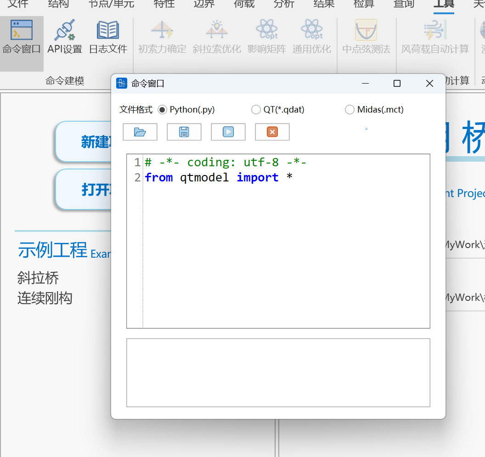
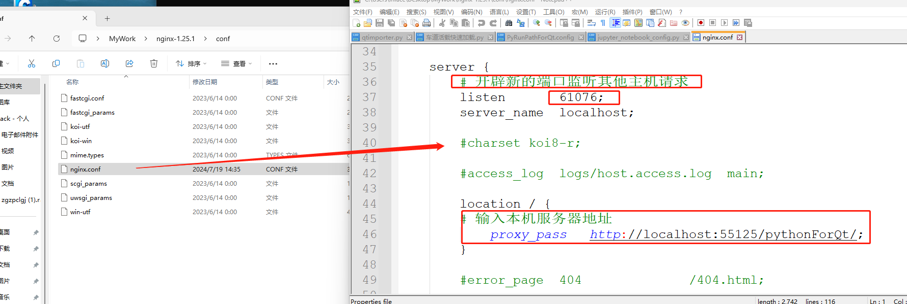
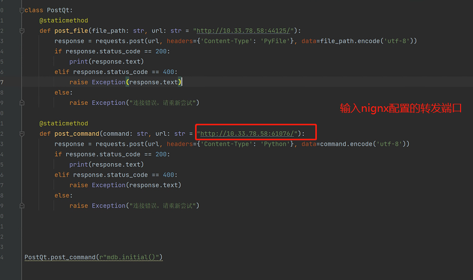
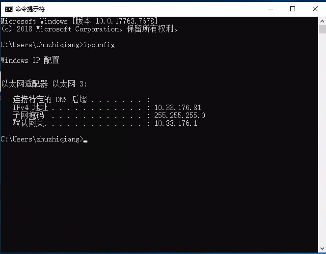

## Function Introduction

Qiaotong API is an interface provided by Qiaotong software for interaction with external programs. Through Qiaotong API, users can call Qiaotong software functions in external programs to achieve automated analysis, data processing, etc.

## Calling Methods

There are two main calling methods for Qiaotong API:

- Direct calling: Users directly call Qiaotong API functions in external programs to control Qiaotong software.
- Indirect calling: Users call Qiaotong API functions in external programs, Qiaotong API then calls Qiaotong software functions to control Qiaotong software.

## Interface Documentation

The interface documentation of Qiaotong API details the functions, parameters, return values, and other information of Qiaotong API. Users can call Qiaotong API functions in external programs according to the interface documentation to control Qiaotong software.

# Internal Software Calling

## File Import and Export

Qiaotong supports Python model file import and export. Users can click File > Import/Export > Python File, and select the file to import or export to complete import/export.

> 📌**Note**: Currently Python file import only supports model file import, temporarily does not support running analysis commands

## Internal Running Demo

Currently Python environment has been configured by default, no configuration required by default, can directly open Tools > Command Window > Enter Code > Click Run. During running, the default run button is in grayed-out state, automatically restores to clickable state after completion.



> 📌**Note**: Internal running (same for file import) is equivalent to running imported module, please do not use statement if **name** == "**main**":

## Custom Python Interpreter

Can click Tools > API Settings > Edit button on the right of Python installation path to change Python interpreter. Server is enabled by default as shown below. When calling, can set calling server through mdb.set_url function (default calling is the following address).

<!--  -->

Note: When using custom Python, please use `pip install qtmodel` to install third-party libraries and pay attention to matching the qtmodel version number supported by the current Qiaotong version. Can view the version number corresponding to current Qiaotong version in API settings. Third-party library installation and update related cmd commands are as follows (if environment variable is not added or there are multiple pythons in environment variable, please switch to corresponding Python installation path to run):

```bash title="cmd commands (please run in Python directory)"
# Install third-party library
python -m pip install qtmodel==1.1.13 -i https://pypi.tuna.tsinghua.edu.cn/simple
# Update third-party library
python -m pip install --upgrade qtmodel==1.1.13 -i https://pypi.tuna.tsinghua.edu.cn/simple


```

Latest version download link: [Pypi Official Website](https://pypi.org/search/?q=qtmodel "Pypi Official Website")   Latest version: 1.1.13

**mdb class** provides a series of methods for processing model data, including all modeling-related operations such as nodes, elements, loads, etc. **odb class** provides operations related to querying model information and result information. Calling is as follows:


> 📌**Note**: If third-party library has been downloaded, please update to the latest version in time

## Python Basic Tutorial

[Python3 Tutorial | Rookie Tutorial Python 3 Tutorial Python's 3.0 version is often called Python 3000, or Py3k for short. Compared to earlier versions of Python, this is a larger upgrade. To not bring in too much baggage, Python 3.0 was designed without considering backward compatibility. Python introduction and installation tutorial has been introduced in Python 2.X version tutorial, so it will not be repeated here. You can also click Python2.x and 3.x version differences to https://www.runoob.com/python3/python3-tutorial.html](https://www.runoob.com/python3/python3-tutorial.html "Python3 Tutorial | Rookie Tutorial Python 3 Tutorial Python's 3.0 version is often called Python 3000, or Py3k for short. Compared to earlier versions of Python, this is a larger upgrade. To not bring in too much baggage, Python 3.0 was designed without considering backward compatibility. Python introduction and installation tutorial has been introduced in Python 2.X version tutorial, so it will not be repeated here. You can also click Python2.x and 3.x version differences to https://www.runoob.com/python3/python3-tutorial.html)

# External Software Calling

Supports external running and debugging. Can use File > Export > Export Py function. The exported file can be directly run in IDEs such as VSCode. IDE environment can use python39 under Qiaotong download directory (qtmodel library for current version has been built-in). Users can use update_model function to refresh interface real-time data display.

## Pycharm Calling Demo

View current Qiaotong local service path. Use set_url function to link Qiaotong software (can omit when default 55125 port), when multiple Qiaotong are running, set address reference Tools > API Settings > Local Server Address


## VSCode Interpreter Configuration

When calling from external IDE, can select python.exe in PyFile under Qiaotong installation directory (qtmodel package has been built-in)

[ Python VScode Configuration | Rookie Tutorial Python VScode Configuration In the previous chapter we have installed Python environment, this chapter we will introduce Python VScode configuration. Preparation work: Install VS Code Install VS Code Python extension Install Python 3 Install VS Code VSCode (full name: Visual Studio Code) is a free source code editor developed by Microsoft and cross-platform, VSCode development environment is very simple and easy https://www.runoob.com/python3/python-vscode-setup.html](https://www.runoob.com/python3/python-vscode-setup.html " Python VScode Configuration | Rookie Tutorial Python VScode Configuration In the previous chapter we have installed Python environment, this chapter we will introduce Python VScode configuration. Preparation work: Install VS Code Install VS Code Python extension Install Python 3 Install VS Code VSCode (full name: Visual Studio Code) is a free source code editor developed by Microsoft and cross-platform, VSCode development environment is very simple and easy https://www.runoob.com/python3/python-vscode-setup.html")


[Code Optimization Based on AI Code Assistant.mp4](video/基于AI代码助手的代码优化_Djxf5yJYTC.mp4)

## Autolisp Calling Qiaotong

[AutoLisp Run Qiaotong.lsp](file/AutoLisp运行桥通_iFtDlPlPX-.lsp "AutoLisp Run Qiaotong.lsp")

[LISP_20250818_14075502.mp4](video/LISP_20250818_14075502_JPqoxlhA-d.mp4)

## VBA Calling Qiaotong

[Qiaotong API Example.xlsm](file/桥通API例子_vLUPOn_6zm.xlsm "Qiaotong API Example.xlsm")

[Video_2025-08-18_00039_20250818_13535729.mp4](video/Video_2025-08-18_00039_20250818_13535729_zgP7Xkyu6.mp4)

## Java Program Calling

```java 
import java.io.BufferedReader;
import java.io.InputStreamReader;
import java.io.OutputStream;
import java.net.HttpURLConnection;
import java.net.URL;
import java.nio.charset.StandardCharsets;

public class JavaPostExample {
    public static void main(String[] args) {
        try {
            // Create URL object
            URL url = new URL("http://localhost:55125/pythonForQt/");
            // Open connection
            HttpURLConnection connection = (HttpURLConnection) url.openConnection();
            // Set request method to POST
            connection.setRequestMethod("POST");
            // Enable input and output streams
            connection.setDoOutput(true);

            // Set request header Support Python (input command here) and PyFile (input file path here)
            connection.setRequestProperty("Content-Type", "Python");
//            connection.setRequestProperty("Content-Type", "PyFile");

 body
            String jsonInputString =            // Create request """
                    from qtmodel import*
                    mdb.initial()
                    mdb.add_nodes([[i+1,2,3]for i in range(200)])
                    mdb.update_model()""";
//            String jsonInputString = "C:\Users\Desktop\PythonCode\Continuous Steel Beam Modeling.py";

            // Send request body data
            try (OutputStream os = connection.getOutputStream()) {
                byte[] input = jsonInputString.getBytes(StandardCharsets.UTF_8);
                os.write(input, 0, input.length);
            }

            // Get response
            int status = connection.getResponseCode();
            System.out.println("Response Code: " + status);

            // Handle different cases based on response code
            if (status >= 200 && status < 300) {
                // Successful response
                try (BufferedReader br = new BufferedReader(
                        new InputStreamReader(connection.getInputStream(), StandardCharsets.UTF_8))) {
                    StringBuilder response = new StringBuilder();
                    String responseLine;
                    while ((responseLine = br.readLine()) != null) {
                        response.append(responseLine.trim());
                    }
                    System.out.println("Response Body: " + response.toString());
                }
            } else if (status == 400) {
                // 400 error, read error information
                try (BufferedReader br = new BufferedReader(
                        new InputStreamReader(connection.getErrorStream(), StandardCharsets.UTF_8))) {
                    StringBuilder errorResponse = new StringBuilder();
                    String errorLine;
                    while ((errorLine = br.readLine()) != null) {
                        errorResponse.append(errorLine);
                    }
                    System.out.println("Error 400 - Bad Request: " + errorResponse.toString());
                }
            } else {
                // Other error status codes
                System.out.println("Error: HTTP " + status);
                // Try to read error information
                try (BufferedReader br = new BufferedReader(
                        new InputStreamReader(connection.getErrorStream(), StandardCharsets.UTF_8))) {
                    StringBuilder errorResponse = new StringBuilder();
                    String errorLine;
                    while ((errorLine = br.readLine()) != null) {
                        errorResponse.append(errorLine);
                    }
                    System.out.println("Error Details: " + errorResponse.toString());
                } catch (Exception e) {
                    System.out.println("Could not read error details");
                }
            }

        } catch (Exception e) {
            e.printStackTrace();
        }
    }
}
```


[Java Running.mp4](video/Java运行_QcnkEXErtB.mp4)

## BimBase Calling

[qt_importer.py](file/qt_importer_p7iR9yd3qT.py "qt_importer.py")

Configure the above file into BIMBase custom plugin, or directly run after configuring bimbase development environment to import current opened model into BIMBase

[bimbase Import Qiaotong Model.mp4](video/bimbase导入桥通模型_6ItX_ea9Up.mp4)

## Cross-Host Calling in LAN

[nginx-1.25.1.zip](file/nginx-1.25.1_o6WCgNvpQR.zip "nginx-1.25.1.zip")

After extracting, configure listening port and local Qiaotong server address, run nginx.exe file

1. Configure conf file
   ```apl title="conf configuration"
   events {
       worker_connections 1024;
   }

   http {
       client_max_body_size 100m;
       client_body_timeout    1200s;
       client_header_timeout  1200s;
       send_timeout           1200s;

       # ---- Reverse proxy timeout and cache ----
       proxy_connect_timeout  1200s;
       proxy_send_timeout     1200s;
       proxy_read_timeout     1200s;
       proxy_buffering        off;     # Close proxy buffering, suitable for large requests/streaming
       proxy_request_buffering off;    # Reduce disk writing when uploading large files
     
       server {
       # Open new port to listen to requests from other hosts
           listen 61076;
           server_name localhost;
           client_max_body_size 100m;

           location / {
               client_max_body_size 100m;
           # Input local server address
               proxy_pass http://localhost:55125/pythonForQt/;
           }
       }
   }
   ```

   
2. Start nginx service

   
3. Other hosts in LAN call post command, just input called host address and nignx port to complete calling

   

   IP Address Query Method

   According to Qiaotong device, after running cmd ipconfig

   

# Python Script Details

[API Help Document](API帮助文档/API帮助文档.md "API Help Document")

# Development Environment Configuration

[VScode+Python Environment Setup (Nurse-level Tutorial)](VScode+Python环境搭建（保姆级教程）/VScode+Python环境搭建（保姆级教程）.md "VScode+Python Environment Setup (Nurse-level Tutorial)")

[VS Code Jupyter Notebook Usage Method](<VS Code 中 Jupyter Notebook 使用方/VS Code 中 Jupyter Notebook 使用方法.md> "VS Code Jupyter Notebook Usage Method")

[Git+VSCode Installation Tutorial+Gitee Code Management](Git+VSCode安装教程+Gitee进行代码管理/Git+VSCode安装教程+Gitee进行代码管理.md "Git+VSCode Installation Tutorial+Gitee Code Management")
