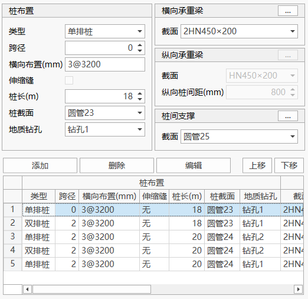
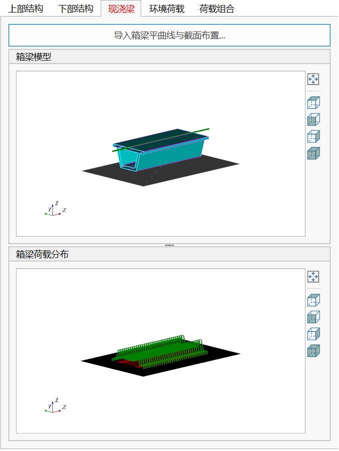
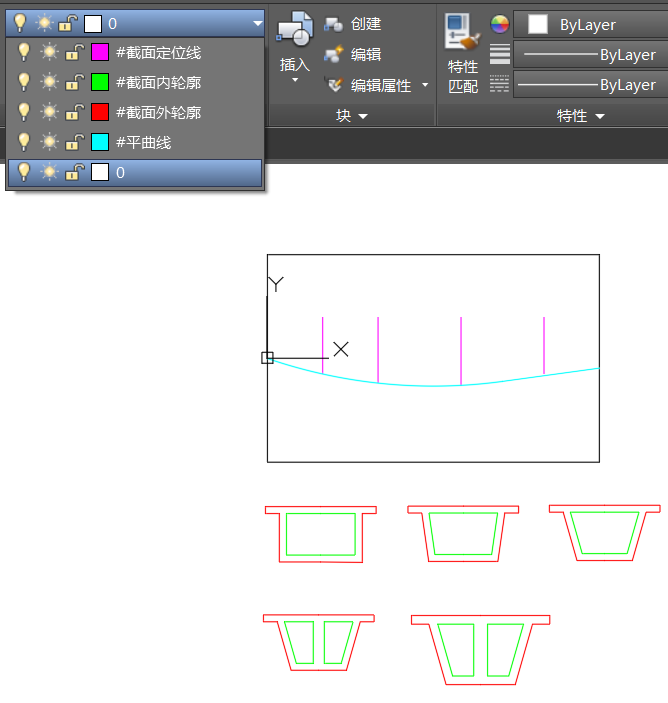
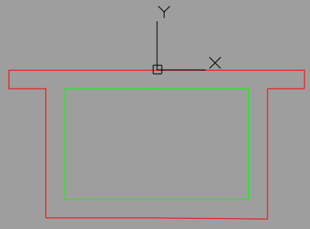
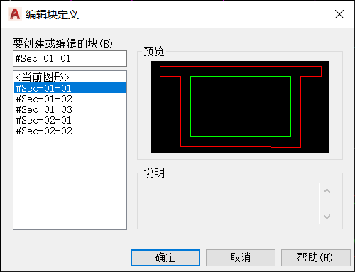
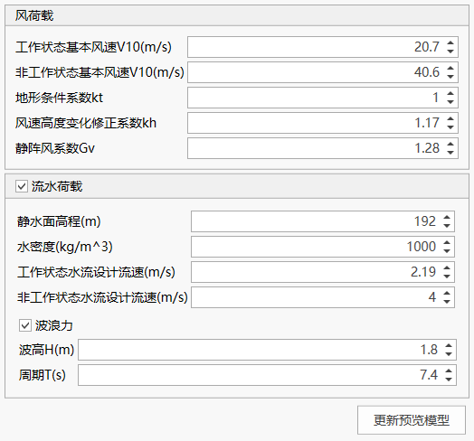
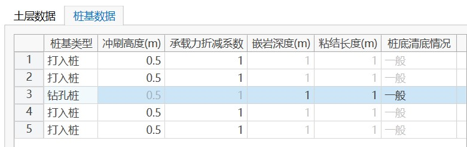
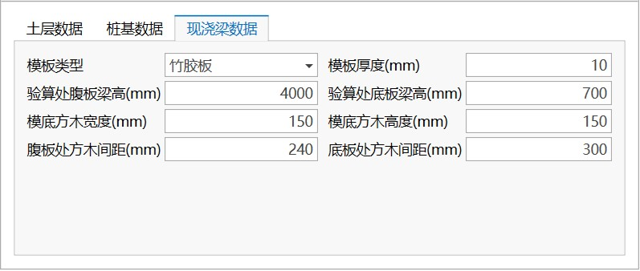
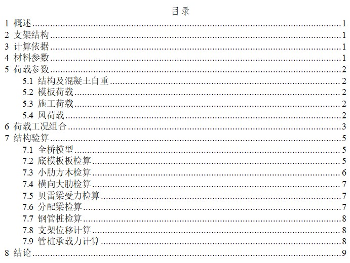

## Features

Quickly generate steel trestle bridge finite element models through parameterized Bailey frame scaffold models, and support structural verification and calculation report generation (only supports steel trestle bridge models generated through the Modeling Assistant).

## Command

From the main menu, select "Structure" > "Bailey Frame Scaffold" > "Bailey Frame Scaffold Modeling";


## Toolbar


The functions of the toolbar buttons are as follows:

- Open Data File: Open modeling assistant data file;
- Save Data File: Save modeling assistant data file;
- Save As: Save current modeling data as another named data file;
- Isometric View;
- Front View;
- Right View;
- Top View;
- Auto Zoom;
- Section: Display component section design dialog;
- Geological Borehole: Display soil layer data and geological borehole data editing dialog;
- Options: Display options dialog, including basic parameters such as gravitational acceleration;
- Create QiaoTong Model: Generate QiaoTong finite element model based on current data.

## Section Design


Click the "Section" button in the toolbar to display the section list dialog, then perform section design in the section design dialog.

## Geological Borehole Data Management


Click the "Geological Borehole" button in the toolbar to display the geological borehole data management dialog, which can import and export soil layer parameters and geological borehole data.

## Basic Parameters Setting

Click the "Options" button in the toolbar to display the basic parameters that need to be entered, including gravitational acceleration, concrete density, construction load, and formwork load. The formwork load is placed within the cast-in-place beam projection area, and the construction load is placed in other areas on the scaffold except for the formwork load.


## 3D Model Preview Window


The 3D model preview window allows real-time viewing of the model corresponding to the current parameter option settings, including structural layout, water level surface, pile position ground, and other information. You can rotate and zoom the model through mouse operations, and you can also perform model view operations through the view-related buttons in the toolbar.

## Superstructure Design


The superstructure design panel is used for the design of Bailey beams and deck layout. After adjusting design parameters, click the "Update Preview Model" button to update the 3D model preview view.

(1) Bailey Beam

You can set the Bailey beam model, longitudinal layout quantity, transverse layout, and cantilever end support.

**Transverse Layout**: Set the transverse layout quantity and spacing through "Spacing Expression". "2\@5000" means arranging 2 Bailey beams at 5000mm spacing. Valid spacing expression examples are as follows:

```text
4@123.45
100 4@123, 200 300

```

**Cantilever End Support**: Used to set the constraint method when no pile foundation support is set at the trestle bridge end. The "With Support" option adds vertical constraints at the end (can be used to simulate corbel support), and the "Without Support" option means the end is a cantilever beam.

(2) Deck

You can set the deck design elevation and deck layout parameters.

## Substructure Design



(1) Pile Layout

You can set the structural settings and layout positions of steel pipe piles. Here, "Span" refers to the number of longitudinal Bailey beam panels corresponding to the centerline of a row of pile layout. The software only supports arranging substructures at the ends of Bailey beams.

(2) Transverse Bearing Beam

You can set the configuration information for pile-top transverse bearing beams. Click the button in the upper right corner to set more information.


(3) Longitudinal Bearing Beam

You can set the configuration information for pile-top longitudinal bearing beams, only applicable to double-row piles. Click the button in the upper right corner to set more information.

(4) Inter-pile Bracing

You can set the configuration information for inter-pile bracing. Click the button in the upper right corner to set more information.

## Cast-in-place Beam Settings



You can set the cast-in-place beam load layout situation.

Click the "Import Box Girder Horizontal Curve and Section Layout" button to display the dialog for importing related cast-in-place beam drawing files.

**Note**:

(1) Layer Rules

1. The horizontal curve must be a polyline, laid out from left to right, and must be placed on a layer named "#HorizontalCurve". When importing, it is placed on the deck according to the original absolute coordinates of the imported graphics. The layout origin is the center point on the left side of the deck symmetry line. The horizontal curve does not need to be placed at the origin according to actual conditions. The drawing unit is m.

2. The section positioning line is laid out from left to right and must be placed on a layer named "#SectionPositioningLine". The section positioning line indicates the position of the section below corresponding to the longitudinal direction of the horizontal curve.

3. Sections are arranged from left to right, corresponding to the order of section positioning lines. When a section changes abruptly (such as from single-box single-cell to single-box double-cell), two sections need to be set at the same section position and placed on separate lines. Each horizontal row of section lines has the same inflection points, ensuring that sections can be processed for lofting.



(2) Cast-in-place Beam Section Drawing Rules

The cast-in-place beam section is set as a block. In the block editor, the cast-in-place beam section profile consists of one outer profile line and at least one inner profile line. The outer profile line is placed on a layer named "#SectionOuterProfile", and the inner profile line is placed on a layer named "#SectionInnerProfile". Profile lines must be polylines. The origin in the block is used as the alignment point of the section (i.e., the point corresponding to the horizontal curve). The drawing unit is m.



(3) Cast-in-place Beam Block Naming Rules

Each row has the same naming prefix. The nth row is "#Sec-0n-", with the first being 01. The trailing number only needs to ensure that the right is greater than the left.



## Environmental Load Settings



You can set wind loads, water flow loads, and wave forces.

(1) Wind Load

Only considers the wind load effect on Bailey beams, and the load is applied to the pile top after calculation; the Bailey beam wind shielding reduction factor is 0.66.

(2) Water Flow Load and Wave Force

Wave force is calculated according to "Port and Waterway Hydrology Code" (JTS 145-2015) and applied to steel pipe piles as line loads.

## Load Combination Settings


Load combinations can be automatically generated based on cast-in-place beam loads, construction loads, environmental loads, and other setting information. The generated load combination coefficients can be adjusted.

**Note**: Please use the load combination function after completing the previous design. Returning to adjust other setting information after generating load combinations may cause the previous load combination data to become invalid.

## Verification and Calculation Report

From the main menu, select "Structure" > "Bailey Frame Scaffold" > "Calculation Report" to open the Bailey frame scaffold verification and calculation report dialog.


(1) Soil Layer Data

You need to supplement the pile side friction resistance and pile end friction resistance values of soil layers. You can enter directly in the table or copy and paste. When pasting, ensure the number of columns in the original table matches the soil layer table.


(2) Pile Foundation Data

You need to supplement the pile foundation type and other related parameters for each row of piles.



(3) Cast-in-place Beam Formwork Data

You need to supplement the formwork type, thickness, beam height at verification location, and formwork bottom timber parameters.



### Verification

After supplementing the soil layer data, pile foundation data, and formwork information, click "Execute Verification". The verification results are read in table format. A "√" in the verification results indicates passing, and a "×" indicates failure. Each verification item will display the finite element model calculation results and limits on the right side, and show the corresponding load combination. You can find the corresponding verification results in the model based on the load combination. Formwork-related verification is only based on the supplementary formwork information. If formwork verification fails, you can directly modify the relevant data above and then click "Execute Verification" again. Overall displacement only displays the maximum horizontal displacement calculation results, with no limit.


### Calculation Report

When all verification results pass, click "Generate Calculation Report" to generate the calculation report file.


