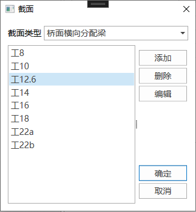
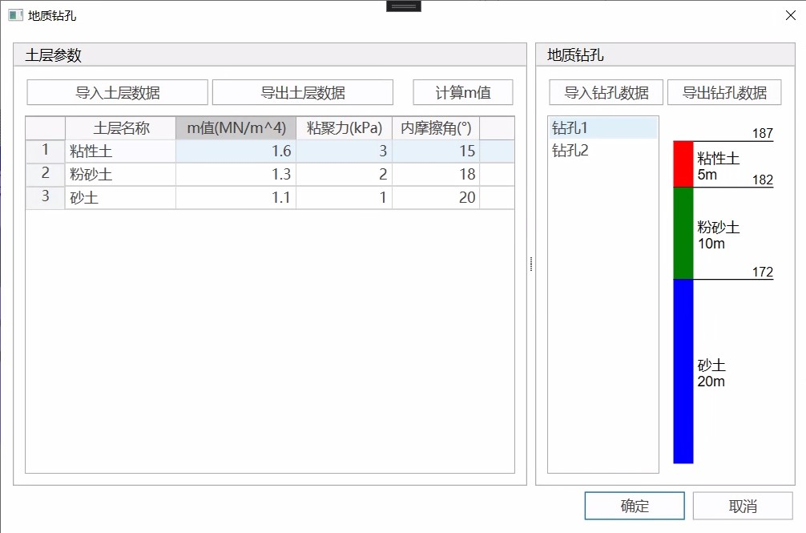
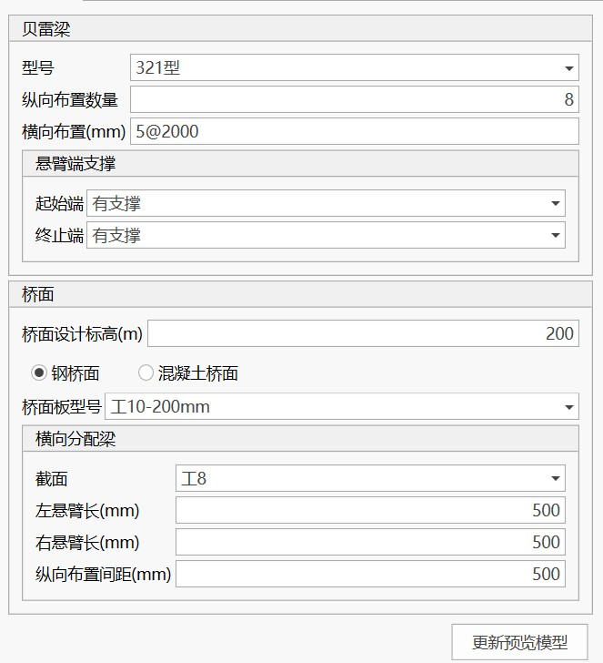
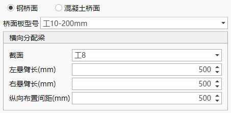
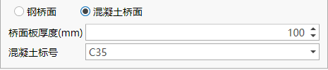
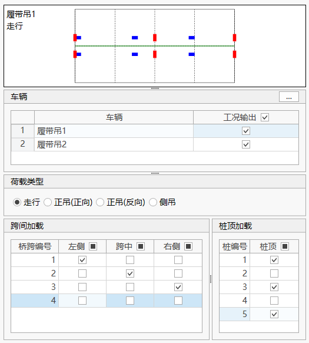
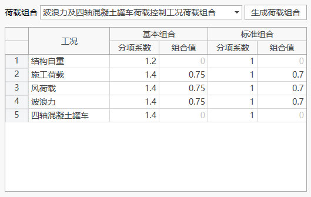
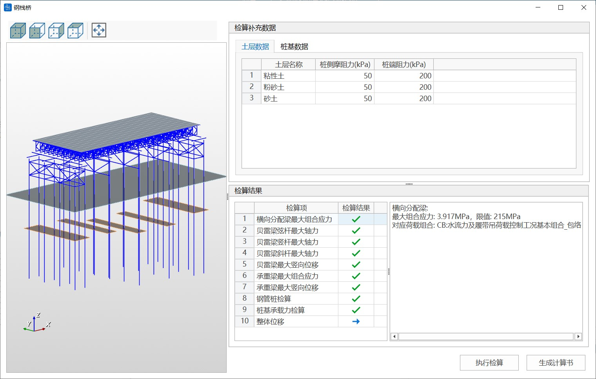
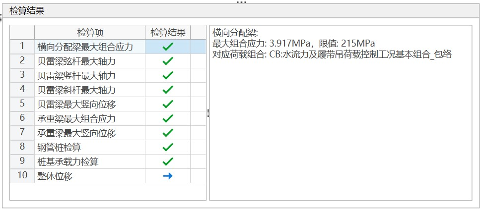

## Features

Quickly generate steel trestle bridge finite element models through parameterized steel trestle bridge models, and support structural verification and calculation report generation (only supports steel trestle bridge models generated through the Modeling Assistant).

## Command

From the main menu, select "Structure" > "Steel Trestle Bridge" > "Steel Trestle Bridge Modeling" to open;


## Toolbar

The functions of the toolbar buttons are as follows:

- [Section Design](#section-design)
- [Geological Borehole Data Management](#geological-borehole-data-management)
- Open Data File: Open modeling assistant data file;
- Save Data File: Save modeling assistant data file;
- Save As: Save current modeling data as another named data file;
- Isometric View;
- Front View;
- Right View;
- Top View;
- Auto Zoom;
- Section: Display component section design dialog;
- Geological Borehole: Display soil layer data and geological borehole data editing dialog;
- Options: Display options dialog, including basic parameters such as gravitational acceleration;
- Create QiaoTong Model: Generate QiaoTong finite element model based on current data.

## Section Design

Click the "Section" button in the toolbar to display the section list dialog, then perform section design in the section design dialog.




## Geological Borehole Data Management

Click the "Geological Borehole" button in the toolbar to display the geological borehole data management dialog, which can import and export soil layer parameters and geological borehole data.



## Basic Parameters Setting

Click the "Options" button in the toolbar to display the basic parameters that need to be entered, including gravitational acceleration, concrete density, and construction load.


## 3D Model Preview Window


The 3D model preview window allows real-time viewing of the model corresponding to the current parameter option settings, including structural layout, water level surface, pile position ground, and other information. You can rotate and zoom the model through mouse operations, and you can also perform model view operations through the view-related buttons in the toolbar.

## Superstructure Design



The superstructure design panel is used for the design of steel trestle bridge Bailey beams and deck layout. After adjusting design parameters, click the "Update Preview Model" button to update the 3D model preview view.

(1) Bailey Beam

You can set the Bailey beam model, longitudinal layout quantity, transverse layout, and cantilever end support.

**Transverse Layout**: Set the transverse layout quantity and spacing through "Spacing Expression". "2\@5000" means arranging 2 Bailey beams at 5000mm spacing. Valid spacing expression examples are as follows:

```text
4@123.45
100 4@123, 200 300
```

**Cantilever End Support**: Used to set the constraint method when no pile foundation support is set at the trestle bridge end. The "With Support" option adds vertical constraints at the end (can be used to simulate abutment support), and the "Without Support" option means the end is a cantilever beam.

(2) Deck

You can set the deck design elevation, deck type, and deck layout parameters.

**Steel Deck**:



You can set the deck plate model, transverse distribution beam section type, transverse distribution beam cantilever length, and longitudinal layout spacing.

**Note**: Steel deck plates are steel plates with longitudinal beams. The generated model does not consider the stiffness of deck plate elements. The generated deck plate element thickness is 10mm, and the weight of longitudinal beams is converted to the deck plate by adjusting the deck plate material density.

**Concrete Deck**:



You can set the deck plate thickness and concrete grade.

## Substructure Design


(1) Pile Layout

You can set the structural settings and layout positions of steel pipe piles. Here, "Span" refers to the number of longitudinal Bailey beam panels corresponding to the centerline of a row of pile layout. The software only supports arranging substructures at the ends of Bailey beams.

(2) Transverse Bearing Beam

You can set the configuration information for pile-top transverse bearing beams. Click the button in the upper right corner to set more information.


(3) Longitudinal Bearing Beam

You can set the configuration information for pile-top longitudinal bearing beams, only applicable to double-row piles. Click the button in the upper right corner to set more information.

(4) Inter-pile Bracing

You can set the configuration information for inter-pile bracing. Click the button in the upper right corner to set more information.

## Moving Load Settings


You can set moving load cases. Three types of moving loads are supported: Highway Grade I lane load, three-axle concrete mixer truck, and four-axle concrete mixer truck. Click the button in the upper right corner to adjust the axle weight and other settings of the concrete mixer truck.


## Vehicle Static Load Settings



You can set crawler crane loads. Crawler crane loads are applied to the deck as static loads.

(1) Vehicle

Click the button in the upper right corner to display the crawler crane definition dialog for customizing crawler crane vehicles.


(2) Load Type

You can specify the crawler crane load type, including traveling, forward hoisting (forward direction), forward hoisting (reverse direction), and side hoisting. The crawler crane traveling direction is positive from left to right, and vice versa.

(3) Mid-span Loading, Pile-top Loading

You can specify the loading position of the crawler crane load. A vehicle setting, a load type, and a loading position together constitute a loading case.

When adjusting the currently specified vehicle, load type, and loading position, the plan layout diagram above the panel will display the current loading situation in real-time.

## Environmental Load Settings


You can set wind loads, water flow loads, and wave forces.

(1) Wind Load

Only considers the wind load effect on Bailey beams, and the load is applied to the pile top after calculation; the Bailey beam wind shielding reduction factor is 0.66.

(2) Water Flow Load and Wave Force

Wave force is calculated according to "Port and Waterway Hydrology Code" (JTS 145-2015) and applied to steel pipe piles as line loads.

## Load Combination Settings



Load combinations can be automatically generated based on moving loads, vehicle static loads, environmental loads, and other setting information. The generated load combination coefficients can be adjusted.

**Note**: Please use the load combination function after completing the previous design. Returning to adjust other setting information after generating load combinations may cause the previous load combination data to become invalid.

## Verification and Calculation Report

From the main menu, select "Structure" > "Steel Trestle Bridge" > "Calculation Report" to open the steel trestle bridge verification and calculation report dialog.



(1) Soil Layer Data

You need to supplement the pile side friction resistance and pile end friction resistance values of soil layers. You can enter directly in the table or copy and paste. When pasting, ensure the number of columns in the original table matches the soil layer table.


(2) Pile Foundation Data

You need to supplement the pile foundation type and other related parameters for each row of piles.


### Verification

After supplementing the soil layer data and pile foundation data, click "Execute Verification". The verification results are read in table format. A "√" in the verification results indicates passing, and a "×" indicates failure. Each verification item will display the finite element model calculation results and limits on the right side, and show the corresponding load combination. You can find the corresponding verification results in the model based on the load combination. For concrete deck plates, the maximum combined stress of transverse distribution beams is not checked, but the maximum bending moment and shear force under concrete hoisting conditions are verified; the concrete deck plate cover thickness is considered as 40mm and the compression height as 80mm. Overall displacement only displays the maximum horizontal displacement calculation results, with no limit.




### Calculation Report

When all verification results pass, click "Generate Calculation Report" to generate the calculation report file.


