## 25.1 US Standards (AASHTO)

### 25.1.1 Materials

- Standards: AASHTO-LRFDBDS-2017, AASHTO-LRFDBDS-2020

### 25.1.2 Shrinkage and Creep

- Standards: AASHTO-LRFDBDS-2017

### 25.1.3 Reinforcement Relaxation

- Standards: AASHTO-LRFDBDS-2020

### 25.1.4 Live Load

Select AASHTO-LRFD for moving load standard

#### 25.1.4.1 Design Vehicular Live Load

The AASHTO LRFD specifications use the HL-93 vehicular live load model, which consists of three parts: Design Truck, Design Tandem, and Design Lane Load.

- **Design Tandem and Design Lane Load Combination**

  The Design Tandem considers dynamic load allowance (IM), while the Design Lane Load does not.

- **Design Truck (Variable Axle Spacing) and Design Lane Load Combination**

  The Design Truck considers dynamic load allowance (IM), while the Design Lane Load does not.

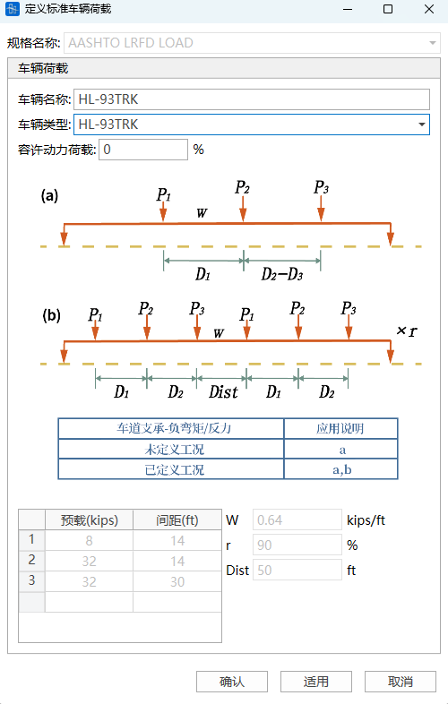

- **Fatigue Load**

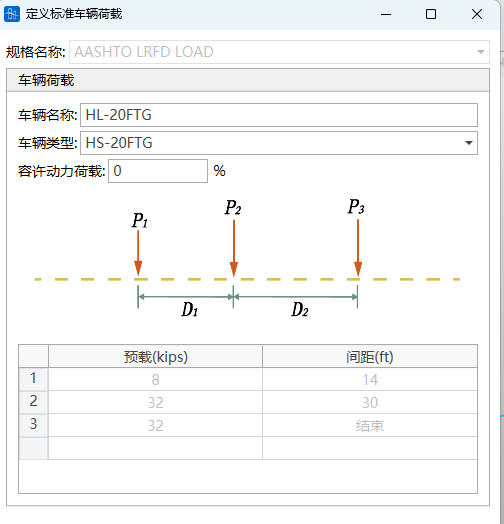

- **Custom Vehicle Load**

  You can customize multi-axle loads (fixed or variable axle spacing), custom lane loads, or a combination of both.
  > If the last axle of the vehicle load is a fixed axle, fill in 0 for the spacing corresponding to the last load.

> 🧐**AASHTO-LRFD Specification Regulation: In determining the number of lanes, if the live load case includes pedestrian load + more than one lane of vehicular load, the pedestrian load should be treated as one lane and considered for multiple presence reduction factor together with other lanes. Therefore, pedestrian load uses custom vehicle.**

#### 25.1.4.2 Multiple Presence Reduction

- When considering loading on multiple lanes on the bridge, the multiple presence factor $m$ should be applied.

  | Number of Loaded Lanes | Multiple Presence Factors $m$ |
  | ---------------------- | ----------------------------- |
  | 1                      | 1.20                          |
  | 2                      | 1.00                          |
  | 3                      | 0.85                          |
  | \\>3                   | 0.65                          |

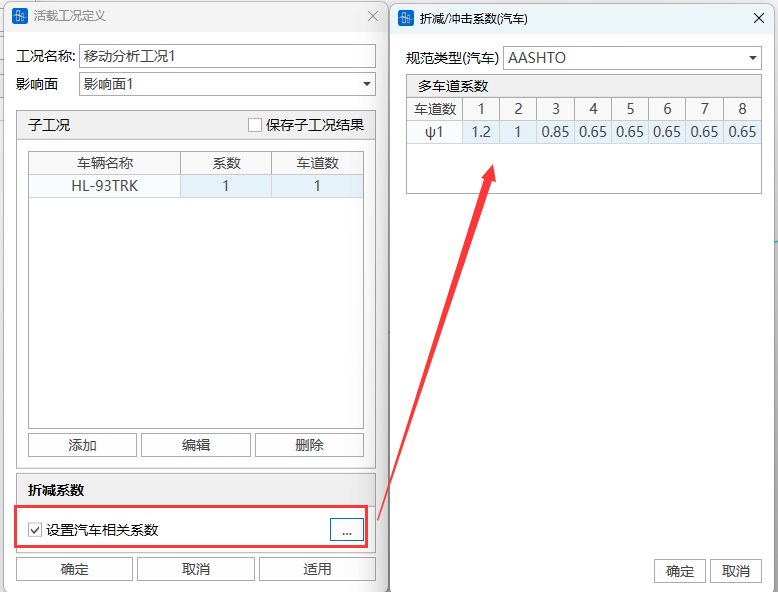

- Notes

  In the process of determining the number of lanes, if the live load case includes pedestrian load and is in a combination case including pedestrian load and more than one lane of vehicular load, the pedestrian load needs to be treated as one lane to consider the reduction factor together with other lanes.
  - If there is one sidewalk and one lane in the live load case, when calculating vehicle live load alone, m=1.2; when pedestrian load is combined with vehicle live load, m=1.0;
  - If there is one sidewalk and two lanes of vehicle load in the live load case:
    (1) Vehicle live load takes one lane, m=1.2;
    (2) Combination of the larger lane in vehicle live load and pedestrian load, or vehicle live load takes two lanes, m=1.0;

    (3) Two lanes of vehicle live load and pedestrian live load, m=0.85.
  - For a single lane, the multiple presence factor (m=1.2) does not apply to pedestrian load. Therefore, for pedestrian load without vehicle live load, m is taken as 1.0.

#### 25.1.4.3 Dynamic Load Allowance

📖   Except for centrifugal and braking forces, the Design Truck or Design Tandem needs to increase the dynamic load allowance IM on the basis of static effects to consider the dynamic loading effects. Pedestrian loads and Design Lane Loads do not need to consider impact factors.

>  If the structure group has set the dynamic load effect coefficient, then for element internal forces, stresses, and node displacement calculations, the set dynamic load effect coefficient is used, and the dynamic load effect in the vehicle becomes invalid.

#### 25.1.4.4 Lane Support Reactions and Negative Moments

📖       The specification stipulates: For negative moments between inflection points of uniform load (negative moments of beam or plate elements) and intermediate pier reactions, 90% of the effect of 2 Design Trucks (minimum spacing between the rear axle of the front truck and the front axle of the rear truck is 50ft) combined with 90% of the lane load effect. The 32kip axle spacing of each truck is 14ft. The two trucks should be placed in adjacent spans to obtain the maximum load effect.

- Lane Support Reaction

  Select the node where the intermediate pier support element is located

- Lane Support Negative Moment

  Select the element where the negative moment between inflection points of uniform load (negative moment of beam or plate element) is located

- ❗Notes
  1. If lane support negative moment elements are set, beam element internal force negative moments and beam element stress calculations consider the "defined cases" in vehicle loads;
  2. If lane support reactions are set, reaction calculations consider the "defined cases" in vehicle loads;
  3. If lane support negative moment elements are set, and the element also defines a dynamic load effect coefficient, both are considered.

### 25.1.5 Concrete Checks

#### 25.1.5.1 Check Load Combinations

#### Check Load Combinations

- Specification: AASHTO-LRFDBDS-2020
- Types include: Strength Combinations, Extreme Event, Service I, Service II, Service III, Service IV, Fatigue Combination, Permanent Load Combination

- **Time-Dependent Dead Load (SDL) Settings**

  
  - **Is "SDL" already calculated in the construction stage?**

    If the SDL load case (load case type is Dead Load) is also participating in the construction stage calculation, the CQ Completed Bridge (Dead Load) result actually includes the First Dead Load (Self-weight) and the user-defined SDL. Therefore, checking logic needs to subtract the operation stage SDL load case calculation result from the CQ Completed Bridge (Dead Load) result to get the First Dead Load calculation result. Thus, in SDL settings, you need to select whether the SDL load case (load case type is Dead Load) is already calculated in the construction stage.

#### Auto-Generate Check Load Combinations

- Function: Assist users in generating check load combinations.
- Command: Button at the bottom left of the "Check Load Combinations" window.

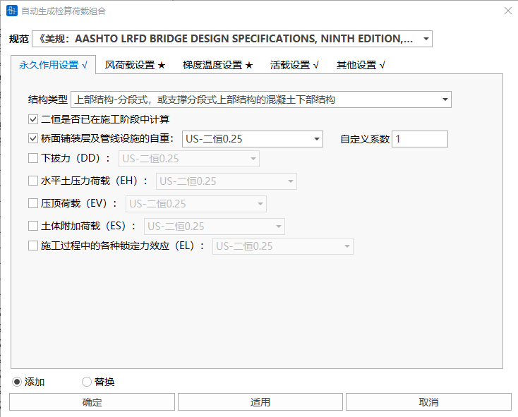

- Input
  - **SDL Settings**

    
    - **Is "SDL" already calculated in the construction stage?**

      Same as above.
  - **Gradient Temperature Settings**

      Since gradient temperatures in different directions cannot be combined together, gradient temperatures need to set Gradient Temperature Case 1 and Gradient Temperature Case 2 separately (they will be combined separately). Select the load case defined as Gradient Temperature type in 9.1 Load Cases to participate in the combination.
  - **Other Variable Action Settings**

      If other load combination types (including custom ones) participate in checking, calculate checks, check "Participate in Combination" for that item, and fill in the custom coefficient.

    
  - **Live Load Settings**

      If moving load participates in checking, select the case defined in Moving Load Analysis Cases to participate in combination, check "Participate in Combination", and fill in the custom coefficient.

    
  - **Add/Replace**

    Add: Add the auto-generated check load combinations after the original check load combinations.

    Replace: Auto-generated check load combinations replace the original check load combinations.

#### 25.1.5.2 Calculation Items

#### Flexural Capacity

- Check Combination Types: Strength Combinations, Extreme Event Combinations
- Analysis Settings:
  - Analysis Settings > Flexural Capacity Settings. Need to set calculation method.

    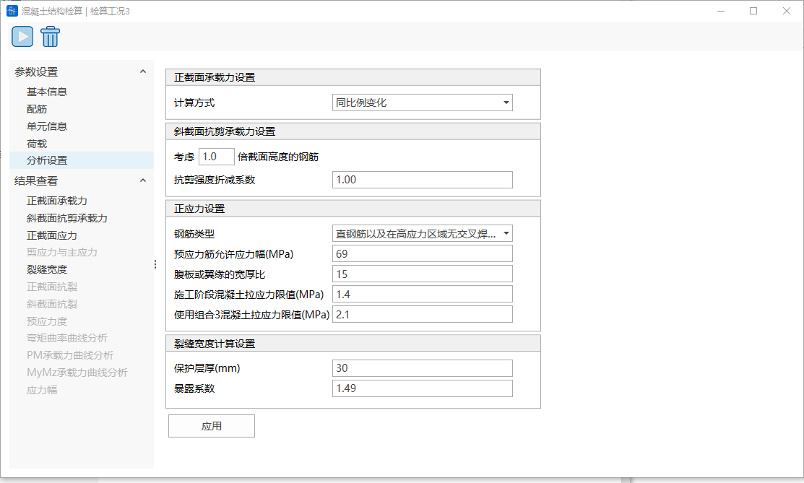
  - Calculation Methods Available:
    - Proportional Change: $\frac{F_{X D}}{F_{X}}=\frac{M_{Y_{D}}}{M_{Y}}=\frac{M_{Z_{D}}}{M_{\underline{Z}}}=K$
    - Constant Axial Force: ${F_{X D}}={F_{X}}$, $\frac{M_{Y_{D}}}{M_{Y}}=\frac{M_{Z_{D}}}{M_{Z}}=K$
    - Constant MY: ${M_{Y D}}={M_{Y}}$, $\frac{F_{X_{D}}}{F_{X}}=\frac{M_{Z_{D}}}{M_{Z}}=K$
    - Constant MZ: ${M_{Z D}}={M_{Z}}$, $\frac{F_{X_{D}}}{F_{X}}=\frac{M_{Y_{D}}}{M_{Y}}=K$
    - Constant Axial Force and MY: ${F_{X D}}={F_{X}}$, ${M_{Y D}}={M_{Y}}$, $\frac{M_{Z_{D}}}{M_{Z}}=K$
    - Constant Axial Force and MZ: ${F_{X D}}={F_{X}}$, ${M_{Z D}}={M_{Z}}$, $\frac{M_{Y_{D}}}{M_{Y}}=K$
    - Constant MY and MZ: ${M_{Y D}}={M_{Y}}$, ${M_{Z D}}={M_{Z}}$, $\frac{F_{X_{D}}}{F_{X}}=K$
    Where, ${F_{X}},{M_{Y}},{M_{Z}}$ are loads, ${F_{XD}},{M_{YD}},{M_{ZD}}$ are capacities, $K$ is the safety factor.
- Calculation Description
  - **Calculation Assumptions**
    - 1) Plane section assumption;
    - 2) Reinforcement and prestressing tendons use the stress-strain curve, ultimate compressive strain, and ultimate tensile strain from the first section, with maximum stress taken as yield strength.
    - 3) Concrete uses the stress-strain curve and ultimate compressive strain from the first section, with maximum compressive stress taken as equivalent rectangular concrete compressive strength ($α*f_{c'}$), ignoring concrete tensile strength.

      | Concrete Grade | Compressive Strength $f'\_c$ (ksi) | Strength Reduction Factor α |
      | -------------- | ---------------------------------- | --------------------------- |
      | Grade2500      | 2.5                                | 0.85                        |
      | Grade3000      | 3.0                                | 0.85                        |
      | Grade3500      | 3.5                                | 0.85                        |
      | Grade4000      | 4.0                                | 0.85                        |
      | Grade4500      | 4.5                                | 0.85                        |
      | Grade5000      | 5.0                                | 0.85                        |
      | Grade6000      | 6.0                                | 0.85                        |
      | Grade7000      | 7.0                                | 0.85                        |
      | Grade8000      | 8.0                                | 0.85                        |
      | Grade9000      | 9.0                                | 0.85                        |
      | Grade10000     | 10.0                               | 0.85                        |
      | Grade11000     | 11.0                               | 0.83                        |
      | Grade12000     | 12.0                               | 0.81                        |
      | Grade13000     | 13.0                               | 0.79                        |
      | Grade14000     | 14.0                               | 0.77                        |
      | Grade15000     | 15.0                               | 0.75                        |

  - **Calculation Content**

    The factored resistance shall be determined as follows: &#x20;
    $M_r = \phi M_n$
    Where: &#x20;

    $M_n$: Nominal Resistance &#x20;

    $\phi$: Resistance Factor
  - **Resistance Factor**

    

    $ε_t$: Net tensile strain of reinforcement

    $ε_{cl}$: Ultimate compressive strain of reinforcement or tendon

    $ε_{tl}$: Ultimate tensile strain of reinforcement or tendon
  - **Minimum Reinforcement Requirement Check**
    - Function: Prevent brittle failure (early tensile failure of reinforcement when concrete compressive strain is small).
      Unless otherwise specified, at any section of a flexural component not controlled by compression, the amount of prestressed and non-prestressed tensile reinforcement shall be adequate to develop a factored flexural resistance $M_r$ at least equal to the lesser of: &#x20;
    $M_r \geq \min(1.33 M_{design},\, M_cr)$

    $M_{design}$: Factored design moment;

    $M_cr$: Cracking moment,
    $M_cr = \gamma_3\left[\left(\gamma_1 f_r + \gamma_2 f_cpe\right) S_c - M_dnc\left(\frac{S_c}{S_nc} - 1\right)\right] \quad (5.6.3.3-1)$

    | Symbol      | Definition                                                                        | Unit   |
    | ----------- | --------------------------------------------------------------------------------- | ------ |
    | $f_r$       | Modulus of rupture of concrete                                                    | ksi    |
    | $f_cpe$     | Compressive stress in concrete due to effective prestress forces only             | ksi    |
    | $S_c$       | Section modulus for the extreme fiber of the composite section                    | in³    |
    | $M_dnc$     | Total unfactored dead load moment acting on the monolithic or noncomposite section | kip-in |
    | $S_nc$      | Section modulus for the extreme fiber of the monolithic or noncomposite section   | in³    |

    > 📌 **Section Handling Rules:**
    > 1. Intermediate composite sections need to match $M_{dnc}$ and $S_{nc}$ values
    > 2. When beam is designed as monolithic section: $S_{nc}$ replaces $S_c$ for calculation &

    ***
    Variability Factors:

    | Factor            | Definition                           | Condition                         | Value        |
    | ----------------- | ------------------------------------ | --------------------------------- | ------------ |
    | $\gamma\_1$     | Flexural cracking variability factor | Precast segmental structures      | 1.2          |
    |                   |                                      | Other concrete structures         | 1.6          |
    | $\gamma\_2$     | Prestress variability factor         | Bonded tendons                    | 1.1          |
    |                   |                                      | Unbonded tendons                  | 1.0          |
    | $\gamma\_3$     | Ratio of yield to ultimate strength  |                                   | **See Below** |
    | $\gamma_3$ Values: |                                      |                                   |              |
    | Value             | Reinforcement Standard & Grade       |                                   |              |
    | -----             | ------------------------------------ | --------------------------------- | ------------ |
    | 0.67              | AASHTO M 31 / ASTM A615 (Grade 60)   |                                   |              |
    | 0.75              | AASHTO M 31 / ASTM A615 (Grade 75)   |                                   |              |
    | 0.76              | AASHTO M 31 / ASTM A615 (Grade 80)   |                                   |              |
    | 0.67              | AASHTO M 334 / ASTM A1035 (Grade 100) |                                   |              |
    | 1.0               | Prestressing tendons                 |                                   |              |

  - Approximate Estimate of Slenderness Effects

    Not yet considered
  - **Axial Compressive Capacity**

    The specification only prescribes that sections symmetric about two principal axes are applicable to the following formulas. The software considers all sections applicable to the following formulas.
    $$
    P_r = \phi P_n \quad
    $$
    $P_r$: Factored axial compressive resistance (kip) &#x20;

    $\phi$: Resistance factor &#x20;

    $P_n$: Nominal axial compressive resistance (kip)

    | Tie Type                      | Formula                                                                                                                                           |
    | ----------------------------- | ------------------------------------------------------------------------------------------------------------------------------------------------- |
    | **Spiral Reinforcement**         | $P_n = 0.85 \left[ \begin{matrix} k_c f'c (A_g - A{st} - A_{ps}) \ + f_y A_{st} \ - A _{ps}(f_{pe} - E_p \varepsilon_{cu}) \end{matrix} \right]$ |
    | **Tie Reinforcement**       | $P_n = 0.80 \left[ \begin{matrix} k_c f'c (A_g - A{st} - A_{ps}) \ + f_y A_{st} \ - A _{ps}(f_{pe} - E_p \varepsilon_{cu}) \end{matrix} \right]$ |
    | $k_c$: Ratio of ultimate compressive stress to design strength |                                                                                                                                                   |

    $$
    k_c = \begin{cases}  
    0.85 & \text{if } f'_c \leq 10 \text{ ksi} \\  
    {0.85 - 0.02(f'_c - 10)} & \text{if } 10 < f'_c < 15 \text{ ksi} \\  
    0.75 & \text{if } f'_c \geq 15 \text{ ksi}  
    \end{cases}
    $$

    | Symbol             | Definition                         | Unit    |
    | ------------------ | ---------------------------------- | ------- |
    | $f'\_c$          | Specified Compressive Strength of Concrete | ksi     |
    | $A\_g$           | Gross Area of Section              | in.²    |
    | $A _{st}$          | Total Area of Non-Prestressed Reinforcement | in.²    |
    | $A _{ps}$          | Area of Prestressing Steel         | in.²    |
    | $f\_y$           | Yield Strength of Reinforcing Bars | ksi     |
    | $f _{pe}$          | Effective Stress in Prestressing Steel | ksi     |
    | $E\_p$           | Modulus of Elasticity of Prestressing Steel | ksi     |
    | $\varepsilon _{cu}$ | Ultimate Compressive Strain of Concrete | in./in. |

#### Shear Capacity

- Check Combination Types: Strength Combinations, Extreme Event Combinations.
- Currently, the software only calculates Shear in Z-direction. **Does not consider** the shear contribution of bent-up longitudinal reinforcement and vertical prestressing tendons.
- Analysis Settings:
  - Analysis Settings > Shear Capacity Settings.

    
  - Can set to consider reinforcement within how many times the section height. Default is 1.

    User can input parameter to control the reinforcement range for calculating effective depth h0 and longitudinal reinforcement ratio. For example, entering 0.2 means tensile reinforcement within 0.2 times the section height from the tensile edge is used to calculate effective depth h0 and longitudinal reinforcement ratio.
- Calculation Description
  - Nominal Shear Resistance Vn Calculation

    Nominal shear resistance $V_n$ shall be determined as the **lesser** of:
    $$
    V_n = \min \left\{ \begin{array}{c} V_c + V_s + V_p \\ 0.25 f'_c b_v d_v + V_p \end{array} \right.
    $$
    *(**Specification** Equations 5.7.3.3-1 and 5.7.3.3-2)* &#x20;
    - $V_c$**:** Concrete shear contribution
      $$
      V_c = 0.0316\beta\lambda\sqrt{f'_c} b_v d_v \quad (\text{Specification}5.7.3.3-3)
      $$
    - $V_s$**:** Reinforcement shear contribution
      $$
      V_s = \frac{A_v f_y d_v (\cot\theta + \cot\alpha) \sin\alpha}{s} \lambda_{\text{duct}} \quad (\text{Specification}5.7.3.3-4)
      $$
      - $\lambda_{\text{duct}}$**:** Shear strength reduction factor, considering reduction in shear strength provided by transverse reinforcement due to the presence of grouted post-tensioning ducts. For ducts not fully grouted, take 1.0, and reduce web or flange width to account for the presence of ungrouted ducts.
        $$
        \lambda_{\text{duct}} = 1 - \delta \left( \frac{\Phi_{\text{duct}}}{b_w} \right)^2 \quad (\text{Specification}5.7.3.3-5)
        $$
        **User inputs this in the program analysis settings.**
    - $V_p$**:** Prestressing component, $V_p$ = Component of prestressing force in the direction of the shear force (positive if resisting external force)
    - Key Parameter Definition Table &#x20;

      | Symbol                  | Definition                    | Unit | Key Explanation                                      |
      | ----------------------- | ----------------------------- | ---- | ---------------------------------------------------- |
      | $b\_v$                | Effective Web Width           | in   | Use minimum web width within $d\_v$                  |
      | $d\_v$                | Effective Shear Depth         | in   | Determined by Specification 5.7.2.8                  |
      | $\beta$               | Factor indicating ability of diagonally cracked concrete to transmit tension and shear | -    | Determined by Specification 5.7.3.4                  |
      | $\lambda$             | Concrete Density Modification Factor | -    | Determined by Specification 5.4.2.8                  |
      | $A\_v$                | Area of Shear Reinforcement   | in²  | Within spacing $s$                                   |
      | $\theta$              | Angle of Diagonal Compressive Stresses | °    | Determined by Specification 5.7.3.4                  |
      | $\alpha$              | Angle of Inclination of Transverse Reinforcement | °    | **Software defaults to 90°**                         |
      | $s$                   | Spacing of Transverse Reinforcement | in   | Measured parallel to longitudinal reinforcement      |
      | $\delta$              | Duct Diameter Correction Factor | -    | 2.0 for grouted ducts                                |
      | $\Phi _{\text{duct}}$   | Diameter of Post-Tensioning Duct | in   | Exists within depth $d\_v$                           |
      | $b\_w$                | Total Web Width               | in   | Not reduced for ducts                                |
      | $f'\_c$               | Compressive Strength of Concrete | ksi  |                                                      |

      - $d_v$ : Effective shear depth, satisfying: &#x20;
        $$
        d_v \geq \max \left( \begin{array}{c} 0.9d_e \\ 0.72h \end{array} \right)
        $$
        Where:

        $d_e$: Distance from the extreme compression fiber to the centroid of the tensile force in the tensile reinforcement and prestressing steel: &#x20;
        $$
        d_e = \frac{A_{ps} f_{ps} d_p + A_s f_y d_s}{A_{ps} f_{ps} + A_s f_y}
        $$
        $h$: Total height of section

        $d_p$: Distance from extreme compression fiber to the centroid of prestressing tendons

        $d_s$: Distance from extreme compression fiber to the centroid of non-prestressed tensile reinforcement

        $A_{ps}$ : Area of prestressing steel in tension zone

        $A_s$: Area of non-prestressed reinforcement in tension zone

        $f_{ps}$ : Average stress in prestressing steel in tension

        $f_y$: Yield stress of reinforcement in tension zone &#x20;
  - Shear Parameters β and θ

    The program defaults to calculating β using the following equation, assuming the amount of transverse reinforcement satisfies the minimum requirements of Article 5.7.2.5:
    $$
      \beta = \frac{4.8}{(1+750ε_s)} \quad (\text{Specification}5.7.3.4.2-1)
    $$
    The value of θ can be determined by the following equation:
    $$
      θ = 29 + 3500ε_s \quad (\text{Specification}5.7.3.4.2-3)
    $$
    - $ε_s$: Net longitudinal tensile strain in the section at the centroid of the tension reinforcement, and $ε_s\geq0$

#### Normal Stress

- Check Combination Types: Service Combinations, Permanent Load Combination, Fatigue Combination, Construction Load
- Analysis Settings:
  - Analysis Settings > Normal Stress Settings.

    
- Calculation Description
  - Calculation Assumptions
    1. Uncracked prestressed concrete members: Consider concrete tensile resistance
    2. Plane section assumption
    3. Use transformed section calculation, the modular ratio $n$ of transformed section is calculated as follows:

       Mild reinforcement: $n_s = \dfrac{E_s}{E_c}$

       Prestressing steel: $n_p = \dfrac{E_p}{E_c}$
    4. Reinforced concrete members: Do not consider tensile resistance of concrete
  - Service Limit State Stress Calculation
    - Service Limit State Stress Limits

      | Member Type                             | State Type | Concrete Compressive Limit | Concrete Tensile Limit | Tendon Tensile Limit |
      | --------------------------------------- | ---------- | -------------------------- | ---------------------- | -------------------- |
      | **Prestressed Member (No Crack Allowed)** | Construction | $0.65 f'_{ci}$ | **Set in Analysis Settings** | $0.90 f_{ptk}$ |
      | | Completed Bridge | $0.45 f'_{ck}$ | - | - |
      | | Service I | $0.60\phi_w f'_{ck}$ | - | $0.80 f_{ptk}$ |
      | | Service III | - | **Set in Analysis Settings** | $0.80f _{ptk}$ |
      | | Other Service Combinations | - | - | $0.80f _{ptk}$ |
      | **Prestressed Member (Crack Allowed)** | Construction | $0.65 f'_{ci}$ | - | $0.90 f_{ptk}$ |
      | | Completed Bridge | $0.45 f'_{ck}$ | - | - |
      | | Service I | $0.60\phi_w f'_{ck}$ | - | $0.80 f_{ptk}$ |
      | | Service III | - | - | $0.80f _{ptk}$ |
      | | Other Service Combinations | - | - | $0.80f _{ptk}$ |
      | **Reinforced Concrete Member** | Construction | $0.65 f'_{ci}$ | - | - |
      | | Completed Bridge | $0.45 f'_{ck}$ | - | - |
      | | Service I | $0.60\phi_w f'_{ck}$ | - | - |
      | | Service III | - | - | - |

      - Software default takes $f'_{ci}=0.7*f'_{c}$
      - Concrete compressive stress limit (Construction Stage) is $0.65f'_{ci}$.
      - Concrete compressive stress limit (Completed Bridge, Service I):

        | Location | Stress Limit |
        | ----------------------- | ------------------------ |
        | Due to aggregate of effective prestress and permanent loads | $0.45 f'_{ck}$ |
        | Due to aggregate of effective prestress, permanent loads, and transient loads and separated during shipping and handling | $0.60\phi_w f'_{ck}$ |

        - Slenderness ratio reduction factor $\phi_w$:
          $$
          \phi_w =
          \begin{cases}
          1.0 & \lambda_w \leq 15 \\
          1 - 0.025(\lambda_w - 15) & 15 < \lambda_w \leq 25 \\
          0.75 & 25 < \lambda_w \leq 35
          \end{cases}
          $$
          $\lambda_w$: Web or flange slenderness ratio, **Set in Analysis Settings**
    - Tendon Stress Limits

      | Condition | Plain High-Strength Bars | Low Relaxation Strand | Deformed High-Strength Bars |
      | --------- | ------------------------ | --------------------- | --------------------------- |
      | At Transfer | $0.90f _{ptk}$ | $0.90f _{ptk}$ | $0.90f _{ptk}$ |
      | at Service Limit State after all losses | $0.80f _{ptk}$ | $0.80f _{ptk}$ | $0.80f _{ptk}$ |

  - Fatigue Limit State Stress Calculation
    - Only Fatigue I combination is considered, Fatigue II combination related calculations are not considered.
    - When calculating stress range for reinforced concrete members, consider concrete in tension to be neglected, load uses Permanent Load Combination + Fatigue Combination.
    - When calculating stress range for prestressed concrete members, calculate according to linear elasticity, load uses 0.5×(Unreduced Effective Prestress + Permanent Load Combination) + Fatigue Combination.
      For fatigue consideration, concrete members should satisfy: &#x20;
    $$
    \gamma(\Delta f) \leq (\Delta F)_{TH} \quad
    $$

    | Symbol               | Physical Meaning       | Unit | Specification Reference |
    | -------------------- | ---------------------- | ---- | ----------------------- |
    | $\gamma$             | Fatigue I factor (already considered in load combination) | -    | Table 3.4.1-1           |
    | $\Delta f$           | Live load stress range due to fatigue load | ksi  | Article 3.6.1.4         |
    | $(\Delta F) _{TH}$   | Stress Range Limit     | ksi  | Articles 5.5.3.2\~5.5.3.4 |

    - If the whole section is under compression under Fatigue I load combination live load plus permanent load, fatigue need not be considered.
    - For prestressed members designed according to Service III Limit State, and the tensile stress of the outermost concrete fiber does not exceed the tensile stress limit specified in Table 5.9.2.3.2b-1, fatigue check is not required for reinforcement.
    - If the structural member contains both prestressing tendons and mild reinforcement, and the concrete tensile stress is allowed to exceed the Service III limit specified in Table 5.9.2.3.2b-1, then fatigue check must be performed for this member.
    - Reinforcement Stress Range Limit

      | Reinforcement Type | Formula                                                   |
      | ------------------ | --------------------------------------------------------- |
      | For straight reinforcement and welded wire reinforcement without cross welds in high-stress regions | $ (\Delta F) _{TH} = 26 - \frac{22 f_{\min}}{f _{y}}$ |
      | For straight welded wire reinforcement with cross welds in high-stress regions | $ (\Delta F) _{TH} = 18 - 0.36 f_{\min}$              |

      - Reinforcement Type: **User sets in Analysis Settings**.
      - $f_{\min}$: Minimum live load stress resulting from Fatigue I combination (positive for tension, negative for compression) &#x20;
      - $f_y$: Specified minimum yield strength of reinforcement, not less than 60.0 ksi, and not greater than 100 ksi.
    - Prestressing Tendon Stress Range Limit &#x20;

      **User sets "Prestressing Tendon Allowable Stress Range" in Analysis Settings**.

      | Radius of Curvature (ft) | $(\Delta F) _{TH}$             |
      | ------------------------- | ------------------------------ |
      | $r$ < 12.0              | 10.0 ksi                       |
      | $12.0 \leq r \leq 30.0$ | $10.0 + \dfrac{8(r-12)}{18}$ |
      | $r$ > 30.0              | 18.0 ksi                       |

    - Others &#x20;
      - For prestressed members other than segmentally constructed bridges, the compressive stress due to Fatigue I combination superimposed with half the sum of unreduced effective prestress and permanent loads shall not exceed 0.40 times the compressive strength of concrete after prestress losses ($0.40 f'_c$).
        （$\sigma_c = \sigma_{c,\text{fatigue}} + 0.5(\sigma_{c,\text{pe}} + \sigma_{c,\text{DL}}) \leq 0.40 f'_c$）
        Where: $\sigma_{c,\text{fatigue}}$ is the compressive stress due to Fatigue I, $\sigma_{c,\text{pe}}$ is the compressive stress due to unreduced effective prestress, $\sigma_{c,\text{DL}}$ is the compressive stress due to permanent loads.
      - If the concrete tensile stress in prestressed members due to Fatigue I live load plus permanent load exceeds $0.095\sqrt{f'_c}$, calculate as cracked section.

#### Shear Stress and Principal Stress

- Only for Fully Prestressed Members, Class A Members, Class B Members
- Check Combination Types: Service III Combination
- Calculation Description
  - Concrete Principal Tensile Stress Limit: &#x20;
    $$
    \sigma_{t} \leq 0.110 \sqrt{f'_c}
    $$
  - Software only calculates principal tensile stress for prestressed concrete members, and only considers axial force ($F_x$), vertical shear force ($F_z$), and bending moments ($M_y$, $M_z$). Does not consider transverse shear ($F_y$) and torsion ($M_x$).
  - Shear Stress Calculation &#x20;
    - Section Property Selection Rules: &#x20;

      | Load Type | Section Property |
      | --------- | ---------------- |
      | Primary Prestress Effect | Gross Section Properties |
      | Other Load Effects | Transformed Section Properties |

    - Web Centroidal Axis Shear Stress Formula: &#x20;
      $$
      \tau = \frac{VQ_g}{I_g b_w}
      $$

      | Symbol | Physical Meaning |
      | ------ | ---------------- |
      | $\tau$ | Shear stress at web centroid |
      | $V$    | Shear force under Service III |
      | $Q\_g$ | First moment of area about neutral axis |
      | $I\_g$ | Moment of inertia about centroidal axis |
      | $b\_w$ | Width of web at principal tensile stress check point |

  - Normal Stress Calculation
    - Section Property Selection Rules: &#x20;

      | Load Type | Section Property |
      | --------- | ---------------- |
      | Primary Prestress Effect | Gross Section Properties |
      | Other Load Effects | Transformed Section Properties |

  - Vertical Normal Stress Calculation &#x20;

    Specification Reference: &#x20;

    Chinese "Code for Design of Highway Reinforced Concrete and Prestressed Concrete Bridges and Culverts" (JTG 3362-2018) Formula 6.3.3-4

#### Crack Width

- Crack width control is achieved by controlling reinforcement spacing. The actual calculation result is the maximum allowable reinforcement spacing, while also controlling reinforcement stress to be less than the allowable value.
- This software only calculates the maximum allowable reinforcement spacing based on crack width control requirements and does not consider detailing requirements.
- Only for Reinforced Concrete Members, Class B Members
- Check Combination Types: Service Combinations
- Analysis Settings:
  - Analysis Settings > Crack Width Settings.

    
- Calculation Description

  Under Service Limit State load combinations, for all concrete members where the normal stress exceeds 0.8 times the modulus of rupture (normal stress > $0.8f_r$), the spacing $s$ of mild reinforcement in the layer closest to the tension face shall satisfy:
  $$
  s \leq \frac{700\gamma_e}{\beta_s f_{ss}} - 2d_c
  $$

  | Symbol         | Name | Remarks | Unit |
  | -------------- | ---- | ------- | ---- |
  | $\gamma\_e$  | Exposure Factor | **User sets in Analysis Settings** 1.00 (Class 1 exposure) 0.75 (Class 2 exposure) | - |
  | $\beta\_s$   | Strain Ratio Factor | Ratio of maximum concrete tensile strain to strain at centroid of tension reinforcement | - |
  | $f _{ss}$      | Tensile Stress in Mild Reinforcement | $\leq 0.60f\_y$ | ksi |
  | $d\_c$       | Effective Cover Thickness | Distance from concrete tension edge to center of nearest reinforcement | in |

## 25.2 British Standards (BS 5400)

### 25.2.1 Materials

- Standards: BS 5400-4:1990

### 25.2.2 Shrinkage and Creep

- Standards: BS 5400-4:1990

### 25.2.3 Relaxation of Steel Reinforcement

- Standards: BS 5400-4:1990

### 25.2.4 Live Load

#### 25.2.4.1 Vehicular Load

Standard highway loading consists of HA loading and HB loading. Both loadings include an allowance for impact, so no additional impact factor needs to be set.

- HA Loading

  Uniformly distributed load (UDL) depends on the loaded length.

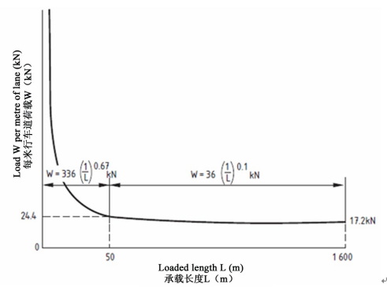

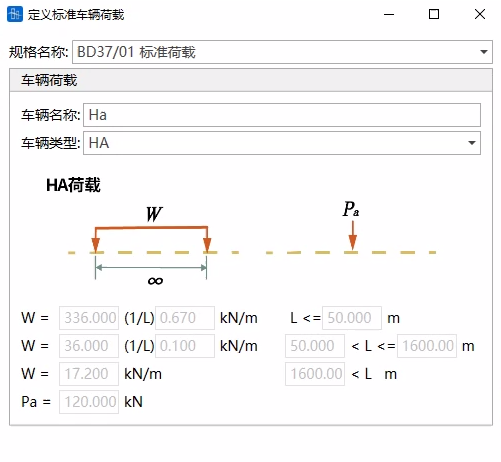

- HB Loading

  Spacing between the second and third axles is variable. Live load calculation takes the most critical spacing.

- Combined HA and HB Loading (HA\&HB)

- 💡Notes
  1. HA\&HB vehicle loading has two cases, take the most critical:
  - HB loading on one lane
    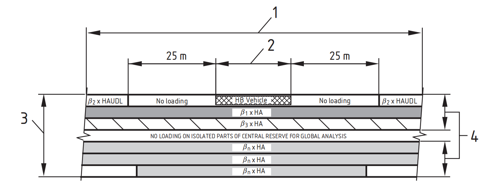
  - HB loading distributed on two lanes (Specify two lanes for HB)
    Live load case needs to define the two lanes for HB travel. If not defined, the case of HB loading distributed on two lanes will not be calculated.
  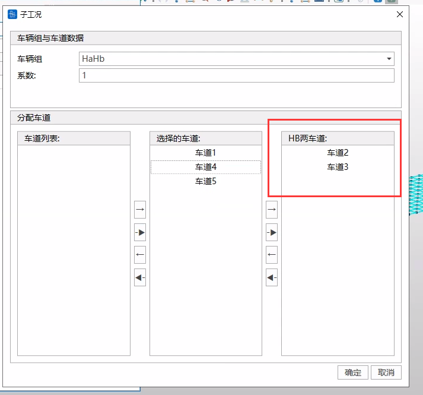

  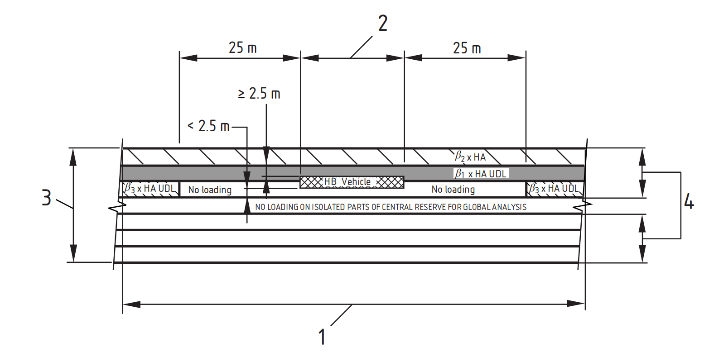

  
- Pedestrian Load

#### 25.2.4.2 Multiple Lane Reduction Factors

- For HA vehicle loading and combined HA and HB loading, multiple lane reduction factors are automatically calculated according to the specification, as shown in the table below:

- If a lane is loaded only with HB vehicle loading, no multiple lane reduction is applied to that lane, but the actual number of loaded vehicles can be set.

### 25.2.5 Concrete Checks

#### 25.2.5.1 Check Load Combinations

#### Check Load Combinations

- Specification: BS 5400-2:2006
- Types include: Ultimate Limit State (ULS), Serviceability Limit State (SLS)

- **Time-Dependent Dead Load (SDL) Settings**

  
  - **Is "SDL" already calculated in the construction stage?**

    If the SDL load case (load case type is Dead Load) is also participating in the construction stage calculation, the CQ Completed Bridge (Dead Load) result actually includes the First Dead Load (Self-weight) and the user-defined SDL. Therefore, checking logic needs to subtract the operation stage SDL load case calculation result from the CQ Completed Bridge (Dead Load) result to get the First Dead Load calculation result. Thus, in SDL settings, you need to select whether the SDL load case (load case type is Dead Load) is already calculated in the construction stage.

#### Auto-Generate Check Load Combinations

- Function: Assist users in generating check load combinations.
- Command: Button at the bottom left of the "Check Load Combinations" window.

- Input
  - **SDL Settings**

    
    - **Is "SDL" already calculated in the construction stage?**

      Same as above.
  - **Gradient Temperature Settings**

      Since gradient temperatures in different directions cannot be combined together, gradient temperatures need to set Gradient Temperature Case 1 and Gradient Temperature Case 2 separately (they will be combined separately). Select the load case defined as Gradient Temperature type in 9.1 Load Cases to participate in the combination.
  - **Global Temperature Rise/Fall Settings**

      If load cases of "System Temperature Load" type participate in checking as global temperature rise/fall, check "Participate in Combination" for that item, and fill in the custom coefficient.

    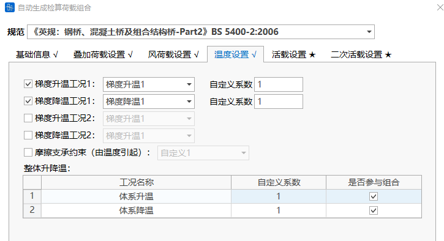
  - **Live Load Settings**

      If moving load participates in checking, select the case defined in Moving Load Analysis Cases to participate in combination, check "Participate in Combination", and fill in the custom coefficient.

    
  - **Secondary Live Load Settings**

      Depending on the bridge type selected in Basic Information, different secondary live load settings need to be configured.

    
  - **Add/Replace**

    Add: Add the auto-generated check load combinations after the original check load combinations.

    Replace: Auto-generated check load combinations replace the original check load combinations.

#### 25.2.5.2 Material Constitutive Models

- Specification: BS 5400-4:1990
- This specification uses the Limit State Method, divided into Ultimate Limit State and Serviceability Limit State. Material partial safety factors $\gamma_m$ for both states are shown in the table below:
  1. Serviceability Limit State

     | Material | Reinforced Concrete | Prestressed Concrete |
     | --- | ------- | -------- |
     | Concrete | 1.00    | 1.25     |
     | Reinforcement  | 1.00    | 1.00     |
     | Tendon  | 1.00    | 1.00     |

  2. Ultimate Limit State

     | Material | Reinforced Concrete | Prestressed Concrete |
     | --- | ------- | -------- |
     | Concrete | 1.50    | 1.50     |
     | Reinforcement  | 1.15    | 1.15     |
     | Tendon | 1.15    | 1.15     |

#### 25.2.5.3 Calculation Items

- Specification: BS 5400-4:1990

#### Flexural Capacity

- Check Combination Types: Ultimate Limit State load combinations.
- Analysis Settings:
  - Analysis Settings > Flexural Capacity Settings. Need to set calculation method.

    
  - Calculation Methods Available:
    - Proportional Change: $\frac{F_{X D}}{F_{X}}=\frac{M_{Y_{D}}}{M_{Y}}=\frac{M_{Z_{D}}}{M_{\underline{Z}}}=K$
    - Constant Axial Force: ${F_{X D}}={F_{X}}$, $\frac{M_{Y_{D}}}{M_{Y}}=\frac{M_{Z_{D}}}{M_{Z}}=K$
    - Constant MY: ${M_{Y D}}={M_{Y}}$, $\frac{F_{X_{D}}}{F_{X}}=\frac{M_{Z_{D}}}{M_{Z}}=K$
    - Constant MZ: ${M_{Z D}}={M_{Z}}$, $\frac{F_{X_{D}}}{F_{X}}=\frac{M_{Y_{D}}}{M_{Y}}=K$
    - Constant Axial Force and MY: ${F_{X D}}={F_{X}}$, ${M_{Y D}}={M_{Y}}$, $\frac{M_{Z_{D}}}{M_{Z}}=K$
    - Constant Axial Force and MZ: ${F_{X D}}={F_{X}}$, ${M_{Z D}}={M_{Z}}$, $\frac{M_{Y_{D}}}{M_{Y}}=K$
    - Constant MY and MZ: ${M_{Y D}}={M_{Y}}$, ${M_{Z D}}={M_{Z}}$, $\frac{F_{X_{D}}}{F_{X}}=K$
    Where, ${F_{X}},{M_{Y}},{M_{Z}}$ are loads, ${F_{XD}},{M_{YD}},{M_{ZD}}$ are capacities, $K$ is the safety factor.
- Calculation Description
  - Reinforced Concrete Members
    - **Beams**
      - Calculation Assumptions
        - 1) Plane section assumption;
        - 2) Concrete ultimate compressive strain taken as 0.0035;
        - 3) Ignore concrete tensile contribution;
        - 4) Over-reinforced failure control condition: &#x20;

          When reinforcement resistance $R < 1.15R_d$, must satisfy: &#x20;
          $$
          \varepsilon_{s,\max} \geq 0.002 + \frac{f_y}{E_s\gamma_m}
          $$
          Parameters: &#x20;

          | Symbol                    | Physical Meaning    |
          | ----------------------- | ------------------- |
          | $R$                     | Actual Section Resistance |
          | $R_d$                   | Design Resistance   |
          | $\varepsilon _{s,\max}$ | Max Tensile Strain of Reinforcement |
          | $f\_y$                  | Yield Strength of Reinforcement |
          | $E\_s$                | Elastic Modulus     |
          | $\gamma\_m$           | Material Partial Safety Factor |

    - **Columns**
      - Definition &#x20;
        - Compression member &#x20;
        - Maximum transverse dimension ≤ 4 × minimum transverse dimension &#x20;
        - In each buckling plane, the ratio $l_e/h$ should not exceed 40, unless one end of the column is unrestrained, then the ratio $l_e/h$ should not exceed 30.
        - If the ratio $l_e/h$ in each buckling plane is less than 12, the column should be treated as a short column, otherwise as a slendor column.
        > $l_e$: Effective height (calculated height) in the considered buckling plane
        > $h$: Width of cross-section in the considered buckling plane
      - Calculation Assumptions
        - 1) Plane section assumption;
        - 2) Concrete ultimate compressive strain taken as 0.0035;
        - 3) Ignore concrete tensile contribution;
      - Method for Additional Moment due to Eccentricity
        - Short Column Calculation Rules ($l_e/h < 12$) &#x20;
          - a) Eccentricity increase for uniaxial bending &#x20;
            $$
            e_{\text{(increased)}} = \min\left(0.05h,\, 0.02\right) \, \text{m}
            $$
          - b) Eccentricity increase for biaxial bending &#x20;
            $$
            e_{\text{increased}} = \min\left(0.03h,\, 0.02\right) \, \text{m}
            $$
        - Slender Column Calculation Rules ($l_e/h \geq 12$) &#x20;
          - c) Moment increase for uniaxial bending about major axis y &#x20;
            $$
            M_{\mathrm{ty}} = M_{\mathrm{iy}} + \dfrac{N h_{\mathrm{x}}}{1750}\left(\dfrac{l_{\mathrm{e}}}{h_{\mathrm{x}}}\right)^{2}\left(1 - \dfrac{0.0035 l_{\mathrm{e}}}{h_{\mathrm{x}}}\right)
            $$
            Key Constraints: &#x20;
            1. $M_{\mathrm{ty}}$ shall not be less than the moment calculated for a short column under uniaxial bending &#x20;
            2. $h_{x}$: Width of cross-section in the plane of $M_{iy}$ &#x20;
            3. $l_{e}$: Maximum of the effective lengths in two directions &#x20;
          - d) When $ h_{y} < 3 h_{x}$, Moment increase for uniaxial bending about minor axis x &#x20;
            $$
            M_{\mathrm{tx}} = M_{\mathrm{ix}} + \dfrac{N h_{\mathrm{y}}}{1750}\left(\dfrac{l_{\mathrm{e}}}{h_{\mathrm{x}}}\right)^{2}\left(1 - \dfrac{0.0035 l_{\mathrm{e}}}{h_{\mathrm{x}}}\right)
            $$
            Key Constraints: &#x20;
            1. &#x20;$M_{\mathrm{tx}}$ shall not be less than the moment calculated for a short column under uniaxial bending &#x20;
          - e) Moment increase for biaxial bending &#x20;
            $$
            M_{\mathrm{tx}} = M_{\mathrm{ix}} + \dfrac{N h_{\mathrm{y}}}{1750}\left(\dfrac{l_{\mathrm{ex}}}{h_{\mathrm{y}}}\right)^{2}\left(1 - \dfrac{0.0035 l_{\mathrm{ex}}}{h_{\mathrm{y}}}\right)
            $$

            $$
            M_{\mathrm{ty}}= M_{\mathrm{iy}} + \dfrac{N h_{\mathrm{x}}}{1750}\left(\dfrac{l_{\mathrm{ey}}}{h_{\mathrm{x}}}\right)^{2}\left(1 - \dfrac{0.0035 l_{\mathrm{ey}}}{h_{\mathrm{x}}}\right)
            $$
        - Parameter Definition Table &#x20;

          | Symbol        | Physical Meaning        | Unit   |
          | --------- | ----------- | ---- |
          | $l\_e$  | Effective Length  | m    |
          | $h$     | Section Depth (Moment Direction)  | m    |
          | $h\_x$  | Section Dimension in x-direction (Width) | m    |
          | $h\_y$  | Section Dimension in y-direction (Height) | m    |
          | $N$     | Design Axial Load     | kN   |
          | $M _{iy}$ | Initial Moment about y-axis      | kN·m |
          | $M _{ix}$ | Initial Moment about x-axis      | kN·m |

  - Prestressed Concrete Members
    - Calculation Assumptions
      - 1) Plane section assumption;
      - 2) Concrete ultimate compressive strain taken as 0.0035;
      - 3) Ignore concrete tensile contribution;
      - 4) Over-reinforced failure control condition:

        When tendon resistance $R < 1.15R_d$, must satisfy: &#x20;
        $$
        \varepsilon_{s,\max} \geq 0.005 + \frac{f_{pu}}{E_s\gamma_m}
        $$
        Parameters: &#x20;

        | Symbol                      | Physical Meaning          |
        | ----------------------- | ------------- |
        | $R$                   | Actual Section Resistance        |
        | $R\_d$                | Design Resistance         |
        | $\varepsilon _{s,\max}$ | Max Strain of Tendon        |
        | $f _{pu}$               | Ultimate Tensile Strength of Prestressing Tendon    |
        | $E\_s$                | Elastic Modulus          |
        | $\gamma\_m$           | Material Partial Safety Factor |

#### Shear Capacity

- Check Combination Types: Ultimate Limit State load combinations.
- Currently, the software only calculates Shear in Z-direction.
- Analysis Settings:
  - Analysis Settings > Shear Capacity Settings.

    
  - Can set to consider reinforcement within how many times the section height. Default is 1.

    User can input parameter to control the reinforcement range for calculating effective depth h0 and longitudinal reinforcement ratio. For example, entering 0.2 means tensile reinforcement within 0.2 times the section height from the tensile edge is used to calculate effective depth h0 and longitudinal reinforcement ratio.
- Calculation Description
  - Reinforced Concrete Members
    - Flexural Members &#x20;

      Shear Capacity: &#x20;
      $$
      V_{cr} = \left( \frac{0.87 f_{yv} A_{sv}}{b s_{v}} + \xi_s v_c - 0.4 \right) \cdot b d
      $$
      Capacity Upper Limit: &#x20;
      $$
      V_{\text{crmax}} = \min(0.75 \sqrt{f_{cu}},\, 4.75) \cdot b d \quad (\text{Unit: N})
      $$
      Formulas units are unified to N-mm system, parameters: &#x20;

      | Symbol              | Physical Meaning                 | Remarks                                                                                                                                                                           |
      | --------------- | -------------------- | ---------------------------------------------------------------------------------------------------------------------------------------------------------------------------- |
      | $\xi\_s$      | Depth Factor                 | $\xi\_s = \left( \frac{500}{d} \right)^{1/4}$, and $0.7 \leq \xi\_s \leq 1.5$                                                                                              |
      | $v\_c$\&#x20; | Ultimate Shear Stress of Concrete             | $v_c = \dfrac{0.27}{\gamma_m}\left( \dfrac{100 A_s}{b d} f_{cu} \right)^{1/3}$  and: 1. $\dfrac{100 A_s}{bd} \in [0.15, 3] $; 2. $f_{cu} \leq 40 \text{MPa}$; 3. $γ _{m} =1.25$. |
      | $A _{sv}$       | Area of all legs of shear reinforcement             | -                                                                                                                                                                          |
      | $s\_v$        | Spacing of shear reinforcement                 | -                                                                                                                                                                          |
      | $f _{sv}$       | Characteristic strength of shear reinforcement               | $f _{yv} \leq 460 \text{MPa}$                                                                                                                                                |
      | $b$           | Web Thickness                 | -                                                                                                                                                                          |
      | $d$           | Effective Depth (Distance from centroid of tension reinforcement to compression face) | *Software calculates centroid of reinforcement not considering bent-up bars (this point is not specified in norms)* ​                                                                                                                                              |

    - Axial Load Members &#x20;
      - Shear Capacity: &#x20;
        $$
        V_{cr} = \left( \frac{0.87 f_{yv} A_{sv}}{b s_{v}} + \left(1 - \frac{0.05N}{A_c}\right) \xi_s v_c - 0.4 \right) \cdot b d
        $$

        | New Parameter     | Physical Meaning     | Remarks                                           |
        | -------- | -------- | -------------------------------------------- |
        | $N$    | Design Axial Load  | Compression is negative. Code only considers increase in shear capacity due to axial compression, does not consider decrease due to axial tension. |
        | $A\_c$ | Gross Concrete Area | -                                          |

      - Biaxial Shear Check Condition: &#x20;
        $$
        \frac{V_x}{V_{ux}} + \frac{V_y}{V_{uy}} \leq 1.0
        $$
        > ⚠️ **Software Implementation Note:**
        > Current version only supports Z-direction shear calculation ($V_z$), this formula is not yet enabled.
    - Minimum Longitudinal Reinforcement Area in Tension Zone

      At any cross-section in the tension zone of a member, in addition to the basic reinforcement required for bond, additional longitudinal tensile reinforcement must be provided, such that its minimum area satisfies:
      $$
      A_{sa} \geq \frac{V}{2(0.87 f_y)}
      $$
  - Prestressed Concrete Members
    - Design Criteria

      Shear capacity of prestressed concrete members is taken as the **greater** of:
      1. Calculation result as Reinforced Concrete Member (longitudinal tensile steel $A_{s}$ does not include prestressing tendons);
      2. Calculation result by the following method.
    - Calculation Path Selection

      If moment due to ultimate loads $M \leq M_cr$, calculate capacity assuming uncracked in bending, otherwise calculate assuming cracked in bending.
    - Uncracked in Bending Calculation

      Core Formula: Ultimate shear resistance $V_{co}$ of a section uncracked in flexure:
      $$
      V_{co} = 0.67bh\sqrt{f_t^2 + f_{cp}f_t}
      $$
      Parameter Definition: &#x20;

      | Symbol        | Physical Meaning           | Calculation Rules                 | Unit    |
      | --------- | -------------- | -------------------- | ----- |
      | $b$     | Width of Member           | Rib width $b\_w$ for T/I/L beams   | mm    |
      | $h$     | Overall Depth of Member          | -                  | mm    |
      | $f\_t$  | Concrete Tensile Strength        | $0.24\sqrt{f _{cu}}$ | N/mm² |
      | $f _{cp}$ | Compressive stress at centroidal axis due to prestress | Positive value                  | N/mm² |

      - **Inclined Tendon Handling:** &#x20;

        When there are inclined tendons in the section, the vertical component of prestress (multiplied by appropriate $γ_{fl}$ value) should be algebraically added to Vco: &#x20;
        $$
        V_{co} \leftarrow V_{co} + γ_{fl}P_v
        $$
        $γ_{fl}$: Partial safety factor for prestress, $γ_{fl}=0.87$

        &#x20;$P_v$: Vertical component of tendon force (perpendicular to longitudinal axis) &#x20;
    - 4.1.3.2.2 Cracked in Bending Calculation
      - Neglect vertical component of prestress from inclined tendons &#x20;
      - 1) Fully Prestressed and Class A Members &#x20;
        $$
        V_{cr} = 0.037bd\sqrt{f_{cu}} + \frac{M_{cr}}{M}V
        $$
        Cracking Moment Mcr Formula: &#x20;
        $$
        M_{cr} = \frac{(0.37\sqrt{f_{cu}} + f_{pt})I}{y} \geq 0
        $$

        | Key Parameter      | Definition                 | Note                                |
        | --------- | ------------------ | --------------------------------- |
        | $d$     | Distance from compression face to centroid of tendons      | *Calculate* centroid of tendons *not considering bent-up bars and tendons (norm not specified)* ​ |
        | $f _{pt}$ | Stress due to prestress at the point of maximum tensile strain y | Multiplied by $γ _{fl}=0.87$                  |
        | $I$     | Moment of Inertia              | -                               |
        | $M _{cr}$ | Cracking Moment               | Positive value                               |
        | $V$     | Shear force at the section due to ultimate loads     | Positive value                               |
        | $M$     | Moment at the section due to ultimate loads     | Positive value                               |

      - 2) Class B Members &#x20;
        $$
        V_{cr} = \left(1 - 0.55\frac{f_{pa}}{f_{pu}}\right)v_c bd + M_o\frac{V}{M}
        $$
        - $M_o$: Moment required to produce zero stress in concrete at depth d,
          $$
          M_o = f_{pt} \dfrac{I}{y}
          $$
          Parameter Description: &#x20;

          | Symbol        | Physical Meaning               | Calculation Rules             |
          | --------- | ------------------ | ---------------- |
          | $f _{pt}$ | Stress due to prestress at the point of maximum tensile strain y | Multiplied by $γ _{fl}=0.87$ |
          | $I$     | Moment of Inertia              | -              |
          | $y$     | Position of maximum tensile strain point           | -              |

        - Prestress Related Parameters
        - $v_c$: Ultimate Shear Stress of Concrete,
          $$
          v_c = \dfrac{0.27}{\gamma_m} \left( \dfrac{100 A_s}{b d} f_{cu} \right)^{1/3}
          $$
          And $ 0.15 \leq \dfrac{100 A_s}{b d} \leq 3$, $ f_{cu} \leq 40 \text{MPa}$, $\gamma_m = 1.25$.

          As: Includes reinforcement and tendons.
          $$
          A_s = A_{su} + A_p
          $$
          d: Distance from compression face to centroid of combined tension reinforcement (including tendons), *Calculating* centroid *does not consider bent-up bars and tendons (norm not specified).*
        - When the member contains both mild reinforcement and tendons: &#x20;
          $$
          \dfrac{f_{pe}}{f_{pu}} = \dfrac{P_t}{A_p f_{pu} + A_{su} f_y}
          $$
          Parameter Definition Table: &#x20;

          | Symbol        | Physical Meaning       | Unit  |
          | --------- | ---------- | --- |
          | $P\_t$  | Effective Prestress Force after losses | N   |
          | $A\_p$  | Area of tendon      | mm² |
          | $A _{su}$ | Area of non-prestressed reinforcement   | mm² |
          | $f _{pu}$ | Characteristic strength of tendon     | MPa |
          | $f\_y$  | Characteristic strength of reinforcement     | MPa |

      - Shear Capacity with Links
        $$
        V_{sv} = \left( \frac{0.87f_{yv}A_{sv}}{bs_v} - 0.4 \right) bd
        $$

        | Parameter        | Definition        | Constraint       |
        | --------- | --------- | -------- |
        | $A _{sv}$ | Total area of all legs of links | -      |
        | $s\_v$  | Spacing of links      | -      |
        | $f _{yv}$ | Characteristic strength of links    | ≤460 MPa |

        > ⚠️ **Software Implementation Note:**
        > Current version does not consider shear contribution of vertical prestressing tendons (norm not specified)
      - Minimum Longitudinal Reinforcement Area in Tension Zone

        When links are used, the cross-sectional area of longitudinal reinforcement in the tension zone shall satisfy:
        $$
        A_s \geq \frac{V}{2(0.87f_y)}
        $$
        Parameter Definition: &#x20;

        | Symbol       | Physical Meaning         | Requirement          |
        | -------- | ------------ | ------------- |
        | $A\_s$ | Area of effectively anchored longitudinal tensile reinforcement | Including tendons (excluding debonded tendons) |
        | $f\_y$ | Characteristic strength of reinforcement       | ≤460 N/mm²    |

      - Shear Capacity Limits

        | Limit Type | Formula                                                   |
        | ---- | ------------------------------------------------------ |
        | Lower Limit  | $V _{cr,\min} = 0.1\sqrt{f_{cu}} \cdot bd $            |
        | Upper Limit  | $V _{cr,\max} = \min(0.75\sqrt{f_{cu}}, 5.8) \cdot bd$ |

#### Normal Stress

- Check Combination Types: Serviceability Limit State load combinations, Construction Loads
- Calculation Description
  - Calculation Assumptions
    - 1) Plane section assumption;
    - 2) Concrete ultimate compressive strain taken as 0.0035;
    - 3) Ignore concrete tensile contribution;
  - Stress Limits for Serviceability Limit State

    | Material   | Load Type | Structure Type   | Stress Limit      |
    | -------- | ---- | ------ | ---------------- |
    | **Concrete** | Flexure   | Reinforced Concrete  | $0.50f _{cu}$    |
    |          |      | Prestressed Concrete | $0.40f _{cu}$    |
    |          | Compression   | Reinforced Concrete  | $0.38f _{cu}$    |
    |          |      | Prestressed Concrete | $0.30f _{cu}$    |
    | **Reinforcement** | Compression/Tension  | Reinforced Concrete  | $0.75f\_y$     |
    |          |      | Prestressed Concrete | N/A              |
    | **Tendon** | Tension    | Reinforced Concrete  | N/A              |
    |          |      | Prestressed Concrete | After Anchoring: $0.7f _{pu}$ |

#### Crack Width

- Only for Reinforced Concrete Members, Class B Members
- Check Combination Types: Serviceability Limit State load combinations
- Analysis Settings:
  - Analysis Settings > Crack Width Settings.

    
    - Load Ratio $M_q/M_g$ Handling Rules

      | Input Condition                        | Handling Method          |
      | ---------------------------------- | -------------------- |
      | If user sets $M\_q/M\_g > 0$          | Use input value directly      |
      | If user sets $M\_q/M\_g = 0$ AND inputs Live/Dead Internal Forces | Software automatically calculates $M\_q/M\_g$ |
      | If user sets $M\_q/M\_g = 0$ AND DOES NOT input Live/Dead Internal Forces | $M\_q/M\_g = 1.0$  |

- Calculation Description
  - Calculation Assumptions
    - 1) Plane section assumption;
    - 2) Concrete ultimate compressive strain taken as 0.0035;
    - 3) Ignore concrete tensile contribution;
  - Crack width calculation for solid rectangular sections, T-beams, and other solid sections with web without re-entrant angles
    - Formula: &#x20;
      $$
      \text{Design Crack Width} = \dfrac{3 a_{\mathrm{cr}} \varepsilon_{\mathrm{m}}}{1+2\left(a_{\mathrm{cr}}-c_{\mathrm{nom}}\right)/\left(h-d_{\mathrm{c}}\right)}
      $$
      $\varepsilon_{\mathrm{m}}$: Calculated strain considering cracking level, accounting for stiffening effect of concrete in tension zone; negative value indicates the section is uncracked: &#x20;
      $$
      \varepsilon_{\mathrm{m}} = \varepsilon_{1} - \left[\dfrac{3.8 b_{\mathrm{t}} h\left(a^{\prime}-d_{\mathrm{c}}\right)}{\varepsilon_{\mathrm{s}} A_{\mathrm{s}}\left(h-d_{\mathrm{c}}\right)}\right] \left(1 - \dfrac{M_{\mathrm{q}}}{M_{\mathrm{g}}}\right) 10^{-9}
      $$
      Other parameters definition:

      | Symbol          | Physical Meaning                  | Remarks                                                                                     |
      | ------------- | --------------------- | --------------------------------------------------------------------------------------- |
      | $a\_cr$       | Distance from point of cracking (max tensile strain point) to surface of nearest reinforcement | -                                                                                     |
      | $c\_nom$      | Net Cover Thickness to outermost reinforcement           | **User sets "Net Cover Thickness" in Analysis Settings** ​                                                                 |
      | $d\_c$        | Depth of concrete in compression               | When $d_c=0$, use calculation formula for crack width under full section tension below                                                        |
      | $h$           | Total depth of section                 | -                                                                                     |
      | $\varepsilon\_m$ | Calculated strain considering cracking level           | $0 \leq \varepsilon_m \leq \varepsilon_1$                                           |
      | $\varepsilon\_1$ | Calculated strain at cracking point               | -                                                                                     |
      | $b\_t$        | Width of section at centroid of tension reinforcement        | -                                                                                     |
      | $a'$          | Distance from compression face to point of crack width calculation          | Depth of tension zone (distance from max tensile stress point to neutral axis) + Depth of compression zone (distance from max compressive stress point to neutral axis)                                       |
      | $M\_g$        | Moment due to permanent loads             | Dead Load Effect                                                                                    |
      | $M\_q$        | Moment due to live loads               | Live Load Effect, load ratio $M_q/M_g$ is set by **User in Analysis Settings**, see handling rules for load ratio $M_q/M_g$                         |
      | $\varepsilon\_s$ | Calculated strain in tension reinforcement              | -                                                                                     |
      | $A\_s$        | Effective area of tension reinforcement              | If the axis of the design moment and the direction of the tensile reinforcement resisting that moment are not perpendicular to each other (e.g., in skew slabs): $A_s=\Sigma\left(A_t \cos^4 \alpha_1\right)$ |

  - b) Crack width calculation for full section tension
    - Formula: &#x20;
      $$
      \text{Design Crack Width} = 3 a_{\mathrm{cr}} \varepsilon_{\mathrm{m}}
      $$
      Parameter definitions same as above.
  - For sections where specification requirements are not applicable, such as vertically asymmetric sections or sections under biaxial bending, the specification formulas above do not apply. The software uses the above formulas for calculation, which may have errors, and results are for reference only.

> *References:*
>
> *AASHTO LRFD Bridge Design Specifications (9th Edition)*
>
> *BRITISH STANDARD: Steel, concrete and composite bridges — Part 2: Specification for loads (BS5400-2:2006)*
>
> *BRITISH STANDARD: Steel, concrete and composite bridges — Part 4: Code of practice for design of concrete bridges (BS5400-4:1990)*
