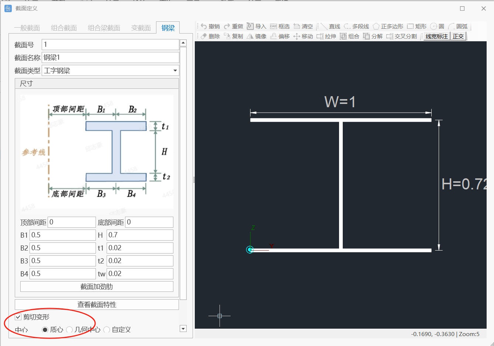

# 为何桥通梁单元模型的计算结果与教科书上的例子有差异？

| 问题分类  | 计算结果 |
| ----- | ---- |
| 用户提问  | True |
| 字段名 1 |      |
| 字段名 2 |      |

桥通梁单元模型的计算结果与教科书上的例子有微小差异，有可能是这个原因造成的：

一般来说教科书上的例子只考虑梁的弯曲变形，认为剪切变形等影响较小可忽略不计。而桥通软件默认计入梁的剪切变形，因此导致两者结果的差异。用户可根据需要取消勾选。

