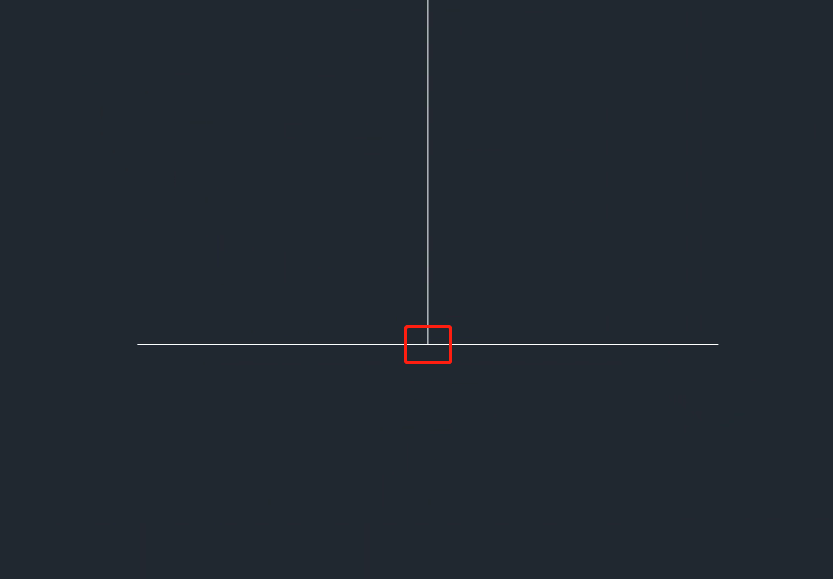
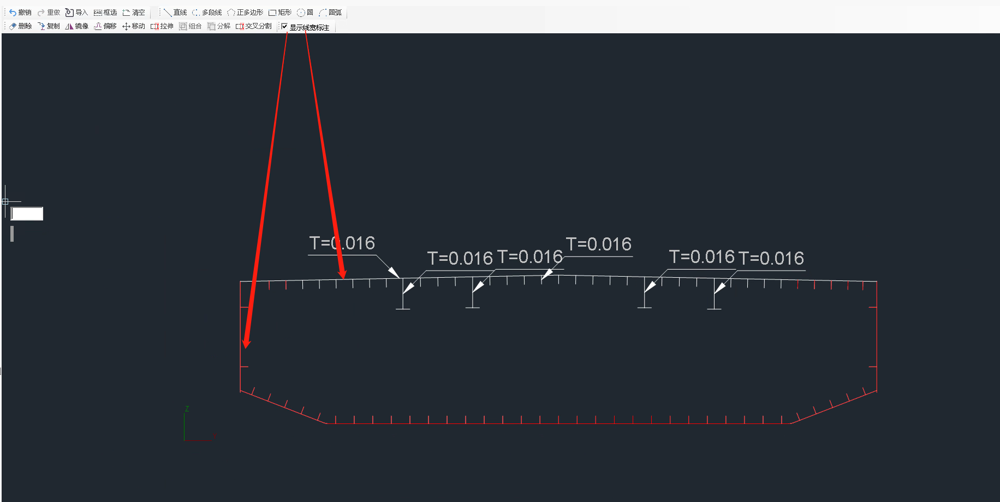

# 添加线宽型截面时，无法计算截面特性

| 问题分类  | 前处理界面 |
| ----- | ----- |
| 用户提问  | True  |
| 字段名 1 |       |
| 字段名 2 |       |

添加**线宽型截面时**需要注意到以下几点：

1. 直线与直线直接必须要交叉或者接触。

**标准连接示意图(交叉或者接触)**

**错误连接示意图(未建立连接关系)**

**错误连接示意图(2号线超出部分恰好为1号线的宽度)**

1. 每段直线必须赋值线宽

打开截面的“显示线宽标注功能” 没有赋值线宽的标注为红色

