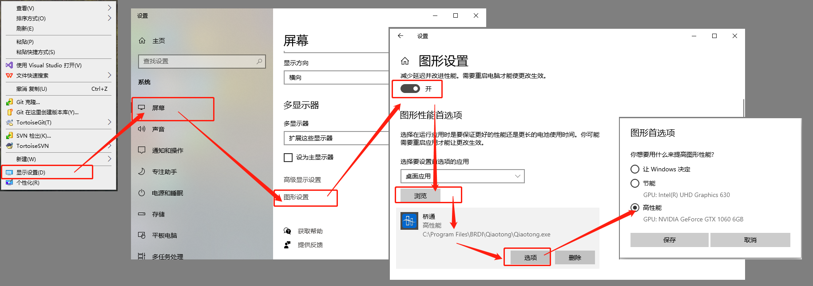
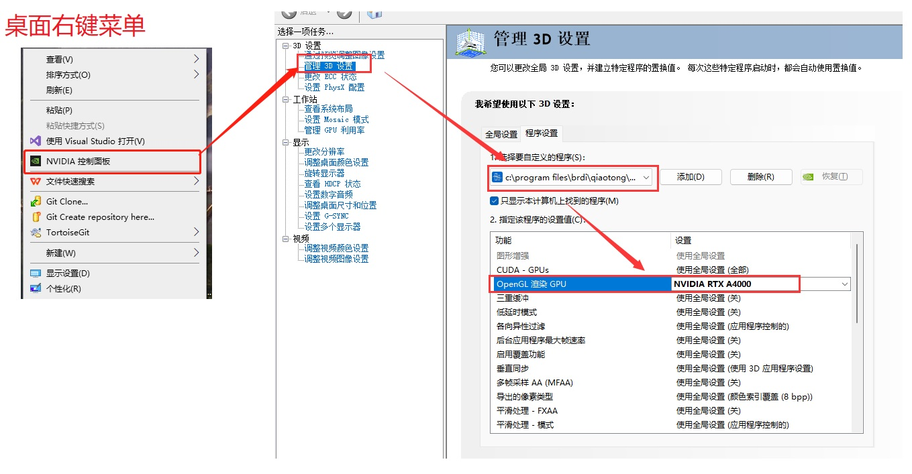
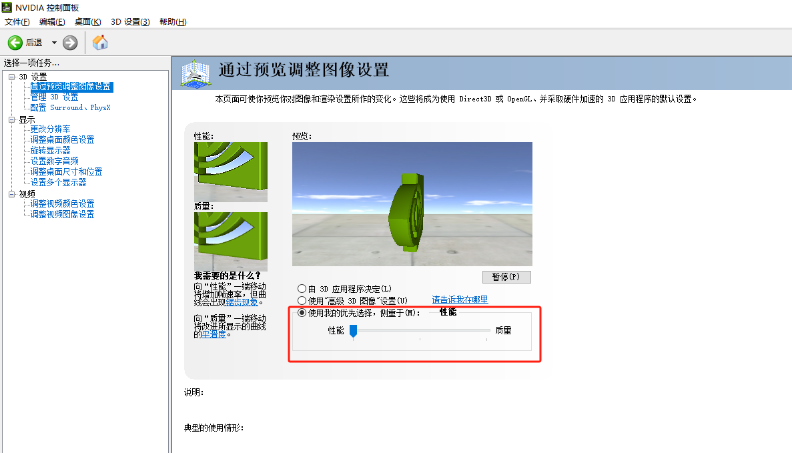

# **软件**启动时三维模型区域不显示如何处理？

| 问题分类  | 其他问题 |
| ----- | ---- |
| 用户提问  | True |
| 字段名 1 |      |
| 字段名 2 |      |

三维模型区域黑屏或白屏，其他控件正常，或者三维模型区域只有背景，没有模型，框选还能选中节点单元，一般为显卡设置问题，按下图进行设置

也可以在显卡中进行设置，以英伟达显卡为例，按下图进行设置。

如果是笔记本电脑 还需要调整：

